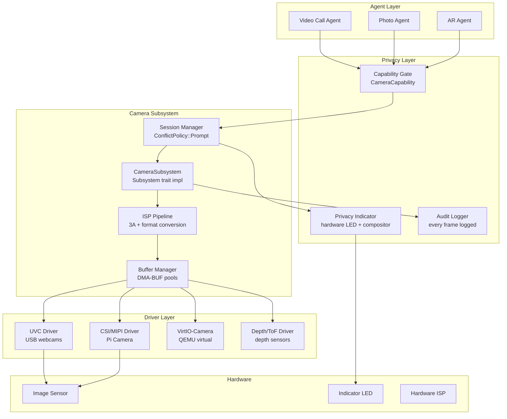
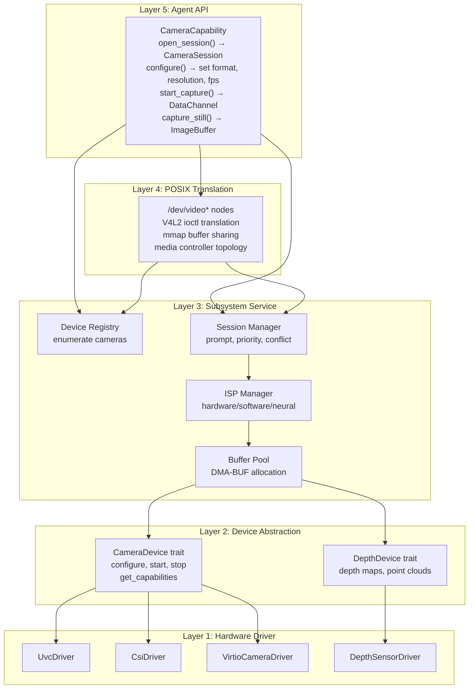
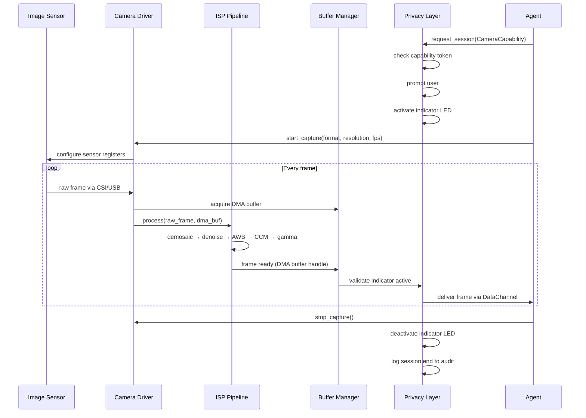

# AIOS Camera Subsystem

## Deep Technical Architecture

**Parent document:** [architecture.md](../project/architecture.md)
**Related:** [subsystem-framework.md](./subsystem-framework.md) — Universal hardware abstraction (capability gate, sessions, data channels, audit, power, POSIX bridge), [usb/device-classes.md](./usb/device-classes.md) — UVC driver architecture (§4.4), [compositor.md](./compositor.md) — Viewfinder surface compositing, [gpu.md](./gpu.md) — GPU memory management and wgpu integration, [audio.md](./audio.md) — Companion subsystem for A/V sync, [input.md](./input.md) — Gesture input from camera

**Note:** The camera subsystem implements the subsystem framework. Its capability gate, session model, audit logging, power management, and POSIX bridge follow the universal patterns defined in the framework document. This document covers the camera-specific design decisions and architecture.

-----

## Document Map

This document was split for navigability. Each sub-document preserves the original section numbers for cross-reference stability.

| Document | Sections | Content |
|---|---|---|
| **This file** | §1–§2, §14–§16 | Core insight, architecture overview, implementation order, design principles, future directions |
| [devices.md](./camera/devices.md) | §3 | Device taxonomy (USB/UVC, CSI/MIPI, VirtIO-Camera, depth/ToF), discovery, hotplug, multi-camera enumeration |
| [pipeline.md](./camera/pipeline.md) | §4, §5 | Capture pipeline (format negotiation, frame delivery, zero-copy DMA, buffer management), ISP pipeline (3A algorithms, format conversion, still capture, RAW) |
| [sessions.md](./camera/sessions.md) | §6 | Session lifecycle, multi-app conflict (Prompt policy), SessionIntent, viewfinder indicators, session priority |
| [drivers.md](./camera/drivers.md) | §7 | UVC driver, CSI/MIPI driver, VirtIO-Camera virtual driver, platform-specific drivers (Pi Camera, Apple ISP) |
| [security.md](./camera/security.md) | §8, §9 | Privacy & security: hardware LED enforcement, anti-silent-capture, capability system, recording consent, content screening, audit, privacy indicators |
| [integration.md](./camera/integration.md) | §10 | Compositor viewfinder surfaces, Flow frame streaming, POSIX bridge (/dev/video*), accessibility, audio sync, input subsystem gesture bridge |
| [ai-native.md](./camera/ai-native.md) | §11, §12, §13 | AIRS-dependent features (scene understanding, smart framing, computational photography, gesture recognition, anomaly detection), kernel-internal ML, future directions |

-----

## §1 Core Insight

**Every frame is a trust decision.**

The camera is the most privacy-sensitive subsystem in any operating system. A microphone captures audio — concerning, but bounded. A camera captures the user's face, their environment, documents on their desk, other people in the room. The attack surface is not just the user but everyone in the field of view.

Traditional operating systems treat camera access as a permission toggle: grant once, capture forever. Android added a green indicator dot in version 12. iOS enforces a hardware LED on newer devices. Linux V4L2 has no mandatory privacy indicators whatsoever — any process with `/dev/video*` access can capture silently.

AIOS takes a fundamentally different position: **the camera subsystem is designed around distrust.** Every frame delivery requires active proof that the user consented, the hardware indicator is lit, and the capturing agent's declared purpose matches its behavior. There are no backdoors, no silent capture paths, and no way for userspace to disable the hardware indicator.

This is not paranoia — it is the minimum bar for an AI-first operating system where agents act autonomously. When an AI agent requests camera access to "help you in a video call," the system must verify that claim, display the access visibly, and audit every frame. The user must always know what is seeing through their camera, and must always be able to stop it.

### Core Design Decisions

1. **ConflictPolicy::Prompt** — every new camera session requires explicit user approval, unlike audio (Share) or storage (filesystem layer). There are no auto-grant rules for camera access regardless of trust level.

2. **Hardware indicator enforcement** — the kernel controls the camera indicator LED via direct MMIO. Userspace cannot suppress it. On hardware without a dedicated LED (VirtIO-Camera, some USB webcams), the compositor renders an unfakeable software indicator.

3. **Anti-silent-capture validation** — before delivering any frame to an agent, the kernel validates that the privacy indicator is active. This is a hard check in the frame delivery path, not an advisory policy.

4. **Purpose-bound sessions** — agents declare why they want camera access (video call, photo capture, AR overlay, security monitoring). The system can detect and flag behavior inconsistent with the declared purpose (e.g., capturing frames in background while displaying unrelated content).

5. **Zero-copy by default** — frames flow from sensor to GPU via DMA buffers without CPU copies. The CPU touches frame data only when ISP processing is required or when the agent explicitly requests CPU-accessible buffers.

### Architecture Position



### Contrast with Other Systems

| Feature | Linux V4L2 | Android 12+ | iOS/macOS | AIOS |
|---|---|---|---|---|
| Privacy indicator | None | Software dot | Hardware LED + software | Hardware LED + compositor + kernel enforcement |
| Access control | Unix permissions | Permission dialog (one-time) | Permission dialog (one-time) | Capability token per session, always prompted |
| Silent capture | Trivial | Possible (dot can be missed) | Difficult (LED is wired) | Impossible (kernel validates indicator) |
| Background capture | Unrestricted | Foreground service required | Limited | Audited + anomaly detection |
| Audit trail | None | Partial (permission grants) | Partial (Privacy Report) | Every frame request logged with purpose |
| ISP pipeline | libcamera IPA modules | Camera HAL3 vendor impl | Apple ISP (proprietary) | Pluggable: hardware, software, or neural |
| Multi-camera | V4L2 media controller | Camera2 API multi-camera | AVFoundation | First-class with synchronized capture |

-----

## §2 Architecture Overview

The camera subsystem follows the five-layer architecture defined by the subsystem framework, with camera-specific specializations at each layer.



### Data Flow: Sensor to Agent



-----

## §14 Implementation Order

The camera subsystem is implemented across multiple development phases, building complexity incrementally.

```text
Phase 24 (USB):  UVC driver basics
                 ├── UVC device discovery via USB subsystem routing (class 0x0E)
                 ├── UVC probe/commit format negotiation
                 ├── Isochronous transfer setup for frame streaming
                 ├── Basic frame assembly (UVC payload headers)
                 └── Test: capture test frame from USB webcam in QEMU

Phase 32 (Camera):  Full camera subsystem
                    ├── CameraSubsystem registration with framework
                    ├── CameraCapability type and capability gate integration
                    ├── CameraSession lifecycle (open/configure/stream/close)
                    ├── ConflictPolicy::Prompt implementation
                    ├── Privacy indicator enforcement (compositor + kernel LED)
                    ├── Anti-silent-capture validation in frame delivery
                    ├── ISP pipeline (software ISP: demosaic, AWB, AEC, gamma)
                    ├── Buffer management with DMA-BUF pool
                    ├── Format negotiation (MJPEG, NV12, YUY2)
                    ├── Still image capture path
                    ├── VirtIO-Camera virtual driver for QEMU
                    ├── POSIX bridge: /dev/video* with V4L2 ioctl translation
                    ├── Audit logging (session + frame-level)
                    ├── Compositor integration (CameraPreview content type)
                    ├── Flow integration (VideoFrame entries)
                    └── Test: capture and display camera preview in compositor

Phase 39 (Hardware):  Raspberry Pi camera support
                      ├── CSI/MIPI driver (bcm2835-unicam equivalent)
                      ├── Pi Camera Module v2/v3 sensor support
                      ├── Hardware ISP integration (Pi 5 ISP)
                      ├── Device tree camera discovery
                      ├── Dual CSI port support (Pi 5)
                      └── Test: live camera preview from Pi Camera Module

Phase 39 (Hardware):  Multi-camera and depth
                      ├── Multi-camera enumeration and synchronized capture
                      ├── Depth/ToF sensor driver
                      ├── Depth map delivery (DepthDevice trait)
                      ├── Stereo depth estimation (software)
                      ├── Multi-camera session management
                      └── Test: stereo capture from dual CSI cameras

Phase 36 (Wayland):  Advanced POSIX and compatibility
                     ├── V4L2 media controller topology exposure
                     ├── V4L2 sub-device interface
                     ├── mmap buffer sharing for V4L2 clients
                     ├── Video4Linux2 ioctl coverage (VIDIOC_* set)
                     └── Test: standard V4L2 app captures frames via /dev/video0

Phase 41 (AIRS):  AI-native camera features
                  ├── Neural ISP (learned 3A: AEC, AWB, AF)
                  ├── Scene classification → ISP parameter tuning
                  ├── Smart framing (auto-crop/pan, Center Stage equivalent)
                  ├── Computational photography services (HDR, night mode, portrait)
                  ├── Gesture recognition → input subsystem bridge
                  ├── Anomaly detection (purpose-behavior mismatch)
                  ├── GPU-accelerated software ISP
                  └── Test: AIRS-driven scene-adaptive ISP in video call
```

-----

## §15 Design Principles

1. **Every frame is a trust decision.** No frame is delivered to any agent without active verification that the user consented, the privacy indicator is active, and the capability token is valid. This check is in the hot path — performance is secondary to privacy in the frame delivery pipeline.

2. **Hardware indicators cannot be software-disabled.** The camera indicator LED is controlled by kernel MMIO writes to a GPIO or dedicated indicator controller. No userspace API exists to suppress it. On hardware without a wired LED, the compositor renders a persistent, unfakeable indicator at the highest z-order.

3. **No silent capture — ever.** The anti-silent-capture check in the frame delivery path is a hard gate, not a policy. If the indicator validation fails, frames are dropped and the session is terminated. There are no exceptions for system services, trust levels, or agent types.

4. **Capability-gated from sensor to agent.** The `CameraCapability` token specifies maximum resolution, frame rate, duration, and purpose. The capability gate enforces these limits at session creation. Capabilities are attenuable — an agent can delegate a reduced-resolution subcapability but never escalate beyond its own grant.

5. **Zero-copy is the default path.** Frames flow from sensor hardware through DMA buffers directly to GPU textures (for compositor rendering) or to agent-accessible shared memory regions. CPU copies occur only when software ISP processing is required or the agent explicitly requests CPU-readable buffers. The `ZeroCopyChannel` from the subsystem framework is the primary data delivery mechanism.

6. **ISP is pluggable.** The ISP pipeline supports three backends: hardware ISP (platform-specific, e.g., Pi 5 ISP), software ISP (CPU or GPU-accelerated), and neural ISP (AIRS-managed learned models). The `IspBackend` trait abstracts all three. The subsystem selects the best available backend at session creation time.

7. **Multi-camera is first-class.** The subsystem enumerates all cameras as a topology, not a flat list. Stereo pairs, front/back cameras, and wide/ultra-wide combinations are represented as camera groups with synchronized capture capabilities. Multi-camera is not an afterthought bolted onto a single-camera API.

8. **POSIX bridge enables V4L2 compatibility.** The `/dev/video*` nodes expose a V4L2-compatible ioctl interface so that standard Linux camera applications (ffmpeg, gstreamer, OBS) work with minimal or no modification. The media controller topology is also exposed for applications that need ISP pipeline control.

9. **Audit everything.** Every session open, frame delivery, capability check, format change, and session close is logged to the audit space with agent ID, timestamp, resolution, and declared purpose. The audit trail is immutable and queryable — the Inspector application (see [inspector.md](../applications/inspector.md)) provides cross-subsystem camera access history.

10. **Privacy over convenience.** Camera access is always prompted, never auto-granted. Even system services with Trust Level 1 must present a user-visible justification for camera access. The prompt is a compositor-rendered dialog that no agent can dismiss programmatically. The user can always say no.

-----

## §16 Future Directions

Research-informed capabilities planned for later phases or hardware generations.

### §16.1 Depth Sensing and 3D Capture

Time-of-Flight (ToF) sensors provide per-pixel depth at millimeter accuracy. The `DepthDevice` trait delivers depth maps alongside color frames, enabling:

- **Point cloud generation** — 3D reconstruction from depth + color for AR/VR applications
- **Depth-from-stereo** — software depth estimation from dual cameras when no ToF sensor is present
- **Background segmentation** — hardware-accelerated foreground/background separation for portrait mode and video calls
- **Gesture depth** — z-axis information for hand tracking, enabling fine-grained 3D gesture input
- **Room mapping** — spatial understanding for AR agents that need to place virtual objects in physical space

### §16.2 Computational Video

Real-time video enhancement beyond still photography:

- **Background replacement** — real-time background segmentation and compositing without green screen, running as a compositor filter node
- **Video stabilization** — gyroscope-assisted electronic stabilization as an ISP post-processing stage
- **Super-resolution upscaling** — neural upscaling of low-resolution captures for bandwidth-constrained video calls
- **Temporal denoising** — multi-frame denoising exploiting temporal coherence for improved low-light video
- **Video HDR** — per-frame tone mapping with temporal consistency (no flickering between HDR and SDR regions)

### §16.3 Neural ISP Pipeline

Full replacement of the traditional ISP pipeline with learned neural models:

- **End-to-end neural ISP** — a single DNN that takes raw Bayer sensor data and produces a finished RGB image, replacing the entire demosaic → denoise → WB → CCM → gamma chain. Research (NTIRE 2024, AISP library) shows neural ISPs outperforming hand-tuned pipelines on perceptual quality metrics.
- **Sensor-specific fine-tuning** — the neural ISP can be fine-tuned for specific sensor characteristics (noise profile, color response) via on-device calibration, stored per-device.
- **Adaptive model selection** — AIRS selects between lightweight models (real-time video) and high-quality models (still capture) based on session intent and available compute.

### §16.4 Multi-Camera Fusion

Advanced multi-camera capabilities beyond basic synchronized capture:

- **Panoramic stitching** — real-time panorama from multiple cameras with overlap-aware blending
- **360° capture** — omnidirectional video from camera arrays, with equirectangular or cubemap output
- **Computational zoom** — seamless transition between wide and telephoto cameras with neural interpolation in the overlap range
- **Light field capture** — plenoptic imaging from camera arrays for post-capture refocusing

### §16.5 Privacy-Preserving Camera Intelligence

Techniques that provide camera AI features without compromising privacy:

- **Federated learning for ISP tuning** — improve ISP quality models across devices without centralizing raw images. Each device contributes gradient updates from its own captures; the aggregated model improves for all devices.
- **Differential privacy for scene statistics** — collect scene classification statistics (indoor/outdoor, lighting conditions) with formal privacy guarantees (ε-differential privacy) to improve system-wide defaults.
- **On-device face recognition** — face ID and face-based features run entirely on-device with no cloud component. Face embeddings never leave the device.
- **Homomorphic frame analysis** — experimental: analyze encrypted frames for content classification without decryption, enabling cloud-assisted features without exposing raw imagery.

### §16.6 Formal Verification of Camera Access Control

Apply seL4-style formal verification to the camera capability system:

- **Proof that no frame is delivered without active indicator** — mechanically verify the anti-silent-capture invariant across all code paths
- **Proof that capability attenuation is monotonic** — verify that delegated capabilities never exceed the parent's permissions
- **Proof that audit logging is complete** — verify that every frame delivery triggers an audit entry

### §16.7 VR/AR Camera Integration

Camera as an input device for immersive computing:

- **Passthrough rendering** — low-latency camera-to-display path for AR headset passthrough, targeting <20ms motion-to-photon latency
- **Mixed reality compositing** — compositor blends virtual surfaces with camera feed based on depth information
- **Hand tracking** — camera-based hand tracking as a first-class input device (see [input.md](./input.md) §11.1)
- **Eye tracking** — gaze-based interaction from IR cameras in VR headsets

-----

## Cross-Reference Index

| Reference | Location | Topic |
|---|---|---|
| §1 Core Insight | **This file** | Privacy-first design, contrast with other OSes |
| §2 Architecture Overview | **This file** | 5-layer stack, data flow diagrams |
| §3.1 Device Taxonomy | [devices.md](./camera/devices.md) | USB/UVC, CSI/MIPI, VirtIO-Camera, depth/ToF |
| §3.2 Device Discovery | [devices.md](./camera/devices.md) | Hotplug, device tree, USB class routing |
| §3.3 Multi-Camera Topology | [devices.md](./camera/devices.md) | Camera groups, stereo pairs, synchronized capture |
| §3.4 Camera Capabilities Descriptor | [devices.md](./camera/devices.md) | Resolution, format, frame rate enumeration |
| §4.1 Format Negotiation | [pipeline.md](./camera/pipeline.md) | UVC probe/commit, media controller topology |
| §4.2 Frame Delivery | [pipeline.md](./camera/pipeline.md) | Packet assembly, CSI-2 lanes, completion callbacks |
| §4.3 Buffer Management | [pipeline.md](./camera/pipeline.md) | DMA-BUF pools, pre-allocation, zero-copy |
| §4.4 Zero-Copy Paths | [pipeline.md](./camera/pipeline.md) | DMA-BUF → wgpu texture, compositor direct scanout |
| §4.5 Frame Timing | [pipeline.md](./camera/pipeline.md) | PTS timestamps, multi-camera sync |
| §5.1 Traditional ISP Pipeline | [pipeline.md](./camera/pipeline.md) | Demosaic → denoise → AWB → CCM → gamma |
| §5.2 3A Algorithms | [pipeline.md](./camera/pipeline.md) | Auto-exposure, auto-white-balance, auto-focus |
| §5.3 Hardware ISP | [pipeline.md](./camera/pipeline.md) | Platform-specific ISP integration |
| §5.4 Software ISP | [pipeline.md](./camera/pipeline.md) | CPU and GPU-accelerated fallback |
| §5.5 Still Capture | [pipeline.md](./camera/pipeline.md) | Full-resolution still image path |
| §5.6 RAW Capture | [pipeline.md](./camera/pipeline.md) | Unprocessed sensor data for advanced users |
| §6.1 Session Lifecycle | [sessions.md](./camera/sessions.md) | Request → prompt → open → configure → stream → close |
| §6.2 SessionIntent | [sessions.md](./camera/sessions.md) | Purpose, resolution, frame rate, duration |
| §6.3 Conflict Resolution | [sessions.md](./camera/sessions.md) | Prompt policy, multi-session, priority |
| §6.4 Viewfinder Indicator | [sessions.md](./camera/sessions.md) | Mandatory compositor overlay |
| §7.1 UVC Driver | [drivers.md](./camera/drivers.md) | USB Video Class driver |
| §7.2 CSI/MIPI Driver | [drivers.md](./camera/drivers.md) | MIPI CSI-2 receiver, sensor subdevice |
| §7.3 VirtIO-Camera Driver | [drivers.md](./camera/drivers.md) | Virtual camera for QEMU |
| §7.4 Platform Drivers | [drivers.md](./camera/drivers.md) | Pi Camera, Apple ISP |
| §7.5 CameraDevice Trait | [drivers.md](./camera/drivers.md) | Driver interface specification |
| §8.1 Hardware LED Enforcement | [security.md](./camera/security.md) | Kernel-controlled indicator LED |
| §8.2 Anti-Silent-Capture | [security.md](./camera/security.md) | Frame delivery validation gate |
| §8.3 CameraCapability | [security.md](./camera/security.md) | Capability token structure and enforcement |
| §8.4 Recording Consent | [security.md](./camera/security.md) | Multi-party consent for video calls |
| §8.5 Content Screening | [security.md](./camera/security.md) | On-device content classification |
| §8.6 Audit Trail | [security.md](./camera/security.md) | Frame-level audit logging |
| §8.7 Physical Privacy | [security.md](./camera/security.md) | Hardware kill switches |
| §9.1 Compositor Indicator | [security.md](./camera/security.md) | Green dot, status bar recording indicator |
| §9.2 Hardware LED Path | [security.md](./camera/security.md) | MMIO GPIO control |
| §9.3 Screenshot Warning | [security.md](./camera/security.md) | Screen capture with camera preview |
| §10.1 Compositor Integration | [integration.md](./camera/integration.md) | CameraPreview content type |
| §10.2 Flow Integration | [integration.md](./camera/integration.md) | VideoFrame entries in Flow |
| §10.3 POSIX Bridge | [integration.md](./camera/integration.md) | /dev/video*, V4L2 ioctl |
| §10.4 Audio Sync | [integration.md](./camera/integration.md) | Lip-sync via shared timeline |
| §10.5 Accessibility | [integration.md](./camera/integration.md) | Audio description, high-contrast indicators |
| §10.6 Input Bridge | [integration.md](./camera/integration.md) | Gesture recognition → InputEvent |
| §11 AI-Native Camera | [ai-native.md](./camera/ai-native.md) | AIRS-dependent features |
| §12 Kernel-Internal ML | [ai-native.md](./camera/ai-native.md) | Frozen models in camera driver |
| §13 Future Directions (AI) | [ai-native.md](./camera/ai-native.md) | Research-informed AI camera features |
| §14 Implementation Order | **This file** | Phase-by-phase build plan |
| §15 Design Principles | **This file** | 10 camera-specific invariants |
| §16 Future Directions | **This file** | Depth, computational video, neural ISP, VR/AR |
