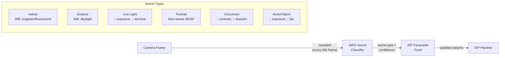
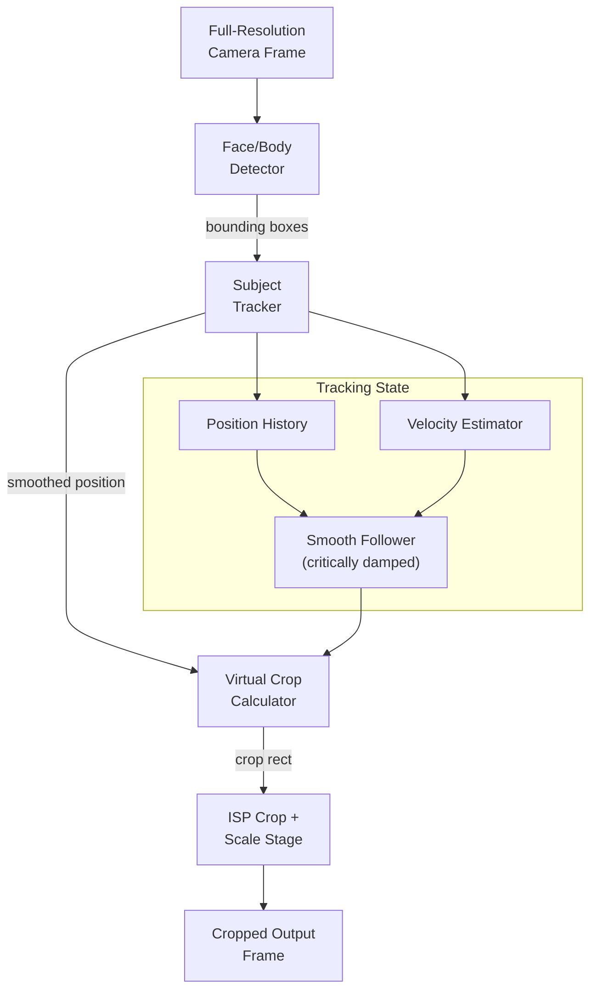

# AIOS AI-Native Camera

Part of: [camera.md](../camera.md) — Camera Subsystem
**Related:** [intelligence/airs.md](../../intelligence/airs.md) — AI Runtime Service, [pipeline.md](./pipeline.md) — ISP pipeline and 3A algorithms, [security.md](./security.md) — Privacy enforcement for AI features, [integration.md](./integration.md) — Input subsystem gesture bridge

-----

## §11 AI-Native Camera (AIRS-Dependent)

These features require the AI Runtime Service (AIRS) for semantic understanding and context awareness. They represent the camera subsystem's AI-first design — capabilities that distinguish AIOS from traditional operating systems.

### §11.1 Scene Understanding

AIRS analyzes camera frames to classify the scene type and optimize ISP parameters accordingly:



**Scene classification model**: A lightweight CNN (~500KB) classifies frames into scene categories with confidence scores. The model runs on AIRS inference hardware (GPU or NPU) and processes sampled frames (not every frame — typically every 10th frame or every 500ms, whichever is less frequent).

**ISP parameter optimization per scene:**

| Scene Type | AE Adjustment | AWB Preset | Denoise | Sharpen | AF Mode |
|---|---|---|---|---|---|
| Indoor | Bias +0.3 EV | Tungsten/Fluorescent | Medium | Low | Continuous |
| Outdoor | Neutral | Daylight | Low | Medium | Single |
| Low Light | Bias +1.0 EV, max gain | Auto (warm bias) | High | Off | Single |
| Portrait | Face-weighted metering | Skin tone bias | Medium | Low | Face-detect AF |
| Document | Bias -0.5 EV | Neutral | Off | High | Macro |
| Action | Min exposure time | Auto | Low | Medium | Continuous |

The ISP tuner applies parameter changes smoothly over 5–10 frames to avoid abrupt visual transitions. The agent can override scene detection by specifying a preferred scene mode in the `SessionIntent`.

### §11.2 Smart Framing

Auto-framing keeps subjects centered and appropriately sized in the camera view, similar to Apple's Center Stage:



**How it works:**

1. The camera captures at a higher resolution than the output (e.g., 4K capture for 1080p output)
2. AIRS face/body detection identifies subjects in each frame
3. A subject tracker maintains position history with velocity estimation
4. A critically-damped smooth follower computes the crop region (avoids jittery panning)
5. The ISP crops and scales the frame to the output resolution

**Configuration:**

```rust
/// Smart framing configuration.
pub struct SmartFramingConfig {
    /// Whether smart framing is enabled.
    pub enabled: bool,
    /// Input resolution (must be larger than output for crop headroom).
    pub input_resolution: Resolution,
    /// Output resolution (what the agent receives).
    pub output_resolution: Resolution,
    /// Framing mode.
    pub mode: FramingMode,
    /// Smoothing factor (higher = smoother but slower to respond).
    pub smoothing: f32,
    /// Zoom limits (1.0 = no zoom, 2.0 = max 2× digital zoom).
    pub zoom_range: (f32, f32),
}

pub enum FramingMode {
    /// Keep a single primary subject centered.
    SingleSubject,
    /// Frame all detected subjects (zoom out to fit group).
    GroupFrame,
    /// Speaker tracking — follow the person who is talking.
    SpeakerTracking,
    /// Fixed crop region (user-specified).
    FixedCrop { region: Rect },
}
```

**Speaker tracking** integrates with the audio subsystem: the audio capture pipeline's direction-of-arrival estimation (if multi-microphone array is available) provides a direction hint. AIRS correlates the audio direction with detected face positions to identify the active speaker.

### §11.3 Computational Photography Services

AIOS provides computational photography as system services, not per-app implementations. Any agent can request these services through the camera session API.

#### HDR Capture

Multi-frame High Dynamic Range imaging:

1. The camera captures a burst of frames at different exposure levels (bracket: -2EV, 0EV, +2EV)
2. AIRS aligns frames (compensating for hand movement between exposures)
3. Exposure fusion combines the best-exposed regions from each frame
4. Tone mapping compresses the result to displayable range

The entire HDR pipeline runs as an AIRS service. The agent calls `capture_still(StillCaptureRequest { hdr: true, .. })` and receives a finished HDR image. No per-app HDR implementation is needed.

#### Night Mode

Low-light computational photography:

1. Capture 8–16 frames at maximum exposure time (constrained by hand-shake limit, typically 1/4s)
2. AIRS aligns frames using feature matching (robust to hand movement)
3. Multi-frame averaging reduces noise (√N improvement, where N = frame count)
4. Neural denoising removes remaining noise while preserving detail
5. Tone mapping and local contrast enhancement brighten the result

Night mode requires a stable camera (tripod or hand-held with <10° motion). The system detects excessive motion and reduces frame count accordingly.

#### Portrait Mode

Simulated shallow depth-of-field:

1. Capture a frame (or use a depth sensor if available)
2. AIRS segments the foreground subject (person, face, body)
3. If no depth sensor: estimate depth from a monocular depth model
4. Apply depth-dependent blur (circle of confusion proportional to distance from focus plane)
5. Preserve subject edges with edge-aware matting

With a depth sensor (see [camera.md](../camera.md) §16.1), portrait mode uses real depth data for physically accurate bokeh. Without a depth sensor, the monocular depth model provides acceptable results for typical portrait distances (0.5–3m).

#### Panorama Stitching

Wide-angle panorama capture:

1. Agent captures a sequence of overlapping frames (the camera subsystem provides a real-time overlap indicator)
2. AIRS detects feature points and matches across frames
3. Homography estimation aligns frame pairs
4. Blending with feathering at seams produces a seamless panorama
5. Output: equirectangular projection or cylindrical projection

### §11.4 Gesture Recognition

Camera-based gesture recognition provides hands-free interaction:

```rust
/// Gesture recognition results delivered to the input subsystem.
pub enum CameraGesture {
    /// Hand landmark detection (21 points per hand).
    HandLandmarks {
        hand: HandSide,
        landmarks: [Point3D; 21],
        confidence: f32,
    },
    /// Recognized hand gesture.
    HandGesture {
        gesture: HandGestureType,
        hand: HandSide,
        confidence: f32,
    },
    /// Body pose estimation (33 keypoints).
    BodyPose {
        keypoints: [Point3D; 33],
        confidence: f32,
    },
    /// Head position and orientation.
    HeadPose {
        position: Point3D,
        /// Euler angles (yaw, pitch, roll) in degrees.
        orientation: (f32, f32, f32),
        confidence: f32,
    },
}

pub enum HandGestureType {
    /// Open hand (palm facing camera).
    OpenPalm,
    /// Closed fist.
    ClosedFist,
    /// Pointing (index finger extended).
    Pointing,
    /// Pinch (thumb and index finger touching).
    Pinch,
    /// Thumbs up.
    ThumbsUp,
    /// Victory / peace sign.
    Victory,
    /// Swipe direction.
    Swipe(Direction),
}
```

**Privacy considerations for gesture recognition:**

- Gesture recognition runs entirely on-device (AIRS local inference)
- Only gesture events (landmarks, gesture type) are delivered to agents — never raw camera frames
- The agent does not need `CameraCapability` to receive gesture events; the system holds the camera session internally
- The user must explicitly enable camera-based gesture input in system settings
- An active privacy indicator shows "Gesture input active" while the camera is used for gestures

### §11.5 Anomaly Detection

AIRS monitors camera access patterns to detect suspicious behavior:

```rust
/// Anomaly types detected by AIRS camera monitoring.
pub enum AnomalyType {
    /// Agent captures frames in background while displaying unrelated content.
    BackgroundCapture {
        /// Agent's visible content description.
        visible_content: &'static str,
        /// Declared camera purpose.
        declared_purpose: CameraPurpose,
    },
    /// Capture rate exceeds declared purpose needs.
    ExcessiveCapture {
        /// Actual frames per second.
        actual_fps: u32,
        /// Expected fps for declared purpose.
        expected_fps: u32,
    },
    /// Agent saves frames to storage without recording capability.
    UndeclaredRecording,
    /// Camera access at unusual time (e.g., 3 AM, device idle).
    UnusualTiming {
        /// Local time of access.
        local_hour: u8,
    },
    /// Rapid session open/close cycling (probing behavior).
    SessionCycling {
        /// Number of sessions in the observation window.
        session_count: u32,
        /// Observation window in seconds.
        window_secs: u32,
    },
}
```

**Anomaly response:**

1. **Low confidence** — log to audit trail for later review
2. **Medium confidence** — display a notification: "Video Call agent is using camera in an unusual way"
3. **High confidence** — pause the session and prompt the user: "Suspicious camera activity detected. Continue allowing access?"

Anomaly detection runs only with user opt-in and uses on-device analysis. No camera data is sent to external services for anomaly classification.

-----

## §12 Kernel-Internal ML

These features run as frozen models within the camera driver or ISP pipeline, with no AIRS dependency. They work even when AIRS is offline or unavailable.

### §12.1 Face Detection Trigger

A lightweight face detector (~50KB model, decision tree ensemble) runs in the ISP pipeline to trigger face-aware 3A:

- **Auto-exposure**: face detection provides a region of interest for exposure metering. The AE algorithm biases exposure to properly expose detected faces rather than the overall scene.
- **Auto-focus**: face detection drives face-detect autofocus (FDAF). When faces are detected, the AF algorithm focuses on the nearest face rather than the center of the frame.
- **Smart framing trigger**: face detection starts/stops the AIRS smart framing pipeline. When no faces are detected, smart framing is paused (saving AIRS inference cost).

The face detector outputs bounding boxes only — no identity, no embedding, no recognition. It cannot tell who a face belongs to; it only detects that a face is present and where.

### §12.2 Adaptive Exposure Model

A small statistical model (logistic regression, ~2KB) predicts optimal exposure settings based on histogram features:

- **Inputs**: brightness histogram percentiles (10th, 25th, 50th, 75th, 90th), highlight/shadow clipping ratios, scene brightness variance
- **Outputs**: target mean brightness, exposure bias, gain limit
- **Training**: trained offline on a dataset of exposure-quality pairs, weights frozen at compile time

This model complements the traditional PID-based AE controller by providing faster convergence for scene changes (e.g., entering a dark room from outdoors).

### §12.3 Motion Detection

Frame-to-frame motion detection for power management and event triggering:

- **Algorithm**: compute frame difference (absolute pixel difference) between consecutive frames, threshold to binary, count changed pixels
- **Uses**: wake-from-idle on motion (security camera mode), detect camera obstruction (covered lens), trigger temporal denoising when motion is low

Motion detection runs at low resolution (160×120 downscaled) and low frame rate (5fps) for minimal CPU cost (<1% continuous).

-----

## §13 Future Directions (AI Camera)

Research-informed AI camera capabilities planned for future development.

### §13.1 End-to-End Neural ISP

Replace the entire traditional ISP pipeline (§5.1) with a single neural network:

- **Architecture**: U-Net or transformer-based model that takes raw Bayer input and produces finished RGB output
- **Advantages**: learns sensor-specific optimizations, handles complex noise patterns better than hand-tuned denoise, produces more natural color rendering
- **Training**: requires paired raw + ground-truth datasets per sensor (can be captured via AIOS calibration tool)
- **Deployment**: AIRS runs the neural ISP model on GPU/NPU, with traditional ISP as fallback when AIRS is unavailable

Research basis: NTIRE 2024 Learned ISP Challenge (CVPR Workshop), AISP library (mv-lab/AISP), "ISP Meets Deep Learning" survey (ACM Computing Surveys 2025).

### §13.2 Video Super-Resolution

Real-time neural upscaling for video calls:

- **Use case**: capture at 720p (lower bandwidth, less sensor noise) and upscale to 1080p for display
- **Architecture**: lightweight temporal super-resolution model (~2MB) that exploits frame-to-frame coherence
- **Latency**: <5ms per frame on GPU (single forward pass)
- **Quality**: perceptually superior to bilinear/bicubic upscaling, approaching capture-native 1080p

### §13.3 Semantic Segmentation as OS Service

Real-time pixel-level segmentation of camera frames:

- **Person segmentation**: foreground/background for video calls (background blur, replacement)
- **Object segmentation**: identify objects in the scene for AR anchoring
- **Sky segmentation**: separate sky from ground for HDR tone mapping

Segmentation masks are delivered alongside video frames as an optional alpha channel. Agents request segmentation via `SessionIntent.needs_segmentation = true`.

### §13.4 Privacy-Preserving Facial Analysis

On-device facial analysis features that preserve privacy:

- **Attention detection**: detect if the user is looking at the screen (for auto-dim, presence detection)
- **Expression estimation**: detect smile, surprise, etc. for video call emoji reactions
- **Liveness detection**: prevent photo-based spoofing of face-based features

All analysis runs locally on AIRS. No facial embeddings, identity information, or raw face data leaves the device. The camera subsystem delivers only abstract events (attention: true/false, expression: smile, liveness: live) to authorized agents.

### §13.5 Cross-Camera Learning

Federated learning for improving camera quality across AIOS devices:

- **ISP tuning**: each device contributes gradient updates from its local ISP quality assessments (no raw images shared)
- **Scene classifier training**: scene classification accuracy improves as more devices contribute labeled scenes (labels derived from user behavior, e.g., user enables night mode → low-light scene)
- **Differential privacy**: all federated updates use ε-differential privacy (ε=1.0) to prevent inference of individual user data from model updates

### §13.6 Multimodal Camera Intelligence

Combining camera data with other sensor data for richer understanding:

- **Camera + audio** — detect who is speaking in a group video call (lip movement + audio direction)
- **Camera + IMU** — stabilize video using gyroscope data, detect camera shake for auto-tripod mode
- **Camera + depth** — 3D reconstruction, hand tracking with depth, AR object placement with occlusion
- **Camera + ambient light** — calibrate display white balance to match ambient lighting detected by camera
