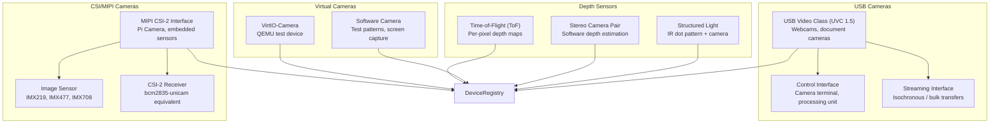
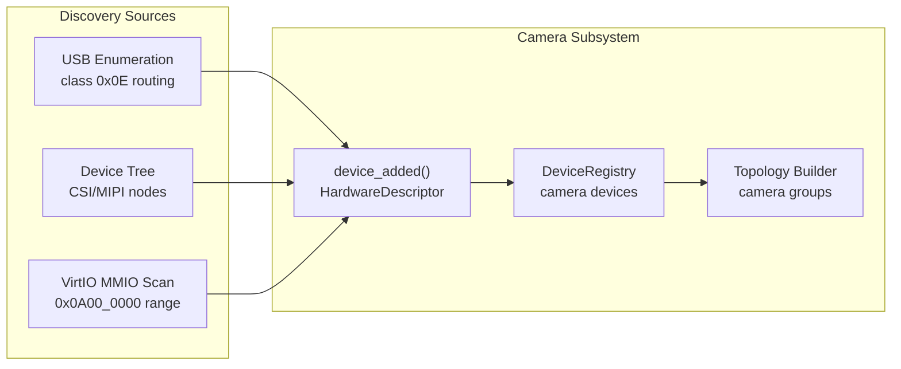

# AIOS Camera Devices & Discovery

Part of: [camera.md](../camera.md) — Camera Subsystem
**Related:** [usb/device-classes.md](../usb/device-classes.md) — UVC driver architecture (§4.4), [device-model.md](../../kernel/device-model.md) — Device registry and HardwareDescriptor, [subsystem-framework.md](../subsystem-framework.md) — Device discovery patterns (§10–§12)

-----

## §3 Camera Devices & Discovery

### §3.1 Device Taxonomy

The camera subsystem supports four categories of camera hardware, each with distinct discovery mechanisms, data interfaces, and capabilities.



#### USB Video Class (UVC)

USB webcams and document cameras implement the USB Video Class specification (UVC 1.5). The USB subsystem handles enumeration and routes class `0x0E` devices to the camera subsystem (see [usb/device-classes.md](../usb/device-classes.md) §4.4 and §5 routing table).

UVC devices expose:

- **Video Control (VC) interface** — device topology: camera terminal (exposure, focus, zoom), processing unit (brightness, contrast, white balance, gain), selector unit (for multi-sensor devices), extension units (vendor-specific features)
- **Video Streaming (VS) interface** — frame data via isochronous (real-time streaming) or bulk (still image capture) transfers with multiple alternate settings for bandwidth allocation

Common formats and bandwidth requirements:

| Format | Type | Bandwidth (640×480@30) | Bandwidth (1920×1080@30) |
|---|---|---|---|
| MJPEG | Compressed | ~15 Mbps | ~40 Mbps |
| YUY2 | Uncompressed | ~147 Mbps | ~995 Mbps |
| NV12 | Semi-planar | ~110 Mbps | ~746 Mbps |
| H.264 | Compressed (UVC 1.5) | ~5 Mbps | ~15 Mbps |

#### CSI/MIPI Cameras

Camera Serial Interface 2 (CSI-2) is the standard interface for embedded image sensors. MIPI CSI-2 uses differential signaling over 1–4 data lanes plus a clock lane, supporting raw Bayer, YUV, and compressed data.

Supported sensors (initial targets):

| Sensor | Resolution | Interface | Notes |
|---|---|---|---|
| IMX219 | 8MP (3280×2464) | 2-lane CSI-2 | Pi Camera Module v2 |
| IMX477 | 12.3MP (4056×3040) | 2-lane CSI-2 | Pi HQ Camera |
| IMX708 | 11.9MP (4608×2592) | 2-lane CSI-2 | Pi Camera Module v3 (autofocus, HDR) |

CSI cameras require a platform-specific CSI-2 receiver (the equivalent of Linux's `bcm2835-unicam` driver on Raspberry Pi). The receiver deserializes the MIPI D-PHY signals and writes raw frame data to memory via DMA.

**Key difference from USB**: CSI sensors deliver raw Bayer data that must pass through an ISP pipeline before producing usable RGB/YUV frames. USB webcams typically perform ISP internally and deliver processed MJPEG or YUV.

#### VirtIO-Camera (Virtual)

A virtual camera device for QEMU-based development and testing. VirtIO-Camera follows the VirtIO MMIO transport pattern used by other AIOS VirtIO drivers (see [device-model/virtio.md](../../kernel/device-model/virtio.md) §10).

The virtual camera provides:

- Configurable resolution and frame rate (default: 640×480 @ 30fps)
- Generated test patterns (color bars, gradient, checkerboard, moving patterns)
- Simulated format support (NV12, YUY2, MJPEG)
- Simulated camera controls (brightness, contrast, exposure)
- Privacy indicator simulation (LED state visible in QEMU monitor)
- Multi-camera simulation (configurable number of virtual cameras)

VirtIO-Camera uses a single virtqueue for command/response and a separate virtqueue for frame data, following the asymmetric request pattern.

```rust
/// VirtIO-Camera device configuration space.
#[repr(C)]
pub struct VirtioCameraConfig {
    /// Number of virtual cameras exposed.
    pub num_cameras: u32,
    /// Maximum supported resolution width.
    pub max_width: u32,
    /// Maximum supported resolution height.
    pub max_height: u32,
    /// Supported format bitmap (bit 0: NV12, bit 1: YUY2, bit 2: MJPEG).
    pub format_flags: u32,
    /// Maximum frame rate (frames per second).
    pub max_fps: u32,
}
```

#### Depth and ToF Sensors

Depth sensors provide per-pixel distance information alongside or instead of color data:

- **Time-of-Flight (ToF)** — emits modulated IR light and measures phase shift of reflections. Provides dense depth maps at 5–30fps, typical range 0.1–5m, accuracy ±1–5mm. Connected via USB (e.g., Intel RealSense) or CSI (e.g., Sony DepthSense).

- **Structured light** — projects a known IR dot pattern and computes depth from pattern distortion. Higher accuracy than ToF at close range but limited to indoor use (sunlight washes out the pattern).

- **Stereo camera pairs** — two color cameras at a known baseline. Depth computed in software via stereo matching algorithms. No special hardware beyond two cameras, but computationally expensive and less accurate than dedicated depth sensors.

Depth sensors implement the `DepthDevice` trait (see §7.5 in [drivers.md](./drivers.md)) and deliver `DepthFrame` data containing per-pixel depth values in millimeters.

### §3.2 Device Discovery

Camera devices are discovered through three mechanisms, depending on the hardware interface:



#### USB Discovery

The USB subsystem performs standard enumeration (see [usb/device-classes.md](../usb/device-classes.md) §3), identifies devices with class code `0x0E` (Video), and calls `camera_subsystem.device_added()` with a `HardwareDescriptor` containing:

- USB vendor/product ID
- Device name from USB string descriptors
- UVC version (1.0, 1.1, or 1.5)
- Interface list (control + streaming)
- Endpoint addresses and maximum packet sizes

USB camera hotplug is handled by the USB subsystem's hotplug state machine (see [usb/hotplug.md](../usb/hotplug.md) §7). The camera subsystem receives `device_added()` and `device_removed()` callbacks.

#### Device Tree Discovery (CSI/MIPI)

CSI cameras are described in the device tree:

```text
camera0: camera@10 {
    compatible = "sony,imx708";
    reg = <0x10>;
    clocks = <&cam_clk>;
    port {
        imx708_ep: endpoint {
            remote-endpoint = <&csi2_ep0>;
            data-lanes = <1 2>;
            clock-noncontinuous;
            link-frequencies = /bits/ 64 <450000000>;
        };
    };
};

csi2: csi2@7e801000 {
    compatible = "brcm,bcm2835-unicam";
    reg = <0x7e801000 0x800>, <0x7e802004 0x4>;
    clocks = <&clocks BCM2835_CLOCK_UNICAM>;
    port {
        csi2_ep0: endpoint {
            remote-endpoint = <&imx708_ep>;
        };
    };
};
```

The camera subsystem parses CSI nodes during `init()`, instantiating a `CsiDriver` for each CSI receiver and a sensor subdevice for each connected image sensor. The device tree provides lane count, clock frequencies, and sensor I2C address.

#### VirtIO MMIO Discovery

VirtIO-Camera devices are discovered during the standard VirtIO MMIO scan (0x0A00_0000–0x0A00_3E00 range). The camera subsystem recognizes the VirtIO-Camera device ID and creates a `VirtioCameraDriver` instance.

### §3.3 Multi-Camera Topology

Modern devices often have multiple cameras. The camera subsystem represents cameras as a topology rather than a flat device list.

```rust
/// A group of related cameras that can be used together.
pub struct CameraGroup {
    /// Unique group identifier.
    pub group_id: CameraGroupId,
    /// Human-readable group name (e.g., "Rear Cameras", "Stereo Pair").
    pub name: &'static str,
    /// Member cameras in this group.
    pub cameras: Vec<CameraId>,
    /// Whether synchronized capture across group members is supported.
    pub sync_capable: bool,
    /// Stereo baseline in millimeters (if stereo pair).
    pub stereo_baseline_mm: Option<u32>,
    /// Relationship between cameras in this group.
    pub topology: GroupTopology,
}

/// How cameras in a group relate to each other.
pub enum GroupTopology {
    /// Independent cameras (e.g., front + back on a tablet).
    Independent,
    /// Stereo pair with known baseline for depth estimation.
    StereoPair,
    /// Wide + telephoto for computational zoom.
    ZoomPair { wide_id: CameraId, tele_id: CameraId },
    /// Color + depth sensor pair.
    ColorDepth { color_id: CameraId, depth_id: CameraId },
    /// Array of cameras for panoramic or light field capture.
    Array,
}
```

#### Enumeration Example

On a Raspberry Pi 5 with two CSI camera ports and a USB webcam:

```text
Camera topology:
  Group 0: "CSI Cameras" (sync_capable=true)
    ├── Camera 0: IMX708 (CSI port 0) — 4608×2592 @ 30fps, autofocus
    └── Camera 1: IMX219 (CSI port 1) — 3280×2464 @ 30fps
  Group 1: "USB Cameras" (sync_capable=false)
    └── Camera 2: Logitech C920 (USB) — 1920×1080 @ 30fps, MJPEG/YUY2
```

#### Synchronized Capture

Cameras within a sync-capable group can be configured for synchronized frame capture. The subsystem uses hardware-level synchronization when available (shared trigger signal, CSI frame sync) or software synchronization (matched frame timestamps within a configurable tolerance, default: ±2ms).

Synchronized capture is essential for:

- Stereo depth estimation (both cameras must capture the same instant)
- Multi-camera recording (e.g., front and rear simultaneously)
- Panoramic stitching (temporal consistency across cameras)

### §3.4 Camera Capabilities Descriptor

Each camera device exposes a capabilities descriptor that agents can query before requesting a session:

```rust
/// Describes what a camera device can do.
pub struct CameraCapabilitiesDescriptor {
    /// Camera identifier.
    pub camera_id: CameraId,
    /// Human-readable name.
    pub name: [u8; 64],
    /// Camera type.
    pub camera_type: CameraType,
    /// Supported output formats.
    pub formats: Vec<CameraFormatDescriptor>,
    /// Available camera controls (exposure, focus, white balance, etc.).
    pub controls: CameraControls,
    /// Whether still image capture is supported.
    pub still_capture: bool,
    /// Whether the device has an autofocus mechanism.
    pub autofocus: bool,
    /// Whether the device has a hardware privacy indicator LED.
    pub has_indicator_led: bool,
    /// Whether the device has a hardware privacy shutter.
    pub has_privacy_shutter: bool,
    /// Physical mounting position (front, back, external).
    pub position: CameraPosition,
    /// Field of view in degrees (horizontal, vertical).
    pub fov: (f32, f32),
    /// Minimum focus distance in millimeters (0 = fixed focus).
    pub min_focus_mm: u32,
}

/// A supported format with its available resolutions and frame rates.
pub struct CameraFormatDescriptor {
    /// Pixel format.
    pub format: VideoPixelFormat,
    /// Available resolutions.
    pub resolutions: Vec<Resolution>,
    /// Frame rate range (min, max) in fps.
    pub fps_range: (u32, u32),
}

/// Pixel format for camera output.
pub enum VideoPixelFormat {
    /// Motion JPEG (compressed, most common for USB webcams).
    Mjpeg,
    /// Packed YUV 4:2:2 (uncompressed).
    Yuy2,
    /// Semi-planar YUV 4:2:0 (uncompressed, efficient for GPU).
    Nv12,
    /// H.264 compressed (UVC 1.5 devices).
    H264,
    /// Raw Bayer (from CSI sensors, requires ISP processing).
    BayerRggb8,
    BayerRggb10,
    BayerRggb12,
    /// RGB24 (processed output).
    Rgb24,
    /// BGRA32 (processed output, GPU-friendly).
    Bgra32,
}

/// Camera mounting position.
pub enum CameraPosition {
    /// User-facing (front) camera.
    Front,
    /// World-facing (rear) camera.
    Back,
    /// Externally connected (USB).
    External,
    /// Unknown or not specified.
    Unknown,
}

/// Camera type classification.
pub enum CameraType {
    /// Standard RGB color camera.
    Color,
    /// Infrared camera (for face ID, night vision).
    Infrared,
    /// Time-of-flight depth sensor.
    DepthToF,
    /// Structured light depth sensor.
    DepthStructuredLight,
    /// Virtual camera (VirtIO, software).
    Virtual,
}
```

#### Control Capabilities

Camera controls represent adjustable parameters of the image sensor and processing unit:

```rust
/// Available camera controls and their ranges.
pub struct CameraControls {
    /// Exposure time range in microseconds (0 = auto only).
    pub exposure_us: Option<ControlRange<u32>>,
    /// ISO sensitivity range (0 = auto only).
    pub iso: Option<ControlRange<u32>>,
    /// White balance temperature range in Kelvin.
    pub white_balance_k: Option<ControlRange<u32>>,
    /// Brightness adjustment range (-100 to 100).
    pub brightness: Option<ControlRange<i32>>,
    /// Contrast adjustment range (0 to 200).
    pub contrast: Option<ControlRange<u32>>,
    /// Saturation adjustment range (0 to 200).
    pub saturation: Option<ControlRange<u32>>,
    /// Sharpness adjustment range (0 to 100).
    pub sharpness: Option<ControlRange<u32>>,
    /// Digital zoom range (1.0x to max).
    pub zoom: Option<ControlRange<f32>>,
    /// Pan range in degrees (-180 to 180).
    pub pan_degrees: Option<ControlRange<i32>>,
    /// Tilt range in degrees (-90 to 90).
    pub tilt_degrees: Option<ControlRange<i32>>,
    /// Whether auto-exposure is supported.
    pub auto_exposure: bool,
    /// Whether auto-white-balance is supported.
    pub auto_white_balance: bool,
    /// Whether auto-focus is supported.
    pub auto_focus: bool,
    /// Whether face detection-based auto-focus is supported.
    pub face_detect_af: bool,
}

/// A control parameter range with default value.
pub struct ControlRange<T> {
    pub min: T,
    pub max: T,
    pub step: T,
    pub default: T,
}
```
