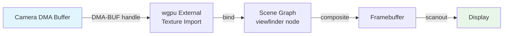
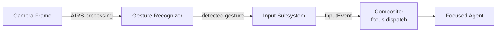

# AIOS Camera Integration

Part of: [camera.md](../camera.md) — Camera Subsystem
**Related:** [compositor.md](../compositor.md) — Surface compositing and rendering, [flow.md](../../storage/flow.md) — Data flow and history, [posix.md](../posix.md) — POSIX compatibility layer, [audio.md](../audio.md) — A/V sync, [input.md](../input.md) — Gesture input bridge

-----

## §10 Integration

### §10.1 Compositor Integration

The camera subsystem integrates with the compositor for live viewfinder rendering and privacy indicator display.

#### Viewfinder Surfaces

Camera preview is displayed through compositor surfaces with a dedicated content type hint:

```rust
/// Surface semantic hints for camera content.
pub enum CameraContentHint {
    /// Live camera viewfinder (real-time, low-latency).
    LivePreview,
    /// Captured still image (static, high-quality).
    StillImage,
    /// Camera settings overlay (controls on top of preview).
    SettingsOverlay,
    /// Privacy indicator (system-managed, unfakeable).
    PrivacyIndicator,
}
```

The compositor uses `ContentType::CameraPreview` (see [compositor/protocol.md](../compositor/protocol.md) §4) for viewfinder surfaces:

- **Low-latency rendering** — camera preview surfaces skip the standard frame scheduling pipeline and are composited with minimal delay. Target: <16ms from frame capture to display.
- **Direct scanout** — when the camera preview is full-screen, the compositor can bypass compositing entirely and scan the camera DMA buffer directly to the display controller (zero-copy end-to-end).
- **Aspect ratio preservation** — the compositor applies letterboxing or pillarboxing to maintain the camera's native aspect ratio within the allocated surface area.
- **Rotation** — the compositor applies rotation based on the camera's mounting orientation (from `CameraCapabilitiesDescriptor.position`) and the device's current orientation (accelerometer).

#### Zero-Copy Viewfinder Path



No CPU copy occurs in this path. The camera DMA buffer is imported as a wgpu texture (equivalent to `EGLImageKHR`), bound to the viewfinder node in the scene graph, and composited with other surfaces. For NV12 format (most efficient for camera → GPU), the compositor uses a shader that performs YUV → RGB conversion during compositing.

### §10.2 Flow Integration

Camera frames integrate with the Flow data system (see [flow.md](../../storage/flow.md)) for history, sharing, and cross-agent communication.

#### Video Frames as FlowEntries

Captured frames and images are represented as `FlowEntry` items with `TypedContent::VideoFrame`:

```rust
/// Camera-specific Flow content types.
pub enum CameraFlowContent {
    /// A single captured still image.
    StillImage {
        /// Image data (JPEG or raw).
        data: Vec<u8>,
        /// Image metadata (resolution, exposure, camera ID).
        metadata: ImageMetadata,
        /// Content hash for deduplication.
        content_hash: ContentHash,
    },
    /// A video recording segment.
    VideoSegment {
        /// Segment file reference (in Space storage).
        segment_ref: ObjectId,
        /// Duration in milliseconds.
        duration_ms: u64,
        /// Frame count.
        frame_count: u64,
        /// Recording metadata.
        metadata: VideoMetadata,
    },
    /// A QR code or barcode scan result.
    ScanResult {
        /// Decoded content.
        content: String,
        /// Code type (QR, EAN-13, Code 128, etc.).
        code_type: CodeType,
        /// Bounding box in the source frame.
        bounds: Rect,
    },
    /// A depth map capture.
    DepthMap {
        /// Depth data (16-bit per pixel, millimeters).
        data: Vec<u16>,
        /// Dimensions.
        width: u32,
        height: u32,
        /// Corresponding color frame (if available).
        color_frame: Option<ContentHash>,
    },
}
```

#### Flow History

Camera-related Flow entries are stored in the user's personal space (`user/home/`):

- **Photos** → `user/home/photos/` with date-based organization
- **Videos** → `user/home/videos/` with date-based organization
- **Scans** → `user/home/scans/` with extracted text content
- **Depth captures** → `user/home/3d/` with point cloud data

Flow history enables:

- Chronological photo/video browsing
- Full-text search of scanned documents
- Cross-agent sharing of captured images (with capability checks)
- Version history for edited images

### §10.3 POSIX Bridge

The camera subsystem exposes a V4L2-compatible interface through POSIX device nodes, enabling standard Linux camera applications to work without modification.

#### Device Nodes

```text
/dev/video0     → Camera 0 (first enumerated camera)
/dev/video1     → Camera 1 (second camera)
/dev/video2     → Camera 2 (VirtIO-Camera)
...
/dev/media0     → Media controller device (ISP pipeline topology)
/dev/v4l-subdev0 → Sensor subdevice (for CSI cameras)
```

#### V4L2 ioctl Translation

The POSIX bridge translates V4L2 ioctls to camera subsystem API calls:

| V4L2 ioctl | Camera Subsystem Call | Notes |
|---|---|---|
| `VIDIOC_QUERYCAP` | `capabilities()` | Returns V4L2 capability flags |
| `VIDIOC_ENUM_FMT` | `capabilities().formats` | Enumerate supported formats |
| `VIDIOC_S_FMT` | `configure()` | Set format, returns actual |
| `VIDIOC_REQBUFS` | Buffer pool allocation | MMAP or DMABUF mode |
| `VIDIOC_QBUF` | Buffer enqueue | Give buffer to driver |
| `VIDIOC_DQBUF` | Frame dequeue | Get completed frame |
| `VIDIOC_STREAMON` | `start_capture()` | Start streaming |
| `VIDIOC_STREAMOFF` | `stop_capture()` | Stop streaming |
| `VIDIOC_QUERYCTRL` | `get_control()` | Query control range |
| `VIDIOC_S_CTRL` | `set_control()` | Set control value |
| `VIDIOC_G_CTRL` | `get_control()` | Get control value |

#### Capability Gate for POSIX Access

V4L2 access through POSIX device nodes requires the same `CameraCapability` token as the native API:

1. The `open("/dev/video0")` call triggers a capability check
2. If the calling agent has a valid `CameraCapability`, the fd is created
3. If not, `open()` returns `EACCES`
4. The user prompt is displayed on first `VIDIOC_STREAMON` (not on `open()`) to avoid prompting for apps that only query capabilities

This ensures that POSIX compatibility does not bypass the privacy model.

#### Media Controller

For CSI cameras with configurable ISP pipelines, the media controller device (`/dev/media0`) exposes the pipeline topology:

```text
Entity 0: sensor (IMX708)
  Pad 0 [source]: RGGB 4608×2592
    -> Pad 0 of entity 1

Entity 1: csi-receiver
  Pad 0 [sink]: RGGB 4608×2592
  Pad 1 [source]: RGGB 4608×2592
    -> Pad 0 of entity 2

Entity 2: isp-input
  Pad 0 [sink]: RGGB 4608×2592
  Pad 1 [source]: NV12 1920×1080
    -> Pad 0 of entity 3

Entity 3: isp-output
  Pad 0 [sink]: NV12 1920×1080
  -> /dev/video0
```

Applications can use `media-ctl` to query and configure the pipeline topology, matching the behavior expected by libcamera-based applications.

### §10.4 Audio Synchronization

For video recording and video calls, camera frames must be synchronized with audio samples:

#### Shared Timeline

The camera and audio subsystems share a media timeline (see [audio/scheduling.md](../audio/scheduling.md) §7):

```rust
/// Synchronized media timestamp for A/V alignment.
pub struct MediaTimestamp {
    /// Monotonic kernel timestamp (from CNTPCT_EL0).
    pub kernel_ticks: u64,
    /// Audio sample position at this timestamp.
    pub audio_samples: u64,
    /// Video frame sequence at this timestamp.
    pub video_sequence: u64,
}
```

The compositor uses the shared timeline to align audio playback with video display:

1. Each camera frame carries a `kernel_ticks` timestamp
2. Each audio buffer carries a `kernel_ticks` timestamp
3. The compositor schedules frame display to match audio presentation timing
4. Audio is the clock master — if timestamps drift, video frames are dropped or repeated to maintain sync

#### Lip-Sync Budget

For video calls, the maximum acceptable audio-video delay is ±45ms (ITU-R BT.1359 recommendation). The camera subsystem targets:

- Camera capture → frame ready: <5ms (CSI DMA) or <15ms (USB)
- ISP processing: <5ms (hardware) or <20ms (software)
- Compositor rendering: <8ms
- Total video latency: <33ms (within lip-sync budget)

### §10.5 Accessibility

Camera subsystem accessibility features:

#### Visual Indicators for Screen Readers

All privacy indicators have screen-reader-accessible alternatives:

- Camera active: "Camera in use by Video Call agent"
- Recording active: "Video recording in progress, 2 minutes 34 seconds"
- Multiple sessions: "Camera shared between Video Call and Photo agents"
- Privacy shutter: "Camera privacy shutter is closed"

#### High-Contrast Indicators

Privacy indicators are rendered with high-contrast colors and increased size when system accessibility settings request it:

- Standard: small green/red dot in status bar
- High-contrast: larger indicator with text label, high-contrast border, and audible tone on state change

#### Camera-Based Accessibility

The camera can serve accessibility purposes:

- **Magnification**: use camera as a digital magnifying glass for users with low vision
- **Scene description**: AIRS-powered audio description of what the camera sees (see [ai-native.md](./ai-native.md) §11)
- **Document reading**: OCR-based text reading from camera captures
- **Sign language recognition**: future AIRS feature for sign language → text/speech translation

### §10.6 Input Subsystem Bridge

The camera subsystem can feed detected gestures to the input subsystem as input events:



This bridge is AIRS-dependent and operates only when:

1. The user has explicitly enabled camera-based gesture input in system settings
2. A valid `CameraCapability` with purpose `Accessibility` or `MlInference` is held
3. The AIRS service is running and has loaded a gesture recognition model

Supported gesture types (see [input/gestures.md](../input/gestures.md) §5 and [input/ai.md](../input/ai.md) §10):

- **Hand tracking** — detected hand positions as 21-point skeletons
- **Pose estimation** — body pose as 33-point skeleton (for full-body gesture control)
- **Head tracking** — head position and orientation (for hands-free navigation)
- **Eye tracking** — gaze direction (with dedicated IR cameras in VR headsets)

The input subsystem treats camera-derived input events identically to hardware input events (keyboard, mouse, touch). Focus routing, hotkey handling, and gesture recognition all work transparently.
