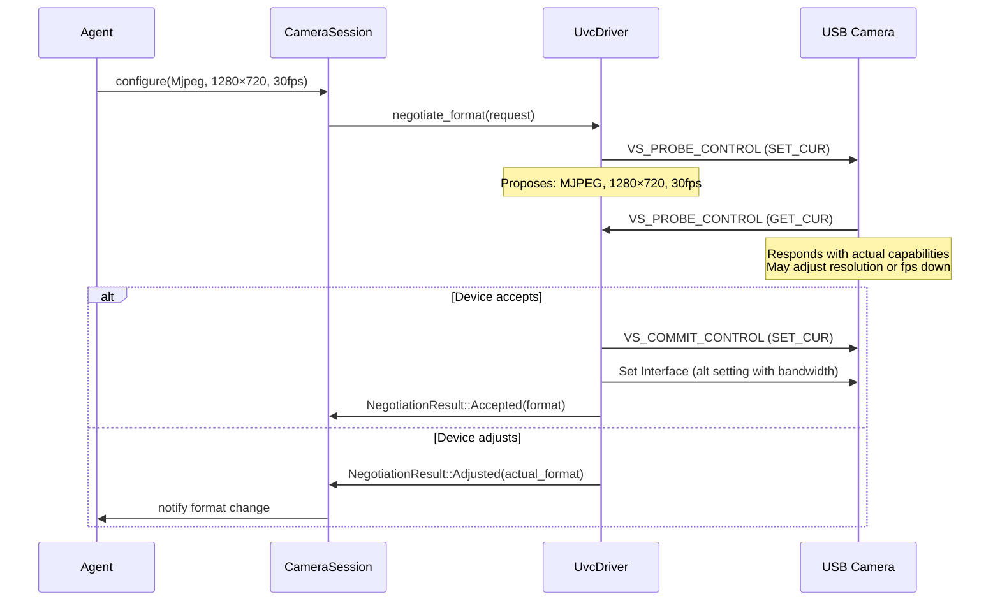
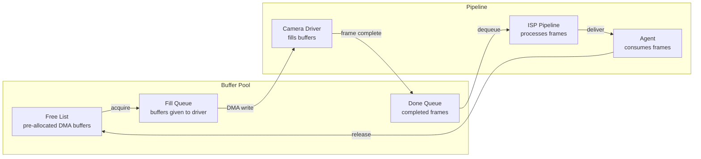
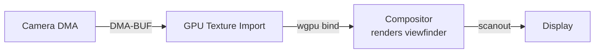
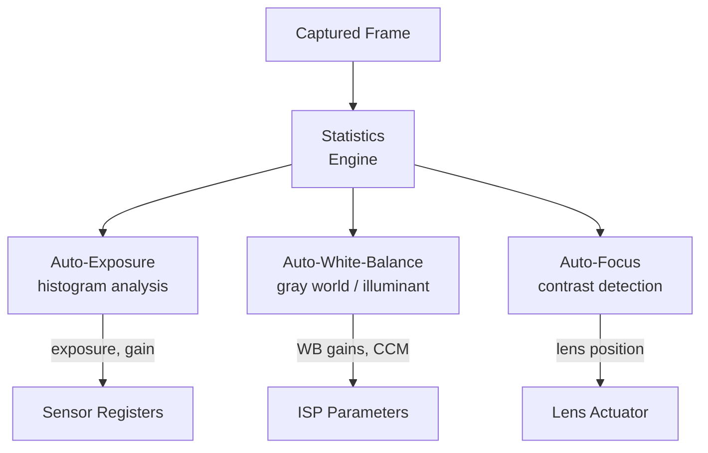

# AIOS Camera Capture & ISP Pipeline

Part of: [camera.md](../camera.md) — Camera Subsystem
**Related:** [devices.md](./devices.md) — Device taxonomy and capabilities, [drivers.md](./drivers.md) — Hardware driver details, [ai-native.md](./ai-native.md) — Neural ISP and AI-driven processing

-----

## §4 Capture Pipeline

The capture pipeline handles everything from raw sensor data arriving at the hardware interface through to delivering processed frames to agents. The pipeline is designed for zero-copy operation by default, with CPU processing inserted only when ISP or format conversion is required.

### §4.1 Format Negotiation

Before streaming begins, the agent and camera device must agree on a format, resolution, and frame rate. The negotiation mechanism differs by device type.

#### UVC Probe/Commit

USB webcams use the UVC probe/commit protocol (see [usb/device-classes.md](../usb/device-classes.md) §4.4):



The probe request proposes desired parameters. The device responds with what it can actually deliver — it may reduce frame rate, select a different resolution, or choose a different compression format. The agent can accept the adjusted parameters or try again with different values.

#### CSI/MIPI Configuration

CSI cameras do not negotiate — the host configures the sensor directly via I2C/CCI register writes:

1. **Sensor mode selection** — choose from a set of predefined sensor modes (resolution × frame rate combinations defined by the sensor datasheet)
2. **Lane configuration** — set the number of active CSI-2 data lanes and link frequency
3. **Output format** — configure the sensor's output format (typically raw Bayer at 8/10/12-bit depth)
4. **CSI receiver setup** — configure the platform CSI-2 receiver to match sensor parameters

```rust
/// CSI sensor mode definition (from sensor datasheet).
pub struct SensorMode {
    /// Output resolution.
    pub width: u32,
    pub height: u32,
    /// Frame rate range.
    pub fps_min: u32,
    pub fps_max: u32,
    /// Output format (raw Bayer bit depth and pattern).
    pub format: BayerFormat,
    /// Number of active CSI-2 data lanes.
    pub lanes: u8,
    /// CSI-2 link frequency in Hz.
    pub link_freq_hz: u64,
    /// Sensor crop area (for digital zoom / windowing).
    pub crop: Option<Rect>,
    /// Whether this mode supports HDR (staggered exposure).
    pub hdr_capable: bool,
}

/// Bayer mosaic pattern and bit depth.
pub struct BayerFormat {
    pub pattern: BayerPattern,
    pub bits_per_pixel: u8,
}

pub enum BayerPattern {
    Rggb,
    Bggr,
    Grbg,
    Gbrg,
}
```

#### VirtIO-Camera Configuration

VirtIO-Camera accepts any requested configuration within its advertised capabilities (from `VirtioCameraConfig`). No negotiation round-trip is needed — the virtual device always accepts.

### §4.2 Frame Delivery

Frames arrive from hardware through different mechanisms depending on the device type, but all converge to a common `RawFrame` representation before entering the ISP pipeline.

#### USB Frame Assembly

UVC frames arrive as a series of USB packets (typically isochronous transfers at 125μs intervals for USB 2.0, 1ms for USB 1.1). Each packet begins with a UVC payload header (2–12 bytes):

```rust
/// UVC payload header fields.
pub struct UvcPayloadHeader {
    /// Header length (2–12 bytes).
    pub length: u8,
    /// Bit field: frame_id (toggle), end_of_frame, error, still_image, etc.
    pub flags: UvcHeaderFlags,
    /// Presentation timestamp (optional, in 100ns units from device clock).
    pub pts: Option<u32>,
    /// Source clock reference (optional).
    pub scr: Option<UvcScr>,
}
```

The driver assembles packets into complete frames by:

1. Detecting frame boundaries via the `frame_id` toggle bit (flips between 0 and 1 on each new frame)
2. Accumulating payload data into a pre-allocated frame buffer
3. Marking the frame complete when `end_of_frame` is set
4. Dropping corrupted frames (when `error` flag is set in the header)

#### CSI-2 Frame Reception

CSI-2 frames arrive as continuous streams of pixels over the differential data lanes. The CSI-2 receiver hardware:

1. Deserializes the D-PHY signals
2. Unpacks pixel data from the CSI-2 packet format
3. Writes raw frame data directly to memory via DMA (scatter-gather or contiguous)
4. Signals frame completion via interrupt (frame-end short packet)

The DMA target buffer is pre-allocated from the camera buffer pool (§4.3). No CPU copy occurs during frame reception — data flows directly from the CSI-2 receiver to RAM via the DMA engine.

#### Common Frame Representation

All drivers produce a `RawFrame` that enters the ISP pipeline:

```rust
/// A raw frame from any camera device.
pub struct RawFrame {
    /// DMA buffer containing frame data.
    pub buffer: DmaBufHandle,
    /// Frame metadata.
    pub metadata: FrameMetadata,
}

/// Metadata accompanying each frame.
pub struct FrameMetadata {
    /// Monotonic timestamp when the frame was captured (kernel timer ticks).
    pub timestamp_ticks: u64,
    /// Presentation timestamp from device (if available).
    pub device_pts: Option<u64>,
    /// Frame sequence number (monotonically increasing per camera).
    pub sequence: u64,
    /// Source camera identifier.
    pub camera_id: CameraId,
    /// Pixel format of the raw data.
    pub format: VideoPixelFormat,
    /// Frame dimensions.
    pub width: u32,
    pub height: u32,
    /// Bytes per line (may include padding).
    pub stride: u32,
    /// Total data size in bytes.
    pub size: u32,
    /// Sensor exposure time for this frame (microseconds).
    pub exposure_us: Option<u32>,
    /// Sensor analog gain for this frame.
    pub analog_gain: Option<f32>,
    /// Sensor color temperature estimate (Kelvin).
    pub color_temp_k: Option<u32>,
    /// Whether this frame had errors during capture.
    pub error: bool,
}
```

### §4.3 Buffer Management

The camera subsystem pre-allocates a pool of DMA-capable buffers for frame data. Buffer management is critical for maintaining consistent frame rates without allocation latency.



#### Buffer Pool Configuration

```rust
/// Camera buffer pool configuration.
pub struct CameraBufferPoolConfig {
    /// Number of buffers in the pool (minimum 3 for triple-buffering).
    pub buffer_count: u32,
    /// Buffer size in bytes (computed from max resolution × format bpp).
    pub buffer_size: usize,
    /// Memory pool to allocate from (DMA pool for hardware cameras).
    pub pool: Pool,
    /// Whether buffers must be physically contiguous (required for some DMA engines).
    pub contiguous: bool,
    /// Cache coherency requirements.
    pub cache_mode: CacheMode,
}

pub enum CacheMode {
    /// Write-back cacheable (CPU-processed frames).
    Cached,
    /// Non-cacheable (DMA-only, zero CPU access).
    Uncached,
    /// Write-combine (CPU writes, GPU reads).
    WriteCombine,
}
```

The default configuration uses **triple-buffering** (3 buffers): one being filled by the driver, one being processed by the ISP, and one being consumed by the agent. Additional buffers can be configured for higher latency tolerance or to absorb processing time variations.

#### Buffer Lifecycle

1. **Allocate** — at session creation, allocate `buffer_count` DMA buffers from the DMA page pool
2. **Enqueue** — give empty buffers to the driver (fill queue)
3. **Fill** — driver configures DMA to write frame data into the buffer
4. **Complete** — driver signals frame completion, buffer moves to done queue
5. **Process** — ISP pipeline reads from the buffer, writes to output buffer (or modifies in-place for simple transforms)
6. **Deliver** — processed frame delivered to agent via `DataChannel` or `ZeroCopyChannel`
7. **Release** — agent signals it is done with the buffer, buffer returns to free list

### §4.4 Zero-Copy Paths

The primary design goal is to avoid CPU copies of frame data. Three zero-copy paths are supported:

#### Camera → GPU (Viewfinder)

For live camera preview in the compositor:



The DMA buffer handle is imported as a GPU texture via `wgpu`'s external memory import (equivalent to `EGLImageKHR` on EGL systems). The compositor binds this texture to the viewfinder surface and renders it as part of the scene graph. No CPU copy occurs — the frame data stays in the same physical memory from camera DMA write through to display scanout.

**Requirements**: GPU must support importing external DMA buffers. Format must be GPU-readable (NV12 or BGRA32; MJPEG requires CPU decode first).

#### Camera → Agent (Direct Access)

For agents that need CPU access to frame data (image analysis, ML inference):

The DMA buffer is mapped into the agent's address space as a shared memory region (see [ipc.md](../../kernel/ipc.md) — shared memory). The agent reads frame data directly from the mapped region without copying. The buffer is marked read-only in the agent's page table to prevent modification of in-flight frames.

**Cache coherency**: on architectures without hardware cache coherency (e.g., some ARM SoCs), the kernel performs a cache invalidate on the buffer region before delivering to the agent.

#### Camera → Camera (Multi-Camera Pipeline)

For multi-camera processing (e.g., stereo depth estimation):

Frames from two cameras are placed in adjacent DMA buffers. The stereo processing pipeline reads both buffers and writes a depth map to a third buffer. All three buffers are DMA-allocated and can be passed to the GPU without copies.

### §4.5 Frame Timing and Synchronization

Accurate timestamps are essential for A/V sync, multi-camera synchronization, and frame rate control.

#### Timestamp Sources

Each frame carries multiple timestamps:

- **Kernel timestamp** (`timestamp_ticks`) — captured from `CNTPCT_EL0` at the moment the driver receives the frame-complete interrupt. This is the authoritative timestamp for system-wide ordering.
- **Device timestamp** (`device_pts`) — from the camera device's internal clock (UVC PTS field, CSI frame sync counter). Used for detecting dropped frames and device clock drift.
- **Exposure midpoint** — computed as `kernel_timestamp - (exposure_us / 2)`, representing when the scene was actually captured. Important for motion estimation and multi-camera sync.

#### Multi-Camera Synchronization

For synchronized capture across cameras in a `CameraGroup`:

1. **Hardware sync** (preferred) — cameras share a trigger signal or use CSI frame sync. Frames arrive simultaneously within the hardware jitter budget (typically <100μs).
2. **Software sync** — the subsystem matches frames from different cameras by kernel timestamp, accepting frames within a configurable tolerance window (default: ±2ms). Unmatched frames are delivered individually with a `sync_missed` flag.

```rust
/// Synchronized frame set from a camera group.
pub struct SyncFrameSet {
    /// Camera group identifier.
    pub group_id: CameraGroupId,
    /// Frames from each camera, matched by timestamp.
    pub frames: Vec<(CameraId, ProcessedFrame)>,
    /// Maximum timestamp difference across frames (microseconds).
    pub max_skew_us: u64,
    /// Whether hardware synchronization was used.
    pub hw_synced: bool,
}
```

-----

## §5 ISP Pipeline

The Image Signal Processor (ISP) pipeline converts raw sensor data into processed frames suitable for display or analysis. The pipeline is modular — each stage is an independent processing step that can be hardware-accelerated, software-computed, or replaced by a neural model.

### §5.1 Traditional ISP Pipeline

The ISP pipeline processes each frame through a sequence of stages:

```mermaid
flowchart LR
    RAW["Raw Bayer<br/>from sensor"] --> BLC["Black Level<br/>Correction"]
    BLC --> DPC["Dead Pixel<br/>Correction"]
    DPC --> DEM["Demosaic<br/>(Bayer → RGB)"]
    DEM --> DNS["Denoise<br/>(spatial)"]
    DNS --> WB["White Balance<br/>(CCM)"]
    WB --> CCM["Color Correction<br/>Matrix"]
    CCM --> GAM["Gamma<br/>Correction"]
    GAM --> TM["Tone Mapping<br/>(HDR → SDR)"]
    TM --> SHARP["Sharpen"]
    SHARP --> OUT["Processed<br/>RGB/NV12"]
```



Each stage in the pipeline:

```rust
/// A stage in the ISP processing pipeline.
pub trait IspStage: Send + Sync {
    /// Process a frame in-place or copy to output buffer.
    fn process(&self, input: &FrameBuffer, output: &mut FrameBuffer,
               params: &IspParams) -> Result<(), IspError>;

    /// Whether this stage modifies the frame dimensions.
    fn changes_dimensions(&self) -> bool { false }

    /// Estimated CPU cost in microseconds for a given resolution.
    fn estimated_cost_us(&self, width: u32, height: u32) -> u64;
}

/// Parameters controlling ISP processing.
pub struct IspParams {
    /// Black level offset per Bayer channel.
    pub black_level: [u16; 4],
    /// White balance gains (R, Gr, Gb, B).
    pub wb_gains: [f32; 4],
    /// 3×3 color correction matrix.
    pub ccm: [[f32; 3]; 3],
    /// Gamma curve (LUT with 256 entries).
    pub gamma_lut: [u16; 256],
    /// Denoise strength (0.0 = off, 1.0 = maximum).
    pub denoise_strength: f32,
    /// Sharpen strength (0.0 = off, 1.0 = maximum).
    pub sharpen_strength: f32,
    /// Tone mapping mode.
    pub tone_map: ToneMapMode,
}

pub enum ToneMapMode {
    /// Linear (no tone mapping).
    Linear,
    /// Reinhard global tone mapping.
    Reinhard,
    /// ACES filmic tone mapping.
    AcesFilmic,
    /// Adaptive (ISP auto-selects based on scene dynamic range).
    Adaptive,
}
```

#### Stage Details

**Black level correction**: Subtracts the sensor's black level offset from each pixel. The offset varies per Bayer channel and may drift with temperature. Calibrated during manufacturing or runtime via covered pixels.

**Dead pixel correction**: Replaces stuck (always bright) or dead (always dark) pixels with interpolated values from neighbors. Dead pixel maps are either stored in sensor OTP memory or computed during a calibration step.

**Demosaicing**: Converts the Bayer mosaic pattern (one color per pixel) to full RGB. Algorithms range from bilinear interpolation (fast, low quality) to adaptive methods (Malvar-He-Cutler, DLMMSE) that preserve edges. This is the most computationally expensive stage for CPU-based ISPs.

**Denoising**: Reduces sensor noise using spatial filtering. Bilateral filters preserve edges while smoothing flat areas. The strength is adaptive — increased for high-ISO (high-gain) captures, reduced for well-lit scenes. Temporal denoising (§16.2 in [camera.md](../camera.md)) exploits frame-to-frame coherence for video.

**White balance and color correction**: Applies white balance gains (from 3A AWB) and a 3×3 color correction matrix to map sensor-specific color response to a standard color space (sRGB).

**Gamma correction**: Applies the sRGB transfer function (or a custom gamma curve) to map linear light values to perceptually uniform output.

**Tone mapping**: Compresses high dynamic range sensor data to displayable range. Required for HDR-capable sensors. ACES filmic tone mapping provides cinematic rendering; Reinhard is simpler and preserves more detail in highlights.

**Sharpening**: Applies unsharp mask or adaptive sharpening to compensate for softness introduced by demosaicing and denoising. Applied last to avoid amplifying noise.

### §5.2 3A Algorithms

The "3A" algorithms — Auto-Exposure (AE), Auto-White-Balance (AWB), and Auto-Focus (AF) — run in a control loop that analyzes captured frames and adjusts sensor/ISP parameters for the next frame.



#### Auto-Exposure (AE/AGC)

The auto-exposure algorithm maintains target brightness by controlling exposure time and analog gain:

1. **Histogram analysis** — compute a brightness histogram from a weighted region of interest (center-weighted, spot, or matrix metering)
2. **Target comparison** — compare mean brightness against target (default: 50% of dynamic range, adjustable)
3. **Control loop** — PID controller adjusts exposure time and gain. Exposure is preferred over gain (less noise); gain is increased only when exposure reaches the maximum for the current frame rate
4. **Flicker avoidance** — lock exposure to multiples of 1/100s (50Hz) or 1/120s (60Hz) to avoid banding under artificial lighting

#### Auto-White-Balance (AWB)

AWB estimates the scene illuminant color temperature and computes white balance gains:

1. **Gray-world assumption** — assume the average scene color should be neutral gray. Compute per-channel averages and derive correction gains.
2. **Illuminant estimation** — classify the illuminant type (daylight ~5500K, tungsten ~3200K, fluorescent ~4000K) from the chromaticity distribution of highlight pixels.
3. **Gain computation** — compute R/B gains to neutralize the illuminant color cast. Smooth transitions between estimates to avoid color flickering.

#### Auto-Focus (AF)

Contrast-detection auto-focus (CDAF) for sensors with motorized lens actuators:

1. **Focus measure** — compute a sharpness metric (gradient magnitude, Laplacian variance) over the focus region of interest
2. **Sweep search** — move the lens through its range, recording sharpness at each position. The position with maximum sharpness is the focus point.
3. **Continuous AF** — for video, run a reduced sweep around the current focus position every N frames to track focus changes (e.g., subject movement).

Phase-detection AF (PDAF) uses dedicated phase-detect pixels on the sensor for faster focusing. The sensor reports phase difference directly, allowing the AF algorithm to compute the focus direction and distance in a single measurement.

### §5.3 Hardware ISP

Platform-specific hardware ISPs provide dedicated silicon for frame processing, offloading the CPU entirely:

#### Raspberry Pi ISP

The Raspberry Pi 5's ISP (part of the VideoCore VII GPU) is mandatory — raw CSI sensor data must pass through it. The ISP provides hardware-accelerated:

- Demosaicing (high-quality edge-aware)
- Lens shading correction
- Crosstalk correction
- Denoising (spatial + temporal)
- White balance and color correction
- Gamma and tone mapping
- Scaling and cropping

The camera driver configures the ISP via a set of register blocks. ISP parameters (gains, matrices, LUTs) are computed by the 3A algorithms running on the CPU and written to ISP registers before each frame.

#### ISP Backend Abstraction

```rust
/// ISP backend trait — implemented by hardware ISP, software ISP, and neural ISP.
pub trait IspBackend: Send + Sync {
    /// Process a raw frame into a processed frame.
    fn process(&self, raw: &RawFrame, output: &mut FrameBuffer,
               params: &IspParams) -> Result<(), IspError>;

    /// Whether this backend supports the given input format.
    fn supports_format(&self, format: &VideoPixelFormat) -> bool;

    /// Update 3A parameters for the next frame.
    fn update_params(&mut self, params: IspParams);

    /// Backend type for capability queries.
    fn backend_type(&self) -> IspBackendType;
}

pub enum IspBackendType {
    /// Platform-specific hardware ISP.
    Hardware,
    /// CPU-based software ISP.
    SoftwareCpu,
    /// GPU-accelerated software ISP.
    SoftwareGpu,
    /// Neural network-based ISP (AIRS-managed).
    Neural,
}
```

### §5.4 Software ISP

When no hardware ISP is available (USB webcams with raw output, VirtIO-Camera, unsupported platforms), the software ISP runs the pipeline stages on the CPU or GPU.

#### CPU Software ISP

Each pipeline stage is implemented as a Rust function operating on frame buffers. The stages are executed sequentially on a dedicated processing thread (not the camera driver's interrupt thread). Estimated performance for common resolutions:

| Resolution | CPU Time (Cortex-A72) | Achievable FPS |
|---|---|---|
| 640×480 | ~3ms | 30fps (comfortable) |
| 1280×720 | ~8ms | 30fps (tight) |
| 1920×1080 | ~18ms | 30fps (requires NEON optimization) |

NEON SIMD intrinsics are used for demosaicing, denoising, and color correction to achieve real-time performance on ARM.

#### GPU Software ISP

Inspired by libcamera's GPU-ISP (v0.7+), the software ISP can offload processing to the GPU via compute shaders (wgpu compute pipeline):

1. Upload raw frame to GPU texture (or import DMA-BUF directly)
2. Run ISP stages as compute shader dispatches
3. Output processed frame as GPU texture (ready for compositor) or read back to CPU buffer

GPU ISP is significantly faster than CPU for high resolutions (>1080p) and enables the zero-copy camera → GPU → compositor path without any CPU involvement in frame processing.

### §5.5 Still Capture

Still image capture differs from video streaming:

- **Full resolution** — still capture uses the sensor's maximum resolution mode, which may differ from the video streaming mode (e.g., 12MP still vs. 1080p video)
- **Multi-frame processing** — still capture can use multi-frame HDR, stacking, or burst averaging for higher quality
- **Full ISP pipeline** — no stages are skipped for latency; all processing runs at maximum quality
- **Output format** — JPEG encoding (for sharing) or raw DNG (for professional editing)

```rust
/// Still capture request.
pub struct StillCaptureRequest {
    /// Output format.
    pub format: StillFormat,
    /// JPEG quality (1–100, only for Jpeg format).
    pub jpeg_quality: u8,
    /// Whether to capture raw sensor data alongside processed output.
    pub include_raw: bool,
    /// Whether to use multi-frame HDR.
    pub hdr: bool,
    /// Flash mode.
    pub flash: FlashMode,
    /// Focus mode for this capture.
    pub focus: FocusMode,
}

pub enum StillFormat {
    /// JPEG compressed output.
    Jpeg,
    /// Uncompressed RGB bitmap.
    Bitmap,
    /// DNG raw format (includes raw Bayer data + metadata).
    DngRaw,
}

pub enum FlashMode {
    Off,
    On,
    Auto,
    /// IR illumination for depth sensors.
    Infrared,
}

pub enum FocusMode {
    /// Use current focus position.
    Current,
    /// Trigger single auto-focus before capture.
    AutoSingle,
    /// Continuous auto-focus (for burst capture).
    AutoContinuous,
    /// Manual focus at specified distance.
    Manual { distance_mm: u32 },
}
```

### §5.6 RAW Capture

For advanced users and developers, the camera subsystem supports raw sensor data capture bypassing the ISP pipeline entirely:

- **DNG output** — raw Bayer data packaged in Adobe DNG format with full metadata (sensor model, exposure, white balance, lens info, noise profile)
- **Live raw preview** — stream raw Bayer data through a minimal debayering stage for real-time preview while capturing full-quality raw
- **Calibration** — raw capture is used for sensor calibration (computing black level, dead pixel map, lens shading correction tables)

RAW capture requires explicit capability (`CameraCapability` with `raw_access: true`). The raw data is delivered through a separate `DataChannel` from the processed output, allowing simultaneous raw + processed capture.
