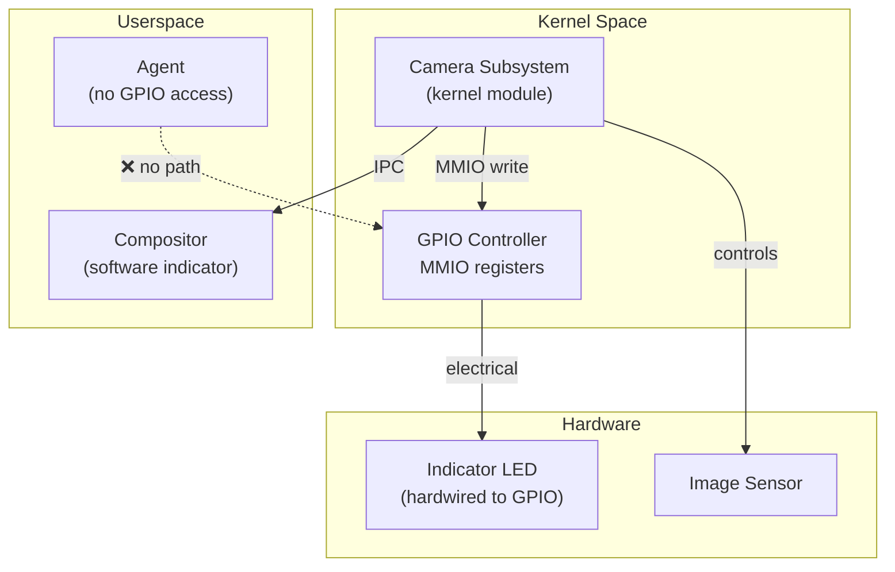

# AIOS Camera Privacy & Security

Part of: [camera.md](../camera.md) — Camera Subsystem
**Related:** [sessions.md](./sessions.md) — Session lifecycle and conflict resolution, [security/model.md](../../security/model.md) — System-wide security model, [security/model/capabilities.md](../../security/model/capabilities.md) — Capability token internals

-----

## §8 Privacy & Security

Camera privacy is not a feature bolted onto the camera subsystem — it is the architectural foundation. Every design decision in the camera subsystem is evaluated against the question: "Can this be used to capture frames without the user's knowledge and consent?"

### §8.1 Hardware LED Enforcement

The camera indicator LED is controlled directly by the kernel via MMIO writes to a GPIO pin or dedicated indicator controller. This is the first line of defense against silent capture.

#### Hardware Architecture



#### Design Rules

1. **Kernel-only control**: The GPIO pin controlling the indicator LED is mapped only in kernel address space. No userspace mapping exists. No syscall exposes LED control. The only code path that activates the LED is `CameraSubsystem::activate_indicator()`, called during session approval.

2. **LED before first frame**: The indicator LED is activated before the first frame is captured. The sequence is: activate LED → verify LED state → start sensor streaming. If LED activation fails (GPIO error), the session is denied.

3. **LED during entire session**: The LED remains active throughout the session, including during pause states. Deactivation occurs only when all camera sessions on that device are closed.

4. **No software override**: There is no "debug mode," "test mode," or "system service exemption" that suppresses the LED. The VirtIO-Camera virtual device simulates an LED in its config space (queryable but not suppressible).

5. **Hardware kill switch respect**: If the hardware provides a physical privacy shutter or kill switch (like some Chromebook webcams), the camera subsystem detects the closed/disabled state via GPIO input and refuses to start sessions. The shutter state is polled periodically and triggers immediate session termination if closed during an active session.

```rust
/// Indicator LED control interface.
pub struct IndicatorController {
    /// GPIO pin number for the indicator LED.
    gpio_pin: Option<GpioPin>,
    /// Whether the LED is currently active.
    active: bool,
    /// Number of active sessions requiring the indicator.
    refcount: u32,
}

impl IndicatorController {
    /// Activate the indicator LED. Called when a session is approved.
    pub fn activate(&mut self) -> Result<(), PrivacyError> {
        self.refcount += 1;
        if !self.active {
            if let Some(pin) = &self.gpio_pin {
                // SAFETY: GPIO base address is valid MMIO for the platform.
                // Writing to the GPIO output register sets the LED pin high.
                unsafe { pin.set_high() };
                self.active = true;
            }
            // If no hardware LED, the compositor software indicator suffices.
        }
        Ok(())
    }

    /// Deactivate the indicator LED. Called when a session closes.
    pub fn deactivate(&mut self) -> Result<(), PrivacyError> {
        self.refcount = self.refcount.saturating_sub(1);
        if self.refcount == 0 && self.active {
            if let Some(pin) = &self.gpio_pin {
                // SAFETY: Same GPIO MMIO mapping.
                unsafe { pin.set_low() };
                self.active = false;
            }
        }
        Ok(())
    }

    /// Check if the indicator is currently active (for anti-silent-capture).
    pub fn is_active(&self) -> bool {
        self.active || self.gpio_pin.is_none() // No hardware LED → software indicator suffices
    }
}
```

### §8.2 Anti-Silent-Capture Validation

The anti-silent-capture check is a hard gate in the frame delivery path. Before any frame is delivered to an agent, the camera subsystem validates that the privacy indicator is active.

```rust
/// Validate that privacy conditions are met before delivering a frame.
fn validate_frame_delivery(
    session: &CameraSession,
    indicator: &IndicatorController,
    compositor_indicator: &CompositorIndicatorState,
) -> Result<(), PrivacyError> {
    // Check 1: Hardware indicator must be active (if available).
    if !indicator.is_active() {
        return Err(PrivacyError::IndicatorInactive);
    }

    // Check 2: Compositor software indicator must be active.
    if !compositor_indicator.is_visible() {
        return Err(PrivacyError::SoftwareIndicatorHidden);
    }

    // Check 3: Session must be in Streaming state (not paused/closing).
    if session.state() != SessionState::Streaming {
        return Err(PrivacyError::SessionNotStreaming);
    }

    // Check 4: Capability token must still be valid (not revoked).
    if session.capability_revoked() {
        return Err(PrivacyError::CapabilityRevoked);
    }

    Ok(())
}
```

**What happens on validation failure:**

1. The frame is dropped (not delivered to any agent)
2. The session is terminated immediately
3. An audit entry records the violation with full context (agent ID, session ID, failure reason)
4. The agent receives `CameraEvent::PrivacyViolation` error

This is intentionally aggressive. A single validation failure terminates the session rather than retrying. The rationale: if the indicator is inactive while frames are being produced, something is seriously wrong (hardware failure, kernel bug, or attack). Continuing capture under those conditions violates the core privacy invariant.

### §8.3 CameraCapability

Camera access requires a `CameraCapability` token — a typed capability (see [security/model/capabilities.md](../../security/model/capabilities.md)) that specifies what camera resources the agent is allowed to use.

```rust
/// Camera-specific capability token.
pub struct CameraCapability {
    /// Maximum resolution the agent can request.
    pub max_resolution: Resolution,
    /// Maximum frame rate the agent can request.
    pub max_fps: u32,
    /// Allowed camera positions (front, back, external).
    pub allowed_positions: CameraPositionSet,
    /// Whether RAW sensor data access is permitted.
    pub raw_access: bool,
    /// Whether depth data access is permitted.
    pub depth_access: bool,
    /// Maximum session duration (None = unlimited).
    pub max_duration: Option<Duration>,
    /// Allowed purposes.
    pub allowed_purposes: CameraPurposeSet,
    /// Whether still image capture is permitted.
    pub still_capture: bool,
    /// Whether video recording (saving to storage) is permitted.
    pub recording: bool,
}
```

#### Capability Attenuation

Capabilities can be attenuated (reduced) but never escalated:

```rust
// Parent grants full camera access to a framework agent.
let full_cap = CameraCapability {
    max_resolution: Resolution::new(3840, 2160),
    max_fps: 60,
    allowed_positions: CameraPositionSet::ALL,
    raw_access: true,
    depth_access: true,
    max_duration: None,
    allowed_purposes: CameraPurposeSet::ALL,
    still_capture: true,
    recording: true,
};

// Framework agent attenuates for a child agent (QR scanner plugin):
let qr_cap = full_cap.attenuate(CameraCapability {
    max_resolution: Resolution::new(640, 480),  // Only needs low-res
    max_fps: 15,                                 // Low frame rate sufficient
    allowed_positions: CameraPositionSet::BACK,  // Only rear camera
    raw_access: false,                           // No raw data
    depth_access: false,                         // No depth
    max_duration: Some(Duration::from_secs(30)), // 30-second timeout
    allowed_purposes: CameraPurposeSet::CODE_SCANNING, // Only QR scanning
    still_capture: false,                        // No photos
    recording: false,                            // No recording
});
```

The kernel enforces that every field of the attenuated capability is less than or equal to the parent capability. Attempting to escalate (e.g., increasing `max_fps` beyond the parent's limit) returns an error.

#### Capability Revocation

Capabilities can be revoked at any time (see [security/model/capabilities.md](../../security/model/capabilities.md) §3.5):

- **Explicit revocation** — the granting agent revokes the capability
- **Cascade revocation** — revoking a parent capability revokes all children
- **Temporal expiry** — capabilities with `max_duration` expire automatically
- **User revocation** — the user can revoke camera access for any agent via the Inspector app

When a capability is revoked, all active camera sessions using that capability are terminated immediately. The anti-silent-capture check (§8.2) also validates capability validity on every frame.

### §8.4 Recording Consent

Video recording adds additional consent requirements beyond live capture:

#### Local Recording

When an agent with `recording: true` capability starts recording to storage:

1. The compositor indicator changes to show a red recording dot (🔴) alongside the green camera dot
2. An additional prompt warns the user: "This agent is recording video to storage"
3. The audit trail logs every recorded frame with a `RecordingEvent`
4. The recording is tagged with the agent's identity in the file metadata

#### Multi-Party Consent

For video calls with multiple participants, AIOS provides a consent framework:

```rust
/// Recording consent state for video calls.
pub struct RecordingConsent {
    /// Whether the local user has consented to being recorded.
    pub local_consent: bool,
    /// Remote participants who have been notified of recording.
    pub notified_participants: Vec<ParticipantId>,
    /// Whether all participants have acknowledged.
    pub all_acknowledged: bool,
}
```

When a video call agent enables recording:

1. The local user sees the recording indicator (🔴)
2. The agent is required to notify remote participants (the subsystem does not enforce this remotely, but the audit trail records whether notification was sent)
3. If the agent claims "all participants consented" but the subsystem detects no notification attempt, an anomaly is flagged

### §8.5 Content Screening

Optional on-device content classification before frame delivery to agents:

```rust
/// Content screening configuration (opt-in per session).
pub struct ContentScreeningConfig {
    /// Whether to enable content screening for this session.
    pub enabled: bool,
    /// Screening model to use.
    pub model: ScreeningModel,
    /// Action on flagged content.
    pub action: ScreeningAction,
}

pub enum ScreeningModel {
    /// Lightweight face detector (detects if faces are in frame).
    FacePresence,
    /// Document detector (detects text/documents in frame).
    DocumentPresence,
    /// NSFW classifier (detects potentially sensitive content).
    SensitiveContent,
}

pub enum ScreeningAction {
    /// Log to audit but deliver the frame.
    AuditOnly,
    /// Blur the detected region before delivery.
    Blur,
    /// Block frame delivery entirely.
    Block,
}
```

Content screening is:

- **Opt-in** — not enabled by default. Agents or users can request screening for specific sessions.
- **On-device only** — screening models run locally. No frame data is sent externally.
- **AIRS-enhanced** — when AIRS is available, more capable screening models can be used (see [ai-native.md](./ai-native.md) §11).
- **Privacy-preserving** — the screening result (face detected, document detected) is logged to the audit trail, but the classification model does not retain frame data.

### §8.6 Audit Trail

Every camera operation is logged to the camera audit space (`/system/audit/camera/`):

```rust
/// Camera audit event types.
pub enum CameraAuditEvent {
    /// Session requested (includes agent ID, capability, intent).
    SessionRequested {
        agent_id: AgentId,
        camera_id: CameraId,
        intent: CameraSessionIntent,
    },
    /// User prompt displayed.
    PromptDisplayed {
        agent_id: AgentId,
        camera_id: CameraId,
    },
    /// User response to prompt.
    PromptResponse {
        agent_id: AgentId,
        camera_id: CameraId,
        allowed: bool,
    },
    /// Session opened (capture started).
    SessionOpened {
        session_id: SessionId,
        agent_id: AgentId,
        camera_id: CameraId,
        config: CameraConfig,
    },
    /// Frame delivered to agent.
    FrameDelivered {
        session_id: SessionId,
        sequence: u64,
        timestamp_ticks: u64,
    },
    /// Privacy violation detected (frame dropped, session terminated).
    PrivacyViolation {
        session_id: SessionId,
        agent_id: AgentId,
        reason: PrivacyError,
    },
    /// Session closed.
    SessionClosed {
        session_id: SessionId,
        agent_id: AgentId,
        total_frames: u64,
        duration_ticks: u64,
    },
    /// Recording started.
    RecordingStarted {
        session_id: SessionId,
        agent_id: AgentId,
    },
    /// Camera device added/removed.
    DeviceChanged {
        camera_id: CameraId,
        added: bool,
    },
    /// Anomaly detected by AIRS (purpose-behavior mismatch).
    AnomalyDetected {
        session_id: SessionId,
        agent_id: AgentId,
        anomaly: AnomalyType,
    },
}
```

#### Audit Granularity

Two audit levels are available:

- **Session-level** (default) — logs session open/close, prompt responses, violations, and anomalies. Suitable for most use cases.
- **Frame-level** (opt-in) — logs every frame delivery with sequence number and timestamp. Enables precise reconstruction of camera access history. Higher storage cost (64 bytes per frame × 30fps = ~1.8 KB/s).

Frame-level auditing is enabled for:

- Sessions with `SecurityMonitor` purpose (always)
- Sessions flagged by anomaly detection
- Sessions where the user explicitly requests detailed auditing via Inspector

### §8.7 Physical Privacy Controls

The camera subsystem respects hardware-level privacy controls:

#### Hardware Privacy Shutter

Some devices (Chromebook-style) have a physical shutter that covers the camera lens:

- **Detection**: the shutter state is detected via a GPIO input pin (closed = high, open = low)
- **Polling**: shutter state is checked every 100ms during active sessions
- **On close**: active sessions receive `CameraEvent::PrivacyShutterClosed`, frames are replaced with black frames, and the agent is notified
- **On open**: sessions can resume (no automatic restart — the agent must explicitly call `resume()`)
- **Session request**: if the shutter is closed when a session is requested, the prompt indicates "Camera shutter is closed" and the user can still approve (the session starts in a paused state until the shutter is opened)

#### Hardware Kill Switch

Some devices have an electrical kill switch that disconnects the camera at the hardware level (no power, no data):

- **Detection**: the device disappears from the USB bus or CSI interface (the switch itself has no queryable state — the OS infers it from device absence)
- **Behavior**: identical to hotplug removal (see [drivers.md](./drivers.md) §7.1)
- **No override**: the kill switch state cannot be queried or overridden by software — it is a hardware-level power disconnect

-----

## §9 Privacy Indicators

### §9.1 Compositor Indicator

The compositor renders a privacy indicator that is visible whenever any camera session is active. This is the software complement to the hardware LED.

#### Indicator Design

```text
Active session:
┌──────────────────────────────────────────────────────┐
│ Status Bar                         🟢 📷 Video Call  │
└──────────────────────────────────────────────────────┘

Recording session:
┌──────────────────────────────────────────────────────┐
│ Status Bar                  🔴 📷 Recording • 02:34  │
└──────────────────────────────────────────────────────┘

Multiple sessions:
┌──────────────────────────────────────────────────────┐
│ Status Bar              🟢 📷 ×2: Video Call + Photo │
└──────────────────────────────────────────────────────┘

Camera + Microphone:
┌──────────────────────────────────────────────────────┐
│ Status Bar                    🟢 📷 🎤 Video Call    │
└──────────────────────────────────────────────────────┘
```

#### Unfakeability Properties

1. **Privileged surface type** — `SurfaceType::PrivacyIndicator` can only be created by the compositor itself in response to camera subsystem IPC messages
2. **Maximum z-order** — rendered above all agent content, system UI, and dialogs
3. **Excluded from capture** — the indicator region is excluded from screenshot and screen-sharing capture APIs, preventing agents from rendering a fake "no indicator" frame
4. **Tamper detection** — the compositor validates that the indicator surface has not been modified by checking a per-frame HMAC (computed with a compositor-internal key)

### §9.2 Hardware LED Path

The hardware LED path is intentionally simple — minimal code, minimal attack surface:

```text
CameraSubsystem.activate_indicator()
    → IndicatorController.activate()
        → GpioPin.set_high()
            → MMIO write to GPIO output register

Total code path: ~20 lines of Rust + 1 MMIO write.
No allocations. No locks. No IPC. No external dependencies.
```

The GPIO pin mapping is determined at boot from the device tree or platform-specific configuration. The pin number is stored in a kernel-only data structure with no userspace visibility.

### §9.3 Screenshot and Screen-Share Warnings

When the camera preview is visible on screen and a screenshot or screen-share is initiated:

1. **Screenshot**: the camera preview region is replaced with a placeholder ("Camera preview hidden in screenshot") in the captured image. The agent does not control this — the compositor handles it.
2. **Screen-share**: the compositor displays a warning overlay: "Camera preview is visible to remote viewers." The user can dismiss this warning but it appears once per screen-share session.
3. **Agent screen capture**: if an agent uses the screen capture API and the camera preview is in the captured region, the preview is redacted. The agent receives the redacted frame.

These protections prevent a malicious agent from capturing camera output indirectly through the screen capture path.
