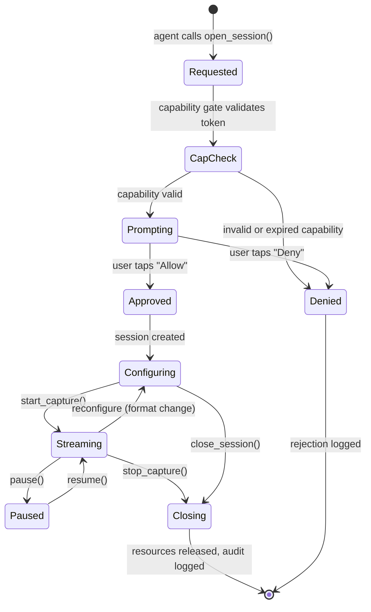
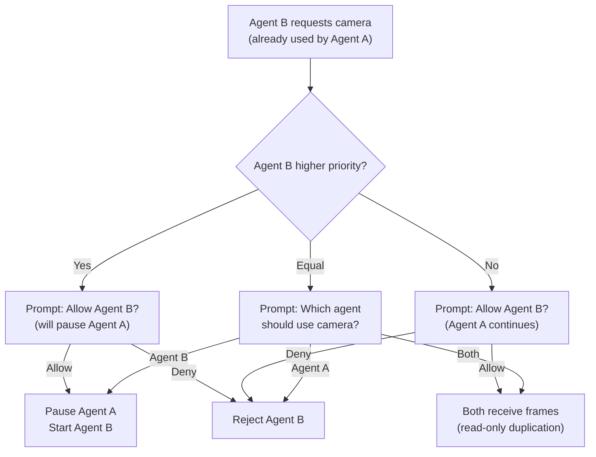

# AIOS Camera Sessions & Access Control

Part of: [camera.md](../camera.md) — Camera Subsystem
**Related:** [security.md](./security.md) — Privacy enforcement and audit, [subsystem-framework.md](../subsystem-framework.md) — Session lifecycle patterns (§4.4–§4.6)

-----

## §6 Camera Sessions

### §6.1 Session Lifecycle

Every camera access goes through a strict session lifecycle. There are no shortcuts — even system services follow the same path.



#### Request Phase

The agent calls `open_session()` with a `CameraCapability` token and a `SessionIntent`:

```rust
/// Open a camera session.
pub fn open_session(
    camera_id: CameraId,
    capability: &CameraCapability,
    intent: &CameraSessionIntent,
) -> Result<CameraSession, CameraError>;
```

The subsystem validates the capability token against the kernel capability table (see [security.md](./security.md) §8.3) and checks that the requested parameters (resolution, frame rate) do not exceed the capability's limits.

#### Prompt Phase

After capability validation, the compositor displays a user prompt:

```text
┌─────────────────────────────────────────┐
│  📷  Camera Access Request              │
│                                         │
│  "Video Call Agent" wants to use:       │
│  Camera: Logitech C920 (USB)           │
│  Purpose: Video call                    │
│  Resolution: 1280×720 @ 30fps          │
│  Duration: Until session ends           │
│                                         │
│  ┌─────────┐     ┌──────────────────┐  │
│  │  Deny   │     │  Allow This Time │  │
│  └─────────┘     └──────────────────┘  │
│                                         │
│  Preview: [live viewfinder thumbnail]   │
└─────────────────────────────────────────┘
```

The prompt is a compositor-rendered dialog at the highest z-order. No agent can dismiss it programmatically. The prompt includes:

- **Agent identity** — the agent's display name and trust level
- **Camera device** — which camera will be used
- **Purpose** — from the `SessionIntent` (video call, photo, AR, etc.)
- **Parameters** — resolution, frame rate, duration
- **Live preview** — a small viewfinder thumbnail showing what the camera sees (captured via a temporary low-resolution session before granting full access)

The prompt has no timeout — the user must actively respond. If the user closes the prompt without responding, it is treated as "Deny."

#### Configuration Phase

After approval, the session enters the configuration phase where the agent sets format, resolution, and frame rate:

```rust
impl CameraSession {
    /// Configure the camera format and resolution.
    pub fn configure(&mut self, config: &CameraConfig) -> Result<(), CameraError>;

    /// Start streaming frames to the agent's DataChannel.
    pub fn start_capture(&mut self) -> Result<DataChannel<VideoFrame>, CameraError>;

    /// Capture a single still image at full resolution.
    pub fn capture_still(&self, request: &StillCaptureRequest)
        -> Result<ImageBuffer, CameraError>;

    /// Pause streaming (indicator remains active).
    pub fn pause(&mut self) -> Result<(), CameraError>;

    /// Resume streaming after pause.
    pub fn resume(&mut self) -> Result<(), CameraError>;

    /// Change camera controls (exposure, white balance, etc.).
    pub fn set_control(&mut self, control: CameraControl, value: ControlValue)
        -> Result<(), CameraError>;

    /// Close the session and release all resources.
    pub fn close(self) -> Result<(), CameraError>;
}

pub struct CameraConfig {
    /// Output pixel format.
    pub format: VideoPixelFormat,
    /// Output resolution.
    pub width: u32,
    pub height: u32,
    /// Target frame rate.
    pub fps: u32,
    /// ISP backend preference (auto, hardware, software, neural).
    pub isp_preference: IspPreference,
    /// Whether to enable zero-copy DMA buffer delivery.
    pub zero_copy: bool,
    /// Buffer count (minimum 3 for triple-buffering).
    pub buffer_count: u32,
}
```

#### Streaming Phase

During streaming, frames are delivered through a `DataChannel<VideoFrame>` (or `ZeroCopyChannel` if `zero_copy` is enabled). The agent consumes frames at its own pace. If the agent falls behind, the oldest unconsumed frames are dropped (newest-wins policy) to maintain real-time behavior.

The privacy indicator (LED + compositor overlay) remains active throughout the streaming phase. The indicator changes to a paused state (pulsing rather than solid) if the session is paused.

#### Closing Phase

When the session closes (explicitly or due to agent termination):

1. Streaming stops; outstanding frames are discarded
2. DMA buffers are returned to the free pool
3. Privacy indicator is deactivated
4. Audit log entry records session end with total frame count, duration, and final status
5. Camera device is released for other sessions

### §6.2 SessionIntent

The `SessionIntent` declares why the agent wants camera access. This is not just metadata — the system uses it for conflict resolution, audit classification, anomaly detection, and ISP parameter selection.

```rust
/// Why an agent is requesting camera access.
pub struct CameraSessionIntent {
    /// Primary purpose of the camera session.
    pub purpose: CameraPurpose,
    /// Preferred camera position (front, back, any).
    pub preferred_position: Option<CameraPosition>,
    /// Maximum resolution needed.
    pub max_resolution: Option<Resolution>,
    /// Maximum frame rate needed.
    pub max_fps: Option<u32>,
    /// Expected session duration (None = indefinite).
    pub expected_duration: Option<Duration>,
    /// Whether the agent needs raw sensor data.
    pub needs_raw: bool,
    /// Whether the agent needs depth data.
    pub needs_depth: bool,
    /// Priority relative to other camera sessions.
    pub priority: SessionPriority,
    /// Human-readable justification displayed in the prompt.
    pub justification: [u8; 128],
}

/// Camera session purpose classification.
pub enum CameraPurpose {
    /// Live video call (bidirectional, real-time).
    VideoCall,
    /// Photo capture (one-shot or burst).
    PhotoCapture,
    /// Video recording (continuous capture to storage).
    VideoRecording,
    /// Augmented reality overlay (camera + virtual content).
    AugmentedReality,
    /// Document scanning (OCR, barcode).
    DocumentScan,
    /// QR code / barcode reading.
    CodeScanning,
    /// Security monitoring (continuous, low-priority).
    SecurityMonitor,
    /// Accessibility (magnification, scene description).
    Accessibility,
    /// Machine learning inference (object detection, etc.).
    MlInference,
    /// Development and testing.
    Development,
}

/// Session priority for conflict resolution.
pub enum SessionPriority {
    /// Video calls take precedence over most other uses.
    High,
    /// Standard priority (photos, AR, scanning).
    Normal,
    /// Background or monitoring use.
    Low,
}
```

### §6.3 Conflict Resolution

Camera access uses `ConflictPolicy::Prompt` — the user is always asked when a new agent requests the camera while another agent already has an active session.

#### Single Camera, Multiple Agents

When a second agent requests a camera that is already in use:



**Sharing semantics**: When two agents share a camera, both receive copies of each frame via their own `DataChannel`. The camera produces one set of frames; the buffer manager delivers the same DMA buffer handle to both channels (read-only). ISP parameters are controlled by the higher-priority session.

**Preemption semantics**: When a higher-priority agent preempts, the lower-priority session is paused (not terminated). The paused agent receives a `CameraEvent::Preempted` notification and can resume when the preempting session ends. The privacy indicator shows both agents.

#### Multi-Camera Devices

On devices with multiple cameras, conflict resolution considers camera identity:

- **Different cameras** — no conflict. Agent A uses the front camera, Agent B uses the rear camera. Both sessions are independent.
- **Same camera** — conflict resolution applies as above.
- **Camera group** — if Agent A uses one camera from a group, Agent B can use other cameras in the group independently, but synchronized capture across the group requires all cameras to be available.

### §6.4 Viewfinder Indicator

The viewfinder indicator is a mandatory compositor overlay that shows which agents have active camera sessions. It cannot be hidden, minimized, or obscured by any agent's content.

#### Compositor Integration

The compositor maintains a camera indicator surface at the highest z-order (above all agent content, system UI, and even the prompt dialog). The indicator shows:

```text
┌──────────────────────────────────────────────────────┐
│ Status Bar                          🟢 📷 Video Call │
└──────────────────────────────────────────────────────┘
```

- **Green dot** (🟢) — persistent while any camera session is active
- **Camera icon** (📷) — indicates camera specifically (vs. microphone 🎤)
- **Session label** — shows the purpose of the active session ("Video Call", "Photo", etc.)
- **Multiple sessions** — shows count and all active purposes ("📷 ×2: Video Call, Photo")

The indicator is rendered by the compositor using a dedicated surface type (`SurfaceType::PrivacyIndicator`) that agents cannot create, modify, or interact with. The compositor creates and destroys this surface in response to camera session lifecycle events from the camera subsystem.

#### Unfakeable Guarantee

The indicator is unfakeable because:

1. Only the camera subsystem can send `IndicatorActivate` / `IndicatorDeactivate` messages to the compositor
2. The compositor validates the sender (kernel PID 0 or camera subsystem service PID)
3. The indicator surface is rendered at a z-order that no agent surface can exceed
4. The indicator region is excluded from agent screenshot/screen capture
5. The anti-silent-capture check (§8.2 in [security.md](./security.md)) validates that the compositor has the indicator active before delivering any frame
