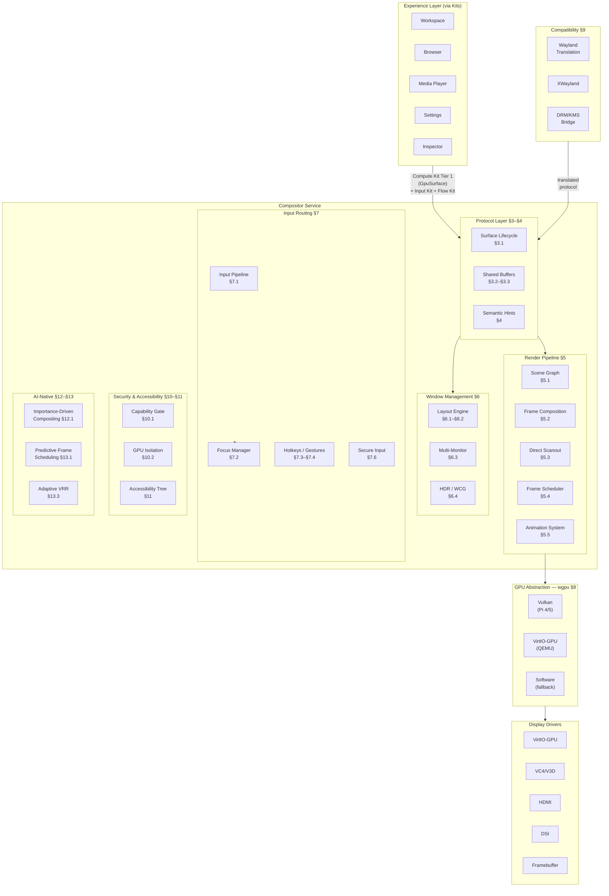

# AIOS Compositor and Display Architecture

## Deep Technical Architecture

**Parent document:** [architecture.md](../project/architecture.md)
**System service, NOT a Kit:** The compositor is an internal system service — apps never call compositor APIs directly. Apps interact with display through [Compute Kit](../kits/kernel/compute.md) Tier 1 (`GpuSurface`), input through [Input Kit](../kits/platform/input.md), and data transfer through [Flow Kit](../kits/intelligence/flow.md). See [ADR: Kit Architecture](../knowledge/decisions/2026-03-22-jl-kit-architecture.md).
**Related:** [gpu.md](./gpu.md) — GPU & Display architecture, [subsystem-framework.md](./subsystem-framework.md) — Display subsystem framework, [ipc.md](../kernel/ipc.md) — IPC protocol, [experience.md](../experience/experience.md) — Five Surfaces model, [model.md](../security/model.md) — Security and capability model, [airs.md](../intelligence/airs.md) — AI Runtime Services

-----

## Document Map

This document was split for navigability. Each sub-document preserves the original section numbers for cross-reference stability.

| Document | Sections | Content |
|---|---|---|
| **This file** | §1, §2, §15, §16 | Overview, architecture, design principles, implementation order |
| [protocol.md](./compositor/protocol.md) | §3, §4 | Compositor protocol (surface lifecycle, shared buffers, fences, damage), semantic hints |
| [rendering.md](./compositor/rendering.md) | §5, §6 | Render pipeline (scene graph, composition, direct scanout, frame scheduling, animation), layout engine |
| [input.md](./compositor/input.md) | §7 | Input routing (pipeline, focus, hotkeys, gestures, gamepad/touch, secure input) |
| [gpu.md](./compositor/gpu.md) | §8, §9 | GPU abstraction (wgpu, VirtIO-GPU, VC4/V3D, shaders), Wayland and POSIX compatibility |
| [security.md](./compositor/security.md) | §10, §11 | Security model (capabilities, GPU isolation, capture protection), accessibility |
| [ai-native.md](./compositor/ai-native.md) | §12, §13, §14 | AI-native compositing (AIRS-dependent), kernel-internal ML, future directions |

-----

## 1. Core Insight

Traditional window managers are dumb frame compositors. They know nothing about window content — they paste rectangular pixel buffers together and present them to the display. Window management decisions (tiling, stacking, focus) are based on user commands, not content understanding.

AIOS's compositor is **semantically aware**. It receives hints from agents about what their windows contain, the user's context from the Context Engine, and attention state from the Attention Manager. It uses this to make intelligent layout, focus, and animation decisions — while still letting the user override everything manually.

The compositor is also the **display subsystem** in the subsystem framework. It implements the same capability gate, session model, audit logging, power management, and POSIX bridge as every other subsystem (see [subsystem-framework.md](./subsystem-framework.md) §3–§4).

**The compositor is a system service, not a Kit.** Apps never import compositor APIs directly — they interact with display through Compute Kit Tier 1 (`GpuSurface` trait), receive input through Input Kit, and exchange content through Flow Kit. The compositor consumes these Kit primitives internally to compose surfaces, route input, and manage layout. This keeps the app-facing API stable even as compositor internals evolve.

**What makes AIOS different from Wayland compositors:**

- **Semantic hints** — agents declare content type, urgency, and interaction state; the compositor uses this for intelligent layout ([§4](./compositor/protocol.md))
- **AIRS integration** — the AI runtime scores window importance, predicts focus changes, and adapts refresh rates ([§12](./compositor/ai-native.md))
- **Capability-gated everything** — surface creation, fullscreen, overlay, screen capture, input injection all require explicit capability tokens ([§10](./compositor/security.md))
- **Scene graph, not framebuffers** — a Flatland-inspired 2D scene graph replaces the traditional damage-list compositor model ([§5.1](./compositor/rendering.md))
- **Kernel-internal ML** — frozen decision trees predict frame costs, adapt GPU frequency, and detect attention patterns without AIRS ([§13](./compositor/ai-native.md))

-----

## 2. Architecture



-----

## 15. Design Principles

1. **Semantic, not just spatial.** The compositor understands content types, not just rectangles. Layout, focus, and animation decisions are informed by agent hints and AIRS context.

2. **60 fps or drop features.** Frame rate is sacred. If effects cannot maintain 60 fps, they are disabled automatically. The animation system degrades gracefully: spring physics → linear interpolation → instant transition.

3. **Zero-copy when possible.** Shared buffers, direct scanout, multiplane overlay, damage tracking — minimize GPU copies. The compositor never copies pixel data if a pointer swap suffices.

4. **Accessibility from day one.** Accessibility is a design constraint from Phase 7; full implementation is delivered in Phase 34. Screen reader support shapes early architectural decisions. The accessibility tree exists from the first composited frame.

5. **Input is mediated.** All input flows through the compositor. No agent can capture global input without a capability token. Keystroke injection is impossible without `SyntheticInput` capability ([§7.6](./compositor/input.md)).

6. **HiDPI is default.** Scaling is always active. 1x is just `scale=1.0`. Per-output scaling handles mixed-DPI setups (laptop + external monitor).

7. **Scene graph, not framebuffers.** The compositor maintains a 2D scene graph (Flatland-inspired), not a flat list of damage rectangles. This enables efficient occlusion culling, hierarchical transforms, and effect composition.

8. **Capability-gated operations.** Every compositor operation — surface creation, fullscreen, overlay, screen capture, input routing — is gated by capability tokens. Trust levels determine available operations.

9. **GPU isolation.** Each agent's GPU context is isolated. A malicious shader cannot read another agent's framebuffer. IOMMU enforcement prevents DMA attacks.

10. **AI-aware rendering budget.** AIRS scores window importance; the compositor allocates rendering budget accordingly. Unattended windows receive lower frame rates and quality.

11. **Wayland compatibility.** Linux GUI applications run via a Wayland translation layer. The compositor speaks AIOS native protocol internally but translates Wayland protocol at the boundary.

12. **Power-proportional.** GPU frequency scales with rendering load via DVFS. Static content reduces refresh rate. The compositor is the largest single consumer of GPU power and manages it actively.

13. **Apps never call compositor directly.** The compositor is a system service, not a Kit. Apps interact with display through Compute Kit Tier 1 (`GpuSurface`), input through Input Kit, and data transfer through Flow Kit. The compositor consumes these Kit primitives internally — its protocol is not part of the public API surface.

-----

## 16. Implementation Order

```text
Phase 6 — GPU and Display:
  ├── VirtIO-GPU driver (MMIO transport, 2D/3D commands)
  ├── wgpu initialization (Vulkan backend on real hardware, VirtIO on QEMU)
  ├── Font rendering (fontdue or ab_glyph, glyph atlas)
  ├── Basic surface composition (scene graph, damage tracking)
  └── Direct scanout for single fullscreen surface

Phase 7 — Window Compositor and Shell:
  ├── Compositor protocol (IPC-based surface lifecycle)
  ├── Shared buffer protocol (double buffering, release fences)
  ├── Window manager (floating + tiling layout modes)
  ├── Input routing (keyboard/mouse focus, global hotkeys)
  ├── Damage tracking + VSync (60 fps target)
  ├── Desktop shell (taskbar, launcher, status strip)
  ├── Semantic hints (content-aware layout)
  ├── Animation system (window open/close/resize transitions)
  └── Multi-monitor support (HiDPI, extended desktop)

Phase 15 — Attention Management:
  ├── AIRS importance scoring integration
  ├── Attention-aware rendering priority
  └── Context-aware notification suppression

Phase 18 — Security Hardening:
  ├── Capability-gated surface operations
  ├── GPU process isolation (IOMMU enforcement)
  ├── Screen capture protection
  └── Secure input mode

Phase 22 — Performance and Optimization:
  ├── Kernel-internal ML: predictive frame scheduling
  ├── GPU DVFS power management
  ├── Activity-based variable refresh rate
  ├── AOT shader compilation pipeline
  └── Multiplane overlay (hardware planes bypass compositor)

Phase 30 — Interface Kit:
  └── Interface Kit (AIOS-native UI foundation; iced/Flutter/Qt are bridges above)

Phase 34 — Accessibility:
  ├── Accessibility tree (full WAI-ARIA role support)
  ├── Screen reader integration
  ├── Compositor-level magnification
  ├── High contrast / reduced motion modes
  └── Keyboard navigation (focus ring, spatial nav)

Phase 37 — Wayland Compatibility:
  ├── Wayland translation layer (Smithay-based)
  ├── Protocol mapping (wl_surface → SurfaceId)
  ├── XWayland integration (X11 backward compatibility)
  ├── DRM/KMS POSIX bridge
  └── Security context mapping (wp_security_context → capabilities)
```

-----

## Cross-Reference Index

Quick lookup for commonly referenced sections across the compositor sub-documents:

| Reference | Location | Topic |
|---|---|---|
| §3.1 Surface Lifecycle | [protocol.md](./compositor/protocol.md) | Surface states, creation, destruction |
| §3.2 Shared Buffer Protocol | [protocol.md](./compositor/protocol.md) | Zero-copy buffer sharing, double buffering |
| §3.3 Buffer Synchronization | [protocol.md](./compositor/protocol.md) | Acquire/release fences |
| §3.4 Damage Reporting | [protocol.md](./compositor/protocol.md) | Per-surface damage regions |
| §4.1 Content Types | [protocol.md](./compositor/protocol.md) | SurfaceContentType enum, layout preferences |
| §4.2 Interaction State | [protocol.md](./compositor/protocol.md) | InteractionState, urgency, layers |
| §4.3 Hint-Driven Behavior | [protocol.md](./compositor/protocol.md) | Content type × interaction state decision matrix |
| §5.1 Scene Graph | [rendering.md](./compositor/rendering.md) | Flatland-inspired 2D scene graph |
| §5.2 Frame Composition | [rendering.md](./compositor/rendering.md) | Damage collection, occlusion culling |
| §5.3 Direct Scanout | [rendering.md](./compositor/rendering.md) | Zero-copy fullscreen bypass |
| §5.4 Frame Scheduling | [rendering.md](./compositor/rendering.md) | VK_EXT_present_timing-style feedback |
| §5.5 Animation System | [rendering.md](./compositor/rendering.md) | Easing, transitions, 60 fps guarantee |
| §6.1 Layout Modes | [rendering.md](./compositor/rendering.md) | Floating, tiling, fullscreen, stacked |
| §6.2 Context-Aware Layout | [rendering.md](./compositor/rendering.md) | Context Engine integration |
| §6.3 Multi-Monitor | [rendering.md](./compositor/rendering.md) | HiDPI, extended desktop |
| §6.4 HDR and Wide Color Gamut | [rendering.md](./compositor/rendering.md) | Color spaces, tone mapping |
| §7.1 Input Pipeline | [input.md](./compositor/input.md) | Event flow from device to agent |
| §7.2 Focus Management | [input.md](./compositor/input.md) | Keyboard/pointer focus, Alt+Tab |
| §7.3 Global Hotkeys | [input.md](./compositor/input.md) | System-level key bindings |
| §7.4 Gesture Recognition | [input.md](./compositor/input.md) | Multi-touch state machine |
| §7.6 Secure Input | [input.md](./compositor/input.md) | Keystroke injection prevention |
| §8.1 wgpu Integration | [gpu.md](./compositor/gpu.md) | Backend selection, device lifecycle |
| §8.2 VirtIO-GPU | [gpu.md](./compositor/gpu.md) | QEMU development backend |
| §8.5 Shader Pipeline | [gpu.md](./compositor/gpu.md) | AOT compilation, built-in shaders |
| §9.1 Wayland Translation | [gpu.md](./compositor/gpu.md) | Smithay-based Wayland bridge |
| §9.4 DRM/KMS Bridge | [gpu.md](./compositor/gpu.md) | POSIX display device emulation |
| §9.5 Security Context | [gpu.md](./compositor/gpu.md) | wp_security_context → capabilities |
| §10.1 Capability-Gated Surfaces | [security.md](./compositor/security.md) | DisplayCapability, trust levels |
| §10.2 GPU Isolation | [security.md](./compositor/security.md) | Per-process GPU context, IOMMU |
| §10.3 Screen Capture | [security.md](./compositor/security.md) | Capture capability, watermarking |
| §11.1 Accessibility Tree | [security.md](./compositor/security.md) | AccessNode, WAI-ARIA roles |
| §11.3 Magnification | [security.md](./compositor/security.md) | Compositor-level zoom |
| §12.1 Importance-Driven Compositing | [ai-native.md](./compositor/ai-native.md) | AIRS semantic window scoring |
| §12.3 Layout Prediction | [ai-native.md](./compositor/ai-native.md) | RL-based layout recommendation |
| §12.5 Content-Aware VRR | [ai-native.md](./compositor/ai-native.md) | Semantic refresh rate adaptation |
| §13.1 Predictive Frame Scheduling | [ai-native.md](./compositor/ai-native.md) | Decision tree frame cost prediction |
| §13.2 GPU DVFS | [ai-native.md](./compositor/ai-native.md) | LithOS-inspired power management |
| §13.5 Gaze Prediction | [ai-native.md](./compositor/ai-native.md) | Foveated compositing |
| §14.1 GPU Preemptive Scheduling | [ai-native.md](./compositor/ai-native.md) | LithOS/XSched research |
