# AIOS AI-Native Compositing

Part of: [compositor.md](../compositor.md) — Compositor and Display Architecture
**Related:** [airs.md](../../intelligence/airs.md) — AI Runtime Services, [context-engine.md](../../intelligence/context-engine.md) — Context Engine, [attention.md](../../intelligence/attention.md) — Attention Manager, [rendering.md](./rendering.md) — Render pipeline

-----

## 12. AI-Native Compositing (AIRS-Dependent)

The features in this section require the AIRS inference engine to be running. Each feature queries AIRS for semantic understanding of user context, surface content, or task state. When AIRS is unavailable — during early boot, on devices without local inference capability, or when the user disables AI features — every feature falls back to a simpler heuristic or is disabled entirely. The compositor never blocks on AIRS; all queries are asynchronous with bounded timeout.

-----

### 12.1 Importance-Driven Compositing

Inspired by CHI 2011 research on importance-driven rendering for interactive visualization, the compositor assigns a semantic importance score to every visible surface. Rather than treating all windows as equal consumers of rendering resources, the compositor allocates GPU time proportionally to how important each surface is to the user's current task.

```rust
/// Per-surface importance assessment from AIRS.
pub struct ImportanceScore {
    surface_id: SurfaceId,
    /// Composite score in the range [0.0, 1.0].
    score: f32,
    /// Individual factors that contributed to the composite score.
    factors: Vec<ImportanceFactor>,
}

/// Factors that contribute to a surface's importance score.
pub enum ImportanceFactor {
    /// How much user attention the surface is receiving (gaze, input focus).
    UserAttention(f32),
    /// Semantic relevance of the surface's content to the active task.
    ContentRelevance(f32),
    /// Time-sensitivity of the surface's content (notifications, timers).
    TemporalUrgency(f32),
    /// Alignment between the surface and the user's declared task goal.
    TaskAlignment(f32),
}
```

AIRS scores each visible surface by querying the Context Engine for the active task and the Attention Manager for focus state. The composite score maps directly to rendering quality:

| Score Range | Rendering Policy |
|---|---|
| > 0.8 | Full quality, full frame rate, all effects enabled |
| 0.5 -- 0.8 | Reduced visual effects (no blur, simpler shadows) |
| 0.2 -- 0.5 | Lower frame rate (15 fps), basic composition only |
| < 0.2 | Static: render once, cache as texture, re-render only on damage |

**Fallback without AIRS:** All surfaces receive a default score of 0.6 (equal priority, reduced effects tier). The compositor applies no importance differentiation.

-----

### 12.2 Attention-Aware Rendering Priority

The Attention Manager ([attention.md](../../intelligence/attention.md)) publishes per-surface attention state describing whether the user is actively looking at, peripherally aware of, or ignoring each surface. The compositor uses this signal to dynamically adjust rendering effort.

```rust
/// Attention-driven rendering configuration per surface.
pub struct AttentionRenderPolicy {
    surface_id: SurfaceId,
    target_fps: u32,
    effects_enabled: bool,
    cache_when_idle: bool,
}
```

**Rendering tiers by attention state:**

- **Attended** (active input or gaze): full 60 fps rendering, all visual effects enabled, damage processed immediately.
- **Unattended** (visible but not focused): frame rate reduced to 15 fps or lower, expensive effects (blur, shadows, animations) disabled.
- **Background** (occluded or minimized): rendered once on last damage, cached as a GPU texture, re-rendered only when new damage arrives and the surface becomes visible again.

On constrained hardware (Raspberry Pi 4), reducing unattended surfaces from 60 fps to 15 fps saves approximately 40% GPU power for typical multi-window workloads. When the user switches attention to a previously unattended surface, the compositor ramps rendering quality from cached to full over a 200 ms transition period to avoid visual pop-in.

**Fallback without AIRS:** The focused surface (keyboard input target) receives full rendering priority. All other visible surfaces render at 30 fps. No attention prediction is performed.

-----

### 12.3 Context-Aware Layout Prediction

The compositor uses reinforcement learning to predict the user's preferred window layout for a given task context. Over time, the system learns associations between task contexts (coding, writing, browsing, communication) and window arrangements, offering layout suggestions that match the user's habits.

```rust
/// A predicted layout configuration from the RL model.
pub struct LayoutPrediction {
    /// The layout mode to apply (tiling, floating, split, etc.).
    layout_mode: LayoutMode,
    /// Predicted position and size for each surface.
    surface_positions: Vec<(SurfaceId, Rect)>,
    /// Model confidence in this prediction [0.0, 1.0].
    confidence: f32,
}
```

**Training data:** Every manual layout adjustment the user makes — window move, resize, snap to edge, workspace switch — is recorded as a (context, action) pair. The Context Engine provides the task context label.

**Model:** Deep Q-Network (DQN) with state vector = (active_context, visible_surface_set, content_types) and action space = discrete layout configurations observed from the user's history. The model runs within AIRS and produces predictions asynchronously.

**Prediction threshold:** The compositor only applies a predicted layout when confidence exceeds 0.85. Below this threshold, the prediction is discarded silently to avoid jarring incorrect rearrangements.

**User override:** Any manual layout adjustment by the user immediately cancels the active prediction, restores user control, and feeds the correction back into the training data. The user is never locked into a predicted layout.

**Fallback without AIRS:** The compositor uses the static context-to-layout mapping table defined in the layout engine (rendering.md, section 6.2). No learning or adaptation occurs.

-----

### 12.4 Semantic Focus Management

AIRS predicts the user's next focus target based on task workflow understanding. If the user is editing code in an IDE and a build finishes in a terminal, AIRS predicts the terminal is the likely next focus target.

**Focus suggestion:** The compositor highlights the predicted next window with a subtle visual cue — a brief border glow or taskbar indicator. The compositor never automatically switches focus; the prediction is advisory only.

**Pre-render optimization:** When AIRS predicts the next focus target with high confidence, the compositor begins rendering that surface at full quality before the user switches to it. This eliminates the 1--2 frame latency of ramping up from cached or reduced rendering when the user does switch.

**Confidence threshold:** Focus suggestions are shown only when prediction confidence exceeds 0.9. Below this threshold, no visual cue appears and no pre-rendering occurs.

**Fallback without AIRS:** Standard most-recently-used focus ordering. Alt+Tab cycles through windows by recency. No prediction or pre-rendering.

-----

### 12.5 Content-Aware Variable Refresh Rate

AIRS classifies the content type of each visible surface and determines the optimal refresh rate per surface. The compositor aggregates these per-surface rates and drives the display at the highest required rate.

```rust
/// Content classification for refresh rate optimization.
pub enum ContentClass {
    /// Video playback — match source frame rate (24, 30, or 60 fps).
    Video { source_fps: u32 },
    /// Static document or image — minimal refresh needed.
    StaticDocument,
    /// Active text input — smooth cursor and character rendering.
    ActiveTyping,
    /// Game or real-time animation — maximum display refresh rate.
    GameAnimation,
    /// Scrolling content — match scroll velocity to refresh rate.
    Scrolling { velocity: f32 },
}
```

**Per-surface rates:**

| Content Class | Target Refresh Rate |
|---|---|
| Video | Source fps (24, 30, 60) |
| StaticDocument | 5--10 Hz (cursor blink only) |
| ActiveTyping | 30 Hz |
| GameAnimation | Maximum display rate |
| Scrolling | Proportional to velocity, capped at display max |

When multiple surfaces are visible, the display runs at the highest rate required by any surface. Individual surfaces below this rate skip frames (the compositor reuses their cached texture for skipped frames).

**Fallback without AIRS:** The compositor uses the motion-detection heuristic from section 13.3 (pixel delta analysis) to classify surfaces as static or active. No semantic content understanding is applied.

-----

### 12.6 AI Accessibility Adaptation

AIRS observes user interaction patterns over time and suggests accessibility adaptations when it detects consistent behavior that indicates a preference or need.

**Example adaptations:**

- User consistently zooms in on content: suggest a larger default font size or display scaling factor.
- User exclusively navigates with keyboard, never using mouse: suggest enhanced keyboard navigation mode with visible focus indicators.
- User exhibits slow or imprecise mouse targeting: suggest larger click targets and increased hit-test margins.
- User consistently increases media volume: suggest hearing accessibility features.

All adaptations are presented as notifications with explicit accept/dismiss actions. The compositor never applies accessibility changes automatically. Accepted adaptations are persisted in the Preferences service and integrated with the Accessibility Manager ([accessibility.md](../../experience/accessibility.md)).

**Fallback without AIRS:** No behavioral observation or adaptation suggestions. Users configure accessibility settings manually through the Settings application.

-----

### 12.7 Context-Aware Notification Timing

AIRS determines the optimal moment to deliver notifications based on the user's cognitive context, avoiding interruptions during focused work.

**Delivery strategies by context:**

- **Focused work** (high cognitive load detected): batch non-urgent notifications and deliver them during natural break points — when the user switches windows, pauses typing for > 10 seconds, or explicitly checks notifications.
- **Meeting context** (calendar integration): suppress all notifications below High urgency. Critical notifications (system alerts, security events) still break through.
- **Gaming context:** raise the urgency threshold — only High and Critical notifications are shown. Normal and Low are batched until the gaming session ends.
- **Idle/browsing** (low cognitive load): deliver notifications immediately with standard visual and audio cues.

**Urgency threshold:** Dynamically adjusted per context. Each context has a minimum urgency level; notifications below that level are queued rather than delivered.

**Fallback without AIRS:** Timer-based notification batching. When the user enables focus mode manually, non-urgent notifications are batched and delivered every 5 minutes as a summary.

-----

### 12.8 Task-Semantic Window Grouping

AIRS identifies windows that belong to the same logical task. A coding task might involve an IDE, a terminal, a browser showing documentation, and a database client. AIRS recognizes these as a group through content analysis and temporal co-occurrence patterns.

**Visual grouping:** Grouped windows share a subtle background tint and display a group indicator in the taskbar. The tint color is consistent per task context (coding = blue tint, writing = green tint, etc.).

**Group operations:**

- Minimize all windows in a group together (one click on the group indicator).
- Restore a group: all windows return to their positions within the group.
- Switch task context: switching to a different task context minimizes the current group and restores the target group.

**Integration with workspaces:** Task groups map naturally to virtual workspaces. Each workspace can host one or more task groups, and switching workspaces preserves group state.

**Fallback without AIRS:** No automatic grouping. Users can manually group windows through the window manager's group-by-drag or taskbar context menu.

-----

## 13. Kernel-Internal ML (No AIRS Dependency)

The features in this section use small, frozen models — decision trees, Markov chains, lookup tables, and simple statistical analyzers — that run entirely within the compositor process. They require no external inference engine, no GPU tensor acceleration, and no AIRS service. They work on every device from the first frame.

-----

### 13.1 Predictive Frame Scheduling

A decision tree predicts the rendering cost of each frame before composition begins, allowing the compositor to proactively reduce quality rather than reactively dropping frames.

**Feature vector** (computed from current scene state):

```rust
/// Input features for frame cost prediction.
pub struct FramePredictionFeatures {
    visible_surface_count: u32,
    total_damage_area_px: u64,
    active_effect_count: u32,
    animation_count: u32,
    output_resolution: (u32, u32),
}
```

**Prediction:** The model outputs `estimated_frame_ms` (continuous value). If the predicted cost exceeds the frame budget (16.67 ms for 60 fps), the compositor proactively disables effects or reduces composition quality before starting the frame. This avoids the stutter caused by reactive frame drops mid-render.

**Model characteristics:**

- Trained offline on compositor telemetry data (frame timing vs. scene state pairs).
- Deployed as a frozen lookup table with interpolation. Total model size < 1 KiB.
- Retrained periodically on-device during idle time using accumulated local telemetry. No inference engine required — the retraining is pure statistical aggregation.

-----

### 13.2 GPU DVFS Power Management

Inspired by LithOS (SOSP 2025), the compositor drives GPU dynamic voltage and frequency scaling (DVFS) based on rendering workload classification. Rather than reacting to GPU utilization after the fact, the compositor predicts the workload class from scene state and sets the GPU frequency before rendering begins.

```rust
/// GPU workload classification for DVFS control.
pub enum GpuWorkloadClass {
    /// No damage on any surface — GPU can idle.
    Idle,
    /// Less than 10% of screen area damaged.
    Light,
    /// 10--50% of screen area damaged.
    Medium,
    /// More than 50% damaged or visual effects active.
    Heavy,
    /// WebGPU or compute shader workload.
    Compute,
}
```

**Frequency mapping:**

| Workload Class | GPU Frequency | Typical Scenario |
|---|---|---|
| Idle | Minimum | No visible changes, screen static |
| Light | 25% max | Cursor movement, single text field update |
| Medium | 50% max | Window drag, partial screen scroll |
| Heavy | 75% max | Full-screen animation, multiple effects |
| Compute | 100% max | WebGPU rendering, shader compilation |

Frequency ramp-up takes effect within one frame. The compositor predicts the next frame's workload class from the current frame's scene state, so frequency is set pre-emptively rather than reactively. LithOS measurements report up to 46% GPU energy reduction on typical desktop workloads with this approach.

-----

### 13.3 Activity-Based VRR

A simple motion and input activity detector that adjusts display refresh rate without any AI inference. This serves as the fallback for the AIRS-dependent content-aware VRR (section 12.5) and works independently on all hardware.

```rust
/// Refresh rate policy determined by activity detection.
pub struct RefreshRatePolicy {
    min_hz: u32,
    max_hz: u32,
    current_hz: u32,
    reason: VrrReason,
}

/// Reason for the current refresh rate selection.
pub enum VrrReason {
    /// User keyboard, mouse, or touch input detected.
    UserInput,
    /// Surface content is animating (pixel deltas above threshold).
    Animation,
    /// Video playback detected via surface hints.
    VideoPlayback,
    /// All surfaces static (no pixel changes between frames).
    StaticContent,
    /// System in power-saving mode.
    PowerSaving,
}
```

**Motion detection:** After each frame, the compositor computes a pixel delta sum between the current and previous frame for each damaged region. If the delta falls below a configurable threshold for all surfaces, the display is classified as static and the refresh rate drops to `min_hz`.

**Input boost:** Any keyboard, mouse, or touch event immediately boosts the refresh rate to `max_hz` for 2 seconds, then the rate decays back toward the activity-determined level.

**Display compatibility:** Activity-based VRR is only activated on displays that report VRR support via EDID. On fixed-refresh displays, the compositor always runs at the panel's native rate.

-----

### 13.4 Window Switching Prediction

A first-order Markov chain on window switch history predicts the user's next Alt+Tab target. The compositor uses this prediction to pre-render the predicted window at full quality in the background, eliminating the stale-frame flash that occurs when switching to a window that was previously in cached/reduced rendering mode.

**Model:** Transition matrix P(next_window | current_window) for all active surfaces. Updated on every window switch event. The matrix is bounded to MAX_SURFACES entries and occupies less than 10 KiB of memory.

**Pre-rendering:** The surface with the highest transition probability from the current focused surface is rendered at full quality in the background. This costs approximately one additional surface worth of GPU work per frame.

**Latency reduction:** When the prediction is correct (which, for habitual users, occurs 40--60% of the time), Alt+Tab presents a fully rendered, current-frame surface instead of a stale cached texture. Perceived switch latency drops from 2--3 frames to zero.

-----

### 13.5 Gaze Prediction and Foveated Compositing

The compositor uses pointer position as a proxy for gaze direction and applies foveated rendering — full quality around the attention point, reduced quality in the periphery.

```rust
/// Foveated rendering zone classification.
pub enum FoveatedZone {
    /// Around the pointer (or eye tracker position). Full rendering quality.
    Full,
    /// Surrounding area. Half-resolution effects, simplified shadows.
    Medium,
    /// Screen periphery. No blur/shadow effects, lower texture quality.
    Reduced,
    /// Extreme periphery (multi-monitor edges). Minimal rendering.
    Minimal,
}
```

**Zone geometry:**

- **Full:** 200-pixel radius around the pointer position. All effects rendered at maximum quality.
- **Medium:** 200--600 pixel radius. Blur and shadow effects rendered at half resolution. Animation fidelity reduced.
- **Reduced:** Beyond 600 pixels from the pointer. No blur or shadow effects. Textures sampled at reduced quality. Animations simplified to position-only (no easing curves).
- **Minimal:** Applied to secondary monitors when the pointer is on the primary monitor. Surfaces rendered once and cached.

**Eye tracker integration:** If an eye tracker device is available (detected via the input subsystem), actual gaze position replaces pointer position as the fovea center. The eye tracker provides higher-frequency updates (120--240 Hz) and more accurate attention localization.

**Power impact:** Foveated compositing reduces GPU workload by approximately 20% on scenes with complex visual effects, based on published foveated rendering research. The savings scale with screen size and effect complexity.

-----

### 13.6 Neural Compositing

A research concept: replacing traditional alpha-blending composition with a small convolutional neural network (CNN) that learns to composite overlapping surfaces with higher visual quality than Porter-Duff blending.

**When beneficial:** Scenes with many overlapping semi-transparent surfaces — for example, a stack of translucent panels with blur effects — where the GPU spends significant time on multi-pass alpha blending.

**When NOT beneficial:** Typical desktop usage with few surfaces and mostly opaque content. Standard alpha blending is faster and produces identical results for opaque surfaces.

**Inference cost constraint:** The CNN must complete composition within approximately 2 ms per frame to be competitive with traditional alpha blending. This is viable only on hardware with tensor cores or dedicated neural network accelerators (not on the Raspberry Pi 4's VideoCore VI).

**Architecture:** A lightweight U-Net variant that takes the surface stack as input channels and produces the final composited frame. Trained on pairs of (surface_stack, ground_truth_composite) generated by a high-quality offline renderer.

**Status:** Research direction. The compositor includes the integration point (a pluggable composition backend) but defaults to standard Porter-Duff alpha blending. Neural compositing activates only when hardware capabilities are detected and the scene complexity justifies the overhead.

-----

### 13.7 AI Frame Generation

Inspired by NVIDIA DLSS 4 multi-frame generation, the compositor can render keyframes at a reduced rate and generate intermediate frames via motion vector interpolation to maintain smooth visual output.

**Mechanism:**

1. The compositor renders full keyframes at a reduced rate (e.g., 30 fps instead of 60 fps).
2. Per-surface motion vectors are computed from scene graph transform changes between consecutive keyframes (translation delta, scale delta, rotation delta).
3. Intermediate frames are generated by interpolating surface positions along the motion vectors. No pixel-level inference is performed — surfaces are shifted, scaled, and blended at the GPU texture level.

**Quality and latency tradeoff:** Generated frames introduce approximately one frame of additional display latency because the interpolation requires knowledge of the next keyframe's transforms. This is acceptable for media playback and passive viewing but noticeable during active keyboard and mouse interaction.

**Use case:** Power-constrained scenarios where rendering at 60 fps exceeds the thermal or power budget, but interpolating from 30 fps to 60 fps is within budget. Particularly relevant on battery-powered devices during video playback or slide presentations.

**Disable conditions:** Frame generation is automatically disabled when active input (keyboard or mouse events) is detected. During interaction, the compositor switches to direct rendering at whatever frame rate the hardware can sustain, accepting lower fps over the latency penalty of generated frames.

-----

### 13.8 Short-Term Attention Pattern Analysis

A purely statistical attention model that tracks window dwell time and input recency without any AI inference. This provides a baseline attention signal that feeds into rendering priority decisions, complementing the AIRS-dependent attention model (section 12.2) when AIRS is unavailable.

**Metrics collected:**

- Per-surface dwell time: seconds of keyboard/mouse focus in the last 5-minute window.
- Input recency: timestamp of the last input event routed to each surface.
- Switch frequency: how often the user switches to and from each surface.

**Recency-weighted model:** An exponential decay function weights recent focus higher than older focus. A surface that was actively used 30 seconds ago scores higher than one used 3 minutes ago, even if the total dwell time is similar.

**Rendering priority feed:** Surfaces with high attention scores receive a slight rendering priority boost — they are composited first in the frame and receive preferential GPU scheduling. This ensures the user's most-used windows always appear at full quality.

**Relationship to section 12.2:** When AIRS is available, the Attention Manager's semantic attention signal supersedes this statistical model. When AIRS is unavailable, this model provides the only attention-based rendering differentiation.

-----

## 14. Future Directions

Research-informed improvements targeted at future phases. These features are not scheduled for near-term implementation but inform architectural decisions made in the current compositor design.

-----

### 14.1 GPU Preemptive Scheduling

LithOS (SOSP 2025) and XSched (OSDI 2025) demonstrate kernel-level GPU task preemption for interactive applications.

**Problem:** When AI inference and display rendering share the same GPU, long-running inference kernels (attention computation, image generation) can block compositor frame submission for tens of milliseconds, causing visible frame drops.

**Solution:** GPU command atomization — break long GPU operations into preemptible units. The compositor's frame submission commands receive highest priority and can preempt any background GPU work. The GPU scheduler ensures interactive surfaces are guaranteed a response time below 16.67 ms regardless of background GPU load.

**Architectural preparation:** The compositor's GPU abstraction layer (wgpu backend) already separates frame submission from compute dispatch. Adding preemption requires kernel-level GPU scheduler support, which depends on the GPU driver maturity (VirtIO-GPU in QEMU, VC4/V3D on Pi 4/5).

**Reference:** "LithOS: Principled GPU Sharing for Interactive Applications" (SOSP 2025).

-----

### 14.2 Tile-Based Dirty-Region Rendering

Divide the output framebuffer into fixed tiles (e.g., 64x64 pixels). Track damage at tile granularity rather than per-surface rectangular regions.

**Rendering optimization:** Only re-composite tiles that overlap damaged regions. Undamaged tiles are skipped entirely — no GPU draw calls are submitted for them.

**GPU tile rendering:** Submit per-tile draw calls, allowing the GPU to skip undamaged regions at the hardware level. This is a natural fit for the VC4/V3D tile-based rendering architecture on the Raspberry Pi 4 and Pi 5, where the GPU already processes the framebuffer in tiles internally.

**Expected impact:** For typical desktop workloads where only 5--15% of the screen changes per frame, tile-based rendering can reduce GPU draw call count by 80--90%.

-----

### 14.3 Immutable Shadow Tree

Inspired by React Native Fabric's architecture: maintain immutable snapshots of the scene graph that the render thread reads from while the update thread constructs new snapshots.

**Concurrency model:** The compositor thread reads the current immutable scene graph snapshot without locks. The update thread processes incoming surface damage, layout changes, and animation state, producing a new snapshot via structural sharing (only changed nodes are cloned; unchanged subtrees are shared between old and new snapshots).

**Lock-free access:** No mutex contention between scene graph updates and rendering. The render thread atomically swaps to the latest snapshot at the start of each frame.

**Diff-based updates:** The update thread computes a minimal diff between consecutive snapshots. Only changed nodes trigger GPU resource updates (texture uploads, transform recalculations).

**Memory overhead:** One additional snapshot copy in flight at any time. For typical scene graphs (50--200 nodes), this costs 10--50 KiB of additional memory.

-----

### 14.4 Raster/Compositor Thread Separation

Pipeline parallelism: separate the rasterization stage (converting scene graph nodes to GPU draw commands) from the composition stage (executing GPU commands and presenting the final frame to the display).

**Overlap:** Frame N rasterization runs concurrently with frame N-1 composition. While the GPU executes draw commands for the previous frame, the CPU prepares draw commands for the current frame.

**Latency reduction:** Effective frame latency is reduced by overlapping CPU and GPU work, approaching the maximum of (CPU_time, GPU_time) rather than their sum.

**Thread model:** Two dedicated threads with a double-buffered command list. The raster thread writes to the back buffer while the compositor thread reads from the front buffer. Swap occurs at frame boundaries.

-----

### 14.5 Nanite-Style LOD for Window Textures

Level-of-detail rendering for window textures, particularly useful during workspace overview and window-switching animations where windows are displayed at reduced size.

**Mipmap chain:** Generate a mipmap chain for each surface texture: full resolution, half resolution, quarter resolution, and so on. The compositor selects the mipmap level based on the surface's on-screen size.

**Overview mode:** During workspace overview (all windows visible at reduced size), windows are rendered using lower mipmap levels. This saves GPU bandwidth proportional to the reduction in on-screen pixels.

**Virtual texture streaming:** Only load the full-resolution mipmap level when a window is zoomed to a size where text is readable. At smaller sizes, the reduced mipmap provides sufficient visual fidelity and the full texture need not be resident in GPU memory.

-----

### 14.6 Adaptive Frequency VRR

Samsung-inspired continuous panel frequency adaptation over a wide range (10--120 Hz), going beyond the discrete rate steps in sections 12.5 and 13.3.

**Continuous rate selection:** The display panel operates at any frequency within its supported range, not just fixed multiples. Video at 24 fps drives the panel at exactly 24 Hz. Reading at low scroll velocity drives the panel at 12 Hz. Active gaming drives the panel at its maximum supported rate.

**Measured power savings:** Samsung reports up to 22% display panel power reduction with adaptive frequency compared to fixed 60 Hz operation, measured across typical smartphone usage patterns. Desktop workloads with long idle periods would see even greater savings.

**Integration:** Builds on the activity-based VRR (section 13.3) and content-aware VRR (section 12.5) with finer-grained frequency control. Requires display hardware that supports continuous VRR ranges (Adaptive-Sync / FreeSync / G-Sync Compatible panels).

-----

### 14.7 References

Cited research papers and production systems referenced throughout the compositor architecture:

| Reference | Citation | Relevant Sections |
|---|---|---|
| CHI 2011 | Importance-driven rendering for interactive visualization | §12.1 |
| DLSS 4 | NVIDIA multi-frame generation | §13.7 |
| Flutter Impeller | AOT shader compilation renderer | §8.5 ([gpu.md](./gpu.md)) |
| Fuchsia Flatland | Fuchsia.dev compositor architecture documentation | §5.1 ([rendering.md](./rendering.md)), §14.3 |
| Linux Color Pipeline API | Hardware color management (merged November 2025) | §6.4 ([rendering.md](./rendering.md)) |
| LithOS | "Principled GPU Sharing for Interactive Applications" — SOSP 2025 | §13.2, §14.1 |
| React Native Fabric | Immutable shadow tree architecture | §14.3 |
| Samsung Adaptive Frequency | Variable refresh rate display technology | §14.6 |
| Smithay | Rust Wayland compositor library (smithay.github.io) | §9.1 ([gpu.md](./gpu.md)) |
| VK_EXT_present_timing | Vulkan extension for frame pacing feedback | §5.4 ([rendering.md](./rendering.md)) |
| wp_security_context_v1 | Wayland security context protocol | §9.5 ([gpu.md](./gpu.md)) |
| XSched | "GPU Preemptive Scheduling" — OSDI 2025 | §14.1 |

```mermaid
flowchart TD
    subgraph AIRS_Services["AIRS Services"]
        CE["Context Engine"]
        AM["Attention Manager"]
        IE["Inference Engine"]
        PREF["Preferences"]
    end

    subgraph AIRS_Dependent["§12 AIRS-Dependent Features"]
        S12_1["§12.1 Importance-Driven\nCompositing"]
        S12_2["§12.2 Attention-Aware\nRendering"]
        S12_3["§12.3 Context-Aware\nLayout Prediction"]
        S12_4["§12.4 Semantic Focus\nManagement"]
        S12_5["§12.5 Content-Aware VRR"]
        S12_6["§12.6 AI Accessibility\nAdaptation"]
        S12_7["§12.7 Context-Aware\nNotification Timing"]
        S12_8["§12.8 Task-Semantic\nWindow Grouping"]
    end

    subgraph Kernel_Internal["§13 Kernel-Internal ML"]
        S13_1["§13.1 Predictive Frame\nScheduling"]
        S13_2["§13.2 GPU DVFS\nPower Management"]
        S13_3["§13.3 Activity-Based VRR"]
        S13_4["§13.4 Window Switching\nPrediction"]
        S13_5["§13.5 Foveated\nCompositing"]
        S13_6["§13.6 Neural\nCompositing"]
        S13_7["§13.7 AI Frame\nGeneration"]
        S13_8["§13.8 Short-Term\nAttention Analysis"]
    end

    CE --> S12_1
    AM --> S12_1
    CE --> S12_3
    IE --> S12_3
    AM --> S12_2
    CE --> S12_4
    AM --> S12_4
    IE --> S12_5
    CE --> S12_5
    IE --> S12_6
    PREF --> S12_6
    CE --> S12_7
    CE --> S12_8
    IE --> S12_8

    S13_3 -.->|"fallback for"| S12_5
    S13_8 -.->|"fallback for"| S12_2
```


