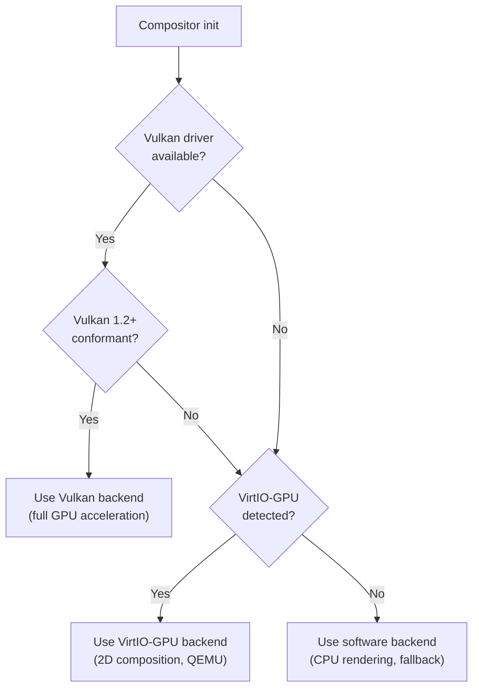
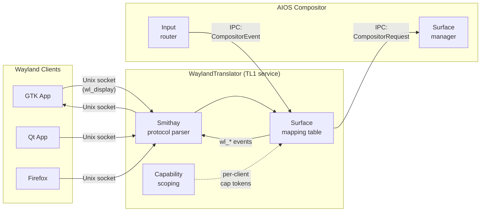

# AIOS GPU Abstraction and Wayland Compatibility

Part of: [compositor.md](../compositor.md) — Compositor and Display Architecture
**Related:** [rendering.md](./rendering.md) — Render pipeline and frame scheduling, [security.md](./security.md) — GPU isolation, [hal.md](../../kernel/hal.md) — Hardware abstraction layer

-----

## 8. GPU Abstraction Layer

The GPU abstraction layer provides a unified interface for surface composition, shader execution, and buffer management across multiple GPU backends. The compositor never calls hardware-specific APIs directly — all GPU interaction flows through the `GpuBackend` trait and the wgpu library.

### 8.1 wgpu Integration

The compositor uses wgpu as its primary GPU abstraction. wgpu provides a Vulkan/Metal/DX12-level API with a safety model that prevents GPU resource misuse at the type level. On AIOS, wgpu talks to either a Vulkan driver (real hardware) or VirtIO-GPU (QEMU), with a CPU software fallback for headless testing and minimal environments.

```rust
/// Trait implemented by each GPU backend (Vulkan, VirtIO-GPU, software).
pub trait GpuBackend: Send + Sync {
    /// Create a renderable surface bound to a display output.
    fn create_surface(&self, config: SurfaceConfig) -> Result<GpuSurface>;

    /// Submit a batch of render commands and present the result.
    /// Returns the timestamp at which the frame was presented (for latency tracking).
    fn submit_frame(
        &self,
        surface: &GpuSurface,
        commands: &[RenderCommand],
    ) -> Result<PresentTimestamp>;

    /// Query hardware capabilities for feature negotiation.
    fn query_capabilities(&self) -> GpuCapabilities;
}

/// Hardware capability descriptor — used by the compositor to select
/// rendering strategies and disable unsupported effects.
pub struct GpuCapabilities {
    /// Maximum texture dimension (width or height) in pixels.
    pub max_texture_size: u32,
    /// Maximum number of simultaneously active surfaces.
    pub max_surfaces: u32,
    /// Hardware multi-plane overlay support (enables direct scanout).
    pub multiplane_overlay: bool,
    /// Compute shader support (needed for Gaussian blur, tone mapping).
    pub compute_shaders: bool,
    /// HDR output support (wide color gamut, PQ/HLG transfer functions).
    pub hdr_output: bool,
}
```

**Backend selection** is automatic at compositor startup. The compositor probes available hardware and selects the most capable backend:



**Device and queue lifecycle.** The compositor creates one `wgpu::Device` per compositor instance. Each display output gets its own `wgpu::Queue` for independent command submission — this allows multi-monitor setups to submit frames without cross-output synchronization. The device is created with the minimum required feature set (push constants, texture compression, compute) and falls back gracefully when features are unavailable.

**GPU memory accounting.** While wgpu manages GPU-side allocation internally, the compositor tracks logical memory usage per agent through capability limits. Each agent's `DisplayCapability.max_memory` field caps the total GPU memory (textures, buffers, shader pipelines) that agent can consume. Exceeding the limit causes `create_surface` or buffer allocation to return `Err(GpuMemoryExhausted)`.

**Error recovery.** GPU device loss (driver crash, hardware reset, power management event) is handled by recreating the wgpu device and all dependent resources. The compositor maintains enough state to reconstruct all active surfaces, shader pipelines, and buffer bindings. Agents receive a `Configure` event after recovery, prompting them to re-render their content. The recovery path avoids data loss — surface content may show a stale frame during the recovery window, but no surface state is permanently lost.

### 8.2 VirtIO-GPU Driver Architecture

The VirtIO-GPU driver provides 2D surface composition for QEMU development environments. It follows the same MMIO legacy transport pattern as the existing VirtIO-blk driver (`kernel/src/drivers/virtio_blk.rs`), sharing device discovery, virtqueue setup, and polled I/O infrastructure.

**Device discovery.** The driver scans VirtIO MMIO slots at `0x0A00_0000`–`0x0A00_3E00` (512-byte stride) looking for device ID 16 (GPU). On QEMU virt, the GPU device appears when launched with `-device virtio-gpu-device`. The DTB is checked first for device nodes; brute-force MMIO probing is the fallback.

**Core operations.** The VirtIO-GPU 2D command set provides four fundamental operations:

```rust
/// VirtIO-GPU 2D command interface.
pub trait VirtioGpu2D {
    /// Allocate a 2D resource (framebuffer) on the host.
    /// Returns a resource_id used in subsequent operations.
    fn create_resource_2d(
        &mut self,
        width: u32,
        height: u32,
        format: VirtioGpuFormat,
    ) -> Result<ResourceId>;

    /// Transfer a rectangular region from guest memory to host resource.
    /// This copies pixel data from the guest-side framebuffer to the host.
    fn transfer_to_host_2d(
        &mut self,
        resource: ResourceId,
        rect: VirtioRect,
    ) -> Result<()>;

    /// Assign a resource to a display scanout (connects resource to output).
    fn set_scanout(
        &mut self,
        scanout_id: u32,
        resource: ResourceId,
        rect: VirtioRect,
    ) -> Result<()>;

    /// Flush a resource region to the display (triggers host-side render).
    fn resource_flush(
        &mut self,
        resource: ResourceId,
        rect: VirtioRect,
    ) -> Result<()>;
}
```

**Frame presentation flow.** A single frame goes through: (1) the compositor renders into a guest-side buffer, (2) `transfer_to_host_2d` copies the damaged region to the host resource, (3) `resource_flush` tells QEMU to update the display window. Only damaged regions are transferred, matching the compositor's damage tracking.

**2D vs 3D.** Phase 5 uses the 2D command set exclusively — it provides surface composition without requiring 3D acceleration on the host. The 3D command set (Virgl for OpenGL, Venus for Vulkan) enables GPU-accelerated rendering inside the guest, but requires host GPU drivers and is reserved for future phases where agents need WebGPU or GPU compute.

**Backing storage.** Each 2D resource requires guest memory to hold the pixel data. The driver allocates backing pages from the DMA pool (`Pool::Dma`) and attaches them to the resource via `resource_attach_backing`. The host reads from these pages during `transfer_to_host_2d`. Pages remain pinned for the lifetime of the resource.

**MMIO register layout.** The VirtIO-GPU driver uses the same MMIO legacy register offsets as VirtIO-blk:

| Register | Offset | Purpose |
|---|---|---|
| `MagicValue` | `0x000` | Must read `0x74726976` ("virt") |
| `Version` | `0x004` | Legacy = 1 |
| `DeviceId` | `0x008` | GPU = 16 |
| `QueueNumMax` | `0x034` | Maximum virtqueue size |
| `QueuePfn` | `0x040` | Physical page number of virtqueue |
| `InterruptStatus` | `0x060` | Interrupt status (polled, not used) |
| `Status` | `0x070` | Device status (ACKNOWLEDGE, DRIVER, FEATURES_OK, DRIVER_OK) |

**Driver structure notes.** The VirtIO-GPU driver reuses the same virtqueue infrastructure as VirtIO-blk: descriptor table, available ring, used ring, and polled completion. The primary difference is command encoding — GPU commands are variable-length control messages rather than fixed block I/O requests. Full driver architecture details are specified in a dedicated GPU/driver architecture document for Phase 5 implementation.

### 8.3 Hardware GPU Drivers

Hardware GPU drivers target the Raspberry Pi 4 (VC4/VideoCore IV) and Raspberry Pi 5 (V3D/VideoCore VII). Both are tile-based rendering GPUs — a property the compositor exploits for efficient damage-based composition.

**VC4 (Raspberry Pi 4).** The VideoCore IV GPU provides Vulkan 1.2 support via the Mesa v3dv driver. Key characteristics:

| Property | Value |
|---|---|
| Vulkan conformance | 1.2 (v3dv) |
| Max texture size | 4096 x 4096 |
| Compute shaders | Limited (no general-purpose compute) |
| Tile size | 64 x 64 pixels |
| GPU memory | Shared with system RAM (CMA) |

**V3D (Raspberry Pi 5).** The improved VideoCore VII GPU offers better Vulkan conformance, compute shader support, and higher throughput:

| Property | Value |
|---|---|
| Vulkan conformance | 1.3 (v3dv) |
| Max texture size | 8192 x 8192 |
| Compute shaders | Supported |
| Tile size | 64 x 64 pixels |
| GPU memory | Shared with system RAM (CMA) |

**Driver structure.** Each hardware driver implements a DRM/KMS-equivalent abstraction layer:

- **Mode setting**: configure display outputs (resolution, refresh rate, color depth) through the display controller
- **Buffer management**: allocate and manage GPU buffer objects (GEM objects) backed by CMA memory
- **Command submission**: push rendering commands via a ring buffer; track completion with fence objects

**Tile-based rendering optimization.** VC4 and V3D divide the screen into tiles and render each tile independently. The compositor aligns its damage tracking with tile boundaries — when only a few tiles are damaged, the GPU skips rendering untouched tiles entirely. This makes partial-screen updates (typing in a terminal, cursor blink) significantly cheaper than full-screen redraws.

**Power management.** The GPU driver coordinates with the kernel's power management subsystem. When the display is idle (no damage for multiple frames), the GPU clock is scaled down. When the device enters suspend, the driver saves GPU state (active resources, scanout configuration) and restores it on resume. Power state transitions are audited for debugging wake-from-suspend display issues.

Full hardware driver details, register maps, and command stream encoding are deferred to a dedicated GPU architecture document.

### 8.4 GPU Memory Management

GPU memory management coordinates between the compositor's per-agent accounting, the kernel's physical memory pools, and each GPU backend's internal allocation.

```rust
/// Tracks GPU memory usage per agent. One instance per compositor.
pub struct GpuMemoryAllocator {
    /// Per-agent usage tracking: agent_id -> (current_bytes, limit_bytes).
    agent_usage: BTreeMap<AgentId, GpuMemoryAccount>,
    /// Global GPU memory statistics.
    total_gpu_memory: usize,
    available_gpu_memory: usize,
}

pub struct GpuMemoryAccount {
    /// Current GPU memory consumption in bytes.
    current: usize,
    /// Maximum allowed by DisplayCapability.max_memory.
    limit: usize,
    /// Number of active buffer objects.
    buffer_count: u32,
}
```

**Buffer object lifecycle.** GPU buffers follow a strict lifecycle to prevent leaks and ensure deterministic cleanup:

```text
create(size, format, usage)
  -> BufferHandle allocated, agent usage incremented
  -> map(handle) — CPU-visible mapping for rendering
  -> render into mapped buffer
  -> unmap(handle) — release CPU mapping, buffer is GPU-only
  -> compositor reads buffer for composition
  -> destroy(handle) — buffer freed, agent usage decremented
```

**Shared GPU/CPU memory.** On Raspberry Pi hardware (VC4/V3D), the GPU shares system RAM via the Contiguous Memory Allocator (CMA). This enables zero-copy buffer sharing: an agent renders into a CMA-backed buffer, and the GPU reads directly from the same physical pages during composition. No DMA transfer or copy is needed. CMA allocations come from the kernel's DMA pool (`kernel/src/mm/pools.rs`, Pool::Dma).

**GPU memory pressure.** When available GPU memory drops below a threshold, the allocator triggers eviction:

1. **Glyph cache eviction**: least-recently-used glyph atlas pages are freed (re-rasterized on demand)
2. **Thumbnail eviction**: window preview thumbnails (Alt+Tab, task switcher) are discarded
3. **Texture downscale**: non-focused surface textures are downscaled to half resolution
4. **Agent notification**: agents with high usage receive `GpuMemoryPressure` events via IPC

**Per-agent limits.** Each agent's GPU memory is capped by `DisplayCapability.max_memory`, set when the display session is opened:

| Trust level | Default GPU memory limit | Max surfaces | Use case |
|---|---|---|---|
| TL0 (kernel) | Unlimited | Unlimited | Compositor itself |
| TL1 (system) | 256 MB | 64 | System shell, desktop |
| TL2 (trusted) | 128 MB | 32 | User-installed apps |
| TL3 (untrusted) | 32 MB | 8 | Sandboxed / web apps |

The limit covers textures, buffer objects, and compiled shader pipelines. Agents can request a higher limit via the capability system, subject to user approval and available GPU memory.

### 8.5 Shader Pipeline

All compositor shaders are compiled ahead-of-time to SPIR-V at build time. There is no runtime shader compilation — this eliminates shader compilation stutter (a common source of frame drops in GPU-accelerated compositors) and follows the same design philosophy as Flutter's Impeller renderer.

```rust
/// Pre-compiled shader library loaded at compositor init.
pub struct ShaderLibrary {
    /// Standard Porter-Duff alpha blending (src-over, dst-over, etc.).
    pub blend_shader: CompiledShader,
    /// Two-pass separable Gaussian blur (for frosted glass effects).
    pub blur_shader: CompiledShader,
    /// Box shadow with pre-computed kernel (cached per radius).
    pub shadow_shader: CompiledShader,
    /// SDF-based rounded corner clipping.
    pub rounded_corners_shader: CompiledShader,
    /// Color space conversion (sRGB, linear, Display P3).
    pub color_transform_shader: CompiledShader,
    /// HDR tone mapping (Reinhard, ACES, PQ to SDR).
    pub tone_map_shader: CompiledShader,
}
```

**Built-in shader catalog:**

| Shader | Technique | Use case |
|---|---|---|
| Alpha blend | Porter-Duff compositing (12 blend modes) | Every frame — surface composition |
| Gaussian blur | Two-pass separable (horizontal + vertical) | Frosted glass overlays, notification backgrounds |
| Box shadow | Pre-computed 1D kernel, cached per radius | Window drop shadows |
| Rounded corners | Signed distance field (SDF) evaluation | Window corner clipping |
| Color space | Matrix multiplication (3x3 color matrix) | sRGB to linear, sRGB to P3, gamma correction |
| Tone mapping | Reinhard / ACES filmic | HDR content on SDR displays |

**Shader cache.** Compiled pipeline state objects (PSOs) are cached by their configuration tuple: `(blend_mode, source_format, destination_format, output_color_space)`. The compositor pre-warms the cache at startup for the most common configurations (src-over blend, ARGB8888 source, XRGB8888 destination, sRGB output). Cache hits avoid pipeline creation entirely — a critical optimization since pipeline creation can take milliseconds on some drivers.

**Custom shaders.** Agents cannot submit custom shaders to the compositor pipeline. This is a deliberate security constraint — a malicious shader could read other agents' surface data, cause GPU hangs, or exploit driver vulnerabilities. The compositor's built-in shader set covers all composition effects.

**Agent GPU compute.** The browser agent's WebGPU implementation runs on a separate, sandboxed shader pipeline with its own wgpu device. WebGPU shaders execute in an isolated GPU context with no access to compositor surfaces or other agents' GPU resources. This separation is enforced at the wgpu device level — each sandboxed context gets its own `wgpu::Device` with independent memory and command submission.

**Shader validation.** All SPIR-V shader modules are validated at build time using the `naga` shader translator (part of the wgpu ecosystem). Naga checks for out-of-bounds access patterns, infinite loops, and resource binding mismatches. Shaders that fail validation cause a build error — they never reach the GPU driver.

**Performance characteristics.** The shader pipeline is designed for consistent frame times rather than peak throughput:

- **Zero stutter**: AOT compilation eliminates first-use compilation pauses
- **Cache-friendly**: pipeline state objects are pre-warmed for common configurations at compositor startup
- **Fallback path**: when compute shaders are unavailable (VC4), blur and tone mapping use fragment shader equivalents with slightly lower quality but identical frame timing
- **Batch efficiency**: multiple surfaces sharing the same blend mode are batched into a single draw call

-----

## 9. Wayland and POSIX Compatibility

AIOS provides Wayland protocol compatibility for running existing Linux GUI applications. The translation layer bridges the gap between Wayland's Unix socket protocol and AIOS's capability-gated IPC compositor interface. This enables the full ecosystem of GTK, Qt, and Electron applications to run on AIOS without modification, while native AIOS agents use the more capable compositor IPC protocol directly.

### 9.1 Wayland Translation Layer Architecture

The `WaylandTranslator` runs as a TL1 (trusted) system service. It accepts Wayland client connections over Unix domain sockets, parses the Wayland wire protocol, and translates each request into AIOS compositor IPC messages.



**Smithay integration.** The translator uses the Smithay Rust library for Wayland protocol parsing and client state management. Smithay handles the wire format, object lifecycle, and protocol version negotiation. The translator focuses on mapping Smithay's parsed requests to AIOS compositor operations.

**Surface mapping.** Each Wayland `wl_surface` maps to exactly one AIOS `SurfaceId`. The translator maintains a bidirectional mapping table:

```rust
pub struct SurfaceMappingTable {
    /// Wayland object id -> AIOS surface id.
    wayland_to_aios: HashMap<WlSurfaceId, SurfaceId>,
    /// AIOS surface id -> Wayland object id (for event routing).
    aios_to_wayland: HashMap<SurfaceId, WlSurfaceId>,
    /// Per-client metadata (pid, security context, capability token).
    client_info: HashMap<WlClientId, ClientInfo>,
}
```

**Event translation.** Compositor events are converted to Wayland protocol events: `Configure` becomes `xdg_surface.configure` + `xdg_toplevel.configure`, `FocusChanged` becomes `wl_keyboard.enter` / `wl_keyboard.leave`, and `CloseRequested` becomes `xdg_toplevel.close`.

**Buffer translation.** Wayland clients provide buffers in two formats:

- **`wl_shm_buffer`** (shared memory): maps to an AIOS `SharedBuffer` backed by a shared memory region. The translator creates the shared memory mapping when the client attaches a `wl_shm_pool` and tracks buffer release callbacks to prevent use-after-free.
- **`linux_dmabuf`** (DMA buffer): maps directly to a `GpuBuffer` for zero-copy GPU import. The compositor reads the client's GPU buffer directly during composition without any memory copy. This path is preferred for GPU-rendered clients (e.g., Firefox with WebRender, GPU-accelerated toolkits).

### 9.2 Protocol Mapping

The following table shows how Wayland protocol objects map to AIOS compositor equivalents:

| Wayland Object | AIOS Equivalent | Notes |
|---|---|---|
| `wl_surface` | `SurfaceId` | 1:1 mapping, lifecycle managed by translator |
| `wl_buffer` (wl_shm) | `SharedBuffer` | Backed by AIOS shared memory region |
| `wl_buffer` (linux_dmabuf) | `GpuBuffer` | Direct GPU buffer import, zero-copy |
| `xdg_toplevel` | Window (`SurfaceLayer::Normal`) | Includes title, app_id, min/max size |
| `xdg_popup` | Popup (`SurfaceLayer::Overlay`) | Positioned relative to parent surface |
| `wl_seat` | `InputRouter` focus | One seat; multi-seat not supported |
| `wl_keyboard` | `KeyboardEvent` routing | Keymap via xkb, repeat rate from compositor |
| `wl_pointer` | `PointerEvent` routing | Cursor shape set via `wl_cursor` |
| `wl_output` | `Output` | Resolution, scale, transform, make/model |
| `wl_subsurface` | Child `SurfaceId` | Synchronized or desynchronized mode |

**Supported protocol extensions.** The translator advertises support for the following stable Wayland protocol extensions:

| Extension | Version | Purpose |
|---|---|---|
| `xdg-shell` | v6 | Window management (toplevel, popup, positioner) |
| `linux-dmabuf-v1` | v4 | Zero-copy GPU buffer sharing |
| `viewporter` | v1 | Source rectangle and destination size |
| `fractional-scale-v1` | v1 | Sub-pixel scaling (1.25x, 1.5x, etc.) |
| `presentation-time` | v1 | Frame presentation timestamps for latency measurement |
| `wp-security-context-v1` | v1 | Per-client security context (see [section 9.5](#95-security-context-mapping)) |
| `xdg-decoration-v1` | v1 | Server-side vs client-side window decoration negotiation |
| `idle-inhibit-v1` | v1 | Prevent screen dimming during video playback or presentations |
| `relative-pointer-v1` | v1 | Raw pointer motion for games and 3D applications |
| `pointer-constraints-v1` | v1 | Pointer lock and confinement for games |

### 9.3 XWayland Integration

XWayland provides X11 backward compatibility for legacy GUI applications that have not been ported to Wayland. The `WaylandTranslator` spawns XWayland as a child process when the first X11 application is launched.

**Rootless mode.** XWayland runs in rootless mode — each X11 window appears as a separate AIOS surface. There is no visible X11 root window, desktop, or window manager chrome. X11 windows are composited alongside native AIOS surfaces with full z-ordering, focus management, and layout integration.

**Window decoration.** X11 applications do not provide client-side decorations (title bar, close button). The compositor applies server-side decorations to XWayland surfaces, matching the same visual style as native AIOS windows. The user cannot distinguish an X11 window from a native window by its frame.

**Clipboard bridge.** X11 clipboard selections (`PRIMARY`, `CLIPBOARD`, `SECONDARY`) are bridged to the AIOS Flow clipboard channel. Copy in an X11 application makes content available to AIOS agents, and vice versa. The bridge handles format negotiation (text/plain, text/html, image/png) and conversion between X11 atoms and AIOS content types.

**Input handling.** XWayland receives input events from the compositor via the Wayland protocol and translates them to X11 events. The compositor treats XWayland as a single Wayland client — focus tracking, keyboard grab, and pointer confinement all go through the standard Wayland input routing path. X11 grabs (XGrabKeyboard, XGrabPointer) are translated to Wayland equivalents within XWayland's scope; they cannot capture global input without compositor approval.

**Performance.** XWayland adds one buffer copy per frame: the X11 application renders to an X11 pixmap, XWayland copies the pixmap to a Wayland shared memory buffer, and the compositor reads the Wayland buffer. This additional copy is acceptable for productivity applications (terminals, editors, office suites) but adds measurable latency for interactive content. Latency-sensitive applications should use native Wayland or the AIOS compositor protocol directly.

**Lifecycle.** XWayland is started on demand when the first X11 application is launched and shut down when the last X11 application exits. The WaylandTranslator monitors the XWayland process and restarts it if it crashes, preserving any connected X11 client sessions where possible.

### 9.4 DRM/KMS POSIX Bridge

The DRM/KMS bridge exposes standard Linux DRM device nodes for applications that interact with GPUs through the Direct Rendering Manager interface. This provides compatibility with Mesa, the Vulkan loader, and GPU-accelerated applications that use `libdrm`.

```rust
/// POSIX bridge for DRM/KMS device node emulation.
pub struct DrmBridge {
    /// Card device node (/dev/dri/card0) — display control + rendering.
    card_node: DeviceNode,
    /// Render device node (/dev/dri/renderD128) — rendering only, no display control.
    render_node: DeviceNode,
    /// Active framebuffer and CRTC state.
    mode_state: ModeState,
    /// GEM handle to AIOS SharedBuffer mapping.
    gem_handles: HashMap<GemHandle, SharedBufferId>,
}
```

**ioctl translation.** DRM ioctls are intercepted by the POSIX compatibility layer and translated to AIOS GPU abstraction calls:

| DRM ioctl | AIOS equivalent |
|---|---|
| `DRM_IOCTL_MODE_SETCRTC` | `DisplayManager.configure_output()` |
| `DRM_IOCTL_MODE_GETRESOURCES` | `DisplayManager.list_outputs()` |
| `DRM_IOCTL_MODE_CREATE_DUMB` | `GpuMemoryAllocator.create_buffer()` |
| `DRM_IOCTL_MODE_MAP_DUMB` | `SharedBuffer.map()` (CPU-visible mapping) |
| `DRM_IOCTL_MODE_DESTROY_DUMB` | `GpuMemoryAllocator.destroy_buffer()` |
| `DRM_IOCTL_MODE_PAGE_FLIP` | `GpuBackend.submit_frame()` |
| `DRM_IOCTL_PRIME_HANDLE_TO_FD` | Export `SharedBuffer` as file descriptor |
| `DRM_IOCTL_PRIME_FD_TO_HANDLE` | Import file descriptor as `GemHandle` |

**GEM and PRIME handles.** GEM (Graphics Execution Manager) handles are local to a process and map to AIOS `SharedBuffer` references. PRIME (DMA-buf) file descriptors enable cross-process buffer sharing — the bridge translates PRIME export/import to AIOS shared memory operations.

**Render nodes.** The render device node (`/dev/dri/renderD128`) provides GPU compute and rendering access without display control capabilities. Sandboxed applications receive access to the render node only, preventing them from changing display modes, reading scanout buffers, or capturing screen content.

**Fence synchronization.** DRM fences (used for GPU command completion tracking) map to AIOS event objects. When an application submits a GPU command batch via the render node, the bridge creates a fence that signals when the compositor's wgpu backend reports command completion. This allows applications to use standard `drmSyncobjWait` calls for GPU synchronization.

**Scope.** The DRM/KMS bridge provides enough functionality for Mesa (OpenGL/Vulkan), the Vulkan loader (`libvulkan`), and standard GPU-accelerated applications. Advanced DRM features (atomic modesetting, writeback connectors, content protection) are added incrementally as needed.

### 9.5 Security Context Mapping

Wayland's `wp_security_context_v1` protocol extension maps directly to the AIOS capability system. This provides fine-grained, auditable access control for each Wayland client.

**Capability scoping.** When a Wayland client connects, the `WaylandTranslator` creates a scoped `DisplayCapability` token for that client:

```rust
/// Per-client capability token created by WaylandTranslator.
pub struct WaylandClientCapability {
    /// AIOS capability token for display access.
    display_cap: CapabilityToken,
    /// Resolved trust level for this client.
    trust_level: TrustLevel,
    /// Restrictions derived from security context.
    restrictions: ClientRestrictions,
}

pub struct ClientRestrictions {
    /// Can this client request fullscreen?
    allow_fullscreen: bool,
    /// Can this client create overlay surfaces?
    allow_overlay: bool,
    /// Can this client capture screen content?
    allow_screen_capture: bool,
    /// Can this client record screen content?
    allow_screen_record: bool,
    /// Maximum GPU memory (bytes).
    max_gpu_memory: usize,
    /// Maximum number of surfaces.
    max_surfaces: u32,
}
```

**Sandbox enforcement.** Applications running inside a sandbox (Flatpak, Snap, or AIOS's native sandbox) receive restricted capabilities. A sandboxed application cannot:

- Request fullscreen mode (prevents phishing via fullscreen fake desktop)
- Create overlay surfaces (prevents fake system dialogs)
- Capture or record screen content (prevents surveillance)
- Access other applications' clipboard without user confirmation

**Portal equivalents.** AIOS provides portal-equivalent services for privileged operations. When a sandboxed application requests a privileged action, the portal service mediates:

| Portal | AIOS equivalent | Capability check |
|---|---|---|
| Screenshot portal | `ScreenCapture` service | `DisplayCapability { screen_capture: true }` |
| Screencast portal | `ScreenRecord` service | `DisplayCapability { screen_record: true }` |
| File dialog portal | `FileAccess` service | `StorageCapability.file_picker` |
| Print portal | `Print` service | `DeviceCapability.printer` |
| Notification portal | `Notification` service | `DisplayCapability.overlay` |

**Trust level mapping.** Wayland clients are assigned trust levels based on their origin:

| Client type | Trust level | Restrictions |
|---|---|---|
| System Wayland service (compositor plugin, shell) | TL2 (trusted) | Fullscreen, overlay, screen capture allowed |
| Native Wayland application (non-sandboxed) | TL3 (untrusted) | Fullscreen allowed, overlay restricted, no screen capture |
| Sandboxed application (Flatpak, Snap) | TL3 (untrusted) | No fullscreen, no overlay, no screen capture |
| XWayland (X11 legacy) | TL3 (untrusted) | Same as sandboxed; X11 cannot provide security context |

**Audit.** All Wayland client operations are logged to the AIOS audit ring with client identity (PID, application ID, security context). Capability checks, denied operations, and privilege escalation attempts produce audit events that the Inspector application can display. The audit trail includes:

- Client connection and disconnection events (with PID and security context)
- Surface creation and destruction (with dimensions and layer)
- Denied capability checks (with the specific capability that was missing)
- Portal invocations and user consent decisions
- Buffer sharing across client boundaries
- Fullscreen and overlay requests (granted or denied)
- XWayland process start/stop events

**Revocation.** When a Wayland client's capability token is revoked (process terminated, sandbox policy change, administrator action), the `WaylandTranslator` immediately destroys all surfaces owned by that client and closes the Wayland connection. Pending buffer submissions are discarded. The client receives a `wl_display.error` event before disconnection if the protocol allows it.
