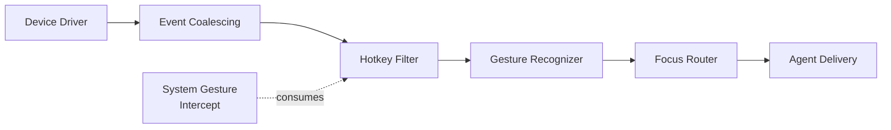

# AIOS Compositor Input Routing

Part of: [compositor.md](../compositor.md) — Compositor and Display Architecture
**Related:** [protocol.md](./protocol.md) — Compositor protocol, [security.md](./security.md) — Secure input routing, [ai-native.md](./ai-native.md) — AI-driven focus prediction

-----

## 7. Input Routing

The compositor owns all input routing. Every keyboard, mouse, touch, gamepad, and stylus event flows through the compositor's input pipeline before reaching an agent. This centralization enables global hotkeys, gesture recognition, secure input mediation, and focus management — all enforced by the compositor rather than delegated to individual agents.

-----

### 7.1 Input Pipeline Architecture

All input events share a common type that captures the full range of human input devices:

```rust
pub enum InputEvent {
    Keyboard {
        key: KeyCode,
        state: KeyState,
        modifiers: Modifiers,
    },
    Pointer {
        x: f64,
        y: f64,
        button: Option<MouseButton>,
        state: Option<ButtonState>,
        scroll: Option<(f64, f64)>,
    },
    Touch {
        id: u32,
        x: f64,
        y: f64,
        phase: TouchPhase,
    },
    Gamepad {
        id: u32,
        event: GamepadEvent,
    },
    Stylus {
        x: f64,
        y: f64,
        pressure: f32,
        tilt: (f32, f32),
        button: Option<StylusButton>,
    },
}
```

Events traverse a six-stage pipeline from hardware to agent:



**Device Driver** reads raw events from the platform HAL — scan codes, absolute coordinates, touch contact reports. Each event is timestamped with `TICK_COUNT` at the point of IRQ entry.

**Event Coalescing** merges redundant events within a single frame interval. Multiple pointer motion events arriving between two 60 fps frames are collapsed into a single event carrying the latest position. This prevents agents from drowning in intermediate motion samples during fast mouse movement.

**Hotkey Filter** checks every keyboard event against the system hotkey table and agent-registered hotkeys. Matched events are consumed and never reach the focus router.

**Gesture Recognizer** processes multi-touch streams and identifies high-level gestures (pinch, swipe, rotate). Raw touch events that form part of a recognized gesture are consumed; the gesture event replaces them.

**Focus Router** determines which surface receives each event based on keyboard focus (for key events) and pointer position (for pointer/touch events).

**Agent Delivery** serializes the `InputEvent` into the target agent's IPC channel as a `CompositorEvent::Input` message.

Each pipeline stage implements the `InputFilter` trait:

```rust
pub trait InputFilter {
    fn filter(&mut self, event: &InputEvent) -> FilterResult;
}

pub enum FilterResult {
    /// Pass the event to the next stage unchanged
    Pass,
    /// Consume the event — do not forward
    Consume,
    /// Replace the event with a transformed version
    Transform(InputEvent),
}
```

-----

### 7.2 Focus Management

The `FocusManager` tracks which surface receives keyboard input and which surface the pointer is hovering over. These are independent — a user can type into a text editor while the mouse hovers over a terminal.

```rust
pub struct FocusManager {
    /// Surface receiving keyboard events (set by click or Alt+Tab)
    keyboard_focus: Option<SurfaceId>,
    /// Surface under the pointer (updated on every motion event)
    pointer_focus: Option<SurfaceId>,
    /// Most-recently-used order for Alt+Tab cycling
    focus_history: CircularBuffer<SurfaceId, 16>,
}
```

**Keyboard focus** is set explicitly by user action: clicking on a surface, pressing Alt+Tab, or tapping a surface on a touchscreen. The compositor sends `FocusChanged { focused: true }` to the gaining surface and `FocusChanged { focused: false }` to the losing surface. Only one surface holds keyboard focus at any time.

**Pointer focus** follows the cursor position. The compositor performs hit-testing against the surface z-order to determine which surface the pointer is over. The surface under the pointer receives hover, scroll, and click events. Pointer focus changes do not trigger `FocusChanged` events — they are tracked internally for routing only.

**Focus steal prevention.** Untrusted agents (TrustLevel::Untrusted, TL3 and above) cannot programmatically request keyboard focus. If an untrusted agent sends a `RequestFocus` message, the compositor ignores it and logs the attempt to the audit ring. Only user-initiated actions (click, Alt+Tab) can transfer focus. System agents (TL1) may request focus for accessibility purposes (screen reader moving focus to an alert).

**Focus history** is a circular buffer of the last 16 focused surfaces, ordered by most-recently-used. When the user presses Alt+Tab, the compositor renders a window switcher overlay showing surface thumbnails in focus history order. Releasing Alt selects the highlighted surface as the new keyboard focus. Surfaces that are destroyed are removed from the history.

**Focus-follows-context.** When the AIRS Context Engine detects a task context change (the user switches from coding to reading email), it notifies the compositor. The compositor may suggest a focus change by highlighting the relevant window — but it never forces focus away from the user's current surface. The suggestion appears as a subtle visual cue (border glow or taskbar badge) that the user can accept or ignore.

```rust
pub enum FocusAction {
    /// User clicked on a surface
    Click(SurfaceId),
    /// User pressed Alt+Tab
    AltTab,
    /// AIRS suggests focus change (non-forcing)
    ContextSuggestion(SurfaceId),
    /// Accessibility: screen reader moves focus
    AccessibilityFocus(SurfaceId),
}
```

-----

### 7.3 Global Hotkeys and System Gestures

The compositor intercepts hotkeys before any agent receives input. This guarantees that system-critical shortcuts (lock screen, window switching) always work, regardless of what the focused agent is doing.

```rust
pub struct HotkeyBinding {
    /// Key combination (e.g., Alt+Tab, Super+L)
    keys: KeyCombo,
    /// Action to perform when triggered
    action: HotkeyAction,
    /// Capability required to register this hotkey (agent-registered only)
    capability: Option<Capability>,
}

pub enum HotkeyAction {
    /// Alt+Tab: cycle through windows in focus history order
    SwitchWindow,
    /// System gesture: toggle the conversation bar
    ToggleConversationBar,
    /// PrtSc: capture screenshot to clipboard
    Screenshot,
    /// Super+L: lock the screen immediately
    LockScreen,
    /// F12: toggle the Inspector security dashboard
    ToggleInspector,
    /// Launch a specific agent (configured in settings)
    LaunchAgent(AgentId),
    /// Agent-registered custom hotkey
    Custom(AgentId, String),
}
```

**System hotkeys** are hardcoded in the compositor and cannot be overridden by agents. These include `Alt+Tab` (window switch), `Super+L` (lock screen), `PrtSc` (screenshot), and `F12` (inspector toggle). System hotkeys are checked first in the hotkey filter stage and always consume the event.

**System gestures** provide touch-native equivalents of keyboard shortcuts:

| Gesture | Action |
|---|---|
| Three-finger swipe up | Workspace overview (show all windows) |
| Three-finger swipe left/right | Switch workspace |
| Four-finger pinch | Show all windows (expose view) |
| Edge swipe from left | Open conversation bar |
| Edge swipe from right | Open notification center |

**Agent-registered hotkeys.** Agents can register custom hotkeys by sending a `RegisterHotkey` request via IPC. The compositor validates that the agent holds a `HotkeyRegistration` capability before accepting the binding. If the requested key combination conflicts with a system hotkey, the registration is rejected with an error. Agent hotkeys are checked after system hotkeys in the filter stage.

```rust
/// IPC request to register an agent-specific hotkey
pub struct RegisterHotkeyRequest {
    keys: KeyCombo,
    action_name: String,
    capability: CapabilityHandle,
}
```

**Conflict resolution priority:** System hotkeys > Agent hotkeys (first-registered wins) > Surface-local shortcuts. Agents receive a `HotkeyConflict` event if their registration fails due to a conflict.

-----

### 7.4 Gesture Recognition

The `GestureRecognizer` converts raw touch event streams into high-level gesture events. It operates as a state machine that tracks active touch points and evaluates them against known gesture patterns.

```rust
pub struct GestureRecognizer {
    /// Currently active gesture candidates
    active_gestures: Vec<ActiveGesture>,
    /// Active touch contact points (up to 10 simultaneous)
    touch_points: Vec<TouchPoint>,
    /// Timeout for gesture recognition (default: 300ms)
    recognition_timeout_ms: u32,
}

pub struct TouchPoint {
    id: u32,
    start_x: f64,
    start_y: f64,
    current_x: f64,
    current_y: f64,
    start_time: u64,
}

pub enum GestureType {
    Tap,
    DoubleTap,
    LongPress { duration_ms: u32 },
    Swipe { direction: SwipeDirection, fingers: u8 },
    Pinch { scale: f32 },
    Rotate { angle: f32 },
    Pan { dx: f32, dy: f32 },
}

pub enum SwipeDirection {
    Up,
    Down,
    Left,
    Right,
}
```

The recognizer tracks up to 10 simultaneous touch points, matching the hardware capability of modern capacitive touchscreens. Each touch point records its initial position, current position, and timestamp.

**Recognition state machine.** When a touch-down event arrives, the recognizer starts a 300ms timer. During this window, it evaluates incoming touch events against gesture patterns:

- **Tap**: single touch down + up within 200ms, movement < 10px
- **DoubleTap**: two taps within 400ms at similar positions
- **LongPress**: single touch held for > 500ms without significant movement
- **Swipe**: one or more fingers move > 50px in a consistent direction
- **Pinch**: two fingers move toward or away from each other
- **Rotate**: two fingers rotate around their midpoint
- **Pan**: one or two fingers drag across the surface

If the touch points do not match any recognized gesture within the 300ms timeout, the raw `Touch` events are passed through to the focused surface. This ensures that custom agent touch handling (drawing apps, games) works without interference.

**Context-sensitive gestures.** Gesture-to-action mappings are configurable per workspace context. In a work context, three-finger swipe left might switch workspace. In a drawing app, three-finger swipe might undo the last stroke. The compositor resolves this by checking surface hints: if the focused surface declares `SurfaceContentType::Game` or a custom touch handler hint, system gestures require an additional finger (four-finger instead of three-finger) to avoid conflicts.

-----

### 7.5 Gamepad and Touch Input

Beyond keyboard and pointer, the compositor handles gamepad controllers, touchscreens, and stylus devices.

**Gamepad state.** The compositor maintains a `GamepadState` for each connected controller:

```rust
pub struct GamepadState {
    id: u32,
    buttons: u32,                        // bitfield of pressed buttons
    axes: [f32; 8],                      // normalized -1.0 to 1.0
    connected: bool,
}

pub enum GamepadEvent {
    ButtonPressed(GamepadButton),
    ButtonReleased(GamepadButton),
    AxisMoved { axis: u8, value: f32 },
    Connected,
    Disconnected,
}

pub enum GamepadButton {
    A, B, X, Y,
    LeftBumper, RightBumper,
    LeftTrigger, RightTrigger,
    DpadUp, DpadDown, DpadLeft, DpadRight,
    Start, Select,
    LeftStick, RightStick,
}
```

Gamepad events are routed to the keyboard-focused surface. When a gamepad connects or disconnects, the compositor sends a `GamepadEvent::Connected` or `GamepadEvent::Disconnected` to all surfaces that have registered gamepad interest via their `SurfaceHints`. If no surface has gamepad interest, connect/disconnect events are discarded.

**Touch calibration.** Touchscreen coordinates require mapping to display coordinates. Each output maintains a touch-to-display transform matrix that accounts for display rotation, scaling, and position in the multi-monitor virtual desktop. The compositor applies this transform before routing touch events to the gesture recognizer or focus router.

**Stylus support.** Stylus devices provide richer input than touch: continuous pressure (0.0 to 1.0), tilt angles (x and y in radians), barrel button, and eraser mode. The compositor delivers these as `InputEvent::Stylus` events to the focused surface. Stylus-aware applications (drawing, note-taking) use pressure and tilt for brush dynamics.

```rust
pub enum StylusButton {
    /// Primary barrel button (typically "right click")
    Barrel,
    /// Eraser end of the stylus
    Eraser,
    /// Secondary barrel button (if present)
    Secondary,
}
```

**Device enumeration.** At startup and on hotplug, the compositor discovers input devices via the platform HAL. Each device is classified (keyboard, pointer, touch, gamepad, stylus) and assigned to an output. Multi-touch devices are bound to their physically associated display. External devices default to the primary output but can be reassigned via settings.

-----

### 7.6 Secure Input Routing

Input routing is a security boundary. The compositor enforces strict rules about who can send, receive, and observe input events.

**Keystroke injection prevention.** Only the compositor generates input events. Agents cannot inject synthetic keyboard, mouse, or touch events into another agent's input stream. An agent that attempts to send a fabricated `InputEvent` via IPC receives an `AccessDenied` error. This prevents malware from typing commands into a terminal or clicking buttons in a settings panel.

**Synthetic input capability.** System agents (TrustLevel::System, TL1) can request a `SyntheticInput` capability for legitimate use cases:

- **Accessibility:** A screen reader agent injects keyboard navigation events to move focus through the accessibility tree.
- **Testing:** An automated test agent injects input sequences to exercise UI flows.
- **Remote desktop:** A remote access agent translates network input into local events.

The `SyntheticInput` capability is never granted to untrusted (TL3+) agents.

**Secure input mode.** When a surface declares the `SecureInput` hint (password fields, sensitive data entry), the compositor activates secure input mode for that surface:

1. **Hotkey suppression:** Global hotkeys are disabled except `Super+L` (lock screen). This prevents an agent-registered hotkey from capturing keystrokes intended for the password field.
2. **Input logging suppression:** Input events routed to the secure surface are excluded from the audit ring's event log. Only the routing decision (source device, target surface) is logged — never the key codes.
3. **Screenshot blocking:** The compositor excludes the secure surface's region from screenshot capture. Screenshot requests produce a black rectangle over the secure area.
4. **Focus lock:** While secure input is active, the compositor prevents programmatic focus changes. Only user-initiated actions (click, Alt+Tab) can move focus away.

```rust
pub struct SecureInputState {
    /// Surface that activated secure input
    surface: SurfaceId,
    /// Original hotkey filter state (restored on exit)
    saved_hotkeys: Vec<HotkeyBinding>,
    /// Whether input logging is suppressed
    logging_suppressed: bool,
}
```

**Input event audit.** Outside of secure input mode, all input routing decisions are logged to the audit ring. Each audit entry records: source device ID, event type (without key codes for keyboard events), target surface, capability used (if any), and timestamp. This provides forensic visibility into input routing without exposing sensitive content.

**Trust level enforcement.** The compositor applies different input routing rules based on the target agent's trust level:

| Trust Level | Focus Steal | Hotkey Registration | Synthetic Input | Secure Input Bypass | Gesture Access |
|---|---|---|---|---|---|
| TL0 (Kernel) | N/A (no surfaces) | N/A | N/A | N/A | N/A |
| TL1 (System) | Allowed | Allowed | Allowed (with capability) | Allowed (accessibility) | Full |
| TL2 (Trusted) | User-initiated only | Allowed | Denied | Denied | Full |
| TL3 (Untrusted) | Denied | Denied | Denied | Denied | Limited |

**Limited gesture access** for TL3 agents means the compositor suppresses multi-finger system gesture recognition while a TL3 surface is focused. The TL3 surface receives only single-touch and basic pointer events. This prevents an untrusted agent from observing multi-touch patterns that could be used to infer system gesture habits.

**Clipboard mediation.** Paste operations (Ctrl+V) do not transfer clipboard content directly between agents. The clipboard flows through the compositor, which can:

- Filter content types (deny executable content paste into a terminal from an untrusted source)
- Log clipboard transfers in the audit ring
- Enforce capability checks (an agent needs `ClipboardRead` to paste, `ClipboardWrite` to copy)
- Strip metadata from pasted content when crossing trust boundaries

```rust
pub struct ClipboardTransfer {
    source_agent: AgentId,
    target_agent: AgentId,
    content_type: ContentType,
    /// Whether metadata was stripped due to trust boundary crossing
    sanitized: bool,
}
```
