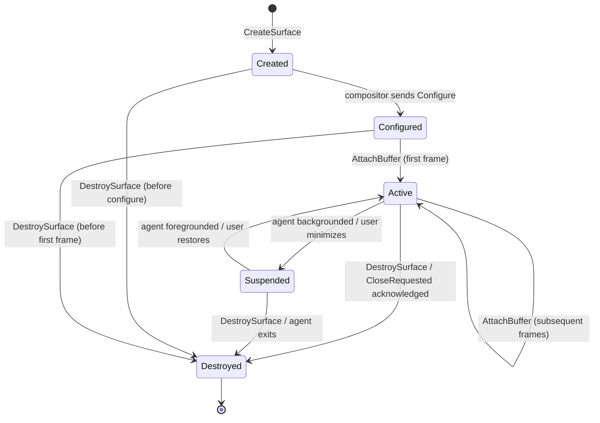

# AIOS Compositor Protocol and Semantic Hints

Part of: [compositor.md](../compositor.md) — Compositor and Display Architecture
**Related:** [ipc.md](../../kernel/ipc.md) — IPC channels and shared memory, [experience.md](../../experience/experience.md) — Five Surfaces model, [context-engine.md](../../intelligence/context-engine.md) — Context awareness

-----

## 3. Compositor Protocol

Agents communicate with the compositor via IPC channels. The protocol defines the complete lifecycle of surfaces: creation, buffer management, synchronization, damage reporting, and teardown. All compositor operations are asynchronous message-passing over capability-protected channels, meaning agents never directly access compositor state.

The protocol is intentionally minimal. Agents send requests, the compositor sends events. Shared memory buffers carry the pixel data. Fences synchronize access. Everything else — layout, z-ordering, focus management — is the compositor's internal concern.

-----

### 3.1 Surface Lifecycle

A surface is the fundamental unit of display real estate. Each surface has a unique identifier, a state machine governing its lifecycle, and a set of semantic hints that inform compositor behavior.

```rust
/// Unique identifier for a compositor surface.
///
/// Assigned by the compositor on creation. Opaque to agents — they receive it
/// in the CreateSurface response and use it in all subsequent requests.
pub struct SurfaceId(u64);

/// Surface lifecycle state machine.
///
/// Surfaces progress linearly from Created through Active, with Suspended
/// as a reversible detour. Only Destroyed is terminal.
pub enum SurfaceState {
    /// Surface allocated, no buffer attached yet
    Created,
    /// Compositor has sent initial Configure event; agent knows dimensions
    Configured,
    /// Buffer attached and presenting frames
    Active,
    /// Surface hidden or agent backgrounded; compositor may reclaim resources
    Suspended,
    /// Surface torn down, all resources freed
    Destroyed,
}
```



The request and event enums form the two halves of the protocol:

```rust
/// Messages from agent to compositor.
pub enum CompositorRequest {
    /// Create a new surface with initial dimensions and hints.
    CreateSurface {
        width: u32,
        height: u32,
        title: SurfaceTitle,
        hints: SurfaceHints,
    },
    /// Attach a rendered buffer to a surface, replacing the previous front buffer.
    AttachBuffer {
        surface: SurfaceId,
        buffer: SharedBufferId,
        damage: DamageRegion,
        fence: Option<FenceId>,
    },
    /// Update semantic hints without submitting a new frame.
    UpdateHints {
        surface: SurfaceId,
        hints: SurfaceHints,
    },
    /// Request a resize. The compositor responds with a Configure event
    /// containing the actual granted dimensions.
    Resize {
        surface: SurfaceId,
        width: u32,
        height: u32,
    },
    /// Tear down a surface and release all associated resources.
    DestroySurface {
        surface: SurfaceId,
    },
    /// Create a child surface anchored to a parent (popups, tooltips, dropdowns).
    CreateSubsurface {
        parent: SurfaceId,
        offset_x: i32,
        offset_y: i32,
        width: u32,
        height: u32,
        hints: SurfaceHints,
    },
    /// Move a surface to a different layer in the compositing stack.
    SetLayer {
        surface: SurfaceId,
        layer: SurfaceLayer,
    },
}

/// Messages from compositor to agent.
pub enum CompositorEvent {
    /// Surface configuration changed (initial configure, resize, scale change, monitor move).
    Configure {
        surface: SurfaceId,
        width: u32,
        height: u32,
        scale: f32,
    },
    /// Surface gained or lost keyboard focus.
    FocusChanged {
        surface: SurfaceId,
        focused: bool,
    },
    /// User or system requested surface closure. Agent should save state and DestroySurface.
    CloseRequested {
        surface: SurfaceId,
    },
    /// Input event routed to this surface (keyboard, pointer, touch, gamepad).
    Input(InputEvent),
    /// A previously submitted buffer is no longer in use. Agent may reuse or free it.
    BufferReleased(SharedBufferId),
    /// A frame was scanned out to the display. Timestamp is nanoseconds since boot.
    FramePresented {
        surface: SurfaceId,
        timestamp_ns: u64,
    },
}
```

The `FramePresented` event enables agents to compute frame pacing. By comparing successive presentation timestamps, an agent can adjust its rendering cadence to match the display refresh rate without polling.

-----

### 3.2 Shared Buffer Protocol

Pixel data travels between agents and the compositor through shared memory regions managed by the kernel's shared memory subsystem. The compositor never copies pixel data — it reads directly from the agent's buffer via the shared memory mapping.

```rust
/// A buffer backed by a kernel-managed shared memory region.
pub struct SharedBuffer {
    /// Unique buffer identifier, scoped to the creating agent.
    id: SharedBufferId,
    /// Shared memory region (maps into both agent and compositor address spaces).
    memory: SharedMemoryRegion,
    /// Buffer dimensions in pixels.
    width: u32,
    height: u32,
    /// Bytes per row (may include padding for alignment).
    stride: u32,
    /// Pixel encoding.
    format: PixelFormat,
    /// Optional fence for GPU-rendered content.
    fence: Option<FenceId>,
}

/// Pixel encoding formats.
///
/// Formats are listed in order of expected frequency of use. The compositor
/// supports all formats natively — no conversion needed on the compositing path.
pub enum PixelFormat {
    /// 32-bit ARGB with premultiplied alpha. Primary format for UI surfaces.
    Argb8888,
    /// 32-bit RGB, alpha channel ignored. Opaque surfaces (no blending needed).
    Xrgb8888,
    /// 16-bit RGB. Low memory footprint for constrained agents.
    Rgb565,
    /// 32-bit RGBA with premultiplied alpha. Preferred by some GPU pipelines.
    Rgba8888,
    /// YCbCr 4:2:0 semi-planar. Video decode output; compositor handles YUV→RGB.
    Nv12,
    /// 10-bit per channel ARGB (2-bit alpha). HDR content and wide color gamut.
    Argb2101010,
}
```

**Double buffering** is the standard protocol. The agent allocates two `SharedBuffer` instances for each surface. While the compositor reads from the front buffer (the most recently attached), the agent renders into the back buffer. Calling `AttachBuffer` atomically swaps the roles. The compositor signals `BufferReleased` when it finishes reading from the old front buffer, freeing the agent to reuse it.

**Triple buffering** is available for latency-sensitive surfaces (games, video). The agent allocates three buffers: one being scanned out, one queued for the next frame, and one being rendered into. This decouples the agent's render rate from the display refresh rate at the cost of one additional buffer's worth of memory. The compositor detects triple-buffered surfaces automatically — if a new `AttachBuffer` arrives before the compositor has consumed the previous queued buffer, the older queued buffer is dropped (its `BufferReleased` fires immediately).

**Zero-copy guarantee:** The compositor's shared memory mapping is read-only. The kernel enforces this via page table permissions (W^X policy extended: the compositor's mapping of an agent's buffer is always R+XN). No `memcpy` occurs on the compositing path. For direct scanout (single fullscreen surface), the display hardware reads from the agent's buffer with no compositor involvement at all.

-----

### 3.3 Buffer Synchronization

When agents use GPU rendering, the CPU-side `AttachBuffer` call may arrive before the GPU finishes writing pixels. Fences solve this: they are lightweight synchronization primitives that let the compositor wait for GPU work to complete before reading, and signal the agent when the compositor is done.

```rust
/// Opaque fence identifier, monotonically increasing per surface.
pub struct FenceId(u64);

/// Synchronization state for a single buffer submission.
pub struct BufferSync {
    /// Compositor waits on this fence before reading the buffer.
    /// Set by the agent when the buffer depends on in-flight GPU work.
    acquire_fence: Option<FenceId>,
    /// Compositor signals this fence when it finishes reading.
    /// Agent waits on this before writing new content into the buffer.
    release_fence: FenceId,
}
```

**Acquire fence:** Attached to `AttachBuffer`. If present, the compositor defers reading the buffer until the fence signals. For CPU-rendered surfaces (the common case for most agents), no acquire fence is needed — the buffer is ready when `AttachBuffer` is sent. GPU-rendered surfaces (games, browser WebGL) set an acquire fence tied to their GPU command queue completion.

**Release fence:** Generated by the compositor and delivered via `BufferReleased`. The agent must not write to the buffer until the release fence signals. In practice, the compositor signals the release fence at the same time it sends `BufferReleased`, so agents that only listen for the event (ignoring the fence object) behave correctly.

**Ordering guarantees:**
- Fence IDs are monotonically increasing within a surface. The compositor processes fences in order — fence N is always signaled before fence N+1.
- `BufferReleased` events are delivered in submission order. If the agent submits buffers A, B, C, it receives releases in the same order.

**Race condition prevention:** If the agent submits a new buffer (B) before the compositor has released the previous buffer (A), the compositor handles this gracefully. Buffer A's release fence is signaled immediately (the compositor will not read A), and `BufferReleased(A)` is sent. The compositor reads from B instead. This prevents stalls when the agent outruns the display refresh rate.

-----

### 3.4 Damage Reporting

Damage reporting tells the compositor which portions of a buffer have changed since the last submission. Without damage information, the compositor must assume the entire buffer changed and recomposite the full surface — wasting GPU cycles on unchanged content.

```rust
/// Describes which portion of a buffer changed.
pub enum DamageRegion {
    /// A rectangular subregion changed. Coordinates are in surface-local pixels.
    Rect { x: u32, y: u32, width: u32, height: u32 },
    /// The entire buffer changed (full repaint). Used after resize or first frame.
    FullSurface,
    /// Nothing changed. The agent resubmitted the same buffer (e.g., for
    /// fence synchronization). The compositor skips this surface entirely.
    Empty,
}
```

**Per-surface damage:** The agent reports damage in surface-local coordinates with each `AttachBuffer` call. A text editor that received a keystroke reports damage only over the affected line. A terminal emulator reports damage over the scrolled region.

**Screen-space damage:** The compositor transforms surface damage to output coordinates by applying the surface's position, scale, and rotation. Multiple surfaces' screen-space damage regions are unioned to determine which output pixels need recompositing.

**Damage accumulation:** If the compositor skips a frame (running behind, or VSync not yet due), damage from the skipped frame is unioned with the next frame's damage. This ensures no visual artifacts from dropped frames — the next presented frame correctly recomposites all changed regions.

**Damage ring:** The compositor maintains a circular buffer of the last 8 frames' accumulated damage per output. This supports buffer-age optimization: when using buffer-age-aware rendering (common with OpenGL/Vulkan swap chains), the compositor can determine exactly which regions of an N-frames-old back buffer are stale and need redrawing, rather than recompositing the entire output.

```rust
/// Per-output damage history for buffer-age optimization.
pub struct DamageRing {
    /// Circular buffer of per-frame damage, most recent at index 0.
    frames: [ScreenDamage; 8],
    /// Write cursor.
    head: usize,
}

/// Accumulated damage for one frame, in output coordinates.
pub struct ScreenDamage {
    regions: [Option<OutputRect>; 16],
    count: usize,
}
```

-----

## 4. Semantic Hints

Semantic hints are the mechanism by which agents communicate content meaning to the compositor. Unlike traditional window managers that see only pixel rectangles, the AIOS compositor understands what each surface contains and adjusts layout, rendering priority, and interaction behavior accordingly.

Hints are advisory. The compositor uses them to make better decisions, but agents function correctly even if all hints are ignored. This property ensures cross-platform portability — the same agent binary runs on AIOS (with semantic layout), on a Wayland compositor (hints ignored, standard tiling), or as a standalone framebuffer application.

-----

### 4.1 Content Types and Layout Preferences

The `SurfaceHints` struct is the primary carrier for semantic information. Agents populate it at surface creation and update it via `UpdateHints` when content changes (e.g., a browser tab switches from a document to a video).

```rust
/// Semantic metadata describing a surface's content and behavior preferences.
pub struct SurfaceHints {
    /// What kind of content this surface displays.
    content_type: SurfaceContentType,
    /// Current interaction intensity.
    interaction_state: InteractionState,
    /// How urgently this surface needs attention.
    urgency: SurfaceUrgency,
    /// Compositing layer preference.
    layer: SurfaceLayer,
    /// Accessibility: what this surface represents in the UI hierarchy.
    semantic_role: SemanticRole,
    /// Preferred layout constraints.
    layout_preference: LayoutPreference,
}

/// Content classification for compositor decision-making.
pub enum SurfaceContentType {
    /// Text-heavy reading/editing surface. Benefits from generous width.
    Document,
    /// Monospace terminal emulator. Prefers fixed character grid dimensions.
    Terminal,
    /// Video, image gallery, or media playback. Aspect ratio preservation is key.
    Media,
    /// Chat, messaging, or conversational UI. Benefits from height over width.
    Conversation,
    /// Web content renderer. Highly flexible, adapts to any size.
    Browser,
    /// Real-time interactive content. Fullscreen preferred, low latency critical.
    Game,
    /// Diagnostic or debugging interface. Sidebar-friendly, secondary importance.
    Inspector,
    /// System or application preferences. Moderate fixed size, form-like layout.
    Settings,
    /// Transient alert or status message. Small, temporary, overlay layer.
    Notification,
    /// Tabular data with rows and columns. Benefits from both width and height.
    Spreadsheet,
    /// Source code editor with panels. Benefits from width, supports split views.
    IDE,
    /// Metrics, charts, and real-time data visualization. Flexible grid layout.
    Dashboard,
    /// Geographic or spatial visualization. Square-ish aspect ratio preferred.
    Map,
    /// Freeform canvas for sketching, diagramming, or annotation.
    Drawing,
    /// System-level chrome (taskbar, status bar, launcher). Locked to edges.
    SystemUI,
}

/// Layout constraints communicated by the agent.
pub enum LayoutPreference {
    /// No preference — compositor decides based on content type and context.
    Flexible,
    /// Agent needs at least this width (pixels) for readable content.
    PreferWidth(u32),
    /// Agent needs at least this height (pixels) for usable layout.
    PreferHeight(u32),
    /// Agent requires at least these minimum dimensions.
    MinSize { w: u32, h: u32 },
    /// Agent should not exceed these dimensions (dialogs, popovers).
    MaxSize { w: u32, h: u32 },
    /// Maintain this width:height ratio (e.g., 16.0/9.0 for video).
    FixedAspect(f32),
    /// Agent strongly prefers exclusive use of the output.
    Fullscreen,
}
```

**Content type to default layout mapping:**

| Content Type|Default Width %|Default Height %|Preferred Mode|Notes|
|---|---|---|---|---|
| Document|60|100|Tiling|Wide column for readability|
| Terminal|40|50|Tiling|Fixed-width grid|
| Media|70|70|Floating|Aspect ratio preserved|
| Conversation|30|100|Sidebar|Narrow vertical strip|
| Browser|60|100|Tiling|Adapts to any size|
| Game|100|100|Fullscreen|Low latency path|
| Inspector|30|100|Sidebar|Docked to edge|
| Settings|40|60|Floating|Centered dialog|
| Notification|25|10|Overlay|Corner-anchored|
| Spreadsheet|70|100|Tiling|Maximizes visible cells|
| IDE|70|100|Tiling|Multi-panel support|
| Dashboard|100|100|Fullscreen|Grid of widgets|
| Map|50|50|Floating|Square-ish aspect|
| Drawing|60|80|Floating|Canvas with tool panels|
| SystemUI|100|5|Panel|Edge-locked strip|

These defaults apply when the agent provides a content type but no explicit `LayoutPreference`. An explicit preference always overrides the default.

-----

### 4.2 Interaction State and Urgency

Beyond content type, agents communicate their current interaction intensity and attention needs. These signals drive compositor decisions about rendering priority, notification routing, and power management.

```rust
/// How actively the user is engaging with this surface.
pub enum InteractionState {
    /// User is directly interacting (typing, clicking, scrolling).
    Active,
    /// Surface is visible but receiving no input (reading, watching).
    Passive,
    /// Surface is not visible (minimized, on another workspace).
    Background,
    /// Surface needs immediate user attention (incoming call, error).
    Urgent,
}

/// How urgently a surface's content change demands attention.
pub enum SurfaceUrgency {
    /// No special attention needed.
    None,
    /// Informational change (new message count, background task completed).
    Low,
    /// Important change requiring attention soon (calendar reminder).
    Medium,
    /// Critical change requiring immediate attention (system alert, incoming call).
    High,
}

/// Compositing layer placement.
pub enum SurfaceLayer {
    /// Desktop background, wallpaper. Lowest z-order.
    Background,
    /// Regular application windows. Default layer.
    Normal,
    /// Always-on-top windows (picture-in-picture, floating calculator).
    TopLevel,
    /// Transient overlays (notifications, tooltips, context menus).
    Overlay,
    /// System chrome (taskbar, status bar). Edge-anchored, always visible.
    Panel,
}

/// The surface's role relative to the user's task.
pub enum SemanticRole {
    /// Main workspace surface the user is focused on.
    Primary,
    /// Supporting reference surface (documentation, logs, preview).
    Secondary,
    /// Read-only reference material not being actively used.
    Reference,
    /// Short-lived surface that will dismiss itself (splash, progress dialog).
    Transient,
}
```

**Urgency decay:** High urgency does not persist indefinitely. If the user does not interact with a High-urgency surface within 30 seconds, the compositor automatically decays it to Medium. Medium decays to Low after 60 seconds. Low persists until the surface updates its hints or the triggering condition clears. This prevents permanently flashing indicators from a crashed or misbehaving agent.

The decay sequence and timings:

```text
High  ---(30s no interaction)---> Medium
Medium ---(60s no interaction)---> Low
Low   ---(persists until agent clears)--->  None
```

-----

### 4.3 Hint-Driven Compositor Behavior

The compositor combines content type, interaction state, urgency, and external context signals (from the Context Engine and Attention Manager) into concrete rendering and layout decisions. The decision matrix below captures the primary behaviors:

| Content Type|Interaction State|Compositor Behavior|
|---|---|---|
| Game|Active|Suppress notifications; direct scanout; disable idle timeout; max render priority|
| Game|Passive|Reduce to 30fps; allow notifications; release direct scanout|
| Document|Active|Tiling layout with generous width (60%+); cursor blink enabled; IME active|
| Document|Passive|Maintain layout; reduce render priority; cursor hidden|
| Conversation|Active|Sidebar layout; notification sound for new messages|
| Conversation|Passive|Narrow sidebar; badge count overlay; silent notifications|
| Media|Active|Maintain aspect ratio; suppress notifications; audio focus|
| Media|Background|Picture-in-picture if supported; audio continues; render at 1fps|
| Terminal|Active|Tiling layout; fast scroll render path; keyboard shortcuts active|
| Inspector|Active|Sidebar dock; auto-refresh metrics; share screen with Primary surface|
| Notification|any|Overlay layer; auto-dismiss after timeout; stack with other notifications|
| Dashboard|Active|Fullscreen or large tile; periodic refresh; no idle timeout|
| SystemUI|any|Panel layer; edge-locked; never occluded by Normal surfaces|

**Context Engine integration:** The compositor subscribes to `ContextState` updates from the Context Engine. The current context (work, leisure, gaming, focus) modulates hint interpretation:

- **Work context:** Tiling layouts preferred. Document and IDE surfaces receive wider allocations. Notifications from Conversation surfaces are delivered silently (badge only). Inspector surfaces auto-dock.
- **Leisure context:** Floating layouts preferred. Media surfaces centered and enlarged. Conversation surfaces are prominent. Notification delivery is normal.
- **Gaming context:** Active Game surface receives exclusive output. All other surfaces hidden. Notifications suppressed entirely. Compositor overhead minimized (direct scanout, no effects).
- **Focus context:** Active Primary surface expanded to near-fullscreen. Secondary and Reference surfaces minimized. Urgent notifications only. Idle timeout extended.

**Attention Manager integration:** The Attention Manager provides an `ImportanceScore` (0.0 to 1.0) for each surface based on user gaze patterns, interaction history, and task relevance. The compositor uses this score to modulate rendering priority:

- Score > 0.8: Full render priority, crisp animations, immediate damage processing
- Score 0.4-0.8: Standard render priority, animations may be simplified
- Score < 0.4: Reduced render rate (30fps or lower), animations skipped, buffer may be evicted from GPU memory under pressure

-----

### 4.4 Graceful Degradation

Semantic hints are always optional. The compositor must produce correct, usable output when hints are absent, partially specified, or nonsensical. This guarantee serves three purposes: cross-platform portability, backward compatibility, and robustness against misbehaving agents.

**When hints are absent:** A surface created without `SurfaceHints` (or with all fields set to defaults) is treated as `Browser` content type with `Flexible` layout preference, `Active` interaction state, `Normal` layer, `None` urgency, and `Primary` semantic role. This combination produces reasonable behavior for any content — the compositor tiles it like a generic application window with no special treatment.

**Cross-platform portability:** Agents built for AIOS should also run on standard Linux Wayland compositors and macOS. On those platforms, hints are simply not sent (the compositor IPC channel does not exist or does not understand the hint protocol). The agent renders normally, using standard window management. On AIOS, the same agent's hints enhance the experience without requiring different code paths.

**Progressive enhancement:** The compositor's semantic features layer on top of a fully functional traditional compositor. With all AI features disabled (Context Engine offline, Attention Manager offline, no hints from any agent), the compositor behaves as a standard tiling/floating window manager with manual layout. Each AI feature adds intelligence incrementally:

1. Content type hints alone enable type-specific default layouts
2. Interaction state hints add render priority optimization
3. Context Engine integration adds context-adaptive layout
4. Attention Manager integration adds gaze-aware priority

**Fallback defaults table:**

| Content Type|Default Width %|Default Height %|Default Layer|Default Behavior|
|---|---|---|---|---|
| (unknown)|50|50|Normal|Floating, centered|
| Document|60|100|Normal|Tile left|
| Terminal|40|50|Normal|Tile right|
| Media|70|70|Normal|Float, centered, aspect-locked|
| Conversation|30|100|Normal|Sidebar right|
| Browser|60|100|Normal|Tile left|
| Game|100|100|Normal|Fullscreen|
| Inspector|30|100|Normal|Sidebar right|
| Settings|40|60|Normal|Float, centered|
| Notification|25|10|Overlay|Top-right corner|
| Spreadsheet|70|100|Normal|Tile left|
| IDE|70|100|Normal|Tile left|
| Dashboard|100|100|Normal|Fullscreen|
| Map|50|50|Normal|Float, centered|
| Drawing|60|80|Normal|Float, centered|
| SystemUI|100|5|Panel|Edge-locked|

These fallbacks are the compositor's last resort. They produce a usable (if unsophisticated) layout for every content type without any AI subsystem involvement. As AI subsystems come online, they progressively override these static defaults with adaptive, context-aware decisions.
