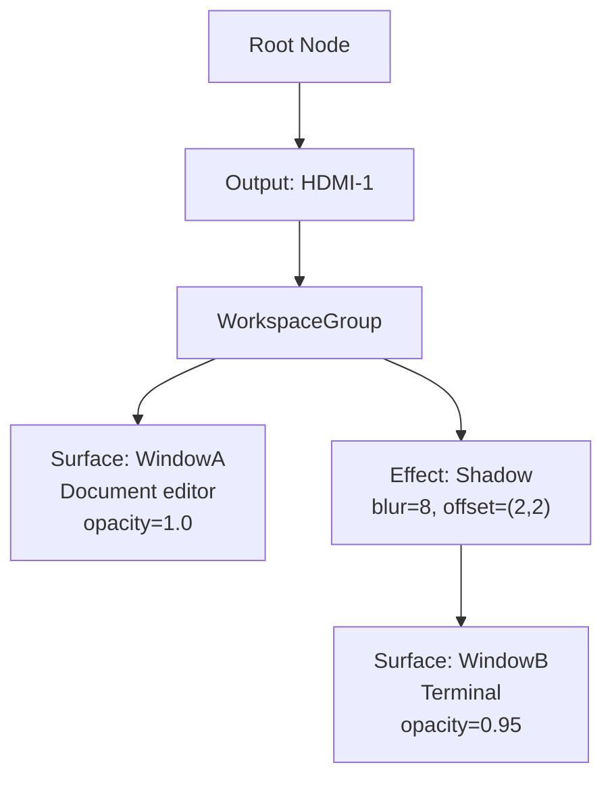
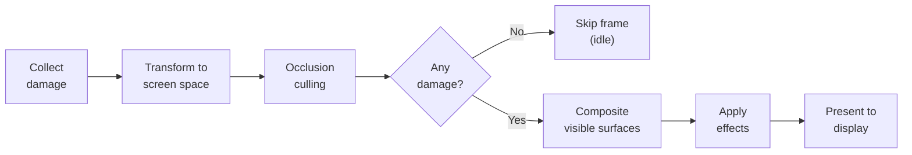
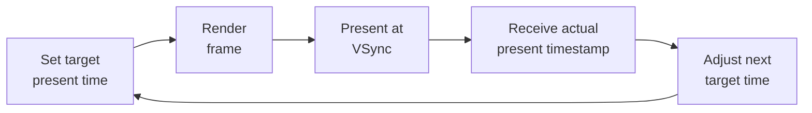

# AIOS Compositor Render Pipeline and Layout Engine

Part of: [compositor.md](../compositor.md) — Compositor and Display Architecture
**Related:** [protocol.md](./protocol.md) — Compositor protocol and semantic hints, [gpu.md](./gpu.md) — GPU abstraction, [ai-native.md](./ai-native.md) — AI-driven rendering

-----

## 5. Render Pipeline

### 5.1 Scene Graph

The compositor organizes all visible content into a 2D scene graph, inspired by Fuchsia's Flatland compositor. Rather than maintaining a flat list of framebuffers composited by z-order, the scene graph encodes spatial relationships, groupings, and visual effects as a tree. This enables efficient damage propagation, transform inheritance, and batched GPU submission.

```rust
/// Unique identifier for a node in the scene graph.
pub struct SceneNodeId(u32);

/// A node in the compositor's 2D scene graph.
pub enum SceneNode {
    /// A renderable surface backed by a shared buffer.
    Surface {
        id: SurfaceId,
        transform: Transform2D,
        opacity: f32,
    },

    /// A grouping node — children inherit the parent's transform.
    Group {
        children: Vec<SceneNodeId>,
    },

    /// A visual effect applied to a subtree.
    Effect {
        kind: EffectKind,
        child: SceneNodeId,
    },

    /// A clipping rectangle applied to a subtree.
    Clip {
        rect: Rect,
        child: SceneNodeId,
    },
}

/// 2D affine transform: translate, rotate, scale.
/// Transforms are inherited down the tree — a child's final transform
/// is parent_transform * child_transform.
pub struct Transform2D {
    translate: (f32, f32),
    rotate: f32,           // radians
    scale: (f32, f32),
}

/// Visual effects applied via GPU shaders.
pub enum EffectKind {
    Shadow { blur: f32, offset: (f32, f32), color: Color },
    RoundedCorners { radius: f32 },
    Blur { sigma: f32 },
    ColorTransform(ColorMatrix),
}
```

Agents submit **scene graph diffs** rather than full trees. A diff contains only the nodes that changed — new nodes inserted, existing nodes moved or re-parented, property updates (opacity, transform), and node removals. The compositor applies the diff to its authoritative copy of the graph, marks affected subtrees as damaged, and proceeds to composition.

```rust
/// A batch of scene graph modifications submitted atomically.
pub struct SceneGraphDiff {
    /// Nodes to insert (parent, position, node).
    inserts: Vec<(SceneNodeId, usize, SceneNode)>,
    /// Property updates (node, new transform, new opacity).
    updates: Vec<(SceneNodeId, Option<Transform2D>, Option<f32>)>,
    /// Nodes to re-parent (node, new parent, position).
    reparents: Vec<(SceneNodeId, SceneNodeId, usize)>,
    /// Nodes to remove (removed subtree is dropped).
    removals: Vec<SceneNodeId>,
}
```

Diffs are submitted via the `AttachBuffer` IPC message alongside buffer damage. The compositor processes all pending diffs before starting the frame composition pipeline, ensuring a consistent snapshot of the scene graph for each frame. Multiple diffs from the same agent within a single frame interval are coalesced.



| Flatland (Fuchsia) | AIOS Compositor | Notes |
|---|---|---|
| Instance | SceneNode | Flatland uses per-client instances; AIOS uses a single shared graph |
| ViewRef | SurfaceId | Both identify a renderable surface |
| Transform | Transform2D | AIOS uses 2D-only transforms (no 3D perspective) |
| Content | SharedBuffer | Both use zero-copy shared memory buffers |
| Flatland::Present | AttachBuffer + diff | AIOS separates buffer attachment from graph updates |

-----

### 5.2 Frame Composition

Each output runs an independent composition loop targeting 16.67ms per frame (60 fps). The pipeline processes the scene graph top-down and composites in a single pass where possible.

**Per-frame pipeline:**

1. **Collect damage** — gather damage regions reported by agents since the last frame. Each damage region is in surface-local coordinates.
2. **Transform damage** — walk the scene graph from each damaged surface to the root, applying parent transforms to convert damage rects into screen-space coordinates.
3. **Occlusion culling** — traverse the scene graph in depth-first order. If an opaque surface fully covers a region, mark surfaces behind it in that region as occluded. Occluded surfaces contribute zero GPU work.
4. **Composite visible surfaces** — traverse in z-order (scene graph traversal order). For each visible surface, bind its shared buffer and draw the non-occluded portions into the output framebuffer.
5. **Apply effects** — process Effect nodes: shadow, rounded corners, blur. Each effect type maps to a GPU shader program. Effects are applied in subtree order (innermost first).
6. **Present** — submit the completed frame to the display via page flip or buffer swap, synchronized to VSync (§5.4).

```rust
/// Tracks per-output damage across frames for buffer-age optimization.
pub struct DamageTracker {
    /// Circular buffer of damage from the last 3 frames.
    history: [Vec<DamageRect>; 3],
    /// Current write index into the history ring.
    head: usize,
    /// Buffer age reported by the display backend (1 = current, 2 = one frame old).
    buffer_age: u32,
}
```

Buffer age tracking enables partial redraws with multi-buffered swapchains. If the back buffer is two frames old, the compositor unions damage from the last two frames to determine what must be redrawn, avoiding a full repaint.



When no surface has damage, the compositor skips the frame entirely and goes idle until the next damage event arrives. On a static desktop, GPU utilization drops to zero.

**Occlusion culling detail:** The compositor maintains a coverage bitmap during the depth-first scene graph traversal. For each opaque surface (format `Xrgb8888` with `opacity == 1.0` and no `Blur` or `ColorTransform` effect ancestor), the surface's screen-space bounding rectangle is marked as covered. Subsequent surfaces whose visible regions are fully contained within the covered area are skipped. Partially occluded surfaces are clipped to their non-covered region before being submitted to the GPU. This reduces GPU draw calls proportionally to the amount of overlap between windows — a common scenario when floating windows stack.

-----

### 5.3 Direct Scanout and Multiplane Overlay

**Direct scanout** eliminates the compositor's GPU pass entirely. When a single surface meets all of the following criteria, its buffer is scanned out directly to display hardware:

- The surface covers the entire output at native resolution
- No alpha blending (fully opaque, format `Xrgb8888` or opaque `Argb8888`)
- No transform applied (identity transform, no rotation or scaling)
- No overlay surfaces above it (no notifications, panels, or cursor layers)
- Buffer format matches the display's native pixel format

This path provides the lowest possible latency, as the pixel data travels from the agent's shared buffer to the display controller without any intermediate copies. Fullscreen games and video playback benefit most from direct scanout.

The compositor continuously evaluates direct scanout eligibility. When a surface enters fullscreen mode and all criteria are met, the compositor transitions from GPU composition to direct scanout within one frame. When the criteria cease to hold (e.g., a notification appears as an overlay), the compositor falls back to GPU composition immediately without visual artifacts — the first composed frame includes the previously direct-scanned surface alongside the new overlay.

**Multiplane overlay** uses hardware display planes to composite multiple surfaces without GPU involvement. Modern display controllers expose 3-5 planes: a primary plane for the main desktop, overlay planes for video and cursor, and sometimes an underlay plane for background content.

The overlay plane assignment strategy prefers hardware planes for surfaces that change frequently:

| Plane | Assigned to | Rationale |
|---|---|---|
| Primary | Desktop composite | Static content, composited by GPU |
| Overlay 0 | Cursor | Updates on every mouse move |
| Overlay 1 | Video surface | High-frequency updates, fixed position |
| Overlay 2 | Notification bar | Semi-transparent overlay |

If a surface does not qualify for a hardware plane (wrong pixel format, requires scaling the hardware cannot perform, or no planes available), it falls back to full GPU composition. The compositor re-evaluates plane assignments every frame, migrating surfaces between hardware planes and GPU composition as conditions change.

The plane assignment algorithm uses a cost model: each candidate assignment is scored by the number of GPU draw calls it eliminates, weighted by the surface's update frequency. The assignment that minimizes total GPU work across all planes is selected. When the number of qualifying surfaces exceeds available planes, the highest-frequency surfaces win.

On the QEMU `virtio-gpu` device, hardware planes are not available — all composition uses GPU rendering. On Raspberry Pi 4/5 with the VC4/V3D driver, the HVS (Hardware Video Scaler) provides up to 3 overlay planes in addition to the primary plane.

-----

### 5.4 Frame Scheduling and VSync

```rust
/// Manages frame pacing and presentation timing for one output.
pub struct FrameScheduler {
    /// Target presentation time for the next frame (nanoseconds, monotonic).
    target_present_ns: u64,
    /// Actual presentation timestamp of the last completed frame.
    last_present_ns: u64,
    /// Frame budget in nanoseconds (16_666_666 for 60 Hz).
    frame_budget_ns: u64,
    /// Count of consecutive missed VSync deadlines.
    missed_deadlines: u32,
}
```

The compositor uses a feedback-driven frame pacing model inspired by `VK_EXT_present_timing`. After each frame is presented, the display backend reports the actual presentation timestamp. The compositor compares this against the target and adjusts the next frame's render start time:

- If the frame presented on time, schedule the next render at `last_present + budget - estimated_render_cost`.
- If the frame presented late, the next render starts immediately to catch up.
- If the frame presented early (render finished well before VSync), schedule later to save power.

**Adaptive quality adjustment:** The compositor tracks rolling average frame cost over the last 16 frames. If the average consistently falls below 8ms (half the 60 Hz budget), the compositor signals the power management subsystem to lower GPU frequency via DVFS. If the average exceeds 14ms, the compositor sheds effects in priority order:

1. Background blur (`EffectKind::Blur`)
2. Window shadows (`EffectKind::Shadow`)
3. Rounded corners (`EffectKind::RoundedCorners`)
4. Animations degrade to `EasingFunction::Linear`

**Variable refresh rate (VRR):** When the display supports FreeSync or AdaptiveSync, the compositor targets actual frame completion time rather than fixed VSync intervals. The display refreshes as soon as the frame is ready, eliminating both tearing and the latency penalty of waiting for the next VSync boundary. The `frame_budget_ns` field dynamically adjusts to reflect the display's supported VRR range (e.g., 48-144 Hz).

**Deadline miss handling:** If a frame misses VSync, the compositor presents at the next available interval and increments `missed_deadlines`. After 3 consecutive misses, the most expensive active effect is disabled for the remainder of that surface's animation. The counter resets when a frame meets its deadline.



-----

### 5.5 Animation System

```rust
/// A single property animation applied to a surface.
pub struct Animation {
    surface_id: SurfaceId,
    property: AnimatedProperty,
    from: f32,
    to: f32,
    duration_ns: u64,
    easing: EasingFunction,
    progress: f32,          // 0.0 to 1.0
}

pub enum AnimatedProperty {
    Position,
    Size,
    Opacity,
    Transform,
}

pub enum EasingFunction {
    Linear,
    EaseIn,
    EaseOut,
    EaseInOut,
    Spring { damping: f32, stiffness: f32 },
    CubicBezier(f32, f32, f32, f32),
}
```

```rust
/// Manages all active animations and advances them each frame.
pub struct AnimationTimeline {
    /// Currently running animations.
    active: Vec<Animation>,
    /// Monotonic clock source (nanoseconds).
    clock_ns: u64,
    /// Degradation level (0 = full quality, 3 = instant transitions).
    degradation_level: u8,
}
```

The `AnimationTimeline` manages all active animations and ticks them once per frame. Each tick computes the new property value by evaluating the easing function at the current progress. When an animation completes (`progress >= 1.0`), it is removed from the timeline and the final value is applied. Multiple animations on the same surface run concurrently (e.g., simultaneous position and opacity changes for a window open transition).

**60 fps guarantee:** The compositor never drops frames for animations. If frame cost approaches the budget, animation quality degrades in a defined hierarchy before any frame is skipped:

1. `Spring` and `CubicBezier` easings downgrade to `EaseInOut`
2. `EaseInOut` / `EaseIn` / `EaseOut` downgrade to `Linear`
3. `Linear` downgrades to `Instant` (jump to final value)

This ensures that animations always complete smoothly, even on constrained hardware. The user sees a less fluid transition rather than a stutter.

**Window transition presets:**

| Transition | Properties | Duration | Easing |
|---|---|---|---|
| Open | scale 0.8 → 1.0 + opacity 0.0 → 1.0 | 200ms | EaseOut |
| Close | scale 1.0 → 0.8 + opacity 1.0 → 0.0 | 150ms | EaseIn |
| Resize | bounds interpolation | 250ms | EaseInOut |
| Move | position interpolation | 200ms | EaseInOut |
| FocusGain | scale 1.0 → 1.02 → 1.0 | 150ms | Spring(0.6, 300) |

Transitions run at the compositor level, not within the agent. The agent receives a `Configure` event with the final size and renders at that size; the compositor handles the visual interpolation of the scene graph node.

-----

## 6. Layout Engine

### 6.1 Layout Modes

```rust
pub enum LayoutMode {
    /// User manually positions and sizes windows.
    Floating,

    /// Windows auto-tile in the available space.
    Tiling {
        split: SplitDirection,
        ratio: f32,
    },

    /// One window fullscreen, others hidden.
    Fullscreen,

    /// Stacked tabs — windows share the same screen area, tabbed at the top.
    Stacked,

    /// Column layout with configurable width ratios.
    Columns(Vec<f32>),
}

pub enum SplitDirection {
    Horizontal,
    Vertical,
    /// Compositor decides based on content hints:
    /// Document + Terminal → Vertical (side by side)
    /// Document + Conversation → Horizontal (top/bottom)
    Auto,
}
```

Each workspace independently selects its layout mode. The layout engine applies the mode when surfaces are added, removed, or resized within the workspace.

The **layout constraint solver** respects `LayoutPreference` hints from surfaces. A `PreferWidth(800)` hint guarantees the surface receives at least 800 pixels of width when tiling, even if it means other surfaces shrink. A `FixedAspect(16.0 / 9.0)` hint maintains the aspect ratio during resize by adjusting the complementary dimension.

Constraints are soft by default: if the output is too small to satisfy all constraints simultaneously, the engine proportionally relaxes them, prioritizing the focused surface. Constraints never prevent a valid layout — the engine always produces a result.

The `Auto` split direction uses surface content hints to decide orientation. A `Document` + `Terminal` combination splits vertically (side by side), giving the document maximum width for line length. A `Document` + `Conversation` combination splits horizontally (stacked), keeping the conversation at a comfortable reading width below the document. When no heuristic matches, `Auto` defaults to the split direction that maximizes the minimum dimension of the smaller surface.

**Manual override:** The user can drag, resize, or reposition any surface at any time. A manual override pins the surface's geometry, exempting it from automatic layout until the next layout mode change or explicit reset. Pinned surfaces are laid out first; the remaining space is distributed among unpinned surfaces.

-----

### 6.2 Context-Aware Layout

```rust
/// Maps context states to layout policies.
pub struct ContextLayoutPolicy {
    /// Layout decisions for each recognized context.
    policies: Vec<(ContextState, LayoutDecision)>,
    /// User overrides, keyed by context. Persisted across sessions.
    overrides: HashMap<ContextState, Vec<SurfaceOverride>>,
}

pub struct LayoutDecision {
    mode: LayoutMode,
    focus_target: Option<SurfaceContentType>,
    notification_policy: NotificationPolicy,
}

pub enum NotificationPolicy {
    Normal,
    Reduced,
    Suppressed,
}
```

The compositor subscribes to the Context Engine's context change events and adjusts layout accordingly:

**Work context** (engagement: high, task: focused) — Tiling layout preferred. The active document surface receives 60% of the output width, the terminal receives 40%. If a `Conversation` surface is present, it gets a narrow sidebar (280px). Notifications display normally.

**Leisure context** (engagement: low, task: browsing) — Floating layout preferred. The media player is centered and sized to 70% of the output area. Browser surfaces float above the media player. The conversation bar contracts to a minimal indicator. Notifications are reduced (grouped, delayed by 5 seconds).

**Gaming context** (engagement: high, content: Game surface active) — The active game surface switches to fullscreen via direct scanout (§5.3). All other surfaces are hidden. Notifications are suppressed entirely. The compositor minimizes its own overhead: no damage tracking, no effects, no scene graph walk — just direct scanout passthrough.

**Context transitions:** When the Context Engine reports a context change, the compositor interpolates from the current layout to the target layout over 300ms using the animation system (§5.5). Surfaces smoothly translate and resize to their new positions rather than snapping instantly.

**Override persistence:** If the user manually overrides the layout while in a particular context (e.g., dragging the terminal wider during Work context), the override is recorded in `ContextLayoutPolicy.overrides` and persisted to the user's profile. The next time that context activates, the override is re-applied. Overrides are per-context and per-surface-content-type, not per-surface-instance.

```rust
/// A recorded user override for a specific context.
pub struct SurfaceOverride {
    /// Which surface content type this override applies to.
    content_type: SurfaceContentType,
    /// Overridden geometry (position and size in logical pixels).
    geometry: Option<Rect>,
    /// Overridden layout participation (pinned vs. auto-managed).
    pinned: bool,
}
```

The compositor evaluates context-aware layout in three passes: (1) apply the `LayoutDecision` for the current context, (2) apply any stored `SurfaceOverride` entries, (3) distribute remaining space among non-overridden surfaces. This guarantees that user preferences take priority over automatic decisions while still providing intelligent defaults for new surfaces.

-----

### 6.3 Multi-Monitor Support

```rust
/// Manages all connected outputs and their layout relationship.
pub struct DisplayManager {
    outputs: Vec<Output>,
    layout: MonitorLayout,
}

pub struct Output {
    id: OutputId,
    /// Connector name from the display driver.
    name: String,              // "HDMI-1", "DSI-1", "DP-2"
    resolution: (u32, u32),
    refresh_rate: f32,
    /// HiDPI scale factor (1.0, 1.5, 2.0).
    scale: f32,
    /// Position in virtual desktop coordinates (pixels).
    position: (i32, i32),
    /// Display rotation.
    transform: OutputTransform,
    /// ICC color profile for this output.
    color_profile: Option<ColorProfileId>,
}

pub enum MonitorLayout {
    /// Same content on all outputs (presentation mode).
    Mirror,
    /// Continuous desktop across outputs (default).
    Extended,
    /// Separate workspaces per output (independent).
    Independent,
}

pub enum OutputTransform {
    Normal,
    Rotate90,
    Rotate180,
    Rotate270,
}
```

Each output runs its own render pipeline instance with independent damage tracking, VSync timing, and frame scheduling. A 144 Hz external monitor composites at 6.94ms per frame while a 60 Hz laptop display composites at 16.67ms, both running concurrently.

**Surface spanning:** When a surface straddles two outputs, the compositor splits the render. Each output's pipeline clips the surface to its visible region and composites independently. The split is invisible to the agent — it renders into a single shared buffer at the union of both output regions.

**Hot-plug handling:** When an output is connected or disconnected, the `DisplayManager` triggers a re-layout:

1. **Output added:** The compositor assigns it a default position (adjacent to the rightmost existing output), creates a new render pipeline, and animates workspaces sliding to accommodate the new screen. The user can then configure position, scale, and layout mode via settings.
2. **Output removed:** Surfaces on the disconnected output migrate to the nearest remaining output. The compositor animates the migration over 300ms. Workspaces previously assigned to the removed output merge with the primary output's workspace list.

HiDPI scaling is per-output. A laptop screen at 2x scale (rendering at 2880x1800 for a 1440x900 logical resolution) can sit next to an external monitor at 1x scale (1920x1080). The compositor converts between coordinate spaces at the output boundary — surfaces dragged between outputs smoothly rescale.

**Workspace assignment:** In `Extended` mode, each workspace lives on one output. Users can move workspaces between outputs via keyboard shortcuts or drag gestures. In `Independent` mode, each output has its own independent workspace list with separate layout engines — useful for setups where one monitor runs a fullscreen reference application while the other monitors are used for editing.

**EDID and mode setting:** When an output is connected, the `DisplayManager` reads the EDID (Extended Display Identification Data) to determine supported resolutions, refresh rates, and color capabilities. The compositor selects the highest-resolution mode at the display's preferred refresh rate by default. Users can override the mode via display settings.

-----

### 6.4 HDR and Wide Color Gamut

```rust
/// Color space declaration for surfaces and outputs.
pub enum ColorSpace {
    /// Standard sRGB (default for all surfaces).
    Srgb,
    /// Apple Display P3 (wide gamut, common on modern displays).
    DisplayP3,
    /// ITU-R BT.2020 (ultra-wide gamut, HDR cinema).
    Rec2020,
    /// Linear scRGB (HDR, extended range, values may exceed 1.0).
    ScRgb,
    /// PQ (perceptual quantizer) transfer function for HDR10.
    Bt2100Pq,
    /// HLG (hybrid log-gamma) for broadcast HDR.
    Bt2100Hlg,
}

/// HDR static metadata (CEA-861.3 / SMPTE ST 2086).
pub struct HdrMetadata {
    /// Maximum content light level (nits).
    max_content_light_level: u32,
    /// Maximum frame-average light level (nits).
    max_frame_average_light_level: u32,
}
```

Each surface declares its color space when creating or updating its shared buffer. The compositor tracks per-surface color space and performs color space conversion during composition. Surfaces that do not declare a color space default to sRGB.

**Tone mapping pipeline:** When compositing HDR and SDR surfaces together, the compositor applies tone mapping at the composition stage:

- **HDR output, SDR surface:** The SDR surface is inverse-tone-mapped (expanded) into the output's HDR color space. SDR content appears at its intended brightness without being washed out.
- **SDR output, HDR surface:** The HDR surface is tone-mapped (compressed) into sRGB. Highlights are rolled off to preserve detail rather than clipping to white.
- **HDR output, HDR surface:** The surface's HDR metadata (MaxCLL, MaxFALL) is compared to the display's peak luminance. If the surface exceeds the display's capability, per-frame tone mapping compresses the dynamic range.

The compositor follows the **Linux Color Pipeline API** pattern: color processing is offloaded to hardware 1D LUTs, 3D LUTs, and color transformation matrices in the display controller when available. This avoids GPU shader overhead for color conversion and tone mapping on displays that expose programmable color hardware.

| Processing stage | Hardware path | Software fallback |
|---|---|---|
| Degamma (EOTF) | Display 1D LUT | GPU shader |
| Color space conversion | Display CTM (3x3 matrix) | GPU shader |
| Tone mapping | Display 3D LUT | GPU shader |
| Regamma (OETF) | Display 1D LUT | GPU shader |

When the GPU and display controller both lack HDR support, all content is rendered in sRGB with no tone mapping. Surfaces declaring HDR color spaces are silently converted to sRGB at buffer attachment time, ensuring correct (if reduced) visual output on any hardware.

**Per-output color profiles:** Each `Output` can have an ICC color profile attached. The compositor applies the profile's color transform as the final stage before scanout, ensuring accurate color reproduction on calibrated displays. Profile assignment is automatic via EDID parsing (the display advertises its color characteristics) or manual via user settings.
