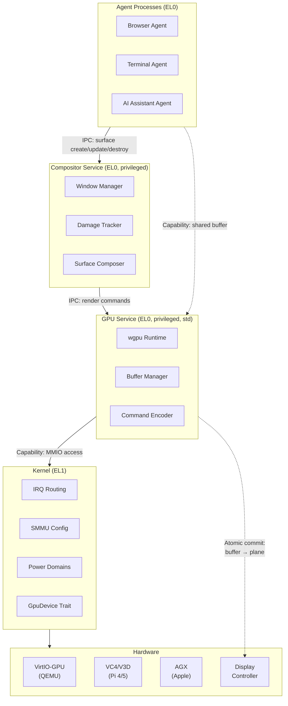

# AIOS GPU & Display Architecture

**Parent document:** [architecture.md](../project/architecture.md) — Section 2.1 Full Stack Overview
**Related:** [compositor.md](./compositor.md) — Window compositor and semantic layout, [hal.md](../kernel/hal.md) — GpuDevice trait (§4.4), [subsystem-framework.md](./subsystem-framework.md) — Display subsystem (§14), [power-management.md](./power-management.md) — GPU power states

-----

## 1. Core Insight

Traditional OS graphics stacks are monolithic: a kernel-space GPU driver exposes an ioctl interface, and every application shares a single trust domain for GPU access. A crashing GPU driver takes down the entire system. Buffer sharing relies on file-descriptor passing with no fine-grained access control.

AIOS takes a different approach. The GPU driver runs as a **privileged userspace service** with capability-gated access to GPU hardware. Every GPU buffer is a **capability-protected shared memory region** — agents can only access buffers they hold capabilities for. The compositor composes surfaces by binding capability handles to display planes, achieving a **zero-copy pipeline** from agent rendering to display scanout. GPU DMA is isolated per-agent via the ARM SMMU, with each agent's GPU context receiving its own SMMU context descriptor under the GPU device's stream ID.

This design is inspired by Fuchsia's Magma (userspace GPU drivers with VMO-based buffer sharing), seL4's capability-gated device frames, and Linux DRM/KMS's atomic modesetting — but adapted for AIOS's capability-based security model and AI-first architecture.

The key constraint: **software rendering must always work**. Every AIOS platform can fall back to CPU-based rendering when GPU hardware is unavailable or untrusted. GPU acceleration is an optimization, not a requirement.

-----

## 2. Architecture Overview



**Layer responsibilities:**

| Layer | Location | Role |
| --- | --- | --- |
| **Agents** | EL0 userspace | Render content into capability-protected GPU buffers |
| **Compositor** | EL0 privileged | Manage surfaces, layout, damage; submit composition commands |
| **GPU Service** | EL0 privileged (std) | wgpu runtime, buffer allocation, command encoding, format conversion |
| **Kernel HAL** | EL1 kernel | MMIO access, IRQ routing, SMMU programming, power domain control |
| **Hardware** | Physical | GPU execution units, display controller, HDMI/DSI output |

**Data flow (zero-copy):**

1. Agent allocates GPU buffer via capability request to GPU Service
2. Agent renders content into buffer (directly or via wgpu)
3. Agent shares buffer capability with Compositor via IPC
4. Compositor binds buffer to display plane (atomic commit via GPU Service)
5. Display controller scans out buffer directly — no copies in the pipeline

-----

## Document Map

| Document | Sections | Content |
| --- | --- | --- |
| **This file** | §1, §2, §19, §20 | Core insight, architecture, implementation order, design principles |
| [drivers.md](./gpu/drivers.md) | §3, §4, §5 | VirtIO-GPU protocol, platform-specific drivers, software renderer |
| [display.md](./gpu/display.md) | §6, §7, §8 | Display controller, framebuffer management, display pipeline |
| [rendering.md](./gpu/rendering.md) | §9, §10, §11, §12 | wgpu integration, rendering pipeline, font rendering, GPU memory |
| [security.md](./gpu/security.md) | §13, §14, §15 | Capability-gated access, DMA protection, GPU isolation |
| [integration.md](./gpu/integration.md) | §16, §17, §18 | POSIX compatibility, AI-native display, future directions |

-----

## 19. Implementation Order

```text
Phase 5a:  VirtIO-GPU 2D driver (userspace)        → page-flip display output replaces GOP framebuffer
Phase 5b:  Font rendering (fontdue + glyph atlas)   → text on screen via GPU buffer
Phase 5c:  wgpu GPU Service + surface composition   → multiple surfaces composited with GPU acceleration
Phase 5d:  Software renderer fallback               → CPU-only path for all platforms
Phase 5e:  Display mode setting + multi-monitor      → EDID parsing, resolution control
Phase 6+:  Compositor integration (see compositor.md §12)
Phase 39+: Bare-metal GPU drivers (VC4/V3D, AGX)
Phase 29+: VirtIO-GPU 3D (virgl), Vulkan (Venus)
Phase 36:  Wayland compatibility layer
```

**QEMU-first development strategy:**

1. VirtIO-GPU 2D on QEMU (paravirtualized, simple protocol)
2. Software renderer as fallback (works everywhere)
3. VirtIO-GPU 3D for GPU acceleration on QEMU
4. Native GPU drivers only when targeting real hardware

**Dependency chain:**

```text
Phase 3 (IPC + Capabilities) → GPU Service process (needs IPC channels + capability tokens)
Phase 3 (Shared Memory)      → Buffer sharing (needs shmem with capability-gated access)
Phase 4 (VirtIO-blk)         → VirtIO transport reuse (virtqueue setup, MMIO probe)
Phase 5 (This doc)           → Phase 6 (Compositor) → Phase 7 (Input) → Phase 29 (UI Toolkit)
```

-----

## 20. Design Principles

1. **Software always works.** Every rendering path has a CPU-only fallback. GPU acceleration is layered on top, never required.

2. **Userspace drivers, kernel mediation.** GPU drivers run as privileged userspace processes. The kernel provides only MMIO capability grants, IRQ notification routing, and SMMU configuration. A crashing GPU driver does not crash the kernel.

3. **Capabilities all the way down.** GPU buffers are capability-protected shared memory. Display outputs are capabilities. MMIO regions are capabilities. No raw hardware access without a capability token.

4. **Zero-copy by design.** The buffer pipeline avoids copies: agent renders directly into a GPU buffer, shares the capability handle, compositor binds to display plane, hardware scans out. Memory is never copied between stages.

5. **Atomic state commits.** Display state changes (resolution, plane bindings, gamma) are committed atomically — all changes apply or none do. Modeled after Linux DRM atomic modesetting.

6. **Progressive enhancement.** Start with the simplest working path and add complexity incrementally: GOP framebuffer → VirtIO-GPU 2D → VirtIO-GPU 3D → native GPU drivers → Vulkan.

7. **Platform abstraction at the HAL.** The `GpuDevice` trait in `hal.md` §4.4 abstracts all platform differences. Adding a new GPU platform means implementing one trait — the GPU Service, Compositor, and all agents are unchanged.

-----

## Cross-Reference Index

| Section | Sub-file | Topic |
| --- | --- | --- |
| §1 | This file | Core insight |
| §2 | This file | Architecture overview |
| §3 | [drivers.md](./gpu/drivers.md) | VirtIO-GPU driver |
| §4 | [drivers.md](./gpu/drivers.md) | Platform-specific drivers |
| §5 | [drivers.md](./gpu/drivers.md) | Software renderer |
| §6 | [display.md](./gpu/display.md) | Display controller |
| §7 | [display.md](./gpu/display.md) | Framebuffer management |
| §8 | [display.md](./gpu/display.md) | Display pipeline |
| §9 | [rendering.md](./gpu/rendering.md) | wgpu integration |
| §10 | [rendering.md](./gpu/rendering.md) | Rendering pipeline |
| §11 | [rendering.md](./gpu/rendering.md) | Font rendering |
| §12 | [rendering.md](./gpu/rendering.md) | GPU memory management |
| §13 | [security.md](./gpu/security.md) | Capability-gated GPU access |
| §14 | [security.md](./gpu/security.md) | DMA protection |
| §15 | [security.md](./gpu/security.md) | GPU isolation |
| §16 | [integration.md](./gpu/integration.md) | POSIX compatibility |
| §17 | [integration.md](./gpu/integration.md) | AI-native display |
| §18 | [integration.md](./gpu/integration.md) | Future directions |
| §19 | This file | Implementation order |
| §20 | This file | Design principles |
