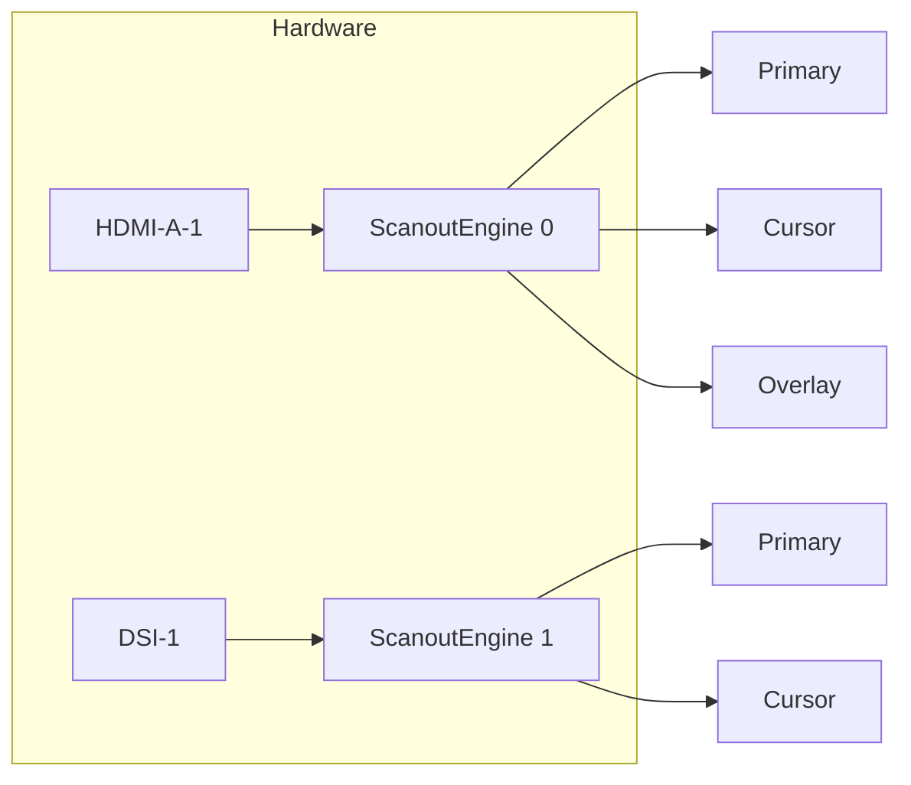
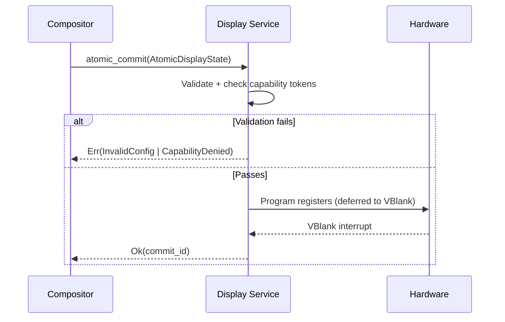
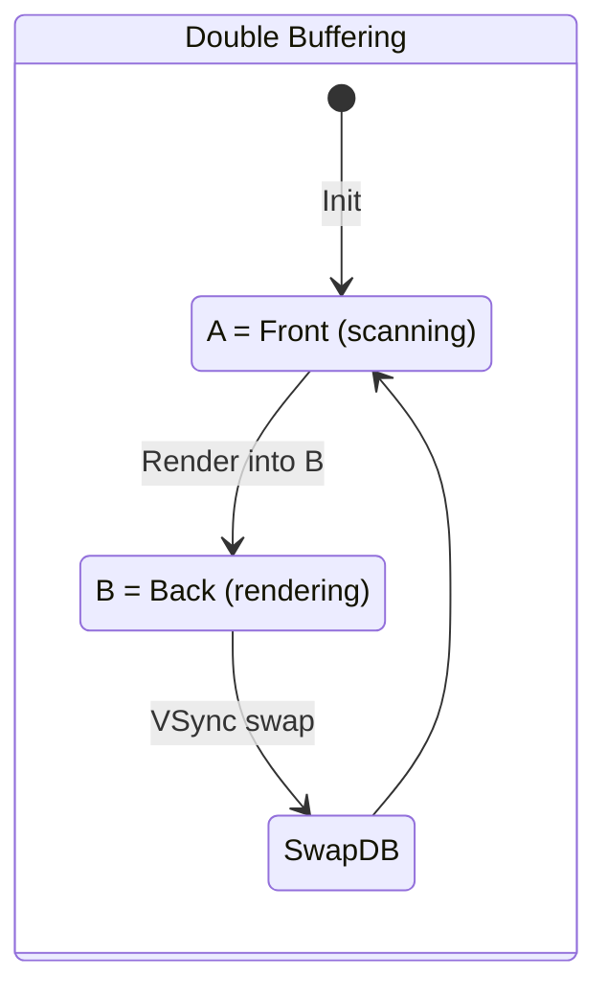
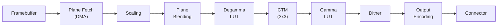
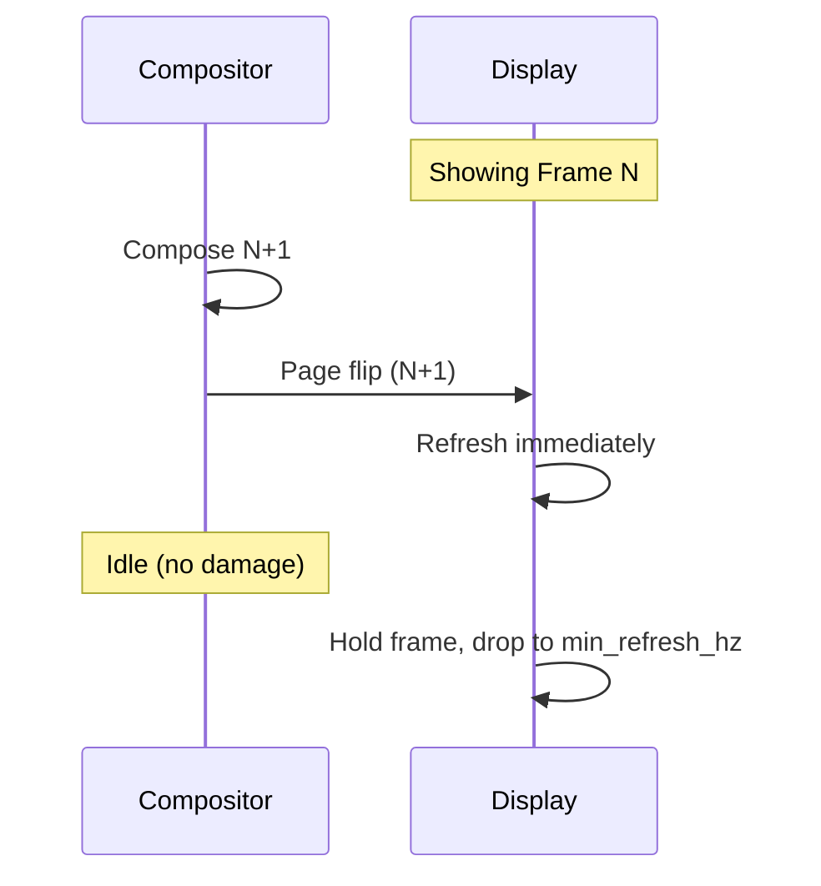

# AIOS Display Controller & Pipeline

Part of: [gpu.md](../gpu.md) — GPU & Display Architecture
**Related:** [drivers.md](./drivers.md) — GPU drivers, [rendering.md](./rendering.md) — Rendering pipeline, [security.md](./security.md) — GPU security

-----

## 6. Display Controller

The display controller layer abstracts physical display hardware behind a capability-protected interface. Inspired by Linux DRM/KMS atomic modesetting, but adapted for AIOS's capability model: every display output, scanout engine, and overlay plane is a capability-gated resource.

### 6.1 Display Abstraction Model

AIOS models display hardware as four composable abstractions, each carrying a capability token for access control.

```rust
/// A physical display port (connector + encoder).
/// Capability-protected: only holders of a DisplayOutput capability can
/// query modes or configure this output.
pub struct DisplayOutput {
    pub id: DisplayOutputId,
    pub name: [u8; 32],                    // e.g., "HDMI-A-1", "VirtIO-0"
    pub status: ConnectionStatus,
    pub edid: Option<EdidBlock>,           // None for VirtIO-GPU
    pub modes: Vec<DisplayMode>,           // sorted by preference
    pub physical_size_mm: Option<(u32, u32)>, // from EDID, for DPI
    pub cap_handle: CapabilityHandle,
}

pub enum ConnectionStatus { Connected, Disconnected, Unknown }

/// A single supported display mode.
pub struct DisplayMode {
    pub hdisplay: u32,
    pub vdisplay: u32,
    pub refresh_mhz: u32,     // millihertz (60000 = 60.000 Hz)
    pub htotal: u32,           // active + blanking
    pub vtotal: u32,
    pub clock_khz: u32,        // pixel clock
    pub flags: ModeFlags,
}

bitflags::bitflags! {
    pub struct ModeFlags: u32 {
        const PREFERRED   = 1 << 0;
        const INTERLACED  = 1 << 1;
        const DOUBLESCAN  = 1 << 2;
        const VRR_CAPABLE = 1 << 3;
    }
}
```

```rust
/// Scanout engine (CRTC equivalent in DRM).
/// One per simultaneously active display.
pub struct ScanoutEngine {
    pub id: ScanoutEngineId,
    pub bound_output: Option<DisplayOutputId>,
    pub active_mode: Option<DisplayMode>,
    pub vblank_count: u64,
    pub planes: Vec<OverlayPlane>,
}

/// Hardware composition layer bound to a ScanoutEngine.
pub struct OverlayPlane {
    pub id: OverlayPlaneId,
    pub plane_type: PlaneType,
    pub buffer: Option<GpuBufferHandle>,
    pub src_rect: Rect,
    pub dst_rect: Rect,
    pub supported_formats: Vec<PixelFormat>,
    pub supported_rotations: RotationFlags,
}

pub enum PlaneType {
    Underlay,   // background, behind all planes
    Primary,    // main desktop content
    Cursor,     // hardware cursor (64x64 or 256x256)
    Overlay,    // video, notifications, compositor use
}
```

The hierarchy: each `DisplayOutput` binds to at most one `ScanoutEngine`, which owns one or more `OverlayPlane` instances. The compositor binds `GpuBuffer` handles to planes and commits atomically ([section 6.2](#62-mode-setting)).



**Platform mapping:**

| Platform | DisplayOutput | ScanoutEngine | Overlay Planes |
| --- | --- | --- | --- |
| QEMU VirtIO-GPU | 1 per scanout | 1 per scanout | Primary only |
| Raspberry Pi 4 | HDMI-A-1, HDMI-A-2, DSI-1 | 3 (HVS channels) | Primary + 2 overlay + cursor |
| Raspberry Pi 5 | HDMI-A-1, HDMI-A-2, DSI-1 | 3 (HVS channels) | Primary + 3 overlay + cursor |
| Apple Silicon | DisplayPort, HDMI (USB-C) | 1 per output (DCP) | Primary + video overlay + cursor |

-----

### 6.2 Mode Setting

All display state changes use an atomic commit model — the compositor assembles a complete `AtomicDisplayState` and submits it as a single transaction. Either every change applies or none do.

```rust
pub struct AtomicDisplayState {
    pub outputs: Vec<OutputConfig>,
    pub planes: Vec<PlaneConfig>,
    pub color: Vec<ColorConfig>,
}

pub struct OutputConfig {
    pub output_id: DisplayOutputId,
    pub engine_id: ScanoutEngineId,
    pub mode: Option<DisplayMode>,  // None = disable
    pub active: bool,
}

pub struct PlaneConfig {
    pub plane_id: OverlayPlaneId,
    pub engine_id: ScanoutEngineId,
    pub buffer: Option<GpuBufferHandle>,
    pub src_rect: Rect,
    pub dst_rect: Rect,
    pub rotation: Rotation,
    pub blend_mode: BlendMode,
    pub alpha: f32,
}

pub struct ColorConfig {
    pub engine_id: ScanoutEngineId,
    pub degamma_lut: Option<GammaLut>,
    pub ctm: Option<ColorMatrix>,
    pub gamma_lut: Option<GammaLut>,
}
```



The compositor can submit with a `test_only` flag to validate a configuration without touching hardware registers. This probes whether a plane assignment, mode, or scaling config is supported before committing live.

-----

### 6.3 EDID Parsing

EDID (Extended Display Identification Data) is a 128-byte base block read via I2C DDC from the connector, describing supported modes, color characteristics, and physical dimensions.

```text
Offset  Size  Field
0x00    8     Header (00 FF FF FF FF FF FF 00)
0x08    10    Vendor/product identification
0x14    5     Basic display parameters
0x23    3     Established timings
0x26    16    Standard timings (8 entries)
0x36    72    Detailed timing descriptors (4 x 18 bytes)
0x7E    1     Extension count
0x7F    1     Checksum
```

```rust
pub struct ParsedEdid {
    pub manufacturer: [u8; 3],        // PnP code ("DEL", "SAM")
    pub product_code: u16,
    pub serial: Option<u32>,
    pub preferred_mode: DisplayMode,   // first detailed timing
    pub modes: Vec<DisplayMode>,
    pub physical_size_mm: (u32, u32),  // for DPI calculation
    pub color_depth: u8,
    pub color_formats: ColorFormatFlags,
}

pub fn parse_edid(raw: &[u8; 128]) -> Result<ParsedEdid, EdidError> {
    // Verify header + checksum, extract manufacturer (5-bit ASCII),
    // parse detailed timing descriptors, standard timings, dimensions
    todo!()
}
```

AIOS uses the `edid-rs` crate for parsing in the GPU Service (userspace). The kernel reads raw bytes from I2C and passes them via IPC.

**VirtIO-GPU exception:** VirtIO-GPU provides no EDID. Mode info comes from `VIRTIO_GPU_CMD_GET_DISPLAY_INFO`. The GPU Service normalizes both paths into the same `DisplayOutput` structure.

**CTA-861 extensions:** The base block's extension count (byte 0x7E) indicates additional 128-byte blocks containing HDR static metadata, colorimetry, and VRR timing.

-----

### 6.4 Multi-Monitor Support

Each display is an independent `DisplayOutput` with its own `ScanoutEngine`, resolution, refresh rate, and scaling factor.

- Each output runs its own composition loop at its own refresh rate ([compositor rendering.md §5.4](../compositor/rendering.md))
- VBlank events arrive independently -- a 60 Hz panel and 144 Hz monitor never synchronize
- Each `DisplayOutput` has its own capability token; holding HDMI-A-1's cap does not grant DSI-1 access

```rust
pub enum DisplayCapability {
    Full(DisplayOutputId),   // mode setting, plane binding, power
    Query(DisplayOutputId),  // read-only: modes, status, EDID
}
```

**Layout management:** The compositor maintains position offsets between outputs (e.g., monitor B at +2560px right of A). Drag gestures crossing output edges transfer windows to the adjacent compositor loop.

**Hotplug:** Kernel delivers hotplug notification to GPU Service, which reads EDID, constructs a `DisplayOutput`, and notifies the compositor. The compositor assigns a scanout engine, selects preferred mode, and commits atomically. Disconnection migrates surfaces to the nearest remaining output.

-----

### 6.5 HiDPI and Fractional Scaling

Scaling is compositor-level -- the kernel operates in physical pixels. The compositor translates between logical coordinates (agents) and physical pixels (scanout engines).

**Scale factor:** `dpi = hdisplay / (physical_width_mm / 25.4)`, then `scale = round(dpi / 96.0)` for integer or `dpi / 96.0` for fractional.

**Fractional scaling strategies:**

| Strategy | Mechanism | Trade-off |
| --- | --- | --- |
| **Oversample** | Render at `ceil(physical / scale)`, downscale to physical | Sharper text, higher GPU cost |
| **Viewport scale** | Render at physical res, scale UI coordinates | Lower GPU cost, sub-pixel artifacts |
| **Integer nearest** | Nearest-neighbor NxN pixel blocks | Zero artifacts, limited scale factors |

AIOS defaults to oversample for text-heavy surfaces and viewport scale for video/3D, selected per-surface via semantic hints ([compositor protocol.md §4](../compositor/protocol.md)). Each output has an independent scale factor.

```rust
pub struct OutputScaling {
    pub output_id: DisplayOutputId,
    pub scale: f32,
    pub text_strategy: ScalingStrategy,
    pub media_strategy: ScalingStrategy,
}

pub enum ScalingStrategy { Oversample, ViewportScale, IntegerNearest }
```

-----

## 7. Framebuffer Management

### 7.1 Buffer Allocation

Every GPU buffer is a capability-protected shared memory region allocated through the GPU Service.

```rust
pub struct GpuBuffer {
    pub cap_handle: CapabilityHandle,
    pub pages: Vec<PhysAddr>,          // DMA-accessible physical frames
    pub width: u32,
    pub height: u32,
    pub format: PixelFormat,
    pub stride: u32,                   // bytes per row (aligned)
    pub usage: BufferUsageFlags,
    pub size: usize,                   // stride * height, page-aligned
}

pub enum PixelFormat {
    B8G8R8A8,          // VirtIO-GPU native
    R8G8B8A8,
    B8G8R8X8,          // opaque (alpha ignored)
    R8G8B8X8,
    R5G6B5,            // 16-bit low-memory fallback
    A2R10G10B10,       // HDR 10-bit
    R16G16B16A16Float, // HDR compositing intermediate
}

bitflags::bitflags! {
    pub struct BufferUsageFlags: u32 {
        const RENDERABLE   = 1 << 0;
        const SCANOUT      = 1 << 1;
        const TEXTURE      = 1 << 2;
        const CURSOR       = 1 << 3;
        const GPU_ONLY     = 1 << 4;
        const CPU_MAPPABLE = 1 << 5;
    }
}
```

Agents send `AllocateBuffer` IPC requests to the GPU Service, which allocates from the DMA page pool ([memory.md §2.4](../../kernel/memory/physical.md)), mints a capability token, and returns the handle. Stride alignment matches the GPU's preference: 64B (VirtIO-GPU), 128B (VC4/V3D), 256B (Apple AGX).

-----

### 7.2 Double and Triple Buffering

**Double buffering:** front buffer scans out while back buffer receives rendering; swap at VSync. **Triple buffering:** adds a second back buffer so rendering proceeds while one back buffer waits for VSync.



**Buffer states:** `Free` (available) -> `Rendering` (drawing) -> `Queued` (waiting for VSync) -> `Displaying` (scanout) -> `Free`.

The compositor defaults to double buffering, upgrading to triple when frame cost approaches the VSync interval or VRR is unavailable.

-----

### 7.3 Page Flip (Scanout Swap)

A page flip atomically swaps the buffer bound to a display plane at VBlank. The compositor submits a `PlaneConfig` with the new buffer as part of an atomic commit ([section 6.2](#62-mode-setting)).

**VirtIO-GPU:** page flip is `TRANSFER_TO_HOST_2D` (copy dirty region) + `RESOURCE_FLUSH` (signal host), submitted as a pair on the controlq. No real VBlank -- the host updates asynchronously.

**Native hardware (Pi 4/5, Apple):**

1. Write new framebuffer address to plane base register (latched, not immediate)
2. At VBlank, hardware switches to new address
3. VBlank interrupt signals flip completion
4. Old buffer returns to `Free` state

-----

### 7.4 VSync and Frame Pacing

**Hardware VSync:** Display controller VBlank interrupt, routed to GPU Service via IPC notification ([hal.md §4.1](../../kernel/hal.md)).

**Synthetic VSync:** VirtIO-GPU has no VBlank. The GPU Service creates a timer at the configured refresh rate (default 60 Hz = 16.67ms).

```rust
pub struct VSyncEvent {
    pub output_id: DisplayOutputId,
    pub timestamp_ns: u64,
    pub sequence: u64,
    pub source: VSyncSource,
}

pub enum VSyncSource { Hardware, Synthetic }
```

**Frame deadline scheduling:** When the compositor is within 2ms of VBlank, the scheduler temporarily boosts its priority to `SchedulerClass::RT` ([scheduler.md §3.2](../../kernel/scheduler.md)).

**Idle power:** No damage means no frame render and no page flip. On hardware with panel self-refresh (PSR), the display shows the last frame from internal memory while GPU and compositor sleep.

-----

## 8. Display Pipeline

### 8.1 Scanout Pipeline



| Stage | Function |
| --- | --- |
| **Plane Fetch** | DMA reads pixel data from framebuffer memory |
| **Scaling** | Bilinear/bicubic resize src to dst rectangle |
| **Plane Blending** | Alpha-blend planes in z-order into single image |
| **Degamma LUT** | Linearize input (undo source transfer function) |
| **CTM** | 3x3 matrix in linear space (gamut mapping, white point) |
| **Gamma LUT** | Apply output transfer function (sRGB, PQ, HLG) |
| **Dithering** | Temporal/spatial dither when output depth < source |
| **Output Encoding** | Serialize to wire protocol (TMDS/HDMI, MIPI/DSI, DP) |

On VirtIO-GPU, gamma/CTM/dithering are applied by the compositor's GPU shaders rather than fixed-function hardware.

-----

### 8.2 Color Management

Three-stage pipeline per output, matching the Linux DRM atomic color model:

```text
Input (encoded) --> Degamma LUT --> Linear --> CTM (3x3) --> Linear --> Gamma LUT --> Output (encoded)
```

```rust
/// 3x3 color matrix in S31.32 fixed-point, applied in linear light space.
pub struct ColorMatrix {
    pub m: [[i64; 3]; 3],  // identity: [[1,0,0],[0,1,0],[0,0,1]]
}

/// Gamma LUT: 256 or 1024 entries per channel.
pub struct GammaLut {
    pub size: u32,
    pub entries: Vec<(u16, u16, u16)>,  // (R, G, B) in 16-bit
}
```

The CTM handles gamut mapping, white point adjustment, and color temperature (night shift). The compositor loads ICC profiles from EDID or user config; without an ICC profile, sRGB is assumed. Ambient light sensors (when available) adjust the CTM dynamically.

-----

### 8.3 HDR and Wide Color Gamut

| Transfer Function | Standard | Use Case |
| --- | --- | --- |
| **PQ** | SMPTE ST 2084 | HDR10 -- absolute luminance (0-10000 nits) |
| **HLG** | ARIB STD-B67 | HDR broadcast -- backward-compatible with SDR |
| **sRGB** | IEC 61966-2-1 | Standard SDR (~2.2 gamma) |

```rust
pub struct HdrStaticMetadata {
    pub max_luminance: u16,         // nits
    pub min_luminance: u16,         // 0.0001 nit units
    pub max_frame_average: u16,
    pub primaries: ColorPrimaries,  // CIE 1931 xy
    pub white_point: (u16, u16),
    pub eotf: TransferFunction,
}

pub enum TransferFunction { Srgb, Pq, Hlg }
```

**HDR composition:** When any surface declares HDR content ([compositor protocol.md §4](../compositor/protocol.md)), the compositor switches to `R16G16B16A16Float` intermediate. SDR surfaces are tone-mapped to the HDR range at a configurable SDR white level (default 203 nits, per ITU-R BT.2408). The final frame is encoded via the gamma LUT.

**SDR display fallback:** HDR surfaces on SDR displays get a PQ-to-sRGB tone mapping shader (Reinhard-inspired curve). The agent receives a configure event indicating tone mapping is active.

-----

### 8.4 Rotation and Transform

```rust
pub enum Rotation { Normal, Rotate90, Rotate180, Rotate270 }

bitflags::bitflags! {
    pub struct ReflectFlags: u32 {
        const REFLECT_X = 1 << 0;
        const REFLECT_Y = 1 << 1;
    }
}
```

| Platform | HW Rotation | Reflection |
| --- | --- | --- |
| QEMU VirtIO-GPU | None | None |
| Raspberry Pi 4 (HVS) | 0, 180 | X, Y |
| Raspberry Pi 5 (HVS) | 0, 90, 180, 270 | X, Y |
| Apple Silicon (DCP) | 0, 90, 180, 270 | X, Y |

**Hardware rotation** configures `PlaneConfig.rotation` in the atomic commit -- zero GPU cost, the DMA fetch reads pixels in rotated order. **Software fallback:** the compositor applies rotation as a scene graph root transform ([compositor rendering.md §5.1](../compositor/rendering.md)).

**Input transform:** Rotated displays require inverse coordinate mapping for touch/pointer. A tap at physical (x, y) on a 90-degree-rotated display maps to logical (y, width - x). Applied in the input pipeline ([compositor input.md §7](../compositor/input.md)).

-----

### 8.5 Adaptive Sync (VRR)

VRR allows the display to refresh when a frame is ready rather than at a fixed interval, eliminating tearing and judder.

```rust
pub struct VrrCapability {
    pub min_refresh_hz: u32,
    pub max_refresh_hz: u32,
    pub protocol: VrrProtocol,
}

pub enum VrrProtocol { AdaptiveSync, FreeSync, Hdmi21Vrr }
```

**Compositor behavior under VRR:**

1. No fixed VSync target -- page flip submitted on composition completion
2. Display refreshes immediately on receiving a new frame
3. If no frame arrives before `1 / min_refresh_hz`, the display re-scans the current frame
4. Static content drops to minimum refresh rate, saving panel power



**Low Framerate Compensation (LFC):** When rendering falls below `min_refresh_hz` (e.g., 30 fps on a 48-165 Hz display), the compositor inserts duplicate flips to keep the effective rate within the VRR range.

**VRR on QEMU:** Not supported. Synthetic VSync at fixed rate. VRR code exercised via a test mode that simulates variable timing.

-----

## Cross-References

| Section | Topic | Related Document |
| --- | --- | --- |
| §6.1 | Display abstractions | [hal.md §4.4](../../kernel/hal.md) -- GpuDevice trait |
| §6.2 | Atomic modesetting | [compositor rendering.md §5.4](../compositor/rendering.md) -- Frame scheduling |
| §6.4 | Multi-monitor layout | [compositor rendering.md §6](../compositor/rendering.md) -- Layout engine |
| §6.5 | HiDPI scaling | [compositor protocol.md §4](../compositor/protocol.md) -- Semantic hints |
| §7.1 | Buffer allocation | [memory.md §2.4](../../kernel/memory/physical.md) -- DMA page pool |
| §7.1 | Capability buffers | [security.md](./security.md) -- GPU capability model |
| §7.4 | Frame pacing | [compositor rendering.md §5.4](../compositor/rendering.md) -- VSync scheduling |
| §7.4 | Scheduler boost | [scheduler.md §3.2](../../kernel/scheduler.md) -- RT priority |
| §8.1 | Scanout pipeline | [drivers.md](./drivers.md) -- Platform driver details |
| §8.2 | Color management | [compositor ai-native.md §12](../compositor/ai-native.md) -- AI color adaptation |
| §8.3 | HDR composition | [rendering.md](./rendering.md) -- wgpu shader pipeline |
| §8.5 | Adaptive sync | [power-management.md](../power-management.md) -- Display power states |
