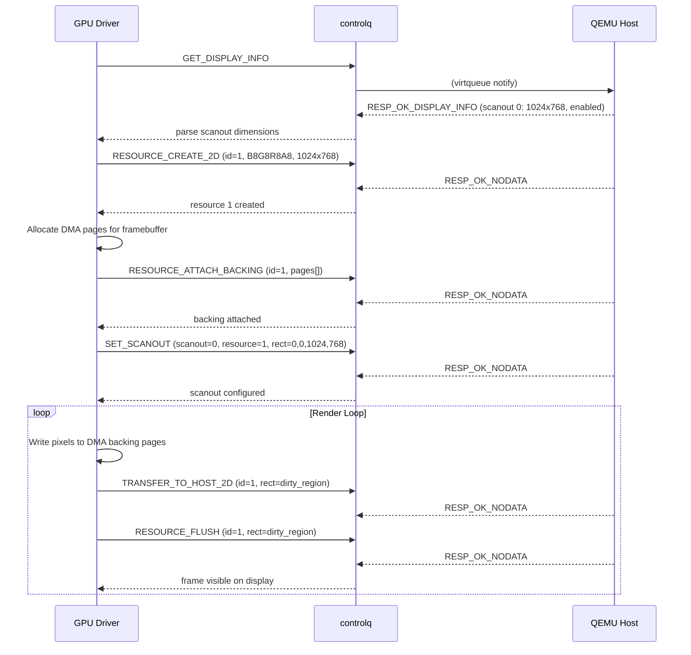
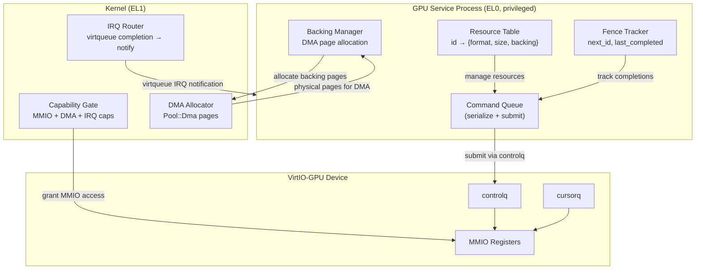
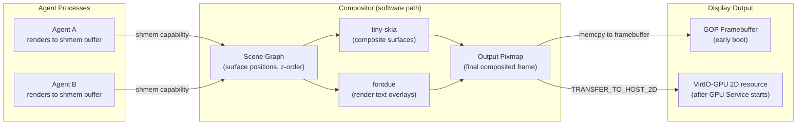

# AIOS GPU Drivers

Part of: [gpu.md](../gpu.md) — GPU & Display Architecture
**Related:** [display.md](./display.md) — Display controller, [rendering.md](./rendering.md) — Rendering pipeline, [security.md](./security.md) — GPU security

-----

## 3. VirtIO-GPU Driver

VirtIO-GPU is AIOS's primary GPU target on QEMU. It runs as a userspace driver process with capability-gated MMIO access, following the same privileged service pattern as all AIOS device drivers. The driver reuses the VirtIO MMIO legacy transport infrastructure from the existing block driver (`kernel/src/drivers/virtio_blk.rs`) — device discovery, virtqueue setup, and MMIO register access are identical. Only the device ID (16 for GPU vs 2 for block) and the command protocol differ.

QEMU flag: `-device virtio-gpu-device` (MMIO transport). The device appears at one of the VirtIO MMIO slots in the `0x0A00_0000`–`0x0A00_3E00` range (512-byte stride), discoverable via DTB or brute-force probe.

### 3.1 VirtIO-GPU Device Identity

| Property | Value |
| --- | --- |
| VirtIO device ID | 16 (`VIRTIO_DEVICE_ID_GPU`) |
| Transport | MMIO legacy (v1), same as VirtIO-blk |
| MMIO magic | `0x74726976` ("virt") |
| Virtqueue count | 2 (controlq + cursorq) |
| Config space | Scanout count, feature flags |
| Spec reference | VirtIO 1.2, Section 5.7 |

Feature bits negotiated during device initialization:

| Feature | Bit | Description |
| --- | --- | --- |
| `VIRTIO_GPU_F_VIRGL` | 0 | 3D VirGL rendering support |
| `VIRTIO_GPU_F_EDID` | 1 | EDID data available for displays |
| `VIRTIO_GPU_F_RESOURCE_UUID` | 2 | UUID assignment to resources |
| `VIRTIO_GPU_F_RESOURCE_BLOB` | 3 | Blob resources (zero-copy 3D) |
| `VIRTIO_GPU_F_CONTEXT_INIT` | 4 | Context type negotiation |

### 3.2 Virtqueue Layout

The VirtIO-GPU device uses two virtqueues:

| Queue Index | Name | Purpose |
| --- | --- | --- |
| 0 | `controlq` | All 2D/3D GPU commands (request-response pairs) |
| 1 | `cursorq` | Cursor image updates and position changes |

Both queues use the standard VirtIO split virtqueue format (descriptor table + available ring + used ring) with the same legacy MMIO layout as the block driver. Each command is submitted as a descriptor chain: one device-readable descriptor containing the command header and parameters, followed by one device-writable descriptor for the response.

Every command begins with a common header:

```rust
/// VirtIO-GPU command header. Precedes every control and cursor command.
/// Per VirtIO spec §5.7.6.7.
#[repr(C)]
pub struct VirtioGpuCtrlHdr {
    /// Command type (VIRTIO_GPU_CMD_* or VIRTIO_GPU_RESP_*).
    pub type_: u32,
    /// Command flags. Bit 0 = VIRTIO_GPU_FLAG_FENCE (fence synchronization).
    pub flags: u32,
    /// Fence ID for synchronization (valid when FLAG_FENCE is set).
    pub fence_id: u64,
    /// 3D rendering context ID (0 for 2D commands).
    pub ctx_id: u32,
    /// Ring index for multi-ring support (0 for single-ring).
    pub ring_idx: u8,
    /// Reserved padding — must be zero.
    pub padding: [u8; 3],
}
```

Response codes returned in the `type_` field of the response header:

```rust
/// Success — command completed without error.
pub const VIRTIO_GPU_RESP_OK_NODATA: u32 = 0x1100;
/// Success — response contains display info.
pub const VIRTIO_GPU_RESP_OK_DISPLAY_INFO: u32 = 0x1101;
/// Success — response contains capset info.
pub const VIRTIO_GPU_RESP_OK_CAPSET_INFO: u32 = 0x1102;
/// Success — response contains capset data.
pub const VIRTIO_GPU_RESP_OK_CAPSET: u32 = 0x1103;
/// Success — response contains EDID data.
pub const VIRTIO_GPU_RESP_OK_EDID: u32 = 0x1104;
/// Error — unspecified.
pub const VIRTIO_GPU_RESP_ERR_UNSPEC: u32 = 0x1200;
/// Error — out of memory on the host.
pub const VIRTIO_GPU_RESP_ERR_OUT_OF_MEMORY: u32 = 0x1201;
/// Error — invalid scanout ID.
pub const VIRTIO_GPU_RESP_ERR_INVALID_SCANOUT_ID: u32 = 0x1202;
/// Error — invalid resource ID.
pub const VIRTIO_GPU_RESP_ERR_INVALID_RESOURCE_ID: u32 = 0x1203;
/// Error — invalid rendering context ID.
pub const VIRTIO_GPU_RESP_ERR_INVALID_CONTEXT_ID: u32 = 0x1204;
/// Error — invalid parameter.
pub const VIRTIO_GPU_RESP_ERR_INVALID_PARAMETER: u32 = 0x1205;
```

### 3.3 2D Mode Commands

The 2D command set provides everything needed for framebuffer-based display output. Each command type has a corresponding `repr(C)` Rust struct that maps directly to the wire format.

**Pixel formats** supported by `RESOURCE_CREATE_2D`:

```rust
/// VirtIO-GPU pixel formats. Subset of DRM fourcc codes.
#[repr(u32)]
pub enum VirtioGpuFormat {
    /// Blue-Green-Red-Alpha, 8 bits per channel. Most common on QEMU.
    B8G8R8A8Unorm = 1,
    /// Blue-Green-Red, 8 bits per channel, alpha ignored (X = don't care).
    B8G8R8X8Unorm = 2,
    /// Alpha-Red-Green-Blue, 8 bits per channel.
    A8R8G8B8Unorm = 3,
    /// Red-Green-Blue, 8 bits per channel, alpha ignored.
    X8R8G8B8Unorm = 4,
    /// Red-Green-Blue-Alpha, 8 bits per channel.
    R8G8B8A8Unorm = 67,
    /// Red-Green-Blue, 8 bits per channel, alpha ignored.
    R8G8B8X8Unorm = 68,
}
```

**Rectangle type** used by transfer, flush, and scanout commands:

```rust
/// Axis-aligned rectangle for 2D operations.
#[repr(C)]
pub struct VirtioGpuRect {
    pub x: u32,
    pub y: u32,
    pub width: u32,
    pub height: u32,
}
```

**Command: GET_DISPLAY_INFO**

Queries the host for information about available scanouts (display outputs). The response contains up to 16 scanout descriptors with their dimensions and enabled state.

```rust
/// Request: just the header with type = VIRTIO_GPU_CMD_GET_DISPLAY_INFO.
pub const VIRTIO_GPU_CMD_GET_DISPLAY_INFO: u32 = 0x0100;

/// Response: display information for all scanouts.
#[repr(C)]
pub struct VirtioGpuRespDisplayInfo {
    pub hdr: VirtioGpuCtrlHdr,
    /// Per-scanout display info (up to 16 scanouts).
    pub pmodes: [VirtioGpuDisplayOne; 16],
}

/// Single scanout (display output) descriptor.
#[repr(C)]
pub struct VirtioGpuDisplayOne {
    /// Scanout rectangle (position and dimensions).
    pub r: VirtioGpuRect,
    /// Nonzero if this scanout is enabled.
    pub enabled: u32,
    /// Flags (reserved, must be zero).
    pub flags: u32,
}
```

**Command: RESOURCE_CREATE_2D**

Allocates a 2D resource on the host GPU. The resource is a pixel buffer with specified dimensions and format. Resources are identified by a driver-assigned `resource_id` (must be nonzero, unique across all live resources).

```rust
pub const VIRTIO_GPU_CMD_RESOURCE_CREATE_2D: u32 = 0x0101;

#[repr(C)]
pub struct VirtioGpuResourceCreate2d {
    pub hdr: VirtioGpuCtrlHdr,
    /// Driver-assigned resource identifier (must be nonzero).
    pub resource_id: u32,
    /// Pixel format (VirtioGpuFormat).
    pub format: u32,
    /// Width in pixels.
    pub width: u32,
    /// Height in pixels.
    pub height: u32,
}
```

**Command: RESOURCE_UNREF**

Destroys a previously created resource and releases host memory.

```rust
pub const VIRTIO_GPU_CMD_RESOURCE_UNREF: u32 = 0x0102;

#[repr(C)]
pub struct VirtioGpuResourceUnref {
    pub hdr: VirtioGpuCtrlHdr,
    pub resource_id: u32,
    pub padding: u32,
}
```

**Command: SET_SCANOUT**

Binds a resource to a display scanout. The scanout displays the specified rectangular region of the resource. Setting `resource_id = 0` disables the scanout.

```rust
pub const VIRTIO_GPU_CMD_SET_SCANOUT: u32 = 0x0103;

#[repr(C)]
pub struct VirtioGpuSetScanout {
    pub hdr: VirtioGpuCtrlHdr,
    /// Region of the resource to display.
    pub r: VirtioGpuRect,
    /// Scanout index (0 = primary display).
    pub scanout_id: u32,
    /// Resource to display (0 = disable scanout).
    pub resource_id: u32,
}
```

**Command: RESOURCE_FLUSH**

Flushes a rectangular region of a resource to the display. This triggers the host to update the screen output. Must be called after `TRANSFER_TO_HOST_2D` for changes to become visible.

```rust
pub const VIRTIO_GPU_CMD_RESOURCE_FLUSH: u32 = 0x0104;

#[repr(C)]
pub struct VirtioGpuResourceFlush {
    pub hdr: VirtioGpuCtrlHdr,
    /// Region to flush.
    pub r: VirtioGpuRect,
    /// Resource to flush.
    pub resource_id: u32,
    pub padding: u32,
}
```

**Command: TRANSFER_TO_HOST_2D**

Transfers pixel data from guest memory (the backing pages attached via `RESOURCE_ATTACH_BACKING`) to the host-side resource. The `offset` field specifies the byte offset into the guest backing memory where the transfer starts.

```rust
pub const VIRTIO_GPU_CMD_TRANSFER_TO_HOST_2D: u32 = 0x0105;

#[repr(C)]
pub struct VirtioGpuTransferToHost2d {
    pub hdr: VirtioGpuCtrlHdr,
    /// Region within the resource to update.
    pub r: VirtioGpuRect,
    /// Byte offset into guest backing memory.
    pub offset: u64,
    /// Target resource.
    pub resource_id: u32,
    pub padding: u32,
}
```

**Command: RESOURCE_ATTACH_BACKING**

Binds guest physical memory pages to a resource. The host reads pixel data from these pages during `TRANSFER_TO_HOST_2D`. The command is followed by an array of memory entries describing the guest physical pages.

```rust
pub const VIRTIO_GPU_CMD_RESOURCE_ATTACH_BACKING: u32 = 0x0106;

#[repr(C)]
pub struct VirtioGpuResourceAttachBacking {
    pub hdr: VirtioGpuCtrlHdr,
    /// Resource to attach memory to.
    pub resource_id: u32,
    /// Number of memory entries following this struct.
    pub nr_entries: u32,
}

/// A single guest memory region for resource backing.
#[repr(C)]
pub struct VirtioGpuMemEntry {
    /// Guest physical address of the memory region.
    pub addr: u64,
    /// Length in bytes.
    pub length: u32,
    pub padding: u32,
}
```

**Command: RESOURCE_DETACH_BACKING**

Detaches guest memory from a resource. Must be called before `RESOURCE_UNREF` if backing was attached.

```rust
pub const VIRTIO_GPU_CMD_RESOURCE_DETACH_BACKING: u32 = 0x0107;

#[repr(C)]
pub struct VirtioGpuResourceDetachBacking {
    pub hdr: VirtioGpuCtrlHdr,
    pub resource_id: u32,
    pub padding: u32,
}
```

**Commands: GET_CAPSET_INFO / GET_CAPSET**

Used for capability set negotiation (relevant for 3D mode). The driver queries available capability sets (VirGL, Venus) and retrieves their parameters.

```rust
pub const VIRTIO_GPU_CMD_GET_CAPSET_INFO: u32 = 0x0108;

#[repr(C)]
pub struct VirtioGpuGetCapsetInfo {
    pub hdr: VirtioGpuCtrlHdr,
    /// Index of the capability set to query.
    pub capset_index: u32,
    pub padding: u32,
}

#[repr(C)]
pub struct VirtioGpuRespCapsetInfo {
    pub hdr: VirtioGpuCtrlHdr,
    /// Capability set ID (1 = VirGL, 2 = Venus/Vulkan).
    pub capset_id: u32,
    /// Maximum version supported.
    pub capset_max_version: u32,
    /// Size in bytes of the capability set data.
    pub capset_max_size: u32,
    pub padding: u32,
}

pub const VIRTIO_GPU_CMD_GET_CAPSET: u32 = 0x0109;

#[repr(C)]
pub struct VirtioGpuGetCapset {
    pub hdr: VirtioGpuCtrlHdr,
    pub capset_id: u32,
    pub capset_version: u32,
}
```

### 3.4 Fence-Based Synchronization

VirtIO-GPU uses fences for asynchronous command completion tracking. When the `VIRTIO_GPU_FLAG_FENCE` flag (bit 0) is set in a command's header, the host signals completion by returning a response with the same `fence_id`. The driver tracks outstanding fences and notifies waiters when the host completes the fenced operation.

```text
Fence lifecycle:
  1. Driver assigns monotonically increasing fence_id
  2. Driver sets flags |= VIRTIO_GPU_FLAG_FENCE in command header
  3. Driver submits command via controlq
  4. Host processes command
  5. Host returns response with matching fence_id
  6. Driver marks fence_id as completed
  7. All operations waiting on this fence_id are released
```

```rust
/// Fence flag — set in VirtioGpuCtrlHdr.flags to request fence signaling.
pub const VIRTIO_GPU_FLAG_FENCE: u32 = 1 << 0;

/// Fence tracker for the GPU driver process.
pub struct FenceTracker {
    /// Last completed fence ID. All fence IDs <= this value are complete.
    last_completed: u64,
    /// Next fence ID to assign.
    next_id: u64,
}

impl FenceTracker {
    /// Allocate the next fence ID for a command.
    pub fn allocate(&mut self) -> u64 {
        let id = self.next_id;
        self.next_id += 1;
        id
    }

    /// Mark a fence as completed (called when response arrives).
    pub fn complete(&mut self, fence_id: u64) {
        if fence_id > self.last_completed {
            self.last_completed = fence_id;
        }
    }

    /// Check whether a specific fence has completed.
    pub fn is_complete(&self, fence_id: u64) -> bool {
        fence_id <= self.last_completed
    }
}
```

Fences are essential for double-buffered display: the driver submits rendering commands with a fence, then waits for fence completion before reusing the backing buffer. Without fences, the driver would need to block synchronously on every command, halving throughput.

### 3.5 2D Display Flow

The standard sequence for establishing 2D display output on QEMU:



**Double-buffered rendering** uses two resources alternated each frame:

1. Frame N: render to resource A, display resource B
2. Submit `SET_SCANOUT` to swap to resource A
3. Frame N+1: render to resource B, display resource A
4. Submit `SET_SCANOUT` to swap to resource B

The fence mechanism gates buffer reuse — the driver waits for the `RESOURCE_FLUSH` fence to complete before rendering into the buffer that was just displayed.

### 3.6 3D Mode (VirGL / Venus)

VirtIO-GPU 3D mode enables GPU-accelerated rendering by forwarding OpenGL or Vulkan commands from the guest to the host GPU. Two protocols are supported:

**VirGL (OpenGL passthrough)**. The guest submits OpenGL command streams via `VIRTIO_GPU_CMD_SUBMIT_3D`. The host decodes these into native OpenGL calls against the host GPU. VirGL provides OpenGL 4.3 / GLES 3.1 capability on QEMU. The guest driver creates a 3D rendering context via `VIRTIO_GPU_CMD_CTX_CREATE` and submits command buffers containing VirGL-encoded draw calls.

**Venus (Vulkan passthrough)**. A newer protocol where the guest Vulkan ICD (Installable Client Driver) serializes Vulkan API calls into a wire format. The host deserializes and replays them against the host Vulkan driver. Venus provides near-native Vulkan performance with full API conformance.

Key 3D commands:

```rust
/// Create a 3D rendering context.
pub const VIRTIO_GPU_CMD_CTX_CREATE: u32 = 0x0200;
/// Destroy a 3D rendering context.
pub const VIRTIO_GPU_CMD_CTX_DESTROY: u32 = 0x0201;
/// Attach a resource to a 3D context (makes it accessible to shaders).
pub const VIRTIO_GPU_CMD_CTX_ATTACH_RESOURCE: u32 = 0x0202;
/// Detach a resource from a 3D context.
pub const VIRTIO_GPU_CMD_CTX_DETACH_RESOURCE: u32 = 0x0203;
/// Submit a 3D command buffer to the host for execution.
pub const VIRTIO_GPU_CMD_SUBMIT_3D: u32 = 0x0207;

/// Create a blob resource for zero-copy buffer sharing between guest and host.
/// Used with VIRTIO_GPU_F_RESOURCE_BLOB feature.
pub const VIRTIO_GPU_CMD_RESOURCE_CREATE_BLOB: u32 = 0x000A;
```

**RESOURCE_CREATE_BLOB** is the preferred resource type for 3D mode. Unlike `RESOURCE_CREATE_2D` (which copies data via `TRANSFER_TO_HOST_2D`), blob resources share memory directly between guest and host via a single DMA mapping — zero-copy. The host maps the guest's physical pages into its GPU address space, enabling the guest to render directly into memory the host GPU can scan out.

3D mode is future work (Phase 30+). The 2D command set provides all functionality needed for initial display output and framebuffer-based compositing.

### 3.7 Driver Architecture

The VirtIO-GPU driver runs as a privileged userspace service, separated from the kernel by the process boundary. The kernel provides only the primitives the driver needs: MMIO capability for register access, IRQ notification for virtqueue completion, and DMA page allocation.



**Capability requirements** for the GPU Service process:

| Capability | Purpose |
| --- | --- |
| `MmioAccess` | Read/write VirtIO MMIO registers at the device slot |
| `DmaAllocate` | Allocate physical pages from Pool::Dma for virtqueues and backing |
| `IrqSubscribe` | Receive IRQ notifications for virtqueue completion |
| `DisplayOutput` | Bind resources to scanouts (controls what appears on screen) |

The GPU Service owns all VirtIO-GPU resources. Other agents interact with the GPU Service via IPC — they request buffer allocation, receive a shared memory capability for the backing pages, render into those pages, and notify the GPU Service to transfer and flush. This design means a crashing GPU driver does not corrupt kernel state, and the GPU Service can be restarted without rebooting.

### 3.8 QEMU Configuration

**Minimal QEMU command line** for VirtIO-GPU:

```text
qemu-system-aarch64 \
    -machine virt \
    -cpu cortex-a72 \
    -smp 4 -m 2G \
    -device virtio-gpu-device \
    -display gtk
```

**QEMU flags for VirtIO-GPU:**

| Flag | Purpose |
| --- | --- |
| `-device virtio-gpu-device` | Add VirtIO-GPU device (MMIO transport) |
| `-display gtk` | Display output via GTK window |
| `-display sdl` | Display output via SDL window |
| `-display none` | Headless mode (VirtIO-GPU still functional, no visible output) |
| `-device virtio-gpu-device,virgl=on` | Enable VirGL 3D acceleration |
| `-device virtio-gpu-device,max_outputs=2` | Multi-monitor (up to 16 scanouts) |
| `-device virtio-gpu-device,edid=on` | Enable EDID data for display detection |
| `-device virtio-gpu-device,blob=on` | Enable blob resources (zero-copy 3D) |

**ramfb vs VirtIO-GPU comparison:**

| Property | ramfb | VirtIO-GPU |
| --- | --- | --- |
| Protocol | Raw framebuffer (write pixels to MMIO region) | Virtqueue command protocol |
| Setup complexity | Minimal (just write to memory) | Full VirtIO init + command submission |
| Performance | Single-buffered, no DMA | Double-buffered, DMA-backed |
| Resolution change | Limited (fixed at boot) | Dynamic via SET_SCANOUT |
| 3D support | None | VirGL (OpenGL), Venus (Vulkan) |
| Multi-monitor | No | Yes (multiple scanouts) |
| Use in AIOS | GOP framebuffer during early boot | Primary display after GPU Service starts |

AIOS uses ramfb (via the UEFI GOP framebuffer) during early boot for diagnostics and the boot splash. Once the GPU Service starts and initializes VirtIO-GPU, it takes over display output. The transition is seamless — the GPU Service allocates a VirtIO-GPU resource, copies the final boot framebuffer contents into it, and binds it to scanout 0.

-----

## 4. Platform-Specific Drivers

Each hardware platform provides a different GPU with distinct register sets, command submission mechanisms, and firmware interfaces. The `GpuDevice` trait (see [hal.md](../../kernel/hal.md) §4.4) abstracts these differences — the GPU Service and Compositor program against `GpuDevice` and never touch platform-specific registers directly.

### 4.1 Raspberry Pi 4 — VC4/V3D

The Raspberry Pi 4 uses the Broadcom VideoCore VI GPU, incorporating the V3D 4.2 3D rendering engine and the HVS (Hardware Video Scaler) for display composition.

**Architecture overview:**

| Component | Address | Function |
| --- | --- | --- |
| V3D 4.2 | `0xFEC04000` | 3D rendering engine (vertex/fragment shaders) |
| HVS | `0xFE400000` | Hardware display compositor (planes, scaling, format conversion) |
| PixelValve | `0xFE206000` (PV0), `0xFE207000` (PV1) | Display timing generators (HDMI, DSI) |
| HDMI | `0xFE808000` (HDMI0), `0xFE918000` (HDMI1) | HDMI encoders (4K@60 single, 4K@30 dual) |
| Mailbox | `0xFE00B880` | VideoCore firmware communication interface |

**V3D 4.2 rendering pipeline:**

```text
Coordinate List (CL) → Binning → Tile Allocation → Rendering CL → Fragment Shading → Tile Buffer → Writeback
```

V3D uses a tile-based rendering architecture. The driver submits Coordinate Lists (CLs) — command streams that describe geometry and state changes. The hardware bins triangles into screen-space tiles, then renders each tile independently. This architecture provides high memory bandwidth efficiency because each tile fits in on-chip memory.

**HVS display composition.** The HVS composites multiple planes (overlays) into a single output stream. Each plane has configurable position, size, scaling, and pixel format. The HVS reads pixel data from DRAM, applies scaling and format conversion, and feeds the result to the PixelValve for display timing.

**Mode setting.** Resolution and refresh rate are configured via the VideoCore mailbox interface. The driver sends tagged property messages to the firmware, which programs the HDMI encoder and PixelValve. The mailbox interface also handles power management — the V3D power domain must be enabled before accessing V3D registers.

**Vulkan conformance.** V3D 4.2 is Vulkan 1.0 conformant. The Mesa `v3dv` driver provides the Vulkan ICD. AIOS can use this directly or build a minimal Vulkan driver targeting the V3D hardware command format.

**Reference implementation:** Linux `v3d` kernel driver and Mesa `v3dv` Vulkan driver provide the definitive register definitions and command stream format.

### 4.2 Raspberry Pi 5 — V3D 7.1

The Raspberry Pi 5 uses the Broadcom BCM2712 SoC with a significantly upgraded GPU: V3D 7.1, conformant to Vulkan 1.2.

**Key improvements over V3D 4.2:**

| Feature | V3D 4.2 (Pi 4) | V3D 7.1 (Pi 5) |
| --- | --- | --- |
| Vulkan version | 1.0 | 1.2 |
| Compute shaders | No | Yes |
| Subgroups | No | Yes |
| Performance cores | 1 | 2 (doubled throughput) |
| Texture compression | ETC2 | ETC2 + ASTC |
| Max resolution | 4K@60 (1 output) | 4K@60 (2 outputs) |

**CSF (Command Stream Frontend).** V3D 7.1 introduces firmware-mediated command submission via CSF. Instead of the driver writing command streams directly to hardware registers, the driver submits Command Stream Groups to the CSF firmware. The firmware handles GPU context switching, priority scheduling, and hang recovery.

```text
Driver → Command Stream Group → CSF Firmware → V3D Hardware → Completion IRQ
```

This firmware-mediated model is similar to ARM's Mali CSF and simplifies the kernel driver considerably — the driver does not need to implement GPU scheduling or preemption, as the firmware handles both.

**Display controller.** The Pi 5 uses an updated HVS (Hardware Video Scaler) with support for two simultaneous 4K@60 HDMI outputs. Display composition is handled identically to the Pi 4 HVS, with the addition of HDR metadata passthrough for displays that support it.

**Reference implementation:** Linux `Panthor` kernel driver (replacing the older `v3d` driver) provides the reference for CSF-based command submission.

### 4.3 Apple Silicon — AGX

Apple Silicon Macs (M1 through M4) use the AGX GPU — a custom Apple design with a tile-based deferred rendering (TBDR) architecture. The AGX GPU shares unified memory with the CPU, eliminating the need for explicit DMA transfers.

**Architecture overview:**

| Component | Function |
| --- | --- |
| SGX (Shader Group) | Vertex and fragment shader execution units |
| UAT (Unified Address Translation) | GPU page tables — the GPU shares the CPU's virtual address space |
| ASC (Apple System Coprocessor) | GPU firmware processor — handles command scheduling and power management |
| DCP (Display Coprocessor) | Separate display controller for screen output |

**Tile-based deferred rendering.** AGX processes geometry in two passes:

1. **Vertex pass:** Transform and bin geometry into screen-space tiles
2. **Fragment pass:** Render each tile independently using on-chip tile memory

This architecture reduces external memory bandwidth because fragment shading reads and writes only on-chip tile memory. The final result is written back to main memory once per tile.

**Unified Address Translation (UAT).** AGX uses its own page tables (separate from the CPU's TTBR0/TTBR1) but mapping the same physical memory. The GPU driver programs UAT entries to grant the GPU access to specific memory regions. This enables zero-copy buffer sharing — the CPU and GPU access the same physical pages through their respective page tables, with no DMA copies.

**Command buffer submission.** The driver builds command buffers in CPU-accessible memory and submits them to the ASC firmware via a shared memory mailbox. The firmware schedules command buffers across available shader cores, handles preemption for long-running compute shaders, and reports completion via interrupts.

```text
Driver → CommandBuffer (in unified memory) → ASC Firmware Mailbox → GPU Execution → Completion IRQ
```

**Generation differences:**

| Generation | SoC | GPU Cores | Features |
| --- | --- | --- | --- |
| G13 | M1 family | 7–10 | Base TBDR, hardware ray tracing absent |
| G14 | M2 family | 8–10 | Improved bandwidth, mesh shaders |
| G15 | M3 family | 10–40 | Hardware ray tracing, dynamic caching |
| G16 | M4 family | 10–40 | Enhanced ray tracing, neural engine integration |

**Reference implementation:** The Asahi Linux project provides the definitive reverse-engineered documentation of AGX registers, command buffer formats, and firmware interaction protocols. The Asahi `drm-asahi` kernel driver is the primary reference for AIOS's AGX support.

### 4.4 Driver Porting Guide

Adding a new GPU platform to AIOS requires implementing the `GpuDevice` trait from [hal.md](../../kernel/hal.md) §4.4. The trait provides six methods that abstract all GPU operations the compositor and GPU Service need.

**Steps to add a new GPU platform:**

1. **Identify hardware resources.** Parse the device tree for MMIO base addresses, IRQ numbers, and power domain identifiers. Register these with the kernel's device registry.

2. **Implement `GpuDevice` trait.** Provide implementations for:
   - `allocate_framebuffer()` — allocate a pixel buffer in GPU-accessible memory
   - `present()` — submit a framebuffer for display output (page flip)
   - `display_resolution()` / `set_resolution()` — query and configure display mode
   - `capabilities()` — report hardware capabilities (texture size, Vulkan version, compute support)
   - `create_render_context()` — create a wgpu-compatible rendering context

3. **Wire up interrupts.** Register the GPU's IRQ with the GIC (or AIC on Apple). The interrupt handler should signal a notification object that the GPU Service waits on for command completion.

4. **Provide MMIO mapping.** The kernel maps the GPU's MMIO registers into the MMIO virtual address range (`MMIO_BASE + phys`). The GPU Service accesses these via a capability-gated MMIO mapping in its address space.

5. **Register with GPU Service.** The platform's `init_gpu()` method returns a `GpuDevice` variant. The GPU Service dispatches operations to the correct backend based on the variant.

6. **Test on QEMU first.** Even for bare-metal GPU drivers, integration testing starts on QEMU with VirtIO-GPU. The GPU Service's interface is identical regardless of backend — test the IPC protocol, buffer sharing, and compositor integration on QEMU before bringing up real hardware.

**Trait implementation sketch:**

```rust
impl Platform for NewBoardPlatform {
    fn init_gpu(&self, dt: &DeviceTree) -> Result<GpuDevice> {
        let gpu_base = dt.find_node_mmio("gpu")
            .ok_or(Error::DeviceNotFound)?;
        let irq = dt.find_node_irq("gpu")
            .ok_or(Error::DeviceNotFound)?;

        // Map MMIO registers.
        let mmio_virt = MMIO_BASE + gpu_base;

        // Initialize hardware (reset, clock enable, power domain).
        // ...

        Ok(GpuDevice {
            variant: GpuVariant::NewBoard { base: mmio_virt },
            capabilities: GpuCapabilities {
                max_texture_size: 8192,
                max_framebuffers: 4,
                vulkan_version: Some((1, 2)),
                supports_compute: true,
                video_memory_bytes: 512 * 1024 * 1024,
            },
        })
    }
}
```

-----

## 5. Software Renderer

### 5.1 Motivation

Software rendering must always work. GPU hardware may be unavailable (headless server, early boot), untrusted (unverified driver, security lockdown), or in a low-power state (battery saver). Every rendering path in AIOS has a CPU-only fallback:

- **Kernel console:** Text output during boot and panic uses CPU rendering to the GOP framebuffer. No GPU driver is needed.
- **Compositor fallback:** When no GPU is available, the compositor renders the full scene graph on the CPU and writes directly to the display framebuffer.
- **Agent rendering:** Agents can render to shared memory buffers without GPU involvement. The compositor treats these buffers identically to GPU-rendered surfaces.

The software renderer is not a degraded mode — it is a first-class rendering path. On modern aarch64 cores (Cortex-A72 and above), CPU rendering is sufficient for desktop compositing with multiple windows, text rendering, and basic animations. It is not sufficient for 3D games, complex visual effects, or high-framerate video playback.

### 5.2 Rust Software Rendering Stack

AIOS uses four Rust crates for software rendering, layered by complexity:

**`embedded-graphics`** — `no_std` 2D primitives and bitmap fonts. Used by the kernel console for boot-time text output. Provides rectangles, lines, circles, triangles, and bitmap font rendering with no heap allocation. Renders directly to a framebuffer byte slice.

```rust
/// Kernel console rendering with embedded-graphics.
/// Writes directly to the GOP framebuffer during early boot.
use embedded_graphics::{
    mono_font::{ascii::FONT_8X13, MonoTextStyle},
    pixelcolor::Rgb888,
    prelude::*,
    text::Text,
};

fn render_boot_text(fb: &mut FramebufferTarget, msg: &str, x: i32, y: i32) {
    let style = MonoTextStyle::new(&FONT_8X13, Rgb888::WHITE);
    Text::new(msg, Point::new(x, y), style)
        .draw(fb)
        .ok();
}
```

**`fontdue`** — `no_std` TrueType/OpenType font rasterization. The fastest pure-Rust font rasterizer. Used for high-quality text rendering without GPU shaders. Renders individual glyphs to bitmaps that are composited into the framebuffer by the software compositor.

```rust
/// Rasterize a glyph with fontdue for the software compositor.
use fontdue::Font;

fn rasterize_glyph(font: &Font, character: char, size: f32) -> (fontdue::Metrics, Vec<u8>) {
    font.rasterize(character, size)
}
```

**`tiny-skia`** — 2D rasterization library implementing a subset of Skia. Requires `alloc`. Provides path rendering (Bezier curves, fills, strokes), anti-aliasing, clipping, and compositing operations. Used by the compositor's software rendering path for scene graph composition.

```rust
/// Composite two surfaces using tiny-skia (software compositor path).
use tiny_skia::{Pixmap, Paint, Rect, Transform};

fn composite_surface(
    target: &mut Pixmap,
    source: &Pixmap,
    x: f32,
    y: f32,
    opacity: f32,
) {
    let mut paint = Paint::default();
    paint.set_color_rgba8(255, 255, 255, (opacity * 255.0) as u8);
    target.draw_pixmap(
        x as i32,
        y as i32,
        source.as_ref(),
        &Default::default(),
        Transform::identity(),
        None,
    );
}
```

**`Vello`** — GPU compute-based 2D rendering engine (requires wgpu). Implements the full 2D rendering model using GPU compute shaders: path rasterization, gradient fills, text shaping, and composition all execute on the GPU. Used as the compositor's primary rendering backend when GPU acceleration is available. Falls back to tiny-skia when no GPU is present.

| Crate | `no_std` | Heap | Use Case |
| --- | --- | --- | --- |
| `embedded-graphics` | Yes | No | Kernel console, boot text |
| `fontdue` | Yes | Yes (`alloc`) | Text rasterization |
| `tiny-skia` | No | Yes | Compositor software path |
| `Vello` | No | Yes | Compositor GPU path |

### 5.3 Software Rendering Pipeline

When no GPU is available, the compositor renders the entire scene on the CPU:



**Pipeline steps:**

1. **Read agent buffers.** The compositor reads pixel data from each agent's shared memory buffer. These buffers are mapped read-only into the compositor's address space via capability-gated shared memory.

2. **Sort by z-order.** The scene graph determines the back-to-front rendering order. Surfaces with lower z-order are drawn first (painter's algorithm).

3. **Composite with tiny-skia.** Each surface is drawn onto the output pixmap at its position, with opacity and clipping applied. tiny-skia handles anti-aliased edges and alpha blending.

4. **Render text overlays.** Window titles, status text, and system UI elements are rasterized by fontdue and composited on top.

5. **Write to display.** The final pixmap is either:
   - Copied directly to the GOP framebuffer (early boot, no GPU Service)
   - Transferred to a VirtIO-GPU 2D resource via `TRANSFER_TO_HOST_2D` + `RESOURCE_FLUSH`

### 5.4 Performance Characteristics

Software rendering performance on aarch64 Cortex-A72 (QEMU baseline):

| Scenario | Estimated Performance | Sufficient? |
| --- | --- | --- |
| Boot console text | > 1000 FPS | Yes |
| Desktop compositing (3-5 windows, 1080p) | 30-60 FPS | Yes |
| Text-heavy application (terminal, editor) | 60 FPS | Yes |
| Smooth animations (window resize, scroll) | 20-40 FPS | Marginal |
| 3D rendering (games, CAD) | < 5 FPS | No |
| Video playback (1080p) | < 15 FPS | No |
| Complex visual effects (blur, shadows) | 10-20 FPS | No |

The software renderer targets two use cases:

1. **Boot and recovery.** During early boot, panic recovery, and safe mode, the kernel renders diagnostic text and simple UI directly to the framebuffer. Performance is irrelevant — correctness and reliability are the priorities.

2. **Headless and minimal environments.** On servers or in containers, the software renderer provides basic display output without GPU hardware or drivers. Desktop compositing with a small number of windows is fully usable.

For interactive desktop use with animations and complex UI, GPU acceleration (VirtIO-GPU on QEMU, native drivers on hardware) is expected. The software renderer gracefully handles the transition — when the GPU Service starts, it takes over rendering from the software path with no visible interruption.

**NEON optimization.** The aarch64 NEON SIMD instruction set provides 128-bit vector operations that accelerate pixel blending, format conversion, and buffer copies. Both tiny-skia and fontdue benefit from NEON auto-vectorization. Explicit NEON intrinsics can further improve performance for critical paths (alpha blending, color space conversion) where the compiler's auto-vectorization falls short.
