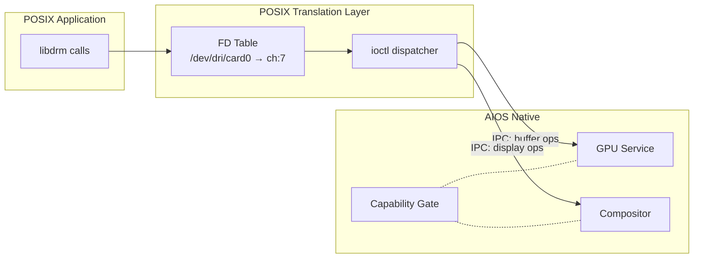
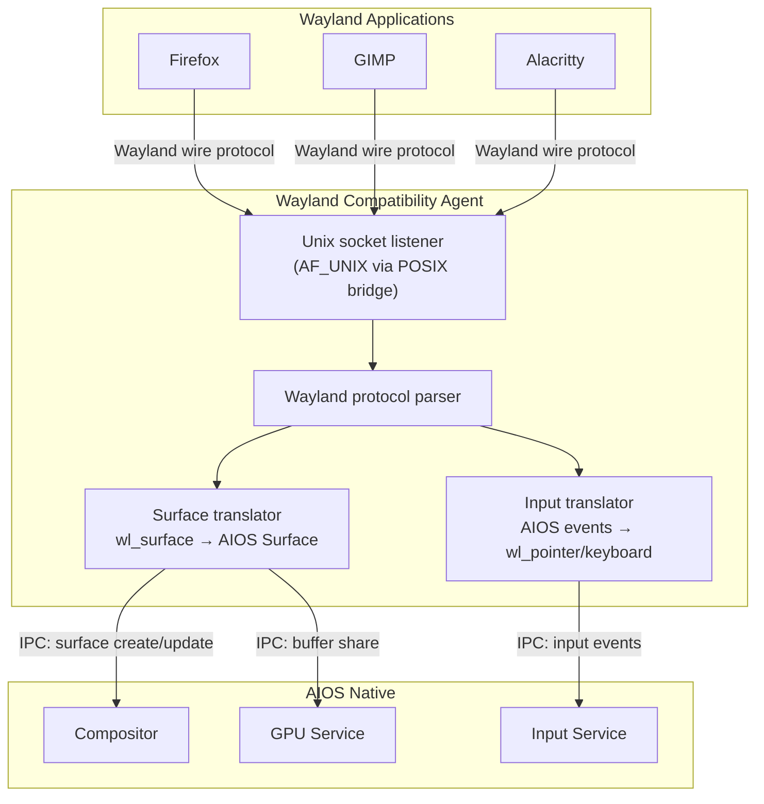

# AIOS GPU Integration, AI & Future Directions

Part of: [gpu.md](../gpu.md) — GPU & Display Architecture
**Related:** [drivers.md](./drivers.md) — GPU drivers, [display.md](./display.md) — Display controller, [rendering.md](./rendering.md) — Rendering pipeline, [security.md](./security.md) — GPU security

Cross-references: [posix.md](../posix.md) — POSIX compatibility layer, [airs.md](../../intelligence/airs.md) — AI Runtime Service

-----

## 16. POSIX Compatibility

The AIOS GPU subsystem provides POSIX-compatible interfaces through the subsystem framework's POSIX bridge ([subsystem-framework.md](../subsystem-framework.md) §8). POSIX graphics access follows the same pattern as all other subsystems: a translation layer in userspace converts POSIX system calls into AIOS native IPC messages, with capability enforcement at every boundary. The GPU subsystem never exposes raw hardware access through the POSIX layer — every operation is mediated by the GPU Service.

-----

### 16.1 DRM/KMS Interface Mapping

Linux applications expect the DRM (Direct Rendering Manager) and KMS (Kernel Mode Setting) interface for GPU and display access. AIOS maps these interfaces to native GPU Service IPC channels, with each DRM concept translating to a capability-protected AIOS resource.

| POSIX Interface | AIOS Equivalent | Capability Required |
|---|---|---|
| `/dev/dri/card0` | GPU Service IPC channel | `GpuRender` |
| `/dev/dri/renderD128` | GPU compute-only access (no display output) | `GpuCompute` |
| `/dev/fb0` | Legacy framebuffer: linear buffer in agent address space | `GpuRender` (attenuated) |
| `drmModeGetResources` | Query `DisplayOutput` list via GPU Service IPC | `GpuDisplay` |
| `drmModeAtomicCommit` | Atomic display state commit via compositor | `GpuDisplay` |
| `GEM_CREATE` / `GEM_CLOSE` | GPU buffer allocate/free via capability-based IPC | `GpuRender` |
| `PRIME_HANDLE_TO_FD` | Capability delegation (share buffer with another process) | `GpuRender` + delegation rights |
| `drmModeSetCrtc` | Legacy modesetting via atomic commit path | `GpuDisplay` |
| `drmModePageFlip` | Page flip request via compositor | `GpuDisplay` |

The translation layer opens an IPC channel to the GPU Service on behalf of the POSIX application. Each `open("/dev/dri/card0")` call creates a new session with its own capability scope. Buffer handles (GEM names) are local to each session and cannot be guessed or forged by other processes — they map to capability-protected shared memory regions internally.



-----

### 16.2 Framebuffer Device (`/dev/fb0`)

The legacy framebuffer interface provides the simplest possible graphics access for applications that do not use DRM/KMS. The POSIX bridge maps `/dev/fb0` to a linear GPU buffer in the requesting agent's address space.

**Operation:** Application opens `/dev/fb0` — translation layer requests a linear buffer from GPU Service. GPU Service allocates a shared memory region with attenuated `GpuRender` capability (no display control). The buffer is mapped into the application's address space. Application writes pixels directly via `write()` or `mmap()`. Compositor renders this buffer as a surface — the application has no direct display access.

**Screen information structures:**

```rust
/// Equivalent of Linux fb_var_screeninfo.
/// Populated from GPU Service display query.
pub struct FbVarScreenInfo {
    pub xres: u32,              // Visible horizontal resolution
    pub yres: u32,              // Visible vertical resolution
    pub xres_virtual: u32,      // Virtual horizontal resolution (for scrolling)
    pub yres_virtual: u32,      // Virtual vertical resolution (for double buffering)
    pub xoffset: u32,           // Offset from virtual to visible (horizontal)
    pub yoffset: u32,           // Offset from virtual to visible (vertical)
    pub bits_per_pixel: u32,    // Bits per pixel (32 for BGRA8888)
    pub red: FbBitField,        // Red channel: offset=16, length=8
    pub green: FbBitField,      // Green channel: offset=8, length=8
    pub blue: FbBitField,       // Blue channel: offset=0, length=8
    pub transp: FbBitField,     // Alpha channel: offset=24, length=8
    pub pixclock: u32,          // Pixel clock in picoseconds
    pub hsync_len: u32,         // Horizontal sync pulse width
    pub vsync_len: u32,         // Vertical sync pulse width
}

/// Equivalent of Linux fb_fix_screeninfo.
/// Fixed properties of the framebuffer device.
pub struct FbFixScreenInfo {
    pub id: [u8; 16],           // "AIOS FB" identification string
    pub smem_start: usize,      // Start of framebuffer memory (mmap base)
    pub smem_len: u32,          // Length of framebuffer memory
    pub line_length: u32,       // Bytes per scanline (stride)
    pub visual: u32,            // FB_VISUAL_TRUECOLOR
    pub type_: u32,             // FB_TYPE_PACKED_PIXELS
    pub accel: u32,             // FB_ACCEL_NONE (software rendering)
}

/// Bit field descriptor for color channels.
pub struct FbBitField {
    pub offset: u32,
    pub length: u32,
    pub msb_right: u32,
}
```

**Double buffering:** Applications that set `yres_virtual = 2 * yres` can use `FBIOPAN_DISPLAY` to flip between front and back buffers. The translation layer converts this to a page flip request via the compositor.

**Performance characteristics:** The framebuffer interface is adequate for terminal emulators, simple 2D applications, and boot splash screens. It is not suitable for high-performance rendering — applications that need GPU acceleration should use the DRM/KMS interface or, ideally, AIOS native IPC.

-----

### 16.3 DRM ioctl Translation

The POSIX bridge translates DRM ioctl calls to GPU Service IPC messages. Each ioctl maps to one or more IPC transactions, with the translation layer maintaining session state (open buffers, pending page flips, active CRTCs) on behalf of the application.

**Display resource queries:**

| DRM ioctl | IPC Message | Response |
|---|---|---|
| `DRM_IOCTL_MODE_GETRESOURCES` | `GpuMsg::QueryDisplayOutputs` | List of connector IDs, CRTC IDs, encoder IDs |
| `DRM_IOCTL_MODE_GETCONNECTOR` | `GpuMsg::QueryConnector { id }` | Connector status, supported modes, EDID data |
| `DRM_IOCTL_MODE_GETCRTC` | `GpuMsg::QueryScanoutEngine { id }` | Current mode, active plane bindings, gamma state |
| `DRM_IOCTL_MODE_GETENCODER` | `GpuMsg::QueryEncoder { id }` | Encoder type, associated CRTC/connector |

**Display state changes:**

| DRM ioctl | IPC Message | Capability |
|---|---|---|
| `DRM_IOCTL_MODE_SETCRTC` | `GpuMsg::AtomicDisplayCommit { ... }` | `GpuDisplay` |
| `DRM_IOCTL_MODE_PAGE_FLIP` | `GpuMsg::PageFlip { crtc, buffer }` | `GpuDisplay` |
| `DRM_IOCTL_MODE_SETGAMMA` | `GpuMsg::SetGamma { crtc, table }` | `GpuDisplay` |
| `DRM_IOCTL_MODE_ATOMIC` | `GpuMsg::AtomicDisplayCommit { ... }` | `GpuDisplay` |

**Buffer management:**

| DRM ioctl | IPC Message | Capability |
|---|---|---|
| `DRM_IOCTL_GEM_CREATE` | `GpuMsg::AllocateBuffer { size, flags }` | `GpuRender` |
| `DRM_IOCTL_GEM_CLOSE` | `GpuMsg::FreeBuffer { handle }` | `GpuRender` |
| `DRM_IOCTL_GEM_MMAP` | Shared memory map via `SharedMemoryMap` syscall | `GpuRender` |
| `DRM_IOCTL_PRIME_HANDLE_TO_FD` | Capability delegation to target process | `GpuRender` + delegation |
| `DRM_IOCTL_PRIME_FD_TO_HANDLE` | Accept delegated buffer capability | (received capability) |
| `DRM_IOCTL_GEM_FLINK` | Not supported (GEM names are insecure) | -- |

**Unsupported ioctls:** `DRM_IOCTL_GEM_FLINK` and `DRM_IOCTL_GEM_OPEN` (global GEM names) are rejected with `ENOSYS`. These interfaces allow any process to access a buffer by guessing a 32-bit integer — fundamentally incompatible with capability-based security. Applications must use PRIME (file descriptor passing) for buffer sharing, which maps cleanly to capability delegation.

```rust
/// DRM ioctl translation entry point.
/// Called by the POSIX bridge when an ioctl targets a /dev/dri/* fd.
pub fn translate_drm_ioctl(
    session: &mut DrmSession,
    request: u32,
    arg: *mut u8,
) -> Result<i32, PosixError> {
    match request {
        DRM_IOCTL_MODE_GETRESOURCES => {
            let outputs = session.gpu_channel.call(GpuMsg::QueryDisplayOutputs)?;
            // Marshal response into drm_mode_card_res structure at arg
            marshal_card_resources(arg, &outputs)
        }
        DRM_IOCTL_GEM_CREATE => {
            let params = unmarshal_gem_create(arg)?;
            let handle = session.gpu_channel.call(
                GpuMsg::AllocateBuffer {
                    size: params.size,
                    flags: BufferFlags::LINEAR,
                }
            )?;
            marshal_gem_create_response(arg, handle)
        }
        DRM_IOCTL_GEM_FLINK | DRM_IOCTL_GEM_OPEN => {
            Err(PosixError::ENOSYS) // Global names rejected for security
        }
        _ => Err(PosixError::EINVAL),
    }
}
```

-----

### 16.4 Wayland Compatibility (Phase 37)

A dedicated Wayland compatibility agent translates the Wayland wire protocol to AIOS native surface IPC. This enables unmodified Linux Wayland applications to run on AIOS with zero source modifications.

**Architecture:**



**Protocol translation:**

| Wayland Protocol | AIOS Native Operation |
|---|---|
| `wl_compositor.create_surface` | Create AIOS surface via compositor IPC |
| `wl_surface.attach` + `wl_surface.commit` | Share buffer capability + surface update IPC |
| `wl_shm.create_pool` | Allocate shared memory region via GPU Service |
| `wl_buffer.destroy` | Release buffer capability |
| `xdg_surface.set_title` | Set surface metadata (name) |
| `xdg_toplevel.set_app_id` | Set agent identifier for compositor |
| `wl_seat.pointer` / `wl_seat.keyboard` | Subscribe to input events via AIOS input service |
| `zwp_linux_dmabuf_v1` | Direct GPU buffer sharing via capability delegation |

**Socket management:** Wayland clients connect via `$XDG_RUNTIME_DIR/wayland-0`, a Unix domain socket provided by the POSIX bridge's AF_UNIX implementation ([posix.md](../posix.md) §8). Each client connection gets its own capability scope — buffer handles from one client cannot be accessed by another.

**Buffer sharing optimization:** When the Wayland client uses `zwp_linux_dmabuf_v1` (DMA-BUF), the agent avoids any copies — the GPU buffer is shared directly as a capability with the compositor. For `wl_shm` clients (CPU rendering), the agent copies the shared memory buffer into a GPU buffer once per frame.

**Input delivery:** The agent subscribes to AIOS input events for its surfaces and translates them back into Wayland event format (`wl_pointer.motion`, `wl_keyboard.key`, etc.). Focus management follows the compositor's focus policy — the Wayland agent does not maintain its own focus state.

-----

### 16.5 X11 Compatibility

X11 compatibility is provided by running XWayland under the Wayland compatibility agent. This creates a double translation path: X11 protocol to Wayland protocol to AIOS native IPC.

```text
X11 Application → XWayland → Wayland Agent → AIOS Compositor
                  (X11→Wl)   (Wl→AIOS)       (native)
```

**Performance considerations:** The double translation adds measurable overhead:

- **Latency:** One additional IPC hop (XWayland to Wayland agent) adds approximately 50-100 us per frame.
- **Buffer copies:** XWayland uses `wl_shm` for most X11 clients, requiring a CPU-to-GPU copy. X11 clients using GLX or Vulkan through XWayland can use DMA-BUF, avoiding the copy.
- **Input:** X11's synchronous grab model requires additional coordination with the compositor's focus policy.

**Recommendation:** X11 compatibility exists for legacy application support. New applications should target Wayland (for POSIX compatibility) or AIOS native IPC (for full performance and capability integration).

-----

## 17. AI-Native Display

This section describes AI-driven optimizations for the GPU and display subsystem. Each feature is clearly categorized as either **AIRS-dependent** (requires the AI Runtime Service for semantic understanding) or **kernel-internal ML** (uses frozen statistical models with no external dependency). When AIRS is unavailable, every AIRS-dependent feature falls back to a simpler heuristic or is disabled entirely. The GPU Service never blocks on AIRS; all queries are asynchronous with bounded timeout.

-----

### 17.1 AIRS-Driven Display Optimization

The AI Runtime Service ([airs.md](../../intelligence/airs.md)) can optimize display behavior based on user context and workload analysis. These features require semantic understanding that cannot be reduced to simple statistical models.

#### 17.1.1 Content-Aware Composition

AIRS detects the content type being rendered on each surface and instructs the compositor to adjust its composition strategy accordingly.

```rust
/// AIRS content classification for composition strategy.
pub enum ContentStrategy {
    /// Video content detected — bypass composition, direct scanout to display plane.
    /// Eliminates one GPU copy and reduces latency by one frame.
    DirectScanout,

    /// Text-heavy content — maximize clarity.
    /// Use integer scaling, disable sub-pixel anti-aliasing artifacts,
    /// ensure pixel-perfect glyph alignment.
    TextOptimized,

    /// Interactive UI (buttons, forms, animations) — standard composition.
    /// Full effects, normal frame rate.
    StandardComposition,

    /// Idle or static content — reduce refresh rate.
    /// Drop to minimum VRR rate, cache surface as texture.
    PowerSave,
}
```

**Decision flow:** AIRS classifies each surface asynchronously. The compositor uses the most recent classification when scheduling the next frame. If AIRS has not yet classified a surface, the compositor defaults to `StandardComposition`.

**Direct scanout criteria:** A surface qualifies for direct scanout only when it covers the full display output, has no overlapping surfaces, uses a format compatible with the display plane hardware, and AIRS classifies it as video content. If any condition is not met, the surface goes through normal composition.

#### 17.1.2 Attention-Aware Rendering

AIRS tracks user focus through the Attention Manager ([attention.md](../../intelligence/attention.md)) and communicates focus state to the GPU Service. The GPU Service adjusts per-surface rendering quality based on attention state.

| Attention State | Resolution | Frame Rate | Effects |
|---|---|---|---|
| Focused (active input, gaze) | Full | Full (60 fps) | All enabled |
| Peripheral (visible, no input) | Reduced (75%) | Reduced (15 fps) | Shadows/blur disabled |
| Background (occluded) | Cached texture | 0 fps (re-render on damage) | None |

**Power savings:** On a typical multi-window workload (3-5 visible surfaces), reducing peripheral surfaces from full to 15 fps saves approximately 30-40% GPU power. Background surfaces cost zero GPU time until they receive new damage.

**Transition smoothing:** When the user shifts attention to a peripheral surface, the GPU Service ramps rendering quality from reduced to full over 200 ms (approximately 12 frames at 60 fps) to avoid visual pop-in.

**Fallback without AIRS:** The focused surface (keyboard input target) receives full rendering. All other visible surfaces receive the peripheral treatment (15 fps, no effects). No attention prediction is performed.

#### 17.1.3 Predictive Surface Preloading

AIRS predicts which agent the user will interact with next, based on task workflow analysis from the Context Engine ([context-engine.md](../../intelligence/context-engine.md)). The GPU Service pre-renders the predicted surface at full quality before the user switches to it.

**Prediction confidence threshold:** Pre-rendering activates only when AIRS prediction confidence exceeds 0.85. Below this threshold, the prediction is discarded to avoid wasting GPU resources on incorrect guesses.

**Cost:** One additional surface rendered at full quality per frame. On hardware with limited GPU bandwidth (Raspberry Pi 4), this feature is disabled to avoid impacting the active surface's frame rate.

**Fallback without AIRS:** No predictive preloading. The compositor uses the Markov-chain window switching prediction from the compositor's kernel-internal ML (compositor/ai-native.md §13.4) as a simpler alternative.

-----

### 17.2 Kernel-Internal ML (No AIRS Dependency)

These optimizations use small frozen models — decision trees, lookup tables, and exponentially weighted moving averages — that run entirely within the GPU Service or compositor process. They require no external inference engine, no GPU tensor acceleration, and no AIRS service. They work on every device from the first frame.

#### 17.2.1 Frame Time Prediction

The GPU Service tracks render times per surface across recent frames and predicts the next frame's render cost. If the predicted cost exceeds the frame budget (16.67 ms at 60 Hz), the compositor proactively reduces quality before starting the frame.

```text
Model: Exponentially weighted moving average (EWMA)
    predicted_ms = alpha * last_frame_ms + (1 - alpha) * predicted_ms
    alpha = 0.3 (responsive to recent changes)

Proactive quality reduction:
    predicted_ms < 12 ms   → full quality
    predicted_ms < 16 ms   → disable blur effects
    predicted_ms < 20 ms   → disable blur + shadows, reduce peripheral fps
    predicted_ms >= 20 ms  → drop to 30 fps target, minimal effects

Model size: 8 bytes per surface (one f64 EWMA state)
Inference cost: ~5 ns (one multiply-add)
```

This prevents the stuttering that occurs when the compositor reactively drops frames mid-render. By predicting the overrun before it happens, the quality reduction is invisible to the user — a smooth 30 fps is always preferable to an uneven mix of 60 fps and dropped frames.

#### 17.2.2 GPU DVFS Prediction

The GPU Service monitors GPU utilization over a sliding window and predicts the next interval's utilization. It pre-adjusts GPU frequency before the workload arrives, saving power compared to reactive DVFS.

```text
Decision tree for GPU DVFS (frozen, trained offline):

                     ┌─ utilization > 80%?
                     │
              ┌──────┤
              │ YES  │           NO
              │      └──────────────┐
              │                     │
    ┌─────────▼─────────┐   ┌──────▼──────────┐
    │ trend rising?     │   │ utilization < 20%?│
    │ (gradient > 0)    │   │                   │
    └──┬────────────┬───┘   └──┬────────────┬──┘
       │ YES        │ NO       │ YES        │ NO
       │            │          │            │
       ▼            ▼          ▼            ▼
    RAISE to      RAISE to   LOWER to     MAINTAIN
    100% max      75% max    25% max      current

Input features (sampled every 16 ms / once per frame):
    - GPU utilization (0-100%, from GPU performance counters)
    - Utilization gradient (rising/falling/stable over last 4 samples)
    - Active surface count
    - Effects enabled flag

Model size: ~512 bytes (binary decision tree, <20 nodes)
Inference cost: ~50 ns (branch traversal, no floating point)
```

The decision tree is trained offline on GPU utilization traces from typical desktop workloads (text editing, web browsing, video playback, window management) and shipped as part of the OS image. It runs within the GPU Service with zero additional memory allocation.

**Frequency ramp-up latency:** Pre-adjusting frequency one frame ahead eliminates the 2-3 frame latency of reactive DVFS. The user sees consistent frame timing even during workload transitions (e.g., starting a video or opening a GPU-accelerated application).

#### 17.2.3 Display Refresh Rate Selection

The GPU Service tracks frame delivery rate per surface over a sliding window. If all surfaces consistently deliver frames at a rate below the display's current refresh rate, the display drops to a lower rate (on VRR-capable panels).

```text
Refresh rate selection logic:

    max_surface_fps = max(surface_delivery_rate for all visible surfaces)

    if max_surface_fps <= 24  → target 24 Hz (film content)
    if max_surface_fps <= 30  → target 30 Hz (standard video)
    if max_surface_fps <= 48  → target 48 Hz (2x film, smooth scrolling)
    if max_surface_fps <= 60  → target 60 Hz (interactive content)
    else                      → target max display rate

    Hysteresis: hold current rate for 500 ms after last rate change
    to prevent oscillation during workload transitions.
```

**Power savings:** Dropping from 60 Hz to 30 Hz when viewing static content or video reduces display panel power consumption by approximately 15-25% on OLED panels and 5-10% on LCD panels (backlight remains constant on LCD).

#### 17.2.4 Thermal Prediction

The GPU Service monitors GPU temperature trend and predicts when thermal throttling will trigger. It pre-emptively reduces GPU frequency to avoid abrupt throttle events.

```text
Thermal model:

    temp_gradient = (current_temp - temp_5s_ago) / 5.0  // degrees per second
    predicted_temp_10s = current_temp + temp_gradient * 10.0

    if predicted_temp_10s > throttle_threshold:
        reduce GPU frequency by one step NOW
        (smooth performance reduction over 10s vs abrupt throttle)

    if current_temp > (throttle_threshold - 5°C):
        cap GPU frequency at 75% max
        (thermal headroom preservation)
```

**User experience:** Abrupt thermal throttling causes visible frame rate drops — the user sees smooth 60 fps, then suddenly 30 fps or lower. Predictive throttling gradually reduces frequency, producing a smooth transition from 60 fps to 45 fps to 30 fps that the user perceives as consistent behavior rather than a sudden failure.

-----

### 17.3 AI-Driven Accessibility

AIRS enhances display accessibility by combining semantic understanding of rendered content with user preference data from the Preferences service ([preferences.md](../../intelligence/preferences.md)).

#### 17.3.1 Semantic Zoom

Standard zoom scales the entire display uniformly, which often breaks UI layouts — buttons overlap, text wraps incorrectly, and interactive elements become misaligned. AIRS-driven semantic zoom identifies UI element boundaries and provides intelligent zoom that respects layout constraints.

```text
AIRS analysis per surface:
    - Identify UI element boundaries (text blocks, images, controls)
    - Determine element hierarchy (header > paragraph > caption)
    - Classify element importance (primary content vs chrome)

Semantic zoom behavior:
    - Primary content scales proportionally
    - Navigation chrome remains at fixed size
    - Images scale with aspect ratio preserved
    - Interactive elements maintain minimum touch target size (48x48 dp)
    - Line breaks reflow rather than clip
```

**Fallback without AIRS:** Standard uniform zoom. The compositor scales the entire surface by the requested factor.

#### 17.3.2 Content Description

AIRS generates alt-text descriptions for rendered images by analyzing surface content. The accessibility layer (experience/accessibility.md) exposes these descriptions to screen readers and assistive technology.

**Pipeline:** GPU Service captures surface content at reduced resolution (256x256) and sends to AIRS for vision-language model analysis. AIRS returns a natural language description. The description is cached and invalidated only when the surface content changes significantly (pixel delta exceeds threshold).

**Latency:** Description generation is fully asynchronous. The screen reader receives the description when available (typically 200-500 ms after surface update). The surface is navigable immediately — the description arrives as supplementary information.

**Fallback without AIRS:** No automatic content description. Applications must provide alt-text through the accessibility API.

#### 17.3.3 Contrast Adaptation

AIRS adjusts surface contrast based on ambient light sensor data (when available) and user preferences. The adjustment is applied at the compositor level — individual applications do not need to implement contrast adaptation.

```text
Contrast adjustment factors:
    - Ambient light level (lux from sensor)
    - User contrast preference (from Preferences service)
    - Content type (text benefits more from contrast boost than images)
    - Time of day (circadian-aware adjustment)

Adjustment method:
    - GPU shader applies per-surface contrast curve
    - Text surfaces: boost contrast by up to 30% in bright ambient light
    - Image surfaces: apply tone mapping to preserve detail
    - Dark mode surfaces: reduce brightness in low ambient light
```

**Fallback without AIRS:** Fixed contrast based on user-selected theme (light/dark). No adaptive adjustment.

#### 17.3.4 Reading Assistance

AIRS provides reading assistance features for text-heavy surfaces:

- **Reading position tracking:** AIRS identifies the text region the user is reading (from gaze or scroll position) and highlights it with a subtle background color.
- **Dyslexia-friendly rendering:** When enabled in preferences, AIRS instructs the font renderer to use OpenDyslexic or a similar typeface, increase letter spacing, and reduce justified text alignment.
- **Text simplification overlay:** AIRS can provide a simplified version of complex text as a tooltip or sidebar, accessible via keyboard shortcut.

**Fallback without AIRS:** No reading position tracking or text simplification. Dyslexia-friendly font can be selected manually in display settings.

-----

## 18. Future Directions

Research-informed improvements targeted at future phases. These features are not scheduled for near-term implementation but inform architectural decisions in the current GPU subsystem design.

-----

### 18.1 GPU Compute for AI Inference

AIOS agents can offload ML inference to GPU via compute shaders (wgpu compute pipeline). The GPU Service manages a compute queue alongside the render queue, with scheduling priority: render > inference (display responsiveness always takes precedence over inference throughput).

```text
GPU compute pipeline:

    Agent → IPC: SubmitCompute { shader, buffers, dispatch } → GPU Service
    GPU Service → wgpu: encode compute pass → submit to GPU queue
    GPU → completion fence → GPU Service → IPC: ComputeComplete { results } → Agent

Scheduling:
    Render commands: HIGH priority queue
    Inference commands: LOW priority queue
    GPU hardware preempts inference for render when deadline approaches
```

**Integration with AIRS:** AIRS uses GPU compute for local inference when model size fits in GPU memory and inference latency benefits from GPU parallelism. The AIRS Runtime Advisor ([airs.md](../../intelligence/airs.md)) routes inference requests between CPU and GPU based on model characteristics, current GPU utilization, and thermal state. The routing is transparent to agents — they submit inference requests to AIRS, which selects the optimal execution target.

**Capability:** `GpuCompute` token gates access to the compute queue. Agents without this capability cannot submit compute work. The token can be attenuated with resource limits (maximum compute dispatch size, memory budget).

-----

### 18.2 Neural Super Resolution

DLSS/FSR-style neural upscaling integrated into the compositor. Applications render at a lower internal resolution (e.g., 720p), and a small neural network upscales to the display's native resolution (e.g., 1080p or 4K) with higher visual quality than bilinear interpolation.

```text
Pipeline:
    Agent renders at reduced resolution (e.g., 1280x720)
    ↓
    Compositor receives surface buffer
    ↓
    Neural upscale shader (wgpu compute pass):
        Input: low-res frame + motion vectors + previous frame
        Output: high-res frame (e.g., 1920x1080)
    ↓
    Display scanout at native resolution

Model requirements:
    - Inference time < 4 ms per frame (to fit within 16.67 ms budget)
    - Model size < 8 MB (fits in GPU memory alongside rendering)
    - Quality: PSNR > 30 dB vs native resolution rendering

Candidates:
    - AMD FSR 2.0 (open source, temporal upscaling)
    - Custom lightweight model trained on desktop UI content
```

**When beneficial:** Primarily on high-DPI displays connected to low-power GPUs (e.g., 4K monitor on Raspberry Pi 5). Rendering at 1080p and upscaling to 4K is substantially cheaper than native 4K rendering, and neural upscaling produces sharper results than bilinear scaling.

**When NOT beneficial:** On displays where the GPU can sustain native resolution rendering at full frame rate. The neural upscale shader adds latency and GPU compute cost that is wasted if native rendering is already within budget.

-----

### 18.3 GPU TEEs and Confidential Computing

Hardware-encrypted GPU memory for sensitive AI inference workloads. On platforms supporting ARM Confidential Compute Architecture (CCA), GPU memory regions can be placed within a CCA realm, preventing even the kernel from reading inference data.

```text
Confidential GPU memory flow:

    Agent with GpuConfidential capability
    ↓
    GPU Service allocates encrypted VRAM region
    ↓
    SMMU configured with realm-restricted stream ID
    ↓
    GPU executes inference within realm boundary
    ↓
    Results returned to agent via encrypted IPC channel
    ↓
    VRAM region zeroized on release

Capability: GpuConfidential
    - Gates access to encrypted GPU memory regions
    - Cannot be delegated (non-transferable)
    - Audit trail: every allocation and deallocation logged
```

**Threat model:** Protects inference data (model weights, activations, results) from:

- Compromised kernel or GPU driver reading VRAM
- Cold boot attacks on GPU memory
- Side-channel attacks via GPU performance counters (counters disabled within realm)

**Hardware requirements:** ARM CCA with GPU-aware realm management. Not available on current Raspberry Pi hardware. Relevant for future ARM server and workstation platforms.

-----

### 18.4 GPU Live Migration

Save and restore GPU state for agent suspend/resume and multi-device mobility. When an agent migrates between devices, its GPU context (buffers, command queue state, shader programs) must be checkpointed and restored on the target device.

```text
Checkpoint sequence:
    1. Drain GPU command queue for agent (wait for pending work to complete)
    2. Fence all agent GPU buffers (prevent new submissions)
    3. Read back VRAM contents for agent's buffers
    4. Serialize buffer metadata (format, size, usage flags)
    5. Serialize shader program binaries (SPIR-V)
    6. Package into migration blob

Restore sequence:
    1. Allocate equivalent GPU buffers on target device
    2. Upload VRAM contents from migration blob
    3. Recompile shader programs for target GPU architecture
    4. Reconstruct command encoder state
    5. Resume agent with new GPU handles

Integration:
    - Semantic state preservation (boot/suspend.md §15)
    - AIOS peer protocol (networking.md) for cross-device transfer
    - Capability tokens recreated on target device by its capability manager
```

**Challenges:**

- GPU memory can be large (hundreds of MB for AI model buffers). Migration must be incremental — transfer only dirty pages, not the entire VRAM.
- Shader programs compiled for one GPU architecture (Mali, VC4, VirtIO) must be recompiled for the target. SPIR-V intermediate representation enables cross-architecture portability.
- GPU command queue state is hardware-specific and may not be fully serializable. The checkpoint drains the queue rather than saving mid-execution state.

-----

### 18.5 Formal Verification

Rust's ownership model prevents the top classes of GPU driver bugs: use-after-free, double-free, buffer overflow, data races on GPU resources. The type system statically guarantees that every GPU buffer has exactly one owner, every shared buffer is accessed through capability-checked references, and no buffer is used after being freed.

**Future verification targets:**

| Property | Verification Approach | Scope |
|---|---|---|
| GPU memory isolation | Prove SMMU configuration correctness (stream ID → page table mapping) | GPU Security (security.md §13) |
| Buffer lifecycle | Prove no use-after-free in buffer manager | GPU Service |
| Capability gate soundness | Prove no capability bypass in DRM ioctl translation | POSIX bridge |
| Display state consistency | Prove atomic commit either fully applies or fully rolls back | Display controller |

**Research basis:** Komodo (SOSP 2017) demonstrated formal verification of a secure monitor on ARM, proving isolation properties for TrustZone. The same approach — modeling hardware configuration as a state machine and proving invariants over transitions — applies to SMMU configuration for GPU isolation.

**Rust-specific advantage:** Prusti, Creusot, and Kani provide Rust-native verification tooling. GPU buffer lifetime invariants expressed as Rust types can be verified without modeling the entire system — the type checker already enforces the core safety properties.

-----

### 18.6 Vulkan Direct Access

For performance-critical agents (games, GPU compute, professional rendering), the GPU Service can provide direct Vulkan device access that bypasses the composition layer.

```text
Direct access model:

    Agent receives:
        - Vulkan VkDevice handle (restricted to agent's SMMU context)
        - Direct display output access (exclusive fullscreen)
        - GPU memory allocation within agent's VRAM budget

    GPU Service retains:
        - SMMU configuration (agent cannot access other agents' VRAM)
        - Display output ownership (agent must request and release)
        - Power management (GPU DVFS still controlled by GPU Service)
        - Audit trail (all allocations and submissions logged)

    Capability: GpuDirectAccess
        - Strictly controlled, requires elevated trust level
        - Automatically revoked when agent loses focus (compositor reclaims display)
```

**Security:** SMMU isolation ensures the agent's Vulkan device handle can only access memory within its assigned GPU address space. The agent cannot read or write other agents' GPU buffers, even with direct Vulkan access. This is the GPU equivalent of per-process page tables for CPU memory.

**Trade-off:** Direct Vulkan access bypasses the compositor's frame scheduling, power management heuristics, and quality-of-service policies. The agent is responsible for its own frame pacing and GPU utilization. The GPU Service can revoke direct access if the agent exceeds its thermal or power budget.

-----

### 18.7 Display-as-a-Service

Remote display protocol for multi-device AIOS deployments. An agent renders on one device and its display output is streamed to another device's compositor.

```text
Remote display flow:

    Device A (render):
        Agent renders surface → GPU Service composites
        ↓
        Capture composited frame at surface granularity
        ↓
        Encode frame (hardware H.264/H.265 if available, software fallback)
        ↓
        Stream via AIOS peer protocol (networking.md)

    Device B (display):
        Receive encoded frame stream
        ↓
        Decode to GPU buffer
        ↓
        Present as remote surface in local compositor
        ↓
        Display on local output

    Input path (reverse):
        Device B captures input events for remote surface
        ↓
        Forward via AIOS peer protocol to Device A
        ↓
        Device A delivers input to agent
```

**Capability model:** Device B presents a display capability over the network via the AIOS peer protocol. Device A's agent holds a `RemoteDisplay` capability that authorizes frame streaming to Device B. Both devices must mutually authenticate via the security model's credential system ([security/model.md](../../security/model.md)).

**Adaptive quality:** The encoder adjusts bitrate based on network bandwidth (measured by the Connection Manager). Low bandwidth: reduce resolution and frame rate. High bandwidth: lossless or near-lossless encoding. The quality adaptation uses the same kernel-internal ML approach as GPU DVFS prediction (§17.2.2) — no AIRS dependency.

-----

### 18.8 Research References

| Topic | Reference | Year | Relevant Section |
|---|---|---|---|
| GPU preemptive scheduling | Reef (OSDI) | 2022 | §18.1 |
| GPU cycle harvesting | PilotFish (SOSP) | 2023 | §18.1 |
| GPU isolation/TEE | Graviton (OSDI) | 2018 | §18.3 |
| GPU timing isolation | Telekine (NSDI) | 2020 | §18.3 |
| GPU API remoting | AvA (USENIX ATC) | 2020 | §18.7 |
| Rust microkernel drivers | RedLeaf (OSDI) | 2020 | §18.5 |
| ARM Mali CSF driver | Panthor (Linux DRM) | 2024 | §16.3 |
| Rust Wayland compositor | Smithay / COSMIC | 2023-2025 | §16.4 |
| GPU 2D rendering | Vello (Google Fonts) | 2023-2025 | §17.1.1 |
| Verified secure monitor | Komodo (SOSP) | 2017 | §18.5 |
| Principled GPU sharing | LithOS (SOSP) | 2025 | §17.2.2 |
| GPU task preemption | XSched (OSDI) | 2025 | §18.1 |
| Neural super resolution | AMD FSR 2.0 (open source) | 2022 | §18.2 |
| ARM Confidential Compute | ARM CCA specification | 2021-2024 | §18.3 |
