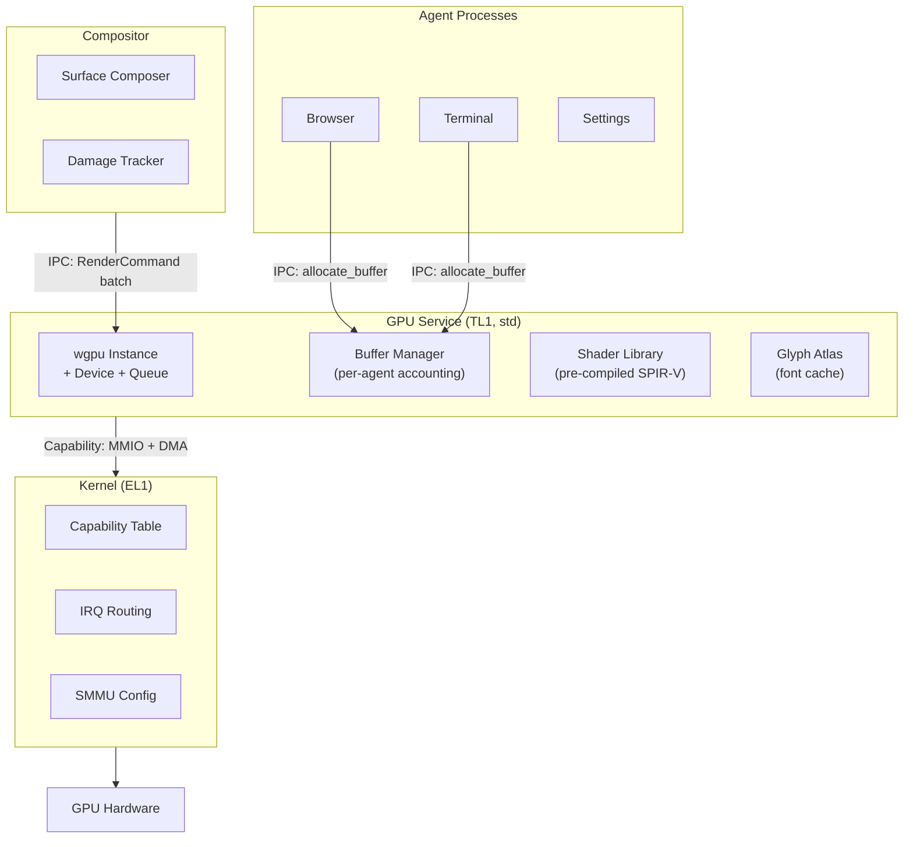
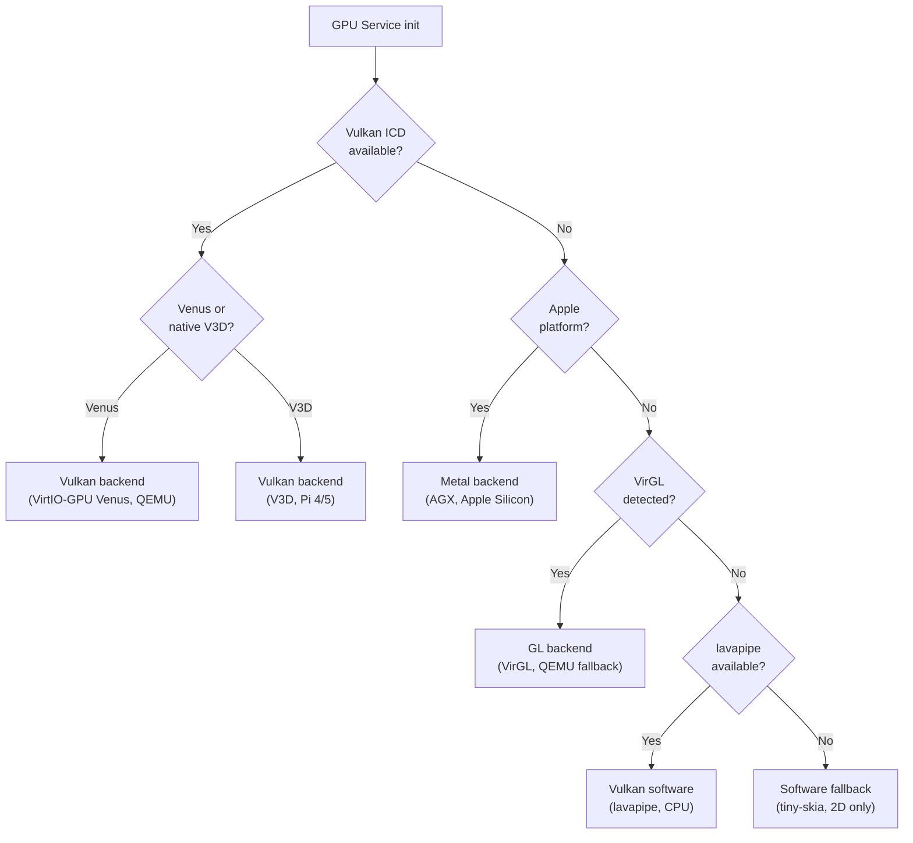
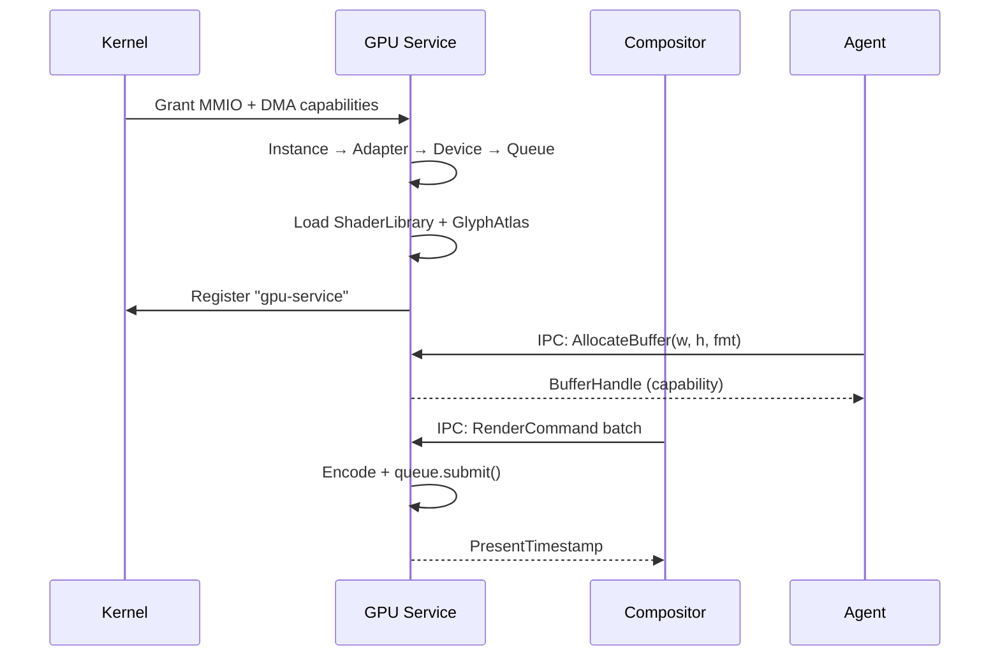
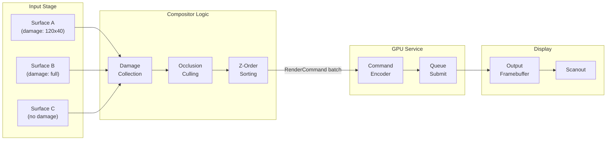
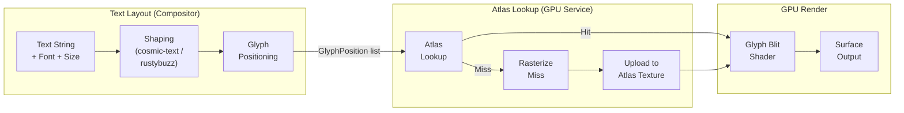

# AIOS Rendering Pipeline & GPU Memory

Part of: [gpu.md](../gpu.md) — GPU & Display Architecture
**Related:** [drivers.md](./drivers.md) — GPU drivers, [display.md](./display.md) — Display controller, [security.md](./security.md) — GPU security

-----

## 9. wgpu Integration

The GPU Service is the central process responsible for all GPU-accelerated rendering in AIOS. It runs wgpu in a privileged userspace process with `std` + `alloc` support, communicating with the Compositor and agents via IPC. The GPU Service holds capability tokens for GPU MMIO regions and is the only process that submits work to the GPU hardware.

### 9.1 GPU Service Architecture

The GPU Service runs as a privileged userspace process (TL1) — deliberately **not** inside the kernel. wgpu depends on `std` for threading, file I/O, and synchronization primitives that are unavailable in AIOS's `no_std` kernel. Keeping GPU command validation and shader compilation in userspace means a crashing GPU driver cannot bring down the kernel.

```rust
/// The GPU Service process. Holds the wgpu runtime and all GPU state.
/// Only one instance exists system-wide.
pub struct GpuService {
    /// wgpu instance — entry point for adapter/device discovery.
    instance: wgpu::Instance,
    /// Selected GPU adapter (physical device).
    adapter: wgpu::Adapter,
    /// Logical device — command submission and resource creation.
    device: wgpu::Device,
    /// Command queue — schedules GPU work.
    queue: wgpu::Queue,
    /// IPC channel for receiving compositor commands.
    compositor_channel: ChannelId,
    /// Per-agent GPU memory accounting.
    memory_accounts: BTreeMap<ProcessId, GpuMemoryAccount>,
    /// Pre-compiled shader library.
    shaders: ShaderLibrary,
    /// Glyph atlas for text rendering.
    glyph_atlas: GlyphAtlas,
}
```

**Capability model.** The kernel grants the GPU Service two capability tokens at startup: a **GPU MMIO capability** (maps the GPU's MMIO register region into the service's address space) and a **DMA pool capability** (grants access to `Pool::Dma`, 64 MB on QEMU, for device-visible buffers). Agents never touch GPU hardware directly — the GPU Service mediates every operation via IPC and enforces per-agent memory limits.



### 9.2 wgpu Architecture Overview

wgpu provides three layers that the GPU Service builds on:

**wgpu-core** validates all GPU commands before they reach the driver. Every buffer access, texture bind, and draw call is checked for bounds, format compatibility, and resource state. Invalid commands are rejected with descriptive errors rather than causing undefined GPU behavior. This validation layer is the first line of defense against malicious or buggy agent rendering.

**wgpu-hal** provides hardware backend implementations. Each backend translates validated wgpu commands into GPU-specific operations:

| Backend | GPU | Transport | Use case |
| --- | --- | --- | --- |
| Vulkan | V3D (Pi 4/5), Venus (QEMU) | Vulkan ICD | Primary accelerated path |
| Metal | AGX (Apple Silicon) | Metal framework | Apple Silicon platforms |
| GL | VirGL (QEMU) | OpenGL ES 3.1 | Fallback for QEMU without Venus |
| Software | CPU (any) | None | Universal fallback |

**naga** is the shader compiler/translator within the wgpu ecosystem. It consumes shaders in WGSL, SPIR-V, GLSL, or HLSL and emits the target format required by each backend (SPIR-V for Vulkan, MSL for Metal, GLSL for GL). The GPU Service uses naga at build time to pre-compile all compositor shaders to SPIR-V, eliminating runtime shader compilation stutter.

**Command model.** wgpu follows the WebGPU command model: create a `CommandEncoder`, record draw/compute operations, finish to produce a `CommandBuffer`, and submit to the `Queue`. Multiple command buffers are batched into a single `queue.submit()` call for efficient GPU utilization.

### 9.3 Backend Selection

The GPU Service selects the most capable backend at startup by probing available hardware in priority order:



**Platform-specific backend mapping:**

| Platform | Primary | Fallback | Notes |
| --- | --- | --- | --- |
| QEMU (VirtIO-GPU Venus) | Vulkan | GL (VirGL) | Venus preferred; VirGL if host lacks Vulkan |
| QEMU (VirtIO-GPU 2D only) | Software (tiny-skia) | -- | No 3D acceleration available |
| Raspberry Pi 4 | Vulkan 1.0 (V3D 4.2) | Software | Mesa v3dv driver |
| Raspberry Pi 5 | Vulkan 1.2 (V3D 7.1) | Software | Mesa v3dv driver, compute shaders |
| Apple Silicon | Metal (AGX) | Software | Native Metal via Asahi driver |
| Headless / CI | Software (tiny-skia) | -- | No GPU hardware |

The software fallback guarantees AIOS can render on any platform. tiny-skia provides a subset of Skia's 2D rendering API on the CPU — surface composition, alpha blending, and basic effects. Compute-intensive effects (Gaussian blur, complex shaders) are disabled on the software path.

### 9.4 Render Context Lifecycle

The GPU Service creates the wgpu rendering context at startup and holds it for the lifetime of the process. The Compositor communicates with the GPU Service via batched IPC commands, minimizing round-trips.



**Error recovery.** GPU device loss (driver crash, hardware reset, power event) triggers full context recreation: `Instance` -> `Adapter` -> `Device` -> `Queue`. The GPU Service sends a `DeviceLost` event to the Compositor, which requests agents to re-render. Surface state (dimensions, format, capability handles) is preserved — only GPU-side resources need reconstruction. The display shows the last presented frame during the recovery window (50-200ms).

### 9.5 IPC Protocol Between Compositor and GPU Service

The Compositor submits rendering work to the GPU Service as batched command sequences. Each batch represents one compositor frame and is processed atomically — either all commands succeed or the entire batch is rejected.

```rust
/// Commands sent from Compositor to GPU Service via IPC.
pub enum RenderCommand {
    /// Composite surfaces back-to-front into the output framebuffer.
    ComposeSurfaces { surfaces: Vec<SurfaceCompositeOp>, output_damage: DamageRegion },
    /// Draw a solid-color rectangle (decorations, backgrounds).
    DrawRect { rect: Rect, color: Color, corner_radius: f32 },
    /// Render pre-positioned glyphs from the glyph atlas.
    DrawText { glyphs: Vec<GlyphPosition>, color: Color, atlas_id: AtlasId },
    /// Present composed frame (page flip / VSync).
    Present { output_id: OutputId },
}

/// A single surface composition operation.
pub struct SurfaceCompositeOp {
    pub buffer_handle: CapabilityHandle,  // Capability to surface's shared buffer
    pub damage: DamageRegion,             // Surface-local damaged region
    pub transform: Transform2D,           // Output-space 2D transform
    pub opacity: f32,                     // 0.0 transparent .. 1.0 opaque
    pub blend_mode: BlendMode,            // Porter-Duff blend mode
    pub src_rect: Option<Rect>,           // Source crop (viewporter)
}
```

**Batch efficiency.** The Compositor groups all render commands for a single frame into one IPC message, amortizing IPC overhead — 15 surfaces generate one round-trip, not 15.

**Buffer sharing protocol.** When a command references a `buffer_handle`, the GPU Service resolves the capability handle to the underlying shared memory region. The buffer's physical pages are already mapped into the GPU's address space (via SMMU or direct mapping). The GPU binds the buffer as a texture source without copying pixel data.

-----

## 10. Rendering Pipeline

### 10.1 Composition Pipeline

Surfaces arrive at the Compositor as capability-protected shared memory buffers. Each buffer contains pixel data rendered by an agent. The Compositor determines which surfaces are visible, collects damage regions, and submits a batched render command to the GPU Service for composition into the output framebuffer.



**Pipeline stages:**

1. **Damage collection.** The Compositor gathers damage regions from all surfaces that reported changes since the last frame. Surface C reports no damage and is excluded from GPU work unless it overlaps a damaged region of another surface.

2. **Occlusion culling.** The Compositor traverses the scene graph (see [compositor/rendering.md §5.2](../compositor/rendering.md)) in depth-first order. Opaque surfaces that fully cover regions behind them mark those regions as occluded. Occluded portions of lower-z surfaces are excluded from the render command batch, reducing GPU draw calls.

3. **Z-order sorting.** Remaining visible surfaces are ordered back-to-front for correct alpha blending. The Compositor emits a `ComposeSurfaces` command with surfaces in render order.

4. **GPU composition.** The GPU Service encodes composition as textured quad draws, one per visible surface region, blending into the output framebuffer using Porter-Duff blend modes.

5. **Effect application.** Visual effects (blur, shadow, rounded corners) are applied as post-processing passes using pre-compiled shaders. Effects are batched where possible.

6. **Present.** Page flip or buffer swap to the display controller, synchronized to VSync. The Compositor receives a `PresentTimestamp` confirming display timing.

### 10.2 Damage Tracking

Damage tracking minimizes GPU work by restricting composition to regions that actually changed. Each surface maintains its own damage region, and the Compositor unions damage across surfaces to determine the minimal area that must be redrawn.

**Per-surface damage reporting.** Each surface's shared buffer includes a metadata page — a single 4 KiB page at a fixed offset that both the agent and Compositor can access. The agent writes damage information into this page using atomic stores:

```rust
/// Damage metadata stored in the surface's shared metadata page.
/// Agents write this with atomic stores; Compositor reads with atomic loads.
/// Zero syscall overhead for damage reporting.
#[repr(C)]
pub struct SurfaceDamageMetadata {
    /// Dirty flags packed as an atomic word.
    /// Bit 0: any damage present (fast check).
    /// Bit 1: full-surface damage (skip rectangle check).
    /// Bits 2-31: reserved.
    pub flags: AtomicU32,
    /// Damaged rectangle (surface-local coordinates).
    /// Only valid when flags bit 0 is set and bit 1 is clear.
    pub x: AtomicU32,
    pub y: AtomicU32,
    pub width: AtomicU32,
    pub height: AtomicU32,
}
```

This design avoids IPC round-trips for damage reporting. The agent writes damage coordinates with `store(Release)` and sets the flags word. The Compositor reads with `load(Acquire)` during its frame collection pass. The atomic metadata page is part of the surface's capability-protected shared memory — no additional capability is needed.

**Damage union across surfaces.** The Compositor walks all surfaces per output, reads damage metadata, transforms rectangles into output coordinates, and unions them into a bounding region passed to the GPU Service. The GPU Service uses this as a scissor rect — undamaged pixels are not touched.

**Progressive refinement.** The initial implementation uses full-surface damage (bit 1 in flags). Per-rectangle damage tracking is added as an optimization once the pipeline is stable. The metadata page layout supports both modes without protocol changes.

### 10.3 Shader Compilation Strategy

All compositor shaders are compiled ahead-of-time. The GPU Service loads pre-compiled SPIR-V shader modules at startup and creates pipeline state objects (PSOs) for each shader configuration. There is no runtime shader compilation — this eliminates first-use compilation pauses (shader stutter) that plague many GPU-accelerated compositors.

**Build-time compilation.** naga compiles WGSL source files to SPIR-V during the AIOS build process. The resulting SPIR-V modules are embedded in the GPU Service binary as static byte arrays. At startup, the GPU Service creates `wgpu::ShaderModule` instances from each SPIR-V blob.

```rust
/// Pre-compiled shader modules loaded at GPU Service startup.
pub struct ShaderLibrary {
    /// Porter-Duff alpha blending (source-over, destination-over, etc.).
    pub blend: wgpu::ShaderModule,
    /// Two-pass separable Gaussian blur.
    pub blur: wgpu::ShaderModule,
    /// Box shadow with configurable radius.
    pub shadow: wgpu::ShaderModule,
    /// SDF-based rounded corner clipping.
    pub rounded_corners: wgpu::ShaderModule,
    /// Color space conversion (sRGB, linear, Display P3, BT.2020).
    pub color_transform: wgpu::ShaderModule,
    /// HDR tone mapping (Reinhard, ACES, PQ to SDR).
    pub tone_map: wgpu::ShaderModule,
    /// Glyph atlas blit (text rendering from atlas texture).
    pub glyph_blit: wgpu::ShaderModule,
}
```

**Pipeline state caching.** PSOs are created for common configurations at startup (cache warming) and cached on first use. The cache key is `(shader_id, blend_mode, source_format, destination_format, output_color_space)`. Cache hits avoid expensive pipeline creation (5-10ms on some Vulkan drivers).

**Agent shader policy.** Agents cannot submit custom shaders to the compositor pipeline — a deliberate security constraint preventing cross-agent data leaks, GPU hangs, and driver exploits. For agents that need GPU compute (browser WebGPU), the GPU Service creates a separate, sandboxed `wgpu::Device` with independent memory and command submission. All agent-submitted SPIR-V modules must pass naga validation before reaching the GPU driver.

### 10.4 Direct Scanout Optimization

When a single surface covers the entire output and no effects or overlapping surfaces are present, the Compositor bypasses GPU composition entirely. The surface's shared buffer is bound directly to the display controller's scanout plane — the GPU does zero work for that frame.

**Eligibility criteria.** Direct scanout activates when: exactly one visible surface covers the full output at native resolution; the surface is fully opaque (`Xrgb8888` or `opacity == 1.0`); no transform, overlay, or format conversion is needed; and the buffer meets hardware alignment requirements.

**Transition behavior.** The Compositor continuously evaluates scanout eligibility. Transition to direct scanout occurs within one frame via an `AtomicCommit` request to the GPU Service. Fallback to GPU composition is equally immediate when criteria cease to hold (e.g., a notification overlay appears).

**Performance impact.** Direct scanout eliminates GPU power consumption for fullscreen content — significant for video playback, games, and presentations. On battery-powered devices, the GPU enters a low-power state when direct scanout is active.

-----

## 11. Font Rendering

### 11.1 Font Rendering Stack

AIOS provides three font rendering tiers, each active at different system phases and capability levels:

**Tier 1: Kernel console (embedded-graphics).** Active during early boot before the GPU Service starts. Uses `embedded-graphics` with a built-in bitmap font (ProFont or similar monospace). Requires `no_std` and zero heap allocation — renders directly into the GOP framebuffer via `kernel/src/framebuffer.rs`. Suitable for boot messages, panic output, and kernel debug text. Limited to a single monospace font at a fixed size.

**Tier 2: Early userspace (fontdue + ttf-parser).** Active once the GPU Service starts but before the full text layout engine is available. `ttf-parser` (no_std + alloc) parses TrueType/OpenType font files to extract glyph outlines and metrics. `fontdue` (no_std + alloc) rasterizes glyph outlines into bitmaps at requested sizes. This tier supports proportional fonts, multiple sizes, and basic kerning — sufficient for window titles, labels, and simple text display.

**Tier 3: Full text layout (cosmic-text).** Active when the Experience Layer (Phase 6+) is running. `cosmic-text` provides the complete text layout pipeline: bidirectional text (Arabic, Hebrew), complex script shaping (Devanagari, Thai, CJK), line breaking (Unicode UAX #14), font fallback chains, and rich text (mixed fonts/sizes within a paragraph). This is the tier used by the browser, document viewer, and all user-facing text rendering.

| Tier | Library | Allocator | Shaping | Scripts | Phase |
| --- | --- | --- | --- | --- | --- |
| 1 | `embedded-graphics` | None (static) | None | Latin (bitmap) | 0+ (boot) |
| 2 | `fontdue` + `ttf-parser` | `alloc` | Basic kerning | Latin, CJK, Cyrillic | 5 (GPU Service) |
| 3 | `cosmic-text` | `std` | Full (rustybuzz) | All Unicode | 6+ (Experience) |

### 11.2 Glyph Atlas

Frequently-used glyphs are pre-rasterized into a texture atlas — a GPU buffer that holds glyph bitmaps packed into a 2D texture. The glyph atlas eliminates per-character rasterization during frame rendering, converting text drawing into texture sampling (a fast GPU operation).

```rust
/// Manages the GPU-resident glyph atlas texture.
pub struct GlyphAtlas {
    /// GPU texture containing packed glyph bitmaps.
    texture: wgpu::Texture,
    /// Atlas dimensions (pixels). Typically 2048x2048 for 16 MB at RGBA8.
    width: u32,
    height: u32,
    /// Lookup table: (font_id, codepoint, size_key) -> atlas region.
    entries: HashMap<GlyphKey, AtlasRegion>,
    /// Rectangle packer for placing new glyphs in the atlas.
    packer: ShelfPacker,
    /// LRU tracking for eviction when the atlas is full.
    lru: LruTracker,
}

/// Unique key for a glyph in the atlas.
#[derive(Hash, Eq, PartialEq)]
pub struct GlyphKey {
    /// Font identifier (index into the system font table).
    pub font_id: u16,
    /// Unicode codepoint.
    pub codepoint: u32,
    /// Quantized font size in 1/4 pixel increments (e.g., 64 = 16px).
    /// Quantization prevents atlas explosion from fractional sizes.
    pub size_q4: u16,
}

/// Location of a glyph within the atlas texture.
pub struct AtlasRegion {
    /// Top-left corner in atlas coordinates.
    pub x: u16,
    pub y: u16,
    /// Glyph bitmap dimensions.
    pub width: u16,
    pub height: u16,
    /// Bearing offsets for positioning relative to the text baseline.
    pub bearing_x: i16,
    pub bearing_y: i16,
    /// Horizontal advance width (1/64 pixel units).
    pub advance: u16,
}
```

**Atlas management.** Cache hits return the `AtlasRegion` immediately. Misses trigger `fontdue` rasterization and upload to the atlas via the shelf packer. When the atlas is full, LRU entries are evicted and re-rasterized on next use. If eviction pressure exceeds 10% of lookups per second, the atlas doubles in size (up to `max_texture_size`). The atlas texture is capability-protected — only the GPU Service holds write access.

### 11.3 Text Rendering Pipeline

Text rendering converts a string and font selection into positioned glyph draws on a surface.



**Shaping stage.** The Compositor passes text to the shaping engine (Tier 2: `fontdue` kerning; Tier 3: `cosmic-text`/`rustybuzz` for full OpenType shaping). The shaper produces glyph IDs with positioned offsets, handling ligatures, mark attachment, and bidirectional reordering.

**Positioning stage.** Shaped glyphs receive screen coordinates based on text origin, line height, and alignment. The Compositor emits a `DrawText` command with `Vec<GlyphPosition>` entries.

**GPU blit stage.** The `glyph_blit` shader reads from the atlas texture and draws each glyph at its position with alpha blending. Glyphs are batched into a single draw call per text color — 500 characters generate one draw call, not 500.

**Fallback path.** Without GPU: `fontdue` rasterizes on CPU, the software renderer composites bitmaps directly into the surface buffer. Functional but slower for complex layouts.

### 11.4 Font Discovery

System fonts are stored in a well-known Space path (`system/fonts/`) within the AIOS storage system. The GPU Service reads font files from this Space at startup and indexes them for fast lookup.

```rust
/// Font metadata index for fast lookup by family, weight, and style.
pub struct FontIndex {
    /// All loaded font families, indexed by normalized family name.
    families: BTreeMap<String, FontFamily>,
    /// Fallback chain: ordered list of fonts for missing glyph coverage.
    fallback_chain: Vec<FontId>,
}

pub struct FontFamily {
    pub name: String,
    /// Font faces keyed by (weight, style).
    pub faces: BTreeMap<(FontWeight, FontStyle), FontFace>,
}

pub struct FontFace {
    pub id: FontId,
    pub space_path: String,
    pub data: FontData,
    pub coverage: Vec<UnicodeRange>,
}
```

**Capability-gated access.** Agents receive read-only access to the font Space via IPC to the GPU Service. Font installation requires a system-level capability.

**Font fallback.** When a glyph is missing from the requested font, the GPU Service walks the fallback chain (requested font -> Noto Sans -> Noto Sans CJK -> Noto Color Emoji -> Last Resort), ordered by the user's configured locale. The first font containing the requested codepoint provides the glyph.

-----

## 12. GPU Memory Management

### 12.1 Buffer Object Model

Every GPU buffer in AIOS is a capability-protected shared memory region. Buffers are allocated by the GPU Service on behalf of agents, and access is controlled entirely through capability tokens — there are no globally-visible GPU buffers.

```rust
/// A GPU-visible buffer managed by the GPU Service.
pub struct GpuBuffer {
    pub cap_handle: CapabilityHandle,  // Controls access
    pub id: BufferId,
    pub pages: Vec<PhysAddr>,          // Backing pages (may be discontiguous)
    pub width: u32,
    pub height: u32,
    pub format: PixelFormat,
    pub stride: u32,                   // Row stride in bytes (includes alignment padding)
    pub usage: BufferUsageFlags,
    pub owner: ProcessId,              // For memory accounting
    pub size: usize,
}

bitflags::bitflags! {
    pub struct BufferUsageFlags: u32 {
        const RENDERABLE   = 1 << 0;  // Use as render target
        const SCANOUT      = 1 << 1;  // Bind to display scanout plane
        const TEXTURE      = 1 << 2;  // Use as texture source (shader read)
        const CURSOR       = 1 << 3;  // Hardware cursor buffer
        const GPU_ONLY     = 1 << 4;  // No CPU mapping needed
        const CPU_MAPPABLE = 1 << 5;  // CPU read/write access required
    }
}
```

**Buffer lifecycle:** Agent requests via IPC -> GPU Service checks memory limit -> allocates pages from pool -> creates wgpu resource -> grants capability handle -> agent maps and renders -> compositor reads via capability -> agent releases -> GPU Service revokes and frees.

### 12.2 Capability-Based Buffer Sharing

Buffer sharing between processes uses the AIOS capability system. No kernel involvement is needed in the data path — the kernel only mediates initial capability grants and revocations.

**Sharing flow:**

1. **Agent allocates buffer.** GPU Service creates the buffer, configures SMMU mapping, returns capability handle.
2. **Agent shares with Compositor.** Agent delegates a read-only capability via IPC delegation ([capabilities.md §3.5](../../security/model/capabilities.md)). Compositor receives texture-sampling access, not write access.
3. **Compositor binds to display.** For direct scanout: buffer bound to display plane via atomic commit. For GPU composition: buffer bound as shader input texture.
4. **No copies.** All stages operate on the same physical pages. Capabilities control access type (read-only, read-write, scanout).

**Revocation.** When an agent terminates, the GPU Service revokes all delegated capabilities for its buffers. The Compositor removes the surface from the scene graph. In-flight GPU commands complete normally; no new commands can reference revoked buffers.

### 12.3 DMA Buffer Allocation

GPU buffers require physical memory that the GPU hardware can access via DMA. The allocation strategy depends on the platform:

**VirtIO-GPU (QEMU).** Backing pages are allocated from `Pool::Dma` (64 MB on QEMU 2G — see [memory/physical.md §2.4](../../kernel/memory/physical.md)). VirtIO-GPU's `RESOURCE_ATTACH_BACKING` accepts a scatter-gather list, so pages need not be physically contiguous.

**Native GPU (Pi 4/5, Apple Silicon).** On shared-memory architectures, scanout buffers require physically contiguous CMA pages (e.g., order 9 = 2 MiB for 1920x1080 ARGB). Non-scanout buffers use discontiguous pages mapped through the GPU's MMU (V3D MMU or Apple UAT).

**SMMU integration.** On platforms with an ARM SMMU, per-agent stream IDs restrict GPU DMA to only that agent's buffers. The GPU Service's SMMU context spans all GPU buffers. See [security.md §14](./security.md) for hardware-enforced GPU memory isolation.

### 12.4 Buffer Format Negotiation

The GPU Service queries hardware capabilities at startup to determine which pixel formats and modifiers the GPU and display controller support. Agents request formats through a negotiation protocol that ensures compatibility.

```rust
/// Format negotiation between agent and GPU Service.
pub struct FormatNegotiator {
    /// Formats supported by the GPU for rendering (texture/render target).
    pub gpu_formats: Vec<PixelFormat>,
    /// Formats supported by the display controller for scanout.
    pub scanout_formats: Vec<PixelFormat>,
    /// Preferred format (intersection of GPU and display, favoring efficiency).
    pub preferred: PixelFormat,
}
```

**Negotiation flow.** The agent requests a format; the GPU Service validates against `gpu_formats` and creates the buffer or proposes the closest supported alternative. For scanout buffers, `scanout_formats` is additionally checked. If the render format differs from the scanout format, the GPU Service performs conversion during composition via the `color_transform` shader.

**Preferred formats by platform:**

| Platform | Preferred render | Preferred scanout | Notes |
| --- | --- | --- | --- |
| QEMU VirtIO-GPU | B8G8R8A8_UNORM | B8G8R8A8_UNORM | Matches VirtIO default |
| Raspberry Pi 4/5 | B8G8R8A8_UNORM | B8G8R8A8_UNORM | VC4/V3D native format |
| Apple Silicon | B8G8R8A8_UNORM | B8G8R8A8_UNORM | Metal preferred |
| Software | R8G8B8A8_UNORM | R8G8B8A8_UNORM | tiny-skia native order |

The agent always renders in its preferred format; the GPU Service handles any mismatch transparently.

### 12.5 GPU Memory Pools

GPU buffer allocation extends the AIOS page pool system defined in `kernel/src/mm/pools.rs` ([memory/physical.md §2.4](../../kernel/memory/physical.md)). The existing pool infrastructure provides the physical pages; the GPU Service manages logical allocation and per-agent accounting on top.

**Pool usage by buffer type:**

| Buffer type | Pool | Reason |
| --- | --- | --- |
| VirtIO device buffers | DMA (existing, 64 MB) | VirtIO requires host-readable pages |
| GPU render targets | DMA or User | Depends on GPU MMU capability |
| Scanout framebuffers | DMA | Display controller DMA requires known physical addresses |
| Glyph atlas textures | DMA | GPU texture sampling |
| Agent surface buffers | User | Mapped into agent address space + GPU via SMMU |

**Configurable GPU pool (future).** On hardware with CMA regions (Raspberry Pi), a dedicated GPU pool is carved from system RAM during boot (typically 256 MB on Pi 4 with 4-8 GB). On QEMU with 2 GB RAM, the existing DMA pool (64 MB) is sufficient. Pool size is configurable via boot parameters.

```rust
/// Extended pool configuration for GPU memory.
pub struct GpuPoolConfig {
    /// Base address of the GPU-accessible region.
    pub base: PhysAddr,
    /// Size of the GPU pool in bytes.
    pub size: usize,
    /// Whether pages must be physically contiguous (CMA requirement).
    pub requires_contiguous: bool,
    /// Alignment requirement for scanout buffers (often 4 KiB or 64 KiB).
    pub scanout_alignment: usize,
}
```

### 12.6 Memory Pressure and Eviction

When GPU memory usage approaches pool limits, the GPU Service implements a multi-stage eviction strategy to reclaim memory without visible impact on active surfaces.

**Pressure levels:**

| Level | Trigger | Action |
| --- | --- | --- |
| Normal | Usage < 75% of pool | No action |
| Moderate | Usage 75-85% | Evict glyph atlas LRU entries; shrink pre-allocated buffers |
| High | Usage 85-95% | Evict non-visible surface buffers to system RAM; downscale idle surface textures to half resolution |
| Critical | Usage > 95% | Reject new buffer allocations; send `GpuMemoryPressure` events to all agents via IPC |

**Eviction priority.** When buffers must be evicted from GPU-accessible memory, the GPU Service selects victims in this order (lowest priority evicted first):

1. **Glyph atlas LRU entries** — cheapest to regenerate (CPU rasterization)
2. **Window preview thumbnails** — used only for Alt+Tab, regenerated on demand
3. **Non-visible surface buffers** — surfaces behind fully-opaque windows or on inactive workspaces
4. **Recently-used but idle surface buffers** — surfaces that have not reported damage for >5 seconds
5. **Visible surface buffers** — only as last resort; causes visible flicker during regeneration

Evicted buffers are moved to system RAM (User pool). The GPU Service retains metadata and remaps the buffer into GPU-accessible memory when it becomes visible again. Agents are not notified of eviction — the migration is transparent.

**AIRS integration (Phase 11+).** AIRS provides predictive hints about which surfaces the user will interact with next. The GPU Service pre-allocates buffers for predicted surfaces and avoids evicting high-importance surfaces, reducing visible impact of memory pressure.

-----

## Cross-Reference Index

| Section | Related |
| --- | --- |
| §9.1 GPU Service | [gpu.md §2](../gpu.md), [hal.md §4.4](../../kernel/hal.md) |
| §9.2 wgpu layers | [compositor/gpu.md §8.1](../compositor/gpu.md) |
| §9.3 Backends | [hal.md §4.4](../../kernel/hal.md) — GpuVariant |
| §9.5 IPC protocol | [compositor/protocol.md §3](../compositor/protocol.md) |
| §10.1 Composition | [compositor/rendering.md §5.2](../compositor/rendering.md) |
| §10.2 Damage | [compositor/protocol.md §3.4](../compositor/protocol.md) |
| §10.3 Shaders | [compositor/gpu.md §8.5](../compositor/gpu.md) |
| §10.4 Direct scanout | [compositor/rendering.md §5.3](../compositor/rendering.md) |
| §11.1 Font tiers | [compositor/rendering.md §6](../compositor/rendering.md) |
| §11.4 Font discovery | [spaces.md §2](../../storage/spaces.md) |
| §12.1 Buffer model | [compositor/protocol.md §3.2](../compositor/protocol.md) |
| §12.2 Cap sharing | [capabilities.md §3.5](../../security/model/capabilities.md) |
| §12.3 DMA alloc | [memory/physical.md §2.4](../../kernel/memory/physical.md) |
| §12.5 Memory pools | [memory/physical.md §2.4](../../kernel/memory/physical.md) |
| §12.6 Pressure | [memory/reclamation.md §8](../../kernel/memory/reclamation.md) |
