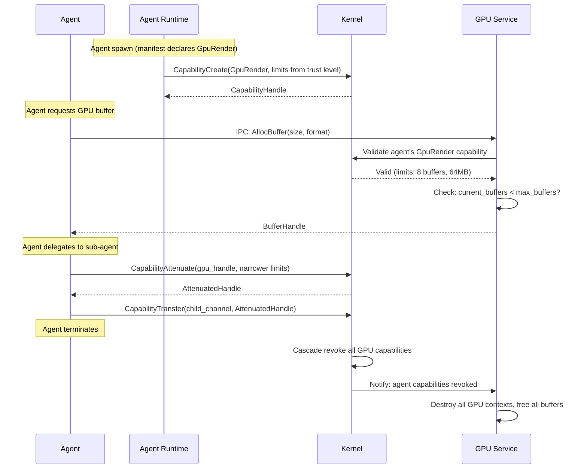
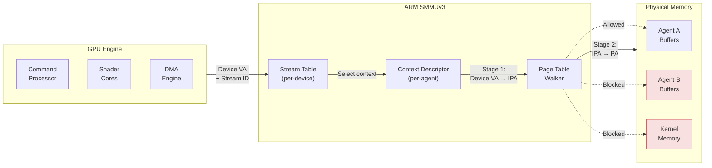
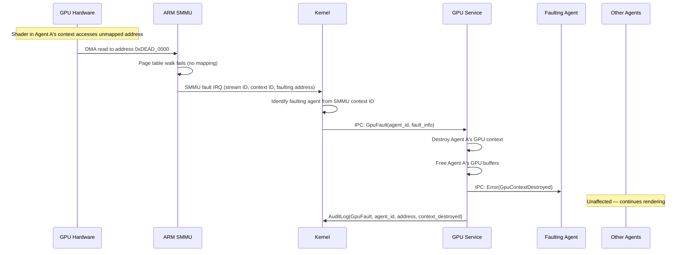

# AIOS GPU Security & Isolation

Part of: [gpu.md](../gpu.md) — GPU & Display Architecture
**Related:** [drivers.md](./drivers.md) — GPU drivers, [display.md](./display.md) — Display controller, [rendering.md](./rendering.md) — Rendering pipeline

Cross-references: [security/model.md](../../security/model.md) — AIOS security model, [security/model/capabilities.md](../../security/model/capabilities.md) — Capability system

-----

## 13. Capability-Gated GPU Access

Every GPU operation passes through the AIOS capability system ([security/model/capabilities.md §3](../../security/model/capabilities.md)). No agent can allocate buffers, submit render commands, or touch display hardware without presenting a valid capability token to the GPU Service. The GPU Service is the sole userspace process with direct GPU hardware access; all other agents interact through IPC.

### 13.1 GPU Capability Hierarchy

Four capability levels control GPU access, ordered from least to most privileged:

```rust
/// GPU-specific capability variants.
/// Extends the Capability enum (shared/src/cap.rs) in the GPU subsystem phase.
#[derive(Debug, Clone, PartialEq, Eq)]
pub enum GpuCapability {
    /// Allocate GPU buffers, submit render commands, read back results.
    /// Standard agent GPU access for UI rendering and compute.
    Render {
        limits: GpuResourceLimits,
    },

    /// Bind buffers to display planes, set display modes, configure outputs.
    /// Restricted to the Compositor and Display Manager.
    Display {
        limits: GpuResourceLimits,
        /// Allowed output indices (e.g., [0] for primary display only)
        allowed_outputs: [bool; MAX_DISPLAY_OUTPUTS],
    },

    /// Access the GPU compute queue for ML inference and general-purpose compute.
    /// Restricted to agents with explicit compute approval.
    Compute {
        limits: GpuResourceLimits,
    },

    /// Configure GPU hardware registers, manage power states, access MMIO.
    /// Restricted to the GPU Service (Trust Level 1).
    Admin,
}

/// Per-agent resource limits enforced by the GPU Service on every operation.
#[derive(Debug, Clone, PartialEq, Eq)]
pub struct GpuResourceLimits {
    /// Maximum number of GPU buffer objects this agent may hold simultaneously.
    pub max_buffers: u32,
    /// Maximum GPU memory in bytes this agent may allocate.
    pub max_memory_bytes: u64,
    /// Maximum framebuffer resolution (width x height) for render targets.
    pub max_resolution: (u32, u32),
    /// Whether compute shader dispatch is permitted.
    pub compute_allowed: bool,
    /// SMMU stream ID binding — ties this capability to a specific DMA context.
    /// None for agents that do not perform direct DMA (most agents).
    pub smmu_stream_id: Option<u32>,
}

const MAX_DISPLAY_OUTPUTS: usize = 4;
```

Each capability token carries both the allowed operations and the resource ceiling. The GPU Service validates every incoming IPC request against the token's `GpuResourceLimits` before touching hardware. Exceeding any limit returns an error without side effects.

### 13.2 Per-Agent Resource Limits

Trust level determines the default GPU resource limits assigned at agent spawn. The GPU Service reads trust level from the agent's capability token and applies the corresponding ceiling:

| Trust Level | Max Buffers | Max GPU Memory | Max Resolution | Compute Shaders | Typical Holder |
|---|---|---|---|---|---|
| Untrusted (TL4) | 2 | 16 MB | 1920x1080 | No | Tab agents, web content |
| Standard (TL3) | 8 | 64 MB | 3840x2160 | No | Third-party agents |
| Trusted (TL2) | 32 | 256 MB | 7680x4320 | Yes | Native experience agents |
| System (TL1) | Unlimited | Unlimited | Unlimited | Yes | GPU Service, Compositor |

These defaults are further constrained by the agent's manifest and any user overrides (capability profile Layer 90, [security/model/capabilities.md §3.7](../../security/model/capabilities.md)). Attenuation applies: an agent's GPU capability can be narrowed (fewer buffers, less memory) but never broadened beyond its trust level ceiling.

### 13.3 GPU Capability Lifecycle



**Key lifecycle invariants:**

- **Grant at spawn.** GPU capability is minted when the agent is spawned, based on the manifest's declared needs and the trust level ceiling. The user approves GPU access as part of the standard capability approval flow ([security/model/capabilities.md §3.4](../../security/model/capabilities.md)).
- **Attenuate on delegation.** When an agent delegates GPU access to a sub-agent, the capability is attenuated: fewer buffers, less memory, no compute. Attenuation is monotonic — the child can never exceed the parent.
- **Revoke on termination.** Agent termination triggers cascade revocation of all GPU capabilities. The GPU Service receives a revocation notification and destroys all associated GPU contexts, buffers, and command streams. No GPU resources leak across agent lifetimes.

### 13.4 Audit Logging

All GPU capability operations are logged to `system/audit/display/` following the subsystem framework audit model ([subsystem-framework.md §7](../subsystem-framework.md)):

```rust
/// GPU-specific audit events. Implements the AuditRecord trait
/// (subsystem-framework.md §7.1).
struct GpuAuditEvent {
    timestamp: Timestamp,
    agent: AgentId,
    session: SessionId,
    task: Option<TaskId>,
    event: GpuAuditEventType,
}

enum GpuAuditEventType {
    /// Agent allocated a GPU buffer.
    BufferAllocated {
        buffer_id: BufferId,
        size_bytes: u64,
        format: PixelFormat,
    },
    /// Agent shared a buffer with another agent.
    BufferShared {
        buffer_id: BufferId,
        source_agent: AgentId,
        target_agent: AgentId,
        access: SharedAccess, // ReadOnly or ReadWrite
    },
    /// Display mode changed.
    ModeChanged {
        output_index: u32,
        old_mode: DisplayMode,
        new_mode: DisplayMode,
        changed_by: AgentId,
    },
    /// GPU capability revoked (agent termination or explicit revocation).
    CapabilityRevoked {
        token_id: CapabilityTokenId,
        reason: RevocationReason,
        buffers_freed: u32,
        memory_freed: u64,
    },
    /// GPU fault (illegal access, timeout, invalid command).
    GpuFault {
        fault_type: GpuFaultType,
        faulting_agent: AgentId,
        address: Option<u64>,
        context_destroyed: bool,
    },
}
```

Audit space structure:

```text
system/audit/display/
  buffers/          Buffer allocation and deallocation records
  sharing/          Cross-agent buffer sharing events
  modes/            Display mode change history
  capabilities/     Capability grant, attenuate, revoke events
  faults/           GPU fault records
```

AIRS can query these audit spaces to detect anomalies: an agent allocating buffers at unusual rates, unexpected buffer sharing patterns, or repeated GPU faults that may indicate a confused-deputy attack.

-----

## 14. DMA Protection

GPU hardware performs Direct Memory Access (DMA) to read vertex data, textures, and command buffers, and to write rendered framebuffers. Without hardware-enforced DMA isolation, a compromised GPU driver or malicious command stream could read or write arbitrary physical memory, bypassing all kernel protections.

### 14.1 ARM SMMU Integration

ARM SMMUv3 (System Memory Management Unit) provides address translation and access control for all device-initiated memory accesses:



**Key SMMU concepts:**

- **Stream ID.** Identifies the device (GPU). Derived from the device tree `iommu-map` property or PCI Bus/Device/Function. Each GPU engine maps to one or more stream IDs.
- **Stream Table Entry (STE).** Per-device configuration record in the SMMU's stream table. Points to the context descriptor table for that device.
- **Context Descriptor (CD).** Per-context (per-agent) configuration within a device. Contains the page table base address and ASID for that agent's GPU address space. Multiple agents sharing the same GPU each get their own CD.
- **Two-stage translation.** Stage 1 translates device virtual addresses to intermediate physical addresses (agent-level isolation). Stage 2 translates IPAs to physical addresses (hypervisor-level isolation, used when AIOS runs under a hypervisor).

### 14.2 Per-Agent DMA Isolation

Each agent's GPU context receives a dedicated SMMU context descriptor. The SMMU page tables for that context contain only the physical pages that the agent has been granted access to via its GPU capability:

```text
Agent A (GpuRender, 64MB limit)
  └─ SMMU Context Descriptor 0
       └─ Page tables: maps device VA 0x0000..0x3FFF_FFF → Agent A's physical pages
                       all other addresses → SMMU fault

Agent B (GpuRender, 16MB limit)
  └─ SMMU Context Descriptor 1
       └─ Page tables: maps device VA 0x0000..0x0FFF_FFF → Agent B's physical pages
                       all other addresses → SMMU fault
```

**Isolation guarantee:** Agent A's GPU shaders and command streams cannot access Agent B's physical pages, even if Agent A crafts malicious GPU commands with Agent B's physical addresses. The SMMU rejects the translation and raises a fault. This protection holds even if the GPU driver (userspace GPU Service) is fully compromised — the SMMU is configured by the kernel and cannot be modified by userspace.

The mapping from agent to SMMU context:

```text
Agent GPU Capability Token
  → contains: smmu_stream_id (device), context_id (per-agent)
  → kernel programs: SMMU Stream Table Entry → Context Descriptor
  → CD contains: page table base for this agent's allowed physical pages
  → result: GPU DMA restricted to exactly the pages this agent owns
```

### 14.3 DMA Buffer Allocation Security

GPU DMA buffers are allocated from the dedicated DMA memory pool (64 MB on QEMU; see [memory/physical.md §2.4](../../kernel/memory/physical.md)):

- **Dedicated pool.** DMA buffers come from `Pool::Dma`, separate from kernel and user pools. Exhausting DMA memory does not affect kernel heap or user page allocation.
- **Guard pages.** Single unmapped guard page between adjacent DMA allocations. GPU DMA overflows hit the guard page, triggering an SMMU fault instead of corrupting the next buffer.
- **Kernel-validated addresses.** The kernel validates all physical address ranges before programming them into SMMU page tables. The GPU Service provides buffer metadata (size, alignment); the kernel allocates physical pages and installs SMMU mappings. No user-controlled physical addresses ever reach the SMMU configuration.
- **Zero on free.** DMA pages are zeroed before returning to the free pool, preventing information leakage between agents that reuse the same physical pages.

### 14.4 Bounce Buffers

For devices without SMMU support, bounce buffers provide a software fallback:

```text
Agent buffer (arbitrary physical pages)
  ↕ kernel copy
Bounce buffer (DMA-accessible, contiguous physical region)
  ↕ DMA transfer
Device
```

The kernel copies data between the agent's buffer and a kernel-owned DMA-safe region. The device only accesses the bounce buffer, which contains no data beyond what the kernel explicitly copied. This carries a performance penalty (one extra memcpy per transfer direction) but preserves the security guarantee: the device cannot access arbitrary agent memory.

### 14.5 Platform-Specific DMA Considerations

| Platform | IOMMU | GPU DMA Model | Isolation Strategy |
|---|---|---|---|
| **QEMU** | Optional SMMUv3 (emulated) | VirtIO-GPU uses `RESOURCE_ATTACH_BACKING` scatter-gather | Hypervisor mediates all DMA; SMMU adds defense-in-depth but is not required for security |
| **Raspberry Pi 4/5** | None (no IOMMU) | VideoCore VI/VII DMA via dedicated CMA region | DMA buffers from dedicated pool with known physical ranges; VideoCore firmware is SoC-trusted |
| **Apple Silicon** | DART (Device Address Resolution Table) | UAT (Unified Address Translation) for GPU page tables | Full per-context isolation via DART; kernel programs DART entries per agent |

On platforms without an IOMMU (Pi 4/5), DMA isolation relies on:
1. GPU Service as sole DMA-capable process (kernel enforces via capability system)
2. DMA buffers allocated from a bounded, dedicated memory region
3. GPU command validation by GPU Service before submission to hardware
4. Bounce buffers for any device outside the trusted SoC DMA path

-----

## 15. GPU Isolation

### 15.1 Cross-Agent Buffer Protection

GPU buffers are owned by the agent that allocated them. No other agent can access a buffer without explicit capability-mediated sharing:

- **Ownership.** The GPU Service maintains a `BufferId → AgentId` ownership table. Every buffer operation (read, write, bind to pipeline, bind to display plane) checks the caller's agent ID against the owner.
- **Sharing.** An agent with a buffer can share it with another agent via the GPU Service IPC interface. Sharing creates a new capability handle for the recipient. The handle can be attenuated to read-only (the recipient can sample the texture but not write to it). The sharing event is logged to `system/audit/display/sharing/`.
- **No implicit access.** Even if two agents render to the same display output (via the Compositor), they cannot read each other's buffers. The Compositor composites surfaces using its own `GpuDisplay` capability; individual agents see only their own surfaces.

### 15.2 GPU Fault Handling

GPU faults — illegal memory access, command timeout, invalid shader instructions — must be contained to the faulting agent. Other agents and the kernel continue unaffected.



**Fault containment guarantees:**

- **Per-agent context destruction.** Only the faulting agent's GPU context is torn down. Other agents' contexts, buffers, and command streams are untouched.
- **No kernel crash.** GPU faults are delivered as interrupts (SMMU fault IRQ or GPU-specific fault interrupt). The kernel's fault handler identifies the agent, notifies the GPU Service, and returns. The kernel does not panic on GPU faults.
- **Automatic resource cleanup.** When a GPU context is destroyed due to a fault, all associated buffers, command streams, and SMMU mappings are freed. No resource leak.
- **Agent notification.** The faulting agent receives an `IpcError` on its next GPU operation, indicating the context was destroyed. The agent can request a new context (subject to rate limiting to prevent fault-loop DoS).
- **Audit trail.** Every fault is recorded with: faulting agent, fault type, faulting address (if available), and whether the context was destroyed.

### 15.3 GPU Context Isolation

Each agent's GPU work executes in a separate hardware context:

| Resource | Isolation Mechanism |
|---|---|
| GPU page tables | Separate SMMU Context Descriptor per agent |
| Command stream | Separate command queue per agent (GPU firmware or scheduler manages) |
| Shader registers | Saved/restored on GPU context switch (GPU firmware responsibility) |
| Texture caches | Flushed on context switch (hardware-dependent) |
| Compute dispatch | Separate dispatch queues; no cross-agent dispatch possible |

On Mali CSF (Command Stream Frontend) GPUs, the GPU firmware manages context switching between agents' command streams. On VirtIO-GPU, the hypervisor serializes command submissions from different contexts. In both cases, one agent's shader cannot read another agent's memory — the SMMU page tables enforce physical isolation regardless of the GPU scheduling model.

**Context switch security:**

```text
Agent A running on GPU
  → GPU firmware preempts Agent A
  → Save Agent A's register state to Agent A's context save area
  → Invalidate shared caches (L2, texture cache) if hardware supports selective flush
  → Load Agent B's register state from Agent B's context save area
  → Switch SMMU context descriptor to Agent B's page tables
  → Agent B resumes on GPU
```

Cache invalidation on context switch is hardware-dependent. GPUs that do not support per-context cache partitioning flush shared caches on every context switch. This is the conservative default — it prevents cache-based side channels at the cost of reduced throughput.

### 15.4 Side-Channel Mitigation

GPU hardware introduces side channels not present in CPU-only workloads:

| Side Channel | Attack Vector | Mitigation |
|---|---|---|
| **Timing** | Shader execution time varies with data values; measurable via GPU timestamps | Randomized scheduling quanta — GPU Service adds jitter (0-500us) to context switch timing |
| **Shared cache probing** | GPU L2 and texture caches are shared across contexts; prime-and-probe attacks possible | Cache flush on context switch; cache partitioning where hardware supports it |
| **Memory bus contention** | Bandwidth measurement reveals activity patterns of co-resident agents | SMMU stream-level QoS (bandwidth partitioning) where available; rate-limited bandwidth reporting |
| **Power analysis** | GPU power draw correlates with workload complexity | Constant-time shader execution for security-critical paths (future) |
| **Occupancy inference** | Number of active shader cores reveals workload characteristics | Not mitigated in initial design; low practical risk for non-cryptographic workloads |

**Mitigation levels by trust requirement:**

- **Standard agents.** Cache flush on context switch. Randomized scheduling quanta. Sufficient for UI rendering workloads where timing leakage has no security impact.
- **Security-sensitive agents.** Dedicated GPU time slices — no concurrent execution with other agents. The GPU Service schedules these agents in exclusive windows where no other agent's context is resident on the GPU. Higher latency, but eliminates all co-residency side channels.
- **High-security inference.** For agents performing sensitive AI inference on GPU, the GPU TEE path (§15.5) provides hardware-encrypted memory. Until TEE support is available, sensitive inference runs on CPU with software encryption.

Reference: Telekine (NSDI 2020) demonstrates practical GPU timing isolation via API remoting and scheduling control. AIOS adopts the scheduling-based isolation approach (randomized quanta, exclusive time slices) rather than API remoting, since the GPU Service already mediates all GPU access via IPC.

### 15.5 GPU TEEs (Future)

Confidential GPU computing protects model weights and inference data from physical attacks and compromised system software:

- **NVIDIA H100 Confidential Computing.** GPU memory encrypted by the GPU itself. The host OS (including the kernel) cannot read GPU memory contents. Command streams are integrity-protected. AIOS integration: the GPU Service programs the H100's confidential mode; agents with `GpuConfidential` capability get isolated encrypted GPU contexts.
- **ARM CCA (Confidential Compute Architecture).** Realm-based isolation extends to GPU contexts when the GPU supports CCA. Each realm gets an isolated GPU address space with hardware-encrypted memory. AIOS integration: agents running in CCA realms receive GPU access through realm-aware SMMU configuration.
- **Future capability token.** A `GpuConfidential` capability variant for agents that require hardware-encrypted GPU memory. Only granted to agents with explicit user approval and appropriate trust level. The GPU Service validates hardware TEE support before granting the capability; falls back to CPU-only inference if TEE hardware is absent.

```rust
/// Future GPU TEE capability (not implemented in initial GPU phase).
pub enum GpuConfidentialMode {
    /// NVIDIA Confidential Computing (H100+)
    NvidiaCc {
        /// Maximum encrypted GPU memory for this agent
        max_encrypted_memory: u64,
    },
    /// ARM CCA Realm-based GPU isolation
    ArmCcaRealm {
        /// Realm ID for GPU context binding
        realm_id: u64,
    },
}
```

GPU TEE support depends on hardware availability and vendor driver cooperation. The capability system is designed to accommodate TEE modes without architectural changes — `GpuConfidential` is an extension of the existing `GpuCapability` hierarchy, subject to the same attenuation, delegation, and revocation rules.

-----
