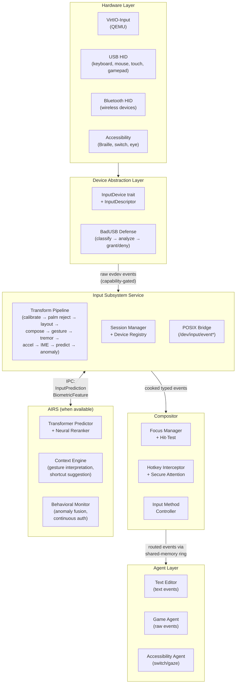

# AIOS Input Subsystem

## Deep Technical Architecture

**Parent document:** [architecture.md](../project/architecture.md)
**Related:** [subsystem-framework.md](./subsystem-framework.md) — Universal hardware abstraction (capability gate, sessions, data channels, audit, power, POSIX bridge), [compositor.md](./compositor.md) — Focus management and input routing to surfaces, [posix.md](./posix.md) — `/dev/input/event*` device file emulation, [accessibility.md](../experience/accessibility.md) — Screen reader, Braille, switch scanning, [audio.md](./audio.md) — Companion subsystem implementation, [wireless.md](./wireless.md) — Bluetooth HID (HOGP) input integration (§7.4)

**Note:** The input subsystem implements the subsystem framework. Its capability gate, session model, audit logging, power management, and POSIX bridge follow the universal patterns defined in the framework document. This document covers the input-specific design decisions and architecture.

-----

## Document Map

This document was split for navigability. Each sub-document preserves the original section numbers for cross-reference stability.

| Document | Sections | Content |
|---|---|---|
| **This file** | §1, §2, §7, §8, §9 | Core insight, architecture overview, implementation order, technology choices, design principles |
| [devices.md](./input/devices.md) | §3.1–§3.7 | Device class taxonomy, USB HID protocol, VirtIO-input, Bluetooth HID, accessibility devices, hotplug |
| [events.md](./input/events.md) | §4.1–§4.6 | InputEvent type hierarchy, event pipeline, queuing, focus routing, hotkeys, multi-seat |
| [gestures.md](./input/gestures.md) | §5.1–§5.5 | Keyboard processing, mouse/trackpad, touchscreen gestures, gamepad, gesture state machines |
| [integration.md](./input/integration.md) | §6.1–§6.6 | Capability system, POSIX bridge, power management, audit, compositor integration, UI toolkit |
| [ai.md](./input/ai.md) | §10.1–§10.7 | Predictive input, adaptive parameters, gesture learning, anomaly detection, context-aware shortcuts, accessibility adaptation, model budget |
| [future.md](./input/future.md) | §11.1–§11.6 | Spatial input, voice-as-input, neural input, haptics, cross-device input, formal verification |

-----

## 1. Core Insight

In every existing OS, input is plumbing — a stream of keycodes and coordinates that applications must interpret, filter, and adapt. Every application reimplements keyboard shortcuts, gesture recognition, accessibility accommodations, and input validation. The OS provides raw events and wishes the application good luck.

AIOS inverts this. The input subsystem is an **intelligent, adaptive pipeline** that transforms raw hardware signals into semantic intent — and the pipeline itself learns from the user over time.

```text
What applications see:

    InputEvent::Key { key: Enter, .. }         ← a key was pressed
    InputEvent::Gesture { kind: Pinch, .. }    ← a gesture was recognized
    InputEvent::Text { string: "hello", .. }   ← composed text from IME
    InputEvent::Command { action: Undo, .. }   ← semantic action from shortcut

What the OS does underneath:

    USB HID report parsing → device classification → BadUSB defense →
    keycode-to-keysym translation → compose/dead key processing →
    layout transformation → input method composition →
    gesture recognition (grammar + state machine + ML) →
    tremor filtering → palm rejection → pointer acceleration →
    focus routing → capability enforcement → audit logging →
    adaptive parameter tuning → anomaly detection
```

The application does not care that the user typed on a USB keyboard, a Bluetooth keyboard, or a Braille display's chord input. It receives semantic events — and the OS handles everything else.

**Three design principles distinguish AIOS input from prior art:**

1. **Capability-gated at every boundary.** Every stage of the input pipeline is a capability scope. A palm rejection agent cannot see keyboard events. An IME cannot see gamepad input. A game gets raw events; a text editor gets composed text. No agent reads another's input — ever.

2. **Adaptive by default.** The input subsystem ships ~1.8MB of frozen ML models for security (BadUSB defense), accessibility (tremor filtering, adaptive debounce), and comfort (pointer acceleration, palm rejection). These run at kernel-internal timescales (<1ms) with no AIRS dependency. The user benefits from day one without configuration.

3. **AI-native when AIRS is available.** With AIRS online, the input subsystem gains transformer-based word prediction, context-aware gesture interpretation, semantic shortcut suggestions, and behavioral anomaly detection. The pipeline degrades gracefully — kernel-internal models handle the baseline; AIRS adds intelligence.

-----

## 2. Full Architecture

```text
┌──────────────────────────────────────────────────────────────────────┐
│                          Agent Layer                                  │
│                                                                       │
│  Text Editor      Game Agent      Terminal        Accessibility       │
│  (text events)    (raw events)    (key events)    (switch/gaze)      │
│                                                                       │
│  Each agent holds InputReceive capability scoped to its surfaces      │
└──────────────────────────┬───────────────────────────────────────────┘
                           │ IPC: typed InputEvent via shared-memory ring
                           │
┌──────────────────────────┴───────────────────────────────────────────┐
│                       Compositor (Input Router)                       │
│                                                                       │
│  ┌────────────────┐  ┌─────────────────┐  ┌──────────────────────┐  │
│  │  Focus Manager  │  │  Hit-Test Engine │  │  Hotkey Interceptor  │  │
│  │                 │  │                  │  │                      │  │
│  │  per-seat focus │  │  pointer → surface│  │  system shortcuts   │  │
│  │  keyboard focus │  │  touch → surface  │  │  secure attention   │  │
│  │  focus history  │  │  viewport clip    │  │  accessibility keys │  │
│  └────────────────┘  └─────────────────┘  └──────────────────────┘  │
│                                                                       │
│  ┌────────────────┐  ┌─────────────────┐  ┌──────────────────────┐  │
│  │  Cursor Render  │  │  Input Method    │  │  Gesture Dispatch    │  │
│  │                 │  │  Controller      │  │                      │  │
│  │  HW overlay     │  │  IME lifecycle   │  │  compositor gestures │  │
│  │  cursor shape   │  │  pre-edit/commit │  │  (workspace switch)  │  │
│  │  cursor hide    │  │  candidate list  │  │  (window management) │  │
│  └────────────────┘  └─────────────────┘  └──────────────────────┘  │
└──────────────────────────┬───────────────────────────────────────────┘
                           │ IPC: cooked events from subsystem service
                           │
┌──────────────────────────┴───────────────────────────────────────────┐
│                    Input Subsystem Service                             │
│                      (userspace process)                               │
│                                                                       │
│  ┌──────────────────────────────────────────────────────────────────┐ │
│  │                   Transform Pipeline                              │ │
│  │                                                                   │ │
│  │  ┌─────────┐ ┌──────────┐ ┌────────┐ ┌────────┐ ┌───────────┐ │ │
│  │  │ Calibrate│→│ Palm     │→│ Layout │→│ Compose│→│ Gesture   │ │ │
│  │  │ Deadzone │ │ Reject   │ │ XKB    │ │ Dead   │ │ Recognize │ │ │
│  │  │          │ │ (CNN)    │ │        │ │ Key    │ │ (3-layer) │ │ │
│  │  └─────────┘ └──────────┘ └────────┘ └────────┘ └───────────┘ │ │
│  │  ┌─────────┐ ┌──────────┐ ┌────────┐ ┌────────┐ ┌───────────┐ │ │
│  │  │ Tremor  │→│ Accel    │→│ IME    │→│ Predict│→│ Anomaly   │ │ │
│  │  │ Filter  │ │ Curve    │ │ Agent  │ │ (AIRS) │ │ Detect    │ │ │
│  │  │ (Kalman)│ │ (Bayes)  │ │        │ │        │ │ (kernel)  │ │ │
│  │  └─────────┘ └──────────┘ └────────┘ └────────┘ └───────────┘ │ │
│  └──────────────────────────────────────────────────────────────────┘ │
│                                                                       │
│  ┌──────────────┐  ┌───────────────┐  ┌────────────────────────────┐ │
│  │  Session      │  │  Device        │  │  POSIX Bridge              │ │
│  │  Manager      │  │  Registry      │  │                            │ │
│  │               │  │                │  │  /dev/input/event0         │ │
│  │  open/close   │  │  hotplug       │  │  /dev/input/mice           │ │
│  │  capability   │  │  descriptors   │  │  /dev/input/js0            │ │
│  │  gate check   │  │  seat assign   │  │  evdev ioctl emulation     │ │
│  └──────────────┘  └───────────────┘  └────────────────────────────┘ │
└──────────────────────────┬───────────────────────────────────────────┘
                           │ raw evdev-compatible events
                           │
┌──────────────────────────┴───────────────────────────────────────────┐
│                    Device Abstraction Layer                            │
│                                                                       │
│  trait InputDevice: SubsystemDriver                                   │
│  ├── descriptor() → InputDescriptor         // device self-description│
│  ├── capabilities() → InputCapabilities     // axes, buttons, keys    │
│  ├── event_channel() → &dyn DataChannel     // Events(EventSchema)    │
│  ├── set_led(LedState)                      // keyboard LEDs          │
│  ├── set_rumble(RumbleEffect)               // gamepad haptics        │
│  └── properties() → &DeviceProperties       // framework standard     │
│                                                                       │
│  trait InputTransform                        // pipeline stage         │
│  ├── transform(event: RawInputEvent) → Option<RawInputEvent>          │
│  ├── name() → &str                                                    │
│  └── priority() → u32                       // pipeline ordering      │
└──────────────────────────┬───────────────────────────────────────────┘
                           │
                           ▼
┌──────────────────────────────────────────────────────────────────────┐
│                        Hardware Drivers                                │
│                                                                       │
│  VirtIO-Input    │  USB HID Class    │  Bluetooth HID  │  Platform   │
│  (QEMU)          │  (keyboard, mouse │  (wireless kbd, │  (Pi GPIO,  │
│                  │   touch, gamepad) │   mouse, gamepad)│  I2C touch) │
│                  │                   │                  │             │
│  USB Braille     │  USB Switch       │  Eye Tracker     │  Sensor Hub │
│  (HID 0x41)      │  (HID switch)     │  (USB/BT)       │  (accel,    │
│                  │                   │                  │  gyro)      │
└──────────────────────────────────────────────────────────────────────┘
       ↕                        ↕                    ↕
  Capability Gate           Audit Space          BadUSB Defense
  (kernel-enforced)         (system/audit/input/) (pre-capability check)
```



-----

## 7. Implementation Order

Each sub-phase delivers usable functionality independently.

### Phase 7 — Input, Terminal & Basic Networking

```text
Phase 7a — VirtIO-Input Driver + Event Model:
  ├── VirtIO-input MMIO driver (reuse VirtIO-blk transport code)
  ├── virtio-keyboard-device + virtio-tablet-device support
  ├── RawInputEvent struct (evdev-compatible: type, code, value, timestamp)
  ├── InputEvent typed enum (KeyEvent, MotionEvent, TouchEvent, GamepadEvent)
  ├── Translation layer: RawInputEvent → InputEvent
  ├── Input subsystem service skeleton (register with subsystem framework)
  └── Basic keyboard event delivery to compositor → focused agent

Phase 7b — Pointer + Transform Pipeline:
  ├── Pointer event delivery (absolute coordinates from virtio-tablet)
  ├── Transform pipeline infrastructure (InputTransform trait, ordered chain)
  ├── XKB-compatible keyboard layout engine (keycodes → keysyms)
  ├── Compose/dead key trie engine
  ├── Basic pointer acceleration (parameterized sigmoid)
  ├── Focus-based routing in compositor
  └── Global hotkey interception (system shortcuts, secure attention)

Phase 7c — Sessions + POSIX Bridge:
  ├── Input session lifecycle (open, configure, close)
  ├── Capability gate enforcement (InputReceive, InputDevice)
  ├── /dev/input/event* POSIX bridge (evdev ioctl emulation)
  ├── Device registry + seat assignment
  ├── Audit logging (device sessions, NOT keystroke content)
  └── Power management integration (idle detection, wake-on-key)
```

### Phase 16 — USB Stack

```text
Phase 16a — USB HID Core:
  ├── USB HID report descriptor parser (no_std Rust)
  ├── HID report → evdev event translation
  ├── Boot protocol support (keyboard, mouse)
  ├── BadUSB defense pipeline (descriptor classifier + timing entropy + traffic CNN)
  └── USB keyboard, mouse, gamepad drivers

Phase 16b — Bluetooth HID:
  ├── Bluetooth HID profile
  ├── Wireless keyboard, mouse, gamepad support
  └── Pairing + reconnection management
```

### Phase 17 — Extended USB Devices

```text
Phase 17a — USB HID Extended:
  ├── USB Braille display driver (HID usage page 0x41)
  ├── USB switch device support
  └── USB gamepad with force feedback (HID FF usage page)
```

### Phase 20+ — Advanced Input

```text
Phase 20a — Touch + Gesture Recognition:
  ├── Multi-touch protocol (tracking IDs, contact tracking)
  ├── Palm rejection CNN (frozen, ~200KB)
  ├── Gesture recognition (three-layer: $P+ geometric → TCN backbone → AIRS interpretation)
  ├── Gesture grammar engine (applications register gesture grammars)
  └── Touchscreen gestures (tap, swipe, pinch, rotate)

Phase 20b — Adaptive + ML:
  ├── Adaptive pointer acceleration (online Bayesian update)
  ├── Adaptive key debounce HMM
  ├── Tremor Kalman filter (auto-detected, progressive enhancement)
  ├── Touch trajectory prediction (latency reduction)
  └── Kernel-internal anomaly detection (keystroke/mouse dynamics SVM)

Phase 20c — AIRS Integration:
  ├── Transformer keyboard prediction via AIRS
  ├── Context-aware autocorrect (neural reranker)
  ├── Context-aware gesture interpretation
  ├── Behavioral anomaly fusion (AIRS Behavioral Monitor)
  └── Shortcut prediction via Context Engine
```

### Phase 23 — Accessibility

```text
Phase 23a — Accessibility Input:
  ├── Switch scanning engine (linear, row-column, group, Huffman)
  ├── Adaptive scanning (frequency-based reordering + AIRS context prediction)
  ├── StickyKeys, FilterKeys, BounceKeys transforms
  ├── Click assistance LSTM
  ├── Fitts' Law adaptive target sizing
  └── Eye tracking device interface + gaze-to-selection engine

Phase 23b — Braille + AAC:
  ├── Braille display bidirectional channel (text out, button input in)
  ├── AIRS-assisted sentence completion for AAC
  └── Full keyboard navigation from first frame
```

-----

## 8. Key Technology Choices

| Decision | Choice | Rationale |
|---|---|---|
| Event format at driver boundary | evdev-compatible (type/code/value) | VirtIO-input and USB HID both use this format; industry standard; POSIX bridge maps directly |
| Event format at application boundary | Typed Rust enums (KeyEvent, MotionEvent, etc.) | Ergonomic, exhaustive matching, leverages Rust type system |
| Event delivery mechanism | Zero-copy shared-memory ring buffer | Sub-microsecond delivery, no syscall per event; ring notified via IPC notification |
| Keyboard layout engine | XKB-compatible data model | Industry standard, 1000+ layouts available, O(1) per keypress |
| Gesture recognition | Three-layer ($P+ geometric, TCN backbone, AIRS context) | Covers simple strokes to context-aware interpretation; degrades gracefully |
| Pointer acceleration | Parameterized sigmoid with online Bayesian adaptation | Personalizes in ~100 pointing actions; 20 bytes per user |
| Palm rejection | Frozen CNN (~200KB, INT8) | >99% accuracy, <0.5ms per touch event; no AIRS dependency |
| BadUSB defense | HID descriptor classifier + timing entropy + traffic CNN | Multi-layered detection before capability grant; ~82KB total |
| Tremor compensation | Kalman filter (default) + CNN predictor (upgrade) | Auto-detected, progressive enhancement; zero configuration |
| IME architecture | Agent with direct IPC channel to focused application | No bus overhead (unlike IBus/D-Bus); capability-scoped |
| Compose engine | Trie-based (configurable compose tables) | O(sequence length), standard X11 compose tables |
| Multi-seat | Per-seat capability domain with independent focus | Natural fit with AIOS capability model |
| Input isolation model | Structural (Wayland model): no global event bus | No keylogging possible; focus-only delivery; capability-enforced |
| Secure input session | Compositor mode where events bypass all observers | For password entry; suppresses accessibility taps during secure input |
| Device self-description | InputDescriptor trait (mirrors USB HID report descriptors) | Devices declare capabilities; no hardcoded device knowledge |

-----

## 9. Design Principles

### 9.1 Capability-Gated Pipeline

Every stage of the input pipeline is a separate capability scope. The palm rejection transform sees only touch events. The IME agent sees only keyboard events for the active input field. The gesture recognizer sees only multi-touch events. This is not just access control — it is the architecture. Each transform is a capability boundary that cannot be crossed without explicit grant.

### 9.2 Adaptive by Default, Intelligent When Available

The input subsystem ships two tiers of intelligence:

- **Tier 1 (kernel-internal, always available):** ~1.8MB of frozen models + per-user adaptive parameters (~50KB). Handles security (BadUSB), accessibility (tremor, debounce), and comfort (acceleration, palm rejection). No AIRS dependency. Runs at <1ms latency.

- **Tier 2 (AIRS-dependent, when available):** Transformer prediction, context-aware autocorrect, semantic gesture interpretation, behavioral anomaly fusion. Adds intelligence but is not required. The pipeline degrades gracefully to Tier 1.

### 9.3 Zero Trust for Devices

No input device is trusted by default. Every new device goes through:

1. Descriptor parsing and classification
2. Anomaly analysis (unexpected class combinations, unusual descriptor patterns)
3. Behavioral analysis (timing entropy on first 100 reports)
4. Capability grant only after passing all checks

A USB flash drive that also claims to be a keyboard is blocked. A keyboard that types 1000 characters per second is revoked. Trust is earned through behavior, not claimed through descriptors.

### 9.4 Privacy by Architecture

The input subsystem enforces strict privacy boundaries:

- **No global event stream.** There is no API to read all input events, even as a capability. Input goes only to the focused agent.
- **Audit logs device usage, not keystrokes.** The audit system records that a keyboard was used, not what was typed.
- **AIRS receives features, not raw input.** The input subsystem sends timing statistics and anomaly scores to AIRS — never raw keystroke content. The capability system enforces this structurally.
- **Keystroke dynamics are biometric data.** Stored encrypted in the user's identity space with `BiometricTemplate` capability protection.

### 9.5 Composable Transform Pipeline

The input pipeline is a chain of transforms, inspired by Genode's filter chain:

- Each transform implements the `InputTransform` trait
- Transforms are ordered by priority (lower runs first)
- Transforms can consume, modify, or pass through events
- New transforms can be inserted by capability-gated system agents
- The pipeline is reconfigurable at runtime (e.g., enabling tremor filter when accessibility detects tremor)

This composability means accessibility features, security features, and comfort features are not special cases — they are standard pipeline stages.

### 9.6 Latency Budget

Every stage of the pipeline has a latency target:

| Stage | Target | Enforcement |
|---|---|---|
| Hardware → IRQ handler | <100μs | Priority IRQ, direct switch |
| IRQ → driver → raw event | <200μs | Dedicated input processing thread |
| Transform pipeline (all stages) | <2ms | Per-stage instrumentation |
| Subsystem → compositor routing | <500μs | IPC direct switch |
| Compositor → agent delivery | <500μs | Shared-memory ring, notification |
| **Total: hardware → application** | **<4ms** | End-to-end timestamp propagation |

Hardware timestamps propagate through the entire pipeline, enabling precise latency measurement at every boundary.

-----

## Cross-Reference Index

| Reference | Location | Topic |
|---|---|---|
| §1 Core Insight | [This file](#1-core-insight) | Design philosophy: intelligent adaptive pipeline |
| §2 Full Architecture | [This file](#2-full-architecture) | Layered architecture diagram and data flow |
| §3.1 Device Class Taxonomy | [devices.md](./input/devices.md) | Keyboard, mouse, touch, gamepad, accessibility |
| §3.2 USB HID Protocol Layer | [devices.md](./input/devices.md) | Report descriptors, usage tables, boot protocol |
| §3.3 Platform-Specific Drivers | [devices.md](./input/devices.md) | QEMU VirtIO, Pi, Apple |
| §3.4 VirtIO-Input Driver | [devices.md](./input/devices.md) | QEMU development target, MMIO transport |
| §3.5 Bluetooth HID | [devices.md](./input/devices.md) | Wireless keyboards, mice, gamepads |
| §3.6 Accessibility Devices | [devices.md](./input/devices.md) | Braille, switch, eye tracking |
| §3.7 Device Discovery & Hotplug | [devices.md](./input/devices.md) | USB enumeration, BadUSB pre-screening |
| §4.1 InputEvent Type Hierarchy | [events.md](./input/events.md) | RawInputEvent (evdev), InputEvent (typed Rust) |
| §4.2 Event Pipeline | [events.md](./input/events.md) | Raw → cooked → semantic processing stages |
| §4.3 Event Queuing & Priority | [events.md](./input/events.md) | Realtime, interactive, background tiers |
| §4.4 Focus Routing | [events.md](./input/events.md) | Compositor-driven per-surface delivery |
| §4.5 Global Hotkeys & System Shortcuts | [events.md](./input/events.md) | Secure attention, system shortcuts |
| §4.6 Multi-Seat Support | [events.md](./input/events.md) | Per-seat capability domains, independent focus |
| §5.1 Keyboard Processing | [gestures.md](./input/gestures.md) | Key repeat, dead keys, compose, IME |
| §5.2 Mouse/Trackpad Processing | [gestures.md](./input/gestures.md) | Acceleration curves, scroll, multi-finger |
| §5.3 Touchscreen Gestures | [gestures.md](./input/gestures.md) | Tap, swipe, pinch, rotate, palm rejection |
| §5.4 Gamepad Processing | [gestures.md](./input/gestures.md) | Axis calibration, dead zones, haptics |
| §5.5 Gesture State Machine Architecture | [gestures.md](./input/gestures.md) | Three-layer: $P+, TCN, AIRS context |
| §6.1 Capability System | [integration.md](./input/integration.md) | InputCapability hierarchy, attenuation |
| §6.2 POSIX Bridge | [integration.md](./input/integration.md) | `/dev/input/event*`, evdev ioctl emulation |
| §6.3 Power Management | [integration.md](./input/integration.md) | Idle detection, wake-on-key, input boost |
| §6.4 Audit & Observability | [integration.md](./input/integration.md) | Device sessions (no keystroke content) |
| §6.5 Compositor Integration | [integration.md](./input/integration.md) | Focus tracking, cursor, input method |
| §6.6 UI Toolkit Integration | [integration.md](./input/integration.md) | Widget focus, keyboard nav, event bubbling |
| §10.1 Predictive Input | [ai.md](./input/ai.md) | N-gram (kernel), transformer (AIRS) |
| §10.2 Adaptive Parameters | [ai.md](./input/ai.md) | Pointer acceleration, key repeat, touch sensitivity |
| §10.3 Gesture Learning | [ai.md](./input/ai.md) | Few-shot recognition, custom gestures |
| §10.4 Anomaly Detection | [ai.md](./input/ai.md) | BadUSB, keystroke dynamics, injection detection |
| §10.5 Context-Aware Shortcuts | [ai.md](./input/ai.md) | AIRS shortcut suggestion, workflow prediction |
| §10.6 Accessibility Adaptation | [ai.md](./input/ai.md) | Tremor compensation, adaptive scanning, click assist |
| §10.7 Kernel-Internal Model Budget | [ai.md](./input/ai.md) | Total model footprint (~1.77MB frozen, ~50KB adaptive) |
| §11.1 Spatial Input | [future.md](./input/future.md) | VR/AR controllers, 6DOF tracking |
| §11.2 Voice-as-Input | [future.md](./input/future.md) | Speech → input events |
| §11.3 Neural Input | [future.md](./input/future.md) | BCI, EMG interfaces |
| §11.4 Haptic Feedback | [future.md](./input/future.md) | Haptic subsystem design |
| §11.5 Cross-Device Input | [future.md](./input/future.md) | Phone as trackpad, tablet as surface |
| §11.6 Formal Verification | [future.md](./input/future.md) | Verified input pipeline |
