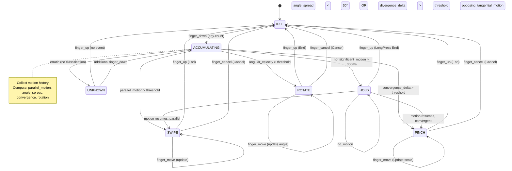

# AIOS Gesture Recognition & Input Processing

Part of: [input.md](../input.md) — Input Subsystem
**Related:** [events.md](./events.md) — Event model (InputEvent types), [devices.md](./devices.md) — Hardware drivers, [ai.md](./ai.md) — ML gesture learning

-----

## 5. Gesture Recognition & Input Processing

This section covers the processing stages that transform raw hardware events into semantic input: keyboard layout translation, pointer acceleration, touchscreen gesture recognition, gamepad calibration, and the three-layer gesture state machine architecture that underpins multi-touch and custom gesture support.

These stages execute within the input subsystem service's transform pipeline (described in [events.md §4.2](./events.md)). Each stage is a capability-scoped `InputTransform` implementation that can consume, modify, or pass through events. The pipeline is device-class-aware — keyboard transforms do not run on touch events, and palm rejection does not run on gamepad events.

### 5.1 Keyboard Processing

Keyboard processing transforms raw hardware scancodes into composed, locale-aware text. The pipeline handles layout translation, key repeat, dead key state machines, compose sequences, and input method composition for complex scripts.

#### 5.1.1 XKB-Compatible Layout Engine

The layout engine translates hardware scancodes to XKB keysyms using a rules/model/layout/variant/options data model. This is the same data model used by X11 and Wayland compositors, giving the input subsystem access to the full XKB keymap database: over 1000 keyboard layouts covering all major writing systems.

```text
Layout pipeline (O(1) per keypress):

  scancode
     │
     ▼
  ┌──────────────────────────────────────────────────────┐
  │  XKB Keymap Data                                     │
  │                                                      │
  │  rules:    evdev                                     │
  │  model:    pc105                                     │
  │  layout:   us,ja,de         (up to 4 layouts)       │
  │  variant:  ,kana,nodeadkeys                          │
  │  options:  grp:alt_shift_toggle,caps:escape          │
  │                                                      │
  │  Keymap table: [scancode → {keysym[4], actions}]    │
  │  Size: ~100KB per layout (includes all shift states) │
  └──────────────────────────────────────────────────────┘
     │
     ▼
  keysym (Unicode codepoint or X11 named symbol)
  modifier state update
  group (layout index) update
```

The keymap data is loaded from the user's input space at session start. Multiple layouts are loaded simultaneously; layout switching does not require a reload. Per-application layout overrides are supported via capability-scoped keymap attachment — an application with `InputLayoutOverride` capability can specify an alternate layout for its input context without affecting system-wide state.

Layout switching is triggered by the configured hotkey (default: Alt+Shift or Super+Space). The compositor intercepts this combination before routing to applications, updates the active group index, and the next keypress uses the new layout immediately.

#### 5.1.2 Key Repeat

Key repeat generates synthetic `KeyState::Repeat` events at a configurable rate while a key is held.

The repeat timer fires at a delay after initial press, then periodically at the configured rate:

- **Delay:** 250–1000ms (default: 400ms) — configurable per user
- **Rate:** 2–50 Hz (default: 25 Hz) — configurable per user

Repeat applies only to character-producing keys and a subset of navigation keys. Modifier keys, function keys, and control sequences do not repeat.

With AIRS available, key repeat parameters adapt via a Hidden Markov Model that observes typing dynamics. See [ai.md §10.2](./ai.md) for the adaptive key repeat model.

#### 5.1.3 Dead Keys

Dead keys produce no character on initial press but modify the next keypress to produce a combined character. Each input context maintains independent dead key state — switching focus does not corrupt a pending dead key sequence.

```text
Dead key state machine (per input context):

  NORMAL state
     │ press dead_acute (´)
     ▼
  DEAD_ACUTE state
     │ press 'e'
     ▼
  emit 'é' (U+00E9), return to NORMAL

  DEAD_ACUTE state
     │ press Space
     ▼
  emit '´' (the dead key itself), return to NORMAL

  DEAD_ACUTE state
     │ press dead_acute again
     ▼
  emit '´´' or '˝' depending on compose table, return to NORMAL
```

State is per-context rather than global, preventing the pathological case where a slow typist is interrupted by a focus change that leaves the system in an undefined dead key state.

#### 5.1.4 Compose Sequences

Compose sequences allow multi-keypress input of characters not directly on the keyboard. The engine uses a trie-based structure loaded from configurable compose tables.

```text
Trie traversal example (Compose key + - > = ⟶):

  press Compose key     → enter compose state
  press '-'             → trie descends, node has children
  press '>'             → trie descends, node matches: emit '→' (U+2192)

  press Compose key     → enter compose state
  press '-'             → trie descends
  press '-'             → trie descends
  press '-'             → trie matches: emit '—' (U+2014, em dash)
```

Compose table sizes range from 1000 to 3000 entries depending on locale. The trie is pre-compiled at table load time; lookup is O(sequence length), typically 2–4 steps.

The standard X11 compose tables are supported directly. Custom compose tables follow the same format and can be appended to the standard tables or replace them entirely, controlled by user preference in the input space.

#### 5.1.5 Input Method Editor Architecture

IME handles languages that require multi-step composition: CJK character input from romaji or pinyin, Indic scripts with conjunct consonants, Arabic with contextual shaping decisions, and other complex orthographies.

The IME architecture uses a dedicated system agent rather than an in-process library:

```text
IME Architecture:

  ┌─────────────────────────────────────────────────────────────┐
  │                  Input Subsystem Service                     │
  │                                                             │
  │  Keyboard events ──► IME Dispatcher                        │
  │                         │                                   │
  │                         │ IPC: raw keystroke + context hint │
  │                         ▼                                   │
  │              ┌──────────────────────┐                      │
  │              │    IME Agent         │                      │
  │              │  (system process)    │                      │
  │              │                      │                      │
  │              │  - Romaji → kana     │                      │
  │              │  - Kana → kanji      │                      │
  │              │  - Candidate ranking │                      │
  │              │  - User corrections  │                      │
  │              └──────────┬───────────┘                      │
  │                         │ IPC: PreEdit / Commit / Candidate  │
  │                         ▼                                   │
  │         Direct IPC channel to focused application           │
  └─────────────────────────────────────────────────────────────┘
```

The IME agent communicates directly with the focused application over a dedicated IPC channel — no intermediary bus. This eliminates the D-Bus overhead that makes Linux IME (IBus, Fcitx) add latency on every keystroke.

**Pre-edit protocol:** While composition is in progress, the IME sends `TextEventKind::PreEdit` events carrying the current composition string with segment attributes:

| Attribute | Visual presentation | Meaning |
|---|---|---|
| `Active` | Underline, bold | Current conversion segment |
| `Converted` | Underline, normal | Already converted, awaiting confirmation |
| `Selected` | Highlight | Selected candidate |
| `Raw` | Thin underline | Unconverted input |

**Candidate list protocol:** The IME sends an ordered candidate list alongside the pre-edit string. Each candidate carries:

- Display string (the converted text)
- Reading (pronunciation guide, e.g. furigana for Japanese)
- Frequency rank (higher = more common)
- Source annotation (system dictionary, user dictionary, AIRS suggestion)

The compositor renders the candidate window near the insertion point. Applications that render their own candidate UI receive the raw candidate list and render it within their surface.

**Content type hints:** Applications provide a `ContentType` hint when requesting input focus. The IME uses this to adjust behavior:

| Content type | IME behavior |
|---|---|
| `Text` | Full IME, standard candidate selection |
| `Email` | Suggest email addresses, disable decorative IME features |
| `Url` | ASCII mode by default, suppress candidate window |
| `Password` | IME disabled entirely, no candidate logging |
| `Number` | Numeric keypad mode |
| `Search` | Predictive (AIRS-backed), suggestion-heavy mode |

**Reconversion:** With `InputReconvert` capability, the IME can accept already-committed text back for re-processing. The application sends a text segment back to the IME, which re-enters it into the composition pipeline for alternative conversion.

#### 5.1.6 Accessibility Keyboard Transforms

Three accessibility transforms run as built-in pipeline stages after the layout engine:

**StickyKeys** allows modifier keys (Shift, Ctrl, Alt, Super) to be activated one at a time rather than held simultaneously. Pressing a modifier once latches it until the next character key. Pressing twice locks it until unlocked. This supports users who cannot hold multiple keys simultaneously.

**FilterKeys** ignores brief or repeated keypresses below a configurable threshold. Two sub-modes:

- SlowKeys: require a key to be held for a minimum duration before registering
- BounceKeys: ignore rapid re-presses of the same key within a debounce window

**BounceKeys** specifically targets users with tremor who may accidentally double-press keys. The debounce window is separate from the key repeat delay and applies to key-down events only.

All three transforms are active when enabled in accessibility preferences and integrate naturally as pipeline stages — they require no special handling from applications.

-----

### 5.2 Mouse/Trackpad Processing

Pointer processing transforms raw relative motion and scroll events into smooth, accelerated, DPI-aware pointer movement and scroll behavior.

#### 5.2.1 Pointer Acceleration

Raw mouse motion is nonlinear with respect to pointer movement on screen. At low physical speed, the pointer moves slowly for precision; at high speed, it moves quickly for efficiency. The input subsystem implements this via a parameterized sigmoid acceleration curve.

The sigmoid function maps input speed to output speed multiplier:

```text
Output speed = base_speed × sigmoid_curve(input_speed, params)

Sigmoid parameters (per user profile, ~20 bytes total):
  k:         curve steepness       (range 1.0–10.0, default 4.0)
  x_mid:     midpoint speed        (units: counts/ms)
  y_min:     minimum multiplier    (floor, e.g. 0.5)
  y_max:     maximum multiplier    (ceiling, e.g. 8.0)
  base_speed: base pixels/count   (scales with DPI)
```

Three profile types are available:

| Profile | Description | Use case |
|---|---|---|
| `Flat` | No acceleration, linear 1:1 | Gaming, precision work |
| `Adaptive` | Sigmoid with Bayesian adaptation | Default for general use |
| `Custom` | User-specified sigmoid parameters | Power users |

**Bayesian adaptation:** In `Adaptive` mode, the input subsystem observes pointing behavior and adjusts the sigmoid parameters online. The model updates after each pointing action (move to target + click). It converges to a stable personalized curve in approximately 100 pointing actions — roughly 2–3 minutes of normal desktop use. The adaptation stores only the updated parameters (~20 bytes); it does not retain raw movement history.

See [ai.md §10.2](./ai.md) for the full Bayesian update model.

#### 5.2.2 DPI-Aware Scaling

Pointer speed scales with the device's reported DPI. A mouse reporting 3200 DPI moves the pointer the same physical screen distance as one reporting 800 DPI, when `base_speed` is normalized to DPI:

```text
Effective speed = (counts/ms) × (screen_dpi / device_dpi) × accel_multiplier
```

The device DPI is obtained from `InputDescriptor` (see [devices.md §3.1](./devices.md)). When DPI is not reported by the device, the subsystem defaults to 800 DPI and the user can manually configure the actual value in preferences.

#### 5.2.3 Scroll Processing

The subsystem handles two scroll input modes: discrete (mouse wheel notches) and smooth (trackpad pixel-precise scrolling).

**Discrete scroll:** Mouse wheel notches produce `EV_REL` events with `REL_WHEEL` or `REL_HWHEEL` codes and integer delta values. Each notch maps to a configurable scroll distance in pixels (default: 3 lines × font size).

**Smooth scroll:** Trackpad two-finger scroll and high-resolution wheels produce floating-point `EV_REL` events. The subsystem accumulates fractional scroll and delivers `MotionEvent.scroll_x/scroll_y` as continuous values.

**Kinetic scrolling:** On trackpad finger lift, the subsystem injects synthetic scroll events that decelerate according to an exponential decay curve:

```text
Kinetic scroll decay:

  At finger lift: velocity_0 = final scroll velocity (pixels/ms)
  At time t:      velocity(t) = velocity_0 × exp(-t / τ)
  Stop when:      velocity(t) < stop_threshold (1 pixel/frame)

  Default τ: 250ms (configurable per user)
  Total travel: velocity_0 × τ × (1 - stop_threshold / velocity_0)
```

Kinetic scroll events are flagged as `SYNTHETIC` so applications can distinguish them from physical input if needed.

**Natural scrolling:** When enabled, scroll direction is reversed — content follows the finger direction rather than the traditional "scroll bar" direction. This is a polarity inversion applied after velocity calculation, with no other effect on the processing model.

#### 5.2.4 Multi-Finger Trackpad Gestures

Trackpad multi-finger gestures are recognized by the gesture state machine (§5.5) after coordinate processing. The coordinate transform maps raw trackpad coordinates to screen coordinates using the trackpad's physical dimensions and the screen resolution.

Two-finger scroll feeds directly into the scroll processing pipeline (§5.2.3). Three-finger swipe, four-finger expose, and similar gestures are handled by the gesture state machine and delivered as `GestureEvent` to the compositor for workspace and window management.

#### 5.2.5 Tap-to-Click

Trackpad tap detection classifies finger contact sequences into taps, double-taps, drags, and tap-then-drag:

```text
Tap classification state machine:

  IDLE
    │ finger down
    ▼
  FINGER_DOWN (start tap timer)
    ├─ timer expires (300ms) ──► HOLD (long press)
    ├─ finger up (< 150ms contact) ──► TAP_UP
    │    ├─ second finger down within 200ms ──► DOUBLE_TAP
    │    └─ finger down within 200ms ──► TAP_DRAG
    └─ significant motion ──► SCROLL / GESTURE candidate
```

Tap classification thresholds are configurable. Tap-to-click can be disabled entirely; physical button clicks always pass through regardless.

-----

### 5.3 Touchscreen Gestures

Touchscreen input requires contact tracking, palm rejection, and gesture recognition operating on concurrent multi-touch contact data. The processing model follows the Type B multi-touch protocol.

#### 5.3.1 Multi-Touch Contact Tracking

The subsystem tracks simultaneous touch contacts using a tracking ID assignment algorithm. When a new contact appears, it is assigned an ID (0–N) that persists throughout its lifecycle. IDs are not reused within the same gesture sequence.

Each tracked contact carries:

```text
Contact data (per touch point, per event):

  touch_id:        u16    — stable ID for this contact's lifetime
  phase:           enum   — Begin / Move / End / Cancel
  x, y:            f32    — screen coordinates (post-calibration)
  pressure:        f32    — normalized 0.0–1.0 (if hardware supports)
  contact_width:   f32    — ellipse major axis (mm)
  contact_height:  f32    — ellipse minor axis (mm)
  orientation:     f32    — contact ellipse angle (radians, if reported)
```

Contact geometry (width, height, orientation) feeds the palm rejection stage. Not all hardware reports all fields — the subsystem uses available data and omits missing fields with appropriate defaults.

#### 5.3.2 Palm Rejection

Unintended palm contacts during stylus or finger input are detected by a frozen INT8 Convolutional Neural Network (~200KB) that runs in the input subsystem service.

```text
Palm rejection pipeline:

  Input features per contact:
    ├── Contact shape: 16×16 heatmap reconstructed from width/height/orientation
    ├── Pressure: normalized 0.0–1.0
    ├── Contact area: width × height
    ├── Screen position: normalized x/y (edge proximity)
    └── Velocity: px/ms (palms typically appear suddenly, not drifting in)

  CNN inference:
    ├── ~200KB INT8 model
    ├── <0.5ms per contact event (on Cortex-A72 class hardware)
    └── Output: palm probability 0.0–1.0

  Classification threshold: > 0.85 = palm
  On palm detection:
    └── Cancel all active contacts for that touch_id
    └── Emit TouchPhase::Cancel for affected contacts
    └── Enter suppression window (200ms): ignore new contacts in same region
```

A geometric heuristic fallback runs in parallel as a safety net when the CNN model is unavailable or produces low-confidence results:

- Contact area exceeds the 99th percentile of single-finger contact distributions
- Contact appears within 15mm of a screen edge
- Contact appears simultaneously with 2+ existing contacts in adjacent regions

The heuristic is conservative and generates more false positives than the CNN. The CNN result takes precedence when both are available.

#### 5.3.3 Standard Touch Gestures

The following gestures are recognized by the gesture state machine (§5.5.2) and delivered as `GestureEvent` variants:

| Gesture | Fingers | Description | `GestureKind` |
|---|---|---|---|
| Tap | 1 | Brief contact and lift | `Tap { fingers: 1 }` |
| Double tap | 1 | Two taps within 300ms | `DoubleTap { fingers: 1 }` |
| Triple tap | 1 | Three taps within 450ms | `Tap { fingers: 1, count: 3 }` |
| Long press | 1 | Contact held >500ms | `LongPress { fingers: 1 }` |
| Swipe | 1–4 | Directional motion | `Swipe { fingers, direction, velocity }` |
| Pinch | 2 | Converging/diverging | `Pinch { scale, velocity }` |
| Rotate | 2 | Circular opposing motion | `Rotate { angle, velocity }` |
| Edge swipe | 1 | Swipe from screen edge | `EdgeSwipe { edge, velocity }` |

Edge swipes from the four screen edges are reserved for system gestures (home, back, task switcher, control center). Applications can register to receive edge swipes with `GestureEdge` capability, subject to compositor policy.

Gesture phases follow the standard `GesturePhase` lifecycle (Begin → Update → End or Cancel), allowing applications to provide live feedback during gesture recognition.

#### 5.3.4 Touch Prediction

The subsystem reduces perceived touch latency by predicting future finger positions using a Kalman filter applied to each active contact's trajectory.

```text
Kalman filter state per contact:
  position: (x, y)
  velocity: (vx, vy)
  covariance: 2×2 matrix

Prediction horizon: 8–16ms ahead (one display frame at 60Hz–120Hz)

Event delivery:
  ├── Actual position (from hardware, corrected)
  └── Predicted position (extrapolated, flagged as SYNTHETIC)
```

Predicted positions are delivered alongside actual positions. Applications that render touch feedback use the predicted position for the current frame's render, reducing the visual lag between finger position and response by roughly one frame.

#### 5.3.5 Stylus Processing

Pen/stylus contacts are distinguished from finger contacts by pressure curve profile and contact area. Stylus processing adds:

**Pressure curves:** Raw pressure (0–1023 ADC units typically) is normalized and mapped through a configurable curve. Three standard curves are provided:

- Linear: direct 0.0–1.0 mapping
- Soft: quadratic, emphasizes low pressure for thin strokes
- Firm: inverse-quadratic, emphasizes high pressure for thick strokes
- Custom: user-specified lookup table (LUT) with 256 entries

**Tilt processing:** Styluses reporting tilt (`ABS_TILT_X`, `ABS_TILT_Y`) have tilt angles normalized and made available in the `TouchEvent` extended fields. Drawing applications use tilt for brush angle simulation.

**Eraser mode:** Stylus flip eraser detection uses the `BTN_TOOL_RUBBER` HID button. The subsystem delivers a `SwitchInputEvent` with `SwitchId::StylusEraser` on eraser contact.

**Barrel button:** Barrel button presses (`BTN_STYLUS`, `BTN_STYLUS2`) are delivered as `SwitchInputEvent` with appropriate `SwitchId` values, distinct from touch events.

-----

### 5.4 Gamepad Processing

Gamepad processing transforms raw analog axis values and digital button states into normalized, calibrated, game-ready input with configurable deadzones, response curves, and force feedback.

#### 5.4.1 Axis Calibration

At device connect, the subsystem reads each analog stick axis at rest to establish the calibration baseline:

```text
Calibration procedure:

  1. Sample analog axis N times over 500ms at rest
  2. Compute center_x = mean(samples_x), center_y = mean(samples_y)
  3. Compute noise_radius = max(|sample - center|) over all samples
  4. Store as AxisCalibration { center_x, center_y, noise_radius }
  5. Apply calibration: normalized = (raw - center) / (max_range - center)

  Stored per device in user's input space (persists across sessions)
  Re-calibration trigger: hold both sticks to center + press Start (configurable)
```

Per-device calibration handles manufacturing variance in analog sticks, reducing phantom input from imprecisely centered axes.

#### 5.4.2 Deadzone Types

After calibration, a deadzone suppresses residual noise near the stick center. Three deadzone shapes are available:

**Circular deadzone:** Treats the two axes as a 2D point. If the distance from center is below `deadzone_radius`, both axes output 0. This is the most natural feel for most games.

```text
if sqrt(x² + y²) < deadzone_radius:
    output_x = 0, output_y = 0
else:
    // scale to full range
    magnitude = sqrt(x² + y²)
    scale = (magnitude - deadzone_radius) / (1.0 - deadzone_radius)
    output_x = x / magnitude × scale
    output_y = y / magnitude × scale
```

**Axial deadzone:** Applies independent deadzone thresholds per axis. `x` and `y` are zeroed independently when below their respective thresholds. Simpler than circular, but creates a cross-shaped dead zone that some applications handle more naturally.

**Scaled deadzone:** Like circular, but remaps the output range to fill the full 0.0–1.0 range after deadzone removal. This ensures full deflection is always reachable without requiring users to push past the deadzone distance.

#### 5.4.3 Response Curves

After deadzone processing, the normalized axis value passes through a response curve:

| Curve | Function | Use case |
|---|---|---|
| Linear | `output = input` | Direct 1:1 mapping |
| Quadratic | `output = input²` | Fine control at low deflection |
| S-curve | Sigmoid, soft center and edge | Balanced precision and range |
| Custom LUT | 256-entry lookup table | Per-game professional preference |

The custom LUT allows game developers to specify exact stick-feel tuning. The LUT is stored in the application's capability profile and applied automatically when that application has gamepad focus.

#### 5.4.4 Trigger Processing

Analog triggers report values in 0.0–1.0 after calibration. A configurable threshold determines when a trigger registers as "pressed" for applications that treat it as a digital button (default: 0.3).

Trigger values are delivered in `GamepadEvent { element: Trigger { trigger, value } }`. Applications receive both the analog value and a derived boolean, avoiding the need to implement their own threshold logic.

#### 5.4.5 D-Pad Processing

D-pads may be reported as:

- Four digital buttons (`BTN_DPAD_UP/DOWN/LEFT/RIGHT`)
- A single HAT switch axis (`ABS_HAT0X`, `ABS_HAT0Y`)
- An analog axis pair on older hardware

The subsystem normalizes all three formats into `GamepadElement::DPad { direction: DPadDirection }`. Diagonal directions (up-left, up-right, down-left, down-right) are recognized when two simultaneous perpendicular directions are active.

#### 5.4.6 Force Feedback and Haptics

Force feedback requires the `ForceFeedback` capability. Without this capability, rumble and trigger haptic commands are silently dropped, and no information about haptic support is exposed to the requesting agent.

**Rumble motors:** Standard gamepad rumble uses two motors — a low-frequency heavy motor (left) and a high-frequency light motor (right). Both are controlled independently with 0.0–1.0 intensity.

**Trigger rumble:** Xbox-style gamepads expose independent haptic motors in each trigger. These are controlled with the same API as main motors but addressed as `LeftTrigger` and `RightTrigger`.

Effect types supported:

| Effect | Description |
|---|---|
| `Constant` | Fixed intensity for a duration |
| `Ramp` | Linear intensity change from start to end level |
| `Periodic(Sine)` | Sinusoidal vibration at specified frequency |
| `Periodic(Square)` | Square wave at specified frequency |
| `Periodic(Triangle)` | Triangle wave at specified frequency |
| `Envelope` | Periodic effect with attack and fade shaping |

Effects are queued and played back by the input subsystem service. Up to 16 concurrent effects are supported per device. The subsystem handles effect timing and blending; applications describe effects declaratively rather than driving motor values directly.

#### 5.4.7 Device Profiles

Calibration data, deadzone settings, and response curves are stored per-device in the user's input space under `input/gamepad/<device_id>/profile`. Profiles persist across disconnects and are automatically restored when the device reconnects.

Per-game calibration is stored under `input/gamepad/<device_id>/profiles/<app_id>` and activated automatically when that application has gamepad focus. This allows a user to have different stick sensitivity for a platformer versus a flight simulator without manual reconfiguration.

-----

### 5.5 Gesture State Machine Architecture

Gesture recognition operates across three layers with different computational profiles, formality levels, and capability scopes. Each layer handles a distinct class of gestures and degrades gracefully if higher layers are unavailable.

```text
Three-layer gesture recognition:

  ┌──────────────────────────────────────────────────────────────┐
  │  Layer 3: Formal Grammar Engine + AIRS Context              │
  │  Application-defined gestures, context-aware interpretation  │
  │  Capability: GestureDefine (register), GestureRecognize      │
  │  Requires AIRS for context-aware behavior                    │
  └──────────────────────────┬───────────────────────────────────┘
                             │ GestureEvent (grammar matches)
  ┌──────────────────────────▼───────────────────────────────────┐
  │  Layer 2: Hierarchical State Machine                         │
  │  Multi-touch gestures: swipe, pinch, rotate, hold            │
  │  No ML, pure geometry + timing                               │
  │  Capability: built-in (GestureRecognize for delivery)        │
  └──────────────────────────┬───────────────────────────────────┘
                             │ GestureEvent (standard gestures)
  ┌──────────────────────────▼───────────────────────────────────┐
  │  Layer 1: $P+ Geometric Matcher                              │
  │  Single-stroke pattern recognition                           │
  │  No ML, pure geometry, deterministic                         │
  │  Capability: built-in (GestureRecognize for delivery)        │
  └──────────────────────────────────────────────────────────────┘
```

#### 5.5.1 Layer 1: $P+ Geometric Matcher

The $P+ recognizer provides deterministic single-stroke pattern matching for shape gestures. It is the recognition backend for gestures that look like drawn shapes rather than directional swipes.

**Algorithm:** $P+ compares an input stroke against a library of gesture templates using a cloud-of-points distance metric. A stroke is resampled to N equidistant points, optionally scaled and translated, then matched against each template by computing minimum-sum point-to-point distances.

```text
$P+ recognition flow:

  Input: sequence of (x, y) coordinates (finger-up terminates)
  │
  ▼
  Resample to 32 equidistant points
  │
  ▼
  Compare against each template (cloud distance metric)
  │
  ▼
  Return: best_match (template name, confidence 0.0–1.0)
  │
  ▼
  Threshold check: confidence > 0.8 → GestureEvent delivery
                   confidence ≤ 0.8 → no event
```

Properties of this approach:

- Zero ML: computation is pure geometry (resampling, distance calculation)
- Latency: <0.1ms per stroke on Cortex-A72 class hardware
- Rotation invariance: configurable (on for shapes, off for directional strokes)
- Scale invariance: yes (normalized to unit square before matching)
- User-extensible: users add custom gestures with one example stroke

**Standard templates:** The system ships templates for a baseline gesture vocabulary:

| Template name | Shape | Typical binding |
|---|---|---|
| `circle` | Clockwise or CCW circle | Select all / refresh |
| `check` | Check mark stroke | Confirm / complete |
| `cross` | X stroke (two lines) | Delete / dismiss |
| `arrow_right` | Right-pointing arrow | Forward / next |
| `arrow_left` | Left-pointing arrow | Back / previous |
| `arrow_up` | Upward arrow stroke | Scroll to top / zoom in |
| `arrow_down` | Downward arrow stroke | Scroll to bottom / zoom out |
| `caret` | V-shape pointing up | Collapse / minimize |
| `v_down` | V-shape pointing down | Expand / maximize |
| `zigzag` | Back-and-forth stroke | Undo |
| `pigtail` | Loop with tail | Special action (app-defined) |

Applications receive `GestureEvent { gesture: GestureKind::Stroke { template: "circle", confidence: 0.94 } }` and bind the template name to application-specific actions.

**Formal verification:** The $P+ recognizer is deterministic and formally verifiable. Given any input stroke and any template library, the output is fully determined. This property enables static analysis tools to verify that no input stroke can trigger unintended gesture events — a meaningful security property for accessibility and automation contexts.

#### 5.5.2 Layer 2: Hierarchical State Machine

The state machine recognizes multi-touch gestures from concurrent contact streams. It is based on the gesture classification model from libinput, extended with additional gesture types.



**Classification thresholds:**

| Threshold | Value | Description |
|---|---|---|
| Motion threshold | ~5mm | Minimum displacement before classification |
| Angle spread | 30° | Maximum angle difference for SWIPE classification |
| Hold timeout | 300ms | Motionless period to enter HOLD state |
| Pinch threshold | 4mm | Minimum spread/pinch distance for PINCH classification |
| Rotate threshold | 15° | Minimum rotation for ROTATE classification |

**Gesture event content:** Each gesture phase delivers a `GestureEvent` with kind-specific parameters:

```text
SWIPE Begin:   { fingers, initial_direction }
SWIPE Update:  { fingers, distance_x, distance_y, velocity_x, velocity_y }
SWIPE End:     { fingers, total_distance_x, total_distance_y, final_velocity }

PINCH Begin:   { fingers, initial_scale: 1.0 }
PINCH Update:  { fingers, scale, angle_delta, velocity }
PINCH End:     { fingers, final_scale, total_angle, final_velocity }

ROTATE Begin:  { fingers, initial_angle: 0.0 }
ROTATE Update: { fingers, angle, scale_delta, velocity }
ROTATE End:    { fingers, total_angle, final_velocity }

HOLD Begin:    { fingers, x, y }
HOLD End:      { fingers, duration_ms }
```

**Delivery:**  Gesture events are delivered to the compositor. The compositor determines whether to handle the gesture itself (workspace switch, expose) or forward it to the focused application as a `GestureEvent`.

Applications that receive gesture events handle Begin/Update/End as a transaction: Begin initializes state, Updates apply incremental changes, End commits or finalizes. Cancel rolls back any in-progress operation.

**Mutual exclusion:** Once the state machine enters SWIPE, PINCH, or ROTATE, it stays in that state until all fingers are lifted. A pinch cannot transition to a swipe mid-gesture. This determinism makes gesture handling auditable — at any point, the current gesture type is unambiguous.

#### 5.5.3 Layer 3: Formal Grammar Engine and AIRS Context

Layer 3 extends gesture recognition to application-defined grammars and context-aware interpretation. It requires the `GestureDefine` capability to register grammars and `GestureRecognize` to receive matching events.

**Grammar model:** Applications describe custom gestures as compositions of Layer 1 and Layer 2 primitives using a declarative grammar. The grammar engine evaluates incoming gesture events against registered grammars in priority order.

Grammar structure — compositions of primitives:

```text
Primitive types:
  stroke(template)              — $P+ template match
  swipe(fingers, direction)     — directional swipe
  pinch(direction)              — in | out
  rotate(direction)             — cw | ccw
  tap(fingers, count)           — single, double, triple tap
  hold(fingers, min_duration)   — long press
  edge_swipe(edge)              — from screen edge

Composition operators:
  sequential(a, b)              — a followed by b within timeout
  concurrent(a, b)              — a and b at the same time
  either(a, b)                  — a or b (first match wins)
  repeat(a, n)                  — exactly n repetitions
  optional(a)                   — a or nothing

Constraint predicates:
  where angle_difference(a, b) > threshold
  where distance(start, end) > threshold
  where duration < max_ms
  where finger_count == n
```

Example grammar definitions:

```text
// Two-finger rotate (pinch + rotation occurring simultaneously)
two_finger_rotate = concurrent(
    pinch(either(in, out)),
    rotate(either(cw, ccw))
) where finger_count == 2

// Three-stroke dismiss (draw X, check, swipe)
dismiss_sequence = sequential(
    stroke("cross"),
    stroke("check")
) where duration < 2000ms

// Pull-to-refresh (hold, then swipe down)
pull_to_refresh = sequential(
    hold(fingers: 1, min_duration: 200ms),
    swipe(fingers: 1, direction: down)
) where distance(start, end) > 50mm
```

**AIRS context-aware interpretation:** When AIRS is available, the grammar engine forwards matched gestures through the Context Engine for semantic interpretation. The same gesture can have different meanings in different application contexts:

| Gesture | Application context | Resolved action |
|---|---|---|
| `stroke("circle")` | Drawing app | Select enclosed area |
| `stroke("circle")` | Browser | Refresh page |
| `stroke("circle")` | Music player | Shuffle playlist |
| `swipe(2, up)` | Photo viewer | Share photo |
| `swipe(2, up)` | Map app | Open directions |
| `swipe(2, up)` | Home screen | Open app drawer |

The AIRS Context Engine receives: the matched grammar name, the current application identity, the active space type, and recent interaction history. It returns a ranked list of candidate semantic actions. The input subsystem delivers the top-ranked action to the application as a `GestureEvent` with `GestureKind::Semantic { grammar, action, confidence }`.

Without AIRS, the grammar engine delivers the raw grammar match name and the application maps it to its own action. Context-aware interpretation is an enhancement, not a requirement.

**Capability enforcement:** Grammar registration (`GestureDefine`) is scoped to the registering application's capability domain. An application cannot register a grammar that would intercept gestures destined for another application. The compositor arbitrates grammar scope: grammars are active only when the registering application has keyboard or pointer focus.

**Auditability:** The grammar engine maintains an audit log of registered grammars (grammar name, application identity, registration timestamp). Grammar matching events are logged at the capability boundary: which application received which gesture event and from which grammar match. Raw gesture data (finger positions, velocities) is not included in audit logs.

-----

### Cross-Reference Index

| Reference | Location | Topic |
|---|---|---|
| §4.2 Transform Pipeline | [events.md §4.2](./events.md) | Pipeline stage ordering and configuration |
| §4.4 Focus Routing | [events.md §4.4](./events.md) | Gesture event delivery to focused surface |
| §3.1 Device Class Taxonomy | [devices.md §3.1](./devices.md) | Touchscreen, gamepad, trackpad device descriptions |
| §3.4 VirtIO-Input Driver | [devices.md §3.4](./devices.md) | QEMU input device emulation |
| §3.6 Accessibility Devices | [devices.md §3.6](./devices.md) | Switch, eye tracker, Braille device drivers |
| §6.1 Capability System | [integration.md §6.1](./integration.md) | GestureDefine, GestureRecognize, ForceFeedback caps |
| §6.5 Compositor Integration | [integration.md §6.5](./integration.md) | Gesture dispatch to compositor and applications |
| §10.2 Adaptive Parameters | [ai.md §10.2](./ai.md) | Bayesian pointer acceleration, HMM key repeat |
| §10.3 Gesture Learning | [ai.md §10.3](./ai.md) | Few-shot custom gesture recognition |
| §10.6 Accessibility Adaptation | [ai.md §10.6](./ai.md) | Tremor Kalman filter, adaptive scanning |
