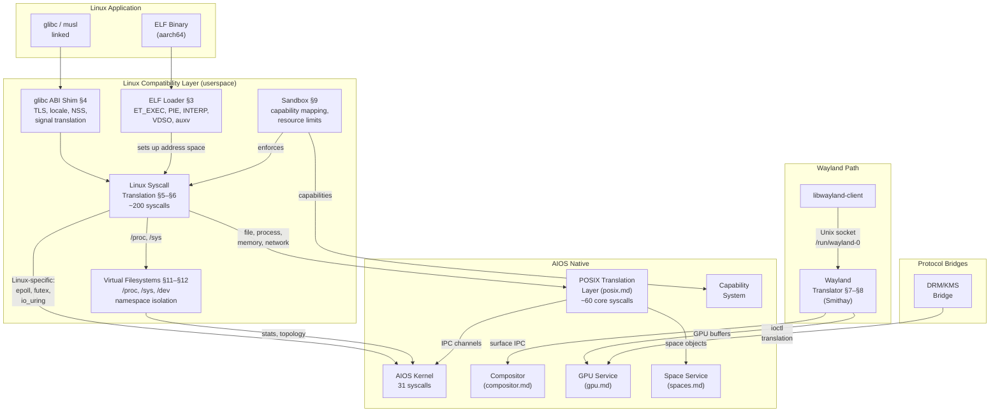
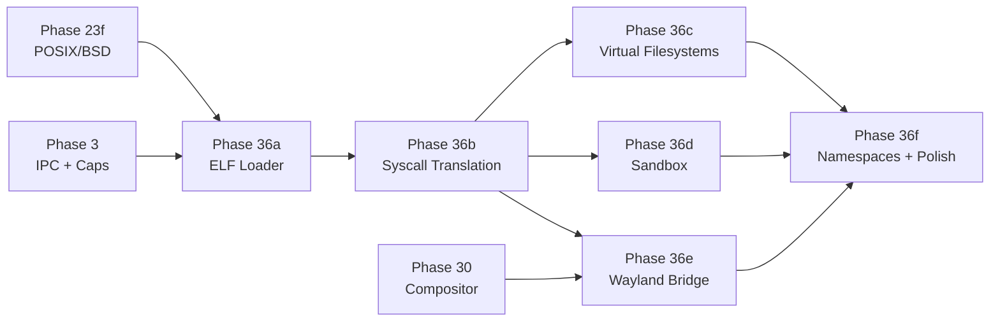

# AIOS Linux Binary & Wayland Compatibility

## Deep Technical Architecture

**Parent document:** [architecture.md](../project/architecture.md)
**Related:** [posix.md](./posix.md) — POSIX translation layer (Phase 23 foundation), [compositor/gpu.md](./compositor/gpu.md) §9 — Wayland translation layer, [model.md](../security/model.md) — Capability system, [subsystem-framework.md](./subsystem-framework.md) — PosixBridge trait, [development-plan.md](../project/development-plan.md) — Phase 36

**Note:** Linux binary compatibility builds on top of the Phase 23 POSIX translation layer. This document covers the Linux-specific extensions: ELF loading, ~200 Linux syscalls, /proc+/sys emulation, glibc shim, Wayland application integration, and sandboxing. The POSIX foundation (musl libc, FD table, path resolver, BSD tools) is documented in [posix.md](./posix.md).

-----

## Document Map

This document was split for navigability. Each sub-document preserves the original section numbers for cross-reference stability.

| Document | Sections | Content |
|---|---|---|
| **This file** | §1, §2, §14, §15, §16 | Core insight, architecture, implementation order, design principles, future directions |
| [elf-loader.md](./linux-compat/elf-loader.md) | §3, §4 | ELF loading (ET_EXEC, PIE, INTERP, VDSO, auxv), glibc ABI compatibility shim |
| [syscall-translation.md](./linux-compat/syscall-translation.md) | §5, §6 | ~200 Linux syscall translation table by category, deep dives: epoll, futex, io_uring, eventfd |
| [wayland-bridge.md](./linux-compat/wayland-bridge.md) | §7, §8 | Wayland bridge architecture, buffer pipeline, frame scheduling, XWayland extensions |
| [sandbox.md](./linux-compat/sandbox.md) | §9, §10 | Security and sandboxing model, portal services, comparison with Starnix/Linuxulator/WSL |
| [virtual-filesystems.md](./linux-compat/virtual-filesystems.md) | §11, §12 | /proc, /sys, /dev emulation; namespace and cgroup equivalents |
| [intelligence.md](./linux-compat/intelligence.md) | §13 | AI-native improvements, testing and validation strategy |

-----

## §1 Core Insight

The single biggest barrier to adopting any new operating system is the application gap. Users need their existing applications — web browsers, office suites, creative tools, development environments — and they need them on day one. History shows that technical excellence alone does not drive adoption: BeOS, OS/2, and Plan 9 all failed to displace incumbents despite compelling architectures, because users could not run their existing software.

AIOS solves this through a layered compatibility strategy. Phase 23 provides POSIX compatibility via musl libc and a translation layer that maps ~60 POSIX syscalls to AIOS's 31 native syscalls (see [posix.md](./posix.md) §1–§4). This gets BSD command-line tools running. Phase 36 extends this to full Linux binary compatibility — loading unmodified Linux aarch64 ELF binaries, translating ~200 Linux syscalls, emulating /proc and /sys, and bridging Wayland protocol for GUI applications. The combination means Firefox, GIMP, LibreOffice, VS Code, Blender, and thousands of other Linux applications run on AIOS without modification.

The compatibility layer is a **bridge, not a destination**. Native AIOS agents — capability-gated, semantically aware, integrated with the AI runtime — are the future of the platform. Linux compatibility eliminates the cold-start adoption barrier. As the AIOS-native ecosystem grows, developers can incrementally migrate their applications from the compatibility layer to native agents, gaining access to AIOS's semantic compositing, AI runtime integration, and fine-grained capability model.

### §1.1 What Linux Binary Compatibility Means

Linux binary compatibility means running **unmodified** Linux aarch64 ELF binaries on AIOS. No recompilation, no source modification, no special containers. A user can take a binary compiled on Ubuntu for aarch64, place it on AIOS, and run it. The binary observes a Linux-like environment: Linux syscall numbers, /proc and /sys filesystems, standard device nodes, and a Wayland display server. Under the surface, every operation is translated to AIOS-native syscalls and services.

### §1.2 Scope

Phase 36 targets **desktop Linux applications**, not server workloads or container runtimes:

- **In scope:** GUI applications (GTK, Qt, Electron), CLI tools beyond the BSD set, development tools (rustc, node, python), media applications, games (via Wayland + Vulkan)
- **In scope:** Wayland clients, X11 applications via XWayland, DRM/KMS-aware applications
- **Out of scope:** Linux kernel modules, container runtimes (Docker/Podman), KVM/QEMU, bpf programs, custom kernel syscalls
- **Out of scope:** x86/x86_64 binary translation — only aarch64 Linux binaries are supported

-----

## §2 Architecture

### §2.1 Full-Stack Overview



### §2.2 Layered Translation Model

The Linux compatibility layer is built as a series of translation stages, each narrowing the gap between the Linux ABI and AIOS native interfaces:

| Layer | Input | Output | Scope |
|---|---|---|---|
| **ELF Loader** (§3) | Linux ELF binary | Running process with mapped segments | Binary format, dynamic linking |
| **glibc Shim** (§4) | glibc-specific API calls | musl-compatible calls | C library ABI differences |
| **Linux Syscall Translation** (§5–§6) | Linux syscall numbers + args | AIOS syscall numbers + args | ~200 Linux syscalls → 31 AIOS syscalls |
| **POSIX Translation** (posix.md) | POSIX-level operations | AIOS IPC + Space operations | File I/O, process lifecycle, sockets |
| **Virtual Filesystems** (§11–§12) | /proc, /sys, /dev reads | Synthesized responses | Kernel state exposure |
| **Wayland Bridge** (§7–§8) | Wayland protocol messages | AIOS compositor IPC | Display and input |
| **Sandbox** (§9) | Capability checks | Allow/deny decisions | Security enforcement |

### §2.3 Dual Interception Paths

Linux binaries reach the compatibility layer through two paths, depending on how they were built:

**Path A — Library-level interception (musl-linked binaries):**
Binaries linked against musl (or statically linked against AIOS's musl port) call into the POSIX translation layer directly via modified `__syscall_dispatch()` in musl. This is the same path used by Phase 23 BSD tools. The Linux compatibility layer extends the dispatch table from ~60 POSIX syscalls to ~200 Linux syscalls.

**Path B — Trap-level interception (pre-compiled Linux binaries):**
Unmodified Linux binaries issue `SVC #0` with Linux syscall numbers in registers. The kernel's EL0 sync exception handler detects these as Linux syscalls (distinct ABI from AIOS native SVC) and routes them to a userspace translation handler via upcall. This path has slightly higher overhead (~100–200ns per syscall) but requires no binary modification.

The trap-level path is the primary path for Phase 36 — the whole point is running unmodified binaries. The library-level path is available for applications recompiled against AIOS's musl.

### §2.4 Comparison with Other Compatibility Approaches

| System | Approach | Kernel Changes | Syscall Coverage | GUI Support | Overhead |
|---|---|---|---|---|---|
| **AIOS** | Userspace translation (library + trap) | Minimal (upcall mechanism) | ~200 | Wayland bridge (Smithay) | Low (~100ns/syscall) |
| **Fuchsia Starnix** | Userspace Linux runner on Zircon | None (restricted mode) | ~350+ | Android (SurfaceFlinger) | Low–Medium |
| **FreeBSD Linuxulator** | Kernel-level syscall table | Significant (dual ABI) | ~300 | DRM/KMS passthrough | Very low |
| **WSL1** | Pico process + kernel translation | Significant (NT subsystem) | ~300 | None (deprecated) | Low |
| **WSL2** | Full Linux kernel in VM | None (lightweight VM) | Full | WSLg (RDP + Wayland) | Medium (VM overhead) |
| **gVisor** | Userspace kernel (Go) | Minimal (platform layer) | ~370 | None (server workloads) | Medium–High |

AIOS's approach is closest to Fuchsia Starnix: userspace translation with minimal kernel involvement. The key differences are that AIOS uses a Rust-based translation layer (Starnix uses Rust too, but runs as a Fuchsia component), and AIOS bridges Wayland directly to its native compositor rather than running a full Android stack.

-----

## §14 Implementation Order

Phase 36 builds on Phase 23 (POSIX compatibility) and Phase 30 (Portable UI Toolkit / Compositor). Implementation proceeds in six sub-phases:

```text
Phase 36a: ELF Loader and Trap Interception
           Depends on: Phase 23f (full POSIX), Phase 3 (process management)
           Deliverable: Static Linux ELF "Hello World" runs via trap path
           Key components: ELF loader (§3.1–§3.4), SVC trap routing

Phase 36b: Extended Syscall Translation
           Depends on: Phase 36a
           Deliverable: Linux CLI tools (coreutils) pass basic tests
           Key components: ~200 syscall table (§5.2), glibc shim (§4)

Phase 36c: Virtual Filesystem Emulation
           Depends on: Phase 36b
           Deliverable: /proc/self/maps, /proc/cpuinfo, /sys/class/* work
           Key components: procfs (§11.1), sysfs (§11.2), devtmpfs (§11.3)

Phase 36d: Sandbox and Security
           Depends on: Phase 36b, Phase 3 (capability system)
           Deliverable: Linux binaries run sandboxed with capability enforcement
           Key components: Threat model (§9.1), sandbox profiles (§9.3), portals (§9.5)

Phase 36e: Wayland Bridge
           Depends on: Phase 36b, Phase 30 (compositor operational)
           Deliverable: GTK/Qt Wayland applications display and accept input
           Key components: Wayland translator (§7), XWayland (§8), DRM bridge

Phase 36f: Namespace Isolation and Polish
           Depends on: Phase 36c, Phase 36d, Phase 36e
           Deliverable: Full Linux app compatibility with namespace isolation
           Key components: Namespaces (§12), cgroup mapping (§12.4),
                          io_uring (§6.3), performance optimization
```

### §14.1 Dependency Diagram



-----

## §15 Design Principles

1. **Userspace translation, not kernel personality.** The Linux compatibility layer is entirely userspace code. The AIOS kernel knows only its 31 native syscalls. No dual-ABI kernel, no Linux syscall table in the kernel. The kernel provides only a minimal upcall mechanism for trap-level interception.

2. **Layered on POSIX, not parallel to it.** Linux syscall translation calls into the POSIX translation layer for operations that map cleanly (file I/O, process lifecycle, sockets). Linux-specific syscalls (epoll, futex, io_uring) are translated directly to AIOS primitives. This avoids duplicating the ~60 POSIX syscalls already translated.

3. **Unmodified binaries are the goal.** The compatibility layer must run pre-compiled Linux aarch64 ELF binaries without any modification. Recompilation against AIOS's musl is an optimization, not a requirement.

4. **Security by default.** Every Linux binary runs sandboxed with a minimal capability set. Capabilities are granted explicitly — by user prompt, by manifest, or by portal service. No Linux binary gets ambient authority.

5. **Bridge, not destination.** Linux compatibility exists to eliminate the adoption barrier. Native AIOS agents are the future. The translation layer is a migration path. Design decisions should favor simplicity of the bridge over perfection of the emulation.

6. **Translate the subset that matters.** Linux has ~400+ syscalls. Desktop applications use ~150–200. Server workloads, container runtimes, and BPF programs use the rest. Phase 36 targets desktop applications — implement what Firefox, GIMP, and VS Code need.

7. **Fail loudly on unsupported operations.** When a Linux binary calls an unsupported syscall, return `-ENOSYS` and log an audit event. Do not silently succeed with incorrect behavior. Users and developers need clear signals about what works and what does not.

8. **Zero-copy where the data path is hot.** Wayland buffer sharing, file I/O, and IPC should use AIOS shared memory for zero-copy transfers. The translation layer adds metadata overhead, not data copying overhead.

9. **Composable sandboxing.** Sandbox profiles are composable from individual capabilities. The "GUI app" profile adds display capability to the base profile. The "network app" profile adds network capability. Profiles combine cleanly — a "networked GUI app" is the union of both profiles.

10. **AI-aware compatibility.** The AIRS can learn which syscalls an application uses, predict resource needs, detect anomalous behavior, and recommend sandbox policies. The compatibility layer is instrumented for AI observability from day one.

-----

## §16 Future Directions

- **x86_64 binary translation** — QEMU user-mode or Rosetta-style JIT for running x86_64 Linux binaries on aarch64 (post-Phase 36)
- **Android application support** — ART runtime + Android framework on top of Linux compat layer, similar to Chrome OS's ARC++ or Waydroid
- **Container runtime support** — Minimal OCI runtime for Docker/Podman images, using AIOS namespace equivalents
- **Flatpak runtime hosting** — Run Flatpak applications with AIOS providing the sandbox and portal services natively
- **Wine/Proton integration** — Windows application compatibility via Wine running in the Linux compat layer
- **Automatic migration tooling** — AI-assisted migration from Linux applications to native AIOS agents, analyzing syscall usage and suggesting AIOS-native replacements
- **Formal verification** — Prove correctness of critical translation paths (syscall argument marshaling, capability checks) using property-based testing and model checking

See [intelligence.md](./linux-compat/intelligence.md) §13 for AI-native improvements to the compatibility layer.

-----

## Cross-Reference Index

| Section | Sub-document | Topic |
|---|---|---|
| §1 | This file | Core insight and scope |
| §2 | This file | Architecture, layered model, comparison table |
| §3 | [elf-loader.md](./linux-compat/elf-loader.md) | ELF format support, segment loading, ASLR |
| §3.2 | [elf-loader.md](./linux-compat/elf-loader.md) | Dynamic linker (ld-linux-aarch64.so.1) |
| §3.3 | [elf-loader.md](./linux-compat/elf-loader.md) | VDSO injection |
| §3.4 | [elf-loader.md](./linux-compat/elf-loader.md) | Auxiliary vector (auxv) |
| §4 | [elf-loader.md](./linux-compat/elf-loader.md) | glibc ABI compatibility shim |
| §4.3 | [elf-loader.md](./linux-compat/elf-loader.md) | Signal handling translation |
| §5 | [syscall-translation.md](./linux-compat/syscall-translation.md) | Translation architecture, dispatch paths |
| §5.2 | [syscall-translation.md](./linux-compat/syscall-translation.md) | ~200 syscall table by category |
| §6 | [syscall-translation.md](./linux-compat/syscall-translation.md) | Deep dives: epoll, futex, io_uring, eventfd |
| §7 | [wayland-bridge.md](./linux-compat/wayland-bridge.md) | Wayland bridge integration architecture |
| §7.2 | [wayland-bridge.md](./linux-compat/wayland-bridge.md) | Buffer sharing pipeline |
| §8 | [wayland-bridge.md](./linux-compat/wayland-bridge.md) | XWayland and X11 compatibility |
| §9 | [sandbox.md](./linux-compat/sandbox.md) | Security and sandboxing model |
| §9.3 | [sandbox.md](./linux-compat/sandbox.md) | Sandbox profiles |
| §9.5 | [sandbox.md](./linux-compat/sandbox.md) | Portal services architecture |
| §10 | [sandbox.md](./linux-compat/sandbox.md) | Comparison with other compat layers |
| §11 | [virtual-filesystems.md](./linux-compat/virtual-filesystems.md) | /proc, /sys, /dev emulation |
| §12 | [virtual-filesystems.md](./linux-compat/virtual-filesystems.md) | Namespace and cgroup equivalents |
| §13 | [intelligence.md](./linux-compat/intelligence.md) | AI-native improvements, testing strategy |
| §14 | This file | Implementation order |
| §15 | This file | Design principles |
| §16 | This file | Future directions |
