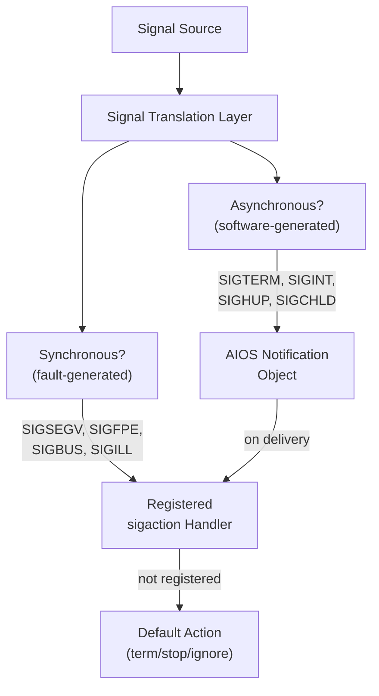

# AIOS Linux ELF Loader & glibc Compatibility

Part of: [linux-compat.md](../linux-compat.md) — Linux Binary & Wayland Compatibility
**Related:** [posix.md](../posix.md) §4 — musl libc and syscall dispatch, [virtual.md](../../kernel/memory/virtual.md) §5 — Per-agent address spaces, [syscall-translation.md](./syscall-translation.md) — Linux syscall translation

-----

## §3 ELF Loader for Linux Binaries

The ELF loader is the entry point of the Linux compatibility layer. It takes an unmodified Linux aarch64 ELF binary and sets up a process address space that looks exactly like what the binary expects on a Linux system — mapped segments, dynamic linker, VDSO page, auxiliary vector on the stack, and a Linux-compatible memory layout.

AIOS already has a minimal ELF loader in the UEFI stub (`uefi-stub/src/elf.rs`) that loads the kernel itself. The Linux ELF loader extends this to handle the full complexity of Linux user-space ELF binaries: dynamically linked executables, position-independent executables (PIE), interpreter invocation, and the rich auxiliary vector that glibc and musl expect at process startup.

### §3.1 ELF Format Support

#### §3.1.1 Supported ELF Types

| ELF Type | `e_type` | Description | ASLR | Use Case |
|---|---|---|---|---|
| ET_EXEC | 2 | Static executable, fixed address | No (fixed base) | Legacy binaries, simple tools |
| ET_DYN | 3 | Position-independent executable (PIE) or shared library | Yes (randomized base) | Modern binaries (default since GCC 8+) |

ET_DYN (PIE) is the default output of modern Linux toolchains. The loader assigns a randomized base address for PIE binaries, providing ASLR. ET_EXEC binaries are loaded at their fixed `p_vaddr` addresses — the loader must ensure these addresses are available in the process address space.

#### §3.1.2 ELF Header Validation

The loader validates:

```rust
pub fn validate_elf_header(ehdr: &Elf64Ehdr) -> Result<(), ElfError> {
    // Magic number
    if ehdr.e_ident[0..4] != [0x7f, b'E', b'L', b'F'] {
        return Err(ElfError::InvalidMagic);
    }
    // 64-bit ELF
    if ehdr.e_ident[4] != 2 { return Err(ElfError::Not64Bit); }
    // Little-endian
    if ehdr.e_ident[5] != 1 { return Err(ElfError::NotLittleEndian); }
    // aarch64
    if ehdr.e_machine != 183 { return Err(ElfError::WrongArchitecture); }
    // Executable or shared object (PIE)
    if ehdr.e_type != 2 && ehdr.e_type != 3 {
        return Err(ElfError::UnsupportedType);
    }
    Ok(())
}
```

#### §3.1.3 Program Header Processing

The loader processes these program header types:

| `p_type` | Name | Handling |
|---|---|---|
| `PT_LOAD` (1) | Loadable segment | Map into address space with correct permissions |
| `PT_INTERP` (3) | Interpreter path | Load the dynamic linker (§3.2) |
| `PT_NOTE` (4) | Notes | Parse for GNU ABI tag, build ID |
| `PT_GNU_EH_FRAME` (0x6474e550) | Exception frame | Register for C++ exception unwinding |
| `PT_GNU_STACK` (0x6474e551) | Stack permissions | Check if executable stack is requested (deny by default) |
| `PT_GNU_RELRO` (0x6474e552) | Read-only after relocation | Mark pages read-only after dynamic linker finishes |
| `PT_PHDR` (6) | Program header table | Self-reference for AT_PHDR |
| `PT_TLS` (7) | Thread-local storage | Set up initial TLS block (§4.1) |
| `PT_DYNAMIC` (2) | Dynamic linking info | Pass to dynamic linker |

#### §3.1.4 Segment Loading

For each `PT_LOAD` segment:

1. **Calculate page-aligned boundaries:**
   - `map_start = p_vaddr & ~0xFFF` (page-aligned down)
   - `map_end = (p_vaddr + p_memsz + 0xFFF) & ~0xFFF` (page-aligned up)
   - For PIE: add randomized base offset to all addresses

2. **Allocate pages** in the process address space via `UserAddressSpace::map_region()`

3. **Set permissions** from `p_flags`:
   | `p_flags` | Mapping | Notes |
   |---|---|---|
   | `PF_R` | Read-only | Data, rodata |
   | `PF_R \| PF_W` | Read-write | Writable data, BSS |
   | `PF_R \| PF_X` | Read-execute | Code (text) |
   | `PF_R \| PF_W \| PF_X` | **Denied** | W^X enforcement — no writable+executable pages |

4. **Copy file data** (`p_filesz` bytes from `p_offset`) into mapped pages

5. **Zero BSS** region (`p_memsz - p_filesz` bytes after file data)

W^X enforcement is strict: if a Linux binary requests a writable+executable segment (`PF_W | PF_X`), the loader denies it and logs an audit event. Applications requiring JIT compilation (JavaScript engines, .NET runtime) must use `mmap()` + `mprotect()` to transition pages between writable and executable states — the standard approach on modern Linux with SELinux enforcing.

### §3.2 Dynamic Linker

Most Linux binaries are dynamically linked. The `PT_INTERP` program header specifies the path to the dynamic linker (typically `/lib/ld-linux-aarch64.so.1` for glibc or `/lib/ld-musl-aarch64.so.1` for musl).

#### §3.2.1 Dynamic Linker Strategy

AIOS ships its own dynamic linker based on musl's `ld-musl-aarch64.so.1`. This linker is modified to:

1. Resolve libraries from AIOS space objects (not raw filesystem paths)
2. Use the POSIX translation layer for file operations
3. Support glibc symbol versioning (§4.2) for compatibility with glibc-linked binaries

When a binary specifies `/lib/ld-linux-aarch64.so.1` (glibc's linker), the path is redirected to AIOS's musl-based linker. The musl linker can load glibc-linked shared libraries because:

- ELF dynamic linking is an ABI, not a library — the linker resolves symbols by name
- glibc symbol versioning is supported via a compatibility shim (§4.2)
- TLS variant differences are handled by the shim layer (§4.1)

#### §3.2.2 Library Search Paths

The dynamic linker searches for shared libraries in this order:

```text
1. DT_RPATH / DT_RUNPATH in the ELF binary (if present)
2. LD_LIBRARY_PATH environment variable (if set and not in secure mode)
3. /lib/aarch64-linux-gnu/        → system space: base Linux libraries
4. /usr/lib/aarch64-linux-gnu/    → system space: additional libraries
5. /lib/                          → system space: base libraries
6. /usr/lib/                      → system space: additional libraries
7. /usr/local/lib/                → user space: user-installed libraries
```

Library files are stored as space objects in the system space. The path resolver translates filesystem paths to space object lookups (cross-ref: [posix.md](../posix.md) §6).

#### §3.2.3 LD_PRELOAD and LD_LIBRARY_PATH

- `LD_PRELOAD`: supported — preloaded libraries are loaded before the binary's own dependencies
- `LD_LIBRARY_PATH`: supported — additional search paths prepended to the default
- **Secure mode**: when the binary has setuid/setgid flags (which are virtual in AIOS sandboxes), `LD_PRELOAD` and `LD_LIBRARY_PATH` are ignored. This prevents library injection attacks against privilege boundaries, even though the privilege boundary is virtual.

#### §3.2.4 Relocation Processing

The dynamic linker processes these aarch64 relocation types:

| Relocation | Code | Description |
|---|---|---|
| `R_AARCH64_RELATIVE` | 1027 | Base + addend (most common in PIE) |
| `R_AARCH64_GLOB_DAT` | 1025 | GOT entry for global symbol |
| `R_AARCH64_JUMP_SLOT` | 1026 | PLT entry for function call |
| `R_AARCH64_ABS64` | 257 | Absolute 64-bit symbol reference |
| `R_AARCH64_TLS_TPREL` | 1030 | TLS offset from thread pointer |
| `R_AARCH64_TLSDESC` | 1031 | TLS descriptor (lazy TLS) |
| `R_AARCH64_COPY` | 1024 | Copy data from shared library |
| `R_AARCH64_IRELATIVE` | 1032 | Indirect function (GNU ifunc) |

Lazy binding via PLT is supported: function addresses are resolved on first call. `LD_BIND_NOW=1` forces eager binding (all symbols resolved at load time).

### §3.3 VDSO Injection

The Virtual Dynamic Shared Object (VDSO) is a small shared library mapped into every Linux process by the kernel. It provides fast-path implementations of frequently called syscalls that can be serviced without a full kernel trap.

#### §3.3.1 AIOS VDSO Contents

AIOS synthesizes a VDSO page and maps it into every Linux process address space. The VDSO exports these functions:

| Function | Implementation | Performance |
|---|---|---|
| `__vdso_clock_gettime` | Read mapped timer page (CNTPCT_EL0 snapshot) | ~5ns (no syscall) |
| `__vdso_gettimeofday` | Wrapper around clock_gettime(CLOCK_REALTIME) | ~5ns |
| `__vdso_clock_getres` | Return static resolution (1ns for CLOCK_MONOTONIC) | ~2ns |
| `__vdso_time` | Seconds since epoch from mapped page | ~3ns |
| `__vdso_getcpu` | Read current CPU ID from TPIDR_EL0 | ~2ns |

#### §3.3.2 Timer Page Architecture

The VDSO reads time from a shared page mapped read-only into every process:

```rust
#[repr(C)]
pub struct VdsoTimePage {
    seq_count: u32,           // seqlock counter (even = valid)
    _pad: u32,
    wall_time_sec: u64,       // seconds since Unix epoch
    wall_time_nsec: u64,      // nanoseconds within second
    monotonic_sec: u64,       // monotonic seconds
    monotonic_nsec: u64,      // monotonic nanoseconds
    timer_freq: u64,          // CNTFRQ_EL0 (62500000 on QEMU)
    timer_count: u64,         // CNTPCT_EL0 snapshot at last update
    tai_offset: i32,          // UTC-TAI offset
    _reserved: [u8; 20],      // future use
}
```

The kernel timer tick handler updates this page every 1ms (1 kHz tick rate). The VDSO function reads the page with seqlock protocol:

```rust
fn vdso_clock_gettime_monotonic() -> Timespec {
    loop {
        let seq = page.seq_count.load(Acquire);
        if seq & 1 != 0 { continue; }  // writer active, retry

        let base_sec = page.monotonic_sec;
        let base_nsec = page.monotonic_nsec;
        let base_count = page.timer_count;
        let freq = page.timer_freq;

        if page.seq_count.load(Acquire) != seq { continue; }  // torn read, retry

        // Interpolate from hardware counter
        let now_count = read_cntpct_el0();
        let delta_count = now_count - base_count;
        let delta_nsec = delta_count * 1_000_000_000 / freq;

        return Timespec {
            tv_sec: base_sec + (base_nsec + delta_nsec) / 1_000_000_000,
            tv_nsec: (base_nsec + delta_nsec) % 1_000_000_000,
        };
    }
}
```

This gives nanosecond-resolution time without any syscall overhead — critical for applications that call `clock_gettime()` thousands of times per second (event loops, profilers, database query timing).

#### §3.3.3 VDSO ELF Structure

The VDSO is a valid ELF shared object with:

- `PT_LOAD` segment containing the code
- `.dynsym` / `.dynstr` sections for symbol lookup
- `.note.linux.version` with fake Linux kernel version
- `SONAME`: `linux-vdso.so.1`

The VDSO address is communicated to the process via `AT_SYSINFO_EHDR` in the auxiliary vector (§3.4).

### §3.4 Auxiliary Vector (auxv)

The auxiliary vector is an array of key-value pairs placed on the initial stack, after `argv` and `envp`. The dynamic linker and C runtime library read it to discover system properties.

#### §3.4.1 Constructed Auxiliary Vector

| Key | Value | Source |
|---|---|---|
| `AT_SYSINFO_EHDR` (33) | VDSO page address | VDSO mapping (§3.3) |
| `AT_PHDR` (3) | Address of program headers | ELF loading (§3.1) |
| `AT_PHENT` (4) | Size of program header entry | 56 (sizeof Elf64_Phdr) |
| `AT_PHNUM` (5) | Number of program headers | From ELF header |
| `AT_PAGESZ` (6) | Page size | 4096 |
| `AT_BASE` (7) | Dynamic linker base address | Linker mapping (§3.2) |
| `AT_FLAGS` (8) | Flags | 0 |
| `AT_ENTRY` (9) | Program entry point | `e_entry` (+ PIE offset) |
| `AT_UID` (11) | Real user ID | Virtual UID from sandbox |
| `AT_EUID` (12) | Effective user ID | Virtual UID (same as real) |
| `AT_GID` (13) | Real group ID | Virtual GID from sandbox |
| `AT_EGID` (14) | Effective group ID | Virtual GID (same as real) |
| `AT_PLATFORM` (15) | Platform string | "aarch64" |
| `AT_HWCAP` (16) | Hardware capabilities | aarch64 feature flags (FP, ASIMD, AES, SHA1, SHA2, CRC32, ATOMICS, etc.) |
| `AT_HWCAP2` (26) | Extended hardware capabilities | Additional aarch64 features (SVE, BF16, etc.) |
| `AT_CLKTCK` (17) | Clock ticks per second | 100 (Linux standard USER_HZ) |
| `AT_RANDOM` (25) | 16 random bytes | AIOS RNG |
| `AT_EXECFN` (31) | Executable filename | Path used in execve() |
| `AT_NULL` (0) | Terminator | 0 |

#### §3.4.2 AT_HWCAP Feature Flags

The `AT_HWCAP` value communicates CPU feature availability. On aarch64, this is a bitmask:

```text
Bit  0: FP       — VFP/floating-point
Bit  1: ASIMD    — Advanced SIMD (NEON)
Bit  2: EVTSTRM  — Event stream (timer-based)
Bit  3: AES      — AES instructions
Bit  4: PMULL    — Polynomial multiply long
Bit  5: SHA1     — SHA-1 instructions
Bit  6: SHA2     — SHA-256 instructions
Bit  7: CRC32    — CRC-32 instructions
Bit  8: ATOMICS  — Large System Extensions (LSE) atomics
Bit  9: FPHP     — Half-precision floating-point
Bit 10: ASIMDHP  — Advanced SIMD half-precision
...
```

The loader queries `ID_AA64ISAR0_EL1`, `ID_AA64ISAR1_EL1`, `ID_AA64MMFR0_EL1`, and `ID_AA64PFR0_EL1` system registers (via kernel helper) to construct the correct feature mask for the actual hardware. On QEMU, this reflects the `cortex-a72` CPU model.

#### §3.4.3 Initial Stack Layout

The initial stack is constructed to match the Linux aarch64 ABI:

```text
High address
┌────────────────────────┐
│ Platform string        │  "aarch64\0"
│ Random bytes (16)      │  AT_RANDOM data
│ Executable filename    │  AT_EXECFN data
│ Environment strings    │  "PATH=/usr/bin\0", "HOME=/home/user\0", ...
│ Argument strings       │  "program\0", "arg1\0", "arg2\0", ...
├────────────────────────┤  (aligned to 16 bytes)
│ AT_NULL (0, 0)         │  auxiliary vector terminator
│ AT_RANDOM (25, ptr)    │  ← points to random bytes above
│ AT_HWCAP (16, flags)   │
│ ...                    │  remaining auxv entries
│ AT_SYSINFO_EHDR (33, p)│  ← VDSO address
├────────────────────────┤
│ NULL                   │  envp terminator
│ envp[N-1]              │  ← pointers to env strings above
│ ...                    │
│ envp[0]                │
├────────────────────────┤
│ NULL                   │  argv terminator
│ argv[argc-1]           │  ← pointers to arg strings above
│ ...                    │
│ argv[0]                │
├────────────────────────┤
│ argc                   │  argument count
└────────────────────────┘
Low address (SP at entry)
```

The stack pointer at process entry points to `argc`. The C runtime (`_start` in crt1.o) reads `argc`, `argv`, `envp`, and `auxv` from the stack and passes them to `__libc_start_main` → `main()`.

-----

## §4 glibc ABI Compatibility Shim

Most Linux distributions ship binaries linked against glibc (the GNU C Library). AIOS uses musl as its C library. While both implement POSIX, they differ in several ABI-level details that cause glibc-linked binaries to crash or misbehave on musl. The glibc ABI shim bridges these differences.

### §4.1 ABI Differences: glibc vs musl

| Feature | glibc | musl | Impact |
|---|---|---|---|
| **TLS model** | Variant I (TP at start of TLS block) | Variant I (same on aarch64) | Low — same on aarch64, differs on x86 |
| **Thread implementation** | NPTL (kernel threads + futex) | Custom (kernel threads + futex) | Medium — internal structures differ |
| **Locale** | mmap'd locale archives, extensive locale support | UTF-8 only, minimal locale | High — apps expecting LC_ALL=de_DE.UTF-8 get degraded |
| **NSS** | dlopen() plugin system (nsswitch.conf) | Static resolution | High — apps using NSS for user/group lookup |
| **Symbol versioning** | GLIBC_2.17, GLIBC_2.28, etc. | No versioning | High — linker must resolve versioned symbols |
| **malloc** | ptmalloc2 (per-thread arenas) | Simple bump/free | Medium — different allocation patterns |
| **stdio** | FILE struct with internal buffer | Different FILE struct | High — direct FILE* field access breaks |
| **Error codes** | Some Linux-specific extensions | Strict POSIX subset | Low — most apps use standard errno values |
| **DNS resolution** | Full resolver with EDNS, DNSSEC | Simple resolver | Medium — complex DNS configs may not work |
| **iconv** | Supports 200+ character encodings | ~60 encodings via built-in tables | Medium — rare encodings may fail |

### §4.2 Shim Library Architecture

The glibc compatibility shim is a shared library (`libgcompat.so.0`) loaded via `LD_PRELOAD` for glibc-linked binaries. It intercepts glibc-specific function calls and translates them to musl-compatible operations.

#### §4.2.1 Symbol Versioning Support

glibc uses ELF symbol versioning to maintain backward compatibility. A binary linked against glibc 2.17 references symbols tagged with `GLIBC_2.17`. The shim provides versioned symbol definitions:

```rust
// Pseudo-code for version map
pub struct GlibcVersionMap {
    versions: BTreeMap<&'static str, Vec<SymbolMapping>>,
}

pub struct SymbolMapping {
    name: &'static str,
    glibc_version: &'static str,  // e.g., "GLIBC_2.17"
    musl_symbol: &'static str,    // musl equivalent
    wrapper: Option<fn()>,        // ABI translation wrapper
}
```

The dynamic linker resolves versioned symbol lookups through the shim's version map. Most symbols map directly (same name, same ABI). A small subset requires wrappers.

#### §4.2.2 Intercepted Functions

| Function | glibc Behavior | Shim Translation |
|---|---|---|
| `__cxa_thread_atexit_impl` | Register thread-exit destructor | Forward to musl `__cxa_thread_atexit` |
| `__register_atfork` | Register fork handlers | Forward to musl `pthread_atfork` |
| `__libc_start_main` | glibc-specific entry point | Translate to musl's init sequence |
| `getauxval` | Read auxiliary vector | Read from AIOS-constructed auxv |
| `dl_iterate_phdr` | Iterate loaded ELF objects | Walk dynamic linker's link map |
| `gnu_get_libc_version` | Return "2.31" etc. | Return compatibility version |
| `confstr` | System configuration strings | Return AIOS-appropriate values |
| `realpath` | Resolve path (glibc uses `__getcwd`) | Use musl's implementation |
| `obstack_*` | GNU obstack allocator | Stub (allocate from heap) |
| `argp_*` | GNU argument parser | Stub (no-op or use getopt) |

#### §4.2.3 GNU Hash Table Support

glibc uses a GNU-specific hash table format (`.gnu.hash`) for faster symbol lookup in addition to the standard SYSV hash table (`.hash`). The dynamic linker supports both formats:

- **SYSV hash**: standard bucket-chain hash, O(n) worst case
- **GNU hash**: Bloom filter + bucket-chain, O(1) average case
- The linker checks for `.gnu.hash` first, falls back to `.hash`

### §4.3 Signal Handling Translation

Linux signals are a complex interface. AIOS does not implement POSIX signals natively — it uses capability-gated notification objects. The compatibility layer translates between the two models.

#### §4.3.1 Signal Delivery Model



#### §4.3.2 Synchronous Signals (Fault-Generated)

These signals are generated by hardware faults and delivered synchronously to the faulting thread:

| Signal | Trigger | AIOS Source |
|---|---|---|
| SIGSEGV (11) | Invalid memory access | Data/instruction abort (EL0) |
| SIGBUS (7) | Misaligned access | Alignment fault (EL0) |
| SIGFPE (8) | Division by zero, overflow | FPU exception |
| SIGILL (4) | Illegal instruction | Undefined instruction trap |
| SIGTRAP (5) | Breakpoint, single-step | BRK instruction, debug exception |

For synchronous signals, the kernel's EL0 abort handler constructs a `siginfo_t` and invokes the registered signal handler directly (via the signal trampoline on the user stack). This is the same mechanism used on Linux.

#### §4.3.3 Asynchronous Signals (Software-Generated)

These signals are generated by software (other processes, kernel, timer) and delivered asynchronously:

| Signal | Trigger | AIOS Translation |
|---|---|---|
| SIGTERM (15) | Process termination request | Notification with SIGNAL_TERM mask |
| SIGINT (2) | Ctrl+C | Terminal input → notification |
| SIGHUP (1) | Terminal hangup | Terminal session close → notification |
| SIGCHLD (17) | Child process state change | Process death notification |
| SIGALRM (14) | Timer expiry | Timer notification |
| SIGUSR1/2 (10/12) | User-defined | Generic notification with signal number |
| SIGPIPE (13) | Write to broken pipe | Channel closed → notification |
| SIGWINCH (28) | Terminal resize | Terminal resize event → notification |

Asynchronous signals are delivered via AIOS notification objects. The signal translation layer registers a notification handler that, when fired, constructs the appropriate signal context and calls the registered `sigaction` handler on the target thread.

#### §4.3.4 Signal Stack and Trampoline

When a signal handler is invoked, the translation layer:

1. Saves the current thread context (registers) to the signal frame on the user stack (or `sigaltstack` if configured)
2. Constructs a `ucontext_t` with:
   - `uc_mcontext`: saved general-purpose registers, PSTATE, fault address
   - `uc_sigmask`: current signal mask
   - `uc_stack`: signal stack info
3. Sets up a signal trampoline (`__restore_rt`) that calls `rt_sigreturn` to restore context
4. Jumps to the signal handler

The signal frame layout matches the Linux aarch64 ABI so that signal handlers compiled for Linux work correctly.

#### §4.3.5 Signal Mask Translation

- `rt_sigprocmask(how, set, oldset)` → per-thread signal mask maintained in translation layer state
- `SIG_BLOCK`: add signals to mask (defer delivery)
- `SIG_UNBLOCK`: remove signals from mask (deliver pending)
- `SIG_SETMASK`: replace mask entirely
- Masked signals are queued in the notification object; delivered when unmasked
- `rt_sigpending` → check for queued signals matching current mask

### §4.4 Thread Translation

Linux threads are created via `clone()` with specific flags. The translation layer maps this to AIOS thread creation:

| `clone` Flag | Purpose | AIOS Translation |
|---|---|---|
| `CLONE_VM` | Share address space | Same AIOS process (default) |
| `CLONE_FS` | Share filesystem info | Share FD table and cwd |
| `CLONE_FILES` | Share file descriptor table | Share FD table reference |
| `CLONE_SIGHAND` | Share signal handlers | Share signal handler table |
| `CLONE_THREAD` | Same thread group | Create thread in same AIOS process |
| `CLONE_PARENT_SETTID` | Set TID in parent | Write ThreadId to parent address |
| `CLONE_CHILD_CLEARTID` | Clear TID on child exit | futex wake on exit (§6.2) |
| `CLONE_SETTLS` | Set TLS pointer | Set TPIDR_EL0 for new thread |

`clone()` without `CLONE_VM` (i.e., `fork()`) creates a new AIOS process with copied address space (COW). Cross-ref: [posix.md](../posix.md) §7 for fork/exec translation details.
