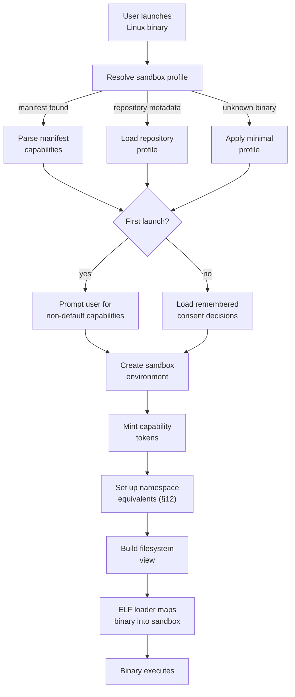
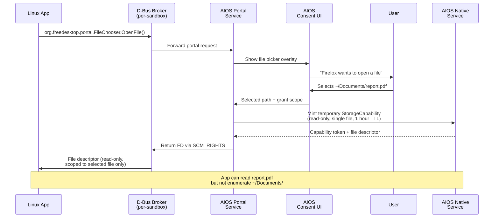

# AIOS Linux Binary Security & Sandboxing

Part of: [linux-compat.md](../linux-compat.md) — Linux Binary & Wayland Compatibility
**Related:** [model.md](../../security/model.md) — Security model and capability system, [capabilities.md](../../security/model/capabilities.md) §3 — Capability internals, [compositor/gpu.md](../compositor/gpu.md) §9.5 — Wayland security context

-----

## §9 Security & Sandboxing Model

Linux binaries are **untrusted by default**. Unlike native AIOS agents — which are capability-gated from creation, explicitly declare their requirements in a manifest, and undergo intent verification by the AIRS — Linux binaries arrive from external sources with no capability declarations, no semantic metadata, and no behavioral contracts. The sandboxing model treats every Linux binary as a potential adversary and grants capabilities only through explicit user consent, curated sandbox profiles, or portal-mediated interactions.

### §9.1 Threat Model for Linux Binaries

The threat model for Linux binaries extends AIOS's general threat model (see [model.md](../../security/model.md) §1) with additional attack vectors specific to compatibility layers:

**Syscall abuse.** Linux binaries may attempt any of the ~400 Linux syscalls, including those that would break isolation if translated naively. Dangerous syscalls include:
- `ptrace(PTRACE_ATTACH)` — attach to other processes for debugging or injection
- `mount` / `umount` — alter the filesystem namespace
- `reboot` / `kexec_load` — system-level operations
- `chroot` / `pivot_root` — escape sandbox filesystem view
- `unshare` / `setns` — manipulate namespace isolation
- `init_module` / `finit_module` — load kernel modules
- `bpf` — install BPF programs for packet filtering or tracing
- `userfaultfd` — page fault handling that can be abused for timing attacks

**Filesystem traversal.** Applications may attempt to read files outside their sandbox boundary: `/etc/shadow`, `/etc/passwd`, other users' home directories, AIOS system spaces, or the host kernel's `/proc/kcore`. The virtual filesystem layer (see [virtual-filesystems.md](./virtual-filesystems.md) §11) provides a filtered view, but the sandbox must enforce these boundaries at the syscall translation layer as well.

**Information leaks via /proc.** Linux's `/proc` filesystem exposes extensive system state. Without filtering:
- `/proc/[pid]/*` reveals other processes (command lines, memory maps, open files)
- `/proc/kallsyms` and `/proc/kcore` expose kernel addresses
- `/proc/stat` and `/proc/interrupts` provide timing information for side-channel attacks
- `/proc/net/*` reveals network connections of other sandboxes

**GPU side-channels.** Shared GPU memory and timing can leak data between sandboxes. A sandboxed application with GPU access may:
- Read uninitialized GPU memory from other clients (GPU memory not zeroed between allocations)
- Exploit GPU shader timing to infer data processed by other clients
- Overflow GPU command buffers to corrupt other clients' rendering state

**Network exfiltration.** Applications may attempt to exfiltrate sensitive data via:
- Direct TCP/UDP connections to attacker-controlled servers
- DNS tunneling (encoding data in DNS queries)
- ICMP tunneling (if raw sockets are available)
- Covert channels via HTTP request patterns to legitimate services

**Privilege escalation.** Linux binaries may attempt to escalate privileges through:
- Setuid/setgid binaries (which AIOS does not honor — UID/GID is virtual)
- Exploiting TOCTOU races in capability checks
- Confused deputy attacks against portal services
- Stack-based attacks exploiting the translation layer itself

**Clipboard and input attacks.** Without sandbox isolation:
- Applications can read clipboard contents without user knowledge
- Applications can synthesize keyboard and mouse events to manipulate other windows
- Applications can monitor global keyboard input (keylogging)
- Applications can capture screenshots of other windows

**Resource exhaustion.** Denial-of-service within the sandbox boundary:
- Fork bombs (spawning processes until limits are hit)
- Memory exhaustion (malloc until OOM)
- Disk filling (writing to sandbox home until quota is exceeded)
- CPU monopolization (tight loops or crypto mining)
- File descriptor exhaustion
- IPC channel flooding

#### Trust Level Assignment

Every Linux binary is assigned a trust level that determines its default capability set:

| Binary Source | Default Trust Level | Rationale |
|---|---|---|
| System packages (BSD tools, shipped with AIOS) | TL2 (trusted native) | Signed by AIOS root key, reviewed, POSIX-only syscalls |
| User-installed native AIOS agents | TL2–TL3 (per manifest) | Manifest declares capabilities, user approves at install |
| Linux binary from curated repository | TL3 (untrusted) | Repository provides sandbox profile metadata |
| User-downloaded Linux binary (unknown source) | TL3 (untrusted) | Minimal sandbox, no capabilities beyond filesystem |
| XWayland client (X11 protocol) | TL3 (untrusted) | X11 protocol provides no security context; see [compositor/gpu.md](../compositor/gpu.md) §9.5 |
| Flatpak application (future) | TL3 (untrusted) | Flatpak manifest translated to sandbox profile |

Trust levels map directly to AIOS's four-tier trust model (see [model.md](../../security/model.md) §1.2). Linux binaries never receive TL0 (kernel) or TL1 (system service) trust. The highest trust available to a Linux binary is TL2 for system-shipped BSD tools that have been audited and signed.

Cross-ref: [model.md](../../security/model.md) §1 (AIOS threat model), [layers.md](../../security/model/layers.md) §2 (eight defense layers)

### §9.2 Capability Mapping for Linux Processes

Linux has its own capability system (`CAP_NET_RAW`, `CAP_SYS_ADMIN`, etc. — see `capabilities(7)`). AIOS does not implement Linux capabilities directly. Instead, the sandbox translates Linux capability checks into AIOS capability token lookups. When a Linux binary's syscall requires a Linux capability, the translation layer checks whether the corresponding AIOS capability token exists in the process's capability table.

#### Linux-to-AIOS Capability Translation Table

| Linux Capability | AIOS Equivalent | Default for Sandbox | Notes |
|---|---|---|---|
| `CAP_NET_RAW` | `NetworkCapability { raw: true }` | Denied | Raw sockets — rarely needed for desktop apps |
| `CAP_NET_BIND_SERVICE` | `NetworkCapability { bind_privileged: true }` | Denied | Binding ports < 1024 |
| `CAP_NET_ADMIN` | `NetworkCapability { admin: true }` | Denied | Network interface configuration |
| `CAP_SYS_PTRACE` | `ProcessCapability { debug: true }` | Denied | Debugging other processes |
| `CAP_SYS_ADMIN` | (No equivalent — too broad) | Denied | Linux catch-all capability; always denied |
| `CAP_DAC_OVERRIDE` | `StorageCapability { bypass_permissions: true }` | Denied | File permission bypass |
| `CAP_DAC_READ_SEARCH` | `StorageCapability { traverse_any: true }` | Denied | Directory traversal bypass |
| `CAP_FOWNER` | `StorageCapability { any_owner: true }` | Denied | Ignore file ownership checks |
| `CAP_SYS_NICE` | `SchedulerCapability { priority: true }` | Denied | Adjust scheduling priority |
| `CAP_SYS_TIME` | `TimeCapability { set_clock: true }` | Denied | Modify system clock |
| `CAP_SYS_RESOURCE` | `ResourceCapability { exceed_limits: true }` | Denied | Override resource limits |
| `CAP_SETUID` / `CAP_SETGID` | (No-op in sandbox) | N/A | UID/GID changes are virtual within sandbox |
| `CAP_CHOWN` | `StorageCapability { chown: true }` | Denied | Change file ownership |
| `CAP_KILL` | `ProcessCapability { signal_any: true }` | Denied | Signal arbitrary processes |
| `CAP_MKNOD` | `DeviceCapability { create_device: true }` | Denied | Create device nodes |
| `CAP_SYS_RAWIO` | `DeviceCapability { raw_io: true }` | Denied | Raw I/O port access |
| `CAP_SYS_BOOT` | (Blocked — no translation) | Denied | `reboot()` is never translated |
| `CAP_SYS_MODULE` | (Blocked — no translation) | Denied | Kernel module loading is never translated |
| `CAP_IPC_LOCK` | `MemoryCapability { mlock: true }` | Denied | Lock pages in memory |

Capabilities not listed in this table are denied by default. The translation layer returns `EPERM` for any syscall that requires a Linux capability without a corresponding AIOS capability token.

#### Capability Assignment Flow

```rust
/// Capabilities assigned to a sandboxed Linux process.
///
/// Each field is an Option — None means the capability was not granted.
/// The sandbox profile (§9.3) determines which capabilities are present.
pub struct LinuxSandboxCapabilities {
    /// Wayland display access, render node, clipboard
    display: Option<DisplayCapability>,
    /// Outbound/inbound network access, DNS resolution
    network: Option<NetworkCapability>,
    /// File I/O — always present, scoped to sandbox home directory
    storage: StorageCapability,
    /// Audio playback and capture
    audio: Option<AudioCapability>,
    /// Camera access (requires hardware LED enforcement)
    camera: Option<CameraCapability>,
    /// Access to specific device nodes
    devices: Vec<DeviceCapability>,
    /// Process operations — always present, restricted to sandbox
    process: ProcessCapability,
    /// Memory operations (mlock, huge pages)
    memory: Option<MemoryCapability>,
    /// Trust level determines capability ceilings
    trust_level: TrustLevel,
}
```

The assignment flow:

1. **ELF loader** reads the sandbox profile — from an embedded manifest, repository metadata, user-supplied profile, or the default minimal profile
2. **Capability tokens** are minted by the kernel with the profile's declared set, scoped to the sandbox's process ID and with mandatory expiry (see [capabilities.md](../../security/model/capabilities.md) §3.1 for TTL rules)
3. **Tokens** are installed in the process's capability table (up to 256 per process, O(1) handle lookup)
4. **Every syscall translation** checks the capability table before executing the translated operation
5. **Denied operations** return the appropriate errno (`EPERM` or `EACCES`) and emit an audit event (see §9.6)

Cross-ref: [capabilities.md](../../security/model/capabilities.md) §3 (token lifecycle, attenuation, delegation)

### §9.3 Sandbox Profiles

Sandbox profiles are composable sets of capabilities for common application categories. Each profile inherits from the one above it, adding capabilities incrementally. Custom profiles can override individual fields.

#### Minimal Profile (default for unknown binaries)

The minimal profile is the default for any Linux binary without a recognized sandbox profile:

| Capability | Setting |
|---|---|
| File I/O | Read/write within `~/.local/share/<app-id>/` only |
| Network | None |
| Display | None |
| Audio | None |
| Camera | None |
| Devices | None |
| Process | Fork/exec within sandbox; no ptrace; max 16 processes |
| Memory | 512 MB limit; no mlock; no huge pages |
| IPC | No D-Bus (session bus only available with display profile) |

A binary running under the minimal profile can compute, read/write its own data files, and produce output on stdout/stderr. It cannot interact with the network, display, audio, or other subsystems.

#### CLI Tool Profile

Extends Minimal with terminal and broader filesystem access:

| Capability | Setting |
|---|---|
| File I/O | Read access to `/usr`, `/lib`, `/etc` (filtered); write to sandbox home |
| Terminal | stdin/stdout/stderr; pipe; PTY access |
| Process | Fork/exec; max 32 processes; job control signals within sandbox |
| Memory | 1 GB limit |
| Extra paths | Read-only: `/usr/share`, `/usr/lib`, standard library paths |

#### GUI Application Profile

Extends CLI Tool with display and input:

| Capability | Setting |
|---|---|
| Display | Wayland connection (one seat); render node (`/dev/dri/renderD128`) |
| Clipboard | Read/write with user consent prompt on first access per session |
| Drag-and-drop | Allowed within compositor (file picker portal for external files) |
| GPU | Render-only; no KMS/DRM master; per-client GPU isolation |
| Input | Keyboard and pointer events for focused window only |
| Memory | 2 GB limit |

#### Network Application Profile

Extends CLI Tool or GUI Application with network access:

| Capability | Setting |
|---|---|
| Network | Outbound TCP/UDP allowed; inbound listening requires port capability |
| DNS | Resolution via AIOS network service (no direct DNS to prevent tunneling monitoring gaps) |
| TLS | Certificate validation via AIOS credential vault |
| Ports | No privileged ports (< 1024) by default |

#### Full Desktop Application Profile

Extends GUI Application + Network Application:

| Capability | Setting |
|---|---|
| Audio | Playback and capture (microphone requires per-session consent) |
| File access | File picker portal for accessing files outside sandbox home |
| Notifications | System notification capability |
| Memory | 4 GB limit |
| Process | Max 64 processes |

#### Developer Tool Profile

Extends Full Desktop Application with debugging capabilities:

| Capability | Setting |
|---|---|
| Process | `ptrace` within sandbox (debug own children only) |
| File access | Read/write to declared project directories |
| Terminal | Raw PTY, pseudo-terminal multiplexing |
| Network | Loopback binding on any port |
| Memory | 8 GB limit; mlock up to 256 MB |

#### Profile Manifest Format

Sandbox profiles are declared in TOML manifests that can be embedded in the binary, shipped alongside it, or provided by a repository:

```toml
[sandbox]
profile = "gui-application"        # base profile to inherit from
name = "Firefox"
app-id = "org.mozilla.firefox"
version = "1.0"

[capabilities]
display = true
network = true
audio = true
camera = false
gpu-render = true

[storage]
home-writable = true               # ~/.local/share/org.mozilla.firefox/
downloads-readable = true          # read-only access to ~/Downloads/
extra-paths = [
    { path = "/usr/share/fonts", mode = "read-only" },
    { path = "/usr/share/ca-certificates", mode = "read-only" },
]

[network]
outbound = true
inbound = false
dns = true
allowed-ports = []                 # empty = all non-privileged ports allowed

[resources]
max-memory = "4G"
max-processes = 64
max-open-files = 1024
cpu-quota = "80%"                  # percentage of one CPU core
max-disk = "2G"                    # sandbox home quota

[dbus]
# D-Bus interfaces the application is allowed to call
allowed-interfaces = [
    "org.freedesktop.portal.FileChooser",
    "org.freedesktop.portal.OpenURI",
    "org.freedesktop.portal.Notification",
    "org.freedesktop.portal.Settings",
]
```

#### Profile Composition Rules

Profiles compose through inheritance with override semantics:

1. Start with the named base profile (e.g., `gui-application`)
2. Apply `[capabilities]` overrides — `true` grants, `false` revokes
3. Apply `[storage]` path additions — extra paths are unioned, never subtracted from base
4. Apply `[resources]` limits — overrides can only tighten limits, never exceed the base profile's maximum
5. Apply `[dbus]` interface allowlist — additive only

A profile cannot grant capabilities beyond what the trust level allows. A TL3 binary requesting `CAP_SYS_ADMIN` equivalent capabilities is denied regardless of what the manifest says.

### §9.4 Sandbox Lifecycle

#### Sandbox Creation



**Sandbox creation steps:**

1. **User launches Linux binary** — via command line, `.desktop` file, file association, or programmatic invocation
2. **Profile resolution** — the system searches for a sandbox profile in this order:
   - Embedded manifest in the ELF binary (custom section `.aios-sandbox`)
   - Sidecar manifest file (`<binary-name>.sandbox.toml`)
   - Repository metadata (for binaries from curated repositories)
   - Default minimal profile
3. **User consent** — on first launch, if the profile requests capabilities beyond the minimal set, a consent dialog shows:
   - Application name and source
   - Requested capabilities with human-readable descriptions
   - Option to grant, deny, or modify each capability
   - Consent decisions are persisted per app-id in the user's settings space
4. **Environment creation** — the sandbox environment is assembled:
   - Namespace equivalents (see [virtual-filesystems.md](./virtual-filesystems.md) §12) for PID, mount, and network isolation
   - Filtered filesystem view with bind mounts for allowed paths
   - D-Bus broker instance for the sandbox
   - Wayland socket (if display capability granted)
5. **Capability minting** — the kernel creates capability tokens for each granted capability, installed in the process's capability table
6. **ELF loading** — the ELF loader (see [elf-loader.md](./elf-loader.md) §3) maps the binary into the sandbox's address space

#### Runtime Enforcement

During execution, the sandbox enforces constraints at multiple layers:

- **Syscall translation layer** — every Linux syscall is checked against the capability table before translation. Denied operations return the appropriate errno and emit an audit event.
- **Kernel resource limits** — memory, process count, and file descriptor limits are enforced by the AIOS kernel's per-process resource accounting (see `KernelResourceLimits` in the process data structures)
- **AIOS capability system** — translated AIOS syscalls pass through the standard capability enforcement path (see [capabilities.md](../../security/model/capabilities.md) §3)
- **Filesystem isolation** — the virtual filesystem layer only exposes paths allowed by the sandbox profile
- **Network isolation** — network syscalls are only translated if the network capability is present; DNS resolution goes through the AIOS network service

#### Sandbox Destruction

Sandbox cleanup is deterministic and complete:

| Trigger | Cleanup Actions |
|---|---|
| Normal process exit (`exit()`, `exit_group()`) | Release all resources in reverse creation order |
| Signal-induced termination (SIGSEGV, SIGKILL) | Same cleanup + audit event recording |
| Watchdog timeout (process unresponsive) | Force termination + resource cleanup + user notification |
| User-initiated kill (via Inspector or task manager) | Immediate termination + resource cleanup |

**Resources cleaned up on sandbox destruction:**
- Wayland surfaces, buffers, and frame callbacks
- GPU render contexts and allocated GPU memory
- IPC channels (closed, peers notified)
- Shared memory regions (unmapped, reference counts decremented)
- Open file descriptors (closed)
- Network sockets (closed, connections reset)
- D-Bus broker instance (shut down)
- Capability tokens (revoked, cascade revocation for any delegated tokens)
- Process table entry (freed, PID recycled)

**Persistent state** — the sandbox home directory (`~/.local/share/<app-id>/`) survives sandbox destruction. This directory contains the application's saved state, configuration, and cached data. It is subject to the sandbox's disk quota.

**Ephemeral state** — `/tmp`, `/run`, socket files, and the D-Bus session directory are deleted when the sandbox is destroyed.

### §9.5 Portal Services Architecture

Portals mediate access to privileged operations for sandboxed Linux applications. When a sandboxed application needs to perform an operation outside its sandbox boundary — opening a file from the user's documents, taking a screenshot, accessing the camera — it uses a portal service that presents a user-facing consent UI and grants a scoped, temporary capability.

AIOS portals serve the same purpose as Flatpak/XDG portals but are implemented as thin wrappers around AIOS native services rather than as standalone D-Bus services.

#### Portal Service Table

| Portal | D-Bus Interface | AIOS Service | User Consent Model |
|---|---|---|---|
| File Chooser | `org.freedesktop.portal.FileChooser` | Space Browser | Always (file picker UI shown) |
| Open URI | `org.freedesktop.portal.OpenURI` | Default Handler | Always (confirmation dialog) |
| Screenshot | `org.freedesktop.portal.Screenshot` | ScreenCapture service | Always (notification shown) |
| Screencast | `org.freedesktop.portal.ScreenCast` | ScreenRecord service | Always (persistent indicator) |
| Notification | `org.freedesktop.portal.Notification` | Notification service | First use per session |
| Print | `org.freedesktop.portal.Print` | Print service | Always (print dialog) |
| Camera | `org.freedesktop.portal.Camera` | Camera subsystem | Always (hardware LED enforced) |
| Geolocation | `org.freedesktop.portal.Location` | Location service | Always (persistent indicator) |
| Settings | `org.freedesktop.portal.Settings` | System Settings | Read-only, no consent required |
| Trash | `org.freedesktop.portal.Trash` | Space Storage | Always (confirmation for permanent delete) |
| Account | `org.freedesktop.portal.Account` | Identity service | First use (limited info: display name only) |
| Inhibit | `org.freedesktop.portal.Inhibit` | Power Management | Automatic (granted for active foreground app) |

#### D-Bus Emulation

Linux desktop applications use D-Bus extensively — for portal access, desktop notifications, media player control (MPRIS), status notifier items (system tray), and inter-application communication. AIOS provides a D-Bus broker within each sandbox:

**Per-sandbox session bus.** Each sandbox gets its own D-Bus session bus instance. Applications within the sandbox can communicate freely over this bus. The bus address is set via the `DBUS_SESSION_BUS_ADDRESS` environment variable, pointing to a Unix socket within the sandbox's `/run` directory.

**No system bus.** Linux's system bus (`/var/run/dbus/system_bus_socket`) is not available. System-level operations go through AIOS native services. Applications attempting to connect to the system bus receive `ECONNREFUSED`.

**Portal interfaces.** The D-Bus broker intercepts calls to `org.freedesktop.portal.*` interfaces and forwards them to the corresponding AIOS service. The portal service performs the privileged operation with user consent and returns results through the D-Bus protocol.

**Cross-sandbox isolation.** D-Bus traffic does not cross sandbox boundaries. An application in sandbox A cannot send D-Bus messages to an application in sandbox B. D-Bus names are scoped to the sandbox — `org.gnome.Terminal` in sandbox A is invisible to sandbox B.

**Well-known name emulation.** Common D-Bus services that applications expect to find are emulated:
- `org.freedesktop.Notifications` — forwarded to AIOS notification service
- `org.freedesktop.FileManager1` — forwarded to Space Browser
- `org.freedesktop.login1` — minimal emulation (power state queries only)
- `org.freedesktop.PolicyKit1` — always returns "not authorized" (polkit is not supported)

#### Portal Request Flow



**Key properties of portal-mediated access:**

- **Scoped capabilities** — the capability minted by the portal is scoped to exactly what the user consented to. A file picker grants access to the selected file only, not the parent directory.
- **Temporal limits** — portal-granted capabilities have short TTLs (typically 1 hour or until the sandbox is destroyed, whichever comes first). The application must re-request access for long-running operations.
- **No ambient escalation** — using a portal once does not permanently expand the sandbox's capabilities. Each portal invocation is independent.
- **User-visible consent** — every portal request that accesses sensitive resources produces a visible UI element: a file picker, a confirmation dialog, or a persistent indicator (for ongoing operations like screencasting).

### §9.6 Audit Integration

All Linux binary operations produce structured audit events in the AIOS audit ring (see [operations.md](../../security/model/operations.md) §7 for the audit ring architecture).

#### Audit Event Structure

Each audit event from the Linux compatibility layer includes:

```rust
pub struct LinuxCompatAuditEvent {
    /// Monotonic timestamp (kernel tick count)
    timestamp: u64,
    /// AIOS process ID of the sandbox
    process_id: ProcessId,
    /// Virtual PID seen by the Linux binary (from PID namespace equivalent)
    virtual_pid: u32,
    /// Sandbox identifier (app-id from manifest)
    sandbox_id: [u8; 64],
    /// Event category
    category: LinuxAuditCategory,
    /// Linux syscall number (if applicable)
    linux_syscall: Option<u32>,
    /// Translated AIOS syscall (if applicable)
    aios_syscall: Option<Syscall>,
    /// Result: success, denied, or error code
    result: AuditResult,
    /// Capability that was checked (if denial)
    checked_capability: Option<Capability>,
    /// Additional context (file path, network address, etc.)
    context: [u8; 128],
}

pub enum LinuxAuditCategory {
    SandboxLifecycle,    // creation, destruction, profile changes
    CapabilityCheck,     // grant or denial of capability
    PortalInvocation,    // portal request and user consent decision
    SyscallTranslation,  // translated syscall execution
    FileAccess,          // file open/read/write outside sandbox home
    NetworkConnection,   // outbound connection established
    ProcessSpawn,        // fork/exec within sandbox
    ResourceLimit,       // resource limit hit
    SecurityViolation,   // attempted privilege escalation or sandbox escape
}
```

#### High-Value Audit Events

The following events are always logged, even when audit verbosity is set to low:

| Event | Category | Logged Details |
|---|---|---|
| Sandbox creation | `SandboxLifecycle` | App-id, profile, granted capabilities, binary path hash |
| Sandbox destruction | `SandboxLifecycle` | Exit code, resource usage summary, runtime duration |
| Capability denial | `CapabilityCheck` | Denied capability, syscall that triggered check, calling code address |
| Capability grant (runtime) | `CapabilityCheck` | Newly granted capability, grant source (portal, user prompt) |
| Portal invocation | `PortalInvocation` | Portal type, request parameters, user consent decision |
| Network connection | `NetworkConnection` | Destination IP, port, protocol, bytes transferred (periodic) |
| File access outside home | `FileAccess` | Accessed path, operation (read/write/exec), result |
| Process exec | `ProcessSpawn` | Executed binary path, arguments (truncated), working directory |
| Security violation | `SecurityViolation` | Violation type, offending syscall, sandbox response (deny/terminate) |

#### Audit Consumers

- **Inspector application** — displays Linux binary activity with per-sandbox filtering, timeline view, and capability check breakdowns (see [inspector.md](../../applications/inspector.md))
- **AIRS behavioral analysis** — uses audit data to learn application behavior patterns, detect anomalies, and recommend sandbox profile adjustments (see §13 in [intelligence.md](./intelligence.md))
- **System log** — audit events are persisted to the system space for forensic analysis

Cross-ref: [operations.md](../../security/model/operations.md) §7 (audit ring), [observability.md](../../kernel/observability.md) (structured logging)

-----

## §10 Comparison with Other Compatibility Layer Security Models

This section compares AIOS's sandboxing approach with how other systems handle security for Linux binary compatibility.

### §10.1 Fuchsia Starnix

Fuchsia's Starnix runs Linux binaries as Fuchsia components within Zircon jobs:

- **Isolation mechanism:** Each Linux process maps to a Zircon job, which is a resource container with handle-based access control. Jobs enforce memory limits, CPU time limits, and handle (capability) ceilings.
- **Capability model:** Fuchsia does not implement Linux capabilities at all. Zircon's native handle model applies — a process can only access resources for which it holds a handle. There is no `CAP_SYS_ADMIN` equivalent to worry about.
- **No Linux security modules:** SELinux, AppArmor, and seccomp-bpf are not available. Security is enforced entirely by Zircon's namespace and handle model.
- **Advantage:** Clean separation — no need to translate between Linux and Fuchsia security models because there is no Linux security model to translate.
- **Limitation:** Applications that check for Linux capabilities (e.g., `prctl(PR_CAPBSET_READ)`) may behave unexpectedly. Applications using seccomp for self-sandboxing will fail.
- **AIOS similarity:** Both systems use their native capability model rather than implementing Linux capabilities. Both deny `CAP_SYS_ADMIN` equivalents by default.
- **AIOS difference:** AIOS provides portal services for desktop integration (file picker, notifications, etc.), which Starnix does not — Starnix targets Android integration instead.

### §10.2 FreeBSD Linuxulator

FreeBSD's Linuxulator provides in-kernel Linux syscall translation:

- **Isolation mechanism:** Linux processes are FreeBSD processes with a `linux_emul` flag. They are subject to FreeBSD's MAC framework (Mandatory Access Control) and can be confined using FreeBSD jails.
- **Per-application sandboxing:** The Linuxulator does not provide per-application sandboxes. Isolation relies on FreeBSD jails, which are coarser-grained — a jail contains multiple processes, not a single application.
- **/proc and /sys:** Emulation is in-kernel (`linprocfs`, `linsysfs`). These filesystems are mounted globally, not filtered per application. A jailed process sees a restricted view, but an unjailed Linux process sees the full `/proc`.
- **Security modules:** FreeBSD's MAC framework can restrict Linux processes, but policies must be written for the MAC framework, not translated from Linux security policies.
- **Advantage:** Very low overhead — syscall translation happens in-kernel with minimal context switching.
- **Limitation:** No desktop portal integration, no per-application capability model. Wayland support is emerging but not tied to sandboxing.
- **AIOS difference:** AIOS translates in userspace with per-application sandboxing and portal services. Higher overhead per syscall but stronger isolation per application.

### §10.3 WSL1 (Windows Subsystem for Linux, version 1)

Microsoft's WSL1 ran Linux binaries as pico processes in the NT kernel:

- **Isolation mechanism:** NT job objects provide resource isolation (memory limits, CPU quotas). Pico processes run in a minimal NT environment with no Win32 subsystem access.
- **Syscall translation:** The `lxcore.sys` kernel driver translates Linux syscalls to NT kernel calls. Translation happens in-kernel, similar to the FreeBSD Linuxulator.
- **/proc emulation:** Incomplete — many `/proc` entries were missing or returned incorrect data. Applications that relied on `/proc/self/maps` or `/proc/cpuinfo` frequently failed.
- **No desktop integration:** WSL1 was headless — no display server, no GUI applications. WSLg came later with WSL2 (which uses a full Linux kernel in a VM).
- **Limitation:** Syscall translation bugs caused subtle compatibility issues. NT and Linux have fundamentally different semantics for file locking, symlinks, and case sensitivity, leading to edge cases that were difficult to fix.
- **Lesson for AIOS:** Comprehensive `/proc` emulation matters — desktop applications probe `/proc` extensively. Incomplete emulation causes hard-to-diagnose failures. AIOS's virtual filesystem layer (§11) addresses this with thorough coverage.

### §10.4 gVisor (Sentry)

Google's gVisor reimplements the Linux kernel in Go (userspace):

- **Isolation mechanism:** The Sentry (gVisor's userspace kernel) intercepts all syscalls via ptrace or KVM. The host kernel never sees application syscalls directly. This provides defense-in-depth: even if the application exploits a kernel bug, it exploits gVisor's Sentry, not the host kernel.
- **Syscall coverage:** gVisor implements ~370 syscalls with Linux-compatible semantics. Coverage is comprehensive enough for most server workloads and many desktop applications.
- **No host kernel delegation:** Unlike AIOS and Starnix (which translate syscalls to the host kernel's native calls), gVisor re-implements syscalls from scratch. File operations go through gVisor's VFS, not the host filesystem. Network operations go through gVisor's netstack, not the host network stack.
- **Advantage:** The strongest isolation of any compatibility layer — the host kernel attack surface is minimal (only the platform layer: ptrace or KVM).
- **Limitation:** High overhead for I/O-intensive workloads due to the userspace kernel boundary. No GPU support. No desktop integration.
- **AIOS difference:** AIOS delegates translated syscalls to the POSIX translation layer and ultimately to AIOS kernel syscalls. This is lower overhead but provides weaker isolation than gVisor's full reimplementation. AIOS compensates with capability-based access control, which gVisor lacks.

### §10.5 Comparison Table

| Feature | AIOS | Starnix (Fuchsia) | Linuxulator (FreeBSD) | WSL1 | gVisor |
|---|---|---|---|---|---|
| Translation location | Userspace | Userspace (component) | In-kernel | In-kernel | Userspace kernel |
| Isolation granularity | Per-application | Per-component | Per-jail | Per-instance | Per-container |
| Capability model | AIOS native tokens | Zircon handles | FreeBSD MAC | NT ACLs | Linux-like (emulated) |
| Per-app sandboxing | Yes (sandbox profiles) | Yes (component manifests) | No (jail-level) | No | Yes (per-container) |
| Desktop portals | Yes (D-Bus portal emulation) | Android intents | No | WSLg (WSL2 only) | No |
| /proc filtering | Per-sandbox, content-filtered | Minimal | Partial (linprocfs) | Partial (incomplete) | Full (reimplemented) |
| /sys emulation | Per-sandbox, topology-filtered | Minimal | Partial (linsysfs) | Minimal | Partial |
| Audit trail | Full (AIOS audit ring) | Zircon audit events | syslog | ETW (Event Tracing) | gVisor logs |
| GPU isolation | Per-client render context | Virtio-GPU | Partial (DRM) | WSLg GPU-PV | No GPU support |
| Syscall overhead | ~100ns (trap path) | ~50–100ns | ~10ns (in-kernel) | ~50ns (in-kernel) | ~200–500ns |
| Syscall coverage | ~200 (desktop focus) | ~350+ (Android focus) | ~300 | ~300 | ~370 (server focus) |
| seccomp-bpf | Not supported (AIOS caps instead) | Not supported | Not applicable | Partially supported | Fully supported |
| Linux capability emulation | Translated to AIOS caps | Not emulated | FreeBSD MAC mapping | NT privilege mapping | Fully emulated |

#### Key Takeaways

1. **AIOS is closest to Starnix** in architecture (userspace translation, native capability model) but targets desktop applications rather than Android.
2. **Per-application sandboxing** distinguishes AIOS from the FreeBSD Linuxulator (jail-level) and WSL1 (instance-level). Only gVisor and Starnix offer comparable granularity.
3. **Portal services** are unique to AIOS among the compared systems. Starnix uses Android intents for a similar purpose but targets a different application ecosystem.
4. **Overhead is moderate** — higher than in-kernel translation (FreeBSD, WSL1) but lower than full reimplementation (gVisor). The ~100ns per-syscall cost is acceptable for interactive desktop applications.
5. **Security model integration** is AIOS's primary advantage — Linux binaries are subject to the same capability enforcement, audit trail, and behavioral monitoring as native AIOS agents, rather than existing in a parallel security domain.

-----

## Cross-Reference Index

| Section | Topic | Key Cross-References |
|---|---|---|
| §9.1 | Threat model for Linux binaries | [model.md](../../security/model.md) §1, [layers.md](../../security/model/layers.md) §2 |
| §9.2 | Linux-to-AIOS capability mapping | [capabilities.md](../../security/model/capabilities.md) §3 |
| §9.3 | Sandbox profiles and manifests | [compositor/gpu.md](../compositor/gpu.md) §9.5 (Wayland security context) |
| §9.4 | Sandbox lifecycle | [elf-loader.md](./elf-loader.md) §3, [virtual-filesystems.md](./virtual-filesystems.md) §12 |
| §9.5 | Portal services and D-Bus emulation | [operations.md](../../security/model/operations.md) §7 (audit) |
| §9.6 | Audit integration | [operations.md](../../security/model/operations.md) §7, [observability.md](../../kernel/observability.md) |
| §10.1 | Fuchsia Starnix comparison | — |
| §10.2 | FreeBSD Linuxulator comparison | — |
| §10.3 | WSL1 comparison | — |
| §10.4 | gVisor comparison | — |
| §10.5 | Comparison table | — |
