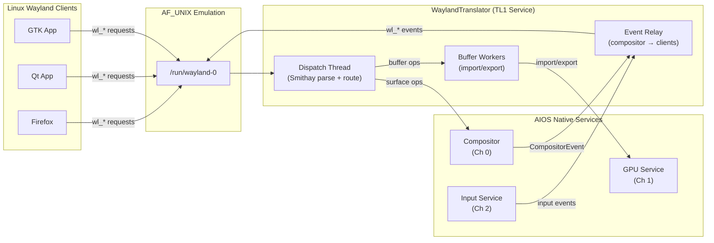
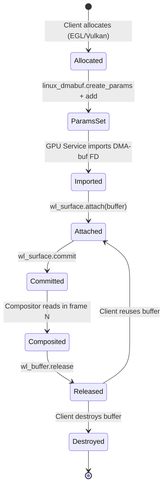
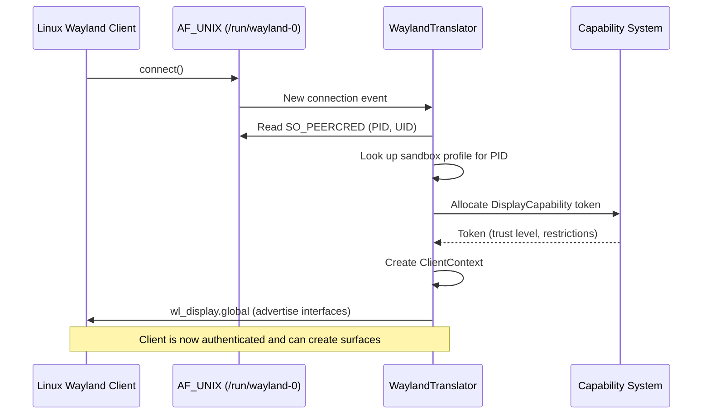
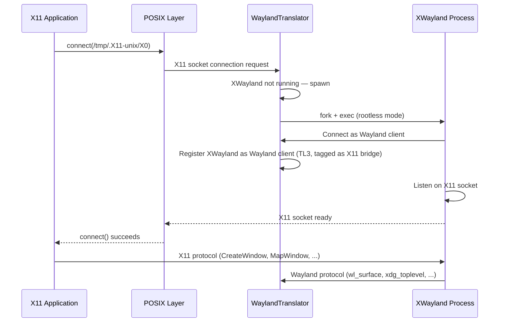
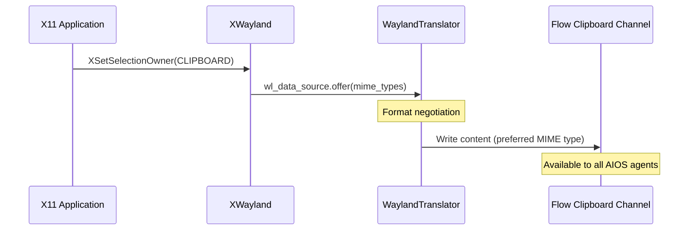

# AIOS Wayland Bridge Architecture

Part of: [linux-compat.md](../linux-compat.md) — Linux Binary & Wayland Compatibility
**Related:** [compositor/gpu.md](../compositor/gpu.md) §9 — Wayland translation layer (protocol mapping, extensions, security context), [compositor/protocol.md](../compositor/protocol.md) — AIOS compositor protocol, [compositor/rendering.md](../compositor/rendering.md) §5 — Frame scheduling

-----

## §7 Wayland Bridge Architecture

The Wayland bridge enables unmodified Linux GUI applications — GTK, Qt, Electron, Firefox, GIMP — to display windows and receive input on AIOS. The bridge translates the Wayland wire protocol into AIOS compositor IPC messages, manages buffer sharing between Linux clients and the AIOS GPU subsystem, and provides frame scheduling feedback that keeps clients synchronized with the display.

The core translation layer — `WaylandTranslator` struct, Smithay integration, surface mapping table, protocol object mapping, 10 supported extensions, and security context enforcement — is documented in [compositor/gpu.md](../compositor/gpu.md) §9.1–§9.5. This document covers the deeper integration architecture: service registration and IPC topology, buffer sharing pipeline internals, frame scheduling coordination, client lifecycle management, and XWayland extension support.

-----

### §7.1 Integration Architecture

The `WaylandTranslator` runs as a TL1 (trusted) system service registered with the AIOS service manager. It is the sole entry point for all Wayland protocol traffic — no Linux application communicates with the compositor directly.

**Service registration.** At boot (or on first demand), the service manager spawns the `WaylandTranslator` process and registers it under the service name `wayland-translator`. The translator holds three dedicated IPC channels:

| IPC Channel | Peer | Traffic |
|---|---|---|
| Channel 0 | Compositor | `CompositorRequest` / `CompositorEvent` — surface create/destroy, attach buffer, configure, focus, close |
| Channel 1 | GPU Service | Buffer import/export, DMA-buf handle translation, GPU memory accounting |
| Channel 2 | Input Service | Keyboard/pointer/touch event routing, keymap distribution, cursor shape |

Each channel carries typed IPC messages as defined in the compositor protocol ([compositor/protocol.md](../compositor/protocol.md) §3.1). The translator never bypasses IPC to access compositor internals — all interaction is capability-gated.

**Unix domain socket emulation.** Linux Wayland clients connect via `AF_UNIX` sockets at `/run/wayland-0`. The POSIX compatibility layer ([posix.md](../posix.md) §8) provides `AF_UNIX` socket emulation backed by AIOS IPC channels. The `WAYLAND_DISPLAY` environment variable is set to `wayland-0` in the Linux compatibility environment, matching the standard Wayland convention. Clients that check `$XDG_RUNTIME_DIR/wayland-0` find the socket at the expected path.

**Connection multiplexing.** A single `WaylandTranslator` instance handles all Wayland client connections. Each connected client gets a `ClientContext` that tracks its surfaces, buffers, capability token, and protocol state. The translator maintains a `ClientId` -> `ClientContext` mapping for O(1) dispatch of incoming messages and outgoing events.

**Thread model.** The translator uses a single-threaded event loop for protocol dispatch (Smithay's event loop integration) plus a worker pool for buffer operations:

- **Dispatch thread**: Accepts new connections, reads Wayland wire protocol messages from all client sockets via `epoll` (translated to AIOS `IpcSelect`), parses via Smithay, and dispatches to the appropriate handler. All protocol state mutations happen on this thread, avoiding synchronization overhead for the common path.
- **Buffer worker pool**: Up to 4 worker threads handle buffer import/export operations — DMA-buf import via the GPU Service, shared memory pool creation, and buffer format conversion. These operations may block on GPU Service IPC and must not stall the dispatch loop.
- **Event relay thread**: Receives `CompositorEvent` messages from the compositor IPC channel and translates them to Wayland protocol events, writing to the appropriate client sockets.



**Cross-reference.** The `WaylandTranslator` struct definition, `SurfaceMappingTable`, and Smithay integration details are in [compositor/gpu.md](../compositor/gpu.md) §9.1. The protocol object mapping table (10 Wayland objects to AIOS equivalents) and the 10 supported protocol extensions are in §9.2.

-----

### §7.2 Buffer Sharing Pipeline

Buffer sharing is the performance-critical data path of the Wayland bridge. Every pixel displayed from a Linux application flows through this pipeline. Two paths exist — `wl_shm` for software-rendered clients and `linux-dmabuf` for GPU-rendered clients — and the bridge optimizes each differently.

#### wl_shm Path (Software Rendering)

Software-rendered Wayland clients (most GTK applications, terminals, text editors) use `wl_shm` shared memory buffers. The data flow proceeds through five stages:

1. **Pool creation.** The client calls `wl_shm.create_pool(fd, size)` with a file descriptor backed by an anonymous memory mapping. The translator intercepts the FD, creates an AIOS `SharedMemoryId` of the same size via the shared memory subsystem ([ipc.md](../../kernel/ipc.md)), and maps both the client-side and translator-side views of the memory region.

2. **Buffer creation.** The client calls `wl_shm_pool.create_buffer(offset, width, height, stride, format)` to carve a buffer from the pool. The translator records the buffer geometry and creates a `SharedBuffer` reference pointing into the shared memory region at the specified offset.

3. **Attach and commit.** The client calls `wl_surface.attach(buffer)` followed by `wl_surface.commit()`. On commit, the translator:
   - Reads the damage region from any preceding `wl_surface.damage_buffer()` calls
   - Sends a `CompositorRequest::AttachBuffer` IPC message with the `SharedBuffer` handle and damage region
   - The compositor maps the shared memory and reads pixel data during the next composition pass

4. **Release.** After the compositor finishes reading the buffer (at frame presentation or when replaced by a newer buffer), it sends a buffer release notification. The translator translates this to a `wl_buffer.release` event back to the client, signaling that the buffer memory can be safely rewritten.

5. **Destruction.** When the client destroys the buffer or pool, the translator unmaps and frees the corresponding AIOS shared memory region.

**Double buffering.** Well-behaved Wayland clients use two buffers: while the compositor reads buffer A, the client renders into buffer B. The translator tracks buffer states (attached/released) to enforce this protocol. If a client submits a new buffer before the previous one is released, the translator queues the submission and delivers it after release.

**Memory pressure back-pressure.** When the kernel reports memory pressure on the user pool ([memory/reclamation.md](../../kernel/memory/reclamation.md) §8), the translator delays `wl_buffer.release` events. This throttles client rendering rate, reducing memory allocation pressure. Clients that respect the Wayland protocol naturally slow down when they receive fewer release callbacks.

#### linux-dmabuf Path (GPU Rendering / Zero-Copy)

GPU-rendered clients (Firefox with WebRender, Chromium, GPU-accelerated games) use the `linux_dmabuf_v1` protocol extension to share GPU buffers directly with the compositor. This path avoids all CPU-side pixel copies.

1. **Buffer creation.** The client allocates a GPU buffer via EGL or Vulkan, then calls `zwp_linux_dmabuf_v1.create_params()` and `params.add(fd, plane_idx, offset, stride, modifier)` to describe the buffer planes. The translator receives the DMA-buf file descriptor and sends it to the GPU Service via Channel 1 for import.

2. **GPU Service import.** The GPU Service translates the DMA-buf FD into an AIOS `GpuBuffer` handle. If the buffer uses a supported DRM format and modifier (see format table below), the GPU can scanout or texture-sample the buffer directly. The GPU Service returns the handle to the translator.

3. **Zero-copy composition.** On `wl_surface.commit()`, the translator sends `CompositorRequest::AttachBuffer` with the `GpuBuffer` handle. The compositor binds the GPU buffer as a texture during composition — no memory copy occurs. The buffer data stays in GPU memory throughout.

4. **Modifier negotiation.** Before buffer allocation, the client queries supported modifiers via `zwp_linux_dmabuf_v1.modifier`. The translator forwards this query to the GPU Service, which returns the list of format + modifier combinations that the compositor can consume without conversion. This ensures clients allocate buffers in optimal formats.

**Supported DRM formats:**

| DRM Format | Bits | Color Space | Zero-Copy | Primary Use |
|---|---|---|---|---|
| `DRM_FORMAT_ARGB8888` | 32 | sRGB + alpha | Yes | General 2D rendering |
| `DRM_FORMAT_XRGB8888` | 32 | sRGB (opaque) | Yes | Desktop backgrounds, opaque windows |
| `DRM_FORMAT_ABGR8888` | 32 | sRGB + alpha (reversed) | Yes | Vulkan default swapchain format |
| `DRM_FORMAT_XBGR8888` | 32 | sRGB (reversed, opaque) | Yes | Vulkan opaque swapchain |
| `DRM_FORMAT_NV12` | 12 | YUV 4:2:0 | Yes | Video playback (H.264/H.265) |
| `DRM_FORMAT_P010` | 15 | YUV 4:2:0 10-bit | Yes | HDR video (HDR10, Dolby Vision) |
| `DRM_FORMAT_RGB565` | 16 | sRGB (reduced) | Yes | Low-memory surfaces, thumbnails |

**Buffer lifecycle:**



**Unsupported format fallback.** If a client submits a DMA-buf with an unsupported format or modifier, the translator falls back to a CPU readback path: map the GPU buffer, copy pixel data to a `wl_shm`-style shared memory buffer, and submit that to the compositor. This fallback is logged as a performance warning in the audit ring.

-----

### §7.3 Frame Scheduling and Presentation Feedback

Frame scheduling coordinates the rendering rate of Wayland clients with the display's refresh rate. Without proper scheduling, clients either render too fast (wasting GPU and CPU cycles) or too slow (causing visible stutter). The Wayland bridge implements two complementary mechanisms: frame callbacks and presentation-time feedback.

#### Frame Callbacks

The frame callback protocol is the primary throttling mechanism for Wayland clients:

1. The client calls `wl_surface.frame()` to register a callback before each new frame.
2. On `wl_surface.commit()`, the translator forwards the frame callback registration alongside the buffer submission.
3. After the compositor presents the frame containing this surface (at VSync), it sends a `FramePresented` event on Channel 0.
4. The translator translates the event to a `wl_callback.done(timestamp)` event on the client's socket, where `timestamp` is the presentation time in milliseconds (monotonic clock).
5. The client receives the callback, renders its next frame, and repeats.

This cycle naturally throttles each client to the display's refresh rate. A 60 Hz display produces callbacks every ~16.67ms. Clients that take longer than one frame interval to render simply skip frames — the compositor shows the most recent committed buffer.

**Multi-surface frame callbacks.** An application with multiple surfaces (e.g., a main window and a popup menu) receives independent frame callbacks per surface. The translator tracks pending callbacks per `SurfaceId` and dispatches them independently.

#### Presentation-Time Feedback

The `wp_presentation_time` protocol extension ([compositor/gpu.md](../compositor/gpu.md) §9.2) provides high-precision presentation feedback for latency-sensitive applications:

```rust
/// Presentation feedback delivered to a Wayland client after frame display.
pub struct PresentationFeedback {
    /// Monotonic timestamp when the frame was displayed (nanoseconds).
    pub presented_ns: u64,
    /// Display refresh interval (nanoseconds). 16_666_666 for 60 Hz.
    pub refresh_ns: u64,
    /// VSync sequence counter (monotonically increasing per output).
    pub sequence: u64,
    /// Flags: VSYNC (presented at VSync), HW_CLOCK (hardware timestamp).
    pub flags: PresentationFlags,
}
```

The translator receives `PresentTimestamp` values from the compositor's `GpuBackend::submit_frame()` return value (see [compositor/gpu.md](../compositor/gpu.md) §8.1) and translates them into `wp_presentation_feedback.presented` events. This enables:

- **Client-side frame pacing.** Games and video players use the refresh interval and presentation timestamp to schedule their next frame submission optimally — rendering just early enough to hit the next VSync without introducing unnecessary latency.
- **Jank detection.** Applications can detect missed frames by comparing consecutive presentation timestamps. A gap larger than `refresh_ns * 1.5` indicates a dropped frame.
- **VRR participation.** On displays with Variable Refresh Rate (FreeSync/AdaptiveSync), the refresh interval in feedback reflects the actual frame-to-frame interval rather than the fixed nominal rate. Clients adapt their rendering cadence accordingly. Cross-ref: [compositor/rendering.md](../compositor/rendering.md) §5.4 for VRR compositor-side handling.

#### Latency Measurement

The translator tracks end-to-end latency for each client as a diagnostic metric:

```text
Latency = T_present - T_commit
```

Where `T_commit` is the timestamp when the translator received `wl_surface.commit()` and `T_present` is the presentation timestamp from the compositor. This measurement is recorded per-surface and reported via the audit ring for performance analysis. Latency exceeding 2x the frame budget triggers a diagnostic log entry identifying the bottleneck (client-side rendering, buffer import, or compositor composition).

-----

### §7.4 Client Lifecycle Management

Each Wayland client goes through a defined lifecycle from connection to disconnection. The translator manages resources, enforces capability limits, and ensures clean teardown at every stage.

#### Connection and Authentication



1. **Connection.** A Linux Wayland client calls `connect()` on the `/run/wayland-0` socket. The POSIX compatibility layer routes this to the `WaylandTranslator`.
2. **Credential extraction.** The translator reads `SO_PEERCRED` from the socket to obtain the client's PID and UID. On AIOS, `SO_PEERCRED` is emulated by the AF_UNIX translation layer, which maps the Linux PID to an AIOS `ProcessId`.
3. **Sandbox profile lookup.** Using the `ProcessId`, the translator queries the sandbox service for the client's security profile. This determines the trust level and restrictions applied to the client. Cross-ref: [sandbox.md](./sandbox.md) §9.3 for sandbox profile definitions.
4. **Capability allocation.** The translator requests a `DisplayCapability` token from the capability system, scoped to the client's trust level. The token determines maximum surfaces, GPU memory, and permitted operations. Cross-ref: [compositor/gpu.md](../compositor/gpu.md) §9.5 for `WaylandClientCapability` struct and trust level mapping.
5. **Interface advertisement.** The translator sends `wl_display.global` events advertising supported Wayland interfaces (wl_compositor, xdg_wm_base, wl_shm, etc.) filtered by the client's capability token. Restricted clients do not see interfaces they cannot use.

#### Resource Limits

Each client operates within capability-derived resource limits. The translator enforces these limits at the protocol level, rejecting requests that would exceed them:

| Resource | Default (TL3) | Trusted (TL2) | System (TL1) | Enforcement Point |
|---|---|---|---|---|
| Maximum surfaces | 32 | 64 | 256 | `wl_compositor.create_surface` |
| Total buffer memory (wl_shm) | 128 MB | 256 MB | 1 GB | `wl_shm.create_pool` |
| GPU buffer count (linux-dmabuf) | 32 | 64 | 256 | `linux_dmabuf.create_params` |
| Total GPU memory | 32 MB | 128 MB | 256 MB | GPU Service accounting |
| Subsurfaces per surface | 8 | 16 | 64 | `wl_subcompositor.get_subsurface` |

When a client reaches a limit, the translator sends a `wl_display.error` event with protocol error code `WL_DISPLAY_ERROR_NO_MEMORY`. The client can free existing resources and retry. Limit violations are logged to the audit ring with the client's identity and the specific limit exceeded.

#### Crash Recovery

When a Wayland client dies unexpectedly (process crash, OOM kill, sandbox termination), the translator detects the broken socket connection and initiates cleanup:

1. **Socket detection.** The dispatch thread's `epoll`/`IpcSelect` reports a hangup or read error on the client's socket FD.
2. **Surface teardown.** The translator iterates all surfaces owned by the dead client and sends `CompositorRequest::DestroySurface` for each. The compositor removes the surfaces from the scene graph.
3. **Buffer release.** All shared memory pools and GPU buffer handles associated with the client are freed. The GPU Service decrements the client's memory accounting.
4. **Capability revocation.** The client's `DisplayCapability` token is revoked via cascade revocation ([security/model/capabilities.md](../../security/model/capabilities.md) §3.6). Any child tokens are also revoked.
5. **Visual feedback.** The compositor applies a brief fade-out animation (150ms, `EaseIn`) to the dead client's surfaces before final removal, providing visual continuity rather than an abrupt window disappearance. Cross-ref: [compositor/rendering.md](../compositor/rendering.md) §5.5 for window close animation preset.
6. **Audit logging.** A `ClientCrash` event is written to the audit ring with the client's PID, process name, number of surfaces destroyed, and total memory freed.

The entire cleanup completes within one frame interval (~16.67ms at 60 Hz). No orphaned resources remain after cleanup — the translator performs a resource audit on every client disconnection, comparing expected vs. actual resource counts and logging discrepancies.

#### Client Identification

The translator identifies each client through multiple mechanisms, used for audit trails, compositor window decorations, and security policy:

| Source | Information | Reliability |
|---|---|---|
| `SO_PEERCRED` | PID, UID | Always available (kernel-provided) |
| `/proc/<pid>/cmdline` emulation | Process name, command line | Available via virtual filesystem ([virtual-filesystems.md](./virtual-filesystems.md) §11.1) |
| `wp_security_context_v1` | `app_id`, `sandbox_engine` | Flatpak/Snap clients only |
| `xdg_toplevel.set_app_id` | Application ID string | Client-provided (advisory, not trusted for security) |

For window decoration titles, the compositor uses `xdg_toplevel.set_title` (client-provided). For security decisions and audit logs, only kernel-provided identity (`SO_PEERCRED` PID) and capability tokens are trusted. The `app_id` from `xdg_toplevel` is treated as a display hint, not a security credential.

-----

## §8 XWayland and X11 Compatibility

XWayland provides backward compatibility for X11 applications that have not been ported to Wayland. While the Wayland ecosystem covers most modern Linux GUI toolkits (GTK 4, Qt 6, Electron), many legacy and specialized applications — scientific visualization tools, older versions of GIMP, some CAD software, Wine/Proton for Windows games — still require X11.

The basic XWayland integration — rootless mode, window decoration, clipboard bridge, input handling, and lifecycle — is documented in [compositor/gpu.md](../compositor/gpu.md) §9.3. This section covers the deeper architecture: on-demand lifecycle management, X11 extension support details, clipboard and drag-and-drop protocol bridging, and performance characteristics.

-----

### §8.1 XWayland Lifecycle

XWayland is spawned on demand to minimize resource consumption when no X11 applications are running.

**Startup trigger.** When the Linux compatibility layer detects an X11 connection attempt (a client calls `connect()` on a socket matching the X11 display pattern, typically `/tmp/.X11-unix/X0`), the POSIX translation layer forwards the request to the `WaylandTranslator`. If no XWayland instance is running, the translator spawns one.

**Spawn sequence:**



**Rootless mode.** XWayland runs with the `-rootless` flag, meaning there is no visible X11 root window or X11 window manager. Each X11 top-level window becomes an independent Wayland surface, which the `WaylandTranslator` maps to an AIOS `SurfaceId`. From the compositor's perspective, XWayland surfaces are indistinguishable from native Wayland surfaces — they receive the same layout, z-ordering, focus, and decoration treatment.

**Server-side decorations.** X11 applications do not draw their own title bars (unlike CSD Wayland clients). The compositor applies server-side decorations (title bar, close/minimize/maximize buttons, window shadow) to XWayland surfaces using the same visual style as native AIOS windows. The `xdg-decoration-v1` protocol negotiation between XWayland and the translator ensures server-side decorations are selected.

**Idle shutdown.** When the last X11 client disconnects from XWayland, a 30-second idle timer starts. If no new X11 client connects within that window, XWayland exits cleanly. This avoids keeping XWayland resident when only Wayland applications are running. The timer is reset on each new X11 connection.

**Crash recovery.** If XWayland crashes:

1. The translator detects the broken Wayland connection (XWayland is a Wayland client of the translator).
2. All XWayland-owned surfaces are torn down using the standard client crash recovery path (§7.4).
3. The translator restarts XWayland immediately.
4. X11 clients that were connected through the previous XWayland instance receive a connection reset on their X11 sockets. Well-behaved X11 applications reconnect automatically. Applications that do not handle reconnection are terminated.
5. A `XWaylandCrash` audit event is logged with the crash signal, uptime, and number of affected X11 clients.

Recovery is best-effort — X11 client state (window positions, clipboard content, selection ownership) is lost on XWayland restart. The compositor preserves its own record of where XWayland windows were positioned and attempts to restore window geometry when the application reconnects.

-----

### §8.2 X11 Extension Support

XWayland provides X11 extension support through a combination of its own implementation and translation to Wayland/AIOS equivalents. The following table documents supported extensions, their translation mechanism, and any limitations:

| Extension | Version | Translation Path | Limitations |
|---|---|---|---|
| RENDER | 0.11 | GPU-accelerated via XWayland's glamor backend | Full support; anti-aliased 2D, gradients, compositing |
| Composite | 0.4 | Each X11 window → separate Wayland subsurface | Offscreen pixmaps translated to wl_shm buffers |
| RANDR | 1.5 | Output info queried from compositor via Wayland `wl_output` | Mode setting not supported (read-only) |
| XInput2 | 2.3 | Input events received from Wayland seat protocol | Multi-touch supported; tablet input mapped to `wl_tablet` |
| GLX | 1.4 | Routed through DRI3 + linux-dmabuf for GPU buffer sharing | Indirect rendering not supported; direct rendering only |
| DRI3 | 1.2 | DMA-buf buffer sharing with compositor | Zero-copy path; eliminates X11 pixmap copy overhead |
| Present | 1.2 | Translated to `wp_presentation_time` feedback | Full VSync and frame pacing support |
| MIT-SHM | 1.2 | Translated to `wl_shm` shared memory buffers | Buffer format conversion if needed |
| Xfixes | 5.0 | Cursor shape management via `wl_cursor` | Cursor themes inherited from compositor |
| DPMS | 1.1 | Power management hints forwarded to compositor | Screen blanking only; no hardware standby/suspend |
| Xinerama | 1.1 | Screen geometry from compositor output list | Read-only; for legacy multi-monitor awareness |
| XKB | 1.0 | Keymap from compositor `wl_keyboard.keymap` | Keymap shared with Wayland clients; cannot override |
| SHAPE | 1.1 | Non-rectangular window shapes via surface alpha | Bitmap shapes converted to alpha channel |
| Sync | 3.1 | Fence synchronization via Wayland explicit sync | Counter-based sync for double buffering |

**GLX and DRI3 interaction.** The GLX extension deserves special attention because it is the primary OpenGL path for X11 applications. On AIOS, GLX works exclusively through DRI3:

1. The X11 application requests a GLX context via `glXCreateContext`.
2. XWayland's glamor backend creates a GPU rendering context using the DRM render node (`/dev/dri/renderD128`, see [compositor/gpu.md](../compositor/gpu.md) §9.4).
3. The application renders into a DRI3-allocated DMA-buf buffer.
4. On `glXSwapBuffers`, XWayland submits the DMA-buf to the translator via `linux_dmabuf_v1`, achieving zero-copy presentation.
5. The Present extension provides VSync feedback to the application.

This path eliminates the traditional X11 compositor copy (X11 pixmap -> Wayland shm buffer) for OpenGL applications, matching native Wayland performance.

**Unsupported extensions.** The following X11 extensions are intentionally not supported:

| Extension | Reason |
|---|---|
| XVideo (Xv) | Superseded by VAAPI/VDPAU via DRI3; no modern applications depend on Xv |
| XPrint | Deprecated; printing uses the portal service |
| SECURITY | Incompatible with AIOS capability model; AIOS enforces security at a lower level |
| RECORD | Screen recording uses the AIOS capture service with explicit capability |
| XTEST | Synthetic input injection is a security risk; gated by capability |

Applications that query for unsupported extensions receive `False` from `XQueryExtension`. Applications that attempt to use unsupported extension opcodes receive a `BadRequest` error.

-----

### §8.3 Clipboard and Drag-and-Drop Bridge

#### Clipboard Bridge

The clipboard bridge synchronizes content between three domains: X11 selections, Wayland data offers, and the AIOS Flow clipboard channel.

**X11 selection model.** X11 uses three named selections:

| Selection | X11 Usage | AIOS Mapping |
|---|---|---|
| `CLIPBOARD` | Explicit copy (Ctrl+C) | Flow clipboard channel (primary) |
| `PRIMARY` | Implicit selection (highlight text) | Flow clipboard channel (secondary slot) |
| `SECONDARY` | Rarely used; legacy | Not bridged |

**Copy flow (X11 to AIOS):**



**Paste flow (AIOS to X11):**

```mermaid
sequenceDiagram
    participant X11App as X11 Application
    participant XW as XWayland
    participant WT as WaylandTranslator
    participant Flow as Flow Clipboard Channel

    X11App->>XW: XConvertSelection(CLIPBOARD, UTF8_STRING)
    XW->>WT: wl_data_offer.receive("text/plain;charset=utf-8")
    WT->>Flow: Read clipboard content
    Flow-->>WT: Content bytes
    WT-->>XW: Write to pipe FD
    XW-->>X11App: SelectionNotify + property data
```

**Format negotiation table:**

| X11 Atom | Wayland MIME Type | Flow ContentType | Conversion |
|---|---|---|---|
| `UTF8_STRING` | `text/plain;charset=utf-8` | `Text` | Direct (no conversion) |
| `STRING` | `text/plain` | `Text` | Latin-1 to UTF-8 |
| `TEXT` | `text/plain` | `Text` | Encoding detection |
| `text/html` | `text/html` | `RichText` | Direct |
| `image/png` | `image/png` | `Image` | Direct |
| `image/bmp` | `image/bmp` | `Image` | Convert to PNG on AIOS side |
| `TARGETS` | (meta) | (meta) | Returns list of available formats |

**Security screening.** Clipboard content that crosses the protocol boundary (X11 to Wayland, or Wayland to AIOS native) is subject to the compositor's content screening policy ([compositor/security.md](../compositor/security.md) §10.4). Clipboard operations between sandboxed applications require explicit user confirmation unless the applications share a trust domain.

#### Drag-and-Drop Bridge

Drag-and-drop bridges the XDnD protocol (X11), the Wayland `wl_data_device_manager` protocol, and the AIOS Flow drag channel.

**Drag initiation (X11 source):**

1. An X11 application initiates a drag via the XDnD protocol (`XdndEnter`, `XdndPosition`, `XdndDrop` messages).
2. XWayland translates the XDnD drag to a Wayland `wl_data_device.start_drag` request.
3. The translator forwards the drag to the compositor, which renders the drag icon as an overlay surface following the pointer.
4. If the drop target is a Wayland surface (including other XWayland surfaces), the compositor routes the drop event accordingly.
5. If the drop target is a native AIOS surface, the translator converts the drag data into a Flow drag entry and delivers it through the Flow clipboard channel.

**Drag initiation (Wayland/AIOS source to X11 target):**

1. A Wayland client or AIOS agent initiates a drag.
2. The compositor routes the drag to the XWayland surface if the pointer enters an XWayland-owned surface.
3. The translator converts the Wayland `wl_data_offer` to XDnD protocol messages and delivers them to XWayland.
4. XWayland forwards the XDnD messages to the target X11 window.
5. On drop, the translator converts the offered MIME types to X11 atoms and facilitates the data transfer.

**Format conversion at boundaries.** The same MIME type to X11 atom mapping used for clipboard (table above) applies to drag-and-drop format negotiation. The translator handles format conversion transparently — an X11 application dragging `UTF8_STRING` data to a Wayland application offering `text/plain;charset=utf-8` requires no conversion.

**Visual feedback.** During cross-protocol drags, the compositor renders the drag icon as a compositor-managed overlay surface. This ensures consistent visual feedback regardless of whether the drag source is X11, Wayland, or native AIOS. The drag icon follows the pointer with zero additional latency since it is rendered in the compositor's frame loop.

-----

### §8.4 Performance Considerations

XWayland introduces measurable overhead compared to native Wayland clients. Understanding and mitigating this overhead is critical for applications where users notice latency — games, video editors, and drawing applications.

**Buffer copy overhead.** The traditional XWayland path adds one CPU-side buffer copy per frame:

```text
X11 Application renders → X11 pixmap (GPU memory)
  → XWayland copies pixmap to Wayland wl_shm buffer (CPU copy)
    → Compositor reads wl_shm buffer (zero-copy via shared memory)
```

With DRI3 enabled (the default for GPU-accelerated X11 applications), this copy is eliminated:

```text
X11 Application renders → DRI3 DMA-buf (GPU memory)
  → XWayland submits DMA-buf via linux_dmabuf (zero-copy)
    → Compositor textures DMA-buf directly (zero-copy)
```

DRI3 is supported by Mesa 11+ and all modern GPU drivers. Applications using legacy GLX without DRI3 fall back to the copy path.

**Input latency.** Input events traverse an additional hop compared to native Wayland clients:

```text
Native Wayland:  Input Service → Compositor → WaylandTranslator → Client
                 (~2 hops, ~0.5–1ms)

XWayland:        Input Service → Compositor → WaylandTranslator → XWayland → X11 Client
                 (~3 hops, ~1–2ms additional)
```

The additional hop through XWayland adds approximately 1–2ms of input latency. For most desktop applications, this is imperceptible. For competitive games or musical instruments, this latency may be noticeable. Such applications should use native Wayland or the AIOS compositor protocol directly.

**Context switch overhead.** Each displayed frame from an X11 application involves context switches between three processes:

| Process | Role | Context Switches per Frame |
|---|---|---|
| X11 Application | Renders content | 1 (wake on frame callback) |
| XWayland | Protocol translation | 2 (receive from app, send to translator) |
| WaylandTranslator | AIOS bridge | 2 (receive from XWayland, send to compositor) |

Total: approximately 5 context switches per frame for an X11 application, compared to approximately 3 for a native Wayland client. On AIOS's scheduler with direct-switch optimization ([ipc.md](../../kernel/ipc.md)), these context switches cost approximately 1-2 microseconds each, contributing negligible overhead relative to frame rendering time.

**Optimization: XWayland fast path.** The `WaylandTranslator` identifies XWayland as a special client (by PID and process name) and applies optimizations:

- **Streamlined validation.** XWayland operates at TL3 (same trust level as other sandboxed Linux binaries). All security-critical validations remain active: capability checks, resource limit enforcement, object lifetime/state validation, and bounds checks on buffer dimensions. Only stateless format parsing (e.g., re-validating well-known Wayland opcodes that XWayland always emits correctly) is elided, saving approximately 100ns per message without weakening the security boundary.
- **Batched surface updates.** When XWayland submits multiple surface updates in rapid succession (common during window resize), the translator batches them into a single compositor IPC message.
- **Priority scheduling.** Buffer operations for XWayland clients are prioritized in the worker pool, reducing import latency for DRI3 buffers.

**Performance monitoring.** The translator tracks per-client metrics and exposes them via the audit ring:

| Metric | Description | Alert Threshold |
|---|---|---|
| Frame time | Time from `wl_surface.commit` to `wl_callback.done` | > 2x frame budget |
| Buffer import time | Time for GPU Service to import a DMA-buf | > 2ms |
| Input-to-display latency | Time from input event to frame containing response | > 50ms |
| Missed frames | Frames where client did not submit before VSync | > 5% over 60-frame window |
| Memory usage | Total wl_shm + GPU memory per client | > 80% of client limit |

These metrics feed into the AIRS performance advisor, which can recommend that specific applications switch from X11 to native Wayland mode, or that sandbox profiles be adjusted to increase resource limits for applications that consistently hit them.
