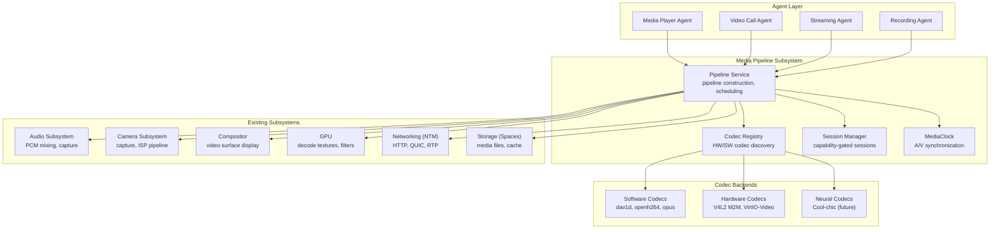
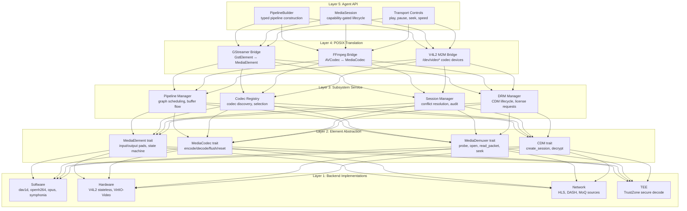
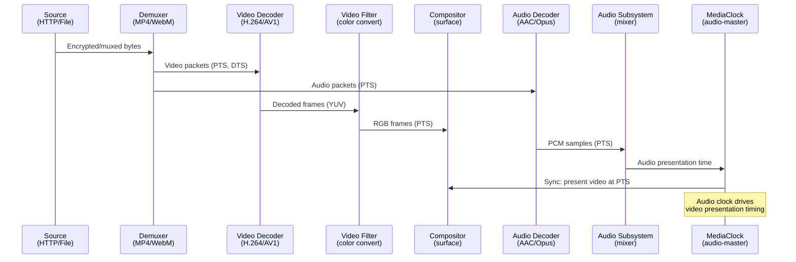
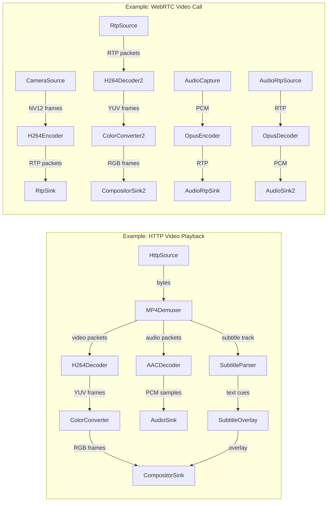
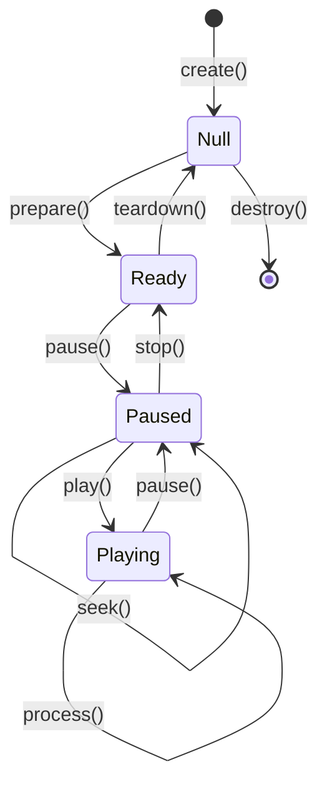

# AIOS Media Pipeline

## Deep Technical Architecture

**Parent document:** [architecture.md](../project/architecture.md)
**Related:** [subsystem-framework.md](./subsystem-framework.md) — Universal hardware abstraction (capability gate, sessions, data channels, audit, power, POSIX bridge), [audio.md](./audio.md) — Audio mixing, capture, RT scheduling, A/V sync timeline, [camera.md](./camera.md) — Camera capture, ISP pipeline, privacy enforcement, [compositor.md](./compositor.md) — Video surface compositing, direct scanout, HDR, [gpu.md](./gpu.md) — wgpu rendering, GPU memory, hardware decode textures, [networking.md](./networking.md) — HTTP/2, QUIC, bandwidth scheduling, [storage/spaces.md](../storage/spaces.md) — Content-addressed media storage

**Note:** The media pipeline implements the subsystem framework. Its capability gate, session model, audit logging, power management, and POSIX bridge follow the universal patterns defined in the framework document. This document covers the media-specific design decisions and architecture. The media pipeline does not replace Audio, Camera, or Compositor — it **coordinates** them for media workloads (playback, recording, streaming, real-time communication).

-----

## Document Map

This document was split for navigability. Each sub-document preserves the original section numbers for cross-reference stability.

| Document | Sections | Content |
|---|---|---|
| **This file** | §1–§2, §18–§19 | Core insight, architecture overview, implementation order, design principles, cross-reference index |
| [codecs.md](./media-pipeline/codecs.md) | §3, §4 | Codec framework (MediaCodec trait, registry, HW/SW selection, cros-codecs), container format engine (demuxer/muxer, MP4/WebM/MKV/MPEG-TS) |
| [playback.md](./media-pipeline/playback.md) | §5, §6 | Pipeline graph model (PipeWire/GStreamer-inspired DAG), A/V synchronization, clock recovery, buffering, subtitle rendering, media sessions |
| [streaming.md](./media-pipeline/streaming.md) | §7, §8 | Streaming protocols (HLS, DASH, MoQ), adaptive bitrate (buffer-based, throughput-based, RL-based), jitter buffers, bandwidth estimation |
| [rtc.md](./media-pipeline/rtc.md) | §9, §10 | WebRTC stack (ICE/STUN/TURN, DTLS-SRTP, RTP/RTCP, SDP), low-latency encode/decode, simulcast/SVC, RTC sessions, multi-party topology |
| [drm.md](./media-pipeline/drm.md) | §11, §12 | Content protection (CDM trait, Widevine/PlayReady/FairPlay, CENC, secure decode pipeline, TEE integration), output protection (HDCP, screen capture restrictions) |
| [integration.md](./media-pipeline/integration.md) | §13–§17 | Cross-subsystem coordination (Audio/Camera/Compositor/GPU/Network/Storage/Flow), POSIX bridge (GStreamer/FFmpeg/V4L2 M2M), security and audit, AI-native media intelligence, thermal coordination |

-----

## §1 Core Insight

**Media is the coordination problem, not the device problem.**

Audio, Camera, Compositor, GPU, Networking, and Storage each handle their individual domains comprehensively. Playing a video, however, requires synchronized operation of *all* of them: network data arrives through the Networking subsystem, passes through a container demuxer, feeds into parallel video and audio decoders, routes decoded video frames to the Compositor for display and decoded audio samples to the Audio subsystem for playback — all synchronized to sub-40ms precision. No single existing subsystem owns this workflow.

The media pipeline is the missing orchestration layer. It provides a unified processing graph where data sources, decoders, filters, encoders, and output sinks are composable elements connected by typed pads. Agents build pipelines declaratively; the subsystem handles codec selection, format negotiation, clock synchronization, adaptive quality, and DRM enforcement transparently.

Traditional operating systems handle this through large userspace multimedia frameworks (GStreamer, AVFoundation, MediaCodec) that sit above the kernel. AIOS integrates media orchestration into the subsystem framework, giving it first-class access to capability gates, shared-memory zero-copy paths, RT scheduling, and AI runtime services. This makes the media pipeline both more secure (capability-gated DRM, audited access) and more efficient (zero-copy from network buffer through decoder to GPU texture) than conventional approaches.

### Core Design Decisions

1. **Pipeline graph, not monolithic player** — media processing is a directed acyclic graph (DAG) of elements, inspired by PipeWire's unified media graph and GStreamer's element-pad composition model. Agents compose pipelines from registered elements; the subsystem manages scheduling, buffer flow, and state transitions.

2. **Audio is clock master** — consistent with the audio subsystem's design principle ([audio.md](./audio.md) §15). The media pipeline's A/V synchronization always slaves video to the audio clock. This reflects the human perceptual reality: audio discontinuities are far more noticeable than dropped video frames.

3. **Hardware codec first, software fallback** — codec selection prefers hardware decoders (V4L2 stateless on Raspberry Pi, dedicated media engines on Apple Silicon, VirtIO-Video on QEMU) and falls back to software implementations (dav1d for AV1, openh264 for H.264, symphonia for audio codecs) transparently. An agent never fails because hardware is missing — the Rust-native cros-codecs library provides safe V4L2 stateless access for hardware paths.

4. **Capability-gated DRM** — DRM key management and secure decode paths are enforced through the capability system. No agent can access decrypted content without an explicit `MediaDrm` capability token. DRM enforcement applies per-pipeline, not system-wide — non-DRM content plays with zero DRM overhead.

5. **WebRTC as first-class citizen** — real-time communication is not a library bolted onto the playback pipeline. It is a first-class pipeline mode with its own clock domain, jitter buffer, congestion control, and encode path. An RTC pipeline shares the same element graph model as playback, enabling code reuse (same codecs, same audio processing) while respecting fundamentally different latency requirements.

### Architecture Position



### Contrast with Other Systems

| Feature | Linux (GStreamer) | Android (MediaCodec) | iOS (AVFoundation) | Fuchsia (Media) | AIOS |
|---|---|---|---|---|---|
| Pipeline model | Element graph (user) | Codec + Surface (user) | Session-based (user) | Stream processor (user) | Element graph + capability gate (subsystem) |
| A/V sync | GstClock (userspace) | MediaSync (framework) | AVSyncLayer (framework) | Fenced buffers | Audio-master shared timeline (kernel-assisted) |
| HW codec access | VA-API / V4L2 | OMX / Codec2 | VideoToolbox | Codec factory | MediaCodec trait (pluggable, cros-codecs) |
| DRM | CDM plugins | MediaDrm API | FairPlay | Not public | Capability-gated CDM + TEE |
| RTC | WebRTC library | WebRTC.org / Ozo | Network.framework | Not public | Native pipeline mode (first-class) |
| Security model | File permissions | App sandbox + SELinux | App sandbox + TCC | Capability-based | Capability-gated per-pipeline |
| Zero-copy | DMA-BUF (manual) | HardwareBuffer | IOSurface | VMO handles | Shared memory regions (subsystem framework) |

-----

## §2 Architecture Overview

### Five-Layer Stack

The media pipeline follows the subsystem framework's five-layer architecture, adapted for media-specific concerns.



### Data Flow: Source to Presentation

A typical video playback pipeline connects network or storage input through demuxing and decoding to audio and video output.



### Pipeline Graph Model

Media processing is modeled as a directed acyclic graph of `MediaElement` nodes connected by typed `MediaPad` links. Each element processes data independently; the pipeline manager schedules element execution and manages buffer flow.



### Element State Machine

Every `MediaElement` follows a four-state lifecycle matching the established pattern from GStreamer and PipeWire.



- **Null** — element exists but holds no resources
- **Ready** — resources allocated (buffers, device handles), not processing
- **Paused** — pipeline is constructed and negotiated, ready to process but clock is stopped
- **Playing** — clock is running, elements are processing data

-----

## §18 Implementation Order

The media pipeline is implemented across multiple development phases, building complexity incrementally. Core playback infrastructure lands in Phase 31 alongside the Audio and Camera subsystem completions. Advanced features follow in subsequent phases.

```text
Phase 31: Media pipeline core
         ├── MediaElement trait hierarchy (Source, Decoder, Filter, Sink, Demuxer, Muxer)
         ├── Pipeline graph builder and executor (PipelineBuilder, PipelineManager)
         ├── MediaSession lifecycle (capability-gated, MediaPlayback capability)
         ├── Codec registry with priority-based selection (HW > SW)
         ├── Container demuxers: MP4 (ISO BMFF), WebM (Matroska subset)
         ├── Software video decoders: H.264 (openh264, baseline), VP9
         ├── Software audio decoders: AAC, Opus, Vorbis, FLAC (symphonia)
         ├── MediaClock with audio-master A/V sync (±40ms lip-sync)
         ├── Video sink → compositor surface integration (CompositorSink element)
         ├── Audio sink → audio subsystem mixer integration (AudioSink element)
         ├── FileSource element (Space object → demuxer)
         ├── Progressive HTTP streaming (HttpSource via NTM)
         ├── Basic subtitle rendering (SRT, WebVTT → compositor overlay)
         └── Test: play MP4 (H.264+AAC) from HTTP source with A/V sync

Phase 31+: Advanced streaming
          ├── HLS support (M3U8 master+media playlists, segment fetch)
          ├── DASH support (MPD parsing, segment templates)
          ├── Adaptive bitrate: buffer-based + throughput-based hybrid ABR
          ├── Jitter buffer (adaptive, de-jitter + reorder for streaming)
          ├── Low-Latency HLS (LL-HLS: partial segments, blocking reload)
          ├── MKV container demuxer (full Matroska)
          ├── MPEG-TS demuxer (HLS segment container)
          ├── Transport controls (play/pause/seek/speed)
          ├── Recording pipeline (CameraSource → encoder → muxer → SpaceSink)
          └── Test: adaptive HLS playback with quality switching

Phase 31+: Real-time communication
          ├── WebRTC PeerConnection lifecycle (offer/answer SDP)
          ├── ICE candidate gathering (host, srflx, relay via STUN/TURN)
          ├── DTLS-SRTP media encryption
          ├── RTP packetization (H.264 FU-A, VP9, Opus)
          ├── RTCP feedback (PLI, NACK, REMB, TWCC)
          ├── Low-latency encode path (H.264 CBR, < 30ms target)
          ├── Camera → encoder → RTP pipeline (zero-copy)
          ├── Simulcast: multiple resolutions encoded simultaneously
          ├── Data channels (SCTP over DTLS)
          └── Test: two-agent video call over loopback

Phase 31+: DRM and content protection
          ├── DRM session lifecycle (MediaDrm capability token)
          ├── ContentDecryptionModule trait (pluggable CDM)
          ├── CENC decryption (CTR and CBCS schemes, ISO 23001-7)
          ├── Widevine L3 stub (software CDM, development/testing)
          ├── License request/response via NTM HTTPS
          ├── Secure decode pipeline integration point (TEE)
          ├── HDCP enforcement via compositor output protection
          └── Test: play CENC-encrypted content with ClearKey CDM

Phase 31+: Hardware codecs and optimization
          ├── V4L2 stateless codec driver (RPi 4: H.264+HEVC decode, H.264 encode)
          ├── V4L2 stateless codec driver (RPi 5: HEVC decode)
          ├── VirtIO-Video codec driver (QEMU, when spec stabilizes)
          ├── Zero-copy decode → GPU texture path (DMA-BUF → wgpu import)
          ├── AV1 software decoder (dav1d, NEON-optimized)
          ├── Hardware-accelerated encode (RPi 4 H.264 encoder)
          └── Test: hardware decode of H.264 on RPi 4 with zero-copy display

Phase 36: POSIX bridge and compatibility
         ├── GStreamer plugin bridge (GstElement ↔ MediaElement adapter)
         ├── FFmpeg/libav compatibility layer (AVCodec ↔ MediaCodec)
         ├── V4L2 M2M device nodes (/dev/video* for codec access)
         ├── ALSA PCM bridge for media applications
         └── Test: GStreamer-based application plays video via bridge

Phase 41+: AI-native media intelligence
          ├── Content-type-aware transcoding (AIRS selects codec/bitrate)
          ├── Neural super-resolution video filter element
          ├── AI-driven ABR (Pensieve/PLL-ABR-class learned adaptation)
          ├── Audio-visual scene classification for metadata
          ├── Smart buffering (AIRS predicts network conditions)
          ├── Cool-chic-class neural codec (~800 parameters, kernel-internal)
          ├── Generative frame interpolation (frame rate upscaling)
          └── Test: AIRS-driven adaptive quality for streaming playback
```

-----

## §19 Design Principles

1. **Audio is clock master.** The media pipeline's A/V synchronization always slaves video to the audio clock. Human perception tolerates a dropped video frame far more than an audio discontinuity. This is consistent with the audio subsystem's design ([audio.md](./audio.md) §15).

2. **Pipeline graph, not monolithic codec.** Media processing is composable: elements as processing nodes, pads as typed connection points with format negotiation, pipelines as DAGs. Agents construct pipelines declaratively; the subsystem handles scheduling. Inspired by PipeWire's unified media graph and GStreamer's element-pad-bin composition.

3. **Hardware first, software always.** Hardware codecs are preferred for power efficiency and throughput, but software fallback is always available. An agent never fails because hardware is missing. The codec registry selects the best available implementation transparently.

4. **Zero-copy through the pipeline.** DMA buffers flow from network/storage through decoder to GPU texture without CPU copies. The CPU touches data only for software decode or filter processing. Shared memory regions from the subsystem framework enable zero-copy between pipeline elements and between the pipeline and other subsystems.

5. **Capability-gated media access.** `MediaPlayback`, `MediaCapture`, `MediaDrm`, `MediaRtc`, and `MediaTranscode` are distinct capability tokens. An agent playing background music does not need DRM or RTC capabilities. Capabilities can be attenuated (e.g., audio-only playback, max resolution limit).

6. **DRM is a pipeline property, not a global mode.** DRM enforcement applies per-pipeline, not system-wide. Non-DRM content plays with zero DRM overhead. DRM pipelines route through secure decode paths with TEE integration. The CDM trait is pluggable — different DRM systems are interchangeable backends.

7. **RTC is not a plugin.** Real-time communication is a first-class pipeline mode with its own clock domain, jitter management, congestion control, and encode path. It shares the same element graph model and codec implementations as playback, but with fundamentally different latency targets (< 200ms glass-to-glass vs. seconds of buffering for streaming).

8. **A/V sync is non-negotiable.** Every pipeline with both audio and video must maintain lip-sync within ±40ms (ITU-R BT.1359-1 perceptual threshold). The pipeline drops video frames before allowing audio discontinuity. Clock recovery and drift correction handle network source timing.

9. **Adaptive streaming is transparent.** The agent requests a stream; the pipeline handles manifest parsing, segment fetching, quality switching, and rebuffering. The agent sees a continuous `MediaSession` with transport controls. ABR algorithm selection (heuristic or learned) is an internal optimization.

10. **POSIX bridge enables ecosystem.** Existing Linux media applications (GStreamer, FFmpeg, VLC) work via translation layers. The bridge maps GstElement to MediaElement, GstClock to MediaClock, AVCodec to MediaCodec. Compatibility enables adoption while the native API provides superior integration.

11. **Subsystem coordination, not replacement.** The media pipeline coordinates Audio, Camera, Compositor, GPU, Networking, and Storage. It never duplicates their functionality. Audio mixing stays in the Audio subsystem. Video compositing stays in the Compositor. Camera capture stays in the Camera subsystem. The pipeline connects them.

12. **Thermal awareness.** Video decode and encode are among the most thermally intensive workloads. The pipeline cooperates with the thermal subsystem ([thermal.md](./thermal.md)) to reduce decode quality, resolution, or frame rate under thermal pressure — graceful degradation rather than thermal throttle stuttering.

13. **AI enhances, never blocks.** AI features (neural super-resolution, learned ABR, content-aware transcoding) are optional filter elements or advisory services. The pipeline works at full capability with no AIRS dependency. AI improves quality when available; its absence causes no degradation.

-----

## Cross-Reference Index

| Section | Sub-Document | Topic |
|---|---|---|
| §1 | **This file** | Core insight — media as coordination problem |
| §2 | **This file** | Architecture overview — five-layer stack, data flow, pipeline graph model |
| §3.1–§3.5 | [codecs.md](./media-pipeline/codecs.md) | Codec framework: MediaCodec trait, registry, HW/SW selection, NEON optimization |
| §4.1–§4.4 | [codecs.md](./media-pipeline/codecs.md) | Container format engine: demuxer/muxer traits, MP4/WebM/MKV/MPEG-TS, metadata |
| §5.1–§5.6 | [playback.md](./media-pipeline/playback.md) | Playback pipeline: graph model, construction, A/V sync, clock recovery, buffering, subtitles |
| §6.1–§6.4 | [playback.md](./media-pipeline/playback.md) | Media sessions: lifecycle, conflict resolution, transport controls, observability |
| §7.1–§7.5 | [streaming.md](./media-pipeline/streaming.md) | Streaming protocols: HTTP progressive, HLS, DASH, ABR, MoQ |
| §8.1–§8.4 | [streaming.md](./media-pipeline/streaming.md) | Network media transport: jitter buffer, bandwidth estimation, resilience, live streaming |
| §9.1–§9.6 | [rtc.md](./media-pipeline/rtc.md) | Real-time communication: WebRTC stack, SDP, RTP/RTCP, media processing, simulcast, data channels |
| §10.1–§10.4 | [rtc.md](./media-pipeline/rtc.md) | RTC sessions: lifecycle, quality management, multi-party topology, screen sharing |
| §11.1–§11.6 | [drm.md](./media-pipeline/drm.md) | Content protection: DRM architecture, CDM trait, DRM systems, secure decode, CENC, MediaDrm capability |
| §12.1–§12.3 | [drm.md](./media-pipeline/drm.md) | Output protection: HDCP enforcement, screen capture restrictions, robustness rules |
| §13.1–§13.9 | [integration.md](./media-pipeline/integration.md) | Cross-subsystem coordination: Audio, Camera, Compositor, GPU, Networking, Storage, Flow, data flow, error recovery |
| §14.1–§14.4 | [integration.md](./media-pipeline/integration.md) | POSIX bridge: GStreamer, FFmpeg, V4L2 M2M, media device nodes |
| §15.1–§15.4 | [integration.md](./media-pipeline/integration.md) | Security and audit: media capabilities, attenuation, audit events, content screening |
| §16.1–§16.3 | [integration.md](./media-pipeline/integration.md) | AI-native media intelligence: AIRS-dependent, kernel-internal ML, future directions |
| §17.1–§17.3 | [integration.md](./media-pipeline/integration.md) | Thermal coordination: thermal-aware quality adaptation, power-proportional media, implementation order |
| §18 | **This file** | Implementation order — phased delivery from Phase 31 through Phase 41+ |
| §19 | **This file** | Design principles — 13 principles governing media pipeline architecture |
