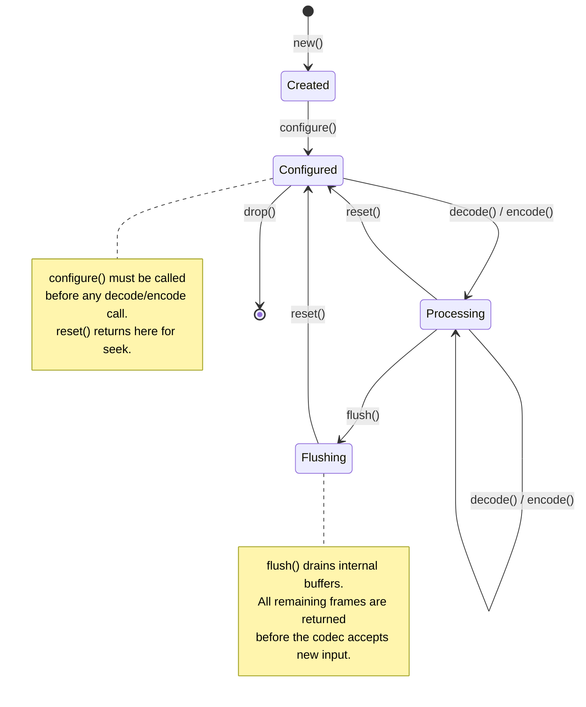
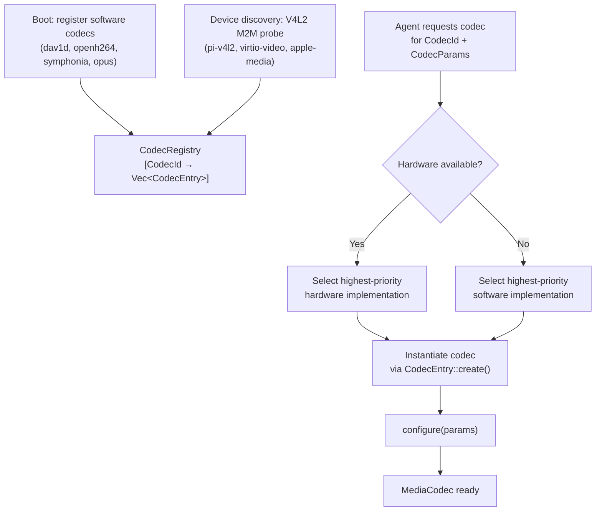
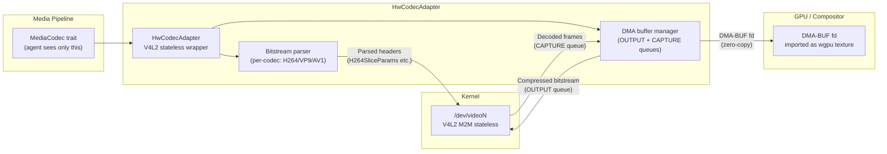
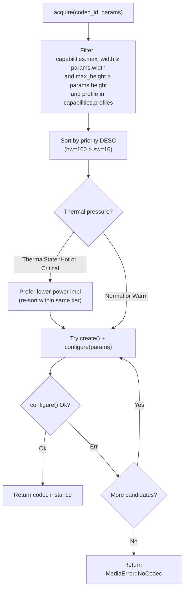
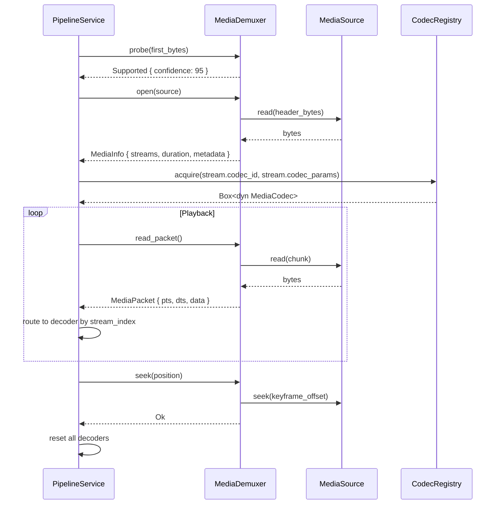

# AIOS Media Pipeline — Codec Framework & Container Engine

Part of: [media-pipeline.md](../media-pipeline.md) — Media Pipeline

**Related:** [playback.md](./playback.md) — Pipeline graph model and A/V sync, [streaming.md](./streaming.md) — Streaming protocols, [drm.md](./drm.md) — Content protection and CENC decryption, [integration.md](./integration.md) — Cross-subsystem coordination and POSIX bridge

-----

## §3 Codec Framework

The codec framework provides a uniform abstraction over all audio and video encoders and decoders. Hardware implementations, software libraries, and future neural codecs all satisfy the same `MediaCodec` trait. The codec registry discovers available implementations at boot and at runtime, selects the best match for each `CodecId`, and falls back transparently when a preferred implementation fails to initialize.

### §3.1 MediaCodec Trait

Every codec — encoder or decoder, hardware or software — implements `MediaCodec`. The trait is designed to be stateful (each instance holds codec context) while remaining safe to move across threads.

```rust
/// Unique identifier for a compressed format.
#[derive(Debug, Clone, Copy, PartialEq, Eq, Hash)]
pub enum CodecId {
    // Video
    H264,
    H265,
    VP8,
    VP9,
    AV1,
    // Audio
    AAC,
    Opus,
    Vorbis,
    Flac,
    Pcm,
    Mp3,
}

/// Whether a codec processes video, audio, or subtitle data.
#[derive(Debug, Clone, Copy, PartialEq, Eq)]
pub enum CodecType {
    Video,
    Audio,
    Subtitle,
}

/// Static properties of a codec implementation.
#[derive(Debug, Clone)]
pub struct CodecCapabilities {
    pub codec_id: CodecId,
    pub codec_type: CodecType,
    /// Maximum supported resolution (video only).
    pub max_width: u32,
    pub max_height: u32,
    /// Maximum sample rate in Hz (audio only).
    pub max_sample_rate: u32,
    /// Supported codec profiles (e.g., H.264 Baseline/Main/High).
    pub profiles: Vec<u32>,
    /// Supported codec levels.
    pub levels: Vec<u32>,
    /// True if this implementation uses a dedicated hardware engine.
    pub hw_accelerated: bool,
}

/// Parameters used to configure a codec instance before processing begins.
#[derive(Debug, Clone)]
pub struct CodecParams {
    // Video
    pub width: u32,
    pub height: u32,
    pub pixel_format: PixelFormat,
    pub profile: u32,
    pub level: u32,
    // Audio
    pub sample_rate: u32,
    pub channels: u32,
    // Shared
    pub bitrate: u64,
    pub extra_data: Vec<u8>, // SPS/PPS for H.264, AudioSpecificConfig for AAC, etc.
}

/// A compressed data packet carrying one or more encoded frames.
#[derive(Debug, Clone)]
pub struct MediaPacket {
    pub stream_index: u32,
    /// Presentation timestamp in stream time base units.
    pub pts: i64,
    /// Decode timestamp (may differ from pts for B-frames).
    pub dts: i64,
    /// Duration in stream time base units.
    pub duration: i64,
    pub data: Vec<u8>,
    pub key_frame: bool,
    pub codec_id: CodecId,
}

/// A decoded output frame, either video pixels or audio samples.
#[derive(Debug)]
pub enum MediaFrame {
    Video {
        pts: i64,
        width: u32,
        height: u32,
        format: PixelFormat,
        /// Planar or packed pixel data (format-dependent layout).
        data: Vec<u8>,
        /// Bytes per row for the first plane.
        stride: u32,
    },
    Audio {
        pts: i64,
        sample_rate: u32,
        channels: u32,
        /// Interleaved signed 32-bit integer samples (normalized float representation).
        samples: Vec<i32>,
        /// Number of samples per channel in this frame.
        frames: u32,
    },
}

/// Core abstraction for all encoders and decoders.
pub trait MediaCodec: Send + Sync {
    fn codec_id(&self) -> CodecId;
    fn codec_type(&self) -> CodecType;
    fn capabilities(&self) -> CodecCapabilities;

    /// Apply parameters before the first call to encode or decode.
    /// Must be called exactly once after construction and before processing.
    fn configure(&mut self, params: &CodecParams) -> Result<(), MediaError>;

    /// Submit an encoded packet and receive zero or more decoded frames.
    /// Returns an empty Vec when the codec has buffered the packet internally.
    fn decode(&mut self, packet: &MediaPacket) -> Result<Vec<MediaFrame>, MediaError>;

    /// Submit a decoded frame and receive zero or more encoded packets.
    fn encode(&mut self, frame: &MediaFrame) -> Result<Vec<MediaPacket>, MediaError>;

    /// Signal end-of-stream; drain any internally buffered frames or packets.
    fn flush(&mut self) -> Result<Vec<MediaFrame>, MediaError>;

    /// Return the codec to its post-configure state without releasing resources.
    /// Used for seek operations.
    fn reset(&mut self);
}
```

**Codec lifecycle state machine:**



The `extra_data` field in `CodecParams` carries codec-specific out-of-band configuration: SPS and PPS NAL units for H.264/H.265, `AudioSpecificConfig` for AAC, and the `OpusHead` packet for Opus. Container demuxers populate this from the container's codec private data before passing `CodecParams` to `configure()`.

-----

### §3.2 Codec Registry

The `CodecRegistry` is a subsystem-level singleton that maintains the full list of available codec implementations. It is populated at boot from statically registered software codecs and extended at runtime when hardware codec devices are discovered.



```rust
/// A registered codec entry with metadata and a factory function.
pub struct CodecEntry {
    pub codec_id: CodecId,
    pub capabilities: CodecCapabilities,
    /// Higher values are preferred. Hardware codecs register at priority 100;
    /// software codecs register at priority 10.
    pub priority: u32,
    pub create: fn() -> Box<dyn MediaCodec>,
}

/// Global codec registry service.
pub struct CodecRegistry {
    codecs: Vec<CodecEntry>,
}

impl CodecRegistry {
    /// Register a codec implementation. Called at boot or on device arrival.
    pub fn register(&mut self, entry: CodecEntry);

    /// Unregister all codecs associated with a hardware device that has been removed.
    pub fn unregister_device(&mut self, device_id: DeviceId);

    /// Return the best available codec for the given id and parameters,
    /// instantiated and ready for configure().
    pub fn acquire(&self, id: CodecId, params: &CodecParams)
        -> Result<Box<dyn MediaCodec>, MediaError>;

    /// List all registered implementations for a codec id, sorted by priority.
    pub fn list(&self, id: CodecId) -> Vec<&CodecEntry>;
}
```

Priority ordering within each `CodecId` bucket: hardware codecs (priority 100) rank above software codecs (priority 10). When multiple hardware codecs are available for the same format (e.g., two V4L2 M2M devices on a board with redundant media engines), the registry breaks ties by power consumption estimate stored in the `CodecEntry` metadata.

-----

### §3.3 Hardware Codec Abstraction

Hardware codec support centers on the V4L2 stateless API, which is the standard Linux kernel interface for dedicated media processors. In the V4L2 stateless model, the driver does not parse bitstream headers — the application parses them and passes parsed metadata per-frame alongside the raw bitstream slice. This is architecturally cleaner for capability-based security because the kernel media driver never sees raw unvalidated bitstream data; header parsing happens in a sandboxed userspace context.

The `HwCodecAdapter` wraps V4L2 stateless access using the `cros-codecs` Rust library (Apache-2.0, no GPL in kernel), which provides safe Rust bindings to `/dev/video*` codec devices.



**Buffer management:** Hardware codecs use two V4L2 buffer queues. The `OUTPUT` queue carries compressed input data (e.g., a single H.264 slice). The `CAPTURE` queue carries decoded output frames in NV12 or similar planar YUV format. Both queues are backed by DMA-contiguous memory allocated through the DMA pool (see [device-model/dma.md](../../kernel/device-model/dma.md) §11). Output frames on the `CAPTURE` queue are exported as `DMA-BUF` file descriptors and imported directly into wgpu as external textures, eliminating any CPU copy on the decoded frame path.

**VirtIO-Video** (draft spec, future): On QEMU or hypervisors that implement the VirtIO-Video device, the `HwCodecAdapter` can target the VirtIO virtqueue transport instead of a physical V4L2 device. The trait interface is identical; only the backend changes.

**Apple Silicon media engines** (future): VideoToolbox integration via a platform-specific backend. The `MediaCodec` trait maps to `VTDecompressionSession` for decode and `VTCompressionSession` for encode. Frames are returned as `IOSurface`-backed buffers, imported into wgpu via the Metal texture import path.

Cross-reference: [gpu/rendering.md](../gpu/rendering.md) §12 (GPU memory management and external texture import).

-----

### §3.4 Software Codec Implementations

Software codecs run on the CPU and are always available regardless of hardware. They are the fallback path and the primary path on QEMU.

| Codec | Library | Direction | Notes |
|---|---|---|---|
| H.264 | `openh264` (Cisco, BSD-2) | Decode + encode | Baseline profile; encoder used for WebRTC |
| AV1 | `dav1d` (VideoLAN, BSD-2) | Decode | NEON SIMD paths for aarch64; fastest open AV1 decoder |
| VP9 | `libvpx` (Google, BSD-3) | Decode | Used for WebM/WebRTC; NEON acceleration |
| AAC | `symphonia` (Apache-2) | Decode | Profiles: LC, HE-AACv1/v2 |
| FLAC | `symphonia` (Apache-2) | Decode | Lossless; also used as container |
| Vorbis | `symphonia` (Apache-2) | Decode | OGG container audio |
| MP3 | `symphonia` (Apache-2) | Decode | MPEG-1/2 Audio Layer III |
| Opus | `opus` crate (BSD-3) | Decode + encode | WebRTC audio; 2.5ms–60ms frame sizes |

**Performance budgets:** Software decode must complete within the frame duration to avoid A/V drift. At 30 fps the budget is 33 ms per frame; at 60 fps it is 16 ms. Decode threads run at `SchedulerClass::Interactive` to receive a 10 ms timeslice with preemption, preventing decode latency spikes from blocking other subsystems. For 1080p AV1 on `cortex-a72`, `dav1d` with NEON typically achieves 60 fps at around 60–70% CPU utilization on a single core, leaving headroom for audio and compositor work on the remaining cores.

Cross-reference: [scheduler.md](../../kernel/scheduler.md) — RT and Interactive scheduler classes.

**NEON SIMD on aarch64:** `dav1d` ships hand-written NEON assembly for its inner decode loops (IDCT, MC, loop filter). These are compiled as part of the `dav1d` C library and linked into the media pipeline service. No unsafe Rust is required to call them; the `dav1d` crate exposes a safe Rust API. The FPU is enabled in `boot.S` before any Rust code runs, so NEON is available throughout kernel-space and userspace.

**Memory budgets per instance:**

| Codec | Reference frame buffer | Working set |
|---|---|---|
| H.264 1080p decode | ~50 MB (16 DPB frames × NV12) | ~8 MB |
| AV1 1080p decode | ~80 MB (film grain + 8 DPB frames) | ~12 MB |
| AAC decode | < 1 MB | < 256 KB |
| Opus decode | < 512 KB | < 64 KB |

Reference frame buffers are allocated from the `Pool::User` page pool via the frame allocator, not from the kernel slab, to avoid exhausting slab caches with large video buffer allocations.

-----

### §3.5 Codec Selection Strategy

When an agent requests a codec via `CodecRegistry::acquire()`, the registry ranks all registered implementations for the requested `CodecId` and returns the highest-priority implementation that can satisfy the requested parameters.

**Selection algorithm:**



**Thermal-aware selection:** When the thermal subsystem reports `ThermalState::Hot` or `ThermalState::Critical`, the codec registry re-ranks candidates to prefer lower-power implementations even at the cost of throughput. Specifically: if a hardware codec is available but draws high power (e.g., a dedicated AV1 engine running at peak frequency), and a software codec using two low-frequency cores consumes less total SoC power, the registry selects the software path under thermal pressure.

Cross-reference: [thermal.md](../thermal.md) §6 (ThermalState escalation levels) and [thermal/scheduling.md](../thermal/scheduling.md) §6 (WCET-aware scheduling under pressure).

**Capability-aware selection:** Hardware codecs require a `MediaHardwareDecode` capability token. If the requesting agent holds only `MediaPlayback` (without the hardware decode sub-capability), the registry skips hardware implementations and selects from software codecs only. This provides a clean security boundary: untrusted agents can decode video in software without any hardware resource access.

**Fallback contract:** The registry guarantees that if any registered implementation for a `CodecId` can satisfy `params`, `acquire()` returns `Ok`. An agent never receives `MediaError::NoCodec` for a supported format solely because the preferred hardware implementation failed to initialize.

-----

## §4 Container Format Engine

Container formats multiplex compressed audio, video, and subtitle streams into a single file or network stream. The container engine provides `MediaDemuxer` for reading (playback, transcode) and `MediaMuxer` for writing (recording, export). Both traits interact with pluggable `MediaSource` and `MediaSink` I/O abstractions, so the same demuxer code handles local files (via Space object reads) and progressive HTTP streams (via the NTM networking layer) without modification.

-----

### §4.1 MediaDemuxer Trait

```rust
/// Confidence level returned by the probe function.
#[derive(Debug, Clone, Copy, PartialEq, Eq, PartialOrd, Ord)]
pub enum ProbeResult {
    /// This demuxer definitely cannot parse the data.
    Unsupported,
    /// More data is required before a determination can be made.
    NeedMoreData,
    /// Demuxer recognizes the format with the given confidence (0–100).
    Supported { confidence: u8 },
}

/// Metadata extracted from the container header.
#[derive(Debug, Clone)]
pub struct MediaInfo {
    /// Total duration; None for live streams.
    pub duration: Option<Duration>,
    pub streams: Vec<StreamInfo>,
    /// Key–value metadata (title, artist, album, comment, etc.).
    pub metadata: Vec<(String, String)>,
    /// Chapter list for long-form content; empty if no chapters.
    pub chapters: Vec<Chapter>,
    /// Embedded cover art (JPEG or PNG bytes); None if absent.
    pub cover_art: Option<Vec<u8>>,
}

/// Description of one elementary stream within the container.
#[derive(Debug, Clone)]
pub struct StreamInfo {
    pub stream_index: u32,
    pub codec_id: CodecId,
    /// Parameters to pass to CodecRegistry::acquire().
    pub codec_params: CodecParams,
    /// Rational time base (e.g., 1/90000 for MPEG-TS).
    pub time_base: (u64, u64),
    /// BCP-47 language tag (e.g., "en", "ja").
    pub language: Option<String>,
    /// True for the default stream of this type.
    pub default: bool,
}

/// A named chapter position.
#[derive(Debug, Clone)]
pub struct Chapter {
    pub title: String,
    pub start: Duration,
    pub end: Duration,
}

/// Byte-oriented media source (file, HTTP, pipe).
pub trait MediaSource: Send {
    fn read(&mut self, buf: &mut [u8]) -> Result<usize, MediaError>;
    fn seek(&mut self, position: u64) -> Result<(), MediaError>;
    fn tell(&self) -> u64;
    fn size(&self) -> Option<u64>;
}

/// Container format parser.
pub trait MediaDemuxer: Send {
    /// Inspect the first bytes of data and return a confidence score.
    /// Called before open(); must not consume data.
    fn probe(data: &[u8]) -> ProbeResult where Self: Sized;

    /// Parse the container header and populate MediaInfo.
    fn open(&mut self, source: &mut dyn MediaSource) -> Result<MediaInfo, MediaError>;

    /// Read and return the next packet from any stream.
    /// Returns Ok(None) at end-of-stream.
    fn read_packet(&mut self) -> Result<Option<MediaPacket>, MediaError>;

    /// Seek to the nearest keyframe before or at the requested position.
    /// Callers must discard packets until the first keyframe after this call.
    fn seek(&mut self, position: Duration) -> Result<(), MediaError>;

    fn streams(&self) -> &[StreamInfo];
}
```

**Demuxer data flow:**



**Seeking semantics:** `seek()` positions the demuxer at the nearest keyframe before or at `position`. This is keyframe-granular seeking, not sample-accurate. For sample-accurate seeking, the pipeline continues reading and discarding packets after the seek until the desired PTS is reached (decode-and-discard). Most user-facing players use keyframe-granular seeking for speed and implement sample-accurate seeking only when required by the application (e.g., video export).

-----

### §4.2 Supported Containers

| Format | Implementation | Streams | Seeking | DRM | Notes |
|---|---|---|---|---|---|
| MP4 / MOV (ISO BMFF) | `mp4parse-rust` (Mozilla, MPL-2) | H.264, H.265, AV1, AAC, OPUS | Yes | CENC (cbcs/ctr) | Fragmented MP4 for streaming; moov-at-front for files |
| WebM (Matroska subset) | `ebml-iterable` + custom parser | VP8, VP9, AV1, Vorbis, Opus | Yes | No | Primary web video format |
| MKV (Matroska) | Same parser, full schema | All combinations | Yes | No | Chapters, multi-audio, multi-subtitle |
| MPEG-TS | Custom parser | H.264, H.265, AAC, MP3, AC-3 | Keyframe | No | HLS segment container; broadcast |
| OGG | `ogg` crate (BSD-3) | Vorbis, Opus, Theora | Granule position | No | Native Opus/Vorbis container |
| WAV | Built-in | PCM, ADPCM | Yes | No | Uncompressed audio |
| AIFF | Built-in | PCM | Yes | No | Apple uncompressed audio |
| FLAC | `symphonia` (Apache-2) | FLAC | Seektable | No | Lossless; native FLAC container |

**MP4/ISO BMFF details:** The `mp4parse-rust` library (used in Firefox, MPL-2.0 licensed) parses the `moov` box for track metadata and `mdat` for media data. Fragmented MP4 (`ftyp: iso5` with `moof`+`mdat` segments) is handled identically to regular MP4 from the demuxer trait's perspective — the `MediaSource` abstraction hides whether segments arrive over HTTP or from a local file. CENC-encrypted MP4 boxes (`schm`, `schi`, `tenc`, `saiz`, `saio`) are parsed and forwarded to the DRM manager (see [drm.md](./drm.md) §11) rather than passed to the codec directly.

**MPEG-TS details:** Used as the container for HLS segments and live broadcast feeds. The custom MPEG-TS parser handles PAT/PMT table parsing for program discovery, PES packet reassembly, and PCR-based clock recovery. Discontinuity handling (DTS/PTS resets across segments) is managed by the demuxer, which remaps timestamps to a continuous timeline before emitting `MediaPacket` instances.

-----

### §4.3 MediaMuxer Trait

The muxer is the write-side counterpart of the demuxer, used for recording, screen capture, and media export.

```rust
/// Configuration for the output container.
#[derive(Debug, Clone)]
pub struct MuxerConfig {
    pub format: ContainerFormat,
    /// For MP4: place the moov atom at the beginning of the file for
    /// progressive download. Requires a two-pass write or temporary buffer.
    pub faststart: bool,
    /// For fragmented MP4/DASH: maximum fragment duration.
    pub fragment_duration: Option<Duration>,
}

#[derive(Debug, Clone, Copy, PartialEq, Eq)]
pub enum ContainerFormat {
    Mp4,
    Mkv,
    Ogg,
    Wav,
    Flac,
    MpegTs,
}

/// Byte-oriented media sink (file, pipe, network).
pub trait MediaSink: Send {
    fn write(&mut self, data: &[u8]) -> Result<(), MediaError>;
    fn seek(&mut self, position: u64) -> Result<(), MediaError>;
    fn flush(&mut self) -> Result<(), MediaError>;
}

/// Container format writer.
pub trait MediaMuxer: Send {
    /// Open the sink and write any container header bytes.
    fn open(&mut self, sink: &mut dyn MediaSink, config: MuxerConfig)
        -> Result<(), MediaError>;

    /// Register a stream and return its stream index.
    /// Must be called for all streams before write_packet().
    fn add_stream(&mut self, info: &StreamInfo) -> Result<usize, MediaError>;

    /// Write one encoded packet to the container.
    fn write_packet(&mut self, packet: &MediaPacket) -> Result<(), MediaError>;

    /// Flush all buffered data and finalize the container.
    /// For MP4 with faststart: seeks to the beginning and rewrites the moov atom.
    fn finalize(&mut self) -> Result<(), MediaError>;
}
```

**Primary use cases:**

- **Camera recording:** `CameraSource → ISP → H264Encoder → MP4Muxer → FileSink`. The recording pipeline uses `MuxerConfig::fragment_duration = Some(1s)` to write fragmented MP4, enabling partial recovery if the recording is interrupted. See [camera/sessions.md](../camera/sessions.md) §6.
- **Screen capture:** `CompositorSource → VP9Encoder → WebMMuxer → FileSink` or `MP4Muxer` depending on agent preference. Capture is subject to the compositor's capture permission system ([compositor/security.md](../compositor/security.md) §10.3).
- **Podcast/audio recording:** `AudioCapture → OpusEncoder → OGGMuxer → FileSink`. The OGG muxer encapsulates one Opus stream per Ogg logical bitstream.
- **Transcode:** `FileSource → AnyDemuxer → [decoders] → [encoders] → AnyMuxer → FileSink`. The pipeline graph model handles arbitrary codec combinations without special-casing.

**MP4 faststart:** The `faststart` flag in `MuxerConfig` causes the MP4 muxer to operate in two passes. In the first pass, `mdat` is written sequentially. When `finalize()` is called, the muxer computes the final `moov` atom size, seeks back to the beginning of the file, writes the `moov` atom, and shifts the `mdat` data. This enables HTTP progressive download without requiring the entire file before playback can begin. For streaming use cases where seek is unavailable (e.g., writing to a pipe), faststart is disabled and `moov` is written at the end.

-----

### §4.4 Metadata and Chapters

Media files carry rich metadata embedded in container-specific structures. The demuxer normalizes all metadata into a flat `Vec<(String, String)>` key-value list within `MediaInfo`, using common key names regardless of container.

**Metadata sources by format:**

| Format | Metadata location | Cover art |
|---|---|---|
| MP4/M4A | `udta/meta/ilst` atoms | `covr` atom (JPEG/PNG) |
| MKV/WebM | `Tags` element (Matroska) | `AttachedFile` element |
| OGG/FLAC | Vorbis comment block | `METADATA_BLOCK_PICTURE` |
| MP3 | ID3v2 tags (`TIT2`, `TPE1`, `TALB`, etc.) | `APIC` frame (JPEG/PNG) |
| WAV/AIFF | `INFO` chunk (`INAM`, `IART`, etc.) | None (format limitation) |

**Normalized key names** (used across all formats):

```text
title, artist, album, album_artist, composer, genre, date, track,
disc, comment, copyright, encoder, description, lyrics
```

**Chapter support:** Chapters are extracted from `ChapterAtom` elements (Matroska), `chpl` atoms (MP4), or ID3v2 `CHAP` frames (MP3). Each chapter has a title, start time, and end time. The playback subsystem exposes chapters through the `MediaSession` API, allowing media player agents to display chapter markers and implement chapter-based navigation.

**Cover art extraction:** Embedded JPEG or PNG cover art is returned as raw bytes in `MediaInfo::cover_art`. The media player agent submits this to the Compositor as an image surface for display in the player UI. Cover art is not decoded by the media pipeline — it is passed opaquely to the Compositor, which handles JPEG/PNG decoding via the GPU rendering path ([gpu/rendering.md](../gpu/rendering.md) §10).

**Integration with Flow:** When media files are ingested into a Space, the storage layer creates a `FlowEntry` for each file. The demuxer's `MediaInfo` is used to populate `TypedContent` fields on the `FlowEntry`: title, artist, album, and duration become first-class searchable properties, while the content hash of the file maps to a `ContentHash` field for deduplication. Cover art bytes are stored as a separate linked object in the same Space.

Cross-reference: [flow/data-model.md](../../storage/flow/data-model.md) §3 (FlowEntry, TypedContent) and [storage/spaces/data-structures.md](../../storage/spaces/data-structures.md) §3.3 (CompactObject fields).

-----

### Cross-Reference Index

| Topic | Document | Section |
|---|---|---|
| GPU memory management and texture import | [gpu/rendering.md](../gpu/rendering.md) | §12 |
| GPU drivers and VirtIO-GPU | [gpu/drivers.md](../gpu/drivers.md) | §3 |
| DMA buffer lifecycle and IOMMU | [device-model/dma.md](../../kernel/device-model/dma.md) | §11 |
| RT and Interactive scheduler classes | [scheduler.md](../../kernel/scheduler.md) | §3.1 |
| ThermalState escalation | [thermal/scheduling.md](../thermal/scheduling.md) | §6 |
| Thermal-aware scheduling (WCET) | [thermal/scheduling.md](../thermal/scheduling.md) | §6 |
| CENC decryption and CDM trait | [drm.md](./drm.md) | §11 |
| A/V sync and pipeline graph | [playback.md](./playback.md) | §5, §6 |
| HLS/DASH adaptive streaming | [streaming.md](./streaming.md) | §7, §8 |
| Camera recording session | [camera/sessions.md](../camera/sessions.md) | §6 |
| Compositor capture permissions | [compositor/security.md](../compositor/security.md) | §10.3 |
| FlowEntry and TypedContent | [flow/data-model.md](../../storage/flow/data-model.md) | §3 |
| CompactObject storage fields | [storage/spaces/data-structures.md](../../storage/spaces/data-structures.md) | §3.3 |
| Audio subsystem mixer and RT scheduling | [audio/scheduling.md](../audio/scheduling.md) | §6 |
| Capability system token lifecycle | [security/model/capabilities.md](../../security/model/capabilities.md) | §3.1–§3.6 |
