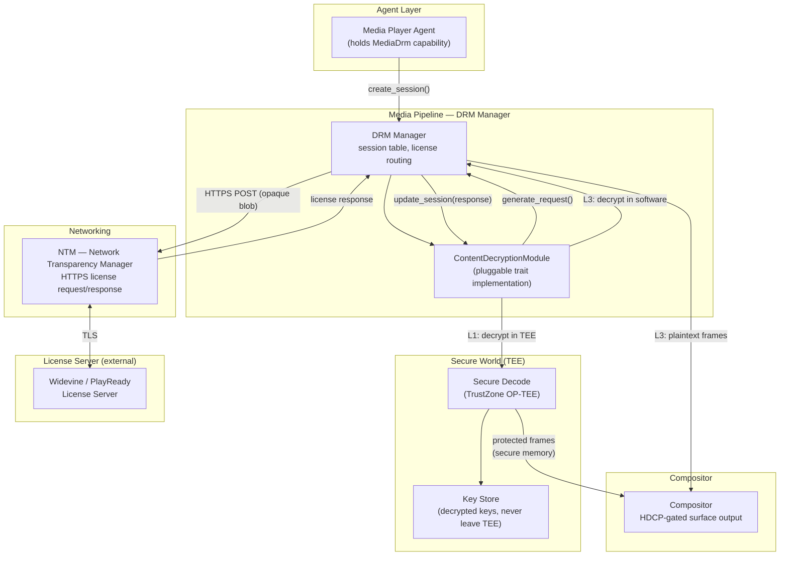
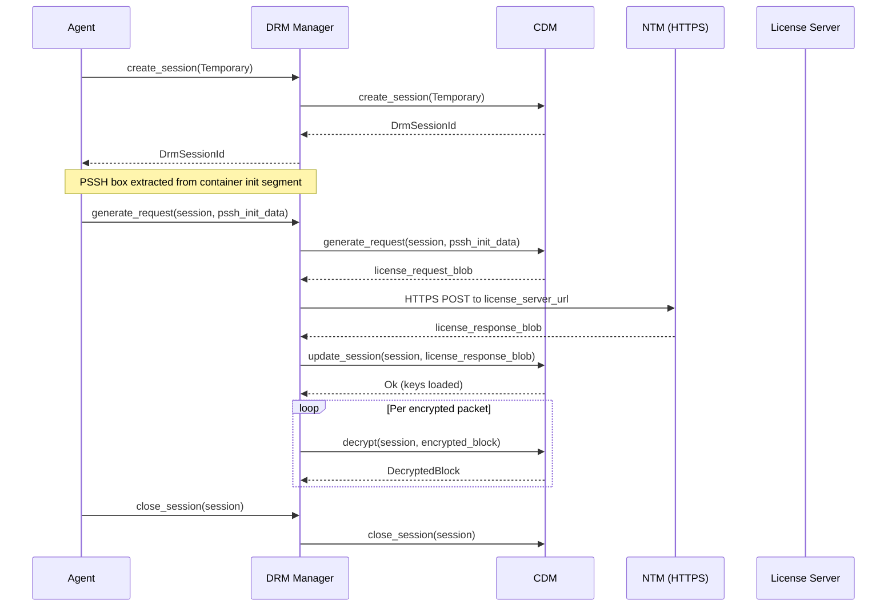
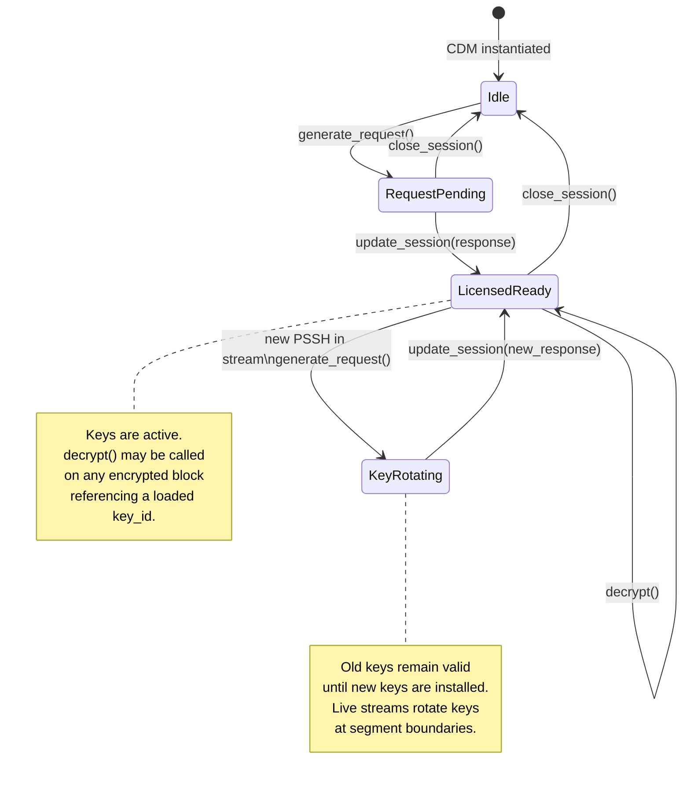
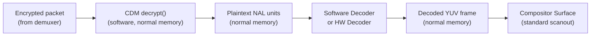
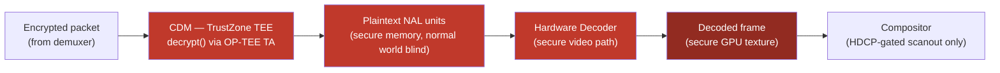
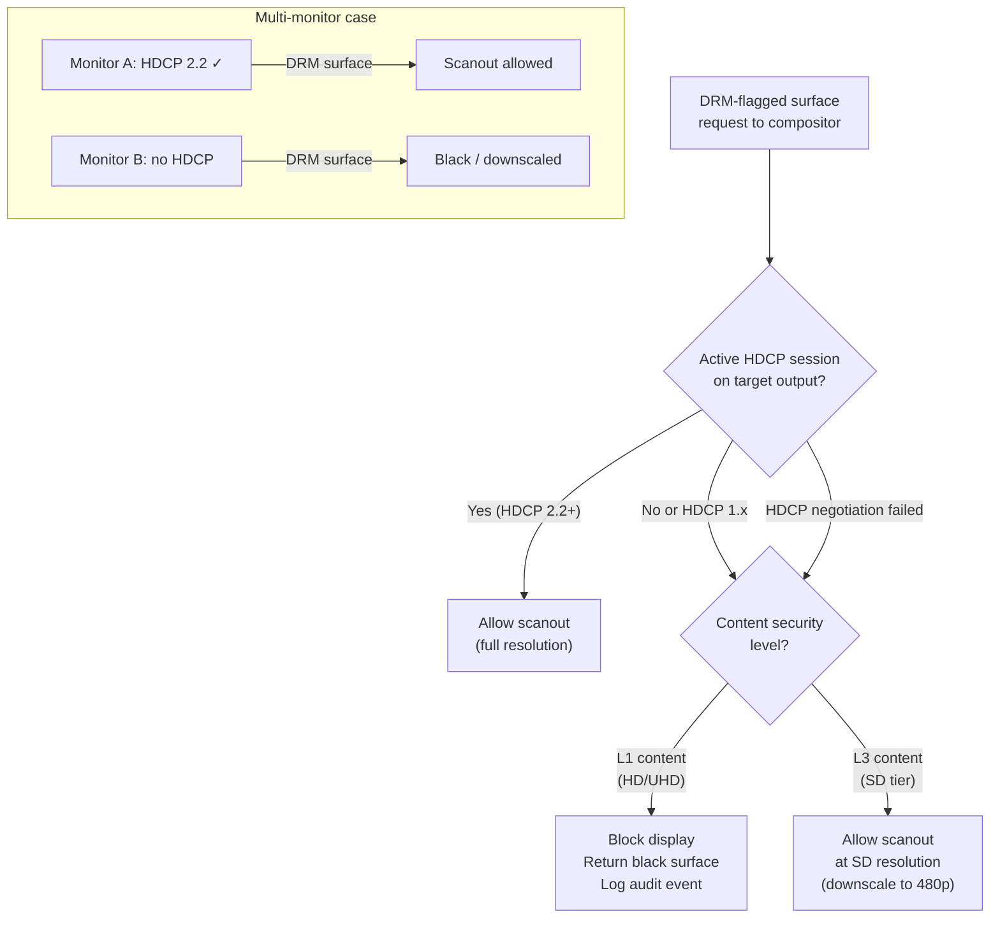

# AIOS Media Pipeline — Content Protection

Part of: [media-pipeline.md](../media-pipeline.md) — Media Pipeline

**Related:** [codecs.md](./codecs.md) — Codec framework (secure decode path), [playback.md](./playback.md) — Pipeline graph (DRM pipeline variant), [streaming.md](./streaming.md) — HLS/DASH encryption and CENC, [integration.md](./integration.md) — Security capabilities and audit

-----

## §11 Content Protection

Content protection integrates DRM (Digital Rights Management) into the media pipeline without burdening non-DRM workloads. Every DRM concept — CDM lifecycle, license exchange, CENC decryption, secure decode — is encapsulated behind the `ContentDecryptionModule` trait. Pipelines without DRM content never touch this subsystem.

-----

### §11.1 DRM Architecture

DRM in AIOS is structured around three separation-of-concerns principles: license management is the CDM's responsibility, key material never crosses the TEE boundary for L1 content, and the pipeline only handles opaque blobs and capability-gated decrypt calls.



**Session lifecycle for a DRM playback pipeline:**



**Design principles:**

- DRM is per-pipeline, not global — non-DRM pipelines have zero overhead from this subsystem.
- The CDM trait is pluggable — Widevine, PlayReady, FairPlay, and ClearKey are interchangeable backends sharing one interface.
- Secure decode is optional — L3 (software CDM) works without a TEE. L1 (hardware CDM) requires TrustZone.
- License management is entirely the CDM's responsibility — the pipeline only passes opaque request and response blobs.
- Audit: every `create_session`, `generate_request`, `update_session`, `decrypt`, and `close_session` call is logged to the kernel audit ring.

Cross-reference: [integration.md](./integration.md) §15 (security and audit for media sessions).

-----

### §11.2 ContentDecryptionModule Trait

Every CDM backend implements the `ContentDecryptionModule` trait. The DRM Manager holds a registry of available CDMs, keyed by `DrmSystemId` (a UUID identifying the DRM system). At session creation time, the manager selects the CDM matching the system ID found in the container's PSSH box.

```rust
/// UUID identifying a DRM system. Well-known values:
/// Widevine:  edef8ba9-79d6-4ace-a3c8-27dcd51d21ed
/// PlayReady: 9a04f079-9840-4286-ab92-e65be0885f95
/// FairPlay:  94ce86fb-07ff-4f43-adb8-93d2fa968ca2
/// ClearKey:  1077efec-c0b2-4d02-ace3-3c1e52e2fb4b
#[derive(Debug, Clone, Copy, PartialEq, Eq, Hash)]
pub struct DrmSystemId(pub [u8; 16]);

/// Session type controls license persistence behavior.
#[derive(Debug, Clone, Copy, PartialEq, Eq)]
pub enum DrmSessionType {
    /// Keys are valid for this playback session only. Default.
    Temporary,
    /// Keys are stored persistently for offline playback.
    PersistentLicense,
    /// Keys are stored; usage records are reported to the license server.
    PersistentUsageRecord,
}

/// Opaque session handle allocated by the CDM.
#[derive(Debug, Clone, Copy, PartialEq, Eq, Hash)]
pub struct DrmSessionId(pub u64);

/// CDM security level, reflecting the hardware protection available.
#[derive(Debug, Clone, Copy, PartialEq, Eq, PartialOrd, Ord)]
pub enum SecurityLevel {
    /// Software-only CDM. Keys in process memory. SD content only.
    L3,
    /// Hardware crypto, software decode path. Limited content tiers.
    L2,
    /// Full hardware TEE. Keys never leave secure world. HD/UHD content.
    L1,
}

/// One encrypted subrange within a media sample (CENC sub-sample encryption).
/// Clear bytes precede the encrypted range within each subsample entry.
#[derive(Debug, Clone, Copy)]
pub struct SubsampleEntry {
    pub clear_bytes: u32,
    pub encrypted_bytes: u32,
}

/// An encrypted block of media data to be decrypted by the CDM.
#[derive(Debug)]
pub struct EncryptedBlock<'a> {
    pub data: &'a [u8],
    /// AES initialization vector (16 bytes for CTR/CBC).
    pub iv: [u8; 16],
    /// Key identifier within the active license.
    pub key_id: [u8; 16],
    /// Sub-sample encryption map. Empty means the entire block is encrypted.
    pub subsamples: &'a [SubsampleEntry],
    /// CENC encryption scheme.
    pub scheme: CencScheme,
}

#[derive(Debug, Clone, Copy, PartialEq, Eq)]
pub enum CencScheme {
    /// AES-128 CTR mode — full sample encryption. Common in DASH.
    Cenc,
    /// AES-128 CBC mode with pattern encryption. Common in HLS.
    Cbcs,
}

/// Decrypted output. For L1 CDMs, the data pointer references secure memory
/// that the normal world cannot read — only the GPU/compositor DMA path can.
#[derive(Debug)]
pub struct DecryptedBlock {
    pub data: Vec<u8>,
    /// True when data resides in TEE secure memory (L1 path).
    /// The compositor must use a hardware-protected DMA path to consume it.
    pub secure_memory: bool,
}

/// The pluggable CDM interface. All DRM backends implement this trait.
pub trait ContentDecryptionModule: Send + Sync {
    /// Return the DRM system UUID this CDM implements.
    fn system_id(&self) -> &DrmSystemId;

    /// Allocate a new DRM session.
    fn create_session(
        &mut self,
        session_type: DrmSessionType,
    ) -> Result<DrmSessionId, MediaError>;

    /// Generate a license request blob from PSSH initialization data.
    /// The returned bytes are sent verbatim to the license server.
    fn generate_request(
        &mut self,
        session: DrmSessionId,
        init_data: &[u8],
    ) -> Result<Vec<u8>, MediaError>;

    /// Install a license response from the license server into the session.
    /// After a successful call, the CDM can decrypt content using the session.
    fn update_session(
        &mut self,
        session: DrmSessionId,
        response: &[u8],
    ) -> Result<(), MediaError>;

    /// Decrypt one encrypted block. For L1 CDMs, decryption occurs inside the
    /// TEE; the returned DecryptedBlock references secure memory.
    fn decrypt(
        &self,
        session: DrmSessionId,
        encrypted: &EncryptedBlock<'_>,
    ) -> Result<DecryptedBlock, MediaError>;

    /// Release a session and its associated keys.
    fn close_session(&mut self, session: DrmSessionId) -> Result<(), MediaError>;

    /// Report the security level of this CDM implementation.
    fn security_level(&self) -> SecurityLevel;
}
```

**CDM lifecycle state machine:**



-----

### §11.3 DRM Systems

AIOS supports four DRM systems at different security levels. The `DrmSystemId` UUID in the container's PSSH box selects the CDM at session creation time.

#### ClearKey (W3C EME)

ClearKey is the W3C Encrypted Media Extensions reference implementation. Keys are exchanged unencrypted in JSON Web Key (JWK) format. It requires no license server (keys can be inline in the agent) and carries no licensing restrictions.

- **Purpose:** Development, testing, and open-access encrypted content.
- **Security level:** L3 (software only — keys are in process memory by definition).
- **Key format:** JWK Set (`{"keys": [{"kty":"oct","k":"<base64url>","kid":"<base64url>"}]}`).
- **Always available:** registered at boot; no vendor agreement required.
- **CENC schemes:** both `cenc` (CTR) and `cbcs` (CBC) supported.

#### Widevine (Google)

Widevine is the dominant DRM for web and mobile content. Its L3 (software) CDM is the primary development baseline for AIOS because it requires no TEE.

- **L3 (software CDM):** Software decryption of SD-tier content. No TEE required. Development baseline.
- **L1 (hardware CDM):** Decryption and decode in TrustZone TEE. Required for HD and UHD content.
- **License server:** Widevine license proxy; requires a content partner agreement with Google.
- **Init data format:** PSSH box (`0xedef8ba979d64acea3c827dcd51d21ed`) in the MP4 or DASH manifest.
- **Key rotation:** signaled via a new PSSH box in each live segment.

#### PlayReady (Microsoft)

PlayReady is common in Windows ecosystem content and some streaming services.

- **SL2000 (software):** Software security, SD content.
- **SL3000 (hardware):** TEE-backed security, HD/UHD content. Requires TrustZone.
- **License server:** PlayReady license server SDK; partner agreement required.
- **Init data format:** PlayReady Object (PRO) embedded in an MP4 `pssh` box.

#### FairPlay (Apple)

FairPlay is required for Apple ecosystem content (Apple TV+, iTunes). It is hardware-backed on Apple Silicon and uses a certificate-based authentication model rather than a PSSH-box license request.

- **Availability:** Apple Silicon hardware only. FairPlay is not available on QEMU or Raspberry Pi.
- **Security level:** Always L1 on Apple hardware (Secure Enclave-backed).
- **Key delivery:** HTTP Live Streaming Key (HLS key URI in the M3U8 manifest, not a PSSH box).
- **Compatibility note:** Agents targeting Apple hardware should declare `DrmSystemId::FairPlay` in their pipeline configuration. On non-Apple hardware, the DRM Manager returns `MediaError::NoCdm` for FairPlay sessions.

**DRM system comparison:**

| System | UUID prefix | Security levels | TEE required for HD | Content tiers | Key format |
|---|---|---|---|---|---|
| ClearKey | `1077efec` | L3 only | No | Unrestricted | JWK Set |
| Widevine | `edef8ba9` | L3, L1 | L1 for HD/UHD | SD (L3), HD/UHD (L1) | PSSH box |
| PlayReady | `9a04f079` | SL2000, SL3000 | SL3000 for HD/UHD | SD (SL2000), HD/UHD (SL3000) | PlayReady Object |
| FairPlay | `94ce86fb` | L1 only | Always | All tiers | HLS key URI |

-----

### §11.4 Secure Decode Pipeline

Decrypted content must flow from the CDM to the display through a path appropriate to the content's security level. The path differs substantially between L3 and L1.

#### L3 Path (Software CDM)

The CDM decrypts in software, producing plaintext in normal process memory. The plaintext is passed to the standard software or hardware decoder, which produces decoded frames that are composited normally. This is the lowest-security path — an attacker with process memory access could extract content.



Suitable for: SD content under Widevine L3, ClearKey at any resolution, development and testing.

#### L1 Path (Hardware CDM + TEE)

The CDM decrypts inside TrustZone OP-TEE. Plaintext key material and decrypted content never appear in normal-world memory. The decoded frame is placed in a secure memory region accessible only to the GPU and compositor via protected DMA.



**TEE integration:** TrustZone OP-TEE provides the Trusted Application (TA) that holds the CDM's key store and performs AES-CTR/CBC decryption entirely within the secure world. The normal-world DRM Manager communicates with the TA over the OP-TEE client API, passing ciphertext in and receiving a secure memory handle out.

Cross-reference: [security/model/hardening.md](../../security/model/hardening.md) §5 (ARM hardware security features — TrustZone, Secure Enclave).

**Secure buffer path:** Decoded frames are stored in secure memory regions that are mapped read-only to the GPU via protected DMA. The GPU imports them as external textures using a hardware-protected import path.

Cross-reference: [gpu/security.md](../gpu/security.md) §13 (capability-gated GPU access), §14 (DMA protection and IOMMU).

-----

### §11.5 CENC (Common Encryption)

ISO/IEC 23001-7 Common Encryption (CENC) enables a single encrypted content asset to be decrypted by multiple DRM systems. The content is encrypted once; each DRM system's PSSH box carries its own opaque key delivery mechanism.

**Core concept:** All CENC-compliant DRM systems agree on the AES key ID, the IV, and the subsample layout. What differs per DRM system is how the decryption key for that key ID is delivered. CENC decouples encryption from key delivery.

#### Encryption Schemes

| Scheme | Mode | Pattern | Typical use |
|---|---|---|---|
| `cenc` | AES-128 CTR | Full sample (no skip) | DASH, smooth streaming |
| `cbcs` | AES-128 CBC | 1:9 (encrypt 1 block, skip 9) | HLS, Apple ecosystem |

**`cbcs` pattern encryption:** In the `cbcs` scheme, encryption applies to 1 block (16 bytes) out of every 10. This preserves the structure of H.264/H.265 NAL units and reduces the computational cost of decryption by ~90% relative to full-sample encryption. The unencrypted NAL unit headers allow hardware decoders to operate without requiring full TEE integration.

**Sub-sample encryption:** Video samples are never encrypted in their entirety. NAL unit headers (typically 4 bytes per NAL unit) are always in the clear; only NAL unit body bytes are encrypted. This allows hardware decoders to parse slice headers without TEE access, which is critical for the L3 decode path.

#### PSSH Box and Key IDs

The `pssh` (Protection System Specific Header) box in the MP4 `moov` or `moof` segment carries the DRM system's init data. One `pssh` box per DRM system can coexist in the same file. The container demuxer extracts all `pssh` boxes and passes them to the DRM Manager, which matches each to a registered CDM by `DrmSystemId`.

The `tenc` (Track Encryption) box in the `moov` sets the default key ID and IV for a track. Per-sample key ID and IV overrides are signaled via the `saiz`/`saio` auxiliary information tables.

#### Key Rotation (Live Streams)

For long-running live events, content providers rotate encryption keys periodically. Key rotation is signaled by a new `pssh` box appearing in the `moof` segment header of the segment where the rotation takes effect. The pipeline handles rotation as follows:

1. The demuxer emits a key rotation event alongside the first packet of the new segment.
2. The DRM Manager calls `generate_request()` on the CDM with the new `pssh` init data.
3. The CDM contacts the license server; the DRM Manager calls `update_session()` with the response.
4. Old keys remain valid (and cached by the CDM) to handle re-ordering across the rotation boundary.
5. Packets after the rotation boundary are decrypted with the new key ID.

Cross-reference: [streaming.md](./streaming.md) §7 (HLS/DASH segment processing) and §8 (jitter buffer behavior around key rotation boundaries).

-----

### §11.6 MediaDrm Capability

Access to the DRM subsystem is capability-gated. Agents without a `MediaDrm` capability token cannot create DRM sessions, regardless of what content they attempt to play.

```rust
/// Grants an agent the right to create DRM sessions and decrypt content.
pub struct MediaDrmCapability {
    /// Restrict to specific DRM systems (empty = all registered systems allowed).
    pub allowed_systems: Vec<DrmSystemId>,
    /// Maximum security level this agent may request.
    /// An L3-capped agent cannot create L1 sessions.
    pub max_security_level: SecurityLevel,
    /// Whether persistent (offline) license sessions are permitted.
    pub offline_license: bool,
    /// If true, the compositor must verify HDCP before presenting
    /// DRM-protected surfaces from this agent.
    pub hdcp_required: bool,
}
```

**Capability attenuation:** A parent agent can grant a child a reduced-scope `MediaDrm` capability. Examples:

- A media player agent grants a sub-agent `MediaDrm { allowed_systems: [ClearKey], max_security_level: L3, offline_license: false, hdcp_required: false }` for development preview playback.
- A streaming service agent holds full `MediaDrm` capability including Widevine L1 and offline licenses; it does not delegate that capability to untrusted plugin agents.

Cross-reference: [security/model/capabilities.md](../../security/model/capabilities.md) §3.4 (capability attenuation and delegation) and §3.5 (temporal capabilities — time-limited DRM licenses map naturally to temporal capability tokens).

**Trust level requirement:** The capability system enforces that only agents at or above a minimum trust level may hold `MediaDrm` capabilities. Unverified agents (trust level `Untrusted`) cannot create DRM sessions.

**Audit events logged for every DRM operation:**

| Event | Fields logged |
|---|---|
| `DrmSessionCreate` | agent PID, DRM system UUID, session type, timestamp |
| `DrmLicenseRequest` | session ID, init data hash (not content), license server URL |
| `DrmLicenseInstall` | session ID, key IDs granted, expiry time |
| `DrmDecrypt` | session ID, key ID used, byte count (not content) |
| `DrmSessionClose` | session ID, duration, decrypt count |

Cross-reference: [security/model/operations.md](../../security/model/operations.md) §7 (audit infrastructure and event routing).

-----

## §12 Output Protection

Output protection ensures that decrypted content cannot be captured or retransmitted through unauthorized paths. It is enforced at the compositor layer, cooperating with the DRM Manager's knowledge of active session security levels.

-----

### §12.1 HDCP Enforcement

High-bandwidth Digital Content Protection (HDCP) 2.2 and 2.3 protect content transmitted over HDMI, DisplayPort, and eDP links. The compositor negotiates HDCP with each connected display before allowing DRM-flagged surfaces to scan out.



**HDCP negotiation** occurs over the DDC/CEC sideband channel of the display link. The GPU driver handles the cryptographic handshake; the compositor queries the authenticated status via the display controller API before committing a frame with DRM-flagged surfaces.

Cross-reference: [compositor/security.md](../compositor/security.md) §10.3 (screen capture protection) and [gpu/display.md](../gpu/display.md) §8 (display pipeline and output control).

**Downgrade policy:**

- L1 content (HD/UHD, Widevine L1 or PlayReady SL3000): display is blocked entirely on unprotected outputs. A system notification informs the user that HDCP is required. No partial display.
- L3 content (SD tier, Widevine L3 or ClearKey): resolution is capped to SD (480p maximum) on outputs without HDCP. The compositor applies a hardware downscale before scanout. No notification is shown for SD downgrade — this is a transparent quality reduction.

**HDCP repeater support:** Downstream devices (AV receivers, KVM switches, HDMI-to-DisplayPort adapters) must support HDCP repeater protocol for DRM content to pass through. The GPU driver's HDCP negotiation follows the HDCP 2.3 repeater authentication topology.

**Multi-monitor behavior:** HDCP status is checked per output port. DRM-flagged compositor surfaces are restricted to outputs that have completed HDCP authentication. The compositor can simultaneously display DRM content on a protected monitor and non-DRM content on an unprotected monitor in the same desktop layout.

-----

### §12.2 Screen Capture Restrictions

DRM-protected compositor surfaces are excluded from all screen capture and recording paths. This is enforced at the compositor, not at the agent layer — even agents with `MediaCapture` capability cannot capture DRM surfaces.

**Capture exclusion mechanism:** The compositor maintains a `protection_level` flag on each surface. When compositing a frame for capture, the compositor substitutes a black (zero-filled) or transparent region for any surface with `protection_level > Unprotected`. The substitution happens in the compositor's CPU readback path and in the GPU compute shader used for screen recording.

Cross-reference: [compositor/security.md](../compositor/security.md) §10.3 (capture and screenshot restrictions) and §10.4 (clipboard security).

**Watermarking:** For L1 content, forensic watermarks are embedded in decoded frames by the CDM or the TEE secure decode path before the frame reaches the compositor. The watermark is imperceptible to viewers but statistically detectable in captured frames. Each session carries a unique watermark ID, enabling content providers to trace unauthorized redistribution to a specific device and playback session. The watermark ID is logged to the audit ring at session creation.

**Screenshot notification:** When a user takes a screenshot while a DRM-protected surface is visible, the event is logged to the audit ring (`ScreenshotDuringDrmPlayback` event). The screenshot itself contains only the blacked-out placeholder for the DRM region. No notification is presented to the user — the privacy protection is silent.

**Screen recording restriction:** Screen recording agents receive the same blacked-out substitution for DRM surfaces, regardless of their capability level. A recording agent holding `MediaCapture { allow_screen_record: true }` can capture all other surfaces but receives black pixels for DRM regions. This is by design — `MediaCapture` grants capture rights over the agent's own content, not over third-party DRM-protected content.

**Hardware capture device restriction:** HDCP on the display output link prevents content capture through external hardware capture cards (HDMI capture devices). An HDCP-authenticated display chain does not forward decrypted content to an unauthenticated tap. This is hardware-enforced and independent of AIOS software.

-----

### §12.3 Robustness Rules

CDM implementations must satisfy a set of robustness requirements before deployment. These rules prevent tampering with the CDM binary or its runtime environment from undermining content protection.

**CDM binary integrity:** CDM implementations are loaded as verified modules. At load time, the DRM Manager verifies the CDM binary's cryptographic signature against a trust anchor. Unsigned or tampered CDM binaries are rejected. This prevents replacement of a CDM with a modified version that leaks key material.

**Root-of-trust for L1:** An L1 CDM requires device attestation before a license server will issue L1 keys. The CDM generates an attestation report signed by the TrustZone Trusted Application, proving that:

1. The CDM TA is running inside TrustZone on authenticated hardware.
2. The normal-world CDM stub has not been tampered with.
3. The device's boot chain is unmodified (requires Secure Boot on the platform).

The license server validates this attestation before issuing keys that allow HD/UHD decryption.

**Anti-debugging:** The CDM process is configured to deny `ptrace` attachment via the capability system. A capability-less child process (which the CDM runs as) cannot grant another process `ptrace` access to itself. Additionally, the CDM TA within TrustZone is inaccessible to normal-world debugging tools by architectural design — the TrustZone secure monitor prevents any normal-world debug interface from observing secure-world execution.

Cross-reference: [security/model/layers.md](../../security/model/layers.md) §2 (process isolation layer — unprivileged agents and ptrace restriction).

**Output protection query:** Before releasing L1 keys for a playback session, the CDM may query the current HDCP status of all active display outputs. If no HDCP-authenticated output is present and the content requires HDCP, the CDM refuses to decrypt. This is a belt-and-suspenders measure — the compositor's surface-level HDCP enforcement is the primary gate, but the CDM adds a second check at the key level.

**Compliance testing:** CDM implementations must pass the DRM vendor's test suite (Widevine Compliance Test, PlayReady Compliance Rules) before deployment in production AIOS builds. Development builds may use ClearKey or Widevine L3 test CDMs that bypass compliance requirements.

**AIOS security model advantage:** The capability-based security model provides measurably stronger CDM isolation than traditional OS sandbox approaches. A CDM process in AIOS holds exactly the capabilities it needs:

- `TeeAccess` — communicate with the OP-TEE TA for L1 decryption.
- `NetworkClientRestricted` — send license requests to specific license server URLs only (NTM enforces the URL allowlist).
- `CompositorSurfaceProtected` — submit protected surfaces to the compositor.

It holds no file system access, no network access to arbitrary hosts, no IPC channels to untrusted agents. If a CDM is compromised, the blast radius is bounded by its capability set. Compare this with traditional Linux, where a CDM process running as a normal user can access the network, file system, and other process memory within the same user account.

Cross-reference: [security/model/capabilities.md](../../security/model/capabilities.md) §3.7 (composable capability profiles — minimal-authority CDM profile).

-----

### Cross-Reference Index

| Topic | Document | Section |
|---|---|---|
| CDM trait and DRM session lifecycle | This document | §11.1–§11.2 |
| CENC sub-sample encryption and key rotation | This document | §11.5 |
| MediaDrm capability and audit events | This document | §11.6 |
| HDCP enforcement per output | This document | §12.1 |
| Screen capture DRM exclusion | This document | §12.2 |
| CDM robustness and anti-debugging | This document | §12.3 |
| Codec framework and secure decode path | [codecs.md](./codecs.md) | §3.1–§3.5 |
| HLS/DASH CENC-encrypted segments | [streaming.md](./streaming.md) | §7, §8 |
| DRM pipeline variant in playback graph | [playback.md](./playback.md) | §5 |
| Security capabilities and media audit | [integration.md](./integration.md) | §15 |
| ARM TrustZone and hardware security | [security/model/hardening.md](../../security/model/hardening.md) | §5 |
| Capability token lifecycle and attenuation | [security/model/capabilities.md](../../security/model/capabilities.md) | §3.1–§3.6 |
| Audit infrastructure and event routing | [security/model/operations.md](../../security/model/operations.md) | §7 |
| Process isolation and ptrace restriction | [security/model/layers.md](../../security/model/layers.md) | §2 |
| Compositor surface capture restrictions | [compositor/security.md](../compositor/security.md) | §10.3–§10.4 |
| GPU capability-gated access and DMA | [gpu/security.md](../gpu/security.md) | §13–§14 |
| GPU display pipeline and HDCP output | [gpu/display.md](../gpu/display.md) | §8 |
