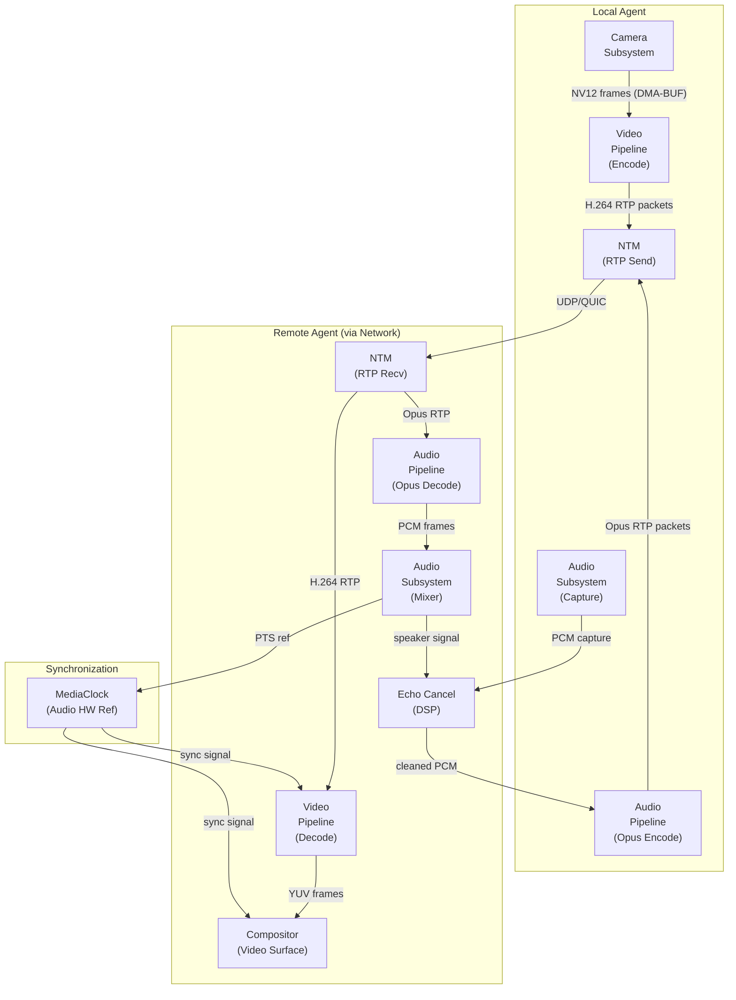
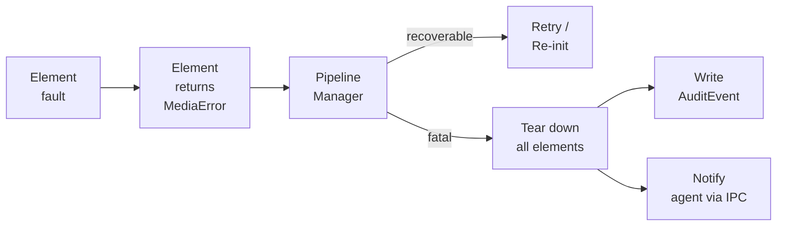
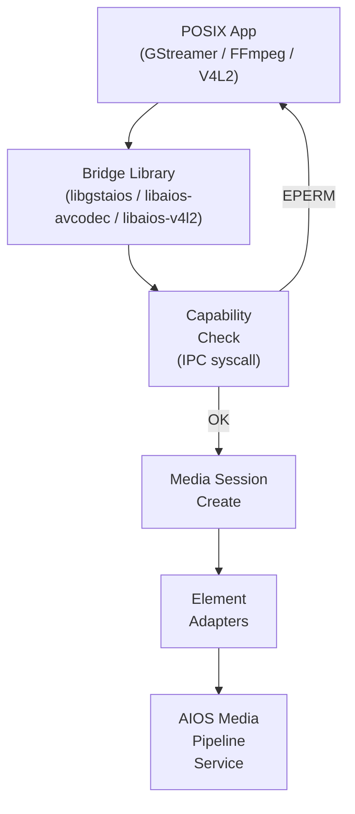
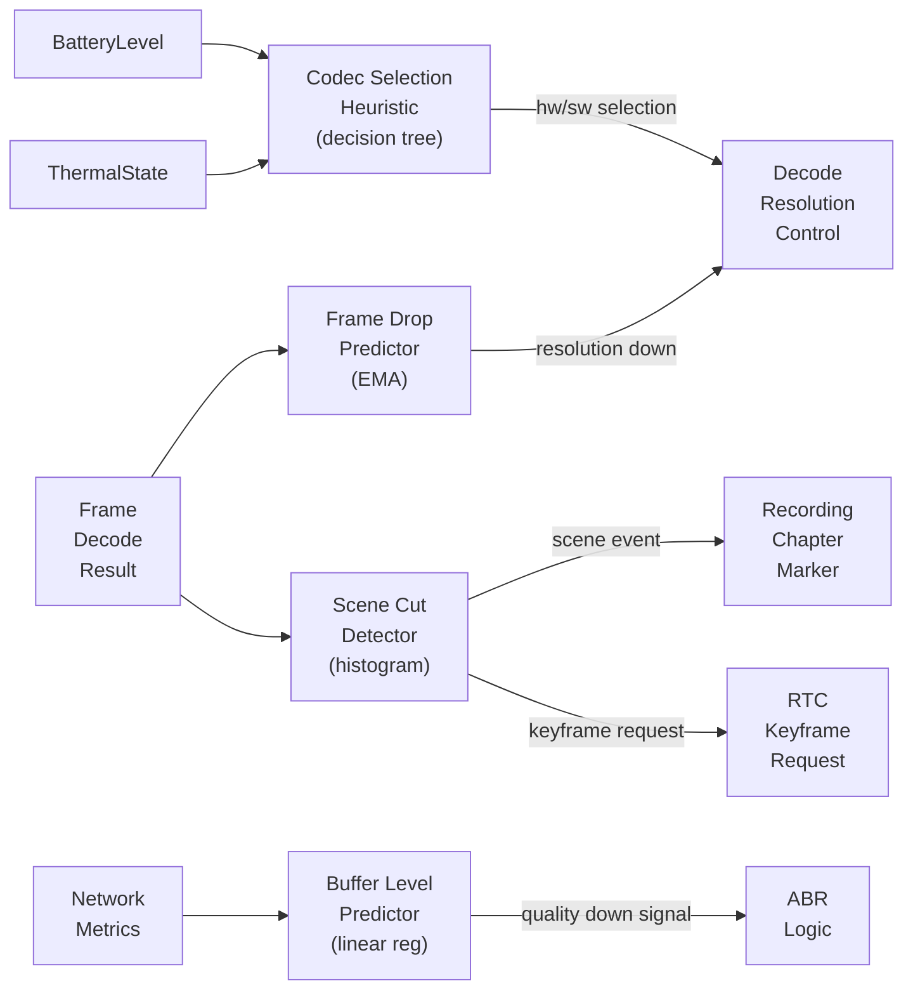

# AIOS Media Pipeline — Integration & Intelligence

Part of: [media-pipeline.md](../media-pipeline.md) — Media Pipeline

**Related:** [codecs.md](./codecs.md) — Codec framework, [playback.md](./playback.md) — Pipeline and sessions, [streaming.md](./streaming.md) — Streaming protocols, [rtc.md](./rtc.md) — Real-time communication, [drm.md](./drm.md) — Content protection

-----

## §13 Cross-Subsystem Coordination

The media pipeline does not operate in isolation. Every significant media operation touches at least three other AIOS subsystems: audio for playback, compositor for display, networking for stream delivery. This section defines how the pipeline integrates with each of those subsystems, establishing clear contracts for format negotiation, buffer ownership, clock synchronization, and capability inheritance.

The integration model follows the same pattern throughout: each subsystem exposes a pipeline element adapter (`AudioSubsystemSink`, `CameraSource`, `CompositorSink`, `NetworkSource`, etc.) that satisfies the `MediaElement` trait defined in [playback.md](./playback.md) §5.1. This keeps the pipeline graph model subsystem-agnostic. The adapter layer handles translation between the pipeline's internal types and the target subsystem's native API.

The element adapters registered at pipeline service startup are listed in the following table. All are discovered at boot through the subsystem service registry, not linked statically, so the set is extensible at runtime as subsystem services are brought up.

| Element Name | Element Type | Backed By | Zero-Copy Path |
| --- | --- | --- | --- |
| `AudioSubsystemSink` | Sink | Audio session mixer | Shared memory PCM ring |
| `AudioSubsystemSource` | Source | Audio capture session | Shared memory capture ring |
| `CameraSource` | Source | Camera session | DMA-BUF frame export |
| `CompositorSink` | Sink | Compositor surface | DMA-BUF texture import |
| `FileSource` | Source | Space object reader | mmap on Space block data |
| `FileSink` (recording) | Sink | Space object writer | Direct block write |
| `NetworkSource` | Source | NTM connection manager | Socket scatter-gather |
| `GpuFilterElement` | Filter | wgpu compute pipeline | GPU-resident texture in-place |

Cross-reference: [subsystem-framework.md](../subsystem-framework.md) §6 (DataChannel/zero-copy patterns).

### §13.1 Audio Subsystem Integration

`AudioSubsystemSink` is a pipeline sink element that writes decoded PCM frames to an audio session managed by the audio subsystem.

**Format negotiation** happens during the pipeline's `Ready → Paused` state transition. The decoder's output `PadInfo` (sample rate, channel count, bit depth, interleaving) is compared against the audio session's accepted formats. If the session cannot accept the decoder's native output format, the pipeline inserts a sample-rate-converter (SRC) filter element between the decoder and the sink. The SRC is selected from the audio subsystem's own converter implementations to benefit from any hardware-assisted resampling. Cross-reference: [audio.md](../audio.md) §4 (mixing and SRC).

**Clock synchronization** uses the audio subsystem's hardware clock as the `MediaClock` reference for the entire pipeline. Audio hardware presents samples at a fixed hardware rate governed by the DAC or I2S interface. The `AudioSubsystemSink` element queries the audio session's current playback position (in frames) and converts it to a `MediaClock` timestamp. All video decoders and subtitle renderers downstream synchronize their presentation timestamps (PTS) against this audio-derived clock, ensuring frame-accurate A/V sync. Cross-reference: [audio.md](../audio.md) §7 (timeline and sync).

**Volume and mute** are pipeline-transparent: the pipeline does not apply gain. Volume control is applied within the audio session's mixer channel. An agent adjusting its audio session volume affects all media playing through that session. Muting an audio session silences media output without pausing the pipeline — video continues rendering. Cross-reference: [audio.md](../audio.md) §3.3 (sessions).

**Background music continuity**: when a video pipeline is paused (for example, the agent moves to a different task) but the intent is to continue audio playback, the pipeline may transition to audio-only mode. The video decode chain is suspended and the video compositor surface is released. The audio decode chain continues. This is distinct from a full pause, which stops both chains.

### §13.2 Camera Subsystem Integration

`CameraSource` is a pipeline source element that captures frames from a camera session and presents them as `MediaFrame` packets on its output pad.

**Format negotiation**: the camera subsystem exposes available capture formats through the `CameraDevice` capabilities descriptor — typically NV12, MJPEG, or YUY2 depending on the device. `CameraSource` queries these capabilities during element initialization and selects the format best suited to the downstream encoder or filter. If the encoder requires NV12 but the device only delivers MJPEG, `CameraSource` inserts an inline MJPEG software decoder. Cross-reference: [camera.md](../camera.md) §4.1 (format negotiation).

**Zero-copy capture**: when the camera delivers frames as DMA buffers (the common path for CSI/MIPI and UVC isochronous transfers), `CameraSource` exports those buffers as `MediaFrame` references backed by the same DMA memory. The downstream encoder can import them directly into its input queue via DMA-BUF, avoiding any CPU copy. Cross-reference: [camera.md](../camera.md) §4.3 (buffer management).

**Privacy enforcement**: `CameraSource` inherits the camera session's privacy state. If the camera subsystem's LED enforcement logic determines that the LED is off or the hardware indicator cannot be activated, the camera session is refused and `CameraSource` fails to transition out of the `Null` state with `MediaError::PrivacyViolation`. No frames flow when the LED is not active. Cross-reference: [camera.md](../camera.md) §8.1 (LED enforcement).

**Intent declaration**: `CameraSource` declares a `SessionIntent` to the camera session manager when the pipeline session is created. The intent field specifies the purpose — `VideoCall`, `Recording`, or `Streaming` — enabling the camera session manager to apply appropriate conflict resolution policy when multiple agents request simultaneous camera access. Cross-reference: [camera.md](../camera.md) §6.2 (SessionIntent).

### §13.3 Compositor Integration

`CompositorSink` is a pipeline sink element that presents decoded video frames as surfaces within the AIOS compositor's scene graph.

**Surface lifecycle**: `CompositorSink` creates a compositor surface when the first decoded frame arrives with a defined resolution. The surface dimensions match the decoded frame size. The pipeline presents subsequent frames to the surface with their PTS, and the compositor's frame scheduler ensures display at the correct time relative to the display's refresh cycle. When the pipeline session ends, `CompositorSink` destroys the surface and releases all associated shared buffers. Cross-reference: [compositor.md](../compositor.md) §3.1 (surface lifecycle).

**Direct scanout**: when `CompositorSink` detects that the video surface occupies the entire display and no other surfaces need compositing, it negotiates direct scanout with the compositor. In this mode, decoded frames are scanned out to the display controller without passing through the GPU compositor. This reduces latency by one frame and eliminates the memory bandwidth cost of the compositing pass. Cross-reference: [compositor.md](../compositor.md) §5.3 (direct scanout).

**HDR passthrough**: HDR metadata parsed from the container (SMPTE ST 2086 mastering display data, MaxCLL/MaxFALL from CEA 861.3) is attached to each `MediaFrame` as metadata fields. `CompositorSink` forwards this metadata to the compositor surface, which passes it through to the display controller for hardware HDR tone mapping. When the display does not support HDR, the pipeline inserts a software tone-mapping filter element before `CompositorSink`. Cross-reference: [compositor.md](../compositor.md) §6.4 (HDR/WCG).

**Picture-in-picture**: for multitasking scenarios where a secondary video stream is displayed over the primary stream, `CompositorSink` creates a second compositor surface with a `SemanticSurfaceHint::PictureInPicture` hint. The compositor lays out the secondary surface as a floating overlay respecting the agent's spatial layout preferences. Cross-reference: [compositor.md](../compositor.md) §4.1 (semantic surface hints).

**Content type hints**: `CompositorSink` informs the compositor of the content type being displayed — `VideoPlayback`, `VideoCall`, `ScreenShare` — so the compositor can apply appropriate semantic layout, frame scheduling priority, and latency targets. A `VideoCall` surface receives lower latency budget than a `VideoPlayback` surface. Cross-reference: [compositor.md](../compositor.md) §4.1 (semantic surface hints).

**Subtitle overlay**: a `SubtitleSink` element creates a transparent compositor surface above the video surface. The subtitle renderer draws text using the font engine at the correct display time, and the compositor composites this overlay without requiring the video surface to be re-encoded with burnt-in subtitles.

### §13.4 GPU Integration

Hardware video decode produces GPU-resident textures on platforms with dedicated video decode engines (Apple Silicon, Raspberry Pi V3D). The pipeline exports these textures to wgpu via the `wgpu::Texture::from_external` DMA-BUF import path, making them available to GPU-accelerated filter elements without any CPU readback.

**GPU-accelerated filter elements** are compute-shader pipeline stages that operate on GPU textures in-place:

- **Color space conversion (YUV → RGB)**: a compute shader converts NV12 or YUV420P frames to RGB for display or further GPU processing. Throughput: 1080p30 at < 0.5ms on mid-range GPU.
- **Scaling (bilinear, Lanczos)**: for resolution changes between pipeline stages. Lanczos provides better quality than bilinear for upscaling; bilinear is used for downscaling where high quality is not required.
- **Deinterlacing**: field weaving for low-motion content; motion-adaptive deinterlacing for broadcast sports content. Motion-adaptive mode samples two adjacent fields, detects inter-field motion via pixel difference thresholds, and selects per-pixel between blended fields and single-field output.
- **Tone mapping (HDR → SDR)**: Reinhard and ACES filmic tone mapping operators as compute shaders. Applied when the display does not support HDR and the content carries HDR10 or Dolby Vision metadata.
- **Sharpening, noise reduction, film grain synthesis**: post-processing for content enhancement and encoding artifact concealment.

Cross-reference: [gpu/rendering.md](../gpu/rendering.md) §9 (wgpu integration), §12 (GPU memory management).

### §13.5 Networking Integration

`NetworkSource` is a pipeline source element that wraps an NTM connection manager handle. It is the delivery vehicle for all network-sourced content: DASH and HLS manifests, encrypted segment downloads, RTP packet reception for WebRTC.

**Bandwidth reservation**: when the pipeline session is created, `NetworkSource` registers an estimated bandwidth requirement with the NTM bandwidth scheduler. The scheduler accounts for this reservation when making routing decisions and when enforcing per-agent network budgets. Cross-reference: [networking.md](../networking.md) §3.6 (Bandwidth Scheduler).

**QUIC streams**: for low-latency streaming protocols (MoQ, future), individual media segments are delivered on dedicated QUIC streams. QUIC stream prioritization is mapped to media track priority: video keyframes are high-priority, audio is high-priority, B-frame video slices are lower priority. Cross-reference: [networking.md](../networking.md) §5.3 (QUIC/HTTP/3).

**TLS certificate validation**: DRM license server requests travel over TLS verified by rustls against the system certificate store. The pipeline does not bypass certificate validation. Cross-reference: [networking.md](../networking.md) §5.5 (TLS/rustls).

**RTP/RTCP transport**: WebRTC media uses the IPC-based UDP socket API exposed by NTM. `NetworkSource` manages the RTP session (SSRC allocation, sequence numbering, jitter buffer) above NTM's socket interface. RTCP sender and receiver reports are generated every 5 seconds. Cross-reference: [networking.md](../networking.md) §3.2 (Connection Manager).

**DNS prefetch**: during DASH/HLS manifest parsing, the segment base URLs are extracted and submitted to NTM for DNS prefetch before the first segment request. This removes DNS lookup latency from the critical path of the first segment download.

### §13.6 Storage Integration

`FileSource` is a pipeline source element that reads content from Space objects in the AIOS storage subsystem.

**Media cache**: streaming segments downloaded from the network are written into an ephemeral space alongside a manifest of segment URLs and byte ranges. On seek or rewind within the already-buffered window, `FileSource` serves the segment from cache without issuing a new network request. The cache is bounded by a configurable quota (default 512 MiB) and evicts the least-recently-used segments when the quota is reached. Cross-reference: [storage/spaces/data-structures.md](../../storage/spaces/data-structures.md) §3.1 (Spaces).

**Offline playback**: pre-downloaded content is stored as Space objects with media-specific metadata fields: duration, codec parameters, chapter marks, and embedded thumbnail. `FileSource` reads these objects directly. DRM-protected offline content is encrypted in the space using the license server's offline key; the pipeline's DRM element decrypts using the stored license. Cross-reference: [storage/spaces.md](../../storage/spaces.md) §3.3 (Objects).

**Recording**: when an agent records media, the muxer element writes its output to a Space object created with the `MediaCapture` capability. The space object is finalized (its version committed) when the pipeline transitions to the `Null` state. Interrupted recordings produce a partial Space object with a `partial: true` metadata flag; the storage subsystem can attempt container repair on open. Cross-reference: [storage/spaces.md](../../storage/spaces.md) §3.3 (Objects).

**Content addressing**: the SHA-256 content hash on Space objects enables deduplication when the same media file is imported multiple times. The storage subsystem identifies duplicate content by hash and stores only one copy, updating object references accordingly.

### §13.7 Flow Integration

Media metadata surfaces in the Flow subsystem as `TypedContent` fields on `FlowEntry` objects. When a media session is created, the pipeline writes the following fields to the active Flow entry: title, artist, album, duration, codec identifier, container format, and resolution.

**Media sharing via Flow**: when an agent shares a media item, Flow creates a transfer entry referencing the Space object by its `ObjectId`. The recipient agent receives the reference and can open the Space object directly — no data is copied. For network-sourced content, Flow creates a transfer entry containing the stream URL and any required authentication tokens.

**Album art and thumbnails**: during demux, the pipeline extracts embedded album art (ID3 APIC frame, MP4 covr atom) and video thumbnails (the first I-frame within the first ten seconds). These are stored as separate Space objects with `content_type: Image` and referenced from the primary media object's metadata. Flow renders these thumbnails in the transfer history UI.

**Playback history**: each playback session generates a `FlowEntry` record with the content identifier, playback duration, and completion percentage. This record is written to the `user/home/media-history/` space. The history is queryable by AIRS for content recommendation. Cross-reference: [storage/flow.md](../../storage/flow.md) §3 (FlowEntry, TypedContent).

### §13.8 Cross-Subsystem Data Flow

The following diagram traces the complete signal path for a video call — the most demanding cross-subsystem scenario because it involves simultaneous capture, encode, network transit, decode, and render across every subsystem.



The echo canceler sits between the audio capture path and the Opus encoder. It receives the speaker output signal (what the remote party is hearing locally) and subtracts it from the microphone capture, preventing the remote party from hearing their own voice echoed back. The `MediaClock` reference flows from the audio hardware through the audio subsystem to both the video decoder (for PTS comparison) and the compositor (for frame scheduling).

### §13.9 Element Lifecycle and Cross-Subsystem Error Recovery

Subsystem failures during pipeline operation must not crash the pipeline process. Each element adapter follows a fault-isolation contract: an error from the backing subsystem is converted to a `MediaError` return value on the next `process()` call, and the pipeline manager decides whether the error is recoverable.

**Recoverable errors** — transient subsystem faults that can be retried:

- `AudioSubsystemSink`: audio session disconnected (audio subsystem restart). The element transitions to `Paused`, waits for the audio service to become available again via service registry notification, then re-creates the audio session and transitions back to `Playing`. The video surface continues presenting frames during audio re-initialization; A/V sync resumes from the current pipeline clock position.
- `NetworkSource`: NTM connection lost mid-stream. The element signals `MediaError::NetworkInterruption`. The pipeline manager triggers the ABR rebuffer logic: the player enters buffering state, the spinner overlay appears, and connection re-establishment is attempted with exponential backoff. The `RebufferEvent` audit record is written with `cause: "network_loss"`.
- `CameraSource`: camera session preempted by a higher-priority agent. The element signals `MediaError::CameraPreempted`. For an RTC session, this results in a black frame being sent to the remote peer with an RTCP SOURCE-DESC CNAME update that signals video hold. For a recording session, the recording is suspended cleanly at the last written keyframe boundary.

**Non-recoverable errors** — fatal faults that require pipeline teardown:

- `CompositorSink`: compositor process crashed. The surface handle is invalid; there is no safe way to continue presenting frames. The pipeline transitions to `Null`, writes a `SessionDestroyed` audit event with `reason: "compositor_crash"`, and signals the owning agent via IPC notification.
- `FileSink` (recording): storage quota exceeded mid-recording. The muxer finalizes the container at the last written keyframe and closes the Space object. The agent receives a `MediaError::StorageQuotaExceeded` notification.
- Hardware codec fault: the hardware decoder or encoder signals an unrecoverable fault (malformed bitstream, hardware reset). The codec element attempts a software fallback if one is registered for the same `CodecId`. If no fallback is available, the element reports `MediaError::CodecFault` and the pipeline tears down.

**Error propagation path**:



The pipeline manager serializes error handling on its own thread. Element adapters are safe to call `process()` on from any pipeline thread because they are protected by per-element `spin::Mutex` guards. Error recovery logic runs on the pipeline manager thread exclusively, avoiding lock inversion with element-internal locks.

-----

## §14 POSIX Bridge

The POSIX bridge layer allows existing media applications built for Linux to run on AIOS with minimal or no source modification. It translates between Linux media APIs (GStreamer, FFmpeg/libav, V4L2, ALSA) and the native AIOS pipeline, capability, and session model.

The bridge layer is implemented at EL0 as a set of shared libraries loaded by the POSIX process model. It does not require kernel modifications — all translation happens in user space using the AIOS syscall and IPC interfaces. Cross-reference: [posix.md](../posix.md) (POSIX compatibility general patterns).

The capability check happens at the bridge boundary before any media session is created. A POSIX process that calls `gst_element_set_state(pipeline, GST_STATE_PLAYING)` without holding a `MediaPlayback` capability receives `EPERM` from the underlying IPC call, which GStreamer translates to a `GST_STATE_CHANGE_FAILURE` return. The application sees a GStreamer state change error, not an AIOS-specific error code.



**Bridge library loading**: bridge libraries are loaded via `LD_PRELOAD` or by the POSIX dynamic linker's plugin mechanism. The GStreamer bridge installs itself as a GStreamer plugin (`gstaios.so`) placed in the GStreamer plugin search path. FFmpeg bridge registers as an AVCodec plugin. V4L2 bridge provides device node files at `/dev/video*` backed by the AIOS device node service.

### §14.1 GStreamer Compatibility Layer

The GStreamer compatibility layer provides bidirectional adaptation between GStreamer's element model and the AIOS `MediaElement` trait.

**GstElement ↔ MediaElement adapter**: a wrapper struct implements `MediaElement` by delegating to an underlying `GstElement`. State transitions (`Null → Ready → Paused → Playing`) are mapped one-to-one; GStreamer and AIOS use the same four-state model. Pad capability negotiation translates `GstCaps` to `PadInfo` using a format table maintained by the bridge library.

**GstClock ↔ MediaClock bridge**: GStreamer's clock abstraction is a source of absolute timestamps in nanoseconds. The bridge wraps the AIOS `MediaClock` as a `GstClock` subclass, delegating `get_time()` to the AIOS clock's `now()` method. This ensures that GStreamer elements (particularly `GstBaseSink` implementations) synchronize against the audio hardware reference clock rather than the system monotonic clock.

**GstBuffer ↔ MediaFrame conversion**: GStreamer buffers carry memory allocated by GStreamer's allocator. The bridge attempts zero-copy first: if the `GstBuffer` is backed by a `GstDmaBufMemory` allocation, it wraps that DMA buffer as an AIOS `MediaFrame` shared memory reference. If the buffer is CPU-backed, the bridge performs a copy into a `MediaFrame` allocation from the pipeline's shared memory pool.

**GstCaps ↔ PadInfo**: GStreamer capability strings (`video/x-h264, width=1920, height=1080, framerate=30/1`) are parsed and converted to the strongly-typed `PadInfo` structure. Unknown GStreamer capability strings that cannot be mapped to a `CodecId` fall back to a `CodecId::Passthrough` value that disables format enforcement for that pad.

**Application compatibility targets**: Totem, Rhythmbox, Kodi, and mpv (GStreamer backend) are the primary compatibility targets. Applications that use only core GStreamer elements and GStreamer-ges (GStreamer Editing Services) are expected to work without source modification.

**Limitations**: GStreamer plugins that access Linux-specific APIs directly — V4L2 ioctl on `/dev/video*`, ALSA rawmidi — require separate bridge support. Those bridges are described in §14.3 and §14.4 respectively.

### §14.2 FFmpeg/libav Compatibility

The FFmpeg compatibility layer adapts the `AVCodec`, `AVFormatContext`, and `AVIOContext` interfaces to the AIOS pipeline's codec and I/O model.

**AVCodec ↔ MediaCodec adapter**: the bridge registers AIOS hardware codec implementations as FFmpeg `AVCodec` entries with a `aios_` prefix. When FFmpeg selects a codec via `avcodec_find_decoder()`, the bridge intercepts the lookup and returns the AIOS-backed implementation if one is available and preferred. The `avcodec_send_packet()` / `avcodec_receive_frame()` split-push model maps to the AIOS codec's `decode()` call with an internal queue for in-flight packets.

**AVFormatContext ↔ MediaDemuxer/MediaMuxer adapter**: the bridge implements a custom `AVInputFormat` backed by the AIOS `MediaDemuxer` trait. `AVIOContext` read callbacks are routed through the AIOS `FileSource` or `NetworkSource` elements, allowing FFmpeg's container parsers to operate on AIOS storage and network sources without modification.

**FFmpeg CLI tool compatibility**: the `ffmpeg` and `ffprobe` CLI tools run under the AIOS POSIX process model. File paths in the form `/space/user/home/videos/file.mp4` are translated by the POSIX path bridge to Space object lookups. Network URLs are handled by the NTM network compatibility bridge.

**MPV/VLC compatibility**: mpv supports multiple decode backends. With FFmpeg as the decode backend (`--vo=gpu --hwdec=auto`), the FFmpeg bridge intercepts hardware decode requests and routes them to AIOS hardware codec elements. VLC's libavcodec plugin follows the same path.

### §14.3 V4L2 Memory-to-Memory (M2M) Bridge

The V4L2 M2M bridge presents AIOS hardware codec elements as V4L2 memory-to-memory devices accessible at `/dev/video*` device nodes.

**V4L2 ioctl interface**: the bridge implements the following ioctl subset sufficient for codec access:

```text
VIDIOC_QUERYCAP      — report M2M capabilities
VIDIOC_S_FMT         — set input (encoded) and output (raw) formats
VIDIOC_G_FMT         — get current format
VIDIOC_REQBUFS       — allocate buffer pool
VIDIOC_QUERYBUF      — query buffer state
VIDIOC_QBUF          — enqueue buffer for processing
VIDIOC_DQBUF         — dequeue completed buffer
VIDIOC_STREAMON      — start streaming
VIDIOC_STREAMOFF     — stop streaming
VIDIOC_ENUM_FMT      — enumerate supported formats
```

**Buffer memory types**: all three V4L2 memory types are supported:

- `V4L2_MEMORY_MMAP`: buffers allocated by the bridge, mapped into the application's address space.
- `V4L2_MEMORY_DMABUF`: application imports DMA-BUF file descriptors from another subsystem (e.g., camera frames) for zero-copy encode.
- `V4L2_MEMORY_USERPTR`: application-allocated buffers; the bridge copies into codec-accessible memory.

**Stateless codec interface**: the bridge implements the stateless V4L2 codec interface (as used by ChromeOS's `cros-codecs`). For each frame, the application provides a parsed slice header and the compressed bitstream. The bridge assembles the full decoder context from accumulated slice headers. This model maps directly to the AIOS codec trait's `decode()` call, which accepts per-packet input.

Cross-reference: [camera.md](../camera.md) §10.3 (POSIX bridge — V4L2 capture devices).

### §14.4 Media Device Nodes

Beyond `/dev/video*` for codec access, the POSIX bridge exposes the following device nodes:

**`/dev/media*` (media controller)**: describes the media pipeline topology as a graph of entities, pads, and links — the Linux Media Controller API. Applications that use `libmediactl` to configure capture pipelines (e.g., libcamera, PipeWire) can query the AIOS camera subsystem and codec elements through this interface.

**`/dev/dri/renderD*` (GPU render nodes)**: for applications that use VA-API or VDPAU for GPU-accelerated decode, the bridge exposes a DRI render node backed by the AIOS GPU subsystem. The VA-API entrypoint library (`libva`) is reimplemented as a thin shim that translates VA-API surface create/decode/export calls to AIOS GPU codec operations via wgpu. Cross-reference: [gpu.md](../gpu.md) §16 (POSIX compatibility).

**`/dev/snd/*` and `/dev/dsp*` (audio)**: the audio subsystem's POSIX bridge provides ALSA PCM and OSS `/dev/dsp` device nodes. Media applications that open `/dev/snd/pcmC0D0p` for audio output receive audio sessions managed by the audio subsystem. The bridge handles format negotiation and buffer management transparently. Cross-reference: [audio.md](../audio.md) §12 (POSIX bridge).

-----

## §15 Security and Audit

Media access is capability-gated throughout. An agent that does not hold a `MediaPlayback` capability cannot open a pipeline session. An agent that does not hold `MediaCapture` cannot record. Capabilities are checked at session creation and at each state transition; a capability that is revoked while a session is active causes the session to be torn down cleanly.

### §15.1 Media Capabilities

```rust
pub enum MediaCapability {
    Playback {
        max_resolution: Option<(u32, u32)>,
        audio_only: bool,
        drm_allowed: bool,
    },
    Capture {
        max_resolution: Option<(u32, u32)>,
        audio_only: bool,
        max_duration: Option<Duration>,
    },
    Drm(MediaDrmCapability),
    Rtc {
        video_allowed: bool,
        data_channels_allowed: bool,
        max_participants: Option<u32>,
    },
    Transcode {
        max_resolution: Option<(u32, u32)>,
        allowed_codecs: Vec<CodecId>,
    },
}
```

**MediaPlayback**: grants the ability to play audio and video content. This is the most common and least privileged media capability. Agents that present media to a user (browser, music player, video player) hold this capability. Agents that only process media data without presenting it do not need it.

**MediaCapture**: grants the ability to record audio and/or video to a Space object or live output. This capability is checked in addition to — not instead of — the audio `AudioCapture` and camera `CameraCapture` capabilities required by those subsystems. All three must be held for a combined audio-video recording.

**MediaDrm**: grants access to DRM-protected content and the ability to contact license servers. An agent that holds `MediaPlayback` but not `MediaDrm` cannot open DRM-encrypted sessions. Cross-reference: [drm.md](./drm.md) §11.6 (capability model).

**MediaRtc**: grants the ability to establish real-time communication sessions. A WebRTC-based video call agent holds `MediaRtc` (for the session), `CameraCapture` (for video capture), `AudioCapture` (for microphone), and a network capability (for STUN/TURN and RTP). All four must be present.

**MediaTranscode**: grants the ability to perform format conversion. Transcoding is CPU and GPU intensive; gating it prevents an agent from consuming hardware resources without explicit permission. The `allowed_codecs` attenuation restricts the agent to a subset of codecs (for example, only `CodecId::AV1` encode).

**Capability enforcement sequence**: the following shows the check sequence for a `MediaPlayback` session creation request arriving at the media pipeline service:

```rust
fn open_session(
    agent_pid: ProcessId,
    request: SessionRequest,
) -> Result<MediaSessionId, MediaError> {
    // 1. Verify the agent holds the required capability.
    let cap = capability_table_check(
        agent_pid,
        Capability::MediaPlayback,
    )?; // returns CapabilityToken or Err(MediaError::CapabilityDenied)

    // 2. Apply attenuation constraints from the capability token.
    if let Some((w, h)) = cap.max_resolution {
        if request.resolution.0 > w || request.resolution.1 > h {
            return Err(MediaError::ResolutionExceedsCapability);
        }
    }
    if cap.audio_only && request.has_video_track {
        return Err(MediaError::VideoNotPermitted);
    }
    if !cap.drm_allowed && request.drm_required {
        return Err(MediaError::DrmNotPermitted);
    }

    // 3. Allocate session and write audit event.
    let session_id = allocate_session(agent_pid, request)?;
    write_audit(MediaAuditEvent::SessionCreated {
        session_type: request.session_type,
        codec: request.codec,
        source: request.source_type.to_string(),
    });
    Ok(session_id)
}
```

Cross-reference: [security/model/capabilities.md](../../security/model/capabilities.md) §3.1 (capability system).

### §15.2 Capability Attenuation

A parent agent that holds a broad `MediaPlayback` capability can grant a child agent an attenuated version with reduced rights. Attenuation is unidirectional: a child agent cannot grant rights exceeding those it received.

**Playback attenuation examples**:

- `max_resolution: Some((1280, 720))` — child can play SD and HD content but not 4K.
- `audio_only: true` — child can play audio podcasts but cannot open video decode sessions.
- `drm_allowed: false` — child cannot access DRM-protected content even if the parent can.

**RTC attenuation examples**:

- `video_allowed: false` — child can join audio-only calls.
- `max_participants: Some(2)` — child can only join one-on-one calls, not group calls.
- `data_channels_allowed: false` — child cannot use WebRTC data channels for file transfer.

**Capture attenuation examples**:

- `audio_only: true` — child can record podcasts but not video.
- `max_duration: Some(Duration::from_secs(300))` — child can record up to five minutes per session.

Cross-reference: [security/model/capabilities.md](../../security/model/capabilities.md) §3.4 (capability attenuation and delegation).

### §15.3 Audit Events

Every significant media operation generates a structured audit event written to the system audit ring. The media subsystem's audit events are stored under `system/audit/media/` and are queryable via the Inspector application.

```rust
pub enum MediaAuditEvent {
    SessionCreated {
        session_type: SessionType,
        codec: CodecId,
        source: String,
    },
    SessionDestroyed {
        session_id: MediaSessionId,
        duration: Duration,
    },
    DrmLicenseRequested {
        system: DrmSystemId,
        content_id: String,
    },
    DrmLicenseGranted {
        system: DrmSystemId,
        expiry: Option<Timestamp>,
    },
    DrmLicenseDenied {
        system: DrmSystemId,
        reason: String,
    },
    ScreenCaptureBlocked {
        surface_id: SurfaceId,
        reason: String,
    },
    QualityDegradation {
        metric: String,
        value: f64,
    },
    RebufferEvent {
        duration: Duration,
        cause: String,
    },
    RtcCallStarted {
        participants: u32,
    },
    RtcCallEnded {
        duration: Duration,
        quality_score: f64,
    },
    ContentBlocked {
        agent_pid: u32,
        declared_rating: String,
        policy_limit: String,
    },
    ContentMismatch {
        session_id: MediaSessionId,
        declared_rating: String,
        detected_rating: String,
    },
    DrmSessionCreated {
        system: DrmSystemId,
        session_type: DrmSessionType,
    },
    DrmSessionClosed {
        session_id: u64,
        duration: Duration,
        decrypt_count: u64,
    },
}
```

**Audit event retention**: media audit events are stored in the versioned `system/audit/media/` space with a default retention of 90 days. High-severity events (DRM denial, screen capture block) are retained for 365 days and replicated to the system/audit space used by the security model. Cross-reference: [subsystem-framework.md](../subsystem-framework.md) §7 (audit infrastructure).

**Privacy consideration**: `SessionCreated` records log the codec and source type (file, network, camera) but not the URL, filename, or content title. Content metadata is not present in audit records, only the technical session parameters needed for security analysis.

### §15.4 Content Screening

On-device content classification allows parents, organizations, and individual users to enforce content rating policies without routing media through an external screening service.

**Agent-declared content rating**: content providers embed a content rating in the container metadata (MPAA rating in MP4, BBFC rating in DASH manifest extension). The pipeline reads this rating during demux and compares it against the current agent's configured rating policy. If the content's declared rating exceeds the policy limit, the pipeline session is refused with `MediaError::ContentRatingExceeded` before any frames are decoded.

**AI-inferred content classification (AIRS-dependent, Phase 29+)**: AIRS classifies decoded frames and audio for nudity, graphic violence, and explicit language. Classification runs asynchronously — content that passes the declared rating check begins playback immediately. If the AI classifier subsequently detects a mismatch between the declared rating and the actual content, it generates a `MediaAuditEvent::ContentMismatch` event and may pause playback pending user confirmation.

**Blocking policy**: when a content rating policy is enforced, the pipeline records a `MediaAuditEvent::ContentBlocked` event containing the agent PID, declared rating, policy limit, and timestamp. The blocked event is surfaced to the Inspector application so that a parent or administrator can review what content was attempted.

**Capability override**: a parent agent that holds an elevated `MediaPlayback` capability can grant a temporary capability token to a child agent with an elevated content rating limit. The token carries an expiry timestamp and is subject to cascade revocation when the parent session ends.

**Privacy**: all content screening happens on-device. No frame data, audio data, or content identifiers are sent to external services. The AI classifier model is loaded from the AIRS model pool and runs in the kernel's model memory region.

-----

## §16 AI-Native Media Intelligence

AI integration in the media pipeline spans two tiers: kernel-internal models that run without AIRS and provide always-on lightweight intelligence, and AIRS-dependent features that unlock when the AI runtime is initialized (Phase 8+).

### §16.1 AIRS-Dependent Features

These features are registered with the AIRS Runtime Advisor at pipeline session creation and are activated or deactivated based on AIRS's current resource budget.

**Content-type-aware transcoding**: AIRS classifies the content being transcoded by analyzing a small sample of decoded frames — animation (high spatial frequency, low temporal noise), live action, sports (high temporal frequency, strong motion vectors), screencast (large flat regions, text edges), documentary (low temporal frequency, moderate spatial complexity). This classification drives codec parameter selection:

- Animation: high quantizer steps for smooth gradients, low temporal reference frame count (animation rarely needs long-range temporal prediction).
- Sports: high frame rate with aggressive inter-frame prediction; high bitrate allocation for motion-heavy frames.
- Screencast: lossless or near-lossless mode for text legibility; delta-frame encoding for static regions.

**Neural super-resolution**: an AIRS-managed upscaling filter element interpolates a low-resolution stream to display resolution using a Real-ESRGAN-class model. The model is loaded from the AIRS model pool on session creation and unloaded when the session ends or when AIRS needs the memory for higher-priority inference. Target inference latency: less than 10ms per 1080p output frame on Apple M-class hardware. The pipeline degrades gracefully: if AIRS withdraws the model allocation, the neural SR element is replaced with a bilinear upscaler without interrupting playback.

**AI-driven ABR (adaptive bitrate)**: Pensieve/PLL-ABR-class learned bitrate adaptation replaces heuristic ABR logic for DASH and HLS streaming. A PPO (Proximal Policy Optimization) agent with an LSTM observation encoder selects the quality tier for each segment download. The observation vector includes current buffer level, recent download throughput history (last 10 segments), estimated bandwidth, and current playback rate. The PPO agent is trained offline on real network traces and achieves approximately 28.5% quality-of-experience improvement over heuristic ABR in heterogeneous network conditions. The ABUV extension jointly optimizes bitrate selection and super-resolution upsampling: a low-bitrate tier combined with neural SR can match the perceptual quality of a higher-bitrate tier at lower bandwidth cost.

**Smart buffering**: AIRS predicts near-term network conditions using context from the context engine — user mobility patterns (stationary, walking, vehicle), time-of-day congestion models for the current network, and WiFi signal strength trends over the past 60 seconds. When AIRS predicts a network degradation event within the next 30 seconds, the pipeline pre-increases the buffer target to absorb the predicted throughput drop. Conversely, when conditions are stable, the buffer target is reduced to minimize startup latency.

**Audio-visual quality assessment**: a neural VMAF/SSIM-class model assesses the quality of decoded video in real time by comparing decoded frames against a reference generated from the original bitstream. The model detects encoding artifacts (blocking, ringing, blurring), A/V desync (when audio and video drift more than 80ms), and banding (insufficient quantization in gradient regions). The quality score is reported to session metrics and is available to the agent via the session stats API.

### §16.2 Kernel-Internal ML

These models run in the media pipeline service process without AIRS dependency. They are frozen at build time and compiled into the media service binary as constant weight arrays.

**Codec selection heuristic (decision tree)**: selects the optimal codec and parameter set for a given encoding task based on the feature vector `{resolution, target_bitrate, content_complexity, thermal_state, battery_level, hw_codec_available}`. The decision tree has depth 6, occupying less than 1 KiB of weight data. Inference runs in O(log n) time at encode session creation.

**Buffer level prediction (linear regression)**: predicts the buffer drain rate over the next 5 seconds from the current decode throughput (frames per second) and the network segment download rate (bits per second). When the predicted buffer level at T+5s falls below 2 seconds, the ABR logic is signaled to preemptively reduce quality.

**Frame drop prediction (exponential moving average)**: maintains a per-session EMA of decode time per frame (α = 0.1). When the EMA decode time exceeds 85% of the frame budget (e.g., 28ms for 30fps), the pipeline reduces decode resolution preemptively. If the EMA returns below 70% of the frame budget, the resolution is restored.

**Scene cut detection (histogram comparison)**: detects scene boundaries from decoded frame luminance histograms. When the chi-squared distance between the histograms of adjacent frames exceeds an empirically tuned threshold, a scene cut is declared. Scene cuts trigger keyframe requests in RTC (to minimize propagation latency across scene transitions) and chapter markers in recording sessions.

**Cool-chic-class neural codec (frozen inference)**: Orange Labs' Cool-chic neural image codec uses approximately 800 parameters and 900 multiplications per pixel, achieving compression ratios comparable to AVC at dramatically lower computational cost than full end-to-end neural codecs. This model is feasible as a frozen kernel-internal codec for specialized low-complexity content (medical imaging, scientific visualization) where traditional codecs perform poorly. The model weights are quantized to INT8 and stored as a static constant array in the media service binary.

The kernel-internal ML models interact with each other at runtime through a shared `PipelineMetrics` structure updated on every processed frame. The following diagram shows the data dependencies between models within a single decode session:



The `PipelineMetrics` structure is updated lock-free using per-field atomics (64-bit floats represented as `AtomicU64` with `f64::to_bits` / `f64::from_bits`). All five models read from `PipelineMetrics` at different intervals: the EMA frame drop predictor runs on every frame (~16ms at 60fps), the buffer level predictor runs every 500ms, and the codec selection heuristic runs only at session creation and at thermal state change events.

### §16.3 Future AI Directions

These capabilities are in active research or standardization and are planned for future AIOS phases.

**End-to-end learned video codecs**: MPEG's Neural Network-based Video Coding (NNVC) activity is developing standardized learned codecs. The expected successor to H.266/VVC (informally, H.267) will incorporate learned coding tools in a hybrid architecture — traditional block-prediction + DCT for the base layer, neural refinement for residual coding. AIOS plans to support NNVC-compliant codecs as hardware acceleration becomes available, estimated ~2028.

**Generative frame interpolation**: AI-generated intermediate frames for frame rate upscaling (24fps → 60fps) using optical flow estimation networks. The interpolated frames are generated from the two neighboring decoded frames using a learned warping function. Target: less than 8ms per interpolated frame at 1080p on capable hardware. This eliminates motion judder for cinematic content displayed on high-refresh displays.

**Real-time style transfer**: artistic style transfer as a pipeline filter element, enabling paint, cartoon, sketch, and privacy-preserving face de-identification effects. The de-identification mode is particularly relevant for video calls where a participant wants to hide their appearance without disabling video entirely — the style transfer replaces the face region with an artistic rendering while preserving head pose and gesture information.

**AI-driven audio description**: automatic generation of audio descriptions for visual content, targeting accessibility for visually impaired users. AIRS classifies video scenes and generates natural language descriptions using the context engine's language model. Descriptions are queued ahead of the corresponding video timestamp to provide anticipatory narration. Cross-reference: [camera.md](../camera.md) §13 (future AI directions).

**Language-guided video search**: natural language queries over locally stored video content using AIRS's context engine and embedding model. A query such as "find the part where they discuss the budget" is converted to an embedding and matched against per-scene embeddings stored during recording. The result is a ranked list of timestamps. This requires the recording pipeline to generate scene embeddings at record time — an opt-in feature due to the storage cost of embedding vectors.

-----

## §17 Thermal Coordination

Video decode and encode workloads are among the most thermally significant tasks in the system. A sustained 4K60 software decode session can drive CPU temperatures to levels that trigger throttling within minutes on passively cooled hardware. The media pipeline coordinates with the thermal subsystem to remain within safe temperature envelopes without unnecessarily degrading user experience.

### §17.1 Media Thermal Awareness

**WCET registration**: when a media session is created, the pipeline registers a worst-case execution time (WCET) estimate with the thermal subsystem for budget accounting. The WCET estimate is derived from the codec selection decision tree (§16.2): HW decode sessions report lower thermal WCET than SW decode sessions. The thermal subsystem uses WCET data to project future thermal load and adjust governor targets proactively. Cross-reference: [thermal.md](../thermal.md) §6 (ThermalState, WCET).

**Thermal state transitions**: the pipeline subscribes to thermal state notifications from the thermal subsystem. State changes trigger pipeline-level adaptations summarized in the table below:

| Thermal State | Playback | RTC | Recording | AI Features |
| --- | --- | --- | --- | --- |
| Normal | Full quality, all resolutions | Full video + audio | Full bitrate | Neural SR, ABR, AV-QA all active |
| Warm | No change to decode quality | Encode bitrate −20% | Encode bitrate −20% | Neural SR disabled |
| Hot | Decode resolution halved; frame rate capped at 30fps | Video encode resolution halved; keyframe interval doubled | Encode resolution halved | All AI features disabled; GPU filters bypassed |
| Critical | Audio-only; video surface hidden | Video SSRC suspended; audio continues | Recording suspended at keyframe | Not applicable |

State transitions are applied at the next keyframe boundary where possible to avoid visible artifacts. The hysteresis policy follows the thermal subsystem's trip-point design: a transition from `Hot` back to `Warm` requires the thermal zone to remain below the `Hot` lower bound for at least 5 consecutive seconds before the pipeline re-enables GPU filter elements and raises the frame rate cap. This prevents oscillation when the system is near a trip-point boundary. Cross-reference: [thermal.md](../thermal.md) §3 (trip points and hysteresis).

For RTC sessions, video suspension at `ThermalState::Critical` is signaled to the remote peer via an RTCP BYE message on the video SSRC with a reason string `"thermal"`. The remote peer's pipeline removes the video track from its compositor surface and displays a hold screen. The audio SSRC is unaffected. When the thermal zone drops back to `Hot` or below, the local pipeline re-enables the video encode chain, sends an SDP re-offer to restore the video SSRC, and the remote peer restores the video surface.

**Encoder thermal budget**: the encoder element tracks its own thermal contribution through the thermal subsystem's per-subsystem budget API. When the encoder has consumed its allocated thermal budget for the current 10-second window, it reduces the encode bitrate or skips B-frame generation for the remainder of the window. Cross-reference: [thermal.md](../thermal.md) §7 (load balancing).

**Hardware vs software codec tradeoff**: hardware codecs (Apple VPU, Pi V3D) consume less power than software decode but may contribute to SoC junction temperature more directly because the decode engine and CPU share a thermal zone. The codec selection decision tree (§16.2) incorporates `thermal_state` as a feature: at `ThermalState::Warm`, it prefers software decode distributed across multiple CPU cores, spreading the thermal load across a larger silicon area rather than concentrating it in the dedicated decode engine.

Cross-reference: [thermal.md](../thermal.md) §6 (ThermalState, WCET), §7 (scheduler load balancing).

### §17.2 Power-Proportional Media

**Display refresh rate adaptation**: the pipeline reports the content's native frame rate to the compositor on session creation. The compositor coordinates with the display driver to set the display refresh rate to the nearest multiple of the content frame rate (24Hz for 23.976fps film, 30Hz for NTSC, 60Hz for native 60fps content). Matching display refresh to content frame rate eliminates the display power cost of driving refresh cycles that produce no new content. Cross-reference: [compositor.md](../compositor.md) §12.5 (content-aware VRR, future).

**Audio-only power mode**: when an agent is playing audio content (music, podcast, audiobook) with no video track, or when the display is turned off by the user during video playback, the pipeline transitions to audio-only power mode. In this mode, the video decode chain is suspended, GPU filter elements are deactivated, and the compositor surface is hidden. The CPU scheduler class of the audio decode thread is promoted to `Interactive` (10ms quantum) to ensure uninterrupted audio with minimal CPU wake frequency. Cross-reference: [audio.md](../audio.md) §9 (power management).

**Hardware codec preference for power**: on platforms where hardware codec power consumption is well-characterized, the codec selection decision tree gives a strong preference to hardware decode for long-running playback sessions (duration > 10 minutes). On Apple Silicon, hardware H.264 and H.265 decode consumes approximately 50% less energy than software decode. For battery-powered devices, this preference extends the playback duration before the thermal subsystem needs to intervene.

**Predictive power management**: AIRS estimates the remaining playback duration from the container's total duration minus the current playback position. When the estimated remaining duration exceeds the current battery's projected charge duration, AIRS signals the media pipeline to reduce average power consumption by 15% — achieved by reducing encode bitrate for recording sessions, disabling neural SR, and slightly increasing the video decode thread's CPU budget at the expense of background tasks.

**Background playback optimization**: when the media agent is moved to the background (another agent takes foreground focus), the pipeline's video surface is hidden by the compositor. If the content has a video track, the pipeline automatically suspends the video decode chain. Only the audio chain continues. This is not the same as pausing: seek position advances, A/V sync is maintained in the audio chain alone, and video decode resumes immediately when the agent returns to the foreground. Cross-reference: [power-management.md](../power-management.md) (Phase 19+, general power management).

The following table estimates the power saving available from each strategy on a representative mobile SoC (ARM Cortex-A72 class, 2W idle baseline):

| Strategy | Condition | Estimated Power Saving |
| --- | --- | --- |
| HW decode (H.264 1080p30) vs SW decode | Long-form playback > 10 min | ~50% of decode power (≈ 400 mW) |
| Audio-only mode (display off) | Music / podcast playback | ~70% of total session power |
| Display refresh match (24Hz film) | Film content on 60Hz display | ~15–20% of display power |
| Neural SR disabled at `Warm` | Thermal pressure | ~80 mW GPU compute |
| Background video suspend | Agent backgrounded | ~30% of total session power |
| Predictive bitrate reduction (−15%) | Battery pressure via AIRS | ~10% of encode power |

Power figures are indicative; actual savings depend on SoC, content, and thermal conditions. The codec selection decision tree (§16.2) weights these estimates at session creation and whenever `ThermalState` or battery level changes. The weights are re-evaluated every 30 seconds during long-running sessions to account for changing conditions.

### §17.3 Implementation Order

Thermal coordination is implemented incrementally alongside the thermal subsystem phases. The following table lists the media pipeline thermal features in their planned implementation order:

| Phase | Thermal Feature | Dependency |
| --- | --- | --- |
| Phase 5 (Media Pipeline) | WCET registration at session create | Thermal subsystem service running |
| Phase 5 | `ThermalState::Hot` decode resolution reduction | Thermal notification IPC |
| Phase 5 | `ThermalState::Critical` audio-only fallback | Audio subsystem integration (§13.1) |
| Phase 7 (Networking) | RTC video SSRC suspend on `Critical` | NTM RTP transport, RTCP support |
| Phase 8 (AIRS) | Predictive power management | AIRS context engine |
| Phase 9 (Storage) | Recording suspend at keyframe boundary | FileSink element, WAL integration |
| Phase 19 (Power Mgmt) | Display refresh rate adaptation | Power management subsystem |
| Phase 19 | Battery-level-aware codec preference | Battery API from power subsystem |

The first four items are implemented as part of Phase 5 because they depend only on the thermal notification IPC, which is available from the thermal subsystem's initial implementation. AIRS-dependent features (predictive power management, content-type-aware transcoding) are deferred to Phase 8 when the AI runtime is initialized. Display refresh adaptation depends on the power management subsystem added in Phase 19.

Cross-reference: [thermal.md](../thermal.md) §14 (implementation order), [media-pipeline.md](../media-pipeline.md) (hub document, implementation phases).
