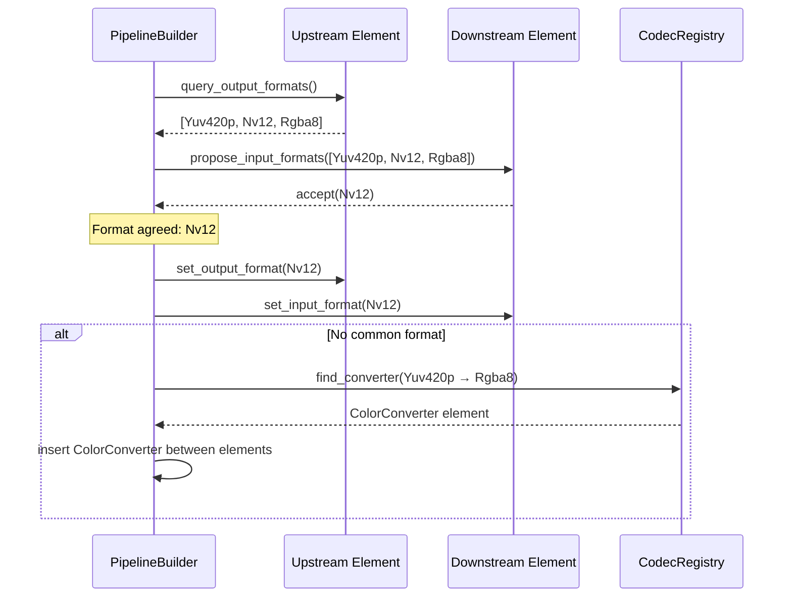
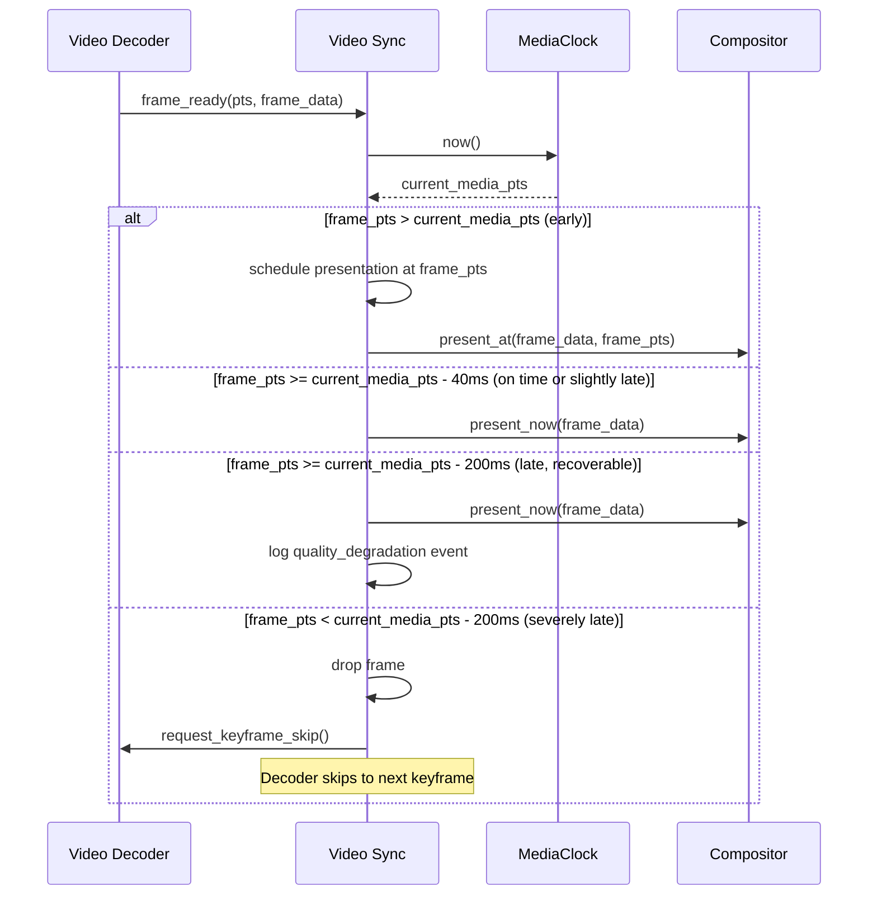
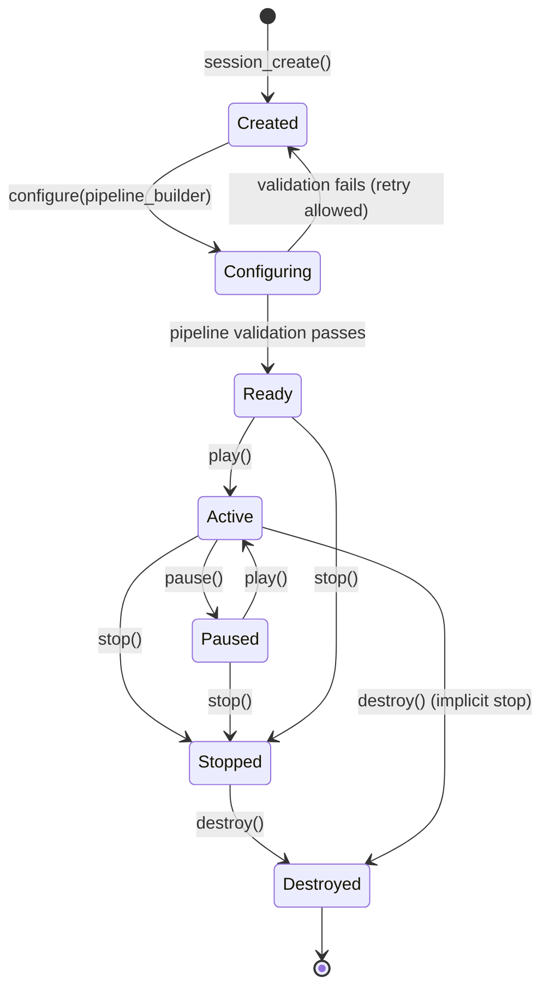

# AIOS Media Pipeline — Playback Pipeline & Sessions

Part of: [media-pipeline.md](../media-pipeline.md) — Media Pipeline

**Related:** [codecs.md](./codecs.md) — Codec framework and container engine, [streaming.md](./streaming.md) — Streaming protocols and adaptive bitrate, [rtc.md](./rtc.md) — Real-time communication pipeline, [integration.md](./integration.md) — Cross-subsystem coordination

-----

## §5 Playback Pipeline

The playback pipeline is a directed acyclic graph (DAG) of media processing elements. Each element performs a discrete transformation — reading from a source, demuxing a container, decoding a compressed stream, applying a filter, or rendering to an output sink. Elements are connected by typed pads that enforce format compatibility before execution begins.

This model is inspired by two proven designs: PipeWire's unified media graph (which treats audio, video, and MIDI as first-class graph nodes) and GStreamer's element-pad-bin composition. AIOS adopts the core abstractions while integrating them with the capability system, zero-copy shared memory paths, and the media session model defined in §6.

### §5.1 Pipeline Graph Model

Every processing node in the media pipeline implements the `MediaElement` trait:

```rust
pub trait MediaElement: Send {
    fn element_type(&self) -> ElementType;
    fn input_pads(&self) -> &[PadInfo];
    fn output_pads(&self) -> &[PadInfo];
    fn set_state(&mut self, state: ElementState) -> Result<(), MediaError>;
    fn process(&mut self) -> Result<ProcessResult, MediaError>;
}
```

**ElementType** classifies the element's role in the graph:

```rust
pub enum ElementType {
    /// Produces data: file, network stream, camera frame source
    Source,
    /// Decompresses encoded bitstream to raw samples or frames
    Decoder,
    /// Compresses raw data to an encoded bitstream
    Encoder,
    /// Transforms data without changing media type (color conversion, resample)
    Filter,
    /// Consumes data: audio renderer, video compositor surface, file writer
    Sink,
    /// Splits a multiplexed stream into per-codec elementary streams
    Demuxer,
    /// Combines elementary streams into a multiplexed container
    Muxer,
}
```

**ElementState** follows the GStreamer four-state model, which maps cleanly onto resource lifecycle:

```rust
pub enum ElementState {
    /// Element is not initialized. No resources allocated.
    Null,
    /// Element has allocated internal resources but is not processing.
    Ready,
    /// Element accepts and queues data but does not produce output.
    Paused,
    /// Element is actively processing and producing output.
    Playing,
}
```

State transitions are always sequential: `Null → Ready → Paused → Playing`, and in reverse for teardown. Skipping states is not permitted; the `set_state` implementation enforces valid transitions and returns `MediaError::InvalidStateTransition` otherwise.

**MediaPad** is a typed connection point on an element. Each pad has a direction, a media type, and a negotiated format:

```rust
pub struct PadInfo {
    pub name: &'static str,
    pub direction: PadDirection,
    pub media_type: MediaType,
    pub accepted_formats: &'static [MediaFormat],
}

pub enum PadDirection {
    Input,
    Output,
}

pub enum MediaType {
    Video,
    Audio,
    Subtitle,
    Data,
}
```

**Pad negotiation** resolves the format that flows between two connected elements. The upstream element proposes its preferred output formats in priority order; the downstream element accepts the first format it supports, or counter-proposes a subset. If no common format exists, the pipeline builder inserts a format-conversion filter automatically, or fails with `MediaError::IncompatibleFormats` if no converter is registered.



**ProcessResult** communicates element state to the pipeline executor:

```rust
pub enum ProcessResult {
    /// Element consumed input, output buffer not yet full
    NeedInput,
    /// Element produced output, downstream should drain
    HaveOutput,
    /// End of stream reached on this element's output pads
    Eos,
    /// Unrecoverable error; pipeline should enter error state
    Error(MediaError),
}
```

**Pipeline executor model** uses pull-based scheduling, driven from sinks. Each sink requests data from its upstream element, which in turn requests from its upstream, recursively. This creates natural backpressure: if a sink is not ready to consume (audio buffer full, compositor frame rate limited), the entire graph stalls rather than allocating unbounded intermediate buffers. The executor runs on a dedicated media pipeline thread at `SchedulerClass::Interactive` priority, ensuring consistent scheduling latency without blocking kernel RT threads.

### §5.2 Pipeline Construction

Agents build pipelines through a typed `PipelineBuilder` API. The builder validates all pad connections and format compatibility before the pipeline is materialized, failing at construction time rather than at runtime.

```rust
let pipeline = PipelineBuilder::new()
    .source(HttpSource::new(url))
    .demuxer(AutoDemuxer::new())
    .video_decoder(AutoDecoder::new())
    .video_filter(ColorConverter::new(PixelFormat::Rgba8))
    .video_sink(CompositorSink::new(surface_id))
    .audio_decoder(AutoDecoder::new())
    .audio_sink(AudioSubsystemSink::new(audio_session_id))
    .build()?;
```

**AutoDemuxer** reads the first 4 KiB of the stream and probes the container format by matching against registered format signatures (MP4 `ftyp` box, WebM EBML header, MPEG-TS sync byte pattern). It instantiates the correct demuxer element from the container registry defined in [codecs.md](./codecs.md) §4.

**AutoDecoder** queries the `CodecRegistry` ([codecs.md](./codecs.md) §3.2) for the best available decoder matching the stream's `CodecId`. Selection priority: hardware decoder > software decoder. If hardware is unavailable on the current platform (no V4L2 M2M node, no VirtIO-Video device), the software fallback is selected transparently.

**Pipeline validation** performs these checks in order before `build()` returns:

1. Every source pad is connected to exactly one sink pad.
2. Every connected pad pair shares a common negotiated format (or has an auto-inserted converter).
3. All required capability handles (e.g., `MediaPlayback`, `MediaDrm`) are present on the calling agent.
4. No cycles exist in the graph (a DAG invariant enforced by topological sort during validation).

**Pipeline lifecycle:**

```text
build()     → validate all connections, allocate element resources
prepare()   → transition all elements: Null → Ready → Paused (pre-roll)
play()      → transition all elements: Paused → Playing, start clock
pause()     → suspend clock, elements drain in-flight buffers
seek(pts)   → flush buffers, reposition demuxer, decode from keyframe
stop()      → transition all elements: Playing → Paused → Ready → Null
destroy()   → release all resources, deregister compositor surface
```

**Error cases** returned by `build()`:

| Error | Cause |
|---|---|
| `IncompatibleFormats` | No converter available between adjacent elements |
| `MissingCodec` | AutoDecoder found no decoder for stream's CodecId |
| `CapabilityDenied` | Agent lacks required capability (e.g., `MediaPlayback`) |
| `InvalidGraph` | Cycle detected or disconnected pad |
| `ResourceExhausted` | Insufficient memory for element buffer allocation |

### §5.3 A/V Synchronization

Audio/video synchronization is the defining challenge of media playback. AIOS follows the universal industry convention: **audio is the clock master**. The audio sink drives the media clock by reporting the presentation timestamp (PTS) of the most recently rendered audio sample. Video frames are presented when the pipeline clock reaches their PTS, not at a fixed display rate.

**MediaClock** tracks the relationship between wall time and media time:

```rust
pub struct MediaClock {
    /// Wall clock time when media_time was last set (from kernel timer)
    base_time: Instant,
    /// Media presentation timestamp at base_time
    media_time: Duration,
    /// Playback rate: 1.0 = normal, 0.5 = half speed, 2.0 = double speed
    rate: f64,
    /// Whether the clock is advancing
    running: bool,
}

impl MediaClock {
    /// Current media presentation timestamp, interpolated from base_time
    pub fn now(&self) -> Duration {
        if !self.running {
            return self.media_time;
        }
        let elapsed = self.base_time.elapsed();
        self.media_time + Duration::from_secs_f64(elapsed.as_secs_f64() * self.rate)
    }

    /// Called by audio sink when it renders a batch of samples.
    /// Anchors the clock to the PTS of the rendered audio.
    pub fn anchor(&mut self, audio_pts: Duration) {
        self.base_time = Instant::now();
        self.media_time = audio_pts;
    }
}
```

The audio sink calls `anchor()` every time it submits a batch of samples to the audio subsystem (see [audio.md](../audio.md) §7.1 for the shared timeline model). The audio subsystem reports back the actual presentation timestamp of those samples including any scheduling jitter, which the clock uses as its ground truth.

**Video sync decision algorithm** — executed for every decoded video frame before presentation:



**Lip-sync budget:** The ±40ms threshold is derived from ITU-R BT.1359-1 and EBU R37, which define the perceptual threshold for audio-video synchronization. Errors within this window are imperceptible to viewers. The 200ms threshold is the point at which decoder recovery (skip to keyframe) becomes more effective than presenting stale frames.

**Clock discontinuity detection:** If the audio PTS reported by the audio subsystem jumps by more than 500ms between consecutive `anchor()` calls, the sync engine treats this as a clock discontinuity — typically caused by broadcast stream ad insertion, a live stream segment boundary, or a seek operation. The MediaClock resets its base_time and media_time to the new anchor without attempting interpolation across the gap.

Cross-reference: [audio.md](../audio.md) §7.1 (shared A/V timeline) and §7.2 (presentation timestamps delivered by audio sink to media pipeline clock).

### §5.4 Clock Recovery and Drift Correction

Network sources introduce a second synchronization problem: the source clock (at the streaming server) differs from the local clock. Over long playback sessions (hours), even a 10 ppm frequency difference accumulates to 36ms per hour — enough to cause audible buffer underruns or overruns.

**PLL-based clock recovery** estimates the source clock rate from packet inter-arrival times. For each received media packet, the pipeline records:

- The local wall clock time of receipt
- The RTP timestamp embedded in the packet header

A phase-locked loop fits a linear model to the (local_time, rtp_timestamp) scatter plot over a sliding 30-second window, estimating source clock frequency relative to local clock frequency. If the estimated frequency ratio deviates from 1.0 by more than 50 ppm, the pipeline engages drift correction.

**Drift correction** adjusts the audio resampler's output rate by ±100 ppm relative to the nominal sample rate. At 48000 Hz, this corresponds to ±4.8 samples per second — well within the resampler's quality range and imperceptible to listeners. The adjustment eliminates the clock mismatch without requiring explicit seek or rebuffer operations.

This approach avoids the alternative strategies that degrade user experience: dropping/duplicating audio samples (audible glitches) or allowing the jitter buffer to grow unboundedly until an underrun forces a rebuffer.

**NTP-based wall clock sync for live streams:** Broadcast live streams embed UTC wall clock timestamps in the stream metadata (HLS `EXT-X-PROGRAM-DATE-TIME`, DASH `availabilityStartTime`). The pipeline can compare these to the system's NTP-synchronized wall clock to detect large initial clock offsets — for example, a stream intended for broadcast at 20:00:00 UTC that starts being decoded at 20:00:03 UTC due to startup latency. This offset is used to set the initial `media_time` in `MediaClock` rather than starting from zero.

Cross-reference: [audio.md](../audio.md) §4.4 (sample rate conversion engine that applies the drift-corrected resampler rate).

### §5.5 Buffering and Seeking

**Pre-roll buffering** fills the decode pipeline before the first frame is presented. The pipeline transitions to `Paused` state (demuxer running, decoders running, sinks not consuming) until the video buffer holds at least 500ms of decoded frames and the audio buffer holds at least 200ms of decoded samples. This eliminates the initial stuttering common in players that start rendering before decoders have warmed up.

**Buffer level monitoring** operates continuously during playback:

| Buffer level | Action |
|---|---|
| Above high watermark (8 seconds) | Pause demuxer to reduce memory pressure |
| Between low (2s) and high (8s) watermarks | Normal operation |
| Below low watermark (2 seconds) | Signal streaming layer to increase quality (see [streaming.md](./streaming.md) §7.4 buffer-based ABR) |
| Empty (underrun) | Pause clock, emit `RebufferEvent` to session, display rebuffer indicator |

**Rebuffer detection:** When the decoded video buffer empties and the demuxer cannot produce data fast enough to fill it, the pipeline clock pauses and the `MediaSession` receives a `RebufferEvent`. The session surfaces this to the agent (which may display a spinner in the UI) and logs the event as `rebuffer_count`/`rebuffer_duration` in `SessionMetrics` (§6.4).

**Seek algorithm:** Seeking in a compressed video stream requires locating a keyframe (I-frame), as inter-coded frames (P/B-frames) cannot be decoded independently:

```text
1. Pause pipeline clock (clock.running = false)
2. Flush all element internal buffers (decoder queues, filter queues)
3. Seek demuxer to nearest preceding keyframe before target PTS
   - For MP4: use sample table (stss/stsc/stco boxes) to find keyframe offset
   - For WebM: use Cue Points index
   - For MPEG-TS: scan backwards for PAT/PMT + random-access indicator
4. Resume demuxer, discard decoded frames until frame PTS >= target PTS
5. Resume pipeline clock anchored to target PTS
```

**Keyframe-only seek** (for scrubbing, timeline thumbnails): Skip steps 4-5, present the keyframe immediately regardless of PTS precision. This provides instant visual feedback during scrubbing at the cost of up to one GOP duration (typically 2-4 seconds) of positioning imprecision.

**Backward seek** requires decoding from a keyframe that precedes the target, since P/B-frames cannot be decoded in isolation. For a target PTS 5 seconds before the current position, the seek locates the keyframe preceding that target and decodes forward. If the preceding GOP is large (e.g., a 10-second keyframe interval in a streaming profile), backward seeking one second may require decoding 9 seconds of frames that are immediately discarded.

### §5.6 Subtitle Rendering

Subtitles are handled as a separate elementary stream alongside video and audio, synchronized to the `MediaClock` like video frames.

**Text subtitles (SRT, WebVTT):**

- Parsed at demux time into a `CueList` of `(start_pts, end_pts, text)` entries
- Rendered to RGBA bitmaps via the font engine at display time using the same glyph atlas as the UI toolkit
- Composited as a transparent overlay on the video surface
- SRT provides no positioning information; text is centered at the bottom of the frame
- WebVTT supports `::cue` positioning, alignment, and `<ruby>` annotations

**Styled subtitles (ASS/SSA):**

- Advanced SubStation Alpha supports per-cue font family, size, color, outline, shadow, alignment, and movement animations
- Rendered frame-by-frame because animations require per-frame recalculation
- Positioned in compositor overlay coordinates, not video pixel coordinates, to remain correct under letterboxing and zoom

**Bitmap subtitles (PGS, VOBSUB):**

- Delivered as pre-rendered RGBA/palette bitmaps from the demuxer
- No text rendering required; bitmaps are uploaded as GPU textures and overlaid by the compositor
- PGS (used in Blu-ray) includes explicit positioning and cropping metadata per cue

**Subtitle track selection:** The active subtitle track is set by the agent (user preference) or selected automatically based on the system's language preference list. Track switching flushes the current cue buffer and begins parsing from the new elementary stream.

**Timing:** Subtitle cues are held in a `PendingCueQueue`. The compositor surface renderer checks this queue on each frame: cues with `start_pts <= current_media_pts < end_pts` are rendered as overlays. Cues that have expired are discarded.

Cross-reference: [compositor.md](../compositor.md) §4.1 — the compositor's semantic surface hint system includes a `Subtitle` content type that enables optimized overlay compositing without requiring the compositor to parse subtitle data directly.

-----

## §6 Media Sessions

The session layer sits above the pipeline graph. While the pipeline handles data flow, the session handles resource ownership, capability enforcement, conflict arbitration between agents, and system-level media controls.

### §6.1 MediaSession Lifecycle

A `MediaSession` is the capability-gated handle through which an agent interacts with the media pipeline subsystem. An agent cannot create a pipeline directly; it must first acquire a session, which checks capabilities and registers the session with the session manager.

```rust
pub struct MediaSession {
    /// Unique session identifier, monotonically increasing
    id: MediaSessionId,
    /// Category of media work this session performs
    session_type: SessionType,
    /// Semantic intent influencing conflict resolution and routing
    intent: SessionIntent,
    /// Capability token presented at session creation, verified by session manager
    capability: CapabilityHandle,
    /// The underlying pipeline graph, set after configure()
    pipeline: Option<Pipeline>,
    /// Current session lifecycle state
    state: SessionState,
    /// Accumulated quality and performance metrics
    metrics: SessionMetrics,
}
```

**SessionType** determines which capabilities are required and which conflict policies apply:

```rust
pub enum SessionType {
    /// Decodes and renders media to audio/video outputs
    Playback,
    /// Captures from microphone, camera, or screen
    Recording,
    /// Real-time bidirectional audio/video communication
    Rtc,
    /// Converts media from one format/codec to another, no real-time output
    Transcode,
}
```

**SessionIntent** is a semantic label that the system uses for conflict resolution, audio routing, and lock screen display. It does not affect pipeline construction but does affect how the session manager arbitrates between competing sessions:

```rust
pub enum SessionIntent {
    ForegroundVideo,   // User-initiated video playback in foreground
    BackgroundMusic,   // Audio-only playback while other apps are foreground
    VoiceCall,         // Telephony or voice-over-IP
    VideoCall,         // Bidirectional video communication (RTC)
    ScreenRecording,   // Captures the compositor output
    Podcast,           // Long-form audio, lower priority than music
}
```

**Capability requirements by session type:**

| SessionType | Required Capability |
|---|---|
| `Playback` | `MediaPlayback` |
| `Recording` (audio) | `MediaCapture` + `MicrophoneAccess` |
| `Recording` (video) | `MediaCapture` + `CameraAccess` |
| `Rtc` | `MediaRtc` + `MicrophoneAccess` + `CameraAccess` (as needed) |
| `Transcode` | `MediaTranscode` |

**SessionState** state machine:



The `Configuring` state allows an agent to attempt pipeline construction and retry with different parameters if the first attempt fails (for example, trying a different video sink if the preferred compositor surface is unavailable).

Cross-reference: [subsystem-framework.md](../subsystem-framework.md) §3 — the session model used here follows the universal subsystem session pattern defined in the framework document.

### §6.2 Session Conflict Resolution

Multiple agents may hold active media sessions simultaneously. The session manager resolves conflicts according to a policy table indexed by session type and intent.

**ConflictPolicy** defines how a new session interacts with existing sessions of each type:

| New Session Intent | Existing Session | Policy |
|---|---|---|
| `BackgroundMusic` | `BackgroundMusic` | **Share** — audio mixer handles concurrent streams |
| `ForegroundVideo` | `BackgroundMusic` | **Duck** — background music reduced to 20% volume |
| `ForegroundVideo` | `ForegroundVideo` | **Preempt** — new session takes compositor surface; previous session pauses |
| `VoiceCall` | Any audio session | **Duck** + **Pause** — all music/podcast pauses; call audio is exclusive |
| `VideoCall` | Any audio/video session | **Duck** + **Pause** — same as voice call |
| `Recording` (mic) | `VoiceCall` | **Prompt** — user approval required |
| `Recording` (camera) | `VideoCall` | **Prompt** — user approval required |
| `ScreenRecording` | Any | **Prompt** — user approval required |

**Session priority ordering** (highest to lowest):

```text
VoiceCall > VideoCall > ForegroundVideo > BackgroundMusic > Podcast > Transcode
```

A higher-priority session preempts lower-priority sessions according to the policy table. Preemption does not destroy the lower-priority session; it pauses it and records it in the session manager's preemption stack. When the higher-priority session ends, the session manager automatically resumes the previously preempted session.

**Duck** reduces audio output gain for background sessions to the configured duck level (default 20% = -14 dB) using a smooth 200ms fade to avoid abrupt volume changes. The audio subsystem's per-session gain control (see [audio/subsystem.md](../audio/subsystem.md) §3.2) is used for this adjustment without modifying the pipeline itself.

**Pause-on-interrupt:** Video playback automatically pauses when a `VoiceCall` or `VideoCall` session starts. The session manager sends a `SessionInterrupted` event to the paused agent, allowing it to display a paused indicator. When the interrupting session ends, a `SessionResumed` event is sent and the pipeline clock resumes.

### §6.3 Media Transport Controls

The session manager exposes a system-level media control surface that aggregates all active `Playback` and `Rtc` sessions. This surface is used by hardware media keys, the lock screen widget, and Bluetooth remote controls.

**Control operations** (MPRIS-style):

```rust
pub enum TransportControl {
    Play,
    Pause,
    Stop,
    Next,      // Skip to next item in queue (if agent implements queue)
    Previous,  // Seek to start; or skip to previous item if near start
    Seek(Duration),
    SetRate(f64),
    SetVolume(f32),
}
```

The session manager delivers `TransportControl` events to the agent that owns the highest-priority active session. Agents register a control channel when creating their session and receive controls as IPC messages.

**Hardware media key integration** routes scan codes from the input subsystem through the session manager's control surface. The input subsystem recognizes media key scan codes (Play/Pause = 0xCD, Next = 0xB5, Previous = 0xB6, Volume Up = 0xE9, Volume Down = 0xEA in HID Consumer Page) and dispatches them as `TransportControl` messages without routing them through the normal application focus system.

Cross-reference: [input.md](../input.md) §5.1 — keyboard processing and media key scan codes in the HID Consumer Control usage page.

**Lock screen media widget** displays metadata from the highest-priority active `ForegroundVideo` or `BackgroundMusic` session:

- Track title, artist, album
- Album art (provided by agent as a Spaces object reference)
- Transport controls (play/pause, next, previous)
- Playback progress bar

The lock screen widget reads session metadata through the session manager's read-only metadata API, not through direct IPC with the agent, to maintain the compositor's security isolation.

Cross-reference: [compositor.md](../compositor.md) §10.1 — capability-gated compositor surfaces and the lock screen surface trust level.

**Headphone unplug:** The audio subsystem monitors device change notifications (see [audio/drivers.md](../audio/drivers.md)) and signals the session manager when the headphone jack is unplugged or a Bluetooth audio device disconnects. The session manager automatically pauses all active `Playback` sessions to prevent audio from unexpectedly routing to the speaker when headphones are removed. The agent receives a `DeviceChanged` event and may prompt the user to confirm speaker playback before resuming.

**Bluetooth media controls:** For Bluetooth audio sinks (A2DP profile), the AVRCP profile carries remote control commands from the Bluetooth device (headphone buttons, car infotainment) to the session manager as `TransportControl` events. The Bluetooth stack parses AVRCP PDUs and dispatches them identically to hardware media key events.

Cross-reference: [wireless/bluetooth.md](../wireless/bluetooth.md) — Bluetooth A2DP/AVRCP profile implementation.

### §6.4 Session Metrics and Observability

Each `MediaSession` maintains a `SessionMetrics` struct that accumulates quality and performance data throughout the session lifetime:

```rust
pub struct SessionMetrics {
    /// Total video frames successfully decoded and presented
    pub frames_decoded: u64,
    /// Frames dropped due to late arrival or pipeline backpressure
    pub frames_dropped: u64,
    /// Number of rebuffer events (buffer underrun pauses)
    pub rebuffer_count: u32,
    /// Total wall time spent in rebuffering state
    pub rebuffer_duration: Duration,
    /// Exponential moving average of received bitrate (bps)
    pub average_bitrate: u64,
    /// Time from session play() call to first decoded frame presented
    pub startup_time: Duration,
    /// Current quality level index (0 = lowest, N = highest in ABR ladder)
    pub current_quality_level: u8,
    /// Composite Quality of Experience score [0.0, 1.0]
    pub qoe_score: f32,
}
```

**Quality of Experience (QoE) score** is a composite metric computed from the individual components using industry-standard ITU-T G.1032 weights:

```text
qoe_score = w_startup * startup_factor
          + w_rebuffer * (1.0 - rebuffer_ratio)
          + w_quality * quality_factor
          + w_smoothness * (1.0 - drop_ratio)

where:
  startup_factor  = 1.0 if startup_time < 2s, 0.5 if < 5s, 0.0 if >= 5s
  rebuffer_ratio  = rebuffer_duration / total_session_duration
  quality_factor  = current_quality_level / max_quality_level
  drop_ratio      = frames_dropped / frames_decoded
  weights         = {startup: 0.2, rebuffer: 0.4, quality: 0.3, smoothness: 0.1}
```

This score is used by the AIRS-dependent adaptive quality layer ([streaming.md](./streaming.md)) to inform long-term quality decisions and is recorded in the audit log for diagnostic purposes.

**Audit events** emitted to the kernel audit ring by the session manager:

| Event | Trigger | Data |
|---|---|---|
| `session_created` | `session_create()` succeeds | session_id, session_type, intent, agent_pid |
| `session_destroyed` | `destroy()` called or agent exits | session_id, final qoe_score, duration |
| `quality_degradation` | frames_dropped / frames_decoded > 5% in last 10s | session_id, drop_ratio, current_quality |
| `rebuffer_event` | Buffer underrun begins | session_id, rebuffer_count, buffer_level_at_underrun |
| `drm_license_request` | CDM requests license from server | session_id, content_id (hashed), license_server_domain |
| `session_preempted` | Conflict resolution pauses session | session_id, preempting_session_id, reason |
| `session_resumed` | Preempted session resumes | session_id, preemption_duration |

Cross-reference: [observability.md](../../kernel/observability.md) — the `LogRing` and kernel metrics infrastructure (`Counter`, `Gauge`, `Histogram`) used to record per-session metrics. Media pipeline metrics are recorded under the `Subsystem::Media` tag, allowing them to be filtered and exported alongside kernel metrics in diagnostic captures.

**Integration with kernel metrics infrastructure:** The `frames_decoded`, `frames_dropped`, and `rebuffer_count` fields map to kernel `Counter` instances (sharded per CPU to avoid false sharing). `average_bitrate` and `startup_time` are recorded as `Histogram` buckets to support percentile analysis across sessions. The `qoe_score` is recorded as a `Gauge` updated at 1 Hz during active playback.

-----

*Next: [streaming.md](./streaming.md) — §7 Streaming protocols (HLS, DASH, MoQ) and §8 Adaptive bitrate*
