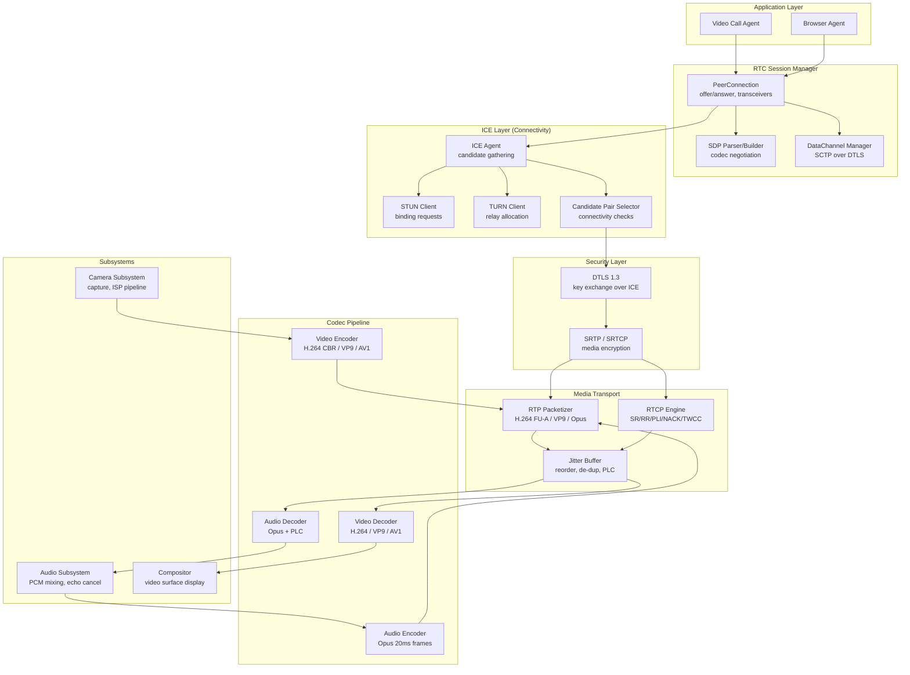
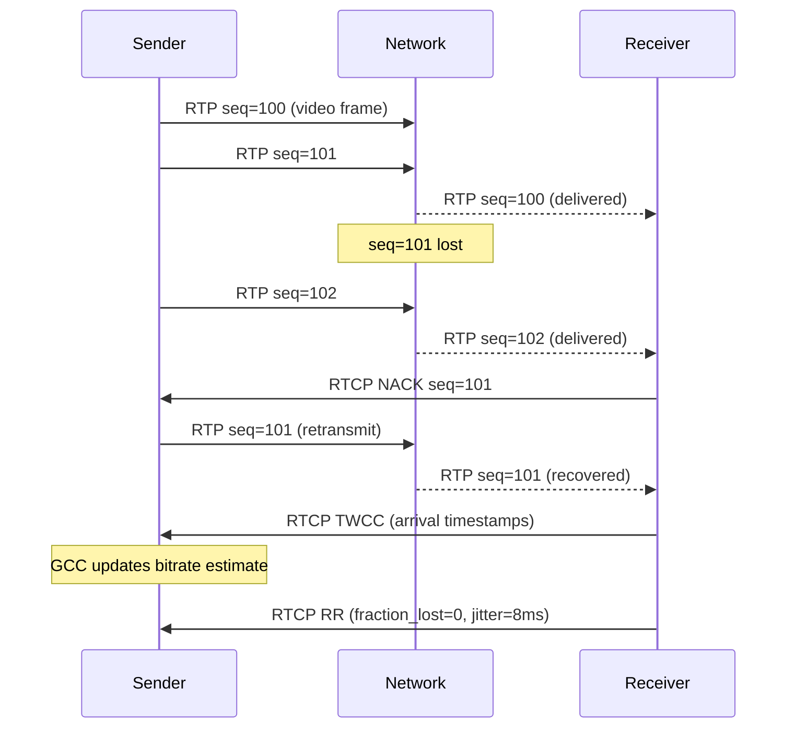
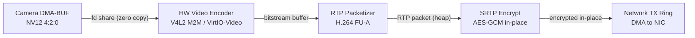
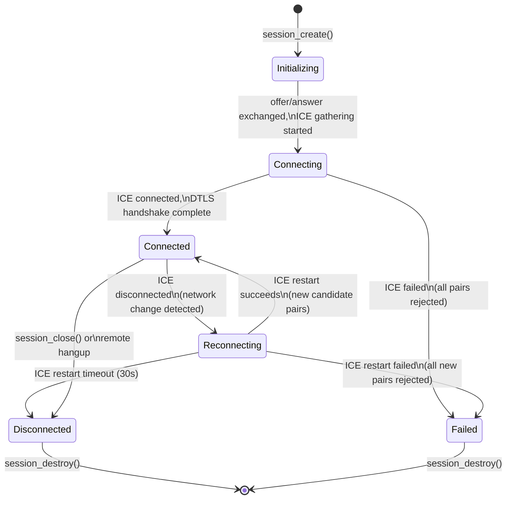
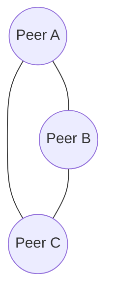
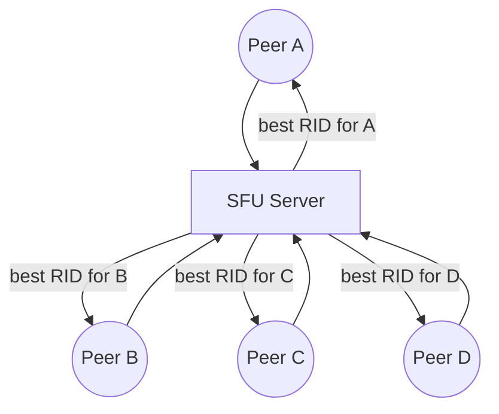
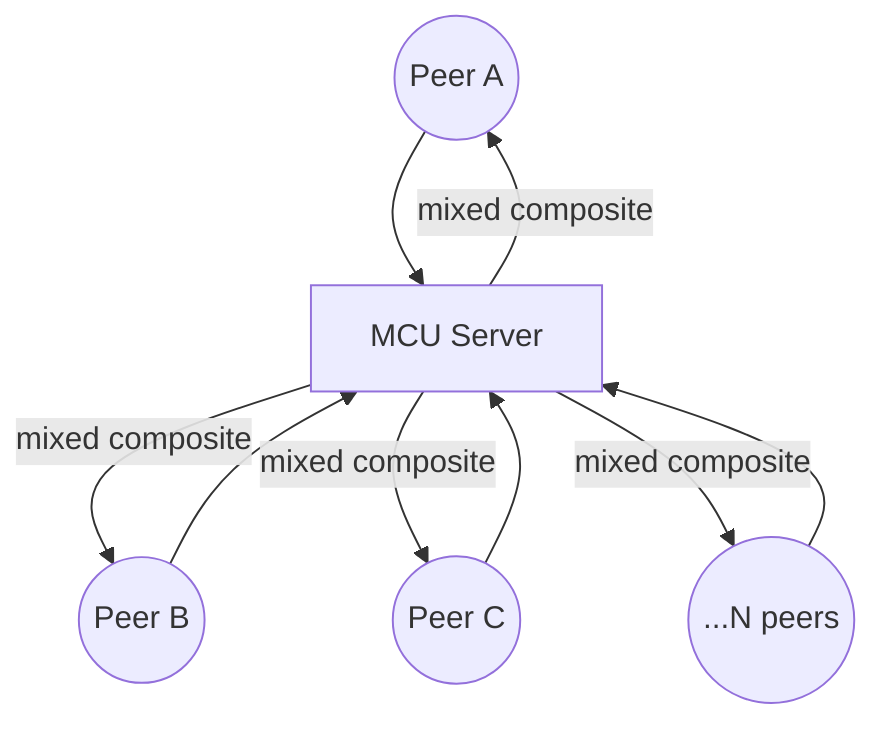
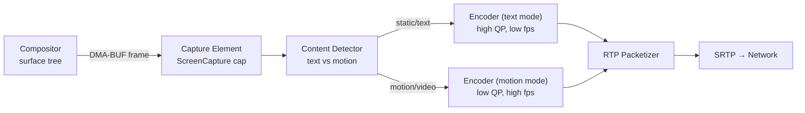

# AIOS Media Pipeline — Real-Time Communication

Part of: [media-pipeline.md](../media-pipeline.md) — Media Pipeline

**Related:** [codecs.md](./codecs.md) — Codec framework (shared encoders/decoders), [playback.md](./playback.md) — Pipeline graph model (shared element abstraction), [streaming.md](./streaming.md) — Jitter buffer and bandwidth estimation (shared components), [drm.md](./drm.md) — DTLS-SRTP media encryption

-----

## §9 Real-Time Communication

Real-time communication (RTC) in AIOS is a first-class pipeline mode, not a userspace library layered on top of playback. The WebRTC stack is integrated directly into the media pipeline subsystem, sharing the same element graph model, codec registry, and session framework as playback and streaming. This integration provides two benefits absent from conventional WebRTC implementations: capability-gated access to network operations and camera/microphone hardware, and zero-copy paths from capture through encode to the network transmit ring.

The latency target for voice and video calls is below 150ms end-to-end on a local network and below 300ms over wide-area links — thresholds established by ITU-T G.114 as the boundary of noticeable conversational delay.

### §9.1 WebRTC Stack Architecture

The AIOS WebRTC stack covers all layers from connectivity establishment through encrypted media transport, integrated with the existing Audio, Camera, and Compositor subsystems for capture and display.



The `PeerConnection` is the central coordinating object for a single WebRTC session. It owns the ICE agent, the DTLS context, all `RtpTransceiver` instances (each transceiver covers one media track), and any data channels.

```rust
pub struct PeerConnection {
    id: PeerConnectionId,
    local_description: Option<SessionDescription>,
    remote_description: Option<SessionDescription>,
    ice_state: IceConnectionState,
    dtls_state: DtlsState,
    transceivers: Vec<RtpTransceiver>,
    data_channels: Vec<DataChannel>,
    stats: RtcStats,
}

pub enum IceConnectionState {
    New,
    Checking,
    Connected,
    Completed,
    Disconnected,
    Failed,
    Closed,
}

pub enum DtlsState {
    New,
    Connecting,
    Connected,
    Closed,
    Failed,
}
```

**PeerConnection lifecycle:**

1. `new` — allocate ICE agent, generate DTLS certificate (reused across sessions from a persistent key pair)
2. `create_offer` — build SDP describing local codecs, ICE credentials, and DTLS fingerprint
3. `set_local_description(offer)` — start ICE candidate gathering (host, server-reflexive, relay)
4. Signal SDP and ICE candidates to remote peer via any out-of-band channel
5. `set_remote_description(answer)` — parse remote SDP, extract remote codecs and ICE credentials
6. ICE connectivity checks proceed; candidate pairs are tested in priority order
7. DTLS handshake begins over the selected ICE transport
8. SRTP keys are extracted from the completed DTLS handshake (RFC 5764)
9. RTP/RTCP media flows bidirectionally; each packet is SRTP-protected

**ICE candidate gathering** produces three categories:

- **Host candidates** — local IP addresses (one per active network interface). Gathered immediately and cheaply.
- **Server-reflexive candidates** — public IP:port observed by a STUN server. Requires one STUN binding request per interface.
- **Relay candidates** — TURN-allocated port. Used when symmetric NAT blocks direct or server-reflexive connectivity. TURN allocation requires authentication and incurs relay latency.

The ICE agent sends STUN binding requests to all configured STUN servers (`stun.l.google.com:19302` as default; additional servers configurable per-session). TURN relay is requested when the ICE agent has been checking for more than 2 seconds without a successful direct candidate pair.

**ICE candidate pair selection** tests all N×M combinations of local and remote candidates. Each pair is assigned a priority derived from the candidate type preferences (host > server-reflexive > relay) and component IDs. The pair with the highest priority that passes a bidirectional STUN connectivity check is nominated. The ICE agent continues checking lower-priority pairs for 500ms after nomination to detect better paths (ICE aggressive nomination).

After ICE completes, the DTLS handshake runs over the nominated transport pair. The DTLS 1.3 handshake authenticates each peer via the fingerprint in the SDP (preventing MITM attacks even on untrusted signaling channels). Completed handshake produces `SRTP_AES128_CM_SHA1_80` or `SRTP_AEAD_AES_128_GCM` keying material.

Network access requires `NetworkRtc` capability, enforced at the ICE agent level. Cross-reference: [networking.md](../networking.md) §6.1 (capability gate for network operations).

### §9.2 SDP and Codec Negotiation

Session Description Protocol (SDP) describes the media capabilities of each peer. AIOS implements the offer/answer model defined in RFC 3264: the offerer proposes a set of codecs and transport parameters; the answerer selects the subset it supports.

**SDP structure:**

```text
v=0
o=- 4611731400430051336 2 IN IP4 127.0.0.1
s=-
t=0 0
a=group:BUNDLE 0 1
m=audio 9 UDP/TLS/RTP/SAVPF 111 103
a=rtpmap:111 opus/48000/2
a=rtpmap:103 ISAC/16000
a=fmtp:111 minptime=10;useinbandfec=1
a=extmap:1 urn:ietf:params:rtp-hdrext:ssrc-audio-level
a=extmap:2 http://www.webrtc.org/experiments/rtp-hdrext/abs-send-time
m=video 9 UDP/TLS/RTP/SAVPF 96 97 98
a=rtpmap:96 VP9/90000
a=rtpmap:97 H264/90000
a=rtpmap:98 AV1/90000
a=fmtp:97 profile-level-id=42e01f;level-asymmetry-allowed=1;packetization-mode=1
a=extmap:3 http://www.ietf.org/id/draft-holmer-rmcat-transport-wide-cc-extensions-01
a=extmap:4 urn:ietf:params:rtp-hdrext:sdes:mid
a=simulcast:send h;m;l
a=rid:h send
a=rid:m send
a=rid:l send
```

**Codec priority order for negotiation:**

| Media | Priority | Codec | Rationale |
|---|---|---|---|
| Audio | 1 | Opus | Mandatory for WebRTC; best quality-vs-bandwidth |
| Audio | 2 | ISAC | Legacy fallback for older implementations |
| Video | 1 | AV1 | Best compression; offer first if HW encoder available |
| Video | 2 | VP9 | Good compression; software encode acceptable |
| Video | 3 | H.264 | Broadest hardware support; constrained baseline profile |

**RTP header extensions negotiated per-session:**

| Extension URI | Purpose | Direction |
|---|---|---|
| `abs-send-time` | Sender absolute timestamp for delay estimation | send |
| `transport-cc` (TWCC) | Per-packet arrival timestamps for congestion control | recv |
| `urn:ietf:params:rtp-hdrext:sdes:mid` | Bundle stream identification | both |
| `urn:ietf:params:rtp-hdrext:sdes:rid` | Simulcast stream identification | send |
| `ssrc-audio-level` | Audio energy for voice activity detection | send |

**BUNDLE** multiplexes all media streams (audio, video, data channels) over a single ICE transport pair. This reduces the number of ICE candidate pairs to check from O(N×M×streams) to O(N×M) and halves port usage. AIOS always offers BUNDLE; it falls back to per-stream transports only when the remote peer explicitly rejects BUNDLE.

**RTCP-mux** places RTP and RTCP on the same port (odd port for RTCP is eliminated), further reducing port requirements. Always enabled in AIOS sessions.

### §9.3 RTP/RTCP

Real-time Transport Protocol carries the actual media samples. RTCP provides feedback, statistics, and control signals for adaptive behavior.

**RTP packet layout:**

```text
 0                   1                   2                   3
 0 1 2 3 4 5 6 7 8 9 0 1 2 3 4 5 6 7 8 9 0 1 2 3 4 5 6 7 8 9 0 1
+-+-+-+-+-+-+-+-+-+-+-+-+-+-+-+-+-+-+-+-+-+-+-+-+-+-+-+-+-+-+-+-+
|V=2|P|X|  CC   |M|     PT      |       Sequence Number         |
+-+-+-+-+-+-+-+-+-+-+-+-+-+-+-+-+-+-+-+-+-+-+-+-+-+-+-+-+-+-+-+-+
|                           Timestamp                           |
+-+-+-+-+-+-+-+-+-+-+-+-+-+-+-+-+-+-+-+-+-+-+-+-+-+-+-+-+-+-+-+-+
|           Synchronization Source (SSRC) identifier           |
+-+-+-+-+-+-+-+-+-+-+-+-+-+-+-+-+-+-+-+-+-+-+-+-+-+-+-+-+-+-+-+-+
|            Contributing source (CSRC) identifiers            |
|                             ....                              |
+-+-+-+-+-+-+-+-+-+-+-+-+-+-+-+-+-+-+-+-+-+-+-+-+-+-+-+-+-+-+-+-+
```

**Packetization formats:**

- **H.264:** NAL units are wrapped in FU-A (Fragmentation Units) when larger than MTU (1200 bytes after RTP + SRTP headers). STAP-A (Single-Time Aggregation Packets) bundles small NAL units to reduce header overhead. Packetization mode 1 (non-interleaved) is mandatory for low-latency.
- **VP9:** Payload descriptor carries temporal and spatial layer indices for SVC-aware forwarding by SFUs. Each RTP packet carries a complete VP9 partition.
- **Opus:** One or more Opus frames per RTP packet. Standard frame duration is 20ms; 10ms frames trade bandwidth efficiency for latency reduction on constrained networks.

**RTCP packet types used by AIOS:**

| Packet Type | PT | Purpose | Direction |
|---|---|---|---|
| Sender Report (SR) | 200 | RTP timestamp ↔ NTP clock mapping, cumulative counts | sender → receiver |
| Receiver Report (RR) | 201 | Fraction lost, cumulative lost, jitter, delay | receiver → sender |
| PLI — Picture Loss Indication | 206 | Request next keyframe (any type) | receiver → sender |
| FIR — Full Intra Request | 206 | Force IDR frame for stream sync | receiver → sender |
| NACK | 205 | Request retransmission by sequence number | receiver → sender |
| REMB | 206 | Receiver-estimated max bitrate (deprecated, kept for compat) | receiver → sender |
| TWCC | 205 | Per-packet arrival timestamps (RFC 8888) | receiver → sender |

The RTCP feedback loop drives encoder adaptation. PLI triggers an IDR frame from the video encoder within the next 33ms (one frame period at 30fps). NACK causes the sender to retransmit the requested sequence numbers from a 500ms retransmit buffer; packets older than the buffer are dropped and a PLI is sent instead. TWCC reports are processed by the congestion controller (GCC — Google Congestion Control) to estimate available bandwidth.



### §9.4 Media Processing for RTC

The RTC encode/decode path is optimized for latency at the cost of compression efficiency — the opposite trade-off from streaming, where buffering is acceptable.

**Encode latency target: < 30ms** from raw frame to the first RTP packet leaving the network interface.

**Video encode configuration for RTC:**

| Parameter | Value | Rationale |
|---|---|---|
| Profile | H.264 Constrained Baseline | Maximum decoder compatibility |
| Rate control | CBR | Predictable bitrate for congestion control |
| B-frames | 0 | Eliminate reorder delay |
| GOP length | 30–120 frames (1–4 seconds) | Balance recovery time vs bandwidth |
| Rate control mode | Low-delay CBR | Immediate rate response to REMB/TWCC |
| Slice mode | One slice per packet | Enable independent packet decoding |

**Adaptive resolution ladder** (switched by RTC quality manager):

| Level | Resolution | Frame Rate | Bitrate Target |
|---|---|---|---|
| HD | 1280×720 | 30 fps | 1.5–2.5 Mbps |
| SD | 640×480 | 30 fps | 500–900 Kbps |
| Low | 480×360 | 15 fps | 200–400 Kbps |
| Minimal | 320×240 | 15 fps | 80–150 Kbps |

**Audio encode — Opus:**

- Frame duration: 20ms (default), 10ms (low-latency mode when RTT < 50ms and network is stable)
- Mode selection: SILK for voice (8–24 kHz, efficient for speech), CELT for music (full-band, lower latency), hybrid when speech and music are mixed
- DTX (Discontinuous Transmission): suppress packets during silence segments detected by VAD (Voice Activity Detection). Reduces bandwidth by 50–70% during pauses. Comfort noise is generated at the receiver.
- In-band FEC: Opus encodes a redundant copy of the previous frame at lower bitrate in the current packet. Allows recovery from single-packet loss without retransmission. Enabled when packet loss exceeds 2%.

**Zero-copy encode path:**



Camera frames are shared with the encoder via DMA-BUF file descriptor, avoiding a copy from the capture buffer. The encoder writes compressed bitstream to a separate output buffer; the packetizer reads this buffer and builds RTP packets. SRTP encryption operates in-place on the RTP buffer before it is handed to the network TX ring. Cross-reference: [camera.md](../camera.md) §4.4 (zero-copy buffer paths).

**RTP receive and decode path:**

Network receive → SRTP decrypt → jitter buffer (reorder, de-duplicate) → RTP depacketizer → video decoder → color convert (NV12 → RGBA) → Compositor surface.

The jitter buffer is shared with the streaming subsystem (see [streaming.md](./streaming.md) §8 for jitter buffer internals). For RTC the target playout delay is set to 50ms (versus 2–10 seconds for streaming ABR), providing modest reordering tolerance without introducing audible call latency.

**Echo cancellation coordination:**

The audio subsystem's acoustic echo canceller requires a reference signal — the far-end audio being played through the speaker. The RTC pipeline provides this reference by inserting a tap after the Opus decoder and before the Audio subsystem's PCM sink. The tap delivers the decoded far-end PCM samples to the echo canceller's reference input. Without this tap, the microphone captures the speaker output and transmits it back to the remote participant as echo. Cross-reference: [audio.md](../audio.md) §4.5 (capture pipeline, echo cancellation).

### §9.5 Simulcast and SVC

When multiple remote participants have heterogeneous network conditions, sending a single video stream forces the sender to encode for the worst receiver. Simulcast and SVC solve this by producing multiple quality levels simultaneously, allowing an SFU to forward the appropriate level to each receiver independently.

**Simulcast:**

The sender runs multiple independent encoder instances at different resolutions. Each resolution is a separate RTP stream with its own SSRC and `rid` (restriction identifier) header extension.

```text
RID "h" (high)   → 1280×720 @ 30fps @ 2.0 Mbps  SSRC=11111
RID "m" (medium) →  640×360 @ 30fps @ 600 Kbps   SSRC=22222
RID "l" (low)    →  320×180 @ 15fps @ 150 Kbps   SSRC=33333
```

An SFU selects which stream to forward to each receiver based on that receiver's REMB/TWCC reports. When a receiver's bandwidth drops, the SFU switches to a lower RID stream without requiring the sender to change its encode configuration.

CPU cost: three concurrent encoder instances, each at reduced resolution. Total encoding cost is roughly 40% more than a single 720p encode because the lower resolutions are cheap. Memory cost: three independent encoder state machines and bitstream buffers.

**SVC (Scalable Video Coding):**

A single encoder produces a layered bitstream. Layers have dependency relationships: spatial layer S1 depends on S0, temporal layer T1 depends on T0.

```text
Temporal layers (VP9 SVC):
  T0: keyframes + every 4th inter frame → 7.5 fps base
  T1: adds alternate inter frames → 15 fps
  T2: adds remaining inter frames → 30 fps

Spatial layers (VP9 SVC):
  S0: 320×180 (quarter resolution)
  S1: 640×360 (half resolution, depends on S0)
  S2: 1280×720 (full resolution, depends on S1)
```

An SFU drops temporal or spatial layers without re-encoding. A receiver needing only 15fps at 360p receives only T0+T1 at S1, discarding T2 and S2. This achieves the same flexibility as simulcast with lower CPU cost (single encoder) but less per-receiver quality independence (cannot forward 720p to one receiver and 360p to another with different temporal rates simultaneously).

**Dynamic quality switching:** the RTC quality manager responds to worsening TWCC reports by switching simulcast RIDs within one RTT (typically < 200ms) or by signaling the SVC encoder to reduce active layers within one keyframe period (< 2 seconds).

### §9.6 Data Channels

Data channels provide a reliable or unreliable message-passing channel between WebRTC peers, independent of media streams. They are built on SCTP (Stream Control Transmission Protocol) running over the DTLS transport established by ICE.

```rust
pub struct DataChannel {
    id: DataChannelId,
    label: String,
    ordered: bool,
    max_retransmits: Option<u32>,
    max_packet_lifetime_ms: Option<u32>,
    protocol: String,
    state: DataChannelState,
}

pub enum DataChannelState {
    Connecting,
    Open,
    Closing,
    Closed,
}
```

**Delivery modes:**

| Mode | Ordered | Reliability | Use case |
|---|---|---|---|
| Reliable ordered | Yes | Unlimited retransmit | File transfer, chat |
| Reliable unordered | No | Unlimited retransmit | Game state updates (order irrelevant) |
| Partially reliable (retransmit) | Yes | N retransmits max | Sensor data with staleness limit |
| Partially reliable (lifetime) | Yes | T ms max | Real-time cursor position |
| Unreliable | No | 0 retransmits | Highest-frequency telemetry |

SCTP provides stream multiplexing: multiple data channels share a single SCTP association over the DTLS transport. Each channel is an independent SCTP stream; head-of-line blocking affects only channels with the same stream ID when ordered delivery is used.

Maximum message size is 256 KiB. Larger messages must be fragmented by the application; SCTP's own fragmentation is avoided because it interacts poorly with partial reliability modes.

Data channel creation requires `DataChannelCapability` in addition to the `NetworkRtc` capability that covers the underlying ICE/DTLS transport. This allows an agent to be granted the ability to open media connections while data channels remain restricted.

-----

## §10 RTC Sessions

### §10.1 RTC Session Lifecycle

An `RtcSession` wraps a `PeerConnection` with AIOS session management: capability enforcement, resource tracking, quality monitoring, and clean teardown on disconnect or crash.

```rust
pub struct RtcSession {
    id: RtcSessionId,
    peer_connection: PeerConnection,
    local_streams: Vec<MediaStreamId>,
    remote_streams: Vec<MediaStreamId>,
    state: RtcSessionState,
    quality: RtcQuality,
}

pub enum RtcSessionState {
    Initializing,
    Connecting,
    Connected,
    Reconnecting,
    Disconnected,
    Failed,
}
```

**State machine:**



**Capability requirements:**

- `MediaRtc` — required to create any RTC session. Distinct from `MediaPlayback`, ensuring video playback agents cannot initiate calls without explicit grant.
- `NetworkRtc` — required to perform ICE gathering and DTLS/SRTP transport. Enforced at the ICE agent when it opens UDP sockets.
- `CameraCapture` — required if the session includes a video send track. Inherited from Camera subsystem session grant. Cross-reference: [camera.md](../camera.md) §6.1 (session lifecycle, `ConflictPolicy::Prompt`).
- `AudioCapture` — required if the session includes an audio send track. Cross-reference: [audio.md](../audio.md) §3.2 (`AudioCapture` capability).

**ICE restart:** when the ICE agent transitions to `Disconnected` state (keepalive STUN checks fail for 5 seconds), the session manager triggers an ICE restart automatically without terminating the session. An ICE restart generates new ICE credentials, regathers candidates, and re-runs connectivity checks. From the application's perspective, the session transitions to `Reconnecting` and back to `Connected` without a new offer/answer exchange visible to the agent. If ICE restart fails after 30 seconds, the session moves to `Disconnected`.

**Session timeout:** sessions in `Failed` state have all RTP/RTCP sockets closed, all encoder/decoder instances released, and camera/microphone captures stopped within 100ms. Capabilities are released in reverse acquisition order.

### §10.2 RTC Quality Management

Quality monitoring runs every 250ms, driven by RTCP statistics. The quality manager adjusts encode parameters to maintain the best achievable quality within current network conditions.

```rust
pub struct RtcQuality {
    /// Outbound bitrate in bits/second.
    sending_bitrate: u32,
    /// Inbound bitrate in bits/second.
    receiving_bitrate: u32,
    /// Round-trip time in milliseconds.
    rtt_ms: u32,
    /// Fraction of outbound packets lost (0–255, mapped from 0.0–1.0).
    outbound_packet_loss: u8,
    /// Interarrival jitter for inbound video in milliseconds.
    inbound_jitter_ms: u32,
    /// Current outbound video frame rate.
    frame_rate: f32,
    /// Current outbound video resolution.
    resolution: (u32, u32),
    /// Derived quality level for UI.
    level: NetworkQualityLevel,
}

pub enum NetworkQualityLevel {
    Good,
    Fair,
    Poor,
}
```

**Quality thresholds:**

| Level | RTT | Packet Loss | Jitter |
|---|---|---|---|
| Good | < 150ms | < 2% | < 30ms |
| Fair | 150–400ms | 2–5% | 30–75ms |
| Poor | > 400ms | > 5% | > 75ms |

**Adaptation ladder (applied in order when quality degrades):**

1. **Reduce frame rate** — 30 fps → 15 fps. Immediate; halves video encoder output rate.
2. **Reduce resolution** — step down one level in the resolution ladder. Applied when frame rate is already at minimum for the current level.
3. **Reduce codec complexity** — increase quantizer, reduce reference frames. Applied when resolution is already at minimum.
4. **Audio-only mode** — disable video track entirely. The video encoder is paused and the camera capture rate drops to 1 fps (to allow quick resume). Applied when packet loss exceeds 15% or RTT exceeds 2 seconds.

Recovery from degraded quality requires conditions to remain improved for a 5-second hysteresis period before stepping back up. This prevents oscillation when network quality is borderline.

**Quality events** are emitted to the session metrics ring at each 250ms sample point. The metrics include raw RTCP statistics (RR fraction lost, jitter, cumulative lost) as well as derived values (current encoder bitrate, quantizer, active simulcast RID). Cross-reference: [observability.md](../../kernel/observability.md) (metrics infrastructure).

The network quality level is exposed to the agent as a simple enum (`Good`, `Fair`, `Poor`) suitable for rendering a visual indicator in the call UI without requiring the agent to parse RTCP internals.

### §10.3 Multi-Party Calls

Group calls require a topology decision: how do N participants exchange media? AIOS supports three topologies with automatic selection based on participant count and available infrastructure.

**Mesh topology (2–4 participants):**



Each peer maintains a direct `PeerConnection` to every other peer. For N participants: N×(N-1)/2 connections, each with independent ICE/DTLS/SRTP overhead. Every peer sends N-1 outbound streams.

- Highest quality: no server in the media path, minimum latency.
- Highest resource cost: CPU scales as O(N²) for encoding (separate encode per receiver in simulcast), bandwidth scales as O(N) outbound streams.
- No server infrastructure required: suitable for private calls between trusted devices.
- AIOS default for 2–4 participants when no SFU is configured.

**SFU topology — Selective Forwarding Unit (5–50 participants):**



Each peer sends one PeerConnection to the SFU server. The SFU receives all streams and forwards the appropriate simulcast layer (or SVC layer) to each receiver based on that receiver's available bandwidth. The SFU does not decode or re-encode media; it selects and forwards RTP packets, preserving SRTP encryption.

- Moderate quality: SFU introduces one hop of forwarding latency (typically < 20ms on the same continent).
- Linear bandwidth scaling: each peer sends one outbound stream regardless of participant count.
- Server infrastructure required: AIOS sessions can be configured with an SFU endpoint URL.
- Selected automatically when 5th participant joins an existing mesh session.

**MCU topology — Multipoint Control Unit (50+ participants):**



The MCU decodes all incoming streams, mixes them into a composite (for video: a grid layout; for audio: summation with automatic gain control), and re-encodes a single stream for each receiver. Each peer receives one stream regardless of how many participants are present.

- Lowest client cost: one decode + one render for any participant count.
- Highest server cost: MCU CPU scales as O(N) decodes + O(N) encodes.
- Lowest quality: each MCU re-encode introduces generation loss.
- Appropriate for large webinars, broadcast-style events, or very constrained client devices.

**Dynamic topology selection:**

```text
participants ≤ 4 and no SFU configured  →  Mesh
participants ≤ 50 and SFU configured    →  SFU
participants > 50 or client constrained →  MCU (requires MCU endpoint)
```

Topology promotion (Mesh → SFU) is signaled through the session control channel when the 5th peer joins. Existing PeerConnections to other peers are torn down after the SFU connections are established, with a 2-second overlap to avoid audio dropout.

### §10.4 Screen Sharing

Screen sharing captures compositor output — either the full display or a specific application surface — and delivers it as a video track in the RTC session.

**Capture pipeline:**

The Compositor exposes a capture interface guarded by `ScreenCapture` capability. The RTC session manager requests a capture stream from the Compositor, which delivers frames as DMA-BUF handles at the requested frame rate. These frames feed directly into the video encoder's input queue. Cross-reference: [compositor.md](../compositor.md) §10.3 (screen capture capability).



**Content-adaptive encoding:** the capture pipeline samples frame differences every 500ms to classify the content type:

- **Text mode** (slide presentations, documents, code): high quantizer quality (low QP), 5–10 fps, high resolution. Text rendering artifacts from compression are visible at high QP; text mode uses a quality-biased quantizer even at the cost of bitrate.
- **Motion mode** (video playback, animations): lower quantizer quality (moderate QP), 30 fps, resolution adapted by quality manager. Motion artifacts from low frame rate are more disruptive than mild compression artifacts.
- **Switching hysteresis:** mode switches require 1 second of consistent classification to avoid encoder reconfiguration on momentary motion events.

**System audio loopback:** when the agent requests screen sharing with audio, the Audio subsystem provides a loopback capture of the current audio output mix. This loopback stream is mixed with the microphone capture (with automatic gain balancing) and encoded as the audio track. This allows a presenter to share their screen with commentary while the audience hears both the presenter's voice and any audio playing on the presenter's system. Cross-reference: [audio.md](../audio.md) §16.5 (loopback routing, future direction).

**Cursor overlay:** rather than encoding the cursor into the video bitstream (which would require a keyframe on every cursor move), the cursor position and shape are transmitted via a data channel at up to 60 updates/second. The receiver renders the cursor as a compositor overlay on the decoded video surface. This reduces keyframe frequency and eliminates cursor blur from video compression.

**DRM-protected content exclusion:** surfaces flagged with a DRM protection level are replaced with a black region in the capture output. The Compositor enforces this substitution before delivering frames to the capture element; the RTC session never has access to the protected pixel data. Cross-reference: [drm.md](./drm.md) §12.2 (screen capture restrictions for DRM-protected surfaces).

**Privacy audit:** every screen capture session generates an audit record (capturing agent ID, captured surfaces, start/stop times) written to the security audit log. Agents receive a visual indicator in the system tray for the duration of the capture, consistent with camera and microphone privacy indicators.
