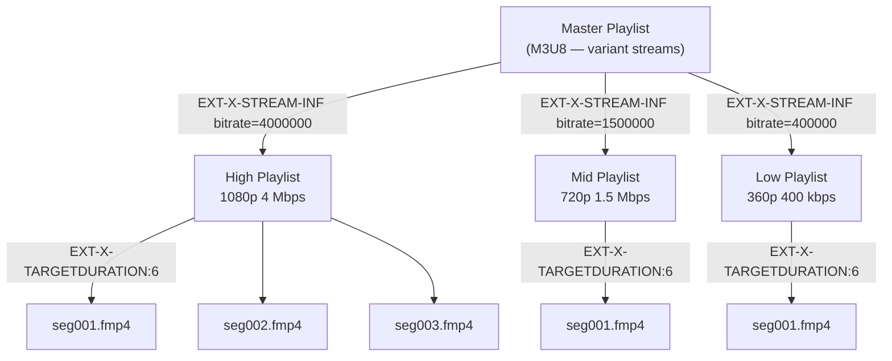
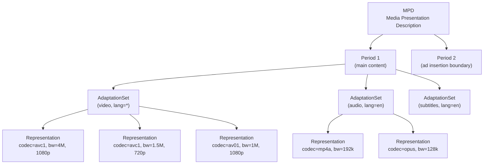
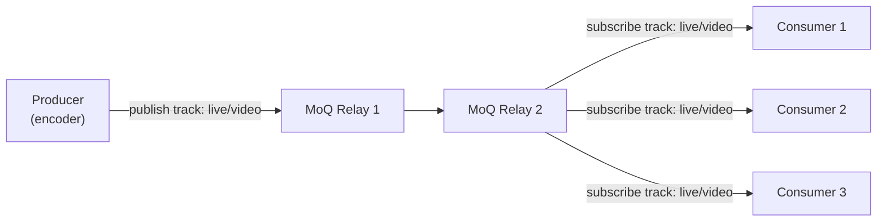
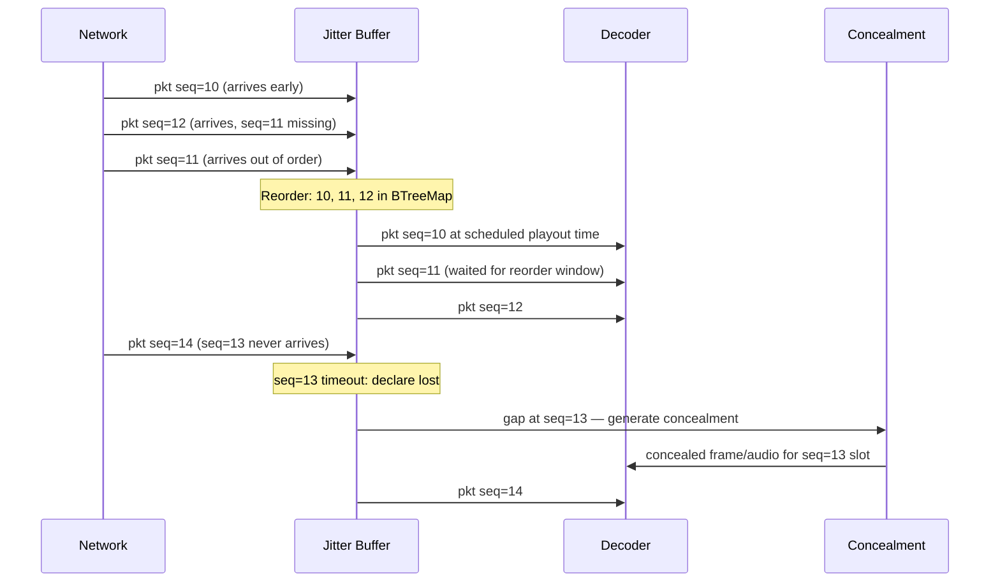

# AIOS Media Pipeline — Streaming & Adaptive Delivery

Part of: [media-pipeline.md](../media-pipeline.md) — Media Pipeline

**Related:** [codecs.md](./codecs.md) — Codec framework, [playback.md](./playback.md) — Pipeline graph and A/V sync, [rtc.md](./rtc.md) — Real-time communication (shares jitter buffer and bandwidth estimation), [integration.md](./integration.md) — Networking subsystem integration

-----

## §7 Streaming Protocols

Streaming connects the media pipeline to network-delivered content. Rather than loading an entire file before playback, streaming protocols allow the pipeline to begin presenting media as data arrives. AIOS supports the full spectrum from simple progressive download through adaptive multi-variant delivery, with a path to unified low-latency transport via Media over QUIC.

All streaming sources are implemented as `NetworkSource` pipeline elements that wrap the ANM connection manager. The pipeline graph ([playback.md](./playback.md) §5.1) treats a `NetworkSource` identically to a `FileSource` — it delivers bytes into the demuxer regardless of whether those bytes came from a local Space object or a remote CDN segment. This abstraction enables playback, recording, and live streaming pipelines to share the same downstream element graph.

-----

### §7.1 HTTP Progressive Download

The simplest streaming mode. The pipeline issues a single HTTP GET request and processes the response body as a byte stream, demuxing the container format as bytes arrive.

**Range request seeking (HTTP 206):** When the agent seeks to a position not yet buffered, the pipeline cancels the current download and issues a new GET with `Range: bytes=N-` targeting the byte offset corresponding to the seek target. The demuxer re-synchronizes on the new stream position.

**Download-ahead buffer:** A configurable read-ahead window (typically 10–30 seconds of media data) is maintained in a bounded ring buffer. The download thread writes ahead of the demux thread; the demuxer blocks when the buffer is empty and the download thread blocks when the buffer is full. Buffer depth is tunable: shallow buffers reduce startup latency; deep buffers absorb network jitter and enable smooth seeking.

```rust
pub struct NetworkSource {
    connection: NtmConnection,
    read_ahead_buffer: RingBuffer<u8, READ_AHEAD_CAPACITY>,
    position: u64,
    content_length: Option<u64>,
    supports_ranges: bool,
}

impl MediaSource for NetworkSource {
    fn read(&mut self, buf: &mut [u8]) -> Result<usize, MediaError> {
        self.read_ahead_buffer.read(buf)
    }

    fn seek(&mut self, position: u64) -> Result<(), MediaError> {
        if !self.supports_ranges {
            return Err(MediaError::SeekNotSupported);
        }
        self.connection.close();
        self.read_ahead_buffer.clear();
        self.connection = self.reopen_at(position)?;
        self.position = position;
        Ok(())
    }
}
```

**Cross-reference:** [networking.md](../networking.md) §5.2 — HTTP/2 multiplexing (via Bridge Module) enables parallel range requests for fragment-based formats. [networking.md](../networking.md) §3.2 — ANM Connection Manager manages the underlying connection lifecycle (mesh for AIOS peers, bridge for CDN/internet).

-----

### §7.2 HLS (HTTP Live Streaming)

HLS delivers media as a sequence of short segments described by M3U8 playlist files. The pipeline must fetch and process manifests, schedule segment downloads ahead of the playback position, and handle live-edge tracking for broadcast streams.

**Manifest hierarchy:**



**Segment fetch pipeline:** The `HlsSource` element maintains a lookahead window of 3–5 segments. A background task fetches segments ahead of the current demux position, writing complete segment bytes into a segment queue. The demuxer consumes segments in order. Lookahead depth is bounded to avoid excessive buffering on low-memory devices.

**Variant stream selection:** The ABR algorithm (§7.4) selects which variant playlist to follow. The `HlsSource` switches between variant playlists at segment boundaries, always downloading the next segment from the newly selected variant.

**Encryption:** HLS supports two encryption modes:

- `AES-128`: entire segments encrypted with a 16-byte AES key in CBC mode. Key URI fetched via ANM Bridge before first encrypted segment. Key rotation: new key URI per segment or per key period.
- `SAMPLE-AES`: individual audio/video samples encrypted within the container. Required for HLS with DRM. Integration with the CDM trait — see [drm.md](./drm.md) §11.5.

**Segment containers:** fMP4 (fragmented MP4, ISO BMFF) is preferred — uses the same demuxer as progressive MP4 with initialization segment parsing. MPEG-TS is supported for legacy compatibility via the TS demuxer (see [codecs.md](./codecs.md) §4.4).

**Live streaming:** Media playlists have a sliding window — old segments age out as new ones are appended. The `HlsSource` polls the media playlist at the target duration interval, tracking the live edge. `EXT-X-PROGRAM-DATE-TIME` tags provide absolute wall-clock timestamps for DVR synchronization and live-edge alignment.

**Low-Latency HLS (LL-HLS):**

LL-HLS reduces end-to-end latency from the traditional 10–30 seconds to 2–4 seconds through three mechanisms:

- **Partial segments (EXT-X-PART):** The server publishes sub-segment chunks (typically 200ms) as they are generated. Clients download partial segments before the full segment is complete.
- **Blocking playlist reload (EXT-X-SERVER-CONTROL):** The client sends a `_HLS_msn=N&_HLS_part=P` query to the playlist URL. The server holds the response until segment N part P (or later) appears in the playlist, eliminating polling latency.
- **Preload hints (EXT-X-PRELOAD-HINT):** The playlist advertises the URL of the next partial segment before it is complete. The client issues a GET immediately, and the server streams bytes as they are produced.

```text
LL-HLS timeline (200ms partial segments, 6s full segment):

  t=0                t=6s
  |--p1--p2--p3-...-p30|--p31--p32--> (live edge)
           ^playback position
  <-- 2-4s glass-to-glass latency -->
```

-----

### §7.3 DASH (Dynamic Adaptive Streaming over HTTP)

DASH uses an XML manifest (MPD — Media Presentation Description) that describes the entire presentation structure, including quality levels, codec profiles, segment addressing schemes, and content protection information.

**MPD hierarchy:**



**Period structure:** Each Period represents a contiguous time range of the presentation. Period boundaries align with ad insertion points for server-side ad insertion (SSAI): ad periods are inserted by the CDN transparently, and the DASH client plays them as seamless content transitions. Period boundaries also allow codec or language track changes.

**Segment addressing:** DASH supports four addressing modes:

- `SegmentTemplate` with `$Number$`: segments named `seg-001.m4s`, `seg-002.m4s` — simple and widely deployed.
- `SegmentTemplate` with `$Time$`: segments addressed by presentation timestamp — required for live streams with variable-duration segments.
- `SegmentList`: explicit URL list per Representation — used for VOD with pre-computed segment manifests.
- `SegmentBase`: single-file byte-range addressing — used for progressive download fallback.

**Common Encryption (CENC):** DASH MPDs embed `ContentProtection` elements listing supported DRM systems and their initialization data. The CDM subsystem uses this to select an appropriate DRM backend. See [drm.md](./drm.md) §11.5 for the full CENC integration path.

**DASH-IF Interoperability Points:** AIOS targets DASH-IF IOP compliance for the most widely deployed profiles: `urn:mpeg:dash:profile:isoff-live:2011` (live) and `urn:mpeg:dash:profile:isoff-on-demand:2011` (VOD). These profiles constrain segment structure and manifest semantics to ensure cross-CDN compatibility.

-----

### §7.4 Adaptive Bitrate Selection (ABR)

ABR continuously selects which quality level (HLS variant or DASH Representation) to download for upcoming segments. The goal is to maximize video quality while avoiding rebuffering events. AIOS implements three ABR strategies, selectable per-session.

**Buffer-Based ABR (BBA):**

Maps buffer level directly to quality using the reservoir-cushion model from BBA-0 (Huang et al., 2014):

```text
Buffer level:  0    reservoir  cushion          max
               |---------|---------|-------------|
Quality:       lowest    ramp      highest       highest

- Below reservoir: download lowest quality (safety mode)
- Reservoir to cushion: linearly map buffer level to quality
- Above cushion: download highest available quality
```

BBA avoids bandwidth estimation entirely — its decisions are solely a function of current buffer occupancy. This makes it robust to throughput estimation errors and noisy network measurements. The tradeoff is slower adaptation to sustained bandwidth increases: the client must drain into the cushion zone before selecting higher quality.

**Throughput-Based ABR:**

Estimates available bandwidth as an exponentially-weighted moving average (EWMA) of segment download throughput:

```rust
fn update_throughput_estimate(&mut self, segment_bytes: u64, download_duration: Duration) {
    let throughput = (segment_bytes * 8) as f64 / download_duration.as_secs_f64();
    // EWMA with alpha=0.3 weights recent segments more heavily
    self.estimated_bandwidth = self.estimated_bandwidth * 0.7 + throughput * 0.3;
}

fn select_quality(&self, representations: &[Representation]) -> usize {
    let safe_bandwidth = self.estimated_bandwidth * SAFETY_MARGIN; // 0.85
    representations
        .iter()
        .rposition(|r| r.bandwidth as f64 <= safe_bandwidth)
        .unwrap_or(0)
}
```

Throughput-based ABR reacts quickly to bandwidth changes but is sensitive to estimation noise. Short segments (2s HLS) produce noisy estimates; longer segments (10s DASH) are more stable but slower to adapt.

**Hybrid ABR (recommended default):**

Combines buffer level, throughput estimate, and switching cost to make quality decisions:

- **Startup mode:** Aggressive quality ramp. Buffer below 10 seconds: select quality at 90% of estimated bandwidth. Priority is reaching stable buffer depth quickly.
- **Stable mode:** Conservative switching. Require 15% bandwidth advantage to switch up; switch down immediately when estimated bandwidth < current quality bitrate × 1.05.
- **Switching hysteresis:** Track consecutive quality-up signals; require 3 consecutive signals before switching up. Switch down on first trigger.
- **Switching cost:** Avoid frequent quality oscillation. Penalize quality switches that improve QoE by less than a threshold.

**RL-Based ABR (AIRS-dependent, Phase 42+):**

Learned ABR trained with reinforcement learning, in the class of Pensieve (Mao et al., 2017) and PLL-ABR (2025):

- **Architecture:** PPO (Proximal Policy Optimization) with LSTM backbone for temporal context.
- **State vector:** `[buffer_level, past_N_throughputs, past_N_download_times, past_N_quality_levels, next_N_chunk_sizes, deadline_slack]`
- **Action:** Quality level index for the next segment.
- **Reward:** `α × log(bitrate) - β × rebuffer_time - γ × |quality_switch|`
- **Training:** Offline on network trace datasets (HSDPA, FCC broadband measurements); fine-tuned online per user session.
- **ABUV extension:** Jointly selects bitrate AND super-resolution upsampling factor. Lower source resolution + higher SR factor can outperform higher source resolution at the same bandwidth budget.
- **Deployment:** Kernel-internal ONNX model inference; no AIRS IPC required for inference, but AIRS provides model updates and personalization signals.

**Cross-reference:** [integration.md](./integration.md) §16.1 — AIRS-dependent media intelligence and model management.

-----

### §7.5 Media over QUIC (MoQ)

MoQ is an IETF protocol (draft, targeting standardization approximately 2026) designed to unify ingest, fan-out, and delivery of real-time and near-real-time media over a single QUIC-based transport.

**Motivation:** Today's streaming stack uses multiple incompatible protocols for different roles:

- RTMP for live ingest (encoder → CDN)
- HLS/DASH for delivery (CDN → viewer)
- WebRTC for interactive real-time (< 500ms latency)

MoQ targets the gap between HLS/DASH (> 5s latency) and WebRTC (< 500ms): interactive live streaming at 300ms–2s end-to-end latency, at fan-out scale.

**Publish/Subscribe model:**



**Track hierarchy:**

- **Session:** a named MoQ connection context
- **Track:** a named, typed media stream (e.g., `video/avc`, `audio/opus`)
- **Group:** a decodability unit within a track (one IDR frame + dependent frames)
- **Object:** the smallest addressable unit (one frame or audio packet)

**Congestion control:** MoQ exploits QUIC's stream multiplexing to implement media-aware priority. Under congestion, video objects are dropped before audio objects. Non-reference video frames are dropped before IDR frames. This degrades gracefully: viewers see lower frame rate before seeing audio interruptions.

**QUIC integration:** MoQ reuses the QUIC transport connection shared with HTTP/3. A single QUIC connection can carry MoQ tracks alongside HTTP/3 requests to the same origin.

**Cross-reference:** [networking.md](../networking.md) §5.3 — QUIC/HTTP/3 transport, connection migration, and 0-RTT.

-----

## §8 Network Media Transport

This section covers the transport-level machinery that streaming protocols and RTC pipelines depend on: jitter absorption, bandwidth estimation, resilience strategies, and live-specific concerns. The jitter buffer and bandwidth estimator are shared components — used by both streaming pipelines (§7) and RTC pipelines ([rtc.md](./rtc.md) §9).

-----

### §8.1 Jitter Buffer

Network packets arrive with timing variability (jitter) caused by variable queueing delays, reordering, and path changes. The jitter buffer absorbs this variability, delivering packets to the decoder at a smooth, predictable rate despite irregular arrival.

```rust
pub struct JitterBuffer {
    /// Target playout delay — adjusted dynamically based on observed jitter
    target_delay: Duration,
    min_delay: Duration,
    max_delay: Duration,
    /// Packets held awaiting their playout time, keyed by RTP sequence number
    packets: BTreeMap<u32, MediaPacket>,
    /// Playout clock reference
    playout_clock: PlayoutClock,
    stats: JitterStats,
}

pub struct JitterStats {
    /// Inter-quartile range of inter-arrival time deltas — jitter estimate
    jitter_iqr: Duration,
    packets_received: u64,
    packets_late: u64,
    packets_lost: u64,
    plc_events: u64,
}
```

**Adaptive target delay:** The buffer continuously measures the inter-quartile range (IQR) of packet inter-arrival time deltas. IQR is preferred over mean or max because it is robust to occasional outlier delays. Target delay is set to cover the 95th percentile of observed jitter, clamped to `[min_delay, max_delay]`. On stable networks, target delay converges toward `min_delay`; on variable networks it rises to accommodate observed jitter.

**Packet reordering:** Packets are inserted into the `BTreeMap` by sequence number. The playout thread extracts packets in sequence-number order at their scheduled playout time. A packet that arrives after its playout window has passed is discarded as late — it cannot be presented without introducing a gap.

**Jitter buffer packet flow:**



**Packet Loss Concealment (PLC):**

- **Audio PLC:** For lost audio packets, the decoder generates substitute samples using waveform similarity overlap-add (WSOLA) on the preceding decoded audio. Opus has built-in PLC; AAC PLC uses external interpolation. Concealment quality degrades after 3+ consecutive lost packets.
- **Video PLC:** Repeat the last decoded frame (freeze frame) for short losses (1–2 frames). For longer losses, signal the decoder to request an IDR via RTCP PLI (Picture Loss Indication) — see [rtc.md](./rtc.md) §9.4.

**Forward Error Correction (FEC):** For RTP streams, XOR-based FEC groups N media packets with 1 repair packet. Loss of any single packet in the group is recoverable without retransmission. FEC adds bandwidth overhead (~1/N), so it is applied selectively on high-jitter paths.

**Buffer depth tradeoff:**

```text
Shallow buffer (50-100ms):   Low latency, susceptible to jitter-induced gaps
Medium buffer (150-300ms):   Balanced — suitable for most streaming content
Deep buffer (500ms-2s):      High resilience, suitable for VOD over lossy networks
```

For RTC pipelines, `min_delay` is set to 20ms and `max_delay` to 200ms to maintain interactive latency. For HLS/DASH streaming, the jitter buffer is supplanted by the download-ahead segment buffer; the jitter buffer operates only at the RTP layer if the stream uses RTP transport.

**Cross-reference:** [rtc.md](./rtc.md) §9.4 — RTC media processing shares this jitter buffer implementation with configurable delay parameters.

-----

### §8.2 Bandwidth Estimation

Accurate bandwidth estimation enables ABR quality selection (§7.4) and RTC congestion control ([rtc.md](./rtc.md) §9.3). AIOS implements multiple estimation mechanisms appropriate for different transport modes.

**Segment-based estimation (HLS/DASH streaming):**

```rust
fn measure_segment_throughput(
    bytes: u64,
    elapsed: Duration,
    current_estimate: f64,
) -> f64 {
    let sample = (bytes * 8) as f64 / elapsed.as_secs_f64();
    // Size-weighted EWMA: larger segments have more statistical weight
    let weight = (bytes as f64).min(1_000_000.0) / 1_000_000.0;
    let alpha = 0.3 * weight + 0.1 * (1.0 - weight);
    current_estimate * (1.0 - alpha) + sample * alpha
}
```

The EWMA alpha is weighted by segment size: large segment downloads provide more reliable throughput samples (reduced measurement noise) and receive higher weight. Small segments (LL-HLS partial segments) receive lower weight.

**REMB (Receiver Estimated Maximum Bitrate):** Used in WebRTC sessions. The receiver measures inter-packet arrival time and detects one-way delay increases that signal congestion. The estimated maximum receive rate is sent to the sender via RTCP REMB messages. See [rtc.md](./rtc.md) §9.4 for RTCP message handling.

**TWCC (Transport-Wide Congestion Control):** The receiver timestamps every received RTP packet (sequence number → arrival time) and sends these timestamps to the sender via RTCP transport feedback. The sender computes the packet delay gradient across consecutive packets:

```text
Δd = (t_recv[n] - t_recv[n-1]) - (t_send[n] - t_send[n-1])

Δd > 0: packets are spreading out → network is queuing → congestion
Δd < 0: packets are bunching up → queue draining → recovery
Δd ≈ 0: stable path
```

**GCC (Google Congestion Control):** Combines TWCC delay signals with packet loss signals using a Kalman filter on the one-way delay gradient. Produces a target bitrate that is fed back to the encoder to adjust output rate. Used as the congestion control algorithm for WebRTC sessions.

**ANM bandwidth scheduler integration:** The media pipeline reports its expected bandwidth demand to the ANM bandwidth scheduler ([networking/components.md](../networking/components.md) §3.6). The scheduler allocates bandwidth across competing connections (concurrent media sessions, background downloads). Under contention, the scheduler can reduce the media pipeline's bandwidth allocation, triggering ABR quality reduction.

-----

### §8.3 Network Resilience

Streaming pipelines must degrade gracefully under network degradation rather than stalling or crashing.

**Rebuffer prevention:** The ABR algorithm monitors buffer level continuously. When buffer depth falls below a low watermark (default 8 seconds for VOD, 2 seconds for live), the ABR immediately steps down to a lower quality level — even if estimated bandwidth could support the current quality. Proactive quality reduction prevents rebuffering; reactive quality reduction after the buffer is empty leads to a rebuffer event.

**Connection migration (QUIC):** QUIC connection IDs are decoupled from IP address and port. When a device transitions from WiFi to cellular, the QUIC connection migrates to the new network path without any application-layer interruption. For MoQ and HTTP/3 streams, this enables seamless network handoffs during playback. For HTTP/2 streams, a network transition requires reconnecting and reissuing the current segment request.

**Cross-reference:** [networking.md](../networking.md) §5.3 — QUIC connection migration mechanics.

**Offline mode:** When network is unavailable, the pipeline falls back to pre-downloaded content stored in Space objects. Offline-capable agents download content via `FileSink` elements (see [integration.md](./integration.md) §13.6). During playback, a `FileSource` element reads from the cached content. Version Store snapshots ([storage/spaces/versioning.md](../../storage/spaces/versioning.md) §5.2) enable caching multiple quality levels for offline ABR simulation.

**Prefetch cancellation:** When the agent issues a seek, the pipeline immediately cancels all in-flight segment downloads. This frees the ANM connection bandwidth for the new segment requests at the seek position. Cancelled downloads do not consume connection quota.

**DNS prefetch:** During manifest parsing, the `HlsSource` and `DashSource` elements extract all CDN hostnames from segment URLs and issue DNS pre-resolution requests via the ANM Bridge. By the time segment fetches begin, DNS results are cached and the first segment request does not incur a DNS round-trip.

**Retry with exponential backoff:** Failed segment downloads are retried with backoff:

```text
Attempt 1: immediate
Attempt 2: 500ms delay
Attempt 3: 1000ms delay
After 3 failures: trigger ABR quality step-down, reset retry counter
After 5 consecutive quality step-downs: emit StreamError::NetworkDegraded to session
```

-----

### §8.4 Live Streaming Specifics

Live streaming introduces timing constraints that do not apply to VOD: content is being produced in real-time, the live edge is continuously advancing, and the viewer's position must track the broadcast head.

**Glass-to-glass latency target:** The total latency from camera capture at the encoder to pixel display at the viewer:

```text
Traditional HLS:    10-30s  (segment duration × playlist depth)
Low-Latency HLS:     2-4s  (partial segments + blocking reload)
DASH-LL:             2-4s  (chunk-based delivery)
MoQ:              300ms-2s  (QUIC multiplexing + sub-group delivery)
WebRTC:           <200ms   (separate protocol — see rtc.md)
```

**DVR window:** Agents can seek backward into the live stream within a configurable DVR buffer (typically the last 2 hours of content, stored in the Space object for the session). The `HlsSource` maintains a sliding segment index; the `DashSource` uses MPD `timeShiftBufferDepth`. Seeking behind the DVR window is an error.

**Live edge tracking:** The `LiveEdge` component maintains the reference position for live playback:

- Periodically fetches the media playlist (HLS) or MPD (DASH) to discover new segments.
- Computes the live edge timestamp as the end of the most recently available segment.
- Tracks playback position relative to the live edge; reports `live_latency` to the session observer.

**Catchup mode:** If the playback position falls behind the live edge by more than a threshold (default: 12 seconds), the pipeline enters catchup mode and plays at 1.1× speed until within 6 seconds of the live edge, then returns to 1.0×. Speed adjustment is applied by the audio resampler (pitch-corrected time scaling), not by dropping frames.

**Timecode passthrough:** For broadcast applications, source timecodes must survive the pipeline without modification:

- MPEG-TS: PCR (Program Clock Reference) and PTS values preserved through TS demuxer.
- SMPTE 12M timecodes carried in SEI NAL units (H.264) or OBU metadata (AV1) are passed through as opaque metadata attached to decoded frames.
- NTP-synchronized timestamps from `EXT-X-PROGRAM-DATE-TIME` (HLS) or `MPD@availabilityStartTime` (DASH) enable correlation with broadcast schedules.

**Ad insertion:** Two ad insertion modes:

```text
Client-Side Ad Insertion (CSAI):
  HLS:  SCTE-35 markers in MPEG-TS signal ad break duration and type.
        Pipeline emits AdBreak event; agent replaces main content URL with ad URL.
  DASH: MPD EventStream with schemeIdUri pointing to SCTE-35 namespace.

Server-Side Ad Insertion (SSAI):
  CDN stitches ad segments into the main content manifest transparently.
  DASH: separate Periods per ad; pipeline plays through period boundaries seamlessly.
  HLS:  ad segments interspersed in media playlist with EXT-X-DISCONTINUITY markers.
        Demuxer resets timestamp continuity at discontinuities.
```

**Program boundary detection:** The pipeline monitors PTS discontinuities, SCTE-35 program boundary markers, and segment boundary timestamps to emit `ProgramBoundary` events. Agents use these events to:

- Insert chapter markers in the playback timeline UI.
- Trigger metadata fetch for new program segment.
- Reset DVR window anchoring after scheduled content transitions.

-----

*This document covers §7 (Streaming Protocols) and §8 (Network Media Transport). For codec details see [codecs.md](./codecs.md). For pipeline graph, A/V sync, and media sessions see [playback.md](./playback.md). For real-time communication (WebRTC, RTP/RTCP) see [rtc.md](./rtc.md). For cross-subsystem integration including networking hooks see [integration.md](./integration.md).*
