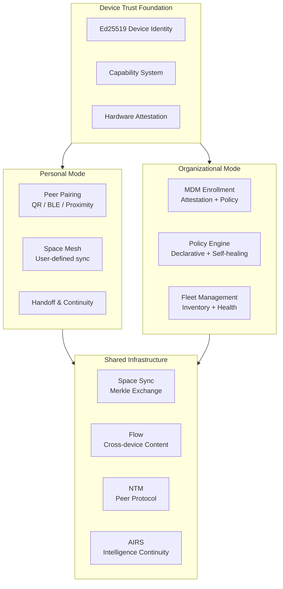
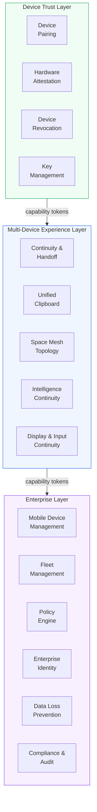

# AIOS Multi-Device & Enterprise Architecture

**Audience:** All developers (kernel, platform, application)
**Phase:** 37 (Tier 7, weeks 36–40)
**Prerequisites:** Phase 7 (Networking), Phase 23 (Full NTM), Phase 34 (Secure Boot & Update System)
**Related:** [identity.md](../experience/identity.md), [sync.md](../storage/spaces/sync.md), [networking.md](./networking.md), [model.md](../security/model.md)

---

## §1 Core Insight

Traditional operating systems treat device management as an afterthought — bolted-on MDM agents that demand administrator privileges and operate as opaque black boxes. Users cannot inspect what the MDM agent can access. Enterprise and personal devices live in separate worlds with incompatible security models.

AIOS treats multi-device as a **first-class OS concern**. A single cryptographic identity spans all of a user's devices. Spaces sync automatically via Merkle-tree exchange. Intelligence follows the user through AIRS context replication. Enterprise management uses the **same capability system** that governs all kernel access — the MDM agent receives scoped capability tokens, not root privileges.

This architecture supports two modes that share common primitives:

- **Personal multi-device** — Peer-to-peer pairing with no central authority. Devices form a mesh via mutual key exchange. The user's primary device key signs certificates for secondary devices. Spaces sync according to user-defined policies.

- **Organizational multi-device** — MDM-driven enrollment with centralized policy. Devices present hardware attestation to an enrollment server and receive a scoped capability set. The organization defines policies declaratively; devices enforce them autonomously (self-healing, works offline). Users can inspect exactly what the MDM agent can and cannot do through Inspector.

Both modes build on the same foundation: Ed25519 device identity, capability-gated resource access, Space Sync for data, Flow for cross-device content transfer, and NTM for networking.

## §2 Architecture

The multi-device and enterprise architecture comprises three layers, each building on the one below. The capability system gates all cross-layer interactions.

**Layer 1 — Device Trust** establishes cryptographic identity between devices. Personal pairing uses SPAKE2+ key agreement with SAS verification. Organizational enrollment uses hardware attestation and MDM-issued certificates. Both paths produce capability tokens that scope what the remote device can access.

**Layer 2 — Multi-Device Experience** orchestrates data and intelligence across trusted devices. Space Mesh determines which spaces sync where. Flow enables cross-device content transfer. AIRS replicates context and preferences so intelligence follows the user. Compositor and input subsystems support multi-device display extension and keyboard/mouse sharing.

**Layer 3 — Enterprise** adds organizational management on top of the multi-device experience. The MDM agent operates within its granted capabilities. The policy engine pushes declarative configuration that devices enforce autonomously. Fleet management provides inventory, health monitoring, and staged updates. Enterprise identity integrates SSO/SAML and SCIM provisioning. DLP and compliance reporting satisfy regulatory requirements.

---

## Document Map

| Document | Sections | Content |
|---|---|---|
| **This file** | §1, §2, §11, §12 | Core insight, architecture overview, design principles, implementation order |
| [pairing.md](./multi-device/pairing.md) | §3.1–§3.5 | Device discovery, personal pairing, organizational enrollment, attestation, revocation |
| [experience.md](./multi-device/experience.md) | §4.1–§4.5 | Continuity & handoff, unified clipboard, Space Mesh, intelligence & display continuity |
| [mdm.md](./multi-device/mdm.md) | §5.1–§5.5 | Declarative device management, capability-gated MDM, enrollment profiles, remote wipe |
| [fleet.md](./multi-device/fleet.md) | §6.1–§6.5 | Device inventory, health monitoring, staged updates, fleet grouping, compliance dashboard |
| [policy.md](./multi-device/policy.md) | §7.1–§7.6 | Declarative policies, conditional access, geo-fencing, NL policies, time-based, audit trail |
| [enterprise-identity.md](./multi-device/enterprise-identity.md) | §8.1–§8.4 | SSO/SAML, SCIM provisioning, directory integration, multi-tenant support |
| [data-protection.md](./multi-device/data-protection.md) | §9.1–§9.4, §10.1–§10.4 | DLP, content classification, encryption zones, SIEM export, compliance frameworks |
| [intelligence.md](./multi-device/intelligence.md) | §13.1–§13.3, §14.1–§14.5, §15 | Kernel-internal ML, AIRS-dependent intelligence, future directions |

---

## §11 Design Principles

1. **Capability-gated MDM** — The MDM agent receives scoped capability tokens, not administrator privileges. Users can inspect the MDM's exact permissions through Inspector. Capabilities can be attenuated but never escalated. This provides organizational control with user transparency.

2. **Declarative configuration** — The MDM server declares desired device state; the device autonomously enforces it. Self-healing: if configuration drifts, the device corrects itself without server contact. Works offline after initial policy receipt. Inspired by Apple Declarative Device Management (DDM).

3. **Privacy-first enterprise** — BYOD enrollment scopes MDM access to organizational spaces only. Personal spaces, personal Flow history, and personal AIRS context are invisible to the MDM agent. Geo-fencing checks happen on-device; only a boolean (in/out of fence) is reported — not GPS coordinates.

4. **Offline-resilient** — All device management operations degrade gracefully without network connectivity. Policies are cached and enforced locally. Space Sync queues changes for later delivery. Health reports accumulate and batch-send when connectivity returns.

5. **Cryptographic trust chain** — Every management operation traces to a cryptographic root: device identity (Ed25519), organization certificate chain, signed policy bundles, attested boot measurements. No management action relies on network-layer trust alone.

6. **Unified primitives** — Personal and organizational modes share the same building blocks: Ed25519 identity, capability tokens, Space Sync, Flow, NTM. This means one codebase, one security model, one audit system — not two parallel management stacks.

7. **AI-augmented operations** — Fleet anomaly detection, self-healing remediation, content classification, and policy generation leverage AIRS intelligence. Kernel-internal ML provides lightweight inference (sync optimization, anomaly scoring) that works without AIRS dependency.

---

## §12 Implementation Order

Phase 37 spans milestones M79–M81:

| Milestone | Steps | Target | Observable Result |
|---|---|---|---|
| M79 | §3 Device Pairing + §4 Multi-Device Experience | Week 36–37 | Two AIOS devices pair and sync spaces; handoff works between them |
| M80 | §5 MDM + §6 Fleet + §7 Policy Engine | Week 38–39 | Device enrolls in org, receives declarative policy, enforces it autonomously |
| M81 | §8 Enterprise Identity + §9–10 Data Protection + §13–14 AI Intelligence | Week 39–40 | SSO login, DLP enforcement, AI fleet anomaly detection operational |

**Prerequisites:**

- Phase 7 (Networking) — TCP/IP stack for device communication
- Phase 23 (Full NTM) — Space Resolver, Shadow Engine, Peer Protocol
- Phase 34 (Secure Boot & Update System) — Measured boot chain for attestation
- Phase 35 (Linux Binary & Wayland Compatibility) — Broad app support for enterprise adoption

**Unlocks:**

- Phase 39 (Real Hardware, Certification & Launch) — Enterprise-ready for organizational deployment
- Phase 40 (Composable Capability Profiles) — Fine-grained organizational capability templates

---

## Cross-Reference Index

| Section | Sub-Document | External References |
|---|---|---|
| §3.1 | [pairing.md](./multi-device/pairing.md) | [networking/components.md](./networking/components.md) §3.1 |
| §3.2 | [pairing.md](./multi-device/pairing.md) | [identity.md](../experience/identity.md) §8.1 |
| §3.3 | [pairing.md](./multi-device/pairing.md) | [identity.md](../experience/identity.md) §12 |
| §3.4 | [pairing.md](./multi-device/pairing.md) | [hardening.md](../security/model/hardening.md) §5 |
| §3.5 | [pairing.md](./multi-device/pairing.md) | [identity.md](../experience/identity.md) §8.2 |
| §4.1 | [experience.md](./multi-device/experience.md) | [flow/history.md](../storage/flow/history.md) §9, [context-engine.md](../intelligence/context-engine.md) |
| §4.2 | [experience.md](./multi-device/experience.md) | [flow/history.md](../storage/flow/history.md) §9, [flow/data-model.md](../storage/flow/data-model.md) |
| §4.3 | [experience.md](./multi-device/experience.md) | [spaces/sync.md](../storage/spaces/sync.md) §8, [spaces/budget.md](../storage/spaces/budget.md) §10.1 |
| §4.4 | [experience.md](./multi-device/experience.md) | [preferences.md](../intelligence/preferences.md), [airs.md](../intelligence/airs.md) |
| §4.5 | [experience.md](./multi-device/experience.md) | [compositor.md](./compositor.md) §6, [input.md](./input.md) §4.6 |
| §5.1 | [mdm.md](./multi-device/mdm.md) | — |
| §5.2 | [mdm.md](./multi-device/mdm.md) | [capabilities.md](../security/model/capabilities.md) §3 |
| §5.3 | [mdm.md](./multi-device/mdm.md) | — |
| §5.4 | [mdm.md](./multi-device/mdm.md) | [spaces/encryption.md](../storage/spaces/encryption.md) §6 |
| §5.5 | [mdm.md](./multi-device/mdm.md) | [networking/protocols.md](./networking/protocols.md) §5 |
| §6.1 | [fleet.md](./multi-device/fleet.md) | [spaces/budget.md](../storage/spaces/budget.md) §10.1 |
| §6.2 | [fleet.md](./multi-device/fleet.md) | [thermal.md](./thermal.md) §2, [operations.md](../security/model/operations.md) §6 |
| §7.1 | [policy.md](./multi-device/policy.md) | — |
| §7.2 | [policy.md](./multi-device/policy.md) | [operations.md](../security/model/operations.md) §10 |
| §8.1 | [enterprise-identity.md](./multi-device/enterprise-identity.md) | [identity.md](../experience/identity.md) §11–12 |
| §8.3 | [enterprise-identity.md](./multi-device/enterprise-identity.md) | [identity.md](../experience/identity.md) §5–6 |
| §9.2 | [data-protection.md](./multi-device/data-protection.md) | [capabilities.md](../security/model/capabilities.md) §3, [flow/security.md](../storage/flow/security.md) §11 |
| §9.4 | [data-protection.md](./multi-device/data-protection.md) | [spaces/encryption.md](../storage/spaces/encryption.md) §6 |
| §10.1 | [data-protection.md](./multi-device/data-protection.md) | [operations.md](../security/model/operations.md) §6–7 |
