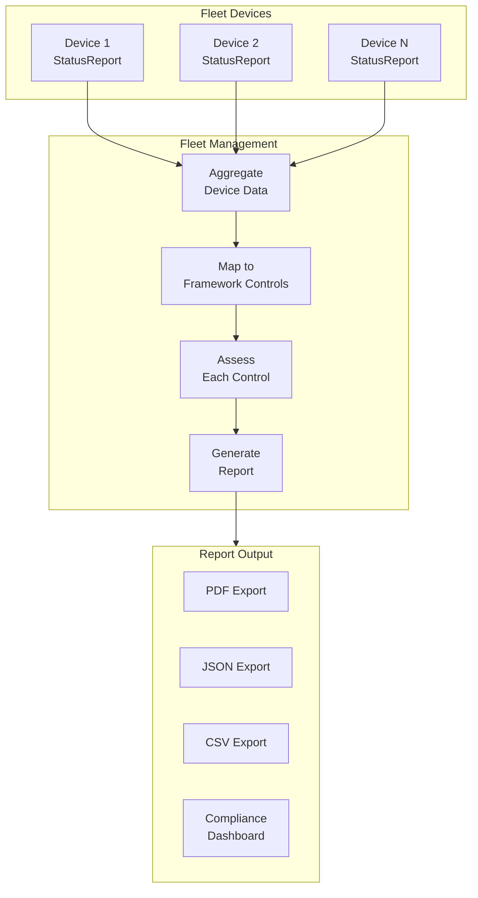

# AIOS Data Protection & Compliance

Part of: [multi-device.md](../multi-device.md) — Multi-Device & Enterprise Architecture
**Related:** [policy.md](./policy.md) — Policy Engine, [enterprise-identity.md](./enterprise-identity.md) — Enterprise Identity, [intelligence.md](./intelligence.md) — AI-Native Intelligence

---

## §9 Data Loss Prevention

### §9.1 Content Classification

AI-driven content classification assigns sensitivity labels to all objects in organizational spaces. Classification is stored as Space object metadata and used by the DLP enforcement engine to make access decisions.

**Sensitivity levels:**

- **Public** — no restrictions on sharing or transfer.
- **Internal** — shareable within the organization, blocked from external transfer.
- **Confidential** — restricted to specific groups, watermarked on export.
- **Restricted** — highest sensitivity. No export, no clipboard, no screenshot.

```rust
/// Sensitivity levels for DLP content classification.
/// Ordered from least to most restrictive.
#[derive(Debug, Clone, Copy, PartialEq, Eq, PartialOrd, Ord)]
#[repr(u8)]
pub enum SensitivityLevel {
    Public       = 0,
    Internal     = 1,
    Confidential = 2,
    Restricted   = 3,
}

/// Semantic labels describing why content is sensitive.
#[derive(Debug, Clone, Copy, PartialEq, Eq)]
#[repr(u8)]
pub enum ClassificationLabel {
    /// Personally identifiable information (names, addresses, SSNs).
    Pii,
    /// Financial data (account numbers, transactions, revenue).
    Financial,
    /// Source code or intellectual property.
    SourceCode,
    /// API keys, passwords, certificates, secrets.
    Credentials,
    /// Health records (HIPAA-relevant).
    HealthRecord,
    /// Legal or contractual documents.
    Legal,
    /// Board-level or executive communications.
    Executive,
}

/// Result of content classification.
pub struct ClassificationResult {
    /// Assigned sensitivity level.
    pub sensitivity: SensitivityLevel,
    /// Classifier confidence score (0.0 = no confidence, 1.0 = certain).
    pub confidence: f64,
    /// Semantic labels explaining the classification rationale.
    pub labels: [Option<ClassificationLabel>; MAX_LABELS],
    /// Number of active labels.
    pub label_count: u8,
    /// Version of the classifier model or ruleset that produced this result.
    pub classifier_version: u32,
}

/// Maximum semantic labels per classification result.
pub const MAX_LABELS: usize = 8;
```

The `ContentClassifier` trait provides a pluggable interface for classification backends:

```rust
/// Pluggable content classification engine.
pub trait ContentClassifier: Send + Sync {
    /// Classify content and return a sensitivity label.
    ///
    /// `content` is the raw bytes of the object.
    /// `content_type` identifies the format (text, image, code, etc.).
    /// `metadata` carries Space object metadata (name, tags, provenance).
    fn classify(
        &self,
        content: &[u8],
        content_type: ContentType,
        metadata: &ObjectMetadata,
    ) -> ClassificationResult;
}
```

**Classification backends:**

1. **Rule-based.** Pattern matching for known sensitive patterns: credit card numbers (Luhn-validated), social security numbers, API keys, email addresses, private key headers. Fast, deterministic, low false-positive rate for structured data. Runs entirely on-device with no external dependencies.

2. **ML-based.** Trained classifier for unstructured content: documents, images, code comments containing secrets. Runs as an AIRS plugin (see [intelligence.md](./intelligence.md) §14.4). Handles edge cases that rule-based classification misses: API keys embedded in code comments, screenshots of confidential spreadsheets, natural-language descriptions of trade secrets.

3. **Manual override.** Users or administrators can manually set or override classification. Manual overrides carry higher priority than automated classification. All overrides are logged in the audit trail with the identity of the overriding actor and a required justification string.

**Classification triggers:**

- **At creation.** When an object is created or imported into an organizational space.
- **On modification.** Reclassified when content changes materially (content hash differs from previous version).
- **Periodic batch.** Reclassification sweep when the classifier is updated (new rules or retrained model). The sweep runs as a background task, prioritizing recently-accessed objects.

Cross-references: [data-structures.md](../../storage/spaces/data-structures.md) §3 (Space objects, metadata)

### §9.2 DLP Policy Enforcement

DLP enforcement intercepts data transfers at multiple points to prevent sensitive data from leaving controlled boundaries. Each enforcement point evaluates the content's classification against the active DLP policy (received from the policy engine; see [policy.md](./policy.md) §7.1) and applies the appropriate action.

```rust
/// Locations where DLP enforcement intercepts data transfers.
#[derive(Debug, Clone, Copy, PartialEq, Eq)]
#[repr(u8)]
pub enum DlpEnforcementPoint {
    /// Flow transfers between agents or devices.
    Flow           = 0,
    /// System clipboard (copy/paste).
    Clipboard      = 1,
    /// File export to external storage (USB, network share).
    FileExport     = 2,
    /// Network egress (outbound connections).
    NetworkEgress  = 3,
    /// Screenshot and screen recording.
    ScreenCapture  = 4,
    /// Print operations.
    Print          = 5,
    /// Agent-to-agent IPC within the device.
    LocalIpc       = 6,
}

/// Action taken by the DLP engine at an enforcement point.
#[derive(Debug, Clone, PartialEq, Eq)]
pub enum DlpAction {
    /// Allow the transfer with no restrictions.
    Allow,
    /// Block the transfer silently (no user notification).
    Block,
    /// Block and display a reason string to the user.
    BlockWithReason { reason: [u8; 128], reason_len: u16 },
    /// Allow but display a warning to the user.
    WarnAndAllow,
    /// Allow but add invisible provenance watermarks to the exported content.
    Watermark,
    /// Allow but log the transfer as a security event (no user-visible effect).
    AuditOnly,
    /// Require explicit user confirmation before allowing the transfer.
    RequireConfirmation,
}
```

**Enforcement logic.** For each enforcement point, the DLP engine performs the following sequence:

1. **Identify.** Determine the content being transferred (object ID, content bytes, or display region).
2. **Classify.** Look up the content's classification from object metadata. If no cached classification exists, run real-time classification.
3. **Evaluate.** Match the classification against active DLP policies from the policy engine.
4. **Enforce.** Apply the resulting `DlpAction`.
5. **Audit.** Log the enforcement decision (content ID, classification, action, enforcement point, actor, timestamp) to the audit trail.

```mermaid
flowchart LR
    subgraph sources["Data Sources"]
        S1[Org Space<br/>Objects]
        S2[Clipboard<br/>Content]
        S3[Screen<br/>Content]
    end

    subgraph dlp["DLP Engine"]
        CL[Classify<br/>Content]
        EV[Evaluate<br/>Policy]
        EN[Enforce<br/>Action]
    end

    subgraph points["Enforcement Points"]
        P1[Flow Transfer]
        P2[Clipboard Paste]
        P3[File Export]
        P4[Network Egress]
        P5[Screen Capture]
        P6[Print]
    end

    subgraph actions["Outcomes"]
        A1[Allow]
        A2[Block]
        A3[Watermark]
        A4[Audit Log]
    end

    sources --> CL --> EV --> EN --> points --> actions
```



**Capability integration.** DLP enforcement operates at the kernel capability level, not just at application boundaries. When content is classified as Confidential or Restricted, the system attenuates the capability token for that object — removing export, clipboard, and screenshot permissions while preserving read access. This means even a compromised application cannot exfiltrate Restricted content, because the capability token it holds lacks the required permissions. See [capabilities.md](../../security/model/capabilities.md) §3 for attenuation mechanics.

**Interaction with Flow content screening.** The DLP enforcement point for Flow transfers extends the existing Flow content screening system (see [flow/security.md](../../storage/flow/security.md) §11). Flow screening handles per-channel rate limiting and format validation; DLP adds classification-aware blocking and watermarking on top.

### §9.3 Data Lineage & Provenance

Every classified object carries a complete provenance chain tracking its origin, transformations, and access history. This extends the existing provenance system (see [data-structures.md](../../storage/spaces/data-structures.md) §3.4) with organization-scoped tracking.

```rust
/// Unique identifier for a provenance entry.
pub type ProvenanceId = [u8; 16];

/// Identifier for an agent or user that performed an action.
pub type ActorId = [u8; 32];

/// Identifier for an agent.
pub type AgentId = [u8; 32];

/// DLP-extended provenance entry for organization-scoped lineage tracking.
pub struct DlpProvenanceEntry {
    /// Unique identifier for this provenance entry.
    pub entry_id: ProvenanceId,
    /// The object this entry describes.
    pub object_id: ObjectId,
    /// When the action occurred.
    pub timestamp: Timestamp,
    /// Device where the action occurred.
    pub device_id: [u8; 32],
    /// Agent or user that performed the action.
    pub actor: ActorId,
    /// What happened.
    pub action: DlpProvenanceAction,
    /// Classification of the object at the time of the action.
    pub classification_at_time: SensitivityLevel,
    /// Action-specific detail payload.
    pub details: [u8; 128],
    /// Ed25519 signature by the device key over all preceding fields.
    pub device_signature: [u8; 64],
}

/// Actions tracked in the DLP provenance chain.
#[derive(Debug, Clone, PartialEq, Eq)]
pub enum DlpProvenanceAction {
    /// Object was created.
    Created,
    /// Object content was modified.
    Modified,
    /// Object was classified for the first time.
    Classified { level: SensitivityLevel },
    /// Object classification was changed.
    Reclassified {
        from: SensitivityLevel,
        to: SensitivityLevel,
    },
    /// Object was accessed (read).
    Accessed { purpose: AccessPurpose },
    /// Object was exported or an export was attempted.
    Exported {
        destination: ExportDestination,
        dlp_action: DlpAction,
    },
    /// Object was shared with another agent on the same device.
    SharedWith { target_agent: AgentId },
    /// Object was synced to another device via Space Sync.
    SyncedTo { target_device: [u8; 32] },
    /// Object was watermarked for export tracking.
    Watermarked,
    /// Object was deleted.
    Deleted,
}

/// Why the object was accessed.
#[derive(Debug, Clone, Copy, PartialEq, Eq)]
#[repr(u8)]
pub enum AccessPurpose {
    UserView     = 0,
    AgentProcess = 1,
    Search       = 2,
    Backup       = 3,
    Audit        = 4,
}

/// Where an exported object was sent.
#[derive(Debug, Clone, Copy, PartialEq, Eq)]
#[repr(u8)]
pub enum ExportDestination {
    UsbStorage   = 0,
    NetworkShare = 1,
    Email        = 2,
    Clipboard    = 3,
    Print        = 4,
    Screenshot   = 5,
    FlowTransfer = 6,
}
```

Provenance entries are **immutable** and **signed** by the device key. They are stored alongside the object in its Space and synced with the object across devices via Space Sync. Organization-scoped provenance entries are also forwarded to the fleet management service for centralized lineage tracking and compliance reporting.

**Lineage queries.** The provenance chain supports forward and backward lineage queries:

- **Backward lineage.** Given an object, trace its full history: who created it, every modification, every device it touched, every export attempt.
- **Forward lineage.** Given an object, find all derivatives: copies, exports, shares, synced replicas. Enables answering "where did this confidential document end up?"

Cross-references: [data-structures.md](../../storage/spaces/data-structures.md) §3.4 (Relations, provenance)

### §9.4 Encryption Zones for Organizations

Organization-controlled encryption zones ensure that corporate data is encrypted with keys the organization manages, while personal data uses keys only the user holds. This extends the per-space encryption system (see [encryption.md](../../storage/spaces/encryption.md) §6) with organization key management.

**Key management model:**

- **Personal spaces.** Encryption keys derived from user passphrase. Only the user holds the key. The MDM agent cannot decrypt personal space data. This boundary is enforced at the capability level: the MDM agent's capability tokens do not include access to personal spaces.

- **Organizational spaces.** Encryption keys managed by the organization. The organization's key management service (KMS) generates space keys and distributes them to authorized devices during enrollment. This enables organization-controlled remote wipe: destroying the key renders the data unrecoverable.

- **Key escrow (optional).** Organizations can optionally escrow encryption keys for corporate spaces. This enables data recovery if a device is lost and the employee is unavailable. Key escrow is policy-controlled (see [policy.md](./policy.md) §7.1) and visible to the user through Inspector (see [inspector.md](../../applications/inspector.md)).

```rust
/// Encryption configuration for an organization's spaces.
pub struct OrgEncryptionConfig {
    /// Organization this configuration applies to.
    pub org_id: OrgId,
    /// How encryption keys are sourced for org spaces.
    pub key_source: OrgKeySource,
    /// Whether keys are escrowed for recovery.
    pub key_escrow: KeyEscrowPolicy,
    /// Cipher suite for org spaces (default: AES-256-GCM).
    pub cipher: CipherSuite,
    /// Key rotation interval in seconds (default: 90 days = 7_776_000).
    pub rotation_interval_secs: u64,
    /// What happens to keys on emergency wipe.
    pub destruction_policy: KeyDestructionPolicy,
}

/// How organization encryption keys are sourced.
pub enum OrgKeySource {
    /// Organization KMS generates and distributes keys during enrollment.
    /// The device receives wrapped keys over a TLS-protected channel.
    CentralKms {
        /// KMS endpoint URL (HTTPS).
        kms_endpoint: [u8; 256],
        kms_endpoint_len: u16,
    },
    /// Keys derived from organization root secret combined with space ID.
    /// Root secret is distributed during enrollment and stored in the
    /// device's secure key storage (ARM TrustZone or platform keychain).
    DerivedFromRoot {
        /// Reference to the root key in device secure storage.
        root_key_ref: [u8; 32],
    },
}

/// Key escrow policy for organization spaces.
pub enum KeyEscrowPolicy {
    /// No escrow. If the device is lost and unrecoverable, org data is gone.
    /// Suitable for organizations that prioritize data destruction over recovery.
    NoEscrow,
    /// Keys escrowed to the organization KMS.
    /// KMS can recover data from a lost device if authorized by policy.
    OrgEscrow {
        /// KMS endpoint for key recovery requests.
        kms_endpoint: [u8; 256],
        kms_endpoint_len: u16,
    },
    /// Keys split between organization KMS and user recovery key using
    /// Shamir's Secret Sharing. Requires threshold-of-N shares to reconstruct.
    SplitEscrow {
        /// Number of shares held by the organization.
        org_shares: u8,
        /// Number of shares held by the user.
        user_shares: u8,
        /// Minimum shares required for reconstruction.
        threshold: u8,
    },
}

/// Cipher suites supported for organization encryption zones.
#[derive(Debug, Clone, Copy, PartialEq, Eq)]
#[repr(u8)]
pub enum CipherSuite {
    /// AES-256-GCM (default, hardware-accelerated on ARMv8-CE).
    Aes256Gcm   = 0,
    /// ChaCha20-Poly1305 (software-friendly alternative).
    ChaCha20    = 1,
    /// XChaCha20-Poly1305 (extended nonce variant).
    XChaCha20   = 2,
}

/// What happens to encryption keys during emergency wipe.
#[derive(Debug, Clone, Copy, PartialEq, Eq)]
#[repr(u8)]
pub enum KeyDestructionPolicy {
    /// Crypto-erase: destroy key material, rendering ciphertext unrecoverable.
    /// Fast (milliseconds). Does not overwrite data blocks.
    CryptoErase   = 0,
    /// Full wipe: destroy keys AND overwrite data blocks with random data.
    /// Slow (minutes to hours depending on storage size).
    FullWipe      = 1,
    /// Secure erase: issue ATA/NVMe secure erase command to storage hardware,
    /// then destroy key material.
    SecureErase   = 2,
}
```

**Key rotation.** Organization keys are rotated on the schedule defined in `OrgEncryptionConfig.rotation_interval_secs`. During rotation, the system re-encrypts space data under the new key in the background. Old keys are retained (in a key history table) until all data encrypted under them has been re-encrypted. The re-encryption process is idempotent and resumable after interruption.

Cross-references: [encryption.md](../../storage/spaces/encryption.md) §6 (encryption zones, key management)

---

## §10 Compliance & Audit

### §10.1 SIEM Export

Security event stream from AIOS devices to organizational Security Information and Event Management (SIEM) systems. This extends the kernel audit subsystem (see [operations.md](../../security/model/operations.md) §6-7) with structured export to external monitoring infrastructure.

**What is exported:**

- **Security events.** Authentication attempts, policy violations, DLP enforcement actions.
- **Policy events.** Policy applied, drift detected, remediation actions taken.
- **Device events.** Enrollment, unenrollment, attestation results.
- **Agent events.** Installation, update, crash, suspicious behavior flags.
- **Access events.** Space access, capability grant/revoke, privilege escalation attempts.

**What is NOT exported (BYOD privacy boundary):**

- Personal space activity.
- Personal Flow history.
- Personal agent interactions.
- Content of classified documents (only metadata: object_id, classification level, action taken).

```rust
/// Configuration for exporting security events to a SIEM system.
pub struct SiemExportConfig {
    /// Whether SIEM export is enabled.
    pub enabled: bool,
    /// Transport protocol for event delivery.
    pub transport: SiemTransport,
    /// Event serialization format.
    pub format: SiemFormat,
    /// Which event categories to export.
    pub event_filter: EventFilter,
    /// Number of events per batch (default: 100).
    pub batch_size: u16,
    /// Maximum seconds between batch flushes (default: 60).
    pub flush_interval_secs: u32,
    /// TLS configuration for the transport connection.
    pub tls_required: bool,
    /// CA certificate fingerprint for TLS verification.
    pub ca_fingerprint: [u8; 32],
}

/// Transport protocols for SIEM event delivery.
pub enum SiemTransport {
    /// RFC 5424 Syslog over TCP or UDP.
    Syslog {
        endpoint: [u8; 64],
        endpoint_len: u16,
        protocol: SyslogProtocol,
    },
    /// HTTPS POST with bearer token or mTLS authentication.
    Https {
        endpoint: [u8; 256],
        endpoint_len: u16,
        auth: HttpAuth,
    },
    /// Apache Kafka (for high-volume fleet deployments).
    Kafka {
        brokers: [[u8; 64]; MAX_KAFKA_BROKERS],
        broker_count: u8,
        topic: [u8; 64],
        topic_len: u8,
    },
}

/// Maximum Kafka brokers in a SIEM transport configuration.
pub const MAX_KAFKA_BROKERS: usize = 4;

/// Syslog transport protocol.
#[derive(Debug, Clone, Copy, PartialEq, Eq)]
#[repr(u8)]
pub enum SyslogProtocol {
    Tcp = 0,
    Udp = 1,
    Tls = 2,
}

/// HTTP authentication methods for SIEM endpoints.
pub enum HttpAuth {
    /// Bearer token authentication.
    BearerToken { token: [u8; 128], token_len: u16 },
    /// Mutual TLS (client certificate).
    MutualTls { client_cert_ref: [u8; 32] },
}

/// Serialization formats for SIEM events.
#[derive(Debug, Clone, Copy, PartialEq, Eq)]
#[repr(u8)]
pub enum SiemFormat {
    /// Common Event Format (ArcSight, many SIEMs).
    Cef  = 0,
    /// Log Event Extended Format (QRadar).
    Leef = 1,
    /// Structured JSON (Splunk, Elastic, custom).
    Json = 2,
    /// Elastic Common Schema.
    Ecs  = 3,
}

/// Filter controlling which event categories are exported.
pub struct EventFilter {
    /// Export security events (auth, DLP, policy violations).
    pub security: bool,
    /// Export policy lifecycle events (applied, drift, remediation).
    pub policy: bool,
    /// Export device lifecycle events (enroll, unenroll, attest).
    pub device: bool,
    /// Export agent lifecycle events (install, update, crash).
    pub agent: bool,
    /// Export access events (space access, cap grant/revoke).
    pub access: bool,
    /// Minimum severity level for export (events below this are dropped).
    pub min_severity: EventSeverity,
}

/// Event severity levels for filtering.
#[derive(Debug, Clone, Copy, PartialEq, Eq, PartialOrd, Ord)]
#[repr(u8)]
pub enum EventSeverity {
    Debug    = 0,
    Info     = 1,
    Warning  = 2,
    Error    = 3,
    Critical = 4,
}
```

**Buffering and delivery guarantees.** Events are buffered on-device in a persistent ring buffer (capacity: 24 hours of events at typical volume). If the SIEM endpoint is unreachable, events accumulate locally and batch-send when connectivity is restored. Events are signed by the device key for non-repudiation. The buffer is stored in the system space and survives device reboots.

**Event deduplication.** Each event carries a unique event ID (device_id + monotonic counter). The SIEM transport layer tracks the last acknowledged event ID per endpoint, enabling exactly-once delivery through idempotent retransmission.

Cross-references: [operations.md](../../security/model/operations.md) §6 (security events), §7 (audit)

### §10.2 Compliance Framework Mapping

AIOS maps its built-in security controls to established compliance frameworks, enabling organizations to demonstrate compliance through the OS's native capabilities rather than bolted-on compliance agents.

```rust
/// A mapping between a compliance framework control and its AIOS implementation.
pub struct ComplianceControl {
    /// Control identifier within the framework (e.g., "CC6.1", "A.9.1.1").
    pub control_id: [u8; 16],
    pub control_id_len: u8,
    /// Which compliance framework this control belongs to.
    pub framework: ComplianceFramework,
    /// Human-readable description of the control requirement.
    pub description: [u8; 256],
    pub description_len: u16,
    /// Which AIOS subsystem implements this control.
    pub implementation: AiosControlImpl,
    /// Whether compliance with this control can be automatically verified.
    pub automated: bool,
}

/// Supported compliance frameworks.
#[derive(Debug, Clone, Copy, PartialEq, Eq)]
#[repr(u8)]
pub enum ComplianceFramework {
    /// SOC 2 Type II (Trust Service Criteria).
    Soc2       = 0,
    /// ISO/IEC 27001 (Information Security Management).
    Iso27001   = 1,
    /// NIST SP 800-53 (Security and Privacy Controls).
    Nist800_53 = 2,
    /// GDPR Article 32 (Security of Processing).
    GdprArt32  = 3,
    /// HIPAA Security Rule (§164.312).
    Hipaa      = 4,
    /// PCI DSS v4.0 (Payment Card Industry).
    PciDss     = 5,
    /// FedRAMP (Federal Risk and Authorization Management).
    Fedramp    = 6,
}

/// How AIOS implements a specific compliance control.
#[derive(Debug, Clone, Copy, PartialEq, Eq)]
#[repr(u8)]
pub enum AiosControlImpl {
    /// Enforced through the kernel capability system.
    CapabilitySystem    = 0,
    /// Enforced through encryption zone configuration.
    EncryptionZone      = 1,
    /// Evidenced through audit trail records.
    AuditTrail          = 2,
    /// Enforced through declarative policy engine.
    PolicyEngine        = 3,
    /// Verified through hardware attestation.
    Attestation         = 4,
    /// Enforced through DLP content classification and enforcement.
    DlpEnforcement      = 5,
    /// Enforced through capability-gated access control.
    AccessControl       = 6,
    /// Enforced through secure boot chain verification.
    SecureBoot          = 7,
}
```

**Example control mappings:**

| Framework | Control | Requirement | AIOS Implementation |
|---|---|---|---|
| SOC 2 CC6.1 | Logical access security | Restrict system access to authorized users | Capability system + conditional access policies |
| ISO 27001 A.8.2 | Information classification | Classify information by sensitivity | Content classification engine (§9.1) |
| NIST 800-53 AC-3 | Access enforcement | Enforce approved authorizations | Capability-gated resource access |
| GDPR Art. 32 | Security of processing | Ensure appropriate security measures | Encryption zones (§9.4) + DLP enforcement (§9.2) |
| HIPAA §164.312(a) | Access control | Allow access only to authorized persons | Capability tokens + audit trail |
| PCI DSS 3.4 | Render PAN unreadable | Protect stored payment card data | Encryption zones with AES-256-GCM |
| FedRAMP AC-2 | Account management | Manage information system accounts | Enterprise identity (§8) + SCIM provisioning |

The compliance mapping is declarative: organizations select which frameworks apply, and AIOS surfaces the relevant controls in the compliance dashboard (see [fleet.md](./fleet.md) §6.5) with their current assessment status.

### §10.3 Compliance Reporting

Automated compliance reports generated on schedule or on-demand for auditors and regulators. Reports aggregate data from device StatusReports, audit trails, and policy compliance states across the fleet.

```rust
/// A compliance assessment report covering a fleet or subset of devices.
pub struct ComplianceReport {
    /// Unique report identifier.
    pub report_id: [u8; 16],
    /// Framework this report assesses against.
    pub framework: ComplianceFramework,
    /// When the report was generated.
    pub generated_at: Timestamp,
    /// Reporting period (start and end timestamps).
    pub period_start: Timestamp,
    pub period_end: Timestamp,
    /// Scope of the report.
    pub scope: ReportScope,
    /// Per-control assessments.
    pub controls: [ControlAssessment; MAX_CONTROLS_PER_REPORT],
    pub control_count: u16,
    /// Overall compliance score (0.0 = fully non-compliant, 1.0 = fully compliant).
    pub overall_score: f64,
    /// Findings requiring attention.
    pub findings: [ComplianceFinding; MAX_FINDINGS_PER_REPORT],
    pub finding_count: u16,
    /// Signature by the fleet management service key.
    pub service_signature: [u8; 64],
}

/// Maximum controls and findings per compliance report.
pub const MAX_CONTROLS_PER_REPORT: usize = 128;
pub const MAX_FINDINGS_PER_REPORT: usize = 64;

/// Scope of a compliance report.
#[derive(Debug, Clone, Copy, PartialEq, Eq)]
#[repr(u8)]
pub enum ReportScope {
    /// Entire fleet.
    Fleet      = 0,
    /// Specific device group.
    Group      = 1,
    /// Single device.
    Device     = 2,
}

/// Assessment of a single compliance control.
pub struct ControlAssessment {
    /// The control being assessed.
    pub control_id: [u8; 16],
    pub control_id_len: u8,
    /// Assessment status.
    pub status: ControlStatus,
    /// Number of evidence records supporting this assessment.
    pub evidence_count: u32,
    /// When this control was last verified.
    pub last_verified: Timestamp,
}

/// Status of a compliance control assessment.
#[derive(Debug, Clone, Copy, PartialEq, Eq)]
#[repr(u8)]
pub enum ControlStatus {
    /// Control is fully implemented and verified.
    Met            = 0,
    /// Control is partially implemented; gaps identified.
    PartiallyMet   = 1,
    /// Control is not implemented.
    NotMet         = 2,
    /// Control does not apply to this scope.
    NotApplicable  = 3,
}

/// A finding from a compliance assessment requiring attention.
pub struct ComplianceFinding {
    /// Severity of the finding.
    pub severity: FindingSeverity,
    /// Which control this finding relates to.
    pub control_id: [u8; 16],
    pub control_id_len: u8,
    /// Description of the finding.
    pub description: [u8; 256],
    pub description_len: u16,
    /// Number of devices affected by this finding.
    pub affected_devices: u32,
    /// Recommended remediation action.
    pub remediation: [u8; 256],
    pub remediation_len: u16,
}

/// Severity of a compliance finding.
#[derive(Debug, Clone, Copy, PartialEq, Eq, PartialOrd, Ord)]
#[repr(u8)]
pub enum FindingSeverity {
    Info     = 0,
    Low      = 1,
    Medium   = 2,
    High     = 3,
    Critical = 4,
}
```

**Report generation flow:**



Reports are generated by the fleet management service by aggregating device StatusReports (see [fleet.md](./fleet.md) §6.2), audit trails, and policy compliance data. Reports are signed by the fleet management service key and exportable as PDF, JSON, or CSV for external auditors.

**Scheduled reports.** Organizations configure a reporting schedule (e.g., monthly SOC 2, quarterly ISO 27001). Reports are generated automatically and stored in the fleet management space with provenance tracking.

### §10.4 Regulatory Data Residency

Data residency enforcement ensures that sensitive data stays within required geographic jurisdictions. This is implemented through geo-fenced synchronization in Space Sync, not through application-level restrictions.

**Data residency enforcement model:**

- Spaces can be tagged with a `data_residency` field specifying allowed regions.
- Space Sync checks the target device's registered region before syncing. If the device is outside the allowed regions, sync is blocked for that space.
- The region check uses the device's registered location from fleet management (see [fleet.md](./fleet.md) §6.1), not real-time GPS. This preserves user privacy while enabling jurisdictional compliance.
- Region changes (e.g., a laptop traveling internationally) are detected on the next fleet check-in. Policy determines what happens to data already on the device.

```rust
/// Geographic region identifiers for data residency enforcement.
#[derive(Debug, Clone, Copy, PartialEq, Eq)]
#[repr(u8)]
pub enum Region {
    /// European Union (GDPR jurisdiction).
    Eu       = 0,
    /// United States.
    Us       = 1,
    /// Asia-Pacific.
    Apac     = 2,
    /// United Kingdom (post-Brexit UK GDPR).
    Uk       = 3,
    /// Canada (PIPEDA).
    Ca       = 4,
    /// Australia (Privacy Act 1988).
    Au       = 5,
    /// Japan (APPI).
    Jp       = 6,
    /// Brazil (LGPD).
    Br       = 7,
    /// India (DPDP Act).
    In       = 8,
    /// Custom region defined by the organization.
    Custom   = 255,
}

/// Data residency configuration for a space.
pub struct DataResidencyConfig {
    /// Space this configuration applies to.
    pub space_id: SpaceId,
    /// Regions where this space's data may reside.
    pub allowed_regions: [Option<Region>; MAX_REGIONS],
    /// Number of active region entries.
    pub region_count: u8,
    /// How residency is enforced.
    pub enforcement: ResidencyEnforcement,
    /// What happens when a device is detected outside allowed regions.
    pub violation_action: ResidencyViolationAction,
}

/// Maximum regions in a data residency configuration.
pub const MAX_REGIONS: usize = 8;

/// How data residency is enforced during sync.
#[derive(Debug, Clone, Copy, PartialEq, Eq)]
#[repr(u8)]
pub enum ResidencyEnforcement {
    /// Block sync to devices outside allowed regions.
    /// Space data never leaves the jurisdiction.
    BlockSync       = 0,
    /// Allow sync but encrypt with a region-specific key.
    /// Data can transit outside the region but is unreadable without
    /// a key that only exists within the jurisdiction.
    EncryptForRegion = 1,
    /// Allow sync but log as a compliance event.
    /// No enforcement, audit trail only (for monitoring before enforcement).
    AuditOnly       = 2,
}

/// Action taken when a device is detected outside allowed regions.
#[derive(Debug, Clone, Copy, PartialEq, Eq)]
#[repr(u8)]
pub enum ResidencyViolationAction {
    /// Block further sync and notify the organization administrator.
    BlockAndNotify   = 0,
    /// Crypto-erase the space data on the out-of-region device.
    /// Uses the same mechanism as remote wipe (see mdm.md §5.4).
    CryptoErase      = 1,
    /// Suspend the device's enrollment until the violation is resolved.
    SuspendEnrollment = 2,
    /// Convert the space to read-only on the out-of-region device.
    /// Prevents new data creation but preserves existing access.
    ReadOnly         = 3,
}
```

**Residency verification during sync.** When Space Sync initiates a Merkle exchange (see [sync.md](../../storage/spaces/sync.md) §8), the source device checks the target device's registered region against the space's `DataResidencyConfig`. If the target is outside allowed regions and enforcement is `BlockSync`, the sync request is rejected with a `ResidencyViolation` error. The rejection is logged as a compliance event in the audit trail and exported to SIEM if configured (see §10.1).

Cross-references: [policy.md](./policy.md) §7.3 (geo-fencing), [sync.md](../../storage/spaces/sync.md) §8 (Merkle exchange), [fleet.md](./fleet.md) §6.1 (device inventory with region)
