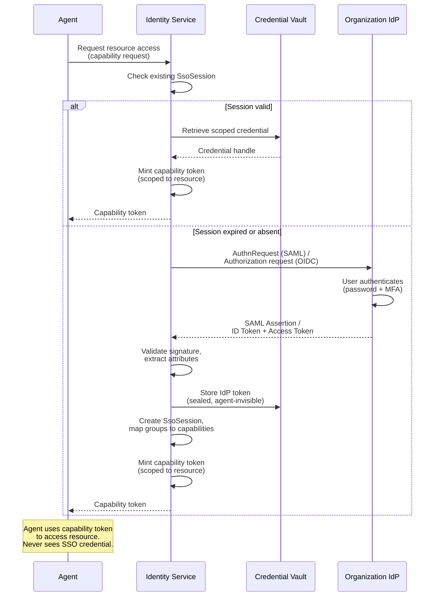
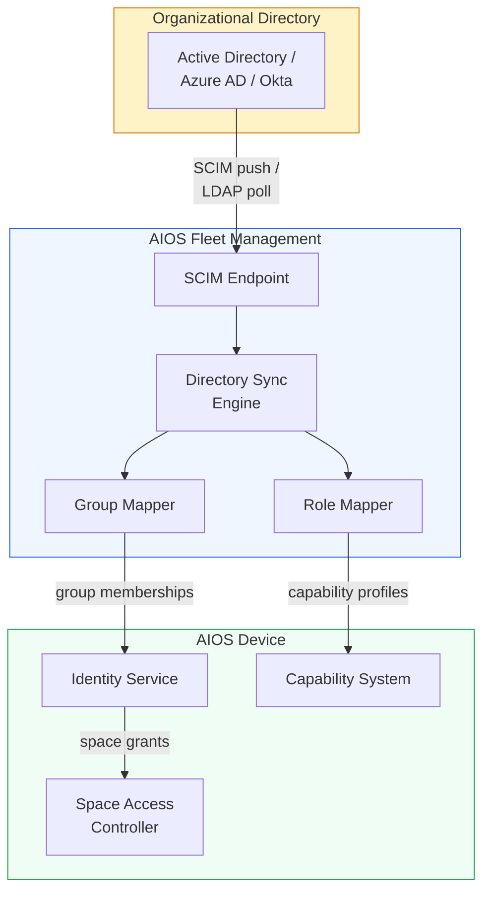
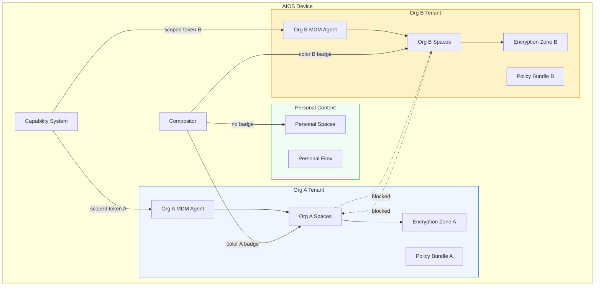

# AIOS Enterprise Identity Integration

Part of: [multi-device.md](../multi-device.md) — Multi-Device & Enterprise Architecture
**Related:** [mdm.md](./mdm.md) — Mobile Device Management, [policy.md](./policy.md) — Policy Engine, [data-protection.md](./data-protection.md) — Data Protection

---

## §8.1 SSO/SAML Integration

AIOS integrates with organizational Identity Providers (IdPs) via SAML 2.0 and OpenID Connect (OIDC) for single sign-on. The Identity Service mediates all SSO interactions — agents never directly interact with the IdP. This design preserves the capability-gated security model: the agent receives a scoped capability token for the specific resource it needs, while the underlying SSO credential remains sealed inside the Credential Vault.

### Architecture

The AIOS Identity Service acts as a SAML Service Provider (SP) or OIDC Relying Party, depending on the organization's IdP configuration. Authentication tokens returned by the IdP are stored in the Credential Vault (see [identity.md](../../experience/identity.md) §11 for credential isolation). When an agent requests access to a corporate resource, the Identity Service attaches the appropriate credential transparently. The agent never sees the SSO token, cookie, or session credential — it only receives a capability token scoped to the specific resource.

This separation enforces two properties:

1. **Credential isolation** — A compromised agent cannot exfiltrate SSO tokens because it never possesses them. The Credential Vault is a kernel-managed store accessible only to the Identity Service.
2. **Least privilege** — Each capability token is scoped to one resource or resource class. An agent granted access to the corporate email API cannot use that token to access the corporate HR system.

### SsoConfiguration

```rust
/// Maximum length of an SP entity ID string.
const MAX_ENTITY_ID_LEN: usize = 256;

/// Maximum number of IdP-to-AIOS attribute mappings.
const MAX_ATTRIBUTE_MAPPINGS: usize = 32;

/// SSO protocol variant.
#[derive(Debug, Clone, Copy, PartialEq, Eq)]
pub enum SsoProvider {
    /// SAML 2.0 Service Provider.
    Saml2,
    /// OpenID Connect Relying Party.
    Oidc,
    /// Device supports both protocols; IdP metadata determines which is used.
    Both,
}

/// Mapping from an IdP assertion attribute to an AIOS identity field.
#[derive(Debug, Clone)]
pub struct AttributeMapping {
    /// Attribute name as emitted by the IdP (e.g., "memberOf", "department").
    pub idp_attribute: [u8; 64],
    /// Corresponding AIOS identity field to populate.
    pub aios_field: AiosIdentityField,
}

/// AIOS identity fields that can be populated from IdP attributes.
#[derive(Debug, Clone, Copy, PartialEq, Eq)]
pub enum AiosIdentityField {
    DisplayName,
    Email,
    OrgGroups,
    Department,
    Role,
    EmployeeId,
    TrustLevel,
}

/// SSO configuration for a single organizational IdP.
pub struct SsoConfiguration {
    /// Protocol variant (SAML 2.0, OIDC, or both).
    pub provider_type: SsoProvider,
    /// URL for SAML metadata document or OIDC discovery endpoint
    /// (e.g., "https://idp.example.com/.well-known/openid-configuration").
    pub idp_metadata_url: [u8; 512],
    /// AIOS Service Provider entity ID presented to the IdP.
    pub entity_id: [u8; MAX_ENTITY_ID_LEN],
    /// Local callback URL for SAML assertion consumer or OIDC redirect.
    pub assertion_consumer_url: [u8; 512],
    /// X.509 certificate used to sign SAML AuthnRequests.
    pub signing_cert: CertificateRef,
    /// X.509 certificate used to decrypt encrypted SAML assertions.
    pub encryption_cert: CertificateRef,
    /// Attribute mappings from IdP assertion claims to AIOS identity fields.
    pub attribute_mappings: [Option<AttributeMapping>; MAX_ATTRIBUTE_MAPPINGS],
    /// How long an SSO session remains valid before requiring re-authentication.
    pub session_lifetime: Duration,
    /// If set, forces full re-authentication after this interval regardless
    /// of session validity. Used for high-security environments.
    pub force_reauth_interval: Option<Duration>,
}
```

### SsoSession

```rust
/// An active SSO session on this device.
pub struct SsoSession {
    /// Unique identifier for this session (generated locally).
    pub session_id: SessionId,
    /// Reference to the AIOS identity this session authenticates.
    pub user_identity: AiosIdentityRef,
    /// Opaque reference to the IdP session token stored in the Credential
    /// Vault. The Identity Service uses this to refresh tokens or perform
    /// SLO (Single Logout). No other component can read this value.
    pub idp_session_ref: CredentialVaultHandle,
    /// Timestamp when IdP authentication completed.
    pub authenticated_at: Timestamp,
    /// Timestamp when this session expires (derived from session_lifetime
    /// and any IdP-imposed constraints).
    pub expires_at: Timestamp,
    /// Organizational groups granted by the IdP assertion (e.g., "Engineering",
    /// "Admins"). These map to space access and capability profiles.
    pub granted_groups: [Option<OrgGroupId>; 32],
    /// Whether the user completed multi-factor authentication during this
    /// session. Some policies require MFA for access to sensitive spaces.
    pub mfa_verified: bool,
    /// Whether this session is bound to the current device's hardware
    /// attestation. Device-bound sessions cannot be replayed on a different
    /// device even if the token is exfiltrated.
    pub device_bound: bool,
}
```

### SSO Authentication Flow



**Cross-references:** [identity.md](../../experience/identity.md) §11 (credential isolation), [identity.md](../../experience/identity.md) §12 (service identities)

---

## §8.2 SCIM Provisioning

Automatic user and device lifecycle management via SCIM 2.0 (System for Cross-domain Identity Management). When the organization creates, modifies, or removes users in their directory, changes propagate automatically to the AIOS fleet. This eliminates manual provisioning and ensures that access revocation takes effect within seconds of the directory change.

### Provisioning Flow

1. Organization admin creates a user in their directory (Azure AD, Okta, Google Workspace, or any SCIM-compliant source).
2. The directory pushes a SCIM `POST /Users` event to the AIOS Fleet Management Service.
3. Fleet Management creates an organizational identity for the user, including group memberships and role assignments derived from SCIM attributes.
4. When the user's device enrolls (see [mdm.md](./mdm.md) §5.3 for enrollment profiles), the organizational identity is linked to the device identity.
5. The user receives appropriate group memberships, space access, and policy assignments based on their SCIM attributes.

### Deprovisioning Flow

1. Organization admin removes the user from the directory (or sets `active: false`).
2. A SCIM `DELETE /Users/{id}` (or `PATCH` with `active: false`) event reaches Fleet Management.
3. All devices enrolled under this user receive a deprovisioning command via the AIOS Peer Protocol (see [networking/protocols.md](../networking/protocols.md) §5.1).
4. On each device, organization-scoped spaces are wiped via crypto-erasure — the encryption zone key is destroyed, rendering the data unrecoverable (see [encryption.md](../../storage/spaces/encryption.md) §6 for encryption zones).
5. MDM capabilities for this user's sessions are cascade-revoked (see [capabilities.md](../../security/model/capabilities.md) §3.5 for cascade revocation).
6. Personal data on BYOD devices is preserved. The MDM agent's capability scope is limited to organizational spaces; personal spaces are invisible to it.

### ScimEndpoint

```rust
/// Authentication method for the SCIM endpoint.
#[derive(Debug, Clone, Copy, PartialEq, Eq)]
pub enum ScimAuth {
    /// OAuth 2.0 bearer token (most common with cloud IdPs).
    BearerToken,
    /// OAuth 2.0 client credentials flow.
    OAuth2,
    /// Mutual TLS with client certificate authentication.
    MutualTls,
}

/// SCIM resource types supported by the AIOS endpoint.
#[derive(Debug, Clone, Copy, PartialEq, Eq)]
pub enum ScimResourceType {
    /// SCIM User resource (RFC 7643 Section 4.1).
    User,
    /// SCIM Group resource (RFC 7643 Section 4.2).
    Group,
    /// SCIM EnterpriseUser extension (RFC 7643 Section 4.3).
    EnterpriseUser,
    /// AIOS-specific Device resource (custom SCIM extension).
    Device,
}

/// Maximum number of supported SCIM resource types.
const MAX_SCIM_RESOURCES: usize = 8;

/// Configuration for the AIOS SCIM 2.0 endpoint.
pub struct ScimEndpoint {
    /// Base URL of the AIOS SCIM endpoint
    /// (e.g., "https://fleet.example.com/scim/v2").
    pub base_url: [u8; 512],
    /// Authentication method the IdP uses to call this endpoint.
    pub auth_method: ScimAuth,
    /// SCIM resource types this endpoint accepts.
    pub supported_resources: [Option<ScimResourceType>; MAX_SCIM_RESOURCES],
    /// Whether the endpoint supports SCIM bulk operations (RFC 7644 Section 3.7).
    /// Bulk operations allow the IdP to batch multiple provisioning changes
    /// in a single HTTP request.
    pub bulk_operations: bool,
    /// Whether the endpoint supports incremental sync via SCIM change log.
    /// When true, the IdP can poll for changes since a given point rather
    /// than performing full reconciliation.
    pub change_log: bool,
}
```

### SCIM-to-AIOS Attribute Mapping

```rust
/// How SCIM User attributes map to AIOS identity and access concepts.
///
/// Each row describes the SCIM source attribute, the AIOS target concept,
/// and the downstream effect on device configuration.
pub struct ScimUserMapping {
    /// SCIM `userName` -> AiosIdentity display name.
    /// Used as the human-readable identifier across all devices.
    pub user_name_target: AiosIdentityField,  // DisplayName

    /// SCIM `emails[type="work"].value` -> AiosIdentity contact info.
    /// Used for notification routing and inter-device discovery.
    pub email_target: AiosIdentityField,  // Email

    /// SCIM `groups` -> OrgGroupMembership.
    /// Each SCIM group maps to an AIOS organizational group which in turn
    /// controls SpaceAccess (which spaces the user can sync) and
    /// PolicyAssignment (which policy bundle applies).
    pub group_target: OrgGroupMappingStrategy,

    /// SCIM `active` -> enrollment state.
    /// `true` maps to Active; `false` triggers the deprovisioning flow.
    pub active_target: EnrollmentState,

    /// SCIM `roles` or enterprise extension `roles` -> CapabilityProfile.
    /// Each role string maps to a composable capability profile
    /// (see capabilities.md §3.7).
    pub role_target: CapabilityProfileMapping,
}

/// Strategy for mapping SCIM groups to AIOS organizational groups.
#[derive(Debug, Clone, Copy, PartialEq, Eq)]
pub enum OrgGroupMappingStrategy {
    /// Map SCIM group display names directly to AIOS group names.
    DirectNameMatch,
    /// Use a lookup table configured by the fleet administrator.
    ExplicitMapping,
    /// Combine direct matching with a prefix filter
    /// (e.g., only sync groups starting with "AIOS-").
    PrefixFiltered,
}
```

| SCIM Attribute | AIOS Concept | Downstream Effect |
|---|---|---|
| `userName` | `AiosIdentity.display_name` | Displayed on device, used in audit logs |
| `emails` | `AiosIdentity.contact_info` | Notification routing, device discovery |
| `groups` | `OrgGroupMembership` | `SpaceAccess` + `PolicyAssignment` |
| `active` | Enrollment state | `true` = active, `false` = deprovisioned |
| `roles` | `CapabilityProfile` assignment | Determines available agents and spaces |
| `externalId` | `AiosIdentity.org_employee_id` | Correlation with HR systems |
| `manager` | Trust relationship | Influences trust level derivation |

---

## §8.3 Directory Integration

Mapping organizational directory structure to AIOS's relationship graph and trust model. The directory serves as the authoritative source for organizational hierarchy, group membership, and role assignments. AIOS translates these into its native primitives: trust levels, space sharing groups, and capability profiles.

### Organizational Hierarchy to Trust Levels

The organizational hierarchy maps to AIOS trust levels (see [identity.md](../../experience/identity.md) §5 for relationships and §6 for the trust model):

| Directory Position | AIOS Trust Level | Capabilities |
|---|---|---|
| C-suite / IT administrators | Elevated | Fleet management, policy authoring, audit access |
| Department heads | GroupAdmin | Group-level policy control, space creation for team |
| Standard employees | Standard | Standard organizational capabilities, assigned spaces |
| Contractors | TimeLimited | Time-bounded capabilities, narrower space access |
| External partners | Minimal | Read-only access to shared spaces, no sync to personal devices |

### Distribution Groups to Space Sharing

Active Directory or LDAP distribution groups map directly to AIOS space sharing groups:

- An "Engineering" group grants access to `org/engineering/` spaces.
- A "Marketing" group grants access to `org/marketing/` spaces.
- Nested groups propagate access: `Engineering.Frontend` inherits all spaces accessible to `Engineering`, plus any spaces specific to `Frontend`.
- Security groups (as distinct from distribution groups) map to capability restrictions rather than space grants.

### Role-Based Access to Capability Profiles

Directory roles translate to AIOS capability profiles (see [capabilities.md](../../security/model/capabilities.md) §3.7 for composable profiles):

| Directory Role | Capability Profile | Grants |
|---|---|---|
| Developer | `profile:developer` | Code spaces, build agent, terminal, debugger |
| Designer | `profile:designer` | Design spaces, creative agents, media capture |
| Manager | `profile:manager` | Reporting spaces, team oversight, approval workflows |
| IT Admin | `profile:it-admin` | Fleet management, policy authoring, device health |
| Auditor | `profile:auditor` | Read-only audit log access, compliance reports |

### OrgDirectoryMapping

```rust
/// Supported organizational directory backends.
#[derive(Debug, Clone, Copy, PartialEq, Eq)]
pub enum DirectoryType {
    /// Microsoft Active Directory (LDAP-based).
    ActiveDirectory,
    /// Generic LDAPv3 directory.
    Ldap,
    /// Google Workspace (Cloud Identity).
    GoogleWorkspace,
    /// Microsoft Entra ID (formerly Azure AD).
    AzureAd,
    /// Okta Universal Directory.
    Okta,
}

/// Maximum number of group, role, or trust level mappings.
const MAX_DIRECTORY_MAPPINGS: usize = 64;

/// A single group-to-space mapping rule.
pub struct GroupSpaceMapping {
    /// Directory group distinguished name or identifier.
    pub directory_group: [u8; 128],
    /// AIOS organizational group this maps to.
    pub aios_group_id: OrgGroupId,
    /// Space access rules for members of this group.
    pub space_access: SpaceAccessRules,
}

/// A single role-to-capability-profile mapping rule.
pub struct RoleCapabilityMapping {
    /// Directory role name or identifier.
    pub directory_role: [u8; 64],
    /// AIOS capability profile to assign.
    pub capability_profile_id: CapabilityProfileId,
}

/// A single OU-to-trust-level mapping rule.
pub struct OuTrustMapping {
    /// Directory organizational unit (OU) distinguished name.
    pub directory_ou: [u8; 128],
    /// Trust level assigned to identities within this OU.
    pub trust_level: TrustLevel,
}

/// Configuration for syncing an organizational directory to AIOS.
pub struct OrgDirectoryMapping {
    /// Directory backend type.
    pub directory_type: DirectoryType,
    /// Interval between incremental sync operations. Full reconciliation
    /// occurs at 10x this interval.
    pub sync_interval: Duration,
    /// Group-to-space mappings (directory group -> AIOS group + space access).
    pub group_mappings: [Option<GroupSpaceMapping>; MAX_DIRECTORY_MAPPINGS],
    /// Role-to-capability-profile mappings.
    pub role_mappings: [Option<RoleCapabilityMapping>; MAX_DIRECTORY_MAPPINGS],
    /// OU-to-trust-level mappings.
    pub trust_level_mappings: [Option<OuTrustMapping>; MAX_DIRECTORY_MAPPINGS],
    /// Directory groups explicitly excluded from sync. Members of these
    /// groups are not provisioned to AIOS even if they appear in other
    /// synced groups.
    pub excluded_groups: [Option<[u8; 128]>; 16],
}
```

### Directory Sync Architecture



**Cross-references:** [identity.md](../../experience/identity.md) §5 (relationships), [identity.md](../../experience/identity.md) §6 (trust model), [capabilities.md](../../security/model/capabilities.md) §3.7 (composable capability profiles)

---

## §8.4 Multi-Tenant Support

A single AIOS device can be enrolled in multiple organizations simultaneously, supporting contractors, consultants, and users with multiple organizational affiliations. Each organization operates within a fully isolated tenant boundary.

### Isolation Model

Each organization's data and management surface is isolated through multiple reinforcing mechanisms:

- **Encryption zones** — Each organization's spaces reside in a separate encryption zone with an independent key hierarchy (see [encryption.md](../../storage/spaces/encryption.md) §6). Destroying one organization's zone key has no effect on other tenants.
- **Capability scoping** — Each organization's MDM agent receives its own capability token with a scope limited to that organization's spaces, policies, and identity records. Cross-tenant capability delegation is rejected by the kernel.
- **Flow isolation** — Flow transfers cannot bridge organizational boundaries. A copy operation from Org A's space to Org B's space is blocked by the Flow capability gate (see [flow/security.md](../../storage/flow/security.md) §11.1).
- **Visual separation** — The compositor provides clear visual indicators for each tenant: a color-coded status bar segment, an organizational badge on windows belonging to that tenant's spaces, and a distinct wallpaper region. Users always know which organizational context they are operating in.
- **Sync independence** — Space Sync for each organization operates on independent schedules, through independent network paths, and with independent conflict resolution. Org A's sync server never receives metadata about Org B's spaces.

### Conflict Resolution

When two organizations' policies conflict:

| Conflict Type | Resolution Strategy |
|---|---|
| Device encryption requirement | Most restrictive wins (strongest cipher, longest key) |
| Password/PIN complexity | Most restrictive wins |
| Boot attestation | All organizations' attestation requirements must pass |
| VPN requirement | Per-tenant split tunneling: each org's traffic routed through its own VPN |
| App restrictions | Union of allowed apps; intersection of denied apps |
| Camera/microphone access | Most restrictive wins (if any org denies, denied device-wide) |
| Wipe policy | Each org can only wipe its own encryption zone |

### TenantIsolation

```rust
/// Maximum number of spaces an organization can own on a single device.
const MAX_SPACES_PER_TENANT: usize = 64;

/// Visual configuration for distinguishing this tenant's UI elements.
pub struct TenantVisualConfig {
    /// Primary accent color (RGBA) used for status bar segment and
    /// window badges belonging to this tenant.
    pub color: [u8; 4],
    /// Organization badge icon (16x16 bitmap reference in the org's space).
    pub badge_icon: Option<ObjectId>,
    /// Position of this tenant's indicator in the status bar
    /// (left-to-right ordering among enrolled tenants).
    pub status_bar_position: u8,
}

/// Isolation boundary for a single organizational tenant on this device.
pub struct TenantIsolation {
    /// Organization identifier (globally unique, assigned by the org's IdP).
    pub tenant_id: OrgId,
    /// Device certificate issued by this organization's enrollment server.
    /// Proves this device is enrolled with this org.
    pub enrollment: OrgDeviceCertificate,
    /// Capability scope granted to this organization's MDM agent.
    /// All MDM operations are checked against this scope.
    pub capability_scope: MdmCapabilityScope,
    /// Encryption zone containing all of this org's spaces on this device.
    pub encryption_zone: EncryptionZoneId,
    /// List of spaces owned by this organization on this device.
    pub spaces: [Option<SpaceId>; MAX_SPACES_PER_TENANT],
    /// The declarative policy bundle currently active for this tenant.
    pub policy_bundle: DeclarativePolicyBundle,
    /// Visual indicator configuration for the compositor.
    pub visual_indicator: TenantVisualConfig,
}
```

### MultiTenantConfig

```rust
/// Maximum number of organizations that can simultaneously enroll a
/// single device. Kept small to bound resource consumption and UI
/// complexity.
const MAX_TENANTS: usize = 4;

/// Strategy for resolving conflicting policies across tenants.
#[derive(Debug, Clone, Copy, PartialEq, Eq)]
pub enum ConflictPolicy {
    /// For device-level policies (encryption, attestation, PIN), apply
    /// the most restrictive setting across all enrolled tenants.
    MostRestrictive,
    /// For space-level and network-level policies, apply each tenant's
    /// policy independently to its own spaces and traffic.
    PerTenantIsolated,
}

/// Multi-tenant configuration for a device enrolled in multiple
/// organizations.
pub struct MultiTenantConfig {
    /// Per-tenant isolation boundaries. At most MAX_TENANTS organizations
    /// can be enrolled simultaneously.
    pub tenants: [Option<TenantIsolation>; MAX_TENANTS],
    /// Strategy for resolving policy conflicts between tenants.
    /// In practice, both strategies are applied: MostRestrictive for
    /// device-level policies, PerTenantIsolated for space-level policies.
    pub conflict_policy: ConflictPolicy,
    /// Which organization's context is currently active in the UI.
    /// Determines the status bar highlight color and default space
    /// for new documents. None if the user is in personal context.
    pub active_tenant: Option<OrgId>,
}
```

### Multi-Tenant Isolation Architecture



**Cross-references:** [capabilities.md](../../security/model/capabilities.md) §3.6 (temporal capabilities), [encryption.md](../../storage/spaces/encryption.md) §6 (encryption zones)
