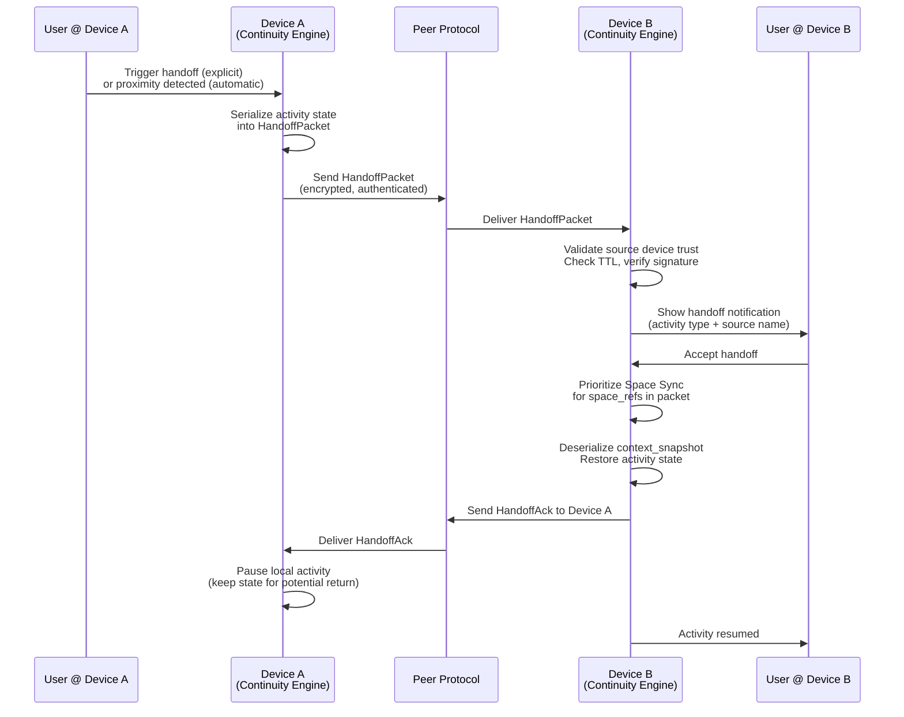
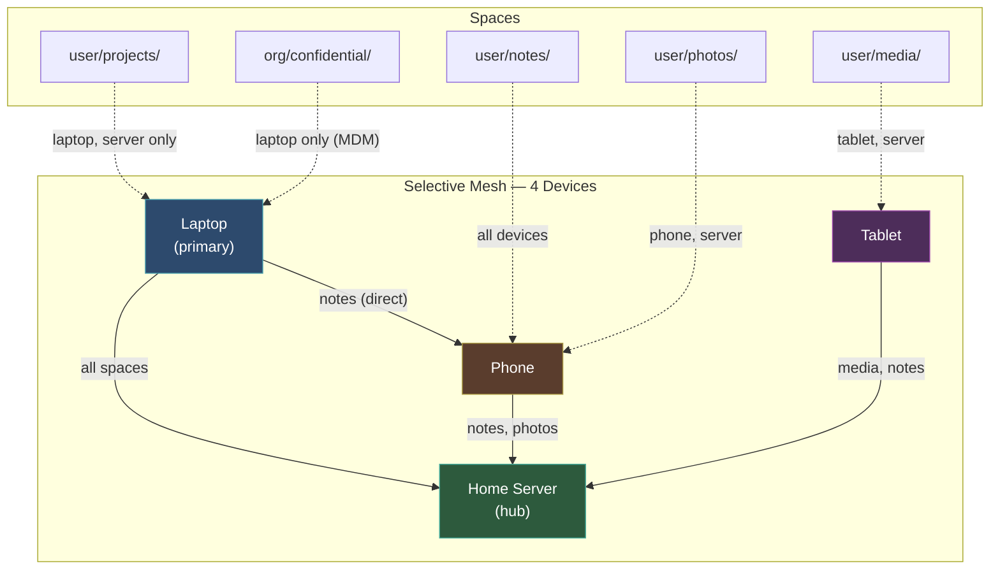
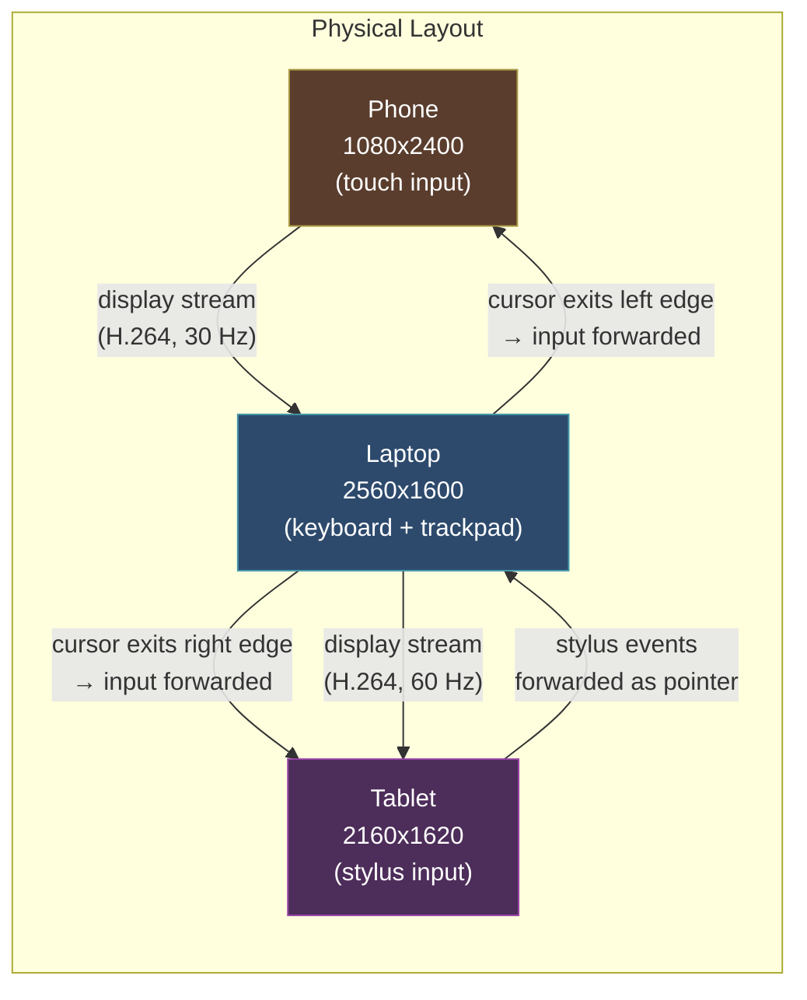

# AIOS Multi-Device Experience

Part of: [multi-device.md](../multi-device.md) — Multi-Device & Enterprise Architecture
**Related:** [pairing.md](./pairing.md) — Device Pairing & Trust, [intelligence.md](./intelligence.md) — AI-Native Intelligence

---

## §4.1 Continuity & Handoff

Activity handoff enables a user to start work on one device and seamlessly continue on another. The Continuity Engine tracks active contexts — open documents, running agents, UI state — and makes them available on paired devices.

### HandoffPacket

The `HandoffPacket` carries everything needed to resume an activity on a different device:

```rust
/// Maximum serialized context size for a handoff packet.
const MAX_CONTEXT_SIZE: usize = 65536; // 64 KiB

/// Activity types that support cross-device handoff.
#[derive(Debug, Clone, Copy, PartialEq, Eq)]
pub enum ActivityType {
    /// Document editing session (text, spreadsheet, drawing).
    Document,
    /// Running agent with live task state.
    Agent,
    /// Audio or video playback with position.
    MediaPlayback,
    /// Browser session with tab state and scroll position.
    BrowserSession,
    /// Terminal session with scrollback and working directory.
    Terminal,
}

/// A packet describing an in-progress activity available for handoff.
pub struct HandoffPacket {
    /// Unique identifier for this activity instance.
    pub activity_id: ActivityId,
    /// Device key of the originating device.
    pub source_device: DeviceKey,
    /// Classification of the activity.
    pub activity_type: ActivityType,
    /// Serialized activity state (application-defined format).
    /// Must not exceed MAX_CONTEXT_SIZE bytes.
    pub context_snapshot: Vec<u8>,
    /// Spaces involved in this activity (for sync prioritization).
    pub space_refs: Vec<SpaceId>,
    /// Agents currently executing within this activity.
    pub agent_refs: Vec<AgentId>,
    /// When this handoff packet was created.
    pub timestamp: Timestamp,
    /// Duration in seconds before this handoff offer expires.
    /// Default: 300 seconds (5 minutes).
    pub ttl_secs: u32,
}
```

### Handoff Modes

Two modes cover different user scenarios:

**Automatic (proximity).** When Device B is nearby (BLE advertising range, typically under 10 meters) and unlocked, Device A sends a `HandoffPacket` via the AIOS Peer Protocol (see [networking/protocols.md](../networking/protocols.md) §5.1). Device B displays a subtle indicator — a small icon near the dock or status bar — showing the activity type and source device name. The user taps or clicks to accept. If the user does not act within the TTL window, the offer silently expires. No data transfers until the user explicitly accepts.

**Explicit (via Flow).** The user triggers handoff from a system menu (e.g., right-click on an activity, select "Continue on..."). The `HandoffPacket` is wrapped in a `FlowEntry` with `content_type = Handoff` and sent to the target device through the Flow sync channel (see [flow/history.md](../../storage/flow/history.md) §9 for sync). The target device receives the entry and presents a notification. This mode works over any network path — not limited to BLE proximity.

### Handoff Sequence



**Failure handling.** If Space data referenced by `space_refs` has not yet synced to Device B, the Continuity Engine triggers a priority sync for those spaces before restoring the activity. The user sees a brief progress indicator. If sync fails (network unavailable), the handoff is deferred and the user is notified.

**Cross-references:** [flow/history.md](../../storage/flow/history.md) §9 (Flow cross-device sync), [intelligence/context-engine.md](../../intelligence/context-engine.md) (context state tracking)

---

## §4.2 Unified Clipboard & Flow

Cross-device clipboard is a specialized application of the Flow subsystem. When a user copies content on Device A, a `FlowEntry` with `content_type = Clipboard` is created and synced to paired devices via the CRDT watermark protocol described in [flow/history.md](../../storage/flow/history.md) §9.

### Clipboard FlowEntry Lifecycle

1. **Copy.** The user copies content on Device A. The clipboard subsystem creates a `FlowEntry` with `content_type = Clipboard`, a monotonic sequence number, and the copied payload.
2. **Sync.** The FlowEntry is encrypted with the session key from the active pairing (see [pairing.md](./pairing.md)) and pushed to all paired devices via the Flow sync channel.
3. **Available.** Paired devices receive the entry and make it available in their local clipboard. A subtle indicator (e.g., a small badge on the paste icon) signals that remote clipboard content is available.
4. **Expiry.** Clipboard entries expire after 5 minutes or upon the next paste action on any device, whichever comes first. Expired entries are purged from the Flow channel and securely zeroed in memory.

### Encryption

Clipboard content is end-to-end encrypted between devices using the session key established during the pairing handshake (see [pairing.md](./pairing.md) §3.2). The encryption uses AES-256-GCM with a per-entry nonce derived from the entry's sequence number. Intermediate infrastructure (routers, relay servers) never sees plaintext clipboard data.

```rust
/// A clipboard-specific FlowEntry with encryption metadata.
pub struct ClipboardEntry {
    /// Underlying Flow entry (see flow/data-model.md §3.1).
    pub flow_entry: FlowEntry,
    /// Nonce derived from session key + sequence number.
    pub nonce: [u8; 12],
    /// Expiration timestamp (creation + 5 minutes).
    pub expires_at: Timestamp,
    /// Whether this entry has been consumed by a paste action.
    pub consumed: bool,
}
```

### Large Content Handling

For clipboard content exceeding 1 MiB (images, rich documents, large text blocks), only metadata syncs initially:

- The `FlowEntry` payload contains a `ClipboardRef` with content hash, size, and MIME type — not the actual bytes.
- When the user pastes on Device B, the clipboard subsystem fetches the full content on-demand from Device A via the Peer Protocol.
- A progress indicator appears for transfers over 5 MiB.
- If Device A is unreachable, the paste fails with a clear error message.

### Privacy & DLP

Clipboard sync respects Data Loss Prevention policies (see [data-protection.md](./data-protection.md) §9.2). Content classified at a restricted security level may be blocked from cross-device clipboard entirely. The DLP engine inspects clipboard content before sync and applies the following rules:

| Classification | Clipboard Sync | Behavior |
|---|---|---|
| Public | Allowed | Normal sync |
| Internal | Allowed | Audit log entry created |
| Confidential | Blocked by default | Admin can override per-device-class |
| Restricted | Always blocked | Content never leaves device |

**Cross-references:** [flow/history.md](../../storage/flow/history.md) §9 (sync protocol), [flow/data-model.md](../../storage/flow/data-model.md) (FlowEntry structure), [data-protection.md](./data-protection.md) §9.2 (DLP policies)

---

## §4.3 Space Mesh Topology

The Space Mesh defines which spaces sync to which devices and under what conditions. This is the orchestration layer above the Merkle exchange protocol (see [spaces/sync.md](../../storage/spaces/sync.md) §8) — it decides **what** to sync, not **how**.

### SpaceMeshConfig

Each device in the mesh maintains a local `SpaceMeshConfig` that governs its sync behavior:

```rust
/// Sync policy for a single space on a specific device.
#[derive(Debug, Clone, PartialEq, Eq)]
pub enum SyncPolicy {
    /// Always keep this space fully synced.
    AlwaysSync,
    /// Sync only when on WiFi (not metered connections).
    WifiOnly,
    /// Sync only when explicitly triggered by the user.
    Manual,
    /// Sync on a schedule (e.g., nightly at 02:00).
    Scheduled { cron: CronExpression },
    /// Sync metadata only; fetch content on demand.
    MetadataOnly,
    /// Never sync this space to this device.
    Never,
}

/// Per-device mesh configuration.
pub struct SpaceMeshConfig {
    /// This device's identity in the mesh.
    pub device_id: DeviceId,
    /// Per-space sync rules. Spaces not listed default to AlwaysSync
    /// for personal spaces and Never for organizational spaces.
    pub space_sync_rules: Vec<(SpaceId, SyncPolicy)>,
    /// Maximum sync bandwidth in bytes per second.
    /// 0 means unlimited. Applied as a token-bucket rate limiter.
    pub bandwidth_budget: u64,
    /// Global sync schedule constraint.
    pub sync_schedule: SyncSchedule,
    /// Priority ordering for spaces when bandwidth is limited.
    /// Spaces listed first sync first.
    pub priority_order: Vec<SpaceId>,
}
```

### Mesh Topology Patterns

The Space Mesh supports four topology patterns, selectable per-user or enforced by organizational policy:

**Full mesh (default).** All personal spaces sync bidirectionally to all paired devices. Simple to reason about — every device has the same data. The tradeoff is bandwidth: with N devices and S spaces, sync traffic scales as O(N x S). Suitable for users with 2-3 devices and moderate data volumes.

**Hub-and-spoke.** The user designates one device as the hub (typically a desktop or always-on home server). All other devices sync only with the hub, never directly with each other. This reduces cross-device traffic from O(N^2) to O(N) and ensures the hub always has a complete copy. The tradeoff is that the hub must be reachable for any sync to occur.

**Selective.** Each device specifies exactly which spaces it wants. A phone might sync only contacts, notes, and photos. A work laptop syncs project repositories and documents. A media tablet syncs only media libraries. This minimizes storage consumption on constrained devices.

**Organizational.** An MDM (Mobile Device Management) policy defines which corporate spaces sync to which device classes. For example: Confidential spaces sync only to managed laptops, never to personal phones. This pattern is enforced at the capability level — devices without the appropriate trust level cannot even request sync for restricted spaces.

### Mesh Topology Diagram



### Conflict Resolution

When two devices modify the same space object concurrently, the Merkle exchange protocol detects the divergence and applies the conflict resolution strategy defined in [spaces/sync.md](../../storage/spaces/sync.md) §8. The Space Mesh layer adds **priority-based conflict hints**: if the user's primary device and a secondary device conflict, the primary device's version wins by default (unless the secondary's edit is more recent by more than 30 seconds, indicating intentional concurrent work).

**Cross-references:** [spaces/sync.md](../../storage/spaces/sync.md) §8 (Merkle exchange protocol), [spaces/budget.md](../../storage/spaces/budget.md) §10.1 (device storage profiles)

---

## §4.4 Intelligence Continuity

When a user switches devices, AIRS context follows within seconds. Intelligence continuity ensures that the AI assistant maintains conversation history, learned preferences, and situational awareness across the device mesh.

### Preference Sync

User preferences — UI settings, agent configurations, learned behaviors, custom shortcuts — are stored in the `user/preferences/` space. Because preferences are small (typically under 100 KiB total), they sync via normal Space Sync and arrive on a new device within seconds of it joining the mesh. No special handling is needed; the existing sync infrastructure is sufficient.

### Context Snapshot

The Context Engine (see [intelligence/context-engine.md](../../intelligence/context-engine.md)) periodically serializes its working state into a `ContextSnapshot` and stores it as a Space object in the `user/context/` space:

```rust
/// A serialized snapshot of AIRS context state for cross-device continuity.
pub struct ContextSnapshot {
    /// Unique identifier for this snapshot.
    pub snapshot_id: SnapshotId,
    /// Device that generated this snapshot.
    pub device_source: DeviceId,
    /// When this snapshot was taken.
    pub timestamp: Timestamp,
    /// Recent user interactions (last 100), ordered newest-first.
    /// Each interaction is a compact summary, not full content.
    pub recent_interactions: Vec<InteractionSummary>,
    /// Topics the user is currently working on, with recency scores.
    pub active_topics: Vec<TopicWeight>,
    /// Attention priorities derived from recent activity patterns.
    pub attention_weights: AttentionVector,
    /// Version of the model that generated this context
    /// (for compatibility checking on the receiving device).
    pub model_version: SemanticVersion,
    /// Total serialized size in bytes.
    pub size_bytes: u64,
}
```

Snapshots are generated every 5 minutes during active use and immediately before a handoff. When a user activates a new device, AIRS loads the latest `ContextSnapshot` from the synced space and resumes with full awareness of recent activity.

### Model State

For on-device inference, the following artifacts reside in the `model/` memory pool:

| Artifact | Typical Size | Sync Policy |
|---|---|---|
| KV caches (active session) | 50-500 MiB | Not synced (ephemeral, rebuilt locally) |
| LoRA adapter weights | 10-100 MiB | WiFi + charging only |
| Quantized base model | 1-7 GiB | Manual trigger or initial setup only |
| Tokenizer / config | < 1 MiB | Always sync |

KV caches are never synced — they are ephemeral and rebuilt from the context snapshot. LoRA adapters (personalized fine-tuning) sync only on WiFi while charging to avoid battery drain and metered data costs. Base models are too large for routine sync; they are provisioned during device setup or updated via explicit user action.

### Graceful Degradation

If a context snapshot has not yet synced to the target device (e.g., the device was offline), AIRS starts with a fresh context and incrementally rebuilds awareness by scanning the user's local spaces:

1. Load user preferences (always available if the device has ever synced).
2. Scan recent objects in personal spaces to reconstruct active topics.
3. Begin normal context accumulation from new interactions.

The experience is slightly reduced — AIRS may ask a clarifying question it would not normally need — but functionality is never broken. A status indicator shows "Context syncing..." until the full snapshot arrives.

**Cross-references:** [intelligence/preferences.md](../../intelligence/preferences.md) (preference storage), [intelligence/airs.md](../../intelligence/airs.md) (AIRS architecture), [intelligence/context-engine.md](../../intelligence/context-engine.md) (context serialization)

---

## §4.5 Display & Input Continuity

AIOS supports using multiple devices as an extended workspace — sharing displays and input devices across the device mesh. This transforms a collection of devices into a unified computing surface.

### Display Extension

A tablet can serve as a secondary display for a laptop. The compositor on Device A allocates a virtual display output and streams its rendered frames to Device B via the Peer Protocol. Device B's compositor treats the incoming stream as a local display source and renders it to its physical screen.

This operates at the compositor level (see [compositor.md](../compositor.md) §6 for multi-monitor architecture), treating the remote device as another display output with network-imposed latency constraints.

```rust
/// Configuration for a remote display output.
pub struct RemoteDisplayConfig {
    /// Target device to use as an extended display.
    pub target_device: DeviceKey,
    /// Spatial position relative to the primary display.
    pub display_position: DisplayPosition,
    /// Target resolution for the remote display.
    /// Negotiated with the target device's actual capabilities.
    pub resolution: Resolution,
    /// Target refresh rate in Hz. Lower rates reduce bandwidth.
    pub refresh_rate: u32,
    /// Compression codec for frame transport.
    pub encoding: DisplayEncoding,
    /// Maximum acceptable end-to-end latency in milliseconds.
    /// If exceeded, the system degrades quality to maintain responsiveness.
    pub latency_target_ms: u32,
}

/// Spatial position of a remote display relative to the primary.
#[derive(Debug, Clone, Copy, PartialEq, Eq)]
pub enum DisplayPosition {
    Left,
    Right,
    Above,
    Below,
}

/// Frame compression codec selection.
#[derive(Debug, Clone, Copy, PartialEq, Eq)]
pub enum DisplayEncoding {
    /// No compression. Lowest latency, highest bandwidth.
    /// Suitable for Gigabit LAN connections.
    Raw,
    /// H.264 hardware encoding. Good balance of quality and bandwidth.
    H264,
    /// AV1 software encoding. Best compression, higher CPU cost.
    Av1,
}
```

**Adaptive quality.** The display streaming layer continuously monitors round-trip latency and available bandwidth. If latency exceeds `latency_target_ms`, the system reduces resolution or frame rate before switching to a more aggressive codec. The goal is to maintain cursor responsiveness even at the cost of visual fidelity.

### Input Sharing

A single keyboard and mouse can control multiple devices. When the cursor reaches the edge of Device A's screen in the direction of Device B (as configured), input focus seamlessly transitions to Device B. All keyboard and mouse events are forwarded via the Peer Protocol until the cursor returns.

```rust
/// Configuration for sharing input devices across device boundaries.
pub struct InputSharingConfig {
    /// Device that owns the physical input devices.
    pub source_device: DeviceKey,
    /// Device that receives forwarded input events.
    pub target_device: DeviceKey,
    /// Which screen edge on the source triggers transition to the target.
    pub edge_transition: ScreenEdge,
    /// If true, keyboard focus follows mouse focus to the target device.
    /// If false, keyboard remains on the source until explicitly switched.
    pub keyboard_follows_mouse: bool,
    /// If true, clipboard content auto-syncs when input transitions
    /// between devices (triggers a Clipboard FlowEntry, see section 4.2).
    pub clipboard_sync: bool,
}

/// Screen edge that triggers input transition to another device.
#[derive(Debug, Clone, Copy, PartialEq, Eq)]
pub enum ScreenEdge {
    Left,
    Right,
    Top,
    Bottom,
}
```

The input subsystem (see [input/events.md](../input/events.md) §4.6 for multi-seat support) treats remote devices as virtual input sources. Input events are serialized with sub-millisecond timestamps to preserve ordering across the network boundary.

### Display & Input Topology



**Security considerations.** Input sharing requires mutual device trust at the `Paired` level or above (see [pairing.md](./pairing.md)). All forwarded input events are encrypted and authenticated. A device can revoke input sharing at any time by pressing a hardware key combination (e.g., holding the power button for 2 seconds). Screen lock on either device immediately halts input sharing.

**Cross-references:** [compositor.md](../compositor.md) §6 (multi-monitor architecture), [input.md](../input.md) §4.6 (multi-seat input model)
