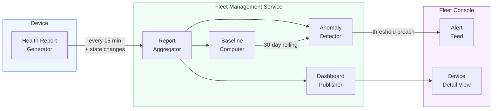
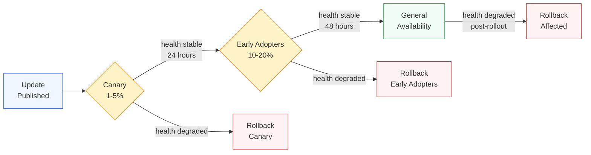
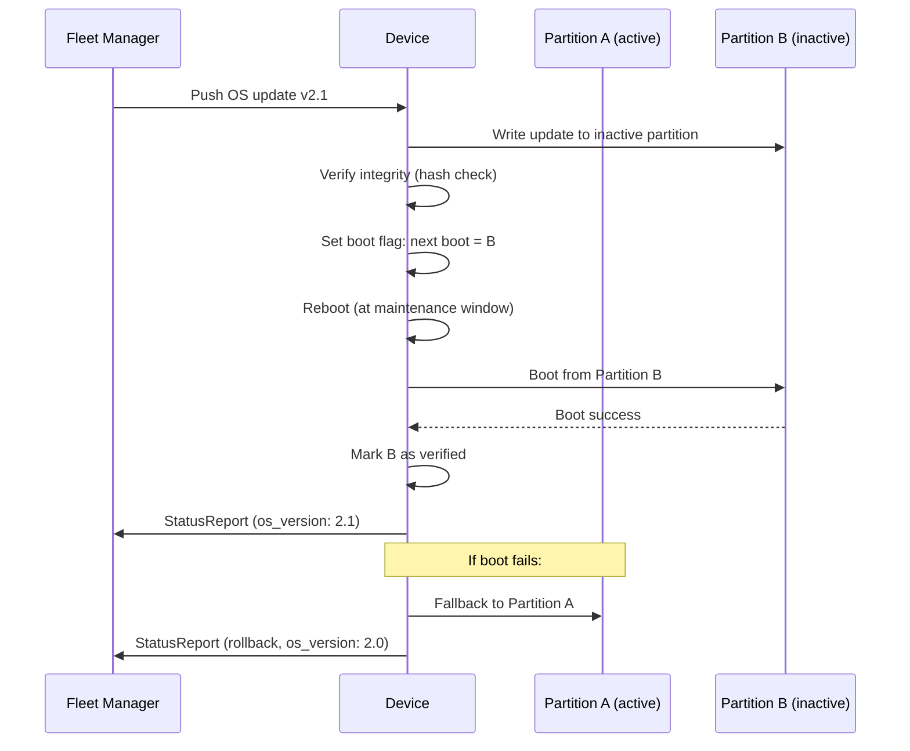

# AIOS Fleet Management

Part of: [multi-device.md](../multi-device.md) — Multi-Device & Enterprise Architecture
**Related:** [mdm.md](./mdm.md) — Mobile Device Management, [policy.md](./policy.md) — Policy Engine, [intelligence.md](./intelligence.md) — AI-Native Intelligence

---

## §6.1 Device Inventory

Fleet-wide device registry providing a queryable view of all enrolled devices. The inventory is the authoritative record of every device under organizational management, updated continuously as devices check in and report status changes.

```rust
/// Classification of device form factor and intended use.
#[derive(Debug, Clone, Copy, PartialEq, Eq)]
pub enum DeviceClass {
    Laptop,
    Desktop,
    Phone,
    Tablet,
    Kiosk,
    IoT,
}

/// Hardware capabilities reported during enrollment and updated on check-in.
pub struct HardwareProfile {
    /// CPU architecture (e.g., "aarch64").
    pub cpu_arch: [u8; 16],
    /// Number of logical CPU cores.
    pub core_count: u16,
    /// Total RAM in bytes.
    pub ram_bytes: u64,
    /// Total storage capacity in bytes.
    pub storage_capacity_bytes: u64,
    /// GPU model identifier, if present.
    pub gpu_model: Option<[u8; 32]>,
    /// Primary display resolution (width x height), if present.
    pub display: Option<(u16, u16)>,
}

/// Per-space storage breakdown for inventory reporting.
pub struct StorageUsage {
    /// Total bytes used across all spaces.
    pub used_bytes: u64,
    /// Total storage capacity in bytes.
    pub total_bytes: u64,
    /// Per-space breakdown: (space_path, used_bytes).
    pub by_space: Vec<([u8; 64], u64)>,
}

/// Authoritative record for one enrolled device in the fleet inventory.
pub struct DeviceInventoryRecord {
    /// Ed25519 public key serving as the device's cryptographic identity.
    pub device_id: [u8; 32],
    /// Form factor classification.
    pub device_class: DeviceClass,
    /// Human-readable name (e.g., "Alice's Laptop").
    pub display_name: [u8; 64],
    /// Hardware capabilities snapshot.
    pub hardware_profile: HardwareProfile,
    /// Running OS version.
    pub os_version: SemanticVersion,
    /// How this device was enrolled.
    pub enrollment_type: EnrollmentType,
    /// When the device first enrolled.
    pub enrollment_date: Timestamp,
    /// Most recent check-in timestamp.
    pub last_check_in: Timestamp,
    /// Agents installed on this device with their versions.
    pub installed_agents: Vec<(AgentId, SemanticVersion)>,
    /// Current storage utilization.
    pub storage_usage: StorageUsage,
    /// Composite compliance score (0 = fully non-compliant, 100 = fully compliant).
    pub compliance_score: u8,
    /// Administrator-assigned tags for grouping and filtering.
    pub tags: Vec<[u8; 32]>,
    /// Groups this device belongs to.
    pub group_memberships: Vec<GroupId>,
}

/// How a device was enrolled into the organization.
#[derive(Debug, Clone, Copy, PartialEq, Eq)]
pub enum EnrollmentType {
    /// Bring Your Own Device — MDM scope limited to organizational spaces.
    Byod,
    /// Corporate-owned, fully managed.
    Corporate,
    /// Single-purpose locked device.
    Kiosk,
}
```

The inventory is stored in the `system/fleet/inventory/` space on the MDM server and synced to fleet management consoles. Devices push inventory updates with every `StatusReport` (see [mdm.md](./mdm.md) §5.5 for the check-in protocol). The inventory service merges incoming updates, resolves conflicts by timestamp, and publishes change notifications to subscribed consoles.

### Inventory Query API

Fleet administrators query the inventory through a structured API that supports filtering, sorting, and pagination. Queries execute against the local inventory space, so results are available even when individual devices are offline.

```rust
/// Query filter for inventory searches.
pub struct InventoryQuery {
    /// Filter by device form factor.
    pub device_class: Option<DeviceClass>,
    /// Filter by enrollment type.
    pub enrollment_type: Option<EnrollmentType>,
    /// Minimum compliance score (inclusive).
    pub min_compliance_score: Option<u8>,
    /// Maximum compliance score (inclusive).
    pub max_compliance_score: Option<u8>,
    /// Require all listed tags.
    pub required_tags: Vec<[u8; 32]>,
    /// Require membership in all listed groups.
    pub required_groups: Vec<GroupId>,
    /// Sort field and direction.
    pub sort: InventorySort,
    /// Pagination: zero-based page index.
    pub page: usize,
    /// Pagination: results per page (max 200).
    pub page_size: usize,
}

/// Sort options for inventory queries.
pub enum InventorySort {
    DisplayNameAsc,
    DisplayNameDesc,
    LastCheckInAsc,
    LastCheckInDesc,
    ComplianceScoreAsc,
    ComplianceScoreDesc,
    EnrollmentDateAsc,
    EnrollmentDateDesc,
}

/// Lightweight summary returned by inventory queries.
/// Full DeviceInventoryRecord available via device_id lookup.
pub struct DeviceInventorySummary {
    pub device_id: [u8; 32],
    pub display_name: [u8; 64],
    pub device_class: DeviceClass,
    pub os_version: SemanticVersion,
    pub compliance_score: u8,
    pub last_check_in: Timestamp,
    pub enrollment_type: EnrollmentType,
}
```

**Cross-reference:** [budget.md](../../storage/spaces/budget.md) §10.1 defines device profiles that inform the `HardwareProfile` structure.

---

## §6.2 Health Monitoring

Continuous device health telemetry enables proactive issue detection across the fleet. Each device periodically reports a structured health snapshot. The fleet management service aggregates these reports, computes baselines, and surfaces anomalies before they become incidents.

```rust
/// Battery health telemetry.
pub struct BatteryHealth {
    /// Current charge level (0-100).
    pub level_percent: u8,
    /// Total charge/discharge cycles.
    pub cycle_count: u32,
    /// Battery health as percentage of design capacity (0-100).
    pub health_percent: u8,
    /// Current charging state.
    pub charging_state: ChargingState,
}

#[derive(Debug, Clone, Copy, PartialEq, Eq)]
pub enum ChargingState {
    Discharging,
    Charging,
    Full,
    NotApplicable,
}

/// Security posture assessment for a single device.
pub struct SecurityPosture {
    /// Whether the OS version meets the minimum required by policy.
    pub os_up_to_date: bool,
    /// Whether storage encryption is active.
    pub encryption_enabled: bool,
    /// Whether the most recent hardware attestation passed.
    pub attestation_valid: bool,
    /// Timestamp of the last successful attestation.
    pub last_attestation: Timestamp,
    /// Whether the device satisfies all assigned policy requirements.
    pub policy_compliant: bool,
}

/// Health status for a single agent running on the device.
pub struct AgentHealthEntry {
    pub agent_id: AgentId,
    /// Number of crashes in the last 24 hours.
    pub crash_count_24h: u16,
    /// Total restart count since last boot.
    pub restart_count: u16,
    /// Current memory usage in bytes.
    pub memory_usage_bytes: u64,
}

/// Network connectivity health.
pub struct NetworkHealth {
    /// Whether the device currently has network connectivity.
    pub connectivity: bool,
    /// Timestamp of the last successful sync with any peer or server.
    pub last_sync: Timestamp,
    /// Seconds since the last successful sync.
    pub sync_lag_seconds: u64,
}

/// Periodic health report sent by each enrolled device.
pub struct DeviceHealthReport {
    /// Reporting device identity.
    pub device_id: [u8; 32],
    /// When this report was generated.
    pub timestamp: Timestamp,
    /// Battery status (None for devices without batteries).
    pub battery: Option<BatteryHealth>,
    /// Storage pressure assessment.
    pub storage: StoragePressure,
    /// Thermal state summary.
    pub thermal: ThermalState,
    /// Memory pressure assessment.
    pub memory: MemoryPressure,
    /// Security posture snapshot.
    pub security_posture: SecurityPosture,
    /// Per-agent health entries.
    pub agent_health: Vec<AgentHealthEntry>,
    /// Network connectivity health.
    pub network: NetworkHealth,
    /// Ed25519 signature over all preceding fields.
    pub signature: [u8; 64],
}
```

### Reporting Schedule

Health reports are sent at configurable intervals. The default interval is 15 minutes. The device also sends an immediate report when any of the following state changes occur:

- Battery level drops below 15% (critical)
- Storage pressure level changes (e.g., Normal to Warning)
- Thermal throttling activates or deactivates
- An agent crashes
- Attestation status changes
- Network connectivity is lost or restored after an outage exceeding 5 minutes

Reports accumulate locally when the device is offline and batch-send when connectivity returns. The fleet management service deduplicates by `(device_id, timestamp)` to handle retransmissions.

### Baseline Anomaly Detection

The fleet management service maintains per-device health baselines computed from the trailing 30 days of health reports. A baseline captures typical values for each health metric: average battery drain rate, storage growth rate, crash frequency, thermal profile, and sync latency.

Anomaly detection triggers an alert to fleet administrators when a device deviates significantly from its baseline:

| Metric | Anomaly Threshold | Example |
|---|---|---|
| Battery drain rate | 3x faster than 30-day average | Rogue agent consuming power |
| Storage growth rate | 10x faster than 30-day average | Runaway logging or data leak |
| Agent crash frequency | More than 5 crashes/24h (baseline: 0) | Faulty agent update |
| Thermal throttle duration | 2x longer than 30-day average | Hardware degradation |
| Sync lag | Exceeds 4 hours (baseline: < 30 min) | Network or policy misconfiguration |

Baseline anomaly detection uses simple statistical thresholds (z-score against rolling averages). For more sophisticated pattern detection across the fleet — including cross-device correlation and predictive failure analysis — see [intelligence.md](./intelligence.md) §14.1.



**Cross-references:** [zones.md](../thermal/zones.md) §2 defines the `ThermalZone` and sensor model referenced by `ThermalState`. [operations.md](../../security/model/operations.md) §6 defines security event types that feed into `SecurityPosture`.

---

## §6.3 OS & Agent Updates

Staged rollout of operating system and agent updates across the fleet. Updates progress through health-gated stages, with automatic rollback if health degrades. This ensures that a faulty update affects a small fraction of devices before it reaches the general population.

### Rollout Pipeline



The four stages of the rollout pipeline:

1. **Canary (1-5% of fleet).** The update is pushed to a small, administrator-selected test group. Health reports from the canary group are monitored for 24 hours. The health gate evaluates crash rates, compliance scores, and thermal violations against configurable thresholds.

2. **Early Adopters (10-20%).** If the canary group passes the health gate, the rollout expands to the early adopter group. This group is monitored for 48 hours. The longer observation window catches issues that manifest under sustained use rather than immediately.

3. **General Availability.** If early adopters pass the health gate, the update rolls out to all remaining devices. Devices that are offline receive the update when they next check in.

4. **Rollback.** If health degrades at any stage — the compliance score drops below the threshold, crash rate exceeds the limit, or thermal violations spike — the rollout halts. Affected devices are rolled back automatically (if `auto_rollback` is enabled) or flagged for administrator review.

```rust
/// Type of update being rolled out.
#[derive(Debug, Clone, Copy, PartialEq, Eq)]
pub enum UpdateType {
    /// Full operating system update.
    OsUpdate,
    /// Individual agent binary update.
    AgentUpdate,
    /// Policy bundle update (see policy.md §7.1).
    PolicyUpdate,
}

/// Health thresholds that gate rollout stage transitions.
pub struct HealthGateConfig {
    /// Minimum average compliance score across the stage group (0-100).
    pub min_compliance_score: u8,
    /// Maximum crash rate (crashes per device per 24h).
    pub max_crash_rate: f32,
    /// Maximum number of devices experiencing thermal throttle violations.
    pub max_thermal_violations: u16,
}

/// Conditions that trigger automatic rollback.
pub struct RollbackConfig {
    /// If average health score drops below this, trigger rollback.
    pub health_score_threshold: u8,
    /// Whether to rollback automatically or require administrator approval.
    pub auto_rollback: bool,
}

/// Maintenance window for update scheduling.
pub struct RolloutSchedule {
    /// Earliest time to begin pushing updates.
    pub start_time: Timestamp,
    /// Maintenance window in which updates are permitted (start_hour, end_hour, timezone).
    pub maintenance_window: Option<(u8, u8, [u8; 32])>,
}

/// Complete rollout plan for a fleet update.
pub struct RolloutPlan {
    /// Unique identifier for this update.
    pub update_id: [u8; 32],
    /// What is being updated.
    pub update_type: UpdateType,
    /// Target version.
    pub version: SemanticVersion,
    /// Group to receive the canary rollout.
    pub canary_group: GroupId,
    /// Percentage of canary group to include (1-5).
    pub canary_percentage: u8,
    /// Group to receive the early adopter rollout.
    pub early_adopter_group: GroupId,
    /// Health thresholds for stage transitions.
    pub health_gate: HealthGateConfig,
    /// Conditions for automatic rollback.
    pub rollback_trigger: RollbackConfig,
    /// When and during what windows to apply updates.
    pub schedule: RolloutSchedule,
}
```

### A/B System Partitions

For OS updates, AIOS maintains two system partitions on each device: the active partition (currently booted) and the inactive partition (target for the next update). The update process writes to the inactive partition while the device continues running from the active partition, ensuring zero downtime during the update itself.



On reboot, the bootloader attempts to boot from the newly written partition. If boot succeeds and the system reaches a healthy state (kernel boots, services start, health report sends successfully), the partition is marked as verified. If boot fails — kernel panic, timeout, or health check failure — the bootloader falls back to the previous partition automatically. This provides atomic OS updates: the device always runs either the old version or the new version, never a partial state.

**Cross-reference:** The A/B partition scheme integrates with the secure boot chain described in Phase 35 (Secure Boot & Update System). Each partition carries a signed boot measurement that the bootloader verifies before execution.

---

## §6.4 Fleet Grouping & Tags

Organize devices into groups for targeted policy application, update staging, and monitoring. Groups provide the organizational structure that the policy engine (see [policy.md](./policy.md) §7.1) and update pipeline (§6.3) operate against.

### Static Groups

Administrator-defined groups with manually assigned membership. Static groups represent organizational structures that do not change based on device state:

- Departmental groups: "Engineering", "Marketing", "Finance"
- Location groups: "Building A", "Remote Workers", "Data Center"
- Role groups: "Executives", "Contractors", "Shared Devices"

### Dynamic Groups

Membership defined by query rules that the fleet management service evaluates continuously. When a device's state changes (new health report, tag change, OS update), the service re-evaluates all dynamic group rules and updates membership automatically.

Examples of dynamic group rules:

- "All laptops with less than 10% storage free"
- "All BYOD devices that have not checked in for 7 days"
- "All devices running OS version below 2.1"
- "All devices with compliance score below 80"

### Group Data Model

```rust
/// Whether group membership is manually assigned or query-driven.
#[derive(Debug, Clone, Copy, PartialEq, Eq)]
pub enum GroupType {
    /// Membership is manually assigned by administrators.
    Static,
    /// Membership is computed from a GroupQuery rule.
    Dynamic,
}

/// A fleet group that policies and updates can target.
pub struct FleetGroup {
    /// Unique group identifier.
    pub group_id: GroupId,
    /// Human-readable group name.
    pub name: [u8; 64],
    /// Description of the group's purpose.
    pub description: [u8; 256],
    /// Whether membership is static or dynamic.
    pub group_type: GroupType,
    /// Query rule for dynamic groups (None for static groups).
    pub membership_rule: Option<GroupQuery>,
    /// Current number of members.
    pub member_count: usize,
    /// Policy identifiers applied to this group.
    pub policies: Vec<PolicyId>,
    /// Parent group for hierarchical nesting (None for top-level groups).
    pub parent_group: Option<GroupId>,
}
```

### Group Query Language

Dynamic group membership is defined through composable query conditions. Conditions support field comparisons, logical combinators, temporal expressions, and tag matching.

```rust
/// A composable condition for dynamic group membership.
pub enum GroupCondition {
    /// Field comparison (e.g., device_class == Laptop).
    FieldEquals {
        field: InventoryField,
        value: FieldValue,
    },
    /// Numeric range comparison (e.g., compliance_score < 80).
    FieldRange {
        field: InventoryField,
        op: RangeOp,
        value: u64,
    },
    /// Temporal condition (e.g., last_check_in older than 7 days).
    TemporalCondition {
        field: InventoryField,
        op: TemporalOp,
        duration_seconds: u64,
    },
    /// Tag presence check.
    HasTag {
        tag: [u8; 32],
    },
    /// Logical AND of sub-conditions.
    And(Vec<GroupCondition>),
    /// Logical OR of sub-conditions.
    Or(Vec<GroupCondition>),
    /// Logical NOT of a sub-condition.
    Not(Box<GroupCondition>),
}

#[derive(Debug, Clone, Copy, PartialEq, Eq)]
pub enum RangeOp {
    LessThan,
    LessOrEqual,
    GreaterThan,
    GreaterOrEqual,
}

#[derive(Debug, Clone, Copy, PartialEq, Eq)]
pub enum TemporalOp {
    /// Field timestamp is older than the specified duration from now.
    OlderThan,
    /// Field timestamp is newer than the specified duration from now.
    NewerThan,
}

/// Fields available for query conditions.
#[derive(Debug, Clone, Copy, PartialEq, Eq)]
pub enum InventoryField {
    DeviceClass,
    EnrollmentType,
    ComplianceScore,
    OsVersion,
    LastCheckIn,
    EnrollmentDate,
    StorageUsedPercent,
    RamBytes,
    CoreCount,
}

/// A complete group query wrapping a root condition.
pub struct GroupQuery {
    pub root: GroupCondition,
}
```

**Hierarchical groups.** Groups can nest via the `parent_group` field. A policy applied to a parent group applies to all child groups unless a child group explicitly overrides it. This allows broad organizational policies (e.g., "All Employees") with targeted refinements (e.g., "Engineering" inherits from "All Employees" but adds development tool access).

---

## §6.5 Compliance Dashboard

Fleet-wide compliance view for administrators and auditors. The dashboard aggregates compliance data from all enrolled devices, categorizes violations, tracks trends over time, and exports structured reports for external compliance tools.

### Compliance Summary

```rust
/// Direction of compliance trend over a time window.
#[derive(Debug, Clone, Copy, PartialEq, Eq)]
pub enum ComplianceTrend {
    /// Compliance rate is increasing.
    Improving,
    /// Compliance rate is stable (within 2% variance).
    Stable,
    /// Compliance rate is decreasing.
    Degrading,
}

/// Fleet-wide compliance summary for the dashboard.
pub struct ComplianceSummary {
    /// Total enrolled devices in the fleet.
    pub total_devices: usize,
    /// Devices meeting all policy requirements.
    pub compliant_count: usize,
    /// Devices with one or more policy violations.
    pub non_compliant_count: usize,
    /// Devices currently self-healing toward compliance.
    pub remediating_count: usize,
    /// Overall compliance rate (0.0 - 100.0).
    pub compliance_rate: f64,
    /// Most common violations, sorted by affected device count descending.
    pub top_violations: Vec<(ViolationType, usize)>,
    /// Compliance trend over 7, 30, and 90 days.
    pub trend_7d: ComplianceTrend,
    pub trend_30d: ComplianceTrend,
    pub trend_90d: ComplianceTrend,
    /// Per-group compliance rates.
    pub by_group: Vec<(GroupId, f64)>,
    /// Per-policy compliance rates.
    pub by_policy: Vec<(PolicyId, f64)>,
}
```

### Violation Categories

Each non-compliant device has one or more violation types. The compliance engine evaluates these categories on every health report and policy change.

```rust
/// Categories of compliance violations.
#[derive(Debug, Clone, Copy, PartialEq, Eq)]
pub enum ViolationType {
    /// OS version is below the minimum required by policy.
    OsOutdated,
    /// Storage encryption is not enabled.
    EncryptionDisabled,
    /// Hardware attestation has failed or the attestation certificate has expired.
    AttestationInvalid,
    /// One or more required agents are not installed.
    MissingRequiredAgents,
    /// Device configuration does not match the desired state declared by policy.
    PolicyDrift,
    /// Device has not sent a health report within the required interval.
    CheckInOverdue,
}
```

| Violation | Severity | Auto-Remediation | Manual Action |
|---|---|---|---|
| `OsOutdated` | High | Trigger update via rollout pipeline (§6.3) | Escalate if device repeatedly fails update |
| `EncryptionDisabled` | Critical | Send encryption enablement command | Restrict access until compliant |
| `AttestationInvalid` | Critical | Re-attest on next check-in | Investigate hardware tampering |
| `MissingRequiredAgents` | Medium | Push agent install via MDM | Verify agent compatibility |
| `PolicyDrift` | Medium | Self-healing re-applies desired state | Investigate root cause of drift |
| `CheckInOverdue` | Low-High | No auto-remediation (device unreachable) | Contact user, escalate after threshold |

### Reporting and Export

The compliance dashboard is accessible through the fleet management console UI. For integration with external compliance and audit tools, the dashboard supports structured report export:

- **JSON export** — Full `ComplianceSummary` serialized for programmatic consumption.
- **CSV export** — Flattened per-device compliance status for spreadsheet analysis.
- **Scheduled reports** — Automated daily/weekly/monthly compliance snapshots sent to configured recipients via Flow (see [flow/history.md](../../storage/flow/history.md) §5.1).

**Cross-references:** [data-protection.md](./data-protection.md) §10.2 defines the compliance framework mapping (SOC 2, ISO 27001, GDPR) that the dashboard categories align with. [data-protection.md](./data-protection.md) §10.3 describes the structured compliance reporting pipeline that consumes dashboard data.
