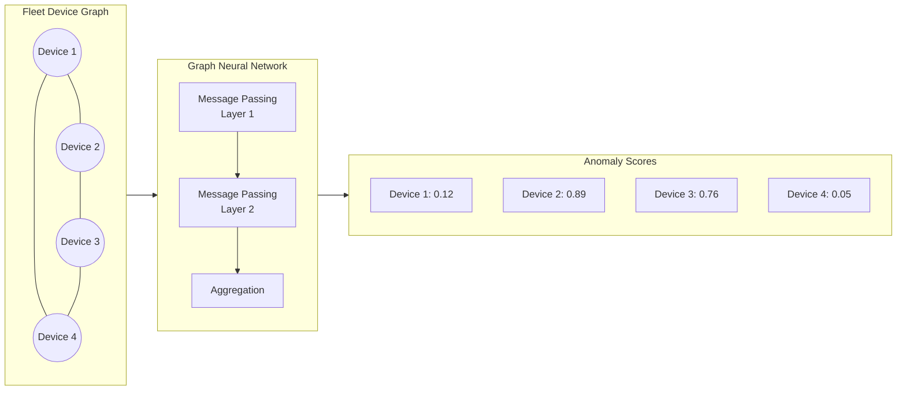
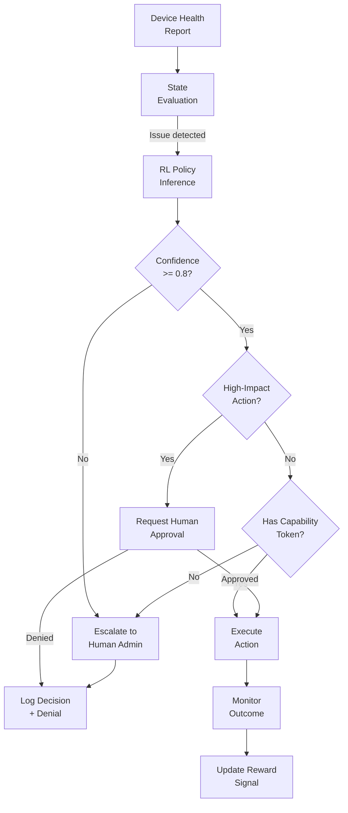
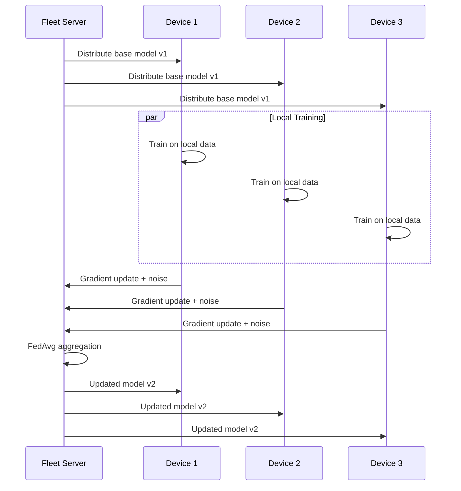
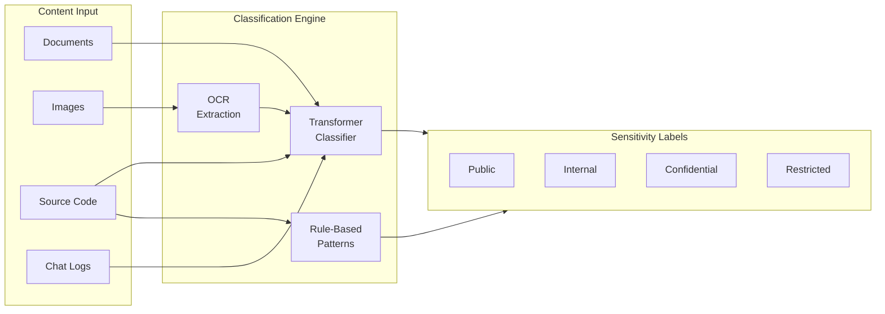
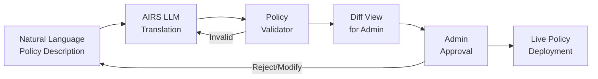

# AIOS AI-Native Multi-Device Intelligence

Part of: [multi-device.md](../multi-device.md) — Multi-Device & Enterprise Architecture
**Related:** [fleet.md](./fleet.md) — Fleet Management, [policy.md](./policy.md) — Policy Engine, [data-protection.md](./data-protection.md) — Data Protection

---

This document covers AI/ML enhancements to multi-device and enterprise features, organized into two tiers:

- **Kernel-internal ML (§13):** Lightweight statistical models that run in kernel context or as system services without AIRS dependency. These work even if AIRS is offline or unavailable. Implementations use frozen decision trees, lookup tables, or small neural networks with fixed weights.

- **AIRS-dependent intelligence (§14):** Features requiring semantic understanding, LLM reasoning, or continuous learning. These require the AIRS runtime (Phase 9+) and degrade gracefully if AIRS is unavailable.

---

## §13 Kernel-Internal ML

### §13.1 Sync Optimization

A frozen decision tree predicts which spaces to sync first when bandwidth is limited, optimizing for user-perceived latency.

**Input features:**

- Time of day (binned into 4 periods: morning, afternoon, evening, night)
- Day of week (weekday vs weekend)
- Device type (laptop, phone, tablet)
- Space access frequency (accesses in last 7 days)
- Space modification recency (time since last write)
- Available bandwidth (binned: low/medium/high)
- Battery level (binned: critical/low/normal/charging)

**Output:** Priority score (0-255) for each space. Spaces with higher scores sync first.

**Training:** The decision tree is trained offline from aggregated (anonymized) sync access logs. The frozen model is distributed as part of OS updates. On-device, the model is a ~2 KiB lookup table — no floating-point arithmetic, no dynamic memory allocation.

```rust
pub struct SyncPriorityModel {
    /// Decision tree nodes stored as flat array.
    /// Each node: [feature_index: u8, threshold: u16, left_child: u16,
    /// right_child: u16, leaf_value: u8]
    pub nodes: &'static [DecisionNode],
    /// Model version (updated with OS releases).
    pub version: u32,
}

pub struct DecisionNode {
    pub feature_index: u8,
    pub threshold: u16,
    pub left_child: u16,   // index or 0xFFFF for leaf
    pub right_child: u16,  // index or 0xFFFF for leaf
    pub leaf_value: u8,    // priority score (only valid if this is a leaf)
}
```

The tree traversal is O(depth), with depth capped at 10 to bound worst-case latency. Classification completes in under 1 microsecond on any supported platform.

**Integration with Space Sync:** When the Merkle exchange phase (see [sync.md](../../storage/spaces/sync.md) §8.1) identifies spaces with pending changes, the sync scheduler calls `SyncPriorityModel::classify()` for each space and sorts the sync queue by descending priority score. This ensures that the spaces most likely to be accessed soon are synced first, even when bandwidth constraints prevent syncing everything immediately.

**Fallback:** If the model is unavailable, spaces are synced in order of last modification time (most recently modified first).

### §13.2 Device Health Anomaly Detection

A lightweight per-device anomaly detector flags unusual health metric patterns without requiring fleet-wide analysis. This supplements the basic threshold checks in the DeviceHealthReport (see [fleet.md](./fleet.md) §6.2) with statistical trend detection that adapts to each device's normal behavior.

**Algorithm:** Exponential Moving Average (EMA) with z-score alerting. For each health metric (battery drain rate, storage growth rate, thermal average, crash frequency), the detector maintains:

- Running EMA (alpha = 0.1 for slow adaptation)
- Running variance estimate
- Z-score threshold (default: 3.0 standard deviations)

When a metric's current value exceeds the z-score threshold from its EMA, an anomaly is flagged.

```rust
pub struct LocalAnomalyDetector {
    pub metrics: [MetricTracker; MAX_TRACKED_METRICS],
    pub alert_threshold: f32,  // z-score threshold (default: 3.0)
    pub min_samples: u32,      // minimum samples before alerting (default: 100)
}

pub struct MetricTracker {
    pub metric_type: HealthMetricType,
    pub ema: f32,          // exponential moving average
    pub ema_variance: f32, // EMA of squared deviations
    pub sample_count: u32,
    pub last_value: f32,
    pub last_alert: Option<Timestamp>,
}

pub enum HealthMetricType {
    BatteryDrainRate,    // mAh per hour
    StorageGrowthRate,   // bytes per day
    ThermalAverage,      // degrees C
    AgentCrashRate,      // crashes per hour
    SyncFailureRate,     // failures per sync attempt
    MemoryPressure,      // pressure level over time
}
```

**Update cycle:** The detector receives a new sample for each metric type every 60 seconds. EMA update:

```text
ema_new = alpha * value + (1 - alpha) * ema_old
deviation = value - ema_old
ema_variance_new = alpha * deviation^2 + (1 - alpha) * ema_variance_old
z_score = |value - ema_old| / sqrt(ema_variance_old)
```

**Output:** When an anomaly is detected, a `DeviceHealthAnomaly` event is generated and included in the next DeviceHealthReport (see [fleet.md](./fleet.md) §6.2). The event includes the metric type, current value, expected range, and z-score.

**Privacy:** All anomaly detection runs on-device. Raw health metrics are never sent to the fleet server — only anomaly events and summary statistics.

### §13.3 Predictive Handoff

Predict which device the user will switch to next, enabling pre-warming of context on the target device. This enhances the handoff experience described in [experience.md](./experience.md) §4.1 by anticipating transitions before the user explicitly requests them.

**Input features:**

- Current time (hour + day of week)
- Current device type
- Time spent on current device
- Nearby devices (BLE proximity)
- User activity pattern (e.g., "usually switches to phone at 6pm")

**Output:** Probability distribution over paired devices. If any device exceeds 70% probability, begin pre-warming by syncing the latest ContextSnapshot (see [experience.md](./experience.md) §4.4) to that device.

**Model:** A small feedforward neural network (2 hidden layers, 32 neurons each, ReLU activation) with fixed weights. Total model size: ~8 KiB. Updated weekly from AIRS training on the user's device usage history.

```rust
pub struct HandoffPredictor {
    /// Neural network weights (fixed, updated weekly).
    pub weights: &'static HandoffModelWeights,
    /// Paired device identifiers for output mapping.
    pub device_map: [Option<[u8; 32]>; MAX_PAIRED_DEVICES],
    /// Probability threshold for pre-warming (default: 0.7).
    pub prewarm_threshold: f32,
    /// Model version.
    pub version: u32,
}

pub struct HandoffModelWeights {
    pub layer1: [[f32; 16]; 32],  // input(16) -> hidden1(32)
    pub bias1: [f32; 32],
    pub layer2: [[f32; 32]; 32],  // hidden1(32) -> hidden2(32)
    pub bias2: [f32; 32],
    pub output: [[f32; 32]; 8],   // hidden2(32) -> devices(max 8)
    pub bias_out: [f32; 8],
}
```

**Inference:** The predictor runs every 5 minutes and whenever the set of nearby devices changes (BLE proximity event). The output layer uses softmax normalization to produce a valid probability distribution. Total inference time is under 100 microseconds.

**Pre-warming strategy:** When a device exceeds the probability threshold:

1. Trigger priority sync of the user's active spaces to that device (via sync optimization, §13.1)
2. Push the latest ContextSnapshot to the target device's `user/context/` space
3. Notify the target device to load the snapshot into warm cache (but do not activate)

This reduces perceived handoff latency from seconds (full sync on demand) to near-instant (data already present).

**Fallback:** Without the model, no pre-warming occurs. Handoff still works via explicit user action or automatic proximity detection (see [experience.md](./experience.md) §4.1), just without pre-warmed context.

---

## §14 AIRS-Dependent Intelligence

All features in this section require the AIRS runtime ([airs.md](../../intelligence/airs.md), Phase 9+). When AIRS is unavailable, each feature degrades to its kernel-internal ML fallback (§13) or to deterministic rule-based behavior. No feature in this section is required for correct multi-device operation — they enhance quality of experience and fleet security.

### §14.1 Fleet Anomaly Detection (GNN)

A Graph Neural Network operates on the fleet device graph to detect coordinated attacks, malware propagation, and anomalous fleet-wide patterns that individual device anomaly detectors (§13.2) cannot identify.

**Graph construction:**

- **Nodes:** Each enrolled device is a node with feature vector: [device_class, os_version, compliance_score, anomaly_count, network_zone, time_since_last_check_in]
- **Edges:** Devices that communicate (Space Sync, Flow transfer, Peer Protocol) have edges weighted by communication frequency

**Detection targets:**

- Coordinated compromise: multiple devices showing anomalies in temporal proximity
- Lateral movement: anomaly propagating along communication edges (device A infected, then devices communicating with A show anomalies)
- Insider threat: device accessing spaces outside its normal communication pattern
- Compliance cascade: policy change causing widespread non-compliance (not a security event, but important to distinguish from attack)

```rust
pub struct FleetGraph {
    pub nodes: Vec<DeviceNode>,
    pub edges: Vec<CommunicationEdge>,
    pub last_updated: Timestamp,
}

pub struct DeviceNode {
    pub device_id: [u8; 32],
    pub features: [f32; 16],   // normalized feature vector
    pub anomaly_score: f32,    // output from GNN (0.0 = normal, 1.0 = highly anomalous)
    pub cluster_id: u32,       // detected community
}

pub struct CommunicationEdge {
    pub source: usize,  // index into nodes
    pub target: usize,
    pub weight: f32,    // communication frequency (normalized)
    pub edge_type: EdgeType,  // Sync, Flow, PeerProtocol
}
```



**Training:** The GNN is trained on historical fleet communication patterns. Training runs on the fleet management server (not on devices). The trained model processes the current fleet graph periodically (every 15 minutes) to produce per-device anomaly scores.

**Response:** When a cluster of devices shows elevated anomaly scores, AIRS generates an alert to fleet administrators with:

- Affected devices and their anomaly scores
- Communication pattern that triggered detection
- Recommended response (isolate device, investigate, false positive assessment)
- Confidence level and supporting evidence

**Degradation:** Without AIRS, fleet anomaly detection falls back to per-device z-score alerting (§13.2). Cross-device correlation is unavailable, but individual device anomalies are still detected and reported.

### §14.2 Self-Healing Fleet (RL)

A Reinforcement Learning agent automates fleet remediation — detecting issues and selecting repair actions from a bounded set of capabilities. This extends the fleet health monitoring in [fleet.md](./fleet.md) §6.2 with autonomous corrective action.

**State space:** Fleet health metrics (per-device compliance scores, anomaly counts, policy drift items, pending updates).

**Action space (capability-bounded):**

- Restart agent on device
- Force policy re-evaluation
- Trigger OS update on device
- Isolate device from fleet network
- Escalate to human administrator
- Roll back recent agent/OS update
- Force re-attestation

**Reward signal:**

- +1 for resolving an issue (device returns to compliant state)
- -0.5 for escalating to human (penalize unnecessary escalation)
- -2 for taking an action that makes the situation worse (e.g., restart causes data loss)
- 0 for no-op (issue persists)

**Safety constraints:**

- The RL agent operates within an MdmCapabilityScope (see [mdm.md](./mdm.md) §5.3) — it can only take actions for which it has capability tokens
- High-impact actions (device isolation, data wipe) require human approval even if the RL agent selects them
- The agent logs all decisions and reasoning to the audit trail (see [fleet.md](./fleet.md) §6.5)
- A confidence threshold prevents action when the agent's policy confidence is below 0.8

```rust
pub struct RemediationAgent {
    /// Trained RL policy (frozen weights).
    pub policy: RemediationPolicy,
    /// Capability scope — bounds what actions the agent can take.
    pub capability_scope: MdmCapabilityScope,
    /// Confidence threshold for autonomous action.
    pub confidence_threshold: f32,  // default: 0.8
    /// Actions requiring human approval regardless of confidence.
    pub human_approval_required: Vec<RemediationAction>,
    /// Audit log of all decisions.
    pub decision_log: Vec<RemediationDecision>,
}

pub struct RemediationDecision {
    pub timestamp: Timestamp,
    pub device_id: [u8; 32],
    pub observed_state: DeviceHealthSummary,
    pub selected_action: RemediationAction,
    pub confidence: f32,
    pub outcome: Option<RemediationOutcome>,  // filled after action completes
}

pub enum RemediationAction {
    RestartAgent { agent_id: [u8; 32] },
    ForcePolicyReeval,
    TriggerOsUpdate { version: u32 },
    IsolateDevice,
    EscalateToHuman { reason: [u8; 256] },
    RollbackUpdate { target_version: u32 },
    ForceReAttestation,
}

pub enum RemediationOutcome {
    Resolved,            // device returned to compliant state
    PartiallyResolved,   // some issues remain
    Failed,              // action did not improve state
    HumanApprovalPending,
    Timeout,             // action did not complete within expected window
}
```

**Decision pipeline:**



**Degradation:** Without AIRS, no autonomous remediation occurs. Fleet administrators must manually respond to health alerts from the dashboard (see [fleet.md](./fleet.md) §6.3).

### §14.3 Federated Learning

Privacy-preserving cross-device model training where devices contribute to fleet-wide model improvement without sharing raw data.

**Architecture:**

1. Fleet management server distributes a base model to all devices
2. Each device trains the model locally on its own data (usage patterns, preferences, security events)
3. Each device sends only model parameter updates (gradients) to the server — never raw data
4. Server aggregates updates using Federated Averaging (FedAvg)
5. Updated global model is distributed to all devices
6. Repeat every training round (default: weekly)



**Privacy mechanisms:**

- **Differential privacy:** Gaussian noise added to gradients before upload (epsilon = 1.0, delta = 1e-5)
- **Secure aggregation:** Server cannot inspect individual device updates — only the aggregate
- **Minimum participation:** At least 10 devices must participate in a training round for the aggregate to be computed (prevents single-device inference)

**Applications:**

- Improved sync priority prediction (§13.1) from collective usage patterns
- Better anomaly detection baselines (§13.2) from fleet-wide health statistics
- Thermal prediction models (see [thermal/intelligence.md](../thermal/intelligence.md) §12) tuned to device hardware variants
- Handoff prediction (§13.3) enhanced from population-level transition patterns

```rust
pub struct FederatedTrainingConfig {
    pub model_id: ModelId,
    pub round_interval: Duration,       // default: 7 days
    pub min_participants: usize,        // default: 10
    pub max_local_epochs: usize,        // default: 5
    pub learning_rate: f32,             // default: 0.01
    pub dp_epsilon: f32,                // default: 1.0
    pub dp_delta: f64,                  // default: 1e-5
    pub gradient_clip_norm: f32,        // default: 1.0
    pub participation_criteria: ParticipationCriteria,
}

pub struct ParticipationCriteria {
    pub min_battery_level: u8,          // default: 50%
    pub require_wifi: bool,             // default: true
    pub require_charging: bool,         // default: true
    pub min_local_data_points: usize,   // default: 100
}
```

**Degradation:** Without AIRS, federated learning rounds do not run. Kernel-internal models (§13) continue using their shipped frozen weights, updated only through OS releases.

### §14.4 AI-Driven DLP

An ML content classifier trained on organizational data taxonomy provides high-accuracy sensitivity classification for the DLP engine (see [data-protection.md](./data-protection.md) §9.1).

**Architecture:**

- A transformer-based classifier (distilled to ~50M parameters for on-device inference)
- Trained on the organization's labeled data (manually classified documents serve as training set)
- Fine-tuned via federated learning (§14.3) across the fleet without centralizing sensitive documents
- Handles unstructured content: documents, images (OCR + classification), source code, chat logs

**Classification pipeline:**



**Accuracy targets:**

| Content type | Method | Target accuracy |
|---|---|---|
| Structured data (credit cards, SSNs, API keys) | Rule-based pattern matching | 99%+ |
| Unstructured documents | ML transformer classifier | ~95% |
| Images with text | OCR + classification pipeline | ~90% |
| Source code with embedded secrets | Specialized code classifier | ~92% |

**False positive handling:**

- High-confidence classifications (>0.95) are applied automatically
- Medium-confidence (0.7-0.95) are applied with user notification
- Low-confidence (<0.7) are flagged for manual review
- Users can appeal classifications; appeals are logged and reviewed by security team

**Degradation:** Without AIRS, the DLP engine falls back to rule-based pattern matching only (regex patterns for credit card numbers, SSNs, API key formats). Unstructured content classification is unavailable.

### §14.5 Natural Language Policy Translation

AIRS translates administrator intent expressed in natural language into formal PolicyDocument structures (see [policy.md](./policy.md) §7.4).

**Pipeline:**



**Translation process:**

1. Admin writes policy in natural language (e.g., "Block all file exports from the finance space to USB drives except for the CFO's laptop")
2. AIRS parses intent and maps to PolicyDocument schema (see [policy.md](./policy.md) §7.1)
3. Validator checks the generated policy for:
   - Referenced spaces exist
   - Referenced groups/devices exist
   - No capability escalation (policy does not grant more than the admin's own capabilities)
   - No conflicts with higher-priority policies
4. Admin reviews generated policy in diff view (NL on left, formal policy on right)
5. Admin approves, edits, or rejects
6. Approved policy enters normal lifecycle (signed, versioned, distributed)

**Example translation:**

```text
Input:  "Require all engineering laptops to have disk encryption enabled
         and automatic screen lock within 5 minutes of inactivity."

Output: PolicyDocument {
          name: "Engineering Laptop Security Baseline",
          rules: [
            PolicyRule {
              condition: DeviceGroup("engineering") AND DeviceClass(Laptop),
              action: Require(DiskEncryption(Enabled)),
              severity: Critical,
            },
            PolicyRule {
              condition: DeviceGroup("engineering") AND DeviceClass(Laptop),
              action: Require(ScreenLockTimeout(300)),
              severity: High,
            },
          ],
        }
```

**Guardrails:**

- Generated policies NEVER auto-activate — human approval is always required
- The system highlights ambiguous terms and asks for clarification
- Complex policies are broken into multiple simpler rules for easier review
- Every generated policy includes a `generated_from` field linking to the NL input
- Generation failures are logged (the system admits "I cannot confidently translate this" rather than generating incorrect policy)

**Degradation:** Without AIRS, natural language translation is unavailable. Administrators must write PolicyDocument structures directly using the policy editor UI or configuration files.

---

## §15 Future Directions

### §15.1 Mesh Intelligence

Distributed inference across the device mesh: split model layers across devices for collaborative inference when no single device has enough RAM for the full model. Device A runs layers 1-12, Device B runs layers 13-24, connected by the Peer Protocol (see [networking/protocols.md](../networking/protocols.md) §5.1) with less than 10ms latency on LAN. This enables running large language models across a personal device fleet without cloud dependency.

### §15.2 Zero-Touch Provisioning

Fully automated device setup for organizational deployment: unbox, connect to network, auto-discover organization via DNS SRV records, hardware attestation, auto-enroll, receive policies, configure — no administrator touch required. Reduces deployment cost for large fleets from hours to minutes per device by eliminating manual enrollment steps.

### §15.3 Cross-Organization Federation

Devices participating in multiple organizational fleets with fully isolated policy domains and bilateral capability agreements between organizations. Enables supply chain scenarios where Partner A's devices need limited access to Partner B's spaces under both organizations' policies. Each organization's capability tokens remain scoped and non-transferable; bilateral agreements define exactly which spaces and operations are shared.

### §15.4 Autonomous Compliance Auditing

AIRS continuously audits fleet compliance against regulatory frameworks (SOC 2, ISO 27001, GDPR), identifies gaps, generates remediation plans, and (with admin approval) implements fixes. Moves from periodic manual audits to continuous automated compliance monitoring. Produces audit-ready reports with evidence trails linking each compliance control to specific device configurations and policy rules.

### §15.5 Predictive Fleet Lifecycle

ML models predict device hardware failures (battery degradation, storage wear, thermal throttle frequency) and recommend proactive replacement schedules, optimizing fleet hardware investment. Predictions feed into procurement planning by forecasting replacement needs 3-6 months ahead based on device health trends from the anomaly detection pipeline (§13.2, §14.1).
