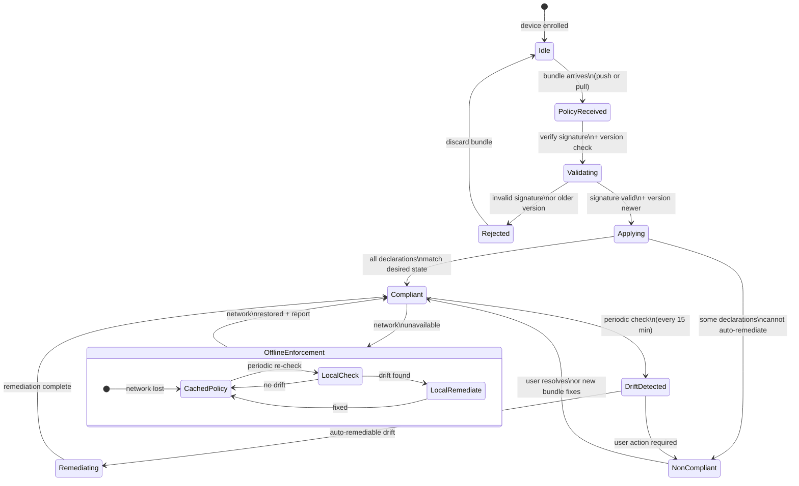
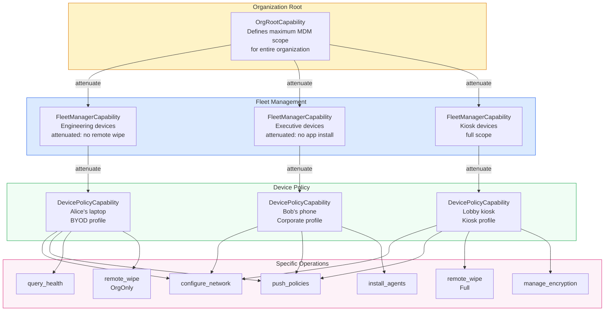
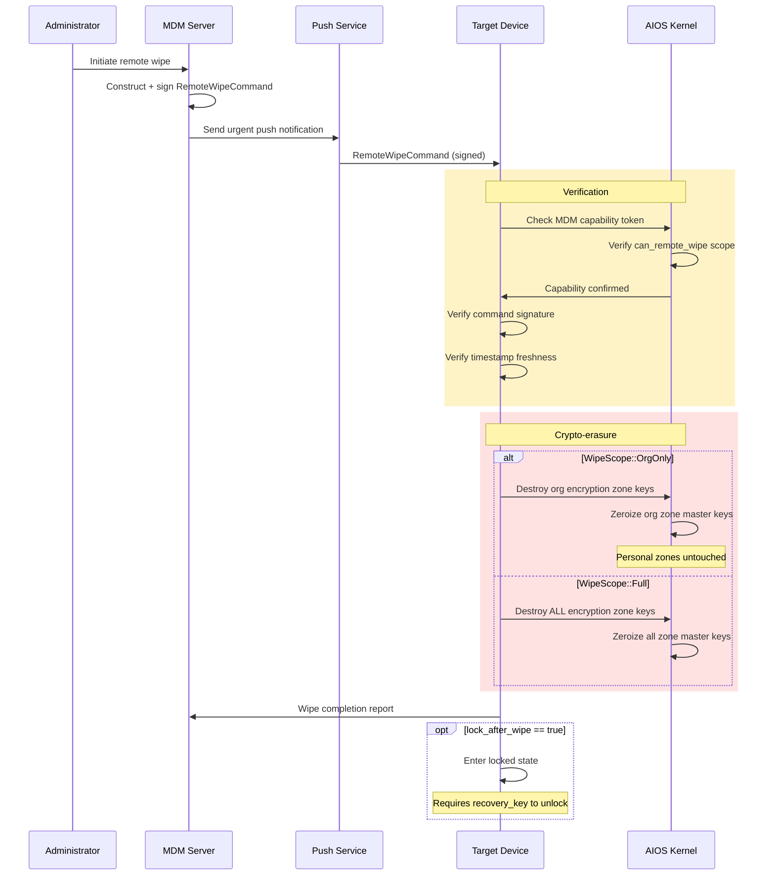
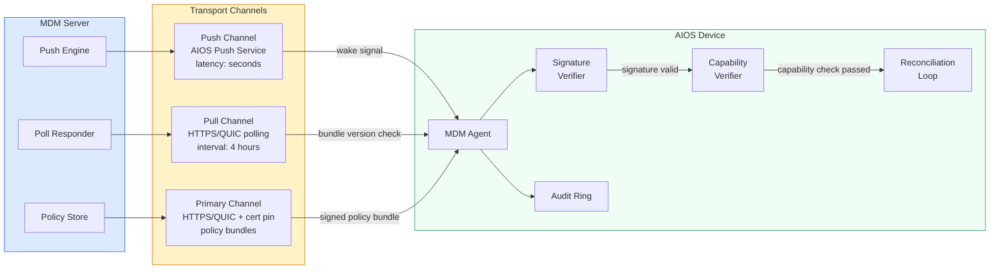

# AIOS Mobile Device Management

Part of: [multi-device.md](../multi-device.md) — Multi-Device & Enterprise Architecture
**Related:** [pairing.md](./pairing.md) — Device Pairing, [fleet.md](./fleet.md) — Fleet Management, [policy.md](./policy.md) — Policy Engine

---

## §5.1 Declarative Device Management

Traditional MDM systems issue imperative commands: "install this certificate," "set this restriction," "configure this WiFi network." The device executes each command sequentially, has no memory of overall desired state, and cannot self-correct if something drifts. If the MDM server is unreachable, the device is unmanaged.

AIOS adopts a declarative model inspired by Apple's Declarative Device Management (DDM). The MDM server declares the **desired state** of the device. The device autonomously compares desired state against current state, applies any needed changes, and continuously monitors for drift. This model is self-healing, offline-resilient, and event-driven.

**Key properties of declarative management:**

- **Desired state, not commands.** The MDM server sends a `DeclarativePolicyBundle` describing what the device should look like. The device figures out how to get there.
- **Self-healing.** If a user or process modifies a managed configuration, the device detects the drift and restores the desired state without server contact.
- **Offline enforcement.** After receiving the initial policy bundle, the device enforces it indefinitely without network connectivity.
- **Event-driven reporting.** The device reports state changes to the MDM server as they occur. The server does not poll devices for status.
- **Idempotent application.** Applying the same policy bundle twice produces the same result. No side effects from repeated reconciliation.

```rust
/// A signed bundle of declarations describing the desired device state.
/// The MDM server constructs and signs this bundle; the device enforces it.
pub struct DeclarativePolicyBundle {
    /// Unique identifier for this bundle revision.
    pub bundle_id: [u8; 16],
    /// Monotonically increasing version. Device rejects older versions.
    pub version: u64,
    /// Organization certificate that signed this bundle.
    pub issuer: OrgCertificate,
    /// Ordered list of declarations (configuration, activation, asset, management).
    pub declarations: [Declaration; MAX_DECLARATIONS],
    /// Number of active declarations in the array.
    pub declaration_count: u16,
    /// Referenced assets (certificates, profiles, scripts).
    pub assets: [AssetReference; MAX_ASSETS],
    /// Number of active assets in the array.
    pub asset_count: u16,
    /// Predicates: conditions under which specific declarations activate
    /// (e.g., "only on WiFi," "only in geo-fence X").
    pub predicates: [Predicate; MAX_PREDICATES],
    /// Number of active predicates in the array.
    pub predicate_count: u16,
    /// Ed25519 signature over all preceding fields by the issuer.
    pub signature: [u8; 64],
}

/// Maximum declarations, assets, and predicates per bundle.
pub const MAX_DECLARATIONS: usize = 64;
pub const MAX_ASSETS: usize = 32;
pub const MAX_PREDICATES: usize = 16;

/// A single declaration within a policy bundle.
pub struct Declaration {
    /// Unique identifier for this declaration.
    pub declaration_id: [u8; 16],
    /// Declaration type determines how the payload is interpreted.
    pub declaration_type: DeclarationType,
    /// Serialized payload (type-specific configuration data).
    pub payload: [u8; 512],
    /// Payload length in bytes.
    pub payload_len: u16,
    /// Priority for conflict resolution (higher wins).
    pub priority: u16,
    /// Optional predicate index — if set, declaration only activates
    /// when the referenced predicate evaluates to true.
    pub predicate_index: Option<u16>,
}

/// Declaration types follow the Apple DDM taxonomy.
pub enum DeclarationType {
    /// Configuration: WiFi, VPN, email, restrictions, passcode policy.
    Configuration,
    /// Activation: enables or disables a configuration based on predicates.
    Activation,
    /// Asset: references external data (certificates, provisioning profiles).
    Asset,
    /// Management: device-level settings (name, wallpaper, enrollment state).
    Management,
}

/// Compliance status reported by the device to the MDM server.
pub struct StatusReport {
    /// Device Ed25519 public key (identifies the reporting device).
    pub device_key: [u8; 32],
    /// The bundle version this report corresponds to.
    pub bundle_version: u64,
    /// Overall compliance state.
    pub compliance_state: ComplianceState,
    /// List of declarations that have drifted from desired state.
    pub drift_items: [DriftItem; MAX_DRIFT_ITEMS],
    /// Number of active drift items.
    pub drift_count: u16,
    /// Timestamp of report generation.
    pub timestamp: Timestamp,
    /// Signature over all preceding fields by the device key.
    pub signature: [u8; 64],
}

pub const MAX_DRIFT_ITEMS: usize = 32;

pub enum ComplianceState {
    /// All declarations match desired state.
    Compliant,
    /// One or more declarations do not match; device is actively correcting.
    Remediating,
    /// Device has detected drift but cannot auto-remediate (requires user action).
    NonCompliant,
}

/// Describes a single configuration item that has drifted.
pub struct DriftItem {
    /// The declaration that drifted.
    pub declaration_id: [u8; 16],
    /// Human-readable description of the drift.
    pub description: [u8; 128],
    /// Whether the device can auto-remediate this drift.
    pub auto_remediable: bool,
    /// Timestamp when drift was detected.
    pub detected_at: Timestamp,
}
```

**Declarative management state machine:**



**Reconciliation loop:**

The device runs a reconciliation loop that compares desired state against current state. This loop executes on four triggers: initial policy receipt, periodic timer (every 15 minutes), system event (network change, agent install), and manual request from the MDM server.

1. **Receive.** The device receives a `DeclarativePolicyBundle` via push notification or scheduled pull. It verifies the bundle signature against the organization's certificate chain and confirms the version is newer than the currently enforced bundle. Bundles with invalid signatures or older versions are rejected and logged to the audit trail.

2. **Diff.** For each declaration in the bundle, the device compares the desired state described by the declaration payload against the current device state. Declarations gated by predicates are evaluated only if their predicate is true. This produces a list of declarations that need application.

3. **Apply.** For each declaration where current state differs from desired state, the device applies the change. Configuration declarations update system settings (WiFi, VPN, restrictions). Asset declarations fetch and install referenced resources. Activation declarations enable or disable other declarations based on predicate evaluation. Each application is atomic — it either fully succeeds or the previous state is preserved.

4. **Report.** The device constructs a `StatusReport` containing its compliance state and any drift items. If the network is available, the report is sent immediately. If offline, the report is queued in local storage and batch-sent when connectivity returns.

5. **Monitor.** Every 15 minutes, the reconciliation loop re-executes the diff step. This catches drift caused by user actions, agent behavior, or system events that occurred between reconciliation cycles.

6. **Remediate.** When drift is detected, the device attempts auto-remediation by re-applying the affected declaration. If remediation succeeds, the device returns to compliant state and reports the incident. If remediation fails (e.g., the user must manually approve a certificate), the device enters non-compliant state and reports the specific drift items.

---

## §5.2 Capability-Gated MDM

In traditional operating systems, MDM agents run with administrator or root privileges. They can read any file, modify any setting, and observe any user activity. Users have no visibility into what the MDM agent is doing. This creates a fundamental trust imbalance — the organization has full access, the user has no transparency.

AIOS eliminates this imbalance through capability-gated MDM. The MDM agent is a regular user-space agent, not a kernel component and not a privileged process. During enrollment, the device grants the MDM agent a scoped `CapabilityToken` that explicitly enumerates what the agent can and cannot do. The user can inspect this token through Inspector (see [inspector.md](../../applications/inspector.md)) at any time.

**Capability scoping principles:**

- The MDM agent receives **only** the capabilities listed in its enrollment profile. No implicit privileges.
- Capabilities can be **attenuated** (narrowed) by the organization for specific device groups. They can never be **escalated** beyond what the enrollment profile defines.
- The kernel enforces capability checks on every operation. The MDM agent cannot bypass the capability system — it uses the same syscall interface and capability gates as any other agent.
- All MDM operations are recorded in the kernel audit ring (see [operations.md](../../security/model/operations.md) §7), providing a tamper-evident log that both the user and the organization can review.

```rust
/// Fine-grained capability scope granted to the MDM agent during enrollment.
/// Each field controls a specific class of management operations.
pub struct MdmCapabilityScope {
    /// Whether the MDM agent can configure network settings (WiFi, VPN, proxy).
    pub can_configure_network: bool,
    /// Whether the MDM agent can push declarative policy bundles.
    pub can_push_policies: bool,
    /// Whether the MDM agent can install or remove agents on the device.
    pub can_install_agents: bool,
    /// Scope of remote wipe capability.
    pub can_remote_wipe: WipeScope,
    /// Whether the MDM agent can query device health metrics
    /// (battery, storage, thermal state, OS version).
    pub can_query_device_health: bool,
    /// Scope of audit log access.
    pub can_read_audit_log: AuditScope,
    /// Whether the MDM agent can manage encryption zone keys.
    pub can_manage_encryption: bool,
    /// List of Space ID patterns the MDM agent can access.
    /// Patterns use prefix matching: "org/*" matches all organizational spaces.
    /// The kernel rejects any access to spaces not matching these patterns.
    pub accessible_spaces: [SpacePattern; MAX_SPACE_PATTERNS],
    /// Number of active space patterns.
    pub space_pattern_count: u8,
    /// The highest trust level the MDM agent itself operates at.
    /// Prevents MDM from granting higher trust to agents it installs.
    pub max_trust_level: TrustLevel,
}

pub const MAX_SPACE_PATTERNS: usize = 16;

/// A space access pattern for capability scoping.
/// Uses prefix matching against SpaceId path components.
pub struct SpacePattern {
    /// Pattern string (e.g., "org/*", "org/engineering/*").
    pub pattern: [u8; 64],
    /// Pattern length in bytes.
    pub len: u8,
    /// Access level granted for matching spaces.
    pub access: SpaceAccess,
}

pub enum SpaceAccess {
    /// Read-only access to space metadata and objects.
    ReadOnly,
    /// Read-write access to space objects.
    ReadWrite,
    /// Full control including space creation, deletion, and encryption.
    Full,
}

/// Remote wipe scope.
pub enum WipeScope {
    /// MDM cannot trigger remote wipe.
    None,
    /// MDM can wipe only organizational encryption zones.
    OrgOnly,
    /// MDM can wipe all encryption zones (corporate-owned devices only).
    Full,
}

/// Audit log access scope.
pub enum AuditScope {
    /// MDM cannot read audit logs.
    None,
    /// MDM can read only organizational events (MDM operations, org agent activity).
    OrgEvents,
    /// MDM can read all audit events (corporate-owned devices only).
    AllEvents,
}
```

**Capability token hierarchy:**

The MDM capability system follows the same attenuation model as all AIOS capabilities (see [capabilities.md](../../security/model/capabilities.md) §3). Capabilities flow from the organization root down through fleet groups to individual device policies. At each level, capabilities can be narrowed but never widened.



**Inspector integration:** The user can open Inspector at any time and see the MDM agent's exact capability token. Inspector displays the `MdmCapabilityScope` fields in plain language — for example, "This MDM agent can: configure WiFi and VPN, push policies, query device health. It cannot: read your personal spaces, trigger remote wipe of personal data, access your personal Flow history." This transparency is a core AIOS differentiator. See [inspector.md](../../applications/inspector.md) for the Inspector UI.

---

## §5.3 Enrollment Profiles

Enrollment profiles map device ownership models to capability sets. Each profile type represents a different balance between organizational control and user privacy. The enrollment server assigns a profile during enrollment (see [pairing.md](./pairing.md) §3.3), and the profile determines the `MdmCapabilityScope` granted to the MDM agent.

```rust
/// Enrollment profile assigned to a device during organizational enrollment.
pub struct EnrollmentProfile {
    /// Unique identifier for this profile.
    pub profile_id: [u8; 16],
    /// Device ownership and management model.
    pub profile_type: ProfileType,
    /// Capability scope granted to the MDM agent under this profile.
    pub capability_scope: MdmCapabilityScope,
    /// Agents that the MDM is allowed to install on this device.
    pub allowed_agents: [AgentIdentifier; MAX_ALLOWED_AGENTS],
    /// Number of allowed agents.
    pub allowed_agent_count: u8,
    /// Policies that must be enforced on this device.
    pub required_policies: [PolicyReference; MAX_REQUIRED_POLICIES],
    /// Number of required policies.
    pub required_policy_count: u8,
    /// Whether the device may contain personal (non-organizational) spaces.
    pub personal_space_allowed: bool,
    /// Under what conditions the user may unenroll this device.
    pub unenroll_policy: UnenrollPolicy,
}

pub const MAX_ALLOWED_AGENTS: usize = 32;
pub const MAX_REQUIRED_POLICIES: usize = 16;

pub enum ProfileType {
    /// User-owned device with organizational overlay.
    Byod,
    /// Organization-owned device with personal space separation.
    Corporate,
    /// Single-purpose locked-down device.
    Kiosk,
}

pub enum UnenrollPolicy {
    /// User can unenroll at any time. Org data is wiped; personal data preserved.
    UserAllowed,
    /// Only an administrator can unenroll this device.
    AdminOnly,
    /// Unenrollment is disabled (factory reset required to remove MDM).
    Disabled,
}

/// Identifies an agent the MDM is permitted to install.
pub struct AgentIdentifier {
    /// Agent bundle identifier (reverse-DNS format).
    pub bundle_id: [u8; 64],
    /// Minimum required version (0 = any version).
    pub min_version: u32,
    /// Content hash of the signed agent manifest.
    pub manifest_hash: ContentHash,
}

/// Reference to a policy that must be enforced.
pub struct PolicyReference {
    /// Policy identifier within the organization's policy catalog.
    pub policy_id: [u8; 16],
    /// Minimum acceptable policy version.
    pub min_version: u64,
}
```

**Three enrollment types:**

**1. BYOD (Bring Your Own Device).** The user owns the device and chooses to enroll it for organizational access. The MDM agent receives the narrowest capability set — scoped exclusively to organizational spaces. Personal spaces, personal Flow history, personal AIRS context, and personal identity data are invisible to the MDM agent. The kernel enforces this boundary through capability checks on every space access. The user can unenroll at any time; unenrollment destroys organizational encryption zone keys (crypto-erasure of org data) while preserving all personal data.

**2. Corporate-Owned.** The organization owns the device and issues it to the user. The MDM agent receives broad capabilities covering system settings, agent installation, encryption management, and all organizational spaces. Personal spaces are permitted but clearly separated — the user understands this is an organizational device. The MDM agent still cannot access personal spaces unless the profile explicitly grants that access (which the user can verify through Inspector). Unenrollment requires administrator approval.

**3. Kiosk.** A single-purpose device managed entirely by the organization. No personal spaces exist. The device runs a single agent or a small set of agents defined by the enrollment profile. The MDM agent has complete control over the device, including full remote wipe capability. Used for shared workstations, point-of-sale terminals, digital signage, and conference room displays. Unenrollment is disabled — factory reset is the only way to remove MDM.

**Profile comparison:**

| Dimension | BYOD | Corporate | Kiosk |
|---|---|---|---|
| Device ownership | User | Organization | Organization |
| MDM scope | Org spaces only | All spaces (personal separated) | Full device |
| Personal data visible to MDM | No | No (unless explicitly granted) | N/A (no personal spaces) |
| Remote wipe scope | OrgOnly | Full | Full |
| Agent installation | Org-approved list only | Org-approved list | MDM-defined set |
| Encryption control | Org zones only | All zones | All zones |
| User unenrollment | Allowed (org data wiped) | Admin approval required | Disabled |
| Network configuration | Org networks only | All networks | All networks |
| Audit log access | Org events only | All events | All events |
| Personal spaces allowed | Yes | Yes (separated) | No |

---

## §5.4 Remote Wipe & Lock

When a device is lost, stolen, or compromised, the organization needs to ensure that organizational data is irrecoverable. AIOS implements remote wipe through **crypto-erasure** — destroying encryption zone keys rather than overwriting data. This approach is instant (no time-consuming disk overwrite), irrecoverable (AES-256-GCM encrypted data without keys is computationally infeasible to recover), and scope-aware (BYOD devices wipe only organizational zones).

See [encryption.md](../../storage/spaces/encryption.md) §6 for the encryption zone and key management architecture that underpins crypto-erasure.

```rust
/// Signed command to remotely wipe or lock a device.
/// Issued by the MDM server and verified by the device before execution.
pub struct RemoteWipeCommand {
    /// Unique command identifier for audit and deduplication.
    pub command_id: [u8; 16],
    /// Target device public key.
    pub target_device: [u8; 32],
    /// Scope of the wipe operation.
    pub wipe_scope: WipeScope,
    /// Whether to lock the device after wiping.
    pub lock_after_wipe: bool,
    /// Recovery key required to unlock after remote lock.
    /// None if lock_after_wipe is false.
    pub recovery_key: Option<[u8; 32]>,
    /// Public key of the administrator issuing the command.
    pub issuer: [u8; 32],
    /// Timestamp of command issuance. Device rejects commands
    /// older than 24 hours to prevent replay.
    pub timestamp: Timestamp,
    /// Ed25519 signature over all preceding fields by the issuer.
    pub signature: [u8; 64],
}
```

**Wipe sequence:**



**Detailed wipe steps:**

1. **Command delivery.** The MDM server constructs a `RemoteWipeCommand`, signs it with the administrator's key, and sends it via the push notification channel (see §5.5). If the device is offline, the command is queued and delivered when the device reconnects. The command also propagates via the polling channel as a fallback.

2. **Capability verification.** The device kernel checks the MDM agent's `CapabilityToken` for `can_remote_wipe` and verifies the scope matches the command's `wipe_scope`. A BYOD-enrolled MDM agent with `WipeScope::OrgOnly` cannot execute a `WipeScope::Full` command — the kernel rejects it. This check happens at the kernel level, not in the MDM agent itself.

3. **Command authentication.** The device verifies the Ed25519 signature on the command against the organization's certificate chain. It also checks that the timestamp is within the acceptable window (24 hours) to prevent replay attacks. Invalid or expired commands are rejected and logged.

4. **Key destruction.** The kernel destroys the master keys for the scoped encryption zones. For `OrgOnly` wipe, only encryption zones associated with organizational spaces (matching `org/*` patterns) have their keys zeroized. For `Full` wipe, all encryption zone keys are destroyed. Key zeroization uses constant-time memory clearing to prevent recovery from RAM remnants.

5. **Completion report.** The device sends a wipe completion report to the MDM server, confirming which encryption zones were destroyed and whether any errors occurred. This report is signed by the device key and logged in the audit ring.

6. **Post-wipe lock (optional).** If `lock_after_wipe` is true, the device enters a locked state that requires the `recovery_key` to unlock. The lock screen displays organizational branding and a contact message (e.g., "This device belongs to Acme Corp. Call 555-0100 if found."). The recovery key is held by the organization's IT department and is not stored on the device.

**Remote lock without wipe.** The MDM server can also issue a lock command without data destruction. This is useful when a device is temporarily misplaced — the organization locks it to prevent unauthorized access, and unlocks it when the user recovers it. The lock command uses the same `RemoteWipeCommand` structure with `wipe_scope` set to `WipeScope::None` (the lock_after_wipe field drives the lock behavior independently).

---

## §5.5 Configuration Channels

MDM policies flow from the server to the device through three complementary channels. Each channel provides different latency, reliability, and offline characteristics. The device accepts policies from any channel, provided the policy bundle passes signature verification.

```rust
/// Configuration for an MDM communication channel.
pub struct ConfigurationChannel {
    /// Channel transport type.
    pub channel_type: ChannelType,
    /// MDM server endpoint URL (HTTPS or QUIC).
    pub endpoint_url: [u8; 256],
    /// URL length in bytes.
    pub endpoint_url_len: u16,
    /// SHA-256 pin of the MDM server's TLS certificate.
    /// Device rejects connections to servers with different certificates.
    pub server_cert_pin: ContentHash,
    /// Polling interval in seconds (only used for Pull and Hybrid channels).
    /// Default: 14400 (4 hours).
    pub poll_interval_secs: u32,
    /// Push token issued by the AIOS Push Notification Service.
    /// Used to route push notifications to this device.
    pub push_token: [u8; 64],
    /// Push token length in bytes.
    pub push_token_len: u8,
    /// Timestamp of the last successful sync with the MDM server.
    pub last_sync: Timestamp,
}

pub enum ChannelType {
    /// Push-only: device receives urgent commands via push notification.
    /// Used for remote wipe, immediate policy updates, lock commands.
    Push,
    /// Pull-only: device periodically polls the MDM server for updates.
    /// Fallback when push infrastructure is unavailable.
    Pull,
    /// Hybrid: push for urgent commands, pull for routine policy sync.
    /// Default and recommended configuration.
    Hybrid,
}
```

**Channel descriptions:**

**Primary channel — signed policy bundles over HTTPS/QUIC.** The primary communication channel uses HTTPS (HTTP/2 over TLS 1.3) or QUIC (HTTP/3) for all policy exchange. The device pins the MDM server's TLS certificate to prevent MITM attacks via compromised certificate authorities. All policy bundles transmitted over this channel are additionally signed by the organization's Ed25519 certificate chain —TLS provides transport security, while bundle signatures provide end-to-end authenticity. See [protocols.md](../networking/protocols.md) §5 for QUIC and TLS integration details.

**Push channel —AIOS Push Notification Service.** For time-sensitive commands (remote wipe, immediate policy updates, device lock), the MDM server sends push notifications through the AIOS Push Notification Service (APNS-equivalent). The device maintains a persistent connection to the push service, which wakes the MDM agent when a notification arrives. Push notifications carry only a signal to fetch the actual command — the command payload flows through the primary HTTPS/QUIC channel after the device is woken. This separation ensures that even if the push service is compromised, no sensitive data or commands flow through it.

**Polling fallback.** When the push channel is unavailable (e.g., restrictive network firewalls, push service outage), the device falls back to periodic polling. The default interval is 4 hours, configurable by the MDM server via the enrollment profile. During each poll, the device sends its current bundle version and compliance state; the server responds with any newer policy bundles. Polling uses the same HTTPS/QUIC channel with certificate pinning.

**Security invariants across all channels:**

- Every policy bundle is signed by the organization's Ed25519 certificate chain. The device rejects unsigned or incorrectly signed bundles regardless of the transport channel.
- Bundle versions are monotonically increasing. The device rejects bundles with a version equal to or lower than the currently enforced version, preventing rollback attacks.
- Command timestamps must be within a 24-hour window to prevent replay.
- All channel communications are logged in the kernel audit ring.
- The MDM agent's capability token is checked before any received command is executed — even a validly signed command is rejected if it exceeds the MDM agent's granted capabilities.


