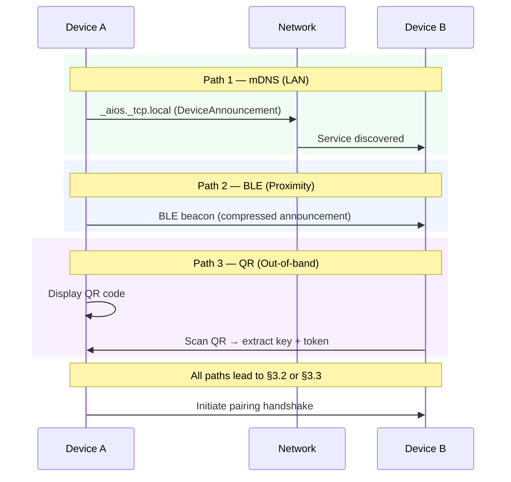
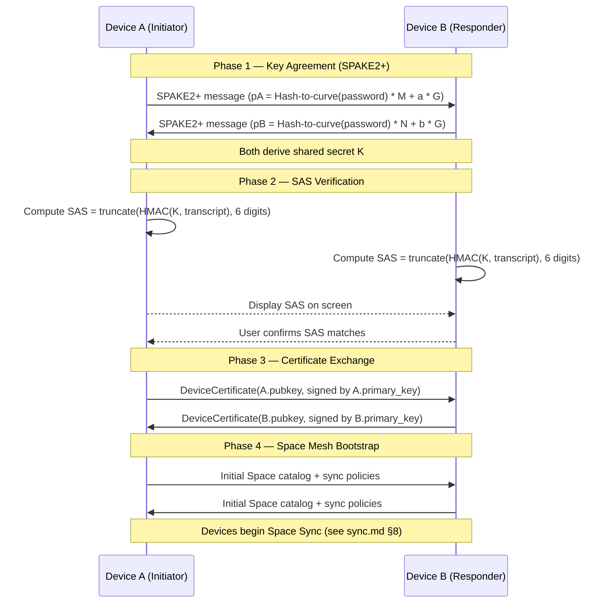
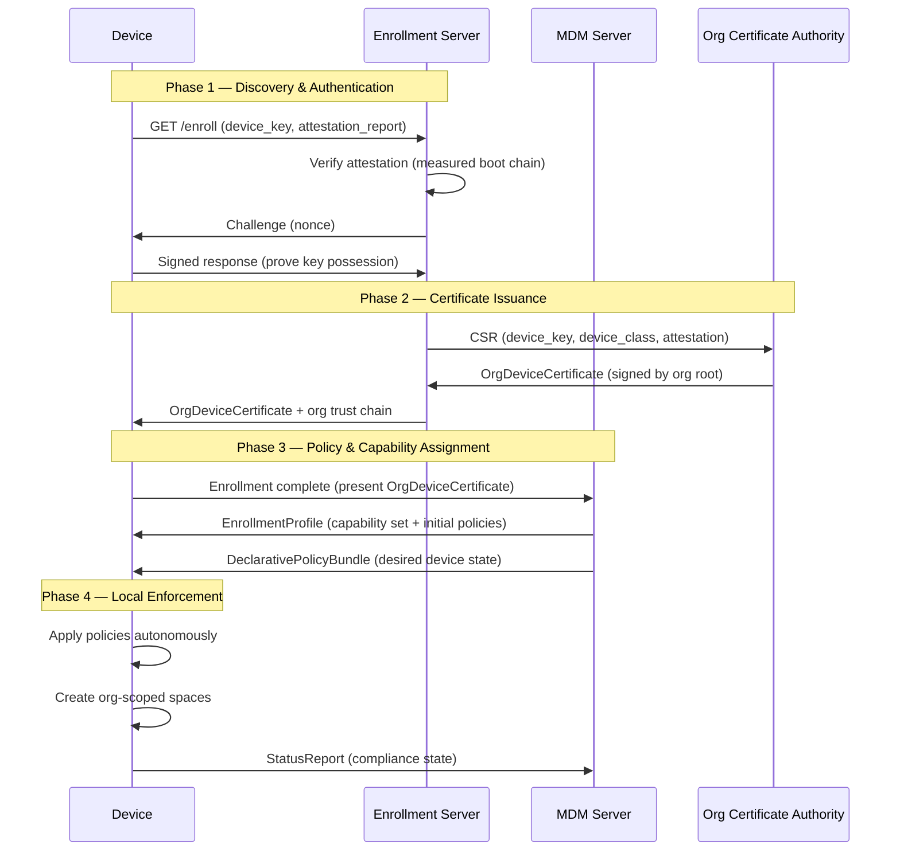

# AIOS Device Pairing & Trust Establishment

Part of: [multi-device.md](../multi-device.md) — Multi-Device & Enterprise Architecture
**Related:** [experience.md](./experience.md) — Multi-Device Experience, [mdm.md](./mdm.md) — Mobile Device Management

---

## §3.1 Discovery Protocols

AIOS devices discover each other through three complementary channels, selected based on proximity and network availability.

**mDNS/DNS-SD (LAN discovery):** Devices on the same local network advertise presence via `_aios._tcp.local` service records. The Space Resolver (see [networking/components.md](../networking/components.md) §3.1) handles resolution. Each announcement includes the device's Ed25519 public key fingerprint, display name, and supported pairing methods.

**BLE Advertisement (proximity discovery):** For devices not on the same network, BLE beacons carry a compressed DeviceAnnouncement. Range-limited to ~10 meters, providing implicit physical proximity verification. BLE discovery triggers automatically when a user opens the pairing UI.

**QR Code (out-of-band bootstrap):** For air-gapped or cross-network scenarios, Device A displays a QR code containing its public key, IP address (if available), and a one-time pairing token. Device B scans the code to initiate the pairing handshake. This path provides the strongest MITM protection because the key exchange happens out-of-band.

```rust
/// Signed device discovery announcement.
/// Broadcast via mDNS, BLE, or encoded in QR.
pub struct DeviceAnnouncement {
    /// Ed25519 public key of the announcing device.
    pub device_key: [u8; 32],
    /// Human-readable device name (e.g., "Alice's Laptop").
    pub display_name: [u8; 64],
    /// Supported pairing methods (bitmask).
    pub methods: PairingMethods,
    /// Device hardware class (laptop, phone, tablet, desktop).
    pub device_class: DeviceClass,
    /// One-time pairing token (for QR path).
    pub pairing_token: Option<[u8; 16]>,
    /// Signature over all preceding fields.
    pub signature: [u8; 64],
}

bitflags! {
    pub struct PairingMethods: u8 {
        const MDNS      = 0b0001;
        const BLE       = 0b0010;
        const QR        = 0b0100;
        const MDM       = 0b1000;
    }
}
```

Discovery is **passive by default** — devices do not broadcast unless the user explicitly enables pairing mode or an MDM policy mandates discoverability. This prevents tracking via persistent BLE beacons.



---

## §3.2 Personal Pairing Ceremony

Personal pairing establishes peer-to-peer trust between two devices owned by the same user, with no central authority. The protocol extends the pairing ceremony described in [identity.md](../../experience/identity.md) §8.1 with full cryptographic details.

**Protocol: SPAKE2+ Key Agreement with SAS Verification**

The pairing ceremony uses SPAKE2+ (RFC 9383) for password-authenticated key exchange, where the "password" is either the QR-encoded token or a user-entered PIN. This prevents MITM attacks even over unauthenticated channels (BLE, mDNS).



**SAS (Short Authentication String):** Both devices independently compute a 6-digit code from the shared secret. The user visually confirms the codes match on both screens. This human verification step ensures no MITM has intercepted the key exchange. If codes don't match, pairing is aborted and both devices discard the session.

**Certificate exchange:** After SAS verification, each device issues a DeviceCertificate to the other, signed by its primary identity key. These certificates are stored in the device's identity keyring and authorize future Space Sync and Peer Protocol connections without repeating the pairing ceremony.

```rust
/// Certificate issued during pairing, authorizing a remote device.
pub struct DeviceCertificate {
    /// Public key of the certified device.
    pub device_key: [u8; 32],
    /// Public key of the issuing device (the one that trusts this device).
    pub issuer_key: [u8; 32],
    /// Device class and display name.
    pub device_info: DeviceInfo,
    /// Timestamp of certificate issuance.
    pub issued_at: Timestamp,
    /// Optional expiry (None = valid until revoked).
    pub expires_at: Option<Timestamp>,
    /// Capabilities granted to this device (space sync scope).
    pub granted_capabilities: DeviceCapabilitySet,
    /// Ed25519 signature by issuer_key over all preceding fields.
    pub signature: [u8; 64],
}

/// Capabilities granted to a paired device.
pub struct DeviceCapabilitySet {
    /// Which spaces this device may sync.
    pub sync_spaces: SpaceSyncPolicy,
    /// Whether this device can initiate Flow transfers.
    pub flow_access: bool,
    /// Whether this device can participate in display continuity.
    pub display_continuity: bool,
    /// Whether this device can act as an input source (keyboard/mouse sharing).
    pub input_sharing: bool,
}
```

**Space Mesh bootstrap:** Immediately after certificate exchange, both devices exchange their Space catalogs — a list of spaces and their sync policies. This determines which spaces will sync between the devices. The user's primary device defines default sync policies; secondary devices inherit them unless overridden. Actual data synchronization begins via the Merkle exchange protocol described in [sync.md](../../storage/spaces/sync.md) §8.

---

## §3.3 Organizational Enrollment

Organizational enrollment establishes a managed device relationship with a central MDM server. Unlike personal pairing, the trust is asymmetric: the organization grants scoped capabilities to the device, and the device presents hardware attestation to prove its integrity.

**Enrollment flow:**



**Hardware attestation (Phase 1):** The device presents a `DeviceAttestationReport` (see §3.4) containing measured boot chain evidence. The enrollment server verifies that the device is running genuine AIOS firmware and kernel — not a modified build. This step is critical for zero-trust enrollment: the organization trusts the device hardware and boot integrity, not just the network connection.

**Org certificate (Phase 2):** The organization's Certificate Authority issues an `OrgDeviceCertificate` binding the device's Ed25519 key to the organization's identity chain. This certificate is distinct from personal `DeviceCertificate`s — it carries organizational scope and capability constraints defined by the enrollment profile.

**Policy assignment (Phase 3):** The MDM server assigns an `EnrollmentProfile` (see [mdm.md](./mdm.md) §5.3) that maps to a specific capability set. A BYOD device receives narrow capabilities scoped to organizational spaces. A corporate-owned device receives broader capabilities. The device also receives its initial `DeclarativePolicyBundle` containing the desired device state.

**Autonomous enforcement (Phase 4):** The device applies the policy bundle locally, creates organizational spaces, and reports compliance status to the MDM server. From this point forward, the device enforces policies autonomously — it does not wait for the MDM server to push commands. See [mdm.md](./mdm.md) §5.1 for the declarative management model.

---

## §3.4 Trust Establishment & Attestation

Hardware attestation proves that a device is running genuine, unmodified AIOS. This is the foundation of zero-trust device management — the organization verifies the device's integrity before granting any access.

**Measured boot chain:** During boot, each stage measures (hashes) the next stage before executing it. The UEFI stub measures the kernel image. The kernel measures loaded agents. These measurements are stored in a tamper-evident log (analogous to TPM PCR registers on ARM platforms with TrustZone or the Apple Secure Enclave).

See [hardening.md](../../security/model/hardening.md) §5 for ARM hardware security primitives (TrustZone, PAC, BTI, MTE) that underpin attestation.

```rust
/// Hardware attestation report presented during enrollment.
/// Proves device integrity via measured boot chain.
pub struct DeviceAttestationReport {
    /// Device Ed25519 public key.
    pub device_key: [u8; 32],
    /// Hash of UEFI firmware.
    pub firmware_hash: ContentHash,
    /// Hash of kernel image.
    pub kernel_hash: ContentHash,
    /// Hash of boot configuration (Secure Boot keys, boot flags).
    pub boot_config_hash: ContentHash,
    /// Ordered list of boot stage measurements.
    pub boot_chain: [BootMeasurement; 8],
    /// Platform attestation evidence (TrustZone quote or Secure Enclave attestation).
    pub platform_evidence: PlatformEvidence,
    /// Timestamp of report generation.
    pub generated_at: Timestamp,
    /// Nonce from the enrollment server (prevents replay).
    pub challenge_nonce: [u8; 32],
    /// Signature over entire report by device key.
    pub signature: [u8; 64],
}

pub struct BootMeasurement {
    /// Boot stage name (e.g., "uefi-stub", "kernel", "init-agents").
    pub stage: [u8; 32],
    /// SHA-256 hash of the stage binary.
    pub measurement: ContentHash,
    /// Expected measurement from the signed manifest.
    pub expected: ContentHash,
    /// Whether this stage passed verification.
    pub verified: bool,
}

/// Platform-specific attestation evidence.
pub enum PlatformEvidence {
    /// ARM TrustZone attestation.
    TrustZone {
        /// Signed attestation token from secure world.
        token: [u8; 256],
    },
    /// Apple Secure Enclave attestation.
    SecureEnclave {
        /// Device attestation certificate chain.
        cert_chain: [u8; 1024],
    },
    /// TPM 2.0 quote (for x86 or ARM with discrete TPM).
    Tpm2 {
        /// TPM quote over PCR values.
        quote: [u8; 512],
        /// AIK certificate.
        aik_cert: [u8; 512],
    },
    /// Software-only attestation (for development/QEMU).
    /// NOT acceptable for production organizational enrollment.
    SoftwareOnly {
        /// Self-signed attestation (for testing only).
        self_report: [u8; 128],
    },
}
```

**Continuous attestation:** Attestation is not a one-time event. The device periodically regenerates its attestation report and submits it to the MDM server (or on-demand when the MDM requests it). If the device's boot chain changes (e.g., OS update, firmware modification), the attestation report reflects the new measurements. The MDM server compares against known-good manifests to detect tampering.

**Attestation for personal pairing:** While organizational enrollment requires full attestation, personal pairing uses a lighter-weight version. Device A can optionally request Device B's attestation report during the pairing ceremony to verify it is running genuine AIOS. This is advisory (the user decides whether to proceed) rather than mandatory.

---

## §3.5 Device Revocation & Lost Device

When a device is lost, stolen, or decommissioned, its trust must be revoked across the entire device mesh or organization fleet. AIOS supports both user-initiated and MDM-initiated revocation.

**User-initiated revocation (personal mode):** The user triggers revocation from any remaining trusted device. This extends [identity.md](../../experience/identity.md) §8.2 (revoke_device):

1. The revoking device generates a `RevocationCertificate` signed by the user's primary key
2. The certificate is propagated to all devices in the Space Mesh via the Peer Protocol
3. Each device removes the revoked device's `DeviceCertificate` from its keyring
4. All active Peer Protocol sessions with the revoked device are terminated
5. Space Sync stops pushing data to the revoked device
6. If the revoked device comes online later, it is rejected by all peers

**MDM-initiated revocation (organizational mode):**

1. The administrator marks the device as revoked in the fleet management console
2. The MDM server issues a signed `OrgRevocationCommand` to all fleet devices
3. Each device adds the revoked device's key to a Certificate Revocation List (CRL)
4. The MDM server can additionally trigger remote wipe (see [mdm.md](./mdm.md) §5.4)

```rust
/// Certificate revoking a device's trust.
pub struct RevocationCertificate {
    /// Public key of the device being revoked.
    pub revoked_key: [u8; 32],
    /// Public key of the authority issuing the revocation.
    pub issuer_key: [u8; 32],
    /// Reason for revocation.
    pub reason: RevocationReason,
    /// Timestamp of revocation.
    pub revoked_at: Timestamp,
    /// Signature by issuer_key.
    pub signature: [u8; 64],
}

pub enum RevocationReason {
    /// Device lost or stolen — trigger remote wipe if possible.
    LostOrStolen,
    /// Device decommissioned — normal lifecycle end.
    Decommissioned,
    /// Device compromised — security incident.
    Compromised,
    /// User removed device from their mesh.
    UserRemoved,
    /// MDM unenrolled device from organization.
    OrgUnenrolled,
}
```

**Crypto-erasure on the revoked device:** If the revoked device receives the revocation command (e.g., it was not physically stolen), it performs crypto-erasure of organizational data by destroying the encryption zone keys for org-scoped spaces. Personal data on a BYOD device is preserved. See [encryption.md](../../storage/spaces/encryption.md) §6 for encryption zone key management.

**Offline revocation:** If the revoked device is offline, revocation takes effect when it next connects to any peer or the MDM server. The CRL is distributed across the mesh, so even if the revoked device contacts a different peer first, it will be rejected.
