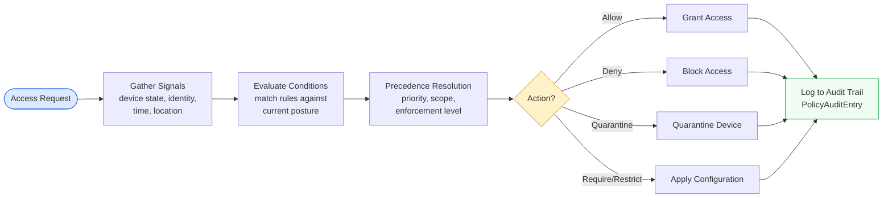
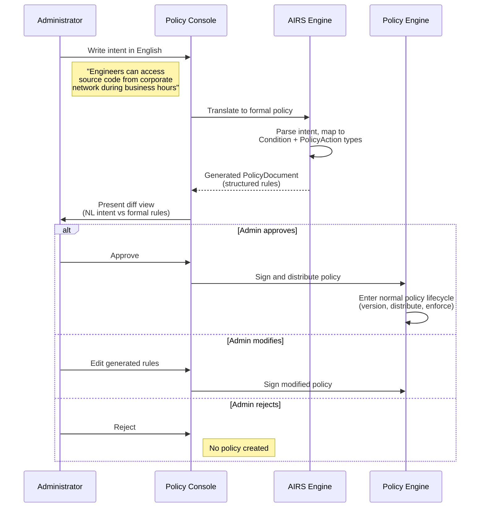

# AIOS Policy Engine

Part of: [multi-device.md](../multi-device.md) — Multi-Device & Enterprise Architecture
**Related:** [mdm.md](./mdm.md) — Mobile Device Management, [fleet.md](./fleet.md) — Fleet Management, [data-protection.md](./data-protection.md) — Data Protection

---

## §7.1 Declarative Policy Model

Policies are data, not code. A `PolicyDocument` defines desired device state as a set of typed rules with conditions and actions. Policies are versioned, signed by the issuing authority (organization certificate chain), and stored in the `system/mdm/policies/` space (see [spaces/data-structures.md](../../storage/spaces/data-structures.md) §3.1 for space path conventions).

The declarative model aligns with AIOS design principle §11.2 (declarative configuration): the MDM server declares *what* should be true, and the device autonomously enforces *how*. Self-healing follows naturally — if device state drifts from the declared policy, the device corrects itself without server contact.

```rust
/// A signed, versioned policy document containing typed rules.
/// Stored in `system/mdm/policies/` space, distributed via MDM protocol.
pub struct PolicyDocument {
    /// Unique identifier for this policy.
    pub policy_id: PolicyId,
    /// Monotonically increasing version number.
    pub version: u32,
    /// Human-readable policy name (max 128 bytes, UTF-8).
    pub name: [u8; 128],
    /// Description of the policy's purpose (max 512 bytes, UTF-8).
    pub description: [u8; 512],
    /// Certificate reference identifying the issuing organization.
    pub issuer: OrgCertificateRef,
    /// Ordered list of rules evaluated during policy enforcement.
    pub rules: [Option<PolicyRule>; MAX_RULES_PER_DOCUMENT],
    /// Number of active rules in the `rules` array.
    pub rule_count: u16,
    /// Timestamp from which the policy takes effect.
    pub effective_from: Timestamp,
    /// Optional expiration timestamp (None = no expiry).
    pub expires_at: Option<Timestamp>,
    /// Optional reference to the policy this version supersedes.
    pub supersedes: Option<PolicyId>,
    /// Ed25519 signature over all preceding fields.
    pub signature: [u8; 64],
}

/// Maximum number of rules in a single PolicyDocument.
pub const MAX_RULES_PER_DOCUMENT: usize = 256;
```

Each policy document contains up to 256 rules. Rules are the atomic unit of policy evaluation:

```rust
/// A single rule within a PolicyDocument.
/// Conditions are AND-combined; all must be true for the rule to match.
pub struct PolicyRule {
    /// Unique identifier for this rule within its document.
    pub rule_id: u16,
    /// Priority level (higher number = higher priority).
    pub priority: u16,
    /// Conditions that must ALL be satisfied for this rule to apply.
    pub conditions: [Option<Condition>; MAX_CONDITIONS_PER_RULE],
    /// Number of active conditions.
    pub condition_count: u8,
    /// Action to take when all conditions are met.
    pub action: PolicyAction,
    /// How strictly the action is enforced.
    pub enforcement: Enforcement,
    /// Optional automatic remediation when the rule is violated.
    pub remediation: Option<RemediationAction>,
}

/// Maximum conditions per rule. AND-combined during evaluation.
pub const MAX_CONDITIONS_PER_RULE: usize = 16;
```

Actions define what happens when a rule matches:

```rust
/// The action a policy rule takes when its conditions are satisfied.
pub enum PolicyAction {
    /// Permit the requested access or configuration.
    Allow,
    /// Deny the requested access or configuration.
    Deny,
    /// Require a specific configuration key to have a specific value.
    Require(ConfigKey, ConfigValue),
    /// Restrict a resource type to a specific limit.
    Restrict(ResourceType, Limit),
    /// Send a notification to an administrative channel.
    Notify(AdminChannel),
    /// Place the device or resource in quarantine mode.
    Quarantine,
}

/// How strictly a policy rule is enforced.
pub enum Enforcement {
    /// Must be obeyed. Cannot be overridden by Recommended rules.
    Required,
    /// Should be obeyed. Can be overridden by explicit user action
    /// (logged as a policy exception).
    Recommended,
    /// Advisory only. Logged but not enforced.
    Informational,
}
```

**Precedence rules** govern conflict resolution when multiple rules match the same request:

1. Higher `priority` number wins over lower.
2. `Deny` beats `Allow` at equal priority (fail-closed).
3. More specific scope (device-level policy) beats less specific scope (fleet-level policy).
4. Later `effective_from` wins for equal-priority, same-scope policies.
5. `Required` enforcement cannot be overridden by `Recommended` enforcement.

**Conflict resolution:** When two policies at the same priority level conflict (one `Allow`, one `Deny` for the same resource), the system defaults to `Deny` (fail-closed). The conflict is logged to the policy audit trail (see [§7.6](#76-policy-audit-trail)) and flagged to administrators via the fleet health dashboard (see [fleet.md](./fleet.md) §6.2).



---

## §7.2 Conditional Access

Access decisions are based on real-time device posture, extending the zero-trust architecture defined in [operations.md](../../security/model/operations.md) §10. Every access request triggers a posture assessment that evaluates the device's current security state against the conditions defined in the matching policy rules.

```rust
/// Real-time assessment of a device's security posture.
/// Computed on-device; only the compliance_score and boolean
/// pass/fail results are reported to the MDM server.
pub struct PostureAssessment {
    /// The device being assessed.
    pub device_id: DeviceId,
    /// Whether the OS version meets the minimum required by policy.
    pub os_version_current: bool,
    /// Whether full-disk encryption is enabled.
    pub encryption_enabled: bool,
    /// Whether the last hardware attestation was valid.
    pub attestation_valid: bool,
    /// Time elapsed since last successful attestation.
    pub attestation_age: Duration,
    /// Whether jailbreak or root modification was detected.
    pub jailbreak_detected: bool,
    /// Whether all required agents (e.g., security agent) are present.
    pub required_agents_present: bool,
    /// Composite compliance score (0-100).
    /// Derived from weighted combination of all posture fields.
    pub compliance_score: u8,
    /// Current network connectivity type.
    pub network_type: NetworkType,
    /// Whether the device is inside a configured geo-fence.
    /// None if geo-fencing is not configured for this device.
    pub location_in_fence: Option<bool>,
    /// AI-computed risk score (0-100). Requires AIRS (see
    /// intelligence/airs.md). Falls back to rule-based scoring
    /// when AIRS is unavailable.
    pub risk_score: u8,
    /// Timestamp of the most recent MDM check-in.
    pub last_check_in: Timestamp,
}

/// Network connectivity classification for conditional access.
pub enum NetworkType {
    /// Connected to a known corporate network (verified by
    /// 802.1X certificate or SSID + RADIUS authentication).
    Corporate,
    /// Connected to an untrusted public network.
    Public,
    /// Connected through a VPN tunnel to the corporate network.
    Vpn,
    /// Network type could not be determined.
    Unknown,
}
```

Conditions provide the building blocks for expressive policy rules. They compose through `And`, `Or`, and `Not` combinators:

```rust
/// A condition that must be satisfied for a PolicyRule to match.
/// Used in PolicyRule.conditions (AND-combined at the rule level).
pub enum Condition {
    /// Check a specific posture field against an expected value.
    PostureCheck(PostureField, Operator, Value),
    /// Check whether the current time falls within a recurring
    /// or one-time window (see §7.5 for TimeWindow details).
    TimeWindow(TimeWindow),
    /// Check whether the device is inside a named geo-fence
    /// (see §7.3 for GeoFence details).
    GeoFence(FenceId),
    /// Check the device's hardware class.
    DeviceClass(DeviceClassSet),
    /// Check the device's enrollment type.
    EnrollmentType(EnrollmentTypeSet),
    /// Check the current network type.
    NetworkType(NetworkTypeSet),
    /// Check whether the user belongs to a specific group
    /// (see enterprise-identity.md §8.3 for directory integration).
    UserGroup(GroupId),
    /// All sub-conditions must be true (logical AND).
    And(ConditionList),
    /// At least one sub-condition must be true (logical OR).
    Or(ConditionList),
    /// The sub-condition must be false (logical NOT).
    Not(ConditionRef),
}

/// Comparison operators for PostureCheck conditions.
pub enum Operator {
    Equal,
    NotEqual,
    GreaterThan,
    LessThan,
    GreaterOrEqual,
    LessOrEqual,
}

/// Typed values for PostureCheck comparisons.
pub enum Value {
    Bool(bool),
    U8(u8),
    Duration(Duration),
    NetworkType(NetworkType),
}

/// Posture fields that can be checked in a PostureCheck condition.
pub enum PostureField {
    OsVersionCurrent,
    EncryptionEnabled,
    AttestationValid,
    AttestationAge,
    JailbreakDetected,
    RequiredAgentsPresent,
    ComplianceScore,
    NetworkType,
    LocationInFence,
    RiskScore,
}
```

**Evaluation example:** "Allow access to `engineering/` spaces only from corporate-owned devices on the corporate network during business hours with compliance score above 90."

```rust
PolicyRule {
    rule_id: 1,
    priority: 100,
    conditions: [
        Some(Condition::And(ConditionList::from(&[
            Condition::EnrollmentType(
                EnrollmentTypeSet::from(&[EnrollmentType::Corporate]),
            ),
            Condition::NetworkType(
                NetworkTypeSet::from(&[NetworkType::Corporate]),
            ),
            Condition::TimeWindow(TimeWindow {
                window_type: TimeWindowType::Recurring,
                timezone: b"America/Los_Angeles",
                recurring: Some(RecurringSchedule {
                    start_hour: 8,
                    start_minute: 0,
                    end_hour: 18,
                    end_minute: 0,
                    days: WEEKDAYS,
                }),
                one_time: None,
                holidays: None,
            }),
            Condition::PostureCheck(
                PostureField::ComplianceScore,
                Operator::GreaterThan,
                Value::U8(90),
            ),
        ]))),
        None, None, None, None, None, None, None,
        None, None, None, None, None, None, None, None,
    ],
    condition_count: 1,
    action: PolicyAction::Allow,
    enforcement: Enforcement::Required,
    remediation: None,
}
```

The condition evaluation engine runs entirely on-device. When AIRS is available, the `risk_score` field incorporates behavioral analysis and anomaly detection (see [intelligence.md](./intelligence.md) §14.1). Without AIRS, the system falls back to a deterministic rule-based score derived from the boolean posture fields.

Cross-references: [operations.md](../../security/model/operations.md) §10 (zero trust, continuous verification), [capabilities.md](../../security/model/capabilities.md) §3 (capability token lifecycle)

---

## §7.3 Geo-Fencing

Location-based policy enforcement follows a privacy-first design. Location checks happen **on-device** --- the device evaluates whether it is inside or outside a defined geographic boundary, and only a boolean result (`in_fence` / `out_of_fence`) is reported to the MDM server. Raw coordinates never leave the device.

```rust
/// A geographic boundary used for location-based policy enforcement.
/// Stored in `system/mdm/geofences/` space.
pub struct GeoFence {
    /// Unique identifier for this geo-fence.
    pub fence_id: FenceId,
    /// Human-readable name (e.g., "HQ Campus").
    pub name: [u8; 64],
    /// Description of the fence's purpose (e.g., "Main office complex").
    pub description: [u8; 128],
    /// Geographic boundary definition.
    pub boundary: GeoBoundary,
    /// Action to apply when the device is inside the boundary.
    pub action_inside: PolicyAction,
    /// Action to apply when the device is outside the boundary.
    pub action_outside: PolicyAction,
    /// How often to re-evaluate location against this fence.
    /// Default: 30 minutes. Minimum: 5 minutes.
    pub check_interval: Duration,
    /// Allowed location sources, ordered by preference.
    pub location_sources: LocationSourceSet,
    /// Privacy mode governing what location data is reported.
    pub privacy_mode: PrivacyMode,
}

/// Geographic boundary shapes.
pub enum GeoBoundary {
    /// Circular boundary defined by center point and radius.
    Circle {
        center_lat: f64,
        center_lon: f64,
        radius_km: f32,
    },
    /// Polygon boundary defined by ordered vertices (max 32).
    /// Vertices are connected in order; the last connects to the first.
    Polygon {
        vertices: [(f64, f64); MAX_POLYGON_VERTICES],
        vertex_count: u8,
    },
}

/// Maximum vertices in a polygon geo-fence boundary.
pub const MAX_POLYGON_VERTICES: usize = 32;

/// Location data sources, ordered from most to least privacy-preserving.
pub enum LocationSource {
    /// IP-based geolocation. Coarsest (city-level), most private.
    IpGeo,
    /// WiFi BSSID database lookup. Medium precision (~100m).
    WifiBssid,
    /// Cell tower ID triangulation. Medium precision (~500m).
    CellTower,
}

/// Controls what location information is reported to the MDM server.
pub enum PrivacyMode {
    /// Report only in/out boolean. No coordinates ever leave the device.
    BooleanOnly,
    /// Enforce the geo-fence locally but never report results to the
    /// server. The geo-fence is invisible to the MDM server.
    NeverReport,
}
```

**Key design principles:**

- Coarse location sources only: IP geolocation, WiFi BSSID mapping, cell tower ID. Continuous GPS tracking is explicitly excluded from the geo-fencing design. This limits precision to city or campus level, which is sufficient for enterprise policy enforcement while preserving user privacy.
- The user can see which geo-fences are active and their boundaries through Inspector (see [inspector.md](../../applications/inspector.md)). Geo-fence definitions are not secret — only the enforcement actions may vary by trust level.
- `NeverReport` mode enables scenarios where an organization enforces location restrictions (for example, disabling the camera in a secure facility) without the server learning the device's location at all.

**Use cases:**

| Scenario | Boundary | Action Inside | Action Outside |
|---|---|---|---|
| Restrict confidential spaces to campus | Circle (HQ, 1 km) | Allow | Deny |
| Require VPN outside the country | Polygon (country border) | Allow | Require(vpn, enabled) |
| Disable camera in secure facility | Circle (lab, 200 m) | Restrict(camera, disabled) | Allow |
| Kiosk lockdown to store location | Circle (store, 500 m) | Allow | Quarantine |

---

## §7.4 Natural Language Policies

AIRS enables administrators to define policies in natural language, which are translated to formal `PolicyDocument` structures (requires AIRS runtime; see [airs.md](../../intelligence/airs.md)).

**Workflow:**



**Guardrails:**

- Generated policies are **never** automatically activated. Human approval is mandatory before any generated policy enters the enforcement pipeline.
- The system highlights ambiguity in the natural language input and asks for clarification. For example, "engineers" maps to a `UserGroup` condition — the system asks the administrator to confirm which directory group corresponds to "engineers."
- Generated policies include a `generated_from` field linking back to the original natural language description, preserving the administrator's intent for future auditing.
- The audit trail (see [§7.6](#76-policy-audit-trail)) records both the natural language input and the generated formal policy, creating a complete provenance chain.

**Translation boundaries:** The NL-to-policy translation covers the condition and action types defined in §7.1 and §7.2. It does not generate new condition types or invent capabilities beyond those in the existing policy vocabulary. If the expressed intent falls outside the supported condition/action space, AIRS returns an error describing which part of the intent could not be translated.

Cross-references: [airs.md](../../intelligence/airs.md) (LLM integration), [intelligence.md](./intelligence.md) §14.5 (NL policy translation pipeline)

---

## §7.5 Time-Based Policies

Policies support temporal conditions for time-bound access control, maintenance windows, and temporary grants. Time conditions compose with all other condition types through the standard `Condition` combinators.

```rust
/// Temporal condition for time-based policy rules.
pub struct TimeWindow {
    /// Whether this is a recurring schedule, one-time window,
    /// or maintenance window.
    pub window_type: TimeWindowType,
    /// IANA timezone string (e.g., b"America/Los_Angeles").
    /// All time comparisons are evaluated in this timezone.
    pub timezone: [u8; 40],
    /// Recurring schedule (present when window_type is Recurring).
    pub recurring: Option<RecurringSchedule>,
    /// One-time window (present when window_type is OneTime
    /// or MaintenanceWindow).
    pub one_time: Option<OneTimeWindow>,
    /// Holiday calendar: dates treated as non-business days.
    /// Recurring schedules skip holidays automatically.
    pub holidays: Option<HolidayCalendar>,
}

/// Type of time window.
pub enum TimeWindowType {
    /// Repeats on specified days and hours every week.
    Recurring,
    /// Active during a single start-to-end interval.
    OneTime,
    /// Maintenance window: suppresses non-critical alerts and
    /// defers policy drift remediation during the window.
    MaintenanceWindow,
}

/// A weekly recurring schedule.
pub struct RecurringSchedule {
    /// Start hour (0-23) in the configured timezone.
    pub start_hour: u8,
    /// Start minute (0-59).
    pub start_minute: u8,
    /// End hour (0-23). If end < start, the window spans midnight.
    pub end_hour: u8,
    /// End minute (0-59).
    pub end_minute: u8,
    /// Bitmask of active days (bit 0 = Monday, bit 6 = Sunday).
    pub days: u8,
}

/// A single non-repeating time window.
pub struct OneTimeWindow {
    /// Start of the window (absolute timestamp).
    pub start: Timestamp,
    /// End of the window (absolute timestamp).
    pub end: Timestamp,
}

/// A list of dates treated as non-business days.
pub struct HolidayCalendar {
    /// Holiday dates (year, month, day tuples).
    pub dates: [(u16, u8, u8); MAX_HOLIDAYS],
    /// Number of active entries.
    pub count: u16,
}

/// Maximum holidays in a calendar.
pub const MAX_HOLIDAYS: usize = 64;
```

**Use cases:**

| Scenario | Window Type | Effect |
|---|---|---|
| Business hours access | Recurring (M-F 8:00--18:00) | Agents access corporate spaces only during work hours |
| Maintenance window | MaintenanceWindow (Sat 02:00--06:00) | Suppress non-critical alerts, defer remediation |
| Temporary contractor access | OneTime (2 weeks from enrollment) | Grant access for exactly the contract duration |
| Off-hours kiosk lockdown | Recurring (M-F 19:00--07:00 + weekends) | Lock kiosk devices after business hours |

**Clock trust:** Time-based policies use the device's hardware clock (ARM Generic Timer, see [hal.md](../../kernel/hal.md) §4.2). If the device clock differs from the MDM server's clock by more than 5 minutes (detected during `StatusReport` exchange with the MDM server), the device is flagged for clock drift. The fleet health dashboard surfaces clock drift as a compliance warning (see [fleet.md](./fleet.md) §6.2), and the server can push a time correction command through the MDM protocol (see [mdm.md](./mdm.md) §5.5).

Deliberately manipulating the device clock to circumvent time-based policies is detectable: the `PostureAssessment` records the device's claimed time alongside the server's time during each check-in. A persistent skew triggers escalation to `Quarantine` action after a configurable tolerance period.

---

## §7.6 Policy Audit Trail

Every policy change, evaluation, and enforcement action is logged to provide a complete audit trail for compliance investigations and forensic analysis. The audit trail is append-only and cryptographically signed for non-repudiation.

```rust
/// A single entry in the policy audit trail.
/// Stored in the `system/mdm/audit/` space, signed by the device key.
pub struct PolicyAuditEntry {
    /// Unique identifier for this audit entry.
    pub entry_id: AuditEntryId,
    /// Timestamp of the event (device hardware clock).
    pub timestamp: Timestamp,
    /// The device that generated this entry.
    pub device_id: DeviceId,
    /// The policy document involved (if applicable).
    pub policy_id: PolicyId,
    /// Type of audit event.
    pub event_type: PolicyAuditEvent,
    /// Human-readable description of the event (max 256 bytes).
    pub details: [u8; 256],
    /// The action that was taken (if applicable).
    pub result: Option<PolicyAction>,
    /// Snapshot of the device's posture at the time of evaluation.
    /// Included for AccessGranted, AccessDenied, and PolicyViolation
    /// events. None for lifecycle events (PolicyReceived, etc.).
    pub posture_snapshot: Option<PostureAssessment>,
}

/// Types of events recorded in the policy audit trail.
pub enum PolicyAuditEvent {
    /// A new policy document was received from the MDM server.
    PolicyReceived,
    /// A policy was applied (activated) on this device.
    PolicyApplied,
    /// A policy rule was violated (device state does not match
    /// the required configuration).
    PolicyViolation,
    /// Policy drift was detected (configuration changed after
    /// initial policy application).
    PolicyDriftDetected,
    /// A policy violation was automatically remediated
    /// (self-healing action taken).
    PolicyRemediated,
    /// A condition was evaluated during an access decision.
    ConditionEvaluated,
    /// Access was granted to a protected resource.
    AccessGranted,
    /// Access was denied to a protected resource.
    AccessDenied,
    /// A policy conflict was detected during evaluation.
    PolicyConflict,
    /// A policy expired (reached its expires_at timestamp).
    PolicyExpired,
}
```

**Storage and integrity:** Audit entries are stored in the `system/mdm/audit/` space as versioned objects (see [spaces/versioning.md](../../storage/spaces/versioning.md) §5.1). Each entry is signed with the device's Ed25519 key, preventing tampering even if the device is compromised after the fact. The Merkle DAG structure of the version store provides hash-chain integrity across the entire audit history.

**Retention:** Policy audit entries are retained for the duration specified by organizational policy (default: 1 year, configurable via `PolicyDocument` with a `retention_policy` rule). Entries are immutable — they can be archived to external storage but never modified or deleted from the active audit trail.

**Export:** Audit entries for organizational events are exportable to external SIEM systems in structured format (see [data-protection.md](./data-protection.md) §10.1 for SIEM integration). The export interface provides filtered streams by event type, time range, device group, or policy ID.

**Volume management:** On resource-constrained devices, the audit trail implements backpressure through the storage budget system (see [spaces/budget.md](../../storage/spaces/budget.md) §10.5). When audit storage exceeds 80% of its allocated quota, the oldest `ConditionEvaluated` entries (the highest-volume event type) are archived first. `PolicyViolation`, `AccessDenied`, and `PolicyConflict` entries have the highest retention priority and are archived last.

Cross-references: [operations.md](../../security/model/operations.md) §7 (kernel audit infrastructure), [data-protection.md](./data-protection.md) §10.1 (SIEM export), [spaces/budget.md](../../storage/spaces/budget.md) §10.5 (storage pressure)
