# AIOS Networking: Network Translation Module

## Deep Technical Architecture

**Parent document:** [architecture.md](../project/architecture.md)
**Related:** [development-plan.md](../project/development-plan.md) — Phase 7 (basic networking), Phase 23 (full NTM), [subsystem-framework.md](./subsystem-framework.md) — Universal hardware abstraction, [wireless.md](./wireless.md) — WiFi as NTM transport (§7.5)

**Note:** The networking subsystem implements the subsystem framework. Its capability gate, session model, audit logging, power management, and POSIX bridge follow the universal patterns defined in the framework document. This document covers the network-specific design decisions and architecture.

-----

## Document Map

This document was split for navigability. Each sub-document preserves the original section numbers for cross-reference stability.

| Document | Sections | Content |
|---|---|---|
| **This file** | §1, §2, §7, §8, §10 | Core insight, architecture overview, implementation order, technology choices, design principles |
| [components.md](./networking/components.md) | §3.1–§3.6 | Space Resolver, Connection Manager, Shadow Engine, Resilience Engine, Capability Gate, Bandwidth Scheduler |
| [stack.md](./networking/stack.md) | §4.1–§4.7 | smoltcp integration, VirtIO-Net driver, zero-copy I/O, interrupt coalescing, buffer management, DHCP/DNS |
| [protocols.md](./networking/protocols.md) | §5.1–§5.5 | AIOS Peer Protocol, HTTP/2 multiplexing, QUIC/quinn, WebSocket lifecycle, TLS/rustls |
| [security.md](./networking/security.md) | §6.1–§6.5 | Capability gate internals, packet filtering, per-agent isolation, credential vault, layered trust |
| [examples.md](./networking/examples.md) | §9.1–§9.5 | Web browsing, agent communication, POSIX compat, credential routing, data model |
| [future.md](./networking/future.md) | §11.1–§11.8 | AI-driven networking, learned congestion control, predictive prefetch, anomaly detection, research innovations |

-----

## 1. Core Insight

In every existing OS, networking is plumbing that applications must manage. Applications open sockets, handle DNS, negotiate TLS, manage connections, implement retry logic, handle offline states, manage caching. Every application reimplements these same patterns badly.

AIOS inverts this. Applications never see the network. There are only **space operations** — some of which happen to involve remote spaces — and the OS handles everything else.

```text
What applications see:

    space::read("openai/v1/models")         ← looks like reading a local object
    space::write("collab/doc/123", edit)     ← looks like writing a local object
    space::subscribe("feed/news", on_change) ← looks like subscribing to local changes
    Flow::transfer(remote_obj, local_space)  ← looks like Flow between spaces

What the OS does underneath:

    DNS resolution → TLS handshake → HTTP/2 connection pool →
    request construction → response parsing → cache management →
    retry on failure → circuit breaking → bandwidth scheduling →
    capability enforcement → provenance tracking
```

The application doesn't know or care that `openai/v1/models` is on a server in San Francisco. It's an object in a space. The OS makes it available.

-----

## 2. Full Architecture

```mermaid
flowchart TD
    subgraph Agent["Agent / Application"]
        SpaceOps["`space::remote('openai/v1')?.read('models')
space::remote('collab/doc/123')?.subscribe(callback)
Flow::transfer(remote_object, local_space)`"]
    end

    Agent -->|"Space Operations (kernel syscalls)"| NTM

    subgraph NTM["Network Translation Module (userspace service)"]
        subgraph NTMCore[" "]
            direction LR
            SR["`Space Resolver
semantic name to URI,
protocol, endpoint`"]
            CM["`Connection Manager
pool/reuse, TLS session,
multiplexing, keepalive`"]
            SE["`Shadow Engine
local copies of remote
spaces for offline use`"]
        end
        subgraph NTMPolicy[" "]
            direction LR
            RE["`Resilience Engine
retry, backoff,
circuit breaker`"]
            BS["`Bandwidth Scheduler
fair share, priority,
multi-path, QoS`"]
            CG["`Capability Gate
verify cap before ANY
network op, audit trail`"]
        end
        PT["`Protocol Translators
space.read() to HTTP GET | space.write() to HTTP POST/PUT
space.subscribe() to WebSocket/SSE | Flow.transfer() to QUIC streams
space.query() to GraphQL/SQL | space.delete() to HTTP DELETE`"]
    end

    NTM --> Protocols

    subgraph Protocols["Protocol Engines"]
        direction LR
        HTTP2["`HTTP/2
(h2 crate)`"]
        HTTP3["`HTTP/3
(QUIC / quinn)`"]
        AIOSPeer["`AIOS Peer
Protocol`"]
        MQTT["`MQTT
(IoT)`"]
        RawSocket["`Raw Socket Engine
(POSIX compat layer)`"]
    end

    Protocols --> Transport

    subgraph Transport["Transport Layer"]
        direction LR
        TLS["`TLS 1.3
(rustls)`"]
        QUIC["`QUIC
(quinn)`"]
        PlainTCP["`Plain TCP/UDP
(POSIX compat)`"]
    end

    Transport --> NetStack

    subgraph NetStack["Network Stack (smoltcp)"]
        NetProtos["TCP | UDP | ICMP | IPv4 | IPv6 | ARP | NDP | DHCP"]
    end

    NetStack --> Drivers

    subgraph Drivers["Interface Drivers"]
        VirtIONet["VirtIO-Net"]
        Ethernet
        WiFi
        Bluetooth
        Cellular
    end
```



The architecture is a pipeline of increasingly specific layers. Each layer translates between the abstraction above it and the mechanism below. See the sub-documents for detailed design of each layer.

-----

## 7. Implementation Order

Each sub-phase delivers usable functionality independently. Basic networking is part of Phase 7 (Input, Terminal & Basic Networking). The full Network Translation Module is Phase 23.

```text
Phase 7 — Basic Networking:
  ├── 7a: smoltcp + VirtIO-Net driver         → raw TCP/IP works
  ├── 7b: rustls + DNS/DHCP                   → TLS and name resolution work
  └── 7c: POSIX socket emulation              → BSD tools with networking (curl, ssh)

Phase 23 — Full Network Translation Module:
  ├── 23a: Connection Manager + Protocol      → HTTP/2, WebSocket work
  ├── 23b: Space Resolver + Capability Gate   → space operations over network
  ├── 23c: Shadow Engine                      → offline support
  ├── 23d: Resilience + Bandwidth Scheduler   → production-grade
  └── 23e: AIOS Peer Protocol                 → AIOS-to-AIOS communication
```

After Phase 7c, a developer can `curl` from the AIOS shell. After Phase 23b, agents can reach remote spaces. After 23c, the system works offline. Each layer is testable independently.

-----

## 8. Key Technology Choices

| Component | Choice | License | Rationale |
|---|---|---|---|
| TCP/IP stack | smoltcp | BSD-2-Clause | Pure Rust, no_std, production-quality |
| TLS | rustls | Apache-2.0/MIT | Pure Rust, no OpenSSL dependency |
| QUIC | quinn | Apache-2.0/MIT | Pure Rust, built on rustls |
| HTTP/2 | h2 | MIT | Pure Rust, async |
| DNS | hickory-dns | Apache-2.0/MIT | Pure Rust, async, DoH/DoT support |
| Certificate store | webpki-roots | MPL-2.0 | Mozilla's CA bundle |
| VirtIO transport | Custom | BSD-2-Clause | Matches existing VirtIO-blk pattern in `kernel/src/drivers/` |

All pure Rust, all permissively licensed, all no_std compatible or portable. See [stack.md §4.2](./networking/stack.md) for detailed integration architecture of each library.

-----

## 10. Design Principles

1. **Applications see spaces, not sockets.** The network is an implementation detail of remote spaces.
2. **The OS owns all connections.** No application opens sockets, negotiates TLS, or manages connection pools.
3. **Offline is the default assumption.** Every remote space operation must have a defined offline behavior (shadow, fail, queue).
4. **Credentials are infrastructure.** They flow through the OS, never through application code. Applications use credentials without possessing them.
5. **Six errors, not six hundred.** The OS absorbs network complexity and presents a simple, consistent error model.
6. **Network access requires capability.** No default network access. Every operation is audited.
7. **Protocol choice is the OS's decision.** The OS picks the best protocol for each operation based on endpoint type, available interfaces, and conditions.
8. **Location is transparent.** `space::read()` works identically whether the data is local, on the LAN, or across the internet.
9. **Zero-copy where possible.** Data flows from NIC DMA buffers through the stack to application memory with minimal copying. See [stack.md §4.4](./networking/stack.md).
10. **Defense in depth.** Capability gate (kernel) + packet filtering (stack) + credential isolation (NTM) + audit (everywhere). See [security.md §6](./networking/security.md).

-----

## Cross-Reference Index

| Reference | Location | Topic |
|---|---|---|
| §3.1 Space Resolver | [components.md](./networking/components.md) | Semantic addressing, space registry, agent manifests |
| §3.2 Connection Manager | [components.md](./networking/components.md) | Connection pooling, protocol negotiation, TLS sessions |
| §3.3 Shadow Engine | [components.md](./networking/components.md) | Offline support, shadow policies, CRDT sync |
| §3.4 Resilience Engine | [components.md](./networking/components.md) | Retry policies, circuit breaker, error simplification |
| §3.5 Capability Gate | [components.md](./networking/components.md) | Per-space capabilities, credential isolation |
| §3.6 Bandwidth Scheduler | [components.md](./networking/components.md) | Priority scheduling, multi-path routing |
| §4.1 smoltcp integration | [stack.md](./networking/stack.md) | TCP/IP stack architecture, Device trait |
| §4.2 VirtIO-Net driver | [stack.md](./networking/stack.md) | MMIO transport, virtqueue, DMA buffers |
| §4.3 Buffer management | [stack.md](./networking/stack.md) | Packet buffers, pool allocation, scatter-gather |
| §4.4 Zero-copy I/O | [stack.md](./networking/stack.md) | DMA-to-application data paths |
| §4.5 Interrupt handling | [stack.md](./networking/stack.md) | IRQ coalescing, adaptive polling |
| §4.6 DHCP and DNS | [stack.md](./networking/stack.md) | Address acquisition, name resolution |
| §4.7 IPv4/IPv6 dual stack | [stack.md](./networking/stack.md) | Protocol selection, address families |
| §5.1 AIOS Peer Protocol | [protocols.md](./networking/protocols.md) | Native AIOS-to-AIOS, capability exchange |
| §5.2 HTTP/2 engine | [protocols.md](./networking/protocols.md) | h2 crate integration, stream multiplexing |
| §5.3 QUIC and HTTP/3 | [protocols.md](./networking/protocols.md) | quinn integration, connection migration, 0-RTT |
| §5.4 WebSocket and SSE | [protocols.md](./networking/protocols.md) | Real-time subscriptions, event streams |
| §5.5 TLS and rustls | [protocols.md](./networking/protocols.md) | Certificate management, session resumption |
| §6.1 Kernel capability gate | [security.md](./networking/security.md) | Enforcement architecture, audit integration |
| §6.2 Packet filtering | [security.md](./networking/security.md) | Capability-based filtering, BPF alternative |
| §6.3 Per-agent network isolation | [security.md](./networking/security.md) | Network namespacing, traffic separation |
| §6.4 Credential vault | [security.md](./networking/security.md) | Credential space, automatic routing, key lifecycle |
| §6.5 Layered trust model | [security.md](./networking/security.md) | Trust labels, browser exception, service tiers |
| §9.1 Web browsing | [examples.md](./networking/examples.md) | Browser integration, space-based page loading |
| §9.2 Agent communication | [examples.md](./networking/examples.md) | Cross-machine agent IPC, location transparency |
| §9.3 POSIX compatibility | [examples.md](./networking/examples.md) | Socket emulation, BSD tool support |
| §9.4 Credential routing | [examples.md](./networking/examples.md) | Automatic auth header injection |
| §9.5 Data model | [examples.md](./networking/examples.md) | SpaceEndpoint, Shadow, SpaceError, NetCapability types |
| §11.1 AI-driven congestion | [future.md](./networking/future.md) | Learned congestion control, RL-based TCP |
| §11.2 Predictive prefetch | [future.md](./networking/future.md) | AIRS-driven resource anticipation |
| §11.3 Traffic classification | [future.md](./networking/future.md) | ML-based DPI alternatives |
| §11.4 Anomaly detection | [future.md](./networking/future.md) | GNN-based network security |
| §11.5 Adaptive QoS | [future.md](./networking/future.md) | Context-aware bandwidth allocation |
| §11.6 Protocol optimization | [future.md](./networking/future.md) | Learned protocol selection |
| §11.7 Autonomous troubleshooting | [future.md](./networking/future.md) | LLM-assisted network diagnostics |
| §11.8 Research innovations | [future.md](./networking/future.md) | Academic papers, production OS patterns |
