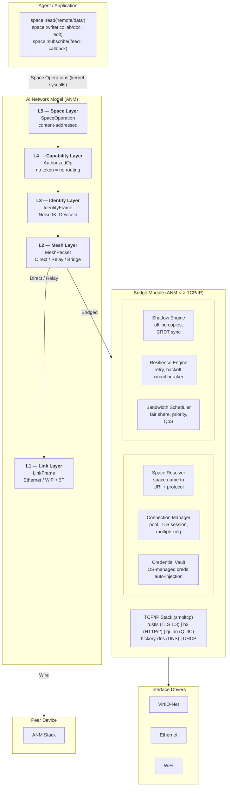

# AIOS Networking: AI Network Model (ANM)

## Deep Technical Architecture

**Parent document:** [architecture.md](../project/architecture.md)
**Kit overview:** [Network Kit](../kits/platform/network.md) — AI Network Model (ANM) — mesh-native networking, Bridge Module for legacy IP
**Related:** [development-plan.md](../project/development-plan.md) — Phase 9 (Basic Networking / ANM), Phase 28 (full NTM), [subsystem-framework.md](./subsystem-framework.md) — Universal hardware abstraction, [wireless.md](./wireless.md) — WiFi as Link Layer transport (L1)

**Note:** The networking subsystem implements the subsystem framework. Its capability gate, session model, audit logging, power management, and POSIX bridge follow the universal patterns defined in the framework document. This document covers the network-specific design decisions and architecture.

-----

## Document Map

This document was split for navigability. Each sub-document preserves the original section numbers for cross-reference stability.

| Document | Sections | Content |
|---|---|---|
| **This file** | §1, §2, §7, §8, §10 | Core insight, ANM architecture overview, implementation order, technology choices, design principles |
| [anm.md](./networking/anm.md) | §A1–§A8 | ANM specification: 5-layer model, data units, encapsulation, failure modes, technology stack |
| [mesh.md](./networking/mesh.md) | §M1–§M10 | Mesh Layer: identity, Noise IK, transport modes, peer discovery, peer table, mesh packet format, capability exchange, integration, security |
| [bridge.md](./networking/bridge.md) | §B1–§B7 | Bridge Module: TCP/IP translation, DNS, TLS, HTTP, security, protocol integration, POSIX socket emulation, cross-references |
| [components.md](./networking/components.md) | §3.0–§3.6 | NTM components: Mesh Manager, Space Resolver, Connection Manager, Shadow Engine, Resilience Engine, Capability Gate, Bandwidth Scheduler |
| [stack.md](./networking/stack.md) | §4.0–§4.7 | Network stacks: Mesh Stack overview, Bridge Stack (smoltcp), VirtIO-Net driver, buffer management, zero-copy I/O, DHCP/DNS |
| [protocols.md](./networking/protocols.md) | §5.1–§5.5 | Protocol engines: AIOS Mesh Protocol (native), Bridge protocols (HTTP/2, QUIC/HTTP/3, WebSocket/SSE, TLS/rustls) |
| [security.md](./networking/security.md) | §6.0–§6.5 | ANM security model, capability gate, packet filtering, per-agent isolation, credential vault, graduated trust |
| [examples.md](./networking/examples.md) | §9.0–§9.5 | Mesh-first examples, web browsing via Bridge, POSIX compat, credential routing, data model |
| [future.md](./networking/future.md) | §11.1–§11.9 | AI-driven networking, learned congestion control, predictive prefetch, anomaly detection, mesh-specific research |

-----

## 1. Core Insight

In every existing OS, networking is plumbing that applications must manage. Applications open sockets, handle DNS, negotiate TLS, manage connections, implement retry logic, handle offline states, manage caching. Every application reimplements these same patterns badly.

AIOS inverts this. Applications never see the network. There are only **space operations** — some of which happen to involve remote spaces — and the OS handles everything else.

```text
What applications see:

    space::read("openai/v1/models")         <- looks like reading a local object
    space::write("collab/doc/123", edit)     <- looks like writing a local object
    space::subscribe("feed/news", on_change) <- looks like subscribing to local changes
    Flow::transfer(remote_obj, local_space)  <- looks like Flow between spaces

What the OS does underneath (two paths):

    Mesh path (AIOS peer on LAN):
        L5 SpaceOperation -> L4 capability check -> L3 Noise IK encrypt ->
        L2 MeshPacket (direct) -> L1 raw Ethernet frame -> peer device

    Bridge path (legacy TCP/IP service):
        L5 SpaceOperation -> L4 capability check -> Bridge Module ->
        DNS resolution -> TLS 1.3 handshake -> HTTP/2 request ->
        response parsed + labeled DATA -> result returned to agent
```

The application does not know or care that `openai/v1/models` is on a server in San Francisco or that `collab/doc/123` is on a peer device across the room. Both are objects in spaces. The OS makes them available through the appropriate path — mesh or bridge — based on where the space resolves.

-----

## 2. Full Architecture



The architecture has two distinct data paths. The **mesh path** (L5 through L1) carries traffic between AIOS devices using the ANM protocol stack — no IP addresses, no DNS, no TLS certificates. The **bridge path** (L5 through L4, then into the Bridge Module) translates ANM space operations into TCP/IP for communication with legacy internet services. Both paths share L5 (Space) and L4 (Capability) — every operation is content-addressed and capability-gated regardless of destination.

See [anm.md](./networking/anm.md) for the full ANM specification, [mesh.md](./networking/mesh.md) for mesh routing and transport, and [bridge.md](./networking/bridge.md) for the TCP/IP translation layer.

-----

## 7. Implementation Order

Each sub-phase delivers usable functionality independently. Phase 9 delivers mesh-first networking with bridge support for legacy IP. Phase 28 adds the full NTM intelligence layer.

```text
Phase 9 — Basic Networking (ANM):
  +-- 9a: Mesh Layer (L1-L3)                -> raw Ethernet, Noise IK, peer discovery
  +-- 9b: Bridge Layer (Bridge Module)       -> smoltcp, rustls, DHCP/DNS, HTTP
  +-- 9c: POSIX + WAN                       -> socket emulation, QUIC tunnel for WAN relay

Phase 28 — Full NTM with Shadow Engine, Resilience:
  +-- 28a: Connection Manager + Protocol     -> HTTP/2, WebSocket over Bridge
  +-- 28b: Space Resolver + Capability Gate  -> space operations over network (L4-L5 full)
  +-- 28c: Shadow Engine                     -> offline support, CRDT sync
  +-- 28d: Resilience + Bandwidth Scheduler  -> production-grade QoS
  +-- 28e: AIOS Peer Protocol                -> full mesh protocol with relay
```

After Phase 9a, two AIOS devices on the same Ethernet segment can exchange space operations — no IP, no DNS, no TLS certificates. After 9b, agents can reach legacy TCP/IP services (web APIs, cloud storage) through the Bridge Module. After 9c, a developer can `curl` from the AIOS shell and mesh peers can relay over the WAN.

After Phase 28b, the full NTM intelligence layer resolves space names to endpoints and enforces capabilities at the network boundary. After 28c, the system works offline with shadow copies. After 28e, the full AIOS Peer Protocol enables multi-hop relay and cross-WAN mesh communication.

-----

## 8. Key Technology Choices

### Mesh Layer (L1-L3)

| Component | Choice | License | Rationale |
|---|---|---|---|
| Key agreement | x25519-dalek | BSD-3-Clause | X25519 Diffie-Hellman for Noise IK handshake |
| AEAD cipher | chacha20poly1305 | Apache-2.0/MIT | ChaCha20-Poly1305 for Noise transport encryption |
| Signatures | ed25519-dalek | BSD-3-Clause | Ed25519 for DeviceId verification |
| Noise framework | snow | Apache-2.0 | Noise Protocol Framework (IK pattern, 0-RTT for known peers) |
| Raw Ethernet | Custom | BSD-2-Clause | Direct L1 framing for LAN mesh, VirtIO-Net integration |

### Bridge Module (TCP/IP translation)

| Component | Choice | License | Rationale |
|---|---|---|---|
| TCP/IP stack | smoltcp | BSD-2-Clause | Pure Rust, no_std, production-quality |
| TLS | rustls | Apache-2.0/MIT | Pure Rust, no OpenSSL dependency |
| QUIC | quinn | Apache-2.0/MIT | Pure Rust, built on rustls, WAN tunnel transport |
| HTTP/2 | h2 | MIT | Pure Rust, async, stream multiplexing |
| DNS | hickory-dns | Apache-2.0/MIT | Pure Rust, async, DoH/DoT support |
| Certificate store | webpki-roots | MPL-2.0 | Mozilla's CA bundle (Bridge only — mesh uses raw public keys) |
| VirtIO transport | Custom | BSD-2-Clause | Matches existing VirtIO-blk/gpu pattern in `kernel/src/drivers/` |

All pure Rust, all permissively licensed, all no_std compatible or portable. See [stack.md §4.2](./networking/stack.md) for detailed Bridge Module integration architecture. See [anm.md §A7](./networking/anm.md) for the full technology mapping per ANM layer.

-----

## 10. Design Principles

### ANM Structural Principles

1. **Identity IS the address.** Peers are identified by `DeviceId` (derived from Ed25519 public key), not by IP address. A device's identity is stable across network changes — moving from WiFi to cellular does not change who you are. Location is a routing concern resolved at L2, not an addressing concern visible to applications.

2. **Authorization IS reachability.** If you do not hold a valid capability for a space, that space is unreachable. There is no equivalent of port scanning or unauthorized connection attempts. The capability check at L4 occurs before any network activity, so unauthorized operations never generate traffic.

3. **Content IS the name.** Objects are identified by content hash, spaces by space hash. Names are derived from content, not assigned by infrastructure. This enables verification without trust — you can confirm you received what you asked for by checking the hash.

4. **Encryption IS the layer.** There is no unencrypted mode. The Identity Layer (L3) encrypts every frame as a structural property of the protocol, not as an optional feature. Removing encryption would require removing the layer itself, which would break the stack.

5. **Servers ARE peers.** ANM does not distinguish between "client" and "server." Every participant is a peer with an identity, capabilities, and spaces. A web API endpoint is a peer that happens to be reachable via the Bridge Module. This symmetry simplifies the model and enables true peer-to-peer communication.

6. **Zero trust IS structural.** Trust is not a policy decision layered on top — it is built into the stack. Every operation is authorized (L4), encrypted (L3), and audited. There is no "trusted network" mode that bypasses these checks.

7. **Decentralized by default, centralized by choice.** ANM assumes no central authority for naming, routing, or identity. DNS, certificate authorities, and centralized servers are accessed through the Bridge Module as legacy translation, not as architectural requirements.

### System Principles

8. **Applications see spaces, not sockets.** The network is an implementation detail of remote spaces. `space::read()` works identically whether the data is local, on a mesh peer, or across the internet via Bridge.

9. **Offline is the default assumption.** Every remote space operation must have a defined offline behavior (shadow, fail, queue). Two mesh peers that were previously connected continue to serve cached data when the link drops.

10. **Credentials are infrastructure.** They flow through the OS (Credential Vault in the Bridge Module), never through application code. Applications use credentials without possessing them.

11. **Six errors, not six hundred.** The OS absorbs network complexity — whether from mesh transport failures or Bridge Module HTTP errors — and presents a simple, consistent `SpaceError` model to agents.

12. **Protocol choice is the OS's decision.** The OS picks the best path (mesh direct, mesh relay, or bridge) and the best protocol for each operation based on peer availability, transport conditions, and capability topology.

-----

## Cross-Reference Index

| Reference | Location | Topic |
|---|---|---|
| §A1 ANM model overview | [anm.md](./networking/anm.md) | 5-layer model, OSI comparison, design rationale |
| §A2 Layer specification | [anm.md](./networking/anm.md) | Data units, addressing, failure semantics per layer |
| §A3 Encapsulation | [anm.md](./networking/anm.md) | Outbound/inbound data flow, Bridge path |
| §A4 Design principles | [anm.md](./networking/anm.md) | 7 ANM structural principles |
| §A5 ANM vs OSI | [anm.md](./networking/anm.md) | Layer-by-layer comparison table |
| §A6 Failure mode table | [anm.md](./networking/anm.md) | Per-layer failure responses, degradation policy |
| §A7 Technology stack | [anm.md](./networking/anm.md) | Crate selection per ANM layer |
| §A8 Cross-references | [anm.md](./networking/anm.md) | ADRs, related architecture docs |
| §M1–§M10 Mesh Layer | [mesh.md](./networking/mesh.md) | Identity, Noise IK, transport modes, peer discovery, peer table, mesh packet, capability exchange, integration, security |
| §B1–§B7 Bridge Module | [bridge.md](./networking/bridge.md) | TCP/IP translation, DNS, TLS, HTTP, security, protocol integration, POSIX sockets, cross-references |
| §3.0 Mesh Manager | [components.md](./networking/components.md) | Native peer-to-peer networking, peer table, discovery |
| §3.1 Space Resolver | [components.md](./networking/components.md) | Semantic addressing, space registry, agent manifests |
| §3.2 Connection Manager | [components.md](./networking/components.md) | Connection pooling, protocol negotiation, TLS sessions |
| §3.3 Shadow Engine | [components.md](./networking/components.md) | Offline support, shadow policies, CRDT sync |
| §3.4 Resilience Engine | [components.md](./networking/components.md) | Retry policies, circuit breaker, error simplification |
| §3.5 Capability Gate | [components.md](./networking/components.md) | Per-space capabilities, credential isolation |
| §3.6 Bandwidth Scheduler | [components.md](./networking/components.md) | Priority scheduling, multi-path routing |
| §4.0 Mesh Stack overview | [stack.md](./networking/stack.md) | Native mesh stack architecture, dual-stack design |
| §4.1 smoltcp integration | [stack.md](./networking/stack.md) | TCP/IP stack architecture (Bridge Module internal) |
| §4.2 VirtIO-Net driver | [stack.md](./networking/stack.md) | MMIO transport, virtqueue, DMA buffers |
| §4.3 Buffer management | [stack.md](./networking/stack.md) | Packet buffers, pool allocation, scatter-gather |
| §4.4 Zero-copy I/O | [stack.md](./networking/stack.md) | DMA-to-application data paths |
| §4.5 Interrupt handling | [stack.md](./networking/stack.md) | IRQ coalescing, adaptive polling |
| §4.6 DHCP and DNS | [stack.md](./networking/stack.md) | Address acquisition, name resolution (Bridge Module) |
| §4.7 IPv4/IPv6 dual stack | [stack.md](./networking/stack.md) | Protocol selection, address families (Bridge Module) |
| §5.1 AIOS Peer Protocol | [protocols.md](./networking/protocols.md) | Native AIOS-to-AIOS, capability exchange |
| §5.2 HTTP/2 engine | [protocols.md](./networking/protocols.md) | h2 crate integration (Bridge Module) |
| §5.3 QUIC and HTTP/3 | [protocols.md](./networking/protocols.md) | quinn integration, connection migration (Bridge + WAN tunnel) |
| §5.4 WebSocket and SSE | [protocols.md](./networking/protocols.md) | Real-time subscriptions (Bridge Module) |
| §5.5 TLS and rustls | [protocols.md](./networking/protocols.md) | Certificate management (Bridge Module) |
| §6.0 ANM security model | [security.md](./networking/security.md) | 5-layer ANM security model, ANM vs OSI security |
| §6.1 Kernel capability gate | [security.md](./networking/security.md) | L4 enforcement architecture, audit integration |
| §6.2 Packet filtering | [security.md](./networking/security.md) | Capability-based filtering, BPF alternative |
| §6.3 Per-agent network isolation | [security.md](./networking/security.md) | Network namespacing, traffic separation |
| §6.4 Credential vault | [security.md](./networking/security.md) | Credential space, automatic routing, key lifecycle |
| §6.5 Layered trust model | [security.md](./networking/security.md) | Trust labels, browser exception, service tiers |
| §9.0 Mesh-first examples | [examples.md](./networking/examples.md) | Space sync, capability delegation over mesh |
| §9.1 Web browsing | [examples.md](./networking/examples.md) | Browser integration, space-based page loading |
| §9.2 Agent-to-agent communication | [examples.md](./networking/examples.md) | Agent communication via mesh and Bridge |
| §9.3 POSIX compatibility | [examples.md](./networking/examples.md) | Socket emulation, BSD tool support |
| §9.4 Credential routing | [examples.md](./networking/examples.md) | Automatic auth header injection |
| §9.5 Data model | [examples.md](./networking/examples.md) | SpaceEndpoint, Shadow, SpaceError, NetCapability types |
| §11.1 AI-driven congestion | [future.md](./networking/future.md) | Learned congestion control, RL-based TCP |
| §11.2 Predictive prefetch | [future.md](./networking/future.md) | AIRS-driven resource anticipation |
| §11.3 Traffic classification | [future.md](./networking/future.md) | ML-based DPI alternatives |
| §11.4 Anomaly detection | [future.md](./networking/future.md) | GNN-based network security |
| §11.5 Adaptive QoS | [future.md](./networking/future.md) | Context-aware bandwidth allocation |
| §11.6 Protocol optimization | [future.md](./networking/future.md) | Learned protocol selection |
| §11.7 Autonomous troubleshooting | [future.md](./networking/future.md) | LLM-assisted network diagnostics |
| §11.8 Research innovations | [future.md](./networking/future.md) | Academic papers, production OS patterns |
| §11.9 Mesh-specific research | [future.md](./networking/future.md) | Onion routing, post-quantum crypto, formal verification |
