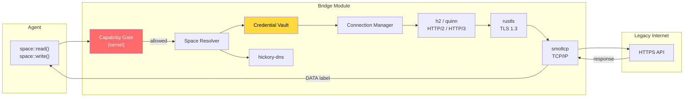
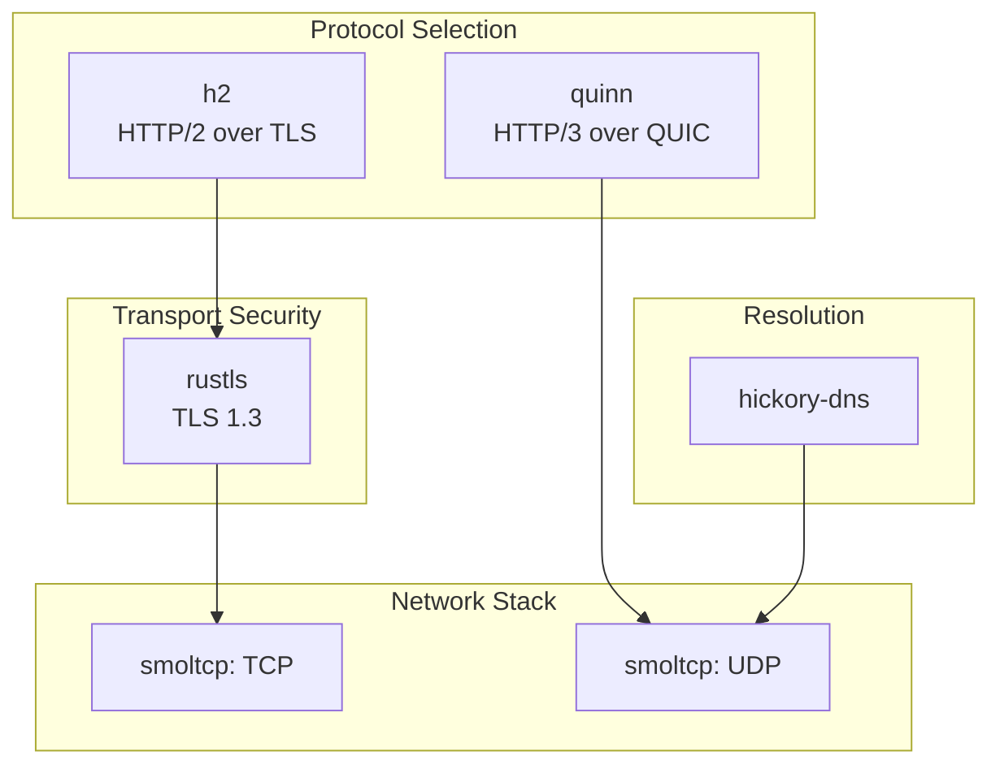

# AIOS Networking — Bridge Module

**Part of:** [networking.md](../networking.md) — Network Translation Module
**Related:** [stack.md](./stack.md) — TCP/IP stack (used by Bridge), [security.md](./security.md) — Network security, [components.md](./components.md) — NTM components, [protocols.md](./protocols.md) — Protocol engines
**Source:** [ANM Discussion](../../knowledge/discussions/2026-03-25-jl-ai-network-model.md) — sections 4-5

-----

## B1. Overview

The Bridge Module is **not an ANM layer** — it is a translation membrane for communicating with legacy IP-based systems (the existing internet). Everything inside ANM speaks mesh natively. The mesh provides cryptographic identity, mandatory encryption (Noise IK), content-addressed storage, and capability-gated access. None of these properties exist in the IP world.

The Bridge is activated in exactly three scenarios:

1. **RemoteHTTPS spaces** — An agent accesses a space backed by an external API (e.g., `openai/v1/models`). The Bridge translates the space operation into an HTTPS request and labels the response as DATA.
2. **POSIX socket emulation** — A legacy application uses BSD socket APIs (`connect`, `send`, `recv`). The Bridge provides TCP/IP connectivity through smoltcp, always at Bridge-level trust.
3. **Tunnel mode** — Two AIOS devices communicate across the internet. The Bridge encapsulates already-encrypted mesh packets in QUIC/UDP. IP is the carrier, not the identity layer.

Two AIOS devices on the same Ethernet segment need no Bridge, no IP, no DNS, no TLS. They communicate via Direct Link using raw Ethernet frames (EtherType `0x4149`) with Noise encryption.



-----

## B2. Bridge Components

The Bridge assembles six crates, each handling one concern. All are `no_std` compatible and carry BSD/MIT/Apache licenses (no GPL).

| Component | Crate | License | Role |
|---|---|---|---|
| TCP/IP stack | `smoltcp` | BSD-2-Clause | TCP, UDP, ICMP, IPv4/IPv6, ARP, NDP, DHCP |
| TLS 1.3 | `rustls` | Apache-2.0/MIT | Encrypted HTTPS, certificate pinning, CT verification |
| HTTP/2 | `h2` | MIT | Multiplexed request/response, HPACK compression, flow control |
| QUIC/HTTP/3 | `quinn` | Apache-2.0/MIT | HTTP/3 for external APIs; also used for Tunnel mode encapsulation |
| DNS resolver | `hickory-dns` | Apache-2.0/MIT | Stub resolver (Phase 9); full DoH/DoT (Phase 28) |
| Credential Vault | (kernel internal) | N/A | API keys, OAuth tokens, mTLS certs — agents never see credentials |

### Component Relationships



The Credential Vault is deliberately not a crate — it is a kernel-internal service that injects authentication headers into outbound requests. No agent, no userspace code, and no Bridge component other than the Connection Manager can read raw credential values.

-----

## B3. Translation Flows

### B3.1 Outbound — Agent to Internet API

The most common Bridge flow. An agent reads from a space that resolves to an external HTTPS endpoint.

```text
space::read("openai/v1/models")
  |
  +-> Capability Gate: net:read:openai/v1/models? --- check ---+
  |                                                             |
  |   DENIED --> audit log, SpaceError::PermissionDenied        |
  |   ALLOWED:                                                  |
  |                                                             v
  +-> Space Resolver: space type = RemoteHTTPS
  |     endpoint = api.openai.com
  |     protocol = HTTP/2
  |
  +-> Credential Vault: retrieve "openai-api-key"
  |     inject Authorization: Bearer sk-...
  |
  +-> Connection Manager: get or create HTTPS connection
  |     +-> hickory-dns: resolve api.openai.com
  |     +-> smoltcp: TCP connect
  |     +-> rustls: TLS 1.3 handshake (verify cert, check pin)
  |
  +-> h2: send GET /v1/models
  |
  +-> Response: 200 OK, application/json
  |
  +-> DATA label applied (kernel-enforced)
  |
  +-> Response validation: schema check, size limit
  |
  +-> Content screening: InputScreener pattern + ML analysis
  |
  +-> Translate JSON -> space objects
  |
  +-> Deliver to agent
```

Every step is audited. The agent sees a space operation result — it has no awareness of HTTP, TLS, DNS, or the credential used.

-----

### B3.2 Inbound — Internet to AIOS

By default, AIOS is **agent-initiated only**. There are no listening ports. No external entity can initiate a connection to AIOS without prior outbound contact. This is the safest configuration.

For hosting scenarios (e.g., an AIOS device serving an API), an optional Bridge listener can be enabled:

```rust
/// Bridge listener activation requires explicit capability.
/// Capability type: net:serve:<space-pattern>
///
/// Example: net:serve:my-api/* permits serving requests
/// that map to the my-api/ space subtree.
fn activate_bridge_listener(
    agent: AgentId,
    cap: CapabilityToken,   // must include net:serve:*
    bind_port: u16,
) -> Result<ListenerHandle, BridgeError> {
    // 1. Verify capability permits serving
    // 2. Bind smoltcp TCP listener on port
    // 3. Accept connections through TLS
    // 4. Translate incoming HTTP -> space operations
    // 5. DATA-label all inbound content
    // 6. Execute space operation, return response
}
```

Inbound requests follow the same trust model as outbound responses: all content is DATA-labeled. The Bridge translates incoming HTTP requests into space operations and returns results as HTTP responses. The served agent never handles raw HTTP.

-----

### B3.3 AIOS-to-AIOS via Internet — Tunnel Mode

When two AIOS devices cannot reach each other via Direct Link (same LAN) or Relay (trusted peer), the Bridge provides Tunnel mode: mesh packets encapsulated in QUIC/UDP.

```text
Device A                         Internet                        Device B
    |                                                                |
    |  MeshPacket (Noise-encrypted)                                  |
    |  +-> Bridge: encapsulate in QUIC                               |
    |  +-> UDP datagram: [IP | UDP | QUIC | MeshPacket]              |
    |  +----------------------------->-------------------------------+|
    |                                                                |
    |                                     Bridge: decapsulate QUIC <-+
    |                                     MeshPacket (still Noise) <-+
    |                                     Deliver to Mesh Layer   <-+
```

Key properties:

- **IP is carrier, not identity.** The DeviceId (derived from the Ed25519 public key) remains the address throughout. IP addresses are ephemeral transport details.
- **Mesh packets are already Noise-encrypted.** The QUIC encryption layer is redundant but harmless — it provides defense in depth and assists with NAT traversal.
- **No trust downgrade.** Tunnel-mode packets retain mesh-level trust. The Bridge does not DATA-label them because the content never left the mesh's cryptographic envelope.

-----

### B3.4 NAT Traversal

Tunnel mode requires NAT traversal for devices behind consumer routers. The Bridge attempts four strategies in order, falling back to the next if the previous fails:

| Priority | Strategy | Mechanism | Latency |
|---|---|---|---|
| 1 | UDP hole-punching | STUN-like coordination via a known peer | ~50 ms |
| 2 | Relay through mutual peer | Mesh relay with a peer visible to both devices | ~100 ms |
| 3 | Public relay node | Encrypted relay through a public AIOS node (blind — relay cannot read content) | ~150 ms |
| 4 | WebSocket bridge | Last resort for restrictive firewalls that block UDP entirely | ~200 ms |

```rust
/// NAT traversal strategy selection.
/// Attempts strategies in priority order, returning the first success.
pub enum NatStrategy {
    /// STUN-like UDP hole-punch via coordination peer.
    HolePunch {
        coordination_peer: DeviceId,
    },
    /// Relay through a mutually trusted mesh peer.
    MeshRelay {
        relay_peer: DeviceId,
    },
    /// Public relay node (encrypted, blind forwarding).
    PublicRelay {
        relay_endpoint: SocketAddr,
    },
    /// WebSocket fallback for UDP-blocked networks.
    WebSocketBridge {
        ws_endpoint: SocketAddr,
    },
}
```

The coordination peer for hole-punching can be any AIOS device that both parties can reach. It facilitates the address exchange but never sees the mesh packet content.

-----

## B4. Bridge Security

### B4.1 The Fundamental Tension

The mesh world and the Bridge world operate under fundamentally different trust assumptions:

| Property | Mesh World | Bridge World |
|---|---|---|
| Identity | Cryptographic (DeviceId = sha256(pubkey)) | Administrative (DNS names, IP addresses) |
| Trust model | Peer-to-peer, raw public keys | CA hierarchy (~150 root CAs) |
| Encryption | Mandatory (Noise IK, no plaintext mode) | Best-effort (TLS, can be intercepted) |
| Authorization | Structural (no token = no packet) | Policy-based (application-level) |
| Content integrity | Content-hashed (SHA-256) | Server-asserted (trust the response) |
| Audit | Every operation, tamper-evident | Per-application (if any) |

**Critical invariant:** Bridge weaknesses NEVER compromise mesh guarantees. A total Bridge compromise (all seven layers breached) affects only Bridge-mediated traffic. Mesh peers communicating via Direct Link, Relay, or Tunnel are unaffected. The mesh is independently secure.

-----

### B4.2 Attack Surface

The Bridge must defend against attacks from both the mesh side and the legacy internet side.

| # | Attack Vector | Mesh Mitigation | Bridge Mitigation | Residual Risk |
|---|---|---|---|---|
| 1 | Rogue AIOS peer | Noise rejects unknown keys | N/A | None |
| 2 | Replay attack | Nonce in every Noise handshake | N/A | None |
| 3 | Traffic analysis | Encrypted, timing leaks possible | N/A | Medium |
| 4 | Compromised relay | Cannot read content (Noise E2E) | N/A | None |
| 5 | DNS poisoning | N/A | DNSSEC + DoH/DoT + cert pinning | Low |
| 6 | TLS interception | N/A | CT logs + cert pinning + dynamic pinning | Low |
| 7 | API credential theft | N/A | Vault isolation + rotation + scoping | Medium |
| 8 | Response tampering | N/A | Schema validation + screening + DATA label | Medium |
| 9 | Prompt injection via response | N/A | DATA label + capability check + behavioral monitor | None (structural) |

Attacks 1-4 target the mesh — the Bridge is not involved. Attacks 5-9 target the Bridge — the mesh is not involved. This separation is by design: the Bridge cannot weaken the mesh, and mesh compromises cannot bypass Bridge security.

-----

### B4.3 Seven Bridge Security Layers

Defense in depth with seven distinct layers, ordered from outermost (checked first) to innermost (the structural trust boundary):

```text
     Outbound request path                 Inbound response path
     =====================                 =====================

     Agent space::read()                   Internet response
            |                                      |
            v                                      v
  L1: Capability Gate  ───────────  L7: DATA Labeling
     (kernel, before Bridge)            (kernel-enforced trust boundary)
            |                                      |
            v                                      v
  L2: Credential Vault ───────────  L6: Content Screening
     (inject, never expose)             (InputScreener: pattern + ML)
            |                                      |
            v                                      v
  L3: TLS Enforcement  ───────────  L5: Response Validation
     (1.3 only, pinning, CT)            (schema, size, rate)
            |                                      |
            v                                      v
  L4: Packet Filter    ───────────  L4: Packet Filter
     (capability-derived,                  (capability-derived,
      default deny)                         default deny)
            |                                      |
            v                                      v
       Network wire  <──────────>       Network wire
```

**L1 — Capability Gate** (kernel, checked before Bridge is invoked)

The operation must hold a valid capability token before the Bridge is invoked. No token, no Bridge access. This is the same kernel capability gate used by all AIOS subsystems (see [security.md](./security.md) section 6.1).

**L2 — Credential Vault** (inject credentials, never expose them)

API keys, OAuth tokens, and mTLS certificates are stored in an isolated kernel-internal vault. The Bridge injects credentials into outbound requests. Agents never see raw credential values — they interact with space operations, not HTTP headers. Credentials are scoped to specific spaces and can be rotated without agent involvement.

**L3 — TLS Enforcement** (TLS 1.3 only, no fallback)

- TLS 1.3 mandatory — no fallback to TLS 1.2 or earlier
- Certificate pinning for known services (top 20 services pinned at Phase 9)
- Certificate Transparency log verification (Phase 28)
- Rejection of certificates from distrusted CAs

**L4 — Packet Filter** (capability-derived rules, default deny)

Packet filtering rules are derived from the agent's capability set. Only protocols and endpoints explicitly permitted by capabilities are reachable. Default policy is deny. This replaces traditional firewalls — the capability system IS the firewall.

**L5 — Response Validation** (schema checking, size limits, rate monitoring)

- Schema validation against expected response formats per space definition
- Size limits to prevent memory exhaustion from malicious responses
- Rate monitoring to detect anomalous response patterns

**L6 — Content Screening** (InputScreener: pattern matching + ML analysis)

The InputScreener applies pattern matching and ML-based analysis to detect prompt injection, malicious payloads, and content policy violations in responses from external services. This is the same screening pipeline used by the adversarial defense subsystem (see [../../security/adversarial-defense/screening.md](../../security/adversarial-defense/screening.md)).

**L7 — DATA Labeling** (the structural trust boundary)

Everything entering AIOS through the Bridge is labeled as DATA at the kernel level. DATA-labeled content cannot be interpreted as CONTROL (instructions). This is enforced structurally — the label is part of the data's kernel-managed type, not a policy check. This is THE trust boundary between the Bridge world and the mesh world.

-----

### B4.4 Honest Limitations

What the Bridge CANNOT protect against:

- **Malicious API servers returning wrong-but-valid data.** If a weather API returns fabricated temperatures that pass schema validation, the Bridge cannot detect the lie. The data is well-formed but false. Mitigation: multi-source verification at the agent level.
- **Server-side credential breaches.** If the API provider's database is compromised, Bridge security is irrelevant — the breach is upstream. Mitigation: credential rotation, scoping, monitoring.
- **Government CA compromise for unpinned spaces.** A state-level adversary with CA access can intercept TLS for services where AIOS does not control certificate pinning. Pinned spaces are immune. Mitigation: expand pinning coverage over time.
- **Metadata leakage.** DNS queries, IP addresses, and timing patterns reveal that AIOS is communicating with a particular service, even though content is encrypted. Mitigation: DoH/DoT reduces DNS leakage; traffic padding is a future direction.
- **Correlation attacks.** An adversary observing both mesh traffic and Bridge traffic patterns may correlate them to deanonymize mesh participants. Mitigation: timing jitter, traffic padding (future).

-----

### B4.5 Bridge Hardening Roadmap

Bridge security is implemented incrementally across phases:

| Phase | Capabilities Added |
|---|---|
| **Phase 9** | TLS 1.3 (rustls), cert pinning (top 20 services), Credential Vault, DATA labeling, packet filter, capability gate |
| **Phase 28** | DoH/DoT (hickory-dns), DNSSEC validation, CT verification, schema validation per space, InputScreener content screening |
| **Phase 28** | Dynamic pinning (pin on first use + rotation), credential rotation policies, anomaly detection on response patterns, per-agent unique credentials |
| **Future** | Onion routing integration, traffic padding, formal verification of DATA label invariant, post-quantum TLS cipher suites |

-----

## B5. Protocol Integration Guide

The Bridge is extensible — new protocols are added by implementing a handler trait and registering it with the Bridge. This section provides the integration framework.

### B5.1 WireGuard as Reference Pattern

WireGuard shares approximately 80% of ANM's cryptographic primitives: Noise IK handshake, ChaCha20-Poly1305 AEAD, X25519 key agreement. This makes it the ideal reference case for Bridge protocol integration.

| Scenario | Description | Implementation |
|---|---|---|
| Outbound VPN | Agent accesses resources behind a WireGuard VPN | Bridge encapsulates mesh traffic in WireGuard tunnel |
| Ingress from non-AIOS | Non-AIOS device connects via WireGuard | Bridge listener, capability-gated, DATA-labeled |
| AIOS-to-AIOS | Two AIOS devices communicating | Use mesh directly — WireGuard is unnecessary |

Implementation cost: approximately 1K lines of unique code (IP-in-UDP framing + AllowedIPs routing table). All cryptographic operations reuse the mesh layer's Noise implementation.

-----

### B5.2 Eight-Question Integration Template

For ANY protocol added to the Bridge, answer these eight questions before writing code:

| # | Question | Guidance |
|---|---|---|
| 1 | Does ANM Mesh already cover this? | If yes, do not add it. Use the mesh. |
| 2 | What crypto is shared with Mesh Layer? | Maximize reuse of Noise IK, X25519, ChaCha20-Poly1305. |
| 3 | What is the unique protocol framing? | Only implement the parts that differ from mesh. |
| 4 | Where do credentials live? | Always in the Credential Vault. Never in agent memory. |
| 5 | What trust level? | Always Bridge-level. Always DATA-labeled. |
| 6 | What capability gates it? | Define a protocol-specific capability type. |
| 7 | Can agents see the protocol? | No. Agents see spaces. Protocol details are invisible. |
| 8 | Fallback if unavailable? | Define degradation behavior explicitly. |

If the answer to question 1 is "yes," stop. The mesh handles it. The Bridge exists only for legacy interoperability.

-----

### B5.3 Protocol Integration Table

| Protocol | Bridge Role | Crypto Reuse from Mesh | Unique Code (est.) |
|---|---|---|---|
| WireGuard | VPN tunnel | Noise IK, ChaCha20, X25519 (80%) | IP-in-UDP, AllowedIPs (~1K lines) |
| SSH | Remote shell access | X25519 key agreement | SSH framing, channel mux (~3K lines) |
| MQTT | IoT device communication | TLS (Bridge standard) | Topic-to-space mapping (~2K lines) |
| gRPC | Microservice integration | TLS (Bridge standard) | Protobuf-to-space mapping (~2K lines) |
| WebRTC | Real-time media | DTLS-SRTP | ICE/STUN/TURN, RTP framing (~5K lines) |
| Tor | Anonymous routing | Tor circuit crypto (separate) | Onion routing (~10K lines) |
| Matrix | Federated messaging | Olm/Megolm (separate) | Event-to-space mapping (~3K lines) |
| ActivityPub | Fediverse integration | TLS (Bridge standard) | AP-to-space, WebFinger (~2K lines) |

-----

### B5.4 Extensible Handler Architecture

New protocols are integrated through the `BridgeProtocolHandler` trait:

```rust
/// Trait for protocol-specific Bridge handlers.
/// Each handler translates between space operations and a wire protocol.
pub trait BridgeProtocolHandler: Send + Sync {
    /// Returns true if this handler can serve the given endpoint.
    /// The Bridge iterates registered handlers and selects the first match.
    fn can_handle(&self, endpoint: &SpaceEndpoint) -> bool;

    /// Translate a space operation into a protocol-specific request.
    /// The Bridge calls this after capability check and credential injection.
    fn translate_request(
        &self,
        op: &SpaceOperation,
        credentials: &InjectedCredentials,
    ) -> Result<BridgeRequest, BridgeError>;

    /// Translate a protocol-specific response into a space result.
    /// The Bridge applies DATA labeling after this returns.
    fn translate_response(
        &self,
        response: BridgeResponse,
    ) -> Result<SpaceResult, BridgeError>;

    /// The credential type this protocol requires.
    /// The Credential Vault uses this to select the right credential.
    fn credential_type(&self) -> CredentialType;

    /// Required capability pattern for this protocol.
    /// Example: "net:wg:*" for WireGuard, "net:mqtt:*" for MQTT.
    fn required_capability(&self) -> &str;
}
```

Handler registration and selection:

```rust
/// Bridge handler registry.
/// Handlers are registered at subsystem init and selected per-request.
pub struct BridgeHandlerRegistry {
    handlers: Vec<Box<dyn BridgeProtocolHandler>>,
}

impl BridgeHandlerRegistry {
    /// Register a new protocol handler.
    pub fn register(&mut self, handler: Box<dyn BridgeProtocolHandler>) {
        self.handlers.push(handler);
    }

    /// Find the handler for a given endpoint.
    /// Returns the first handler whose can_handle() returns true.
    pub fn select(
        &self,
        endpoint: &SpaceEndpoint,
    ) -> Option<&dyn BridgeProtocolHandler> {
        self.handlers.iter()
            .find(|h| h.can_handle(endpoint))
            .map(|h| h.as_ref())
    }
}
```

Built-in handlers ship with the kernel: `HttpsHandler` (h2), `QuicHandler` (quinn), `DnsHandler` (hickory-dns). Additional handlers (WireGuard, SSH, MQTT) are added per the protocol integration table in section B5.3.

-----

## B6. POSIX Socket Emulation

Legacy applications (curl, ssh, wget, Python scripts) expect BSD socket APIs. The Bridge provides a translation layer that maps POSIX socket operations to Bridge I/O.

| POSIX Call | Bridge Translation |
|---|---|
| `socket(AF_INET, SOCK_STREAM, 0)` | Create Bridge session (TCP) |
| `socket(AF_INET, SOCK_DGRAM, 0)` | Create Bridge session (UDP) |
| `connect(fd, addr, len)` | Connection Manager: DNS resolve + TCP/TLS connect |
| `send(fd, buf, len, 0)` | Bridge I/O: write to connection |
| `recv(fd, buf, len, 0)` | Bridge I/O: read from connection |
| `bind(fd, addr, len)` | Bridge listener (requires `net:serve` capability) |
| `listen(fd, backlog)` | Activate Bridge listener |
| `accept(fd, addr, len)` | Accept incoming Bridge connection |
| `close(fd)` | Tear down Bridge session |
| `getaddrinfo(name, ...)` | hickory-dns resolution through Bridge |

### Trust Model

POSIX socket traffic always flows through the Bridge, never through the mesh. Applications using POSIX sockets receive Bridge-level trust (not mesh trust). This is intentional — POSIX sockets carry no capability tokens, no DeviceId authentication, and no content hashing. They are a compatibility mechanism, not a security mechanism.

```text
+-------------------+     +-------------------+     +-------------------+
|  Native Agent     |     |  Legacy App       |     |  Native Agent     |
|  space::read()    |     |  send()/recv()    |     |  space::sync()    |
+--------+----------+     +--------+----------+     +--------+----------+
         |                         |                          |
         v                         v                          v
   Mesh Layer              Bridge Module               Mesh Layer
   (full trust)            (Bridge trust)              (full trust)
```

Agents using native space operations get mesh-level cryptographic guarantees. Legacy apps using POSIX sockets get Bridge-level best-effort security (TLS, capability gate, DATA labeling). The trust difference is structural and visible in audit logs.

-----

## B7. Cross-References

| Topic | Document | Relevance |
|---|---|---|
| TCP/IP stack internals | [stack.md](./stack.md) | smoltcp integration used by Bridge |
| Protocol engines | [protocols.md](./protocols.md) | HTTP/2, QUIC/HTTP/3, TLS/rustls details |
| NTM components | [components.md](./components.md) | Space Resolver, Connection Manager, Capability Gate |
| Network security | [security.md](./security.md) | Capability gate, packet filter, credential vault, layered trust |
| Adversarial screening | [../../security/adversarial-defense/screening.md](../../security/adversarial-defense/screening.md) | InputScreener used by Bridge L6 |
| Decentralisation model | [../../security/decentralisation.md](../../security/decentralisation.md) | Mesh-first, Bridge-optional philosophy |
| ANM discussion | [../../knowledge/discussions/2026-03-25-jl-ai-network-model.md](../../knowledge/discussions/2026-03-25-jl-ai-network-model.md) | Full ANM design including Bridge sections 4-5 |
| Capability-routed networking ADR | [../../knowledge/decisions/2026-03-25-jl-capability-routed-networking.md](../../knowledge/decisions/2026-03-25-jl-capability-routed-networking.md) | Decision record for ANM capability routing |
