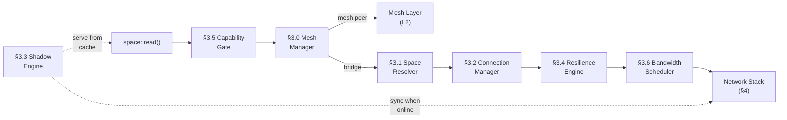
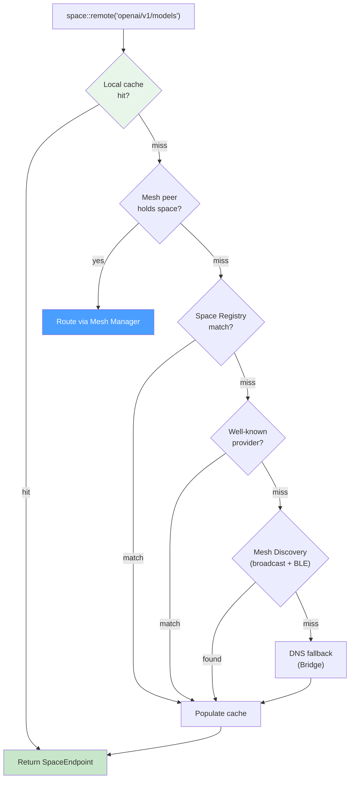
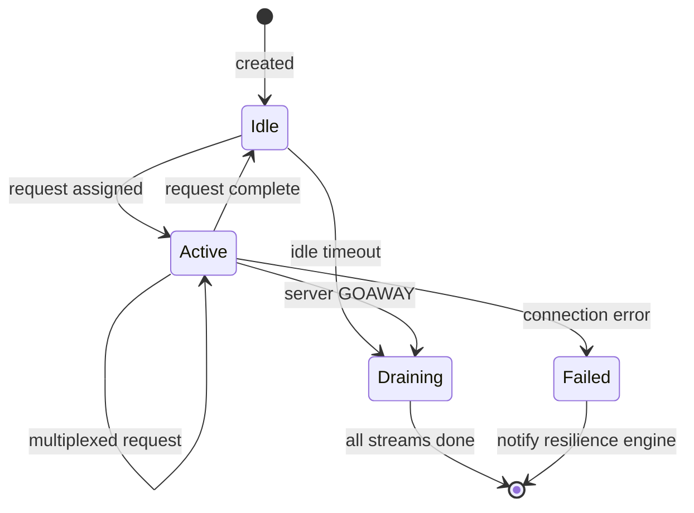
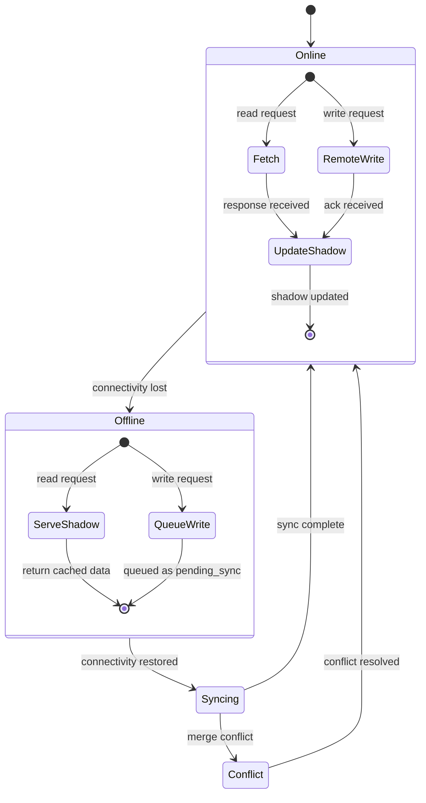
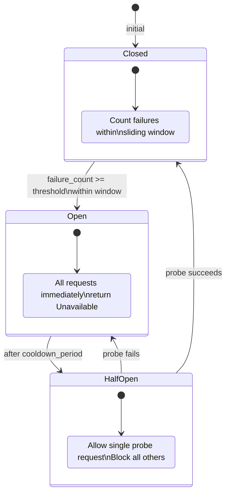
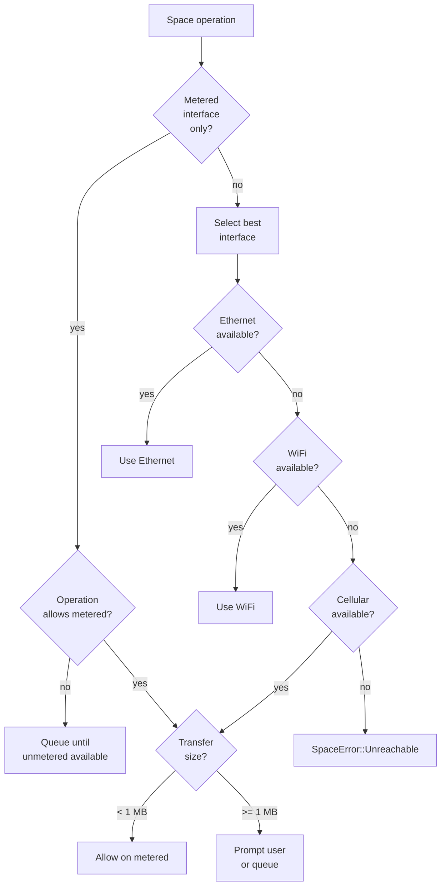

# AIOS Networking — NTM Components

**Part of:** [networking.md](../networking.md) — Network Translation Module
**Related:** [anm.md](./anm.md) — ANM specification, [mesh.md](./mesh.md) — Mesh Layer, [bridge.md](./bridge.md) — Bridge Module, [stack.md](./stack.md) — Network stack internals, [security.md](./security.md) — Network security, [protocols.md](./protocols.md) — Protocol engines

-----

## 3. The Seven Components

The Network Translation Module consists of seven components, each responsible for a distinct aspect of translating space operations into network operations. The Mesh Manager handles peer-to-peer mesh networking natively; the remaining six components form the pipeline for bridge and hybrid traffic: space operation → capability check → resolution → connection → protocol translation → resilience → scheduling → wire.



-----

### 3.0 Mesh Manager — Native Peer-to-Peer Networking

The Mesh Manager is the component responsible for AIOS's native mesh networking layer. It manages the peer table, runs the discovery protocol, maintains Noise IK sessions, selects transport paths, and handles transport mode switching. For communication between AIOS devices, the Mesh Manager bypasses the entire Bridge pipeline — no DNS, no TLS, no HTTP, no IP addresses.

Full specification: [mesh.md](./mesh.md).

#### 3.0.1 Architecture

```rust
/// The Mesh Manager owns peer state, discovery, and Noise sessions.
/// It is the first component consulted after the Capability Gate —
/// if the destination is a known mesh peer, traffic never touches
/// the Bridge pipeline.
pub struct MeshManager {
    /// All known peers, indexed by DeviceId.
    peer_table: PeerTable,

    /// Link-local and BLE discovery service.
    discovery: DiscoveryService,

    /// Active Noise IK sessions, one per connected peer.
    noise_sessions: BTreeMap<DeviceId, NoiseSession>,
}
```

#### 3.0.2 Responsibilities

| Responsibility | Description |
|---|---|
| **Peer table** | Maintains `PeerTable` mapping `DeviceId` to reachability paths (Direct Link, Relay, Tunnel). See [mesh.md §M6](./mesh.md). |
| **Discovery** | Runs link-local ANNOUNCE broadcast (EtherType `0x4149`) and BLE advertisement. See [mesh.md §M5](./mesh.md). |
| **Noise sessions** | Manages Noise IK handshake lifecycle (initiate, respond, transport). See [mesh.md §M3](./mesh.md). |
| **Path selection** | Selects best transport mode: Direct Link > Relay > Tunnel. Automatic failover on path failure. See [mesh.md §M4.4](./mesh.md). |
| **Capability exchange** | Post-handshake negotiation of shared spaces and role capabilities. See [mesh.md §M8](./mesh.md). |

#### 3.0.3 Routing Decision

When a space operation arrives after passing the Capability Gate, the Mesh Manager is consulted first:

```text
1. Is the target space held by a known mesh peer?
   → Check peer_table for peers whose spaces_available includes the target SpaceHash.
   → If yes: route via mesh (Direct Link / Relay / Tunnel). No Bridge involved.

2. Is the target space a local space?
   → Handle locally. No network involved.

3. Neither local nor mesh-reachable?
   → Pass to Space Resolver for Bridge resolution (DNS, HTTP, etc.).
```

This ordering ensures that mesh peers are always preferred over Bridge paths. If a space is available from both a mesh peer and a Bridge endpoint, the mesh path wins.

-----

### 3.1 Space Resolver — Semantic Addressing, Not IP Addressing

Traditional DNS maps names to IP addresses. The Space Resolver maps semantic identifiers to everything the OS needs to reach a remote space.

**Traditional approach:**

```text
"api.openai.com" → 104.18.7.192
(application still needs to know: port 443, HTTPS, path /v1/models,
 auth header, content type, etc.)
```

**AIOS Space Resolution:**

```text
"openai/v1/models" → SpaceEndpoint {
    protocol: HTTPS,
    host: "api.openai.com",
    port: 443,
    path: "/v1/models",
    auth: CredentialRef("openai-api-key"),  // from credential space
    content_type: "application/json",
    cache_ttl: 300s,
    rate_limit: 60/min,
    fallback: None,
}
```

#### 3.1.1 Resolution Chain

Resolution proceeds through six stages, consulted in order. The first match wins.

```text
1. Local cache (recently resolved, still valid)
2. Mesh peer table (check if space is held by a known peer — via Mesh Manager §3.0)
3. Space Registry (local database of known remote spaces)
4. Well-known providers (openai/, github/, google/ have built-in mappings)
5. Mesh Discovery (link-local broadcast on EtherType 0x4149, BLE advertisement)
6. DNS fallback (Bridge — for raw hostnames, used by POSIX compat layer)
```

The key change from traditional resolution: **mesh peers are checked BEFORE DNS**. DNS is a Bridge fallback for legacy hostname resolution, not a primary resolution method. For AIOS-native spaces, the mesh peer table and discovery protocol provide resolution without any IP infrastructure.

**The Space Registry** is the critical piece for Bridge-accessed spaces. It's a local database that maps semantic space identifiers to connection details. Registries are:

- Pre-populated for common services (like `/etc/hosts` but for the AI era — OpenAI, Anthropic, HuggingFace, GitHub, etc.)
- User-extensible — add your own company's APIs as spaces
- Agent-contributed — when you install an agent, it can register the remote spaces it needs
- Shareable — export your registry, share with team

#### 3.1.2 Resolution Architecture



The resolver maintains a **negative cache** for failed lookups (TTL 30 seconds) to avoid repeated expensive DNS queries for non-existent spaces.

#### 3.1.3 Agent Manifest Integration

Agents declare their remote space requirements in their manifest:

```toml
[agent]
name = "research-assistant"

[spaces.remote]
"openai/v1" = { purpose = "LLM inference", operations = ["read"] }
"arxiv/papers" = { purpose = "paper search", operations = ["read", "query"] }
"user/notes" = { purpose = "save findings", operations = ["read", "write"] }
```

At install time, the user approves these space capabilities. The agent never knows an IP address. It never opens a socket. It just reads from and writes to spaces.

#### 3.1.4 Registry Data Model

```rust
/// Space Registry entry — maps semantic name to connection details
pub struct RegistryEntry {
    /// Semantic space identifier (e.g., "openai/v1")
    space_id: RemoteSpaceId,
    /// Connection endpoint (host, port, path, auth)
    endpoint: SpaceEndpoint,
    /// Who registered this entry
    source: RegistrySource,
    /// When this entry was last verified
    last_verified: Timestamp,
    /// Whether this entry can be overridden by agents
    locked: bool,
}

pub enum RegistrySource {
    BuiltIn,           // Well-known provider mapping
    User,              // Manually configured by user
    Agent(AgentId),    // Registered by an installed agent
    Discovery,         // Found via AIOS Discovery Protocol
    Import(String),    // Imported from shared registry file
}
```

-----

### 3.2 Connection Manager — Invisible, Intelligent Connections

The Connection Manager handles two distinct connection types: mesh connections (Noise IK sessions with peers) and bridge connections (TCP/TLS to legacy servers). Applications never manage either type.

#### 3.2.1 Mesh Connection Manager

The Mesh Connection Manager works in conjunction with the Mesh Manager (§3.0) to maintain Noise IK sessions with peers.

```text
Session lifecycle:
    1. Peer discovered (ANNOUNCE frame or peer table lookup)
    2. Noise IK handshake initiated (1-RTT for new peers, 0-RTT for returning)
    3. Capability exchange (post-handshake, negotiate shared spaces)
    4. Transport active (encrypted space operations flow)
    5. Keepalive (Heartbeat packets maintain path liveness)
    6. Teardown (peer unreachable after all paths exhausted)
```

Path selection follows the preference order: Direct Link (lowest latency, same LAN) > Relay (forwarded through trusted peer, E2E encrypted) > Tunnel (QUIC/UDP across internet). Failover between paths is automatic and transparent to the Space Layer. See [mesh.md §M4.4](./mesh.md) for the full path selection algorithm.

#### 3.2.2 Bridge Connection Manager

The Bridge Connection Manager handles TCP/TLS connections to legacy internet servers. This is where HTTP/2 multiplexing, TLS session caching, and connection pooling reside.

##### Connection Pooling

Multiple reads from `openai/v1` reuse the same HTTP/2 connection. The agent doesn't know or care.

```text
Agent A: space::read("github/api/repos")  ─┐
Agent B: space::read("github/api/users")  ─┼─→ Single HTTP/2 connection
Agent C: space::read("github/api/issues") ─┘    to api.github.com:443
```

The pool is keyed by `(host, port, protocol)`. Each pool entry maintains:

- Connection state (idle, active, draining)
- Stream count for multiplexed protocols (HTTP/2, QUIC)
- Last activity timestamp for idle timeout
- Health status from the resilience engine (§3.4)

##### Protocol Negotiation

The OS picks the best protocol based on a priority hierarchy:

```text
1. HTTP/3 (QUIC)       — if server supports ALPN h3
2. HTTP/2              — if server supports ALPN h2
3. WebSocket           — for subscription/streaming operations
4. HTTP/1.1            — fallback for legacy servers
5. Raw TCP             — POSIX compatibility only
```

Protocol selection is automatic but overridable per space in the registry. A space entry can pin a protocol (e.g., MQTT for IoT devices) or exclude protocols (e.g., no plain HTTP for financial APIs).

##### TLS Session Management

TLS handshakes are expensive (1-2 RTT). The Connection Manager aggressively caches TLS sessions:

- **Session tickets** stored per server, reused across connections (0-RTT resumption)
- **Certificate verification** results cached (avoid re-parsing certificate chains)
- **OCSP stapling** responses cached per certificate (avoid OCSP responder latency)
- **Certificate pinning** enforced for well-known providers (prevent MITM on OpenAI, GitHub, etc.)

No agent ever sees a certificate, handles a TLS error, or decides whether to trust a server. The OS decides based on the system certificate store and the space's trust policy.

##### Connection Lifecycle



The manager pre-warms connections for spaces with `prefetch: true` in their registry entry. When AIRS predicts an agent will access a space (based on usage patterns), the connection is established before the first request arrives.

##### Multiplexing

HTTP/2 and QUIC support multiplexing — many requests over one connection. The OS exploits this transparently. Ten agents reading different objects from `github/api` share one connection.

The Connection Manager tracks per-connection stream limits (HTTP/2 `SETTINGS_MAX_CONCURRENT_STREAMS`, typically 100-250) and opens additional connections only when stream limits are reached.

-----

### 3.3 Shadow Engine — Networking Disappears When Offline

The Shadow Engine maintains local shadows of remote spaces. In ANM, the Shadow Engine operates as a **content-addressed cache** — it stores space objects identified by their `ContentHash` (SHA-256), not by URL. It serves as a "local mesh peer" that happens to cache data from either bridge-originated or remote-peer sources.

For mesh peers, the Shadow Engine caches space objects received during sync operations. For bridge endpoints, it caches translated API responses. In both cases, the shadow is content-addressed: if two different sources provide the same content, it is stored once (deduplication by hash).

#### 3.3.1 Shadow Policies

Each space has a shadow policy that determines offline behavior:

```text
"openai/v1"     → no shadow (live API, caching pointless for generation)
"arxiv/papers"  → shadow pinned papers (user's saved papers available offline)
"weather/local" → shadow with 1hr TTL (recent forecast available offline)
"collab/doc/X"  → full shadow + conflict resolution (offline editing)
"email/inbox"   → shadow last 7 days (readable offline)
```

#### 3.3.2 State Machine



#### 3.3.3 Offline Transitions

```text
Online state:
    Agent reads "collab/doc/123"
    → OS fetches from remote, stores shadow, returns to agent
    → Shadow marked: version=47, synced_at=now

    Agent writes "collab/doc/123"
    → OS writes to remote, updates shadow, confirms to agent

Transition to offline:
    → OS detects connectivity loss
    → No notification to agents (they don't care)

Offline state:
    Agent reads "collab/doc/123"
    → OS serves from shadow (version=47)
    → Agent doesn't know it's reading a shadow

    Agent writes "collab/doc/123"
    → OS writes to shadow, marks as pending_sync
    → Agent gets success (write accepted)

Transition to online:
    → OS detects connectivity restored
    → Shadow sync begins automatically
    → Pending writes are pushed to remote
    → Conflicts resolved by space-specific CRDT policy
    → Agent notified only if conflict affected their data
```

**Applications never know whether they're online or offline.** There's no `navigator.onLine` check. No "offline mode" the user enables. The OS handles it seamlessly.

This is fundamentally impossible in traditional networking because applications own their connections. If the socket dies, the application knows. In AIOS, the application never had a socket. It had a space. The space is always there.

#### 3.3.4 Shadow Storage

Shadows are stored in the local Block Engine (see [spaces.md §4](../../storage/spaces.md)) as regular space objects with additional metadata:

- `shadow_source`: the remote space this shadows
- `shadow_version`: the remote version at last sync
- `content_hash`: SHA-256 of the cached content (content-addressed identity)
- `pending_writes`: ordered list of unsynced local modifications
- `conflict_policy`: how to resolve divergent versions

Shadow storage quota is managed by the storage budget system ([budget.md §10](../../storage/spaces/budget.md)). When storage pressure rises, shadows with `TtlBased` policy are evicted first, then `Pinned` shadows by LRU.

#### 3.3.5 Conflict Resolution

For `Full` shadow policy, conflicts are resolved using one of three strategies:

- **LastWriteWins** — simplest, timestamp-based, suitable for configuration data
- **CrdtMerge** — automatic merge using operation-based CRDTs, suitable for collaborative documents. Uses the same CRDT framework as Space Sync ([sync.md §8.3](../../storage/spaces/sync.md))
- **ManualResolve** — presents conflict to user/agent with both versions, waits for explicit choice

-----

### 3.4 Resilience Engine — Failures Are the OS's Problem

Every network operation goes through the Resilience Engine. It converts the chaos of network failures into predictable, handleable outcomes.

The Resilience Engine primarily serves the **Bridge path**. Mesh connections have inherent resilience through multi-path transport: if Direct Link fails, the Mesh Manager automatically tries Relay, then Tunnel, then queues for the Shadow Engine. Bridge connections lack this multi-path redundancy and need explicit retry and circuit-breaker logic.

#### 3.4.1 Retry Policies

Retry behavior is configurable per space:

```text
"openai/v1"     → retry 3x, exponential backoff 1s/2s/4s, then fail
"collab/doc/X"  → retry indefinitely, backoff capped at 30s
"payment/api"   → retry 2x, no backoff (time-sensitive), then fail
```

Retry policies specify:

- **max_retries** — 0 (no retry) to unlimited
- **backoff** — none, linear, exponential (with jitter)
- **backoff_cap** — maximum delay between retries
- **idempotency** — whether the operation is safe to retry (reads always, writes depend on space)
- **timeout** — per-attempt and total operation timeout

#### 3.4.2 Circuit Breaker

The circuit breaker prevents cascading failures when a remote service is down:



```text
If "openai/v1" fails 5 times in 60 seconds:
    → circuit OPEN (stop trying, fail fast)
    → after 30s, try one probe request
    → if probe succeeds, circuit CLOSED (resume)
    → if probe fails, stay OPEN another 30s

Agents see: SpaceError::Unavailable { retry_after: Duration }
Not: ConnectionRefused, TimeoutError, SSLHandshakeFailure,
     DNSResolutionFailed, HTTP503, TCP_RESET...

One error type. The OS absorbed all the complexity.
```

Circuit breakers are per-space, not per-host. If `openai/v1/models` fails, `openai/v1/completions` is a separate circuit (different space, different failure domain).

#### 3.4.3 Error Simplification

Six errors instead of hundreds:

```text
Traditional errors          → AIOS space errors

DNS_RESOLUTION_FAILED    ─┐
CONNECTION_REFUSED        │
CONNECTION_TIMEOUT        ├─→ SpaceError::Unreachable
SSL_HANDSHAKE_FAILURE     │
NETWORK_UNREACHABLE       ─┘

HTTP_429_RATE_LIMITED     ─┐
HTTP_503_UNAVAILABLE      ├─→ SpaceError::Unavailable { retry_after }
CONNECTION_RESET          ─┘

HTTP_401_UNAUTHORIZED     ─┐
HTTP_403_FORBIDDEN        ├─→ SpaceError::PermissionDenied
CAPABILITY_REVOKED        ─┘

HTTP_404_NOT_FOUND        ──→ SpaceError::NotFound
HTTP_409_CONFLICT         ──→ SpaceError::Conflict { local, remote }
REQUEST_BODY_TOO_LARGE    ──→ SpaceError::TooLarge { max }
```

Six error types instead of hundreds. Agents handle six cases, not six hundred.

#### 3.4.4 Health Monitoring

The Resilience Engine continuously monitors the health of remote spaces:

- **Latency tracking** — exponentially weighted moving average per space
- **Success rate** — sliding window success/failure ratio
- **Degradation detection** — identifies slow degradation before outage (latency rising, success rate dropping)
- **Recovery detection** — automatically reopens circuits when health improves

Health metrics feed into the Bandwidth Scheduler (§3.6) for intelligent routing decisions and into AIRS for predictive failure modeling (see [future.md §11.4](./future.md)).

-----

### 3.5 Capability Gate — Security by Design, Not by Firewall

The most important component and the most radical departure from traditional networking. Full details in [security.md §6](./security.md).

In ANM, the Capability Gate is Layer 3 (Capability Layer) — the structural zero-trust boundary. No capability token means no packet: the operation is never constructed, never routed, never delivered. This invariant holds for both mesh and bridge traffic. See [anm.md §A2](./anm.md) and [security.md §6.0](./security.md).

**Traditional security model:** Applications have unrestricted network access. A firewall (if one exists) blocks by port/IP. Any application can connect to any server, exfiltrate any data, phone home to any tracking endpoint.

**AIOS model:** No agent has ANY network access by default. Each network operation requires a specific capability. The kernel enforces this before the packet ever reaches the network stack.

```text
Capability: net:read:openai/v1/models
    Grants: Read objects from the "openai/v1/models" space
    Denies: Everything else

    Can:    GET https://api.openai.com/v1/models
    Cannot: GET https://api.openai.com/v1/completions  (different space)
    Cannot: POST https://api.openai.com/v1/models       (write, not read)
    Cannot: GET https://evil.com/exfiltrate              (different space)
    Cannot: TCP connect to 192.168.1.1:22                (no raw socket cap)
```

**What this means in practice:** A research agent that reads papers from arxiv CANNOT send your data to its developer's server, mine cryptocurrency, participate in a botnet, port-scan your network, or connect to any server not declared in its manifest. The capability is granular to the operation level — not "network access" (too coarse), not "access to openai.com" (still too coarse), but `net:read:openai/v1/models` meaning read from exactly that space.

**Credential isolation:**

```text
Traditional:
    Agent reads API key from environment variable
    Agent attaches it to HTTP request
    Agent could log it, send it elsewhere, store it

AIOS:
    Credential stored in system credential space
    Agent has capability: cred:use:openai-api-key
    Agent calls: space::read("openai/v1/models")
    OS attaches credential to outgoing request
    Agent NEVER SEES the credential
    Agent cannot extract, copy, or exfiltrate API keys
```

The agent uses the credential without possessing it. Like a hotel room key that opens one door — you can use it, but you can't copy it, and it stops working when you check out.

-----

### 3.6 Bandwidth Scheduler — Fair, Priority-Aware, Multi-Path

The OS controls all network operations, so it can schedule them intelligently. Mesh traffic and bridge traffic are scheduled together, with mesh traffic given priority — same-network peer data is lower latency and does not consume internet bandwidth.

#### 3.6.1 Priority Levels

```text
Critical:  OS updates, security patches
High:      Active user interaction (web browsing, chat)
Normal:    Background agent work, sync
Low:       Prefetch, shadow updates, analytics
```

Priority is assigned based on:

- **Operation source** — foreground agent operations get `High`, background agents get `Normal`
- **Space metadata** — security patches are always `Critical`
- **Transport type** — mesh traffic gets a priority boost (lower latency, no bandwidth cost)
- **AIRS context** — if the user is actively waiting for a result, AIRS boosts priority to `High`
- **Explicit override** — spaces can pin a priority level in their registry entry

#### 3.6.2 Fair Scheduling

Within each priority level, the scheduler uses weighted fair queuing (WFQ) to prevent any single agent from monopolizing bandwidth:

```text
Priority: High
├── Browser (weight 3)      ← active user, higher share
├── Chat agent (weight 2)   ← interactive, moderate share
└── Email agent (weight 1)  ← background sync, base share

Available bandwidth: 100 Mbps
→ Browser: 50 Mbps, Chat: 33 Mbps, Email: 17 Mbps
```

Weights are dynamic — an agent's weight increases when it has pending user-visible operations and decreases when it's doing background work.

#### 3.6.3 Multi-Path Routing

```text
WiFi (fast, high bandwidth)     → large transfers, browsing
Ethernet (fastest, most stable) → preferred when available
Bluetooth (slow, short range)   → nearby device sync
Cellular (metered, medium)      → fallback only, honor data cap

The OS knows: user has 2GB/month cellular plan
→ shadow sync NEVER uses cellular
→ large downloads pause on cellular, resume on WiFi
→ user never gets surprise data charges
```

Agents don't choose their network path. They submit space operations. The OS routes them based on priority, available interfaces, cost, and bandwidth.

#### 3.6.4 Interface Selection Algorithm



The scheduler also supports **multi-path aggregation** — large transfers can stripe across WiFi + Ethernet simultaneously when both are available, using per-path congestion control to maximize throughput.

#### 3.6.5 Bandwidth Reservation

For latency-sensitive operations (real-time audio/video, interactive AI inference), the scheduler supports bandwidth reservation:

```rust
/// Request guaranteed bandwidth for a space operation
pub struct BandwidthReservation {
    space_id: RemoteSpaceId,
    min_bandwidth: u64,      // bytes/sec
    max_latency: Duration,   // target RTT
    duration: Duration,      // reservation lifetime
    interface: Option<InterfacePreference>,
}
```

Reservations are enforced by the scheduler — other operations are throttled to maintain the guarantee. If the reservation cannot be satisfied (insufficient bandwidth), the operation gets `SpaceError::Unavailable` with guidance on when bandwidth may become available.
