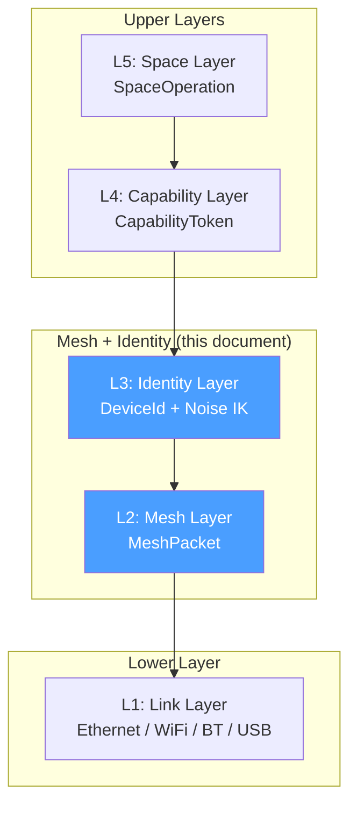
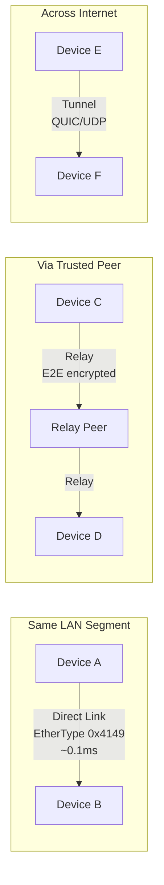
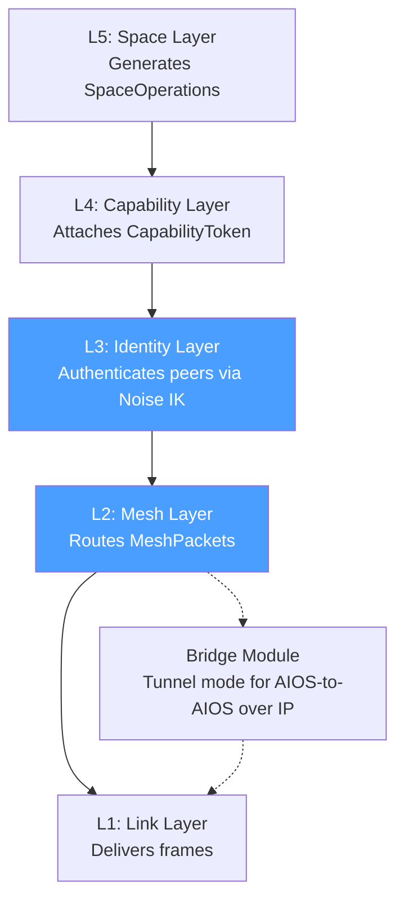

# AIOS Networking — Mesh Layer

**Part of:** [networking.md](../networking.md) — Network Translation Module
**Related:** [anm.md](./anm.md) — ANM specification, [bridge.md](./bridge.md) — Bridge Module, [security.md](./security.md) — Network security, [../../security/decentralisation.md](../../security/decentralisation.md) — Decentralisation, [../../experience/identity/core.md](../../experience/identity/core.md) — Cryptographic identity

-----

## M1. Overview

The Mesh Layer (L2) and Identity Layer (L3) form the core transport and authentication substrate of the AI Network Model (ANM). Together they provide peer discovery, multi-path routing, and mandatory encryption for all AIOS inter-device communication.



**Key properties:**

- **Three transport modes**: Direct Link (raw Ethernet), Relay (forwarded through a trusted peer), Tunnel (QUIC/UDP encapsulation)
- **Noise IK handshake**: 1-RTT for first contact, 0-RTT for returning peers, mandatory encryption with no plaintext mode
- **Identity-based routing**: `DeviceId = sha256(Ed25519_public_key)` — identity is the address, not IP
- **Graduated trust**: Full (own devices) > Delegated (paired peers) > Service (relay/backup nodes) > Unknown

-----

## M2. Identity Layer (L3)

The Identity Layer binds cryptographic identity to every network operation. A device's address is derived from its public key — never assigned by a server, never dependent on network topology.

### M2.1 DeviceId

```rust
/// A 32-byte device identifier derived from the device's Ed25519 public key.
/// Globally unique, permanent, and self-certifying.
pub struct DeviceId([u8; 32]); // sha256(ed25519_public_key)
```

DeviceId properties:

| Property | Value | Rationale |
|---|---|---|
| Derivation | `sha256(Ed25519_public_key)` | Self-certifying; no registration authority |
| Size | 32 bytes | Full SHA-256 output; collision-resistant to 2^128 |
| Lifetime | Permanent | Tied to key pair; never reassigned |
| Namespace | Global | No scoping; same DeviceId everywhere |
| Privacy | Pseudonymous | Not linkable to real identity without out-of-band knowledge |

Two devices with the same DeviceId are cryptographically the same device. NAT is irrelevant because identity is not tied to location.

-----

### M2.2 Peer Identity

```rust
/// Complete identity record for a known peer.
pub struct PeerIdentity {
    /// Permanent device identifier.
    device_id: DeviceId,

    /// Ed25519 public key for signature verification.
    /// DeviceId is derived from this key: device_id == sha256(public_key).
    public_key: Ed25519PublicKey,

    /// X25519 public key for Noise handshake.
    /// Derived from Ed25519 key via birational map (Edwards -> Montgomery).
    x25519_key: X25519PublicKey,

    /// Trust classification for this peer.
    trust_level: TrustLevel,
}
```

-----

### M2.3 Key Hierarchy

The Identity Layer integrates with the AIOS key hierarchy (see [identity/core.md §4](../../experience/identity/core.md)):

```
Primary Key (Ed25519)
    |
    +---> IdentityId (user-level identity)
    |
    +---> Device Keys (per-device Ed25519)
              |
              +---> DeviceId = sha256(device_public_key)
              |
              +---> X25519 (via birational map)
              |         |
              |         +---> Noise IK handshake (encryption)
              |
              +---> Session Keys (ephemeral, per-connection)
```

**Ed25519 to X25519 conversion**: The same Ed25519 key pair used for DeviceId and signature verification is converted to an X25519 Diffie-Hellman key using the birational map between the Edwards and Montgomery curves (via `x25519-dalek`). One key pair serves both identity and encryption.

-----

### M2.4 Graduated Trust

```rust
/// Trust classification for a peer.
/// Determines which operations are permitted and which path selection
/// heuristics apply.
pub enum TrustLevel {
    /// User's own devices (same primary key).
    /// Full space sync, unrestricted relay, mutual backup.
    Full,

    /// Explicitly paired peers (friends, family, colleagues).
    /// Shared spaces as configured, relay with consent.
    Delegated,

    /// Infrastructure peers (relay nodes, backup servers, bootstrap nodes).
    /// Role-specific capabilities only (e.g., mesh.relay, space.backup).
    Service,

    /// Not yet paired. Discovery and handshake only.
    /// No space operations, no relay, no data exchange.
    Unknown,
}
```

Trust level is established during pairing (see [multi-device/pairing.md §3](../multi-device/pairing.md)) and stored in the peer table. Trust can be upgraded (pairing) or downgraded (revocation) but never inferred from network proximity.

-----

## M3. Noise IK Protocol

### M3.1 Why Noise over TLS

| Property | Noise IK | TLS 1.3 |
|---|---|---|
| Topology | Peer-to-peer (symmetric) | Client-server (asymmetric) |
| Identity model | Raw public keys | X.509 certificates |
| First contact | 1-RTT (IK pattern) | 1-RTT (+ certificate chain validation) |
| Returning peer | 0-RTT (PSK mode) | 0-RTT (session tickets) |
| Forward secrecy | Full (after Message 2) | Full |
| Identity hiding | Initiator hidden from passive observer | Server identity visible in SNI |
| Code size | ~5 KB (snow crate, no_std) | ~300 KB (rustls + webpki) |
| CAs required | No | Yes (~150 root CAs) |
| Cipher negotiation | Fixed (proven secure) | Negotiated (attack surface) |
| Mutual auth | Always | Server default, client optional |
| Replay protection | Built-in nonce | Session ticket replay window |

Noise IK is chosen because ANM is fundamentally peer-to-peer: every connection is mutually authenticated between equals. TLS's client-server asymmetry, certificate authority dependencies, and SNI leakage are structural mismatches for mesh networking. The Bridge Module uses TLS (via rustls) for legacy IP connections where CAs are required.

-----

### M3.2 Noise IK Handshake

The IK pattern means: Initiator sends its static key (`s`), and the responder's static key is Known (`K`) to the initiator beforehand (from prior discovery or peer table).

```
Initiator (knows responder's static key)         Responder
    |                                                  |
    |  Message 1: e, es, s, ss                         |
    |  (48B ephemeral + encrypted static + 0-RTT data) |
    |------------------------------------------------->|
    |                                                  |
    |  Message 2: e, ee, se                            |
    |  (48B ephemeral + response payload)              |
    |<-------------------------------------------------|
    |                                                  |
    [Full forward secrecy established]                 |
    |          Transport messages (encrypted)           |
    |<================================================>|
```

- **Message 1** (48 bytes + optional 0-RTT payload): Initiator generates ephemeral key `e`, performs `es` (ephemeral-static) and `ss` (static-static) Diffie-Hellman, sends encrypted static key and optional early data. For returning peers with a pre-shared key (PSK), this message carries genuine 0-RTT data without replay risk.
- **Message 2** (48 bytes + response): Responder generates ephemeral key `e`, performs `ee` (ephemeral-ephemeral) and `se` (static-ephemeral) Diffie-Hellman. After this message, both sides share a transport key with full forward secrecy.

-----

### M3.3 Session State

```rust
/// Active Noise session state for an authenticated peer connection.
pub struct NoiseSession {
    /// Current handshake/transport state.
    state: NoiseState,

    /// Local static X25519 key (derived from device Ed25519 key).
    local_static: X25519SecretKey,

    /// Remote peer's static X25519 key (learned during handshake).
    remote_static: Option<X25519PublicKey>,

    /// Transport cipher state (ChaCha20-Poly1305 or AES-256-GCM).
    cipher: CipherState,

    /// Handshake hash (h) — binding value for channel binding.
    handshake_hash: [u8; 32],
}

pub enum NoiseState {
    /// Sending Message 1 (initiator) or waiting for Message 1 (responder).
    Initiating,

    /// Received Message 1, sending Message 2.
    Responding,

    /// Handshake complete. All subsequent messages use transport keys.
    Transport,
}
```

**Cipher selection**: ChaCha20-Poly1305 by default (software-efficient on ARM without AES-NI). AES-256-GCM on platforms with hardware AES acceleration (Apple Silicon, some ARM cores with CE extensions). Cipher is fixed per platform, not negotiated — eliminating cipher suite downgrade attacks.

**Key derivation**: HKDF-SHA256 derives transport keys from the Noise handshake transcript. The handshake hash serves as a channel binding value, preventing session hijack across connections.

-----

## M4. Three Transport Modes

The Mesh Layer provides three transport modes. Each mode carries the same `MeshPacket` format with the same Noise encryption. The choice of mode is transparent to upper layers — the Space Layer sees only space operations, never transport details.



```rust
/// Transport mode for reaching a peer.
pub enum TransportMode {
    /// Raw Ethernet frames on the same L2 network segment.
    DirectLink {
        mac: MacAddress,
        interface: InterfaceId,
    },

    /// Forwarded through a mutually trusted peer.
    Relay {
        via: DeviceId,
        hops: u8,
    },

    /// Encapsulated in QUIC/UDP across the internet.
    Tunnel {
        endpoint: SocketAddr,
        quic_session: QuicSessionId,
    },
}
```

-----

### M4.1 Direct Link

Raw Ethernet frames with custom AIOS EtherType `0x4149` ("AI" in ASCII). No IP stack, no TCP, no TLS. Noise IK encryption provides confidentiality and authentication directly over the link layer.

```
Ethernet Frame (Direct Link):
+------------------+------------------+-----------+---------------------+
| Dst MAC (6B)     | Src MAC (6B)     | 0x4149    | MeshPacket          |
|                  |                  | (2B)      | (Noise-encrypted)   |
+------------------+------------------+-----------+---------------------+
                                        14B header + payload (up to 1486B)
```

| Property | Value |
|---|---|
| Latency | ~0.1 ms (hardware + Noise overhead) |
| MTU | 1486 bytes (1500 - 14 Ethernet header) |
| Encryption | Noise IK (mandatory) |
| Discovery | ANNOUNCE broadcast on EtherType 0x4149 |
| Use case | Same LAN segment (WiFi, Ethernet, virtual bridge) |

Direct Link is the fastest path between two AIOS devices. It eliminates the entire IP stack — no ARP, no DHCP, no DNS, no TCP, no TLS. The only overhead above raw Ethernet is Noise encryption (~16 bytes AEAD tag + nonce).

-----

### M4.2 Relay

Encrypted mesh packets forwarded through an intermediary peer that holds the `mesh.relay` capability. The relay cannot read packet content — Noise provides end-to-end encryption between source and destination. The relay sees only the `MeshHeader` (source and destination DeviceId).

| Property | Value |
|---|---|
| Encryption | End-to-end Noise IK (relay is blind) |
| Relay trust | Relay cannot read content, cannot forge identity |
| Discovery | Auto-discovered from peer table |
| Max hops | 3 (configurable; prevents routing loops) |
| Use case | No direct path, but a mutual peer exists |

Relay peers are selected from the peer table based on:
1. Both source and destination have a path to the relay
2. Relay holds `mesh.relay` capability
3. Lowest estimated latency (sum of source-relay + relay-destination)

Multiple relay paths may exist simultaneously for redundancy. Failover between relays is automatic.

-----

### M4.3 Tunnel

Mesh packets encapsulated in QUIC/UDP for transit across the IP internet. QUIC provides NAT traversal, connection migration (device changes network without dropping session), and multiplexing. IP is the carrier, not the identity — DeviceId remains the address throughout.

```
UDP Datagram (Tunnel mode):
+----------+----------+------+---------------------------+
| IP Hdr   | UDP Hdr  | QUIC | MeshPacket                |
| (20/40B) | (8B)     | Hdr  | (Noise-encrypted payload) |
+----------+----------+------+---------------------------+
```

| Property | Value |
|---|---|
| Encapsulation | QUIC (quinn crate) over UDP |
| Encryption | Noise IK inside QUIC (double encryption) |
| NAT traversal | QUIC connection migration + STUN |
| Use case | Peers across the internet |

The double encryption (Noise inside QUIC) is intentional and harmless. QUIC encryption protects the tunnel metadata; Noise encryption protects the mesh payload end-to-end. Stripping QUIC encryption at a middlebox (e.g., compromised ISP) reveals only an opaque Noise-encrypted blob, not the space operations within.

-----

### M4.4 Path Selection Algorithm

```
1. Check peer table for all known paths to destination DeviceId
2. Filter paths by liveness (last_verified < MAX_STALE_DURATION)
3. Sort by preference:
     a. Direct Link (lowest latency)
     b. Relay (sort by estimated latency, prefer fewer hops)
     c. Tunnel (highest latency but always reachable)
4. Try top-ranked path
5. On failure: try next path in sorted order
6. If all paths exhausted: queue packet for Shadow Engine retry
```

Path selection is transparent to upper layers. The Space Layer issues a `SpaceOperation`; the Mesh Layer selects the best available path and handles failover without notification. Upper layers observe only latency changes, never transport mode changes.

-----

## M5. Peer Discovery Protocol

### M5.1 Link-Local Discovery

Custom Ethernet broadcast frame sent on EtherType `0x4149` every 30 seconds or on link state change (interface up, address change, new network join).

```
ANNOUNCE Frame Format:
+----------+------+-------------------+----------+---------------------+------------+-----------+
| Version  | Type | DeviceId[0..16]   | Nonce    | Capabilities Bitmap | Noise_e    | Signature |
| (1B)     | (1B) | (16B)             | (8B)     | (8B)                | (32B)      | (64B)     |
+----------+------+-------------------+----------+---------------------+------------+-----------+
Total: 130 bytes payload + 14 bytes Ethernet header = 144 bytes
```

| Field | Size | Description |
|---|---|---|
| Version | 1 byte | Protocol version (currently 1) |
| Type | 1 byte | Frame type: `0x01` = ANNOUNCE, `0x02` = ANNOUNCE_REPLY |
| DeviceId[0..16] | 16 bytes | Truncated DeviceId (sufficient for discovery; full ID exchanged during Noise handshake) |
| Nonce | 8 bytes | Random nonce (prevents replay of stale announcements) |
| Capabilities Bitmap | 8 bytes | 64 bits indicating peer roles (relay, backup, discovery, compute) |
| Noise_e | 32 bytes | Ephemeral X25519 public key for immediate handshake initiation |
| Signature | 64 bytes | Ed25519 signature over all preceding fields (prevents spoofing) |

**Flow:**
1. Device broadcasts ANNOUNCE on all active interfaces
2. Receiving device verifies signature against DeviceId[0..16]
3. If peer is recognized (in peer table), receiving device sends unicast ANNOUNCE_REPLY
4. Both devices initiate Noise IK handshake on the next frame exchange

-----

### M5.2 BLE Discovery

Bluetooth Low Energy advertisement for proximity discovery on mobile and IoT devices.

| Property | Value |
|---|---|
| Service UUID | Custom 128-bit UUID (`0xAIOS` prefix) |
| Payload | DeviceId[0..8] (8 bytes, truncated) |
| Purpose | Discovery only — data transfer occurs over WiFi/Ethernet/mesh |
| Range | ~10m (BLE advertising range) |

BLE discovery triggers a transition to WiFi Direct or LAN discovery for actual data exchange. BLE's bandwidth (~1 Mbps) and latency (~7.5ms connection interval) make it unsuitable for space operations, but its low power consumption makes it the preferred discovery mechanism for battery-powered devices.

-----

### M5.3 WAN Discovery (Stored Peers)

For peers not on the local network, the `PeerStore` maintains a persistent, encrypted mapping of `DeviceId` to last-known reachability information.

```rust
/// Persistent peer reachability record.
pub struct PeerStoreEntry {
    /// The peer's device identifier.
    device_id: DeviceId,

    /// Last known IP address and port (for Tunnel mode).
    last_ip: Option<SocketAddr>,

    /// Peers known to relay traffic to this device.
    relay_peers: Vec<DeviceId>,

    /// When this peer was last successfully contacted.
    last_seen: Timestamp,
}
```

**Discovery sequence for a known peer (ordered by cost):**

1. Try `last_ip` directly (QUIC connect attempt)
2. Ask `relay_peers` if they have a current path
3. STUN hole-punch through NAT
4. Query bootstrap nodes for current IP mapping
5. Queue for later delivery (peer assumed offline)

**Bootstrap nodes** are NOT servers. They maintain only a `DeviceId -> last_known_ip` mapping. They:

- Cannot read data (all mesh traffic is Noise end-to-end encrypted)
- Cannot forge identity (DeviceId is derived from a key pair they do not possess)
- Can be operated by anyone (open-source, self-hostable)
- Are replaceable (switch bootstrap by updating a configuration, not migrating an account)

A compromised bootstrap node can cause only denial of service (return incorrect IPs or nothing). It cannot impersonate peers, read traffic, or forge capabilities.

-----

## M6. Peer Table

The peer table is the Mesh Layer's routing table. It maps each known `DeviceId` to one or more reachability paths, ordered by preference.

```rust
/// Mesh Layer routing table.
pub struct PeerTable {
    peers: BTreeMap<DeviceId, PeerEntry>,
}

/// Complete record for a known peer.
pub struct PeerEntry {
    /// Peer's cryptographic identity and trust level.
    identity: PeerIdentity,

    /// All known paths to this peer, sorted by preference.
    paths: Vec<ReachabilityPath>,

    /// When this peer was last successfully contacted.
    last_seen: Timestamp,

    /// Active Noise session (if handshake completed).
    noise_session: Option<NoiseSession>,

    /// Spaces this peer holds (for content-addressed routing).
    spaces_available: Vec<SpaceHash>,
}

/// A single path to reach a peer.
pub struct ReachabilityPath {
    /// Transport mode (Direct, Relay, or Tunnel).
    mode: TransportMode,

    /// Measured or estimated round-trip latency.
    latency_estimate: Duration,

    /// When this path was last verified as working.
    last_verified: Timestamp,

    /// Measured path quality metrics.
    quality: PathQuality,
}

/// Measured quality metrics for a path.
pub struct PathQuality {
    /// Smoothed round-trip time (exponential moving average).
    smoothed_rtt: Duration,

    /// Packet loss rate (0.0 to 1.0) over the last measurement window.
    loss_rate: f32,

    /// Available bandwidth estimate (bytes/sec), if measured.
    bandwidth_estimate: Option<u64>,
}
```

**Path maintenance**: The Mesh Layer periodically verifies paths by sending Heartbeat packets. Paths not verified within `MAX_STALE_DURATION` (default: 120 seconds for Direct Link, 300 seconds for Relay/Tunnel) are marked stale and deprioritized. Completely dead paths are removed after `MAX_DEAD_DURATION` (default: 3600 seconds).

-----

## M7. Mesh Packet Format

All transport modes carry the same `MeshPacket` format. The Noise-encrypted payload contains an `IdentityFrame` (L3), which in turn contains an `AuthorizedOp` (L4) wrapping a `SpaceOperation` (L5).

```rust
/// Wire-format mesh packet.
pub struct MeshPacket {
    /// Plaintext header (visible to relays for routing).
    header: MeshHeader,

    /// Noise-encrypted payload containing the IdentityFrame.
    encrypted_payload: Vec<u8>,
}

/// Mesh packet header (plaintext, visible to relays).
pub struct MeshHeader {
    /// ANM protocol version (currently 1).
    version: u8,

    /// Packet type discriminator.
    packet_type: PacketType,

    /// Source device identifier.
    source_id: DeviceId,

    /// Destination device identifier.
    dest_id: DeviceId,

    /// Monotonically increasing sequence number (per-session).
    sequence: u32,

    /// Packet flags (fragmentation, priority, etc.).
    flags: PacketFlags,
}

/// Mesh packet type discriminator.
pub enum PacketType {
    /// Normal space operation data.
    SpaceOperation,

    /// Peer discovery (ANNOUNCE / ANNOUNCE_REPLY).
    Discovery,

    /// Mutual capability negotiation after connection.
    CapabilityExchange,

    /// Keepalive for path liveness detection.
    Heartbeat,

    /// Peer table exchange (share known peers with trusted peers).
    PeerInfo,
}
```

**Header size**: 1 (version) + 1 (type) + 32 (source) + 32 (dest) + 4 (sequence) + 2 (flags) = **72 bytes**. For Direct Link, the source and destination DeviceId fields may be truncated to 16 bytes each (sufficient for local disambiguation), reducing the header to 40 bytes.

-----

## M8. Capability Exchange Protocol

When two peers establish a Noise session, they perform a capability exchange to determine which operations are mutually permitted.

**Exchange flow:**

1. **Initiator** sends: list of spaces willing to share, with access level per space (read-only, read-write, sync)
2. **Responder** evaluates each offer against its own sharing policies, responds with accepted offers plus its own reciprocal offers
3. **Both sides** install capability tokens in their kernel capability tables (see [security/model/capabilities.md §3](../../security/model/capabilities.md))
4. **Attenuation**: Capabilities can only be narrowed, never broadened. A peer offering read-write access can be accepted as read-only, but a read-only offer cannot be escalated to read-write
5. **Revocation**: Either side can revoke any capability at any time by sending a revocation message and removing the token from the kernel capability table

```rust
/// Capability exchange message sent during post-handshake negotiation.
pub struct CapabilityOffer {
    /// Spaces this peer is willing to share.
    offered_spaces: Vec<SpaceOffer>,

    /// Roles this peer can fulfill (relay, backup, etc.).
    offered_roles: Vec<RoleCapability>,
}

/// A single space sharing offer.
pub struct SpaceOffer {
    /// Hash of the space identifier.
    space_hash: SpaceHash,

    /// Maximum access level offered.
    access_level: AccessLevel,

    /// Temporal bounds (optional expiration).
    expires: Option<Timestamp>,
}

pub enum AccessLevel {
    /// Read objects from this space.
    Read,

    /// Read and write objects.
    ReadWrite,

    /// Full sync (read, write, subscribe to changes).
    Sync,
}
```

Capability exchange is authenticated by the Noise session — only the peer whose identity was verified during the handshake can issue or accept capabilities.

-----

## M9. Integration with ANM Layers

The Mesh and Identity Layers serve as the transport backbone connecting all other ANM layers.



| Interface | Direction | Description |
|---|---|---|
| L1 -> L2 | Up | Link Layer delivers raw frames to Mesh Layer for decapsulation |
| L2 -> L1 | Down | Mesh Layer hands framed MeshPackets to Link Layer for transmission |
| L3 -> L2 | Down | Identity Layer provides authenticated, encrypted payloads to Mesh Layer |
| L2 -> L3 | Up | Mesh Layer passes received packets to Identity Layer for decryption and authentication |
| L4 -> L3 | Down | Capability Layer attaches authorization tokens before Identity Layer encrypts |
| L5 -> L4 | Down | Space Layer generates operations that Capability Layer authorizes |
| L2 -> Bridge | Lateral | Tunnel mode uses Bridge Module for QUIC/UDP encapsulation over IP |

The Bridge Module interacts with the Mesh Layer at the Tunnel level — it provides UDP transport for mesh packets but does not participate in Noise encryption or capability enforcement. Bridge-to-Bridge communication between two AIOS devices preserves end-to-end Noise encryption.

-----

## M10. Mesh Security Properties

The Mesh and Identity Layers provide the following security guarantees. These are structural properties of the protocol, not configuration options.

| Property | Mechanism | Degradation |
|---|---|---|
| **Always encrypted** | Noise IK on every connection; no plaintext mode exists | Never degrades |
| **Forward secrecy** | Ephemeral DH in every handshake (ee key agreement) | Never degrades |
| **Identity verified** | Ed25519 signature chain from DeviceId to handshake | Never degrades |
| **Relay-blind** | End-to-end Noise encryption; relay sees only MeshHeader | Never degrades |
| **Replay resistant** | Nonce in every handshake; monotonic sequence numbers in transport | Never degrades |
| **No listening ports** | Stateless until Noise handshake authenticates peer | Never degrades |
| **Mutual authentication** | Noise IK pattern requires both sides to prove identity | Never degrades |

**What the Mesh Layer does NOT protect against:**

- **Traffic analysis**: Packet timing and size patterns may leak information about activity. Mitigation: optional padding and traffic shaping (future work).
- **Denial of service**: A peer can flood ANNOUNCE frames on the local segment. Mitigation: rate limiting per source MAC, ANNOUNCE signature verification before processing.
- **Compromised device key**: If a device's Ed25519 private key is compromised, the attacker can impersonate that device. Mitigation: key revocation via the identity system (see [identity/core.md §4](../../experience/identity/core.md)).
- **Endpoint compromise**: If the device itself is compromised, the Mesh Layer cannot protect data after decryption. Mitigation: this is outside the Mesh Layer's scope; defense is provided by the capability system (L4) and behavioral monitor.
