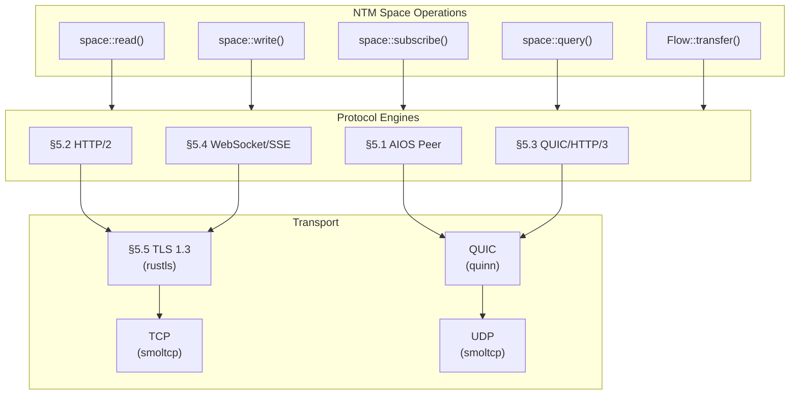
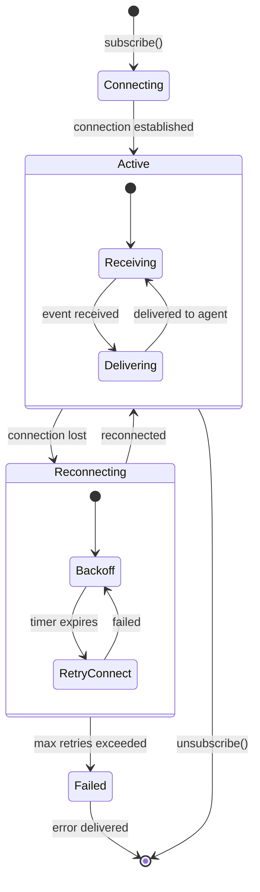

# AIOS Networking — Protocol Engines

**Part of:** [networking.md](../networking.md) — Network Translation Module
**Related:** [stack.md](./stack.md) — Network stack, [components.md](./components.md) — NTM components, [security.md](./security.md) — TLS and credential management

-----

## 5. Protocol Engines

The protocol engines translate between NTM space operations and wire protocols. Each engine handles a specific protocol family, converting `space::read()` / `space::write()` / `space::subscribe()` into the appropriate wire format.



**Protocol selection** is handled by the Connection Manager (§3.2). The NTM never exposes protocol choice to agents — it selects the optimal engine based on the `SpaceEndpoint` configuration and runtime conditions.

-----

### 5.1 AIOS Peer Protocol

When two AIOS machines talk to each other, they don't need HTTP. They speak a native protocol that carries the full richness of spaces.

#### 5.1.1 Protocol Design

```text
AIOS Peer Protocol:
    Transport: QUIC (connection migration, multiplexing, 0-RTT)
    Auth: Mutual TLS with AIOS identity certificates
    Encoding: Structured binary (not text-based like HTTP)
    Framing: Length-prefixed messages on QUIC streams

    Operations:
        SPACE_READ    (key)            → object + metadata
        SPACE_WRITE   (key, value)     → ack + version
        SPACE_LIST    (prefix, filter) → object list
        SPACE_QUERY   (semantic query) → results
        SPACE_SUBSCRIBE (filter)       → event stream
        SPACE_SYNC    (since_version)  → delta updates
        FLOW_TRANSFER (source, dest)   → streaming transfer
        CAPABILITY_EXCHANGE            → mutual capability negotiation
```

#### 5.1.2 Capability Exchange

When two AIOS devices connect, they negotiate capabilities — this is unique to AIOS-to-AIOS communication:

```text
Machine A: "I have space 'photos/vacation'. I'm willing to grant you: read."
Machine B: "I accept. I have space 'music/shared'. I'm willing to grant you: read, write."
Machine A: "I accept read only."

→ Machine A can read Machine B's shared music
→ Machine B can read Machine A's vacation photos
→ Both are enforced by kernel capabilities
→ Either side can revoke at any time
```

This is AirDrop but generalized, persistent, capability-controlled, and working for any space — not just individual file transfers.

#### 5.1.3 Discovery

AIOS devices discover each other on the local network using mDNS/DNS-SD (RFC 6762/6763):

```text
Service type: _aios-peer._quic.local
TXT records:
    device_id=<AIOS device fingerprint>
    spaces=<comma-separated list of shared space prefixes>
    version=<protocol version>
    caps=<capability flags>

Discovery flow:
    1. Device broadcasts mDNS query for _aios-peer._quic.local
    2. Nearby AIOS devices respond with their endpoints
    3. Mutual TLS handshake establishes identity
    4. Capability exchange negotiates shared spaces
    5. Connections are persistent (reconnect on migration)
```

#### 5.1.4 Wire Format

```text
Message frame (on QUIC stream):
    ┌────────────────────────────────────────┐
    │ Length (4 bytes, big-endian)            │
    │ OpCode (2 bytes)                       │
    │ Request ID (4 bytes)                   │
    │ Flags (2 bytes)                        │
    │ Payload (variable)                     │
    └────────────────────────────────────────┘

OpCodes:
    0x0001  SPACE_READ_REQ
    0x0002  SPACE_READ_RSP
    0x0003  SPACE_WRITE_REQ
    0x0004  SPACE_WRITE_RSP
    0x0005  SPACE_LIST_REQ
    0x0006  SPACE_LIST_RSP
    0x0007  SPACE_QUERY_REQ
    0x0008  SPACE_QUERY_RSP
    0x0009  SPACE_SUBSCRIBE_REQ
    0x000A  SPACE_EVENT (server-push)
    0x000B  SPACE_SYNC_REQ
    0x000C  SPACE_SYNC_RSP
    0x000D  FLOW_TRANSFER_REQ
    0x000E  FLOW_TRANSFER_DATA (streaming)
    0x000F  FLOW_TRANSFER_DONE
    0x0010  CAPABILITY_EXCHANGE
    0x0011  CAPABILITY_REVOKE
    0x00FF  ERROR

Flags:
    bit 0: compressed (zstd)
    bit 1: encrypted (beyond TLS — e2e for relay)
    bit 2: idempotent (safe to retry)
    bit 3: priority (high/normal)
```

#### 5.1.5 Stream Multiplexing

Each space operation type gets its own QUIC stream, enabling independent flow control:

```text
Stream allocation:
    Stream 0: Control channel (capability exchange, heartbeat)
    Stream 1: Space reads (request-response)
    Stream 2: Space writes (request-response)
    Stream 3+: Subscriptions (long-lived event streams)
    Unidirectional streams: Flow transfers (bulk data)
```

-----

### 5.2 HTTP/2 Engine

The HTTP/2 engine handles communication with standard web APIs (the majority of remote spaces).

#### 5.2.1 h2 Crate Integration

AIOS uses the [h2 crate](https://crates.io/crates/h2) for HTTP/2 framing. h2 is pure Rust, async-capable, and handles:

- HPACK header compression
- Stream multiplexing (up to `SETTINGS_MAX_CONCURRENT_STREAMS`)
- Flow control (per-stream and per-connection)
- Server push handling
- GOAWAY and stream reset

#### 5.2.2 Space Operation Mapping

```text
space::read(key)           → GET  /{path}/{key}
space::write(key, value)   → PUT  /{path}/{key}  (body: value)
space::delete(key)         → DELETE /{path}/{key}
space::list(prefix)        → GET  /{path}?prefix={prefix}
space::query(q)            → POST /{path}/_query  (body: query)
space::subscribe(filter)   → Uses WebSocket/SSE instead (§5.4)
```

#### 5.2.3 Connection Lifecycle

```rust
/// HTTP/2 connection managed by the Connection Manager.
pub struct Http2Connection {
    /// h2 client connection handle
    connection: h2::client::Connection<TlsStream>,
    /// Send half (for new requests)
    sender: h2::client::SendRequest<Bytes>,
    /// Active streams count
    active_streams: u32,
    /// Maximum concurrent streams (from server SETTINGS)
    max_streams: u32,
    /// Connection health metrics
    health: ConnectionHealth,
}
```

The NTM reuses HTTP/2 connections aggressively — a single connection to `api.openai.com` can serve 100+ concurrent space operations from different agents via stream multiplexing.

#### 5.2.4 Response Handling

The HTTP/2 engine translates HTTP responses into space operation results:

```text
HTTP 200 OK              → Ok(content)
HTTP 201 Created         → Ok(content) with version
HTTP 204 No Content      → Ok(empty)
HTTP 301/302/307/308     → Follow redirect (up to 10 hops)
HTTP 304 Not Modified    → Return cached content
HTTP 400 Bad Request     → SpaceError::TooLarge or internal error
HTTP 401/403             → SpaceError::PermissionDenied
HTTP 404                 → SpaceError::NotFound
HTTP 409                 → SpaceError::Conflict
HTTP 413                 → SpaceError::TooLarge
HTTP 429                 → SpaceError::Unavailable { retry_after }
HTTP 500/502/503         → SpaceError::Unavailable { retry_after }
```

Content-Type negotiation is automatic — the engine sets `Accept` headers based on the space's expected content type and deserializes responses accordingly.

-----

### 5.3 QUIC and HTTP/3

QUIC provides connection migration, 0-RTT resumption, and multiplexing without head-of-line blocking — ideal for mobile devices and unreliable networks.

#### 5.3.1 quinn Integration

AIOS uses [quinn](https://crates.io/crates/quinn) for QUIC support. quinn is pure Rust, built on rustls, and provides:

- Full QUIC v1 (RFC 9000) implementation
- 0-RTT connection resumption
- Connection migration (IP/port changes)
- Per-stream flow control (no HOL blocking)
- DATAGRAM extension (RFC 9221) for low-latency unreliable delivery

#### 5.3.2 QUIC vs TCP Selection

The Connection Manager selects QUIC over TCP when:

```text
Prefer QUIC when:
    - Server advertises h3 via Alt-Svc header or HTTPS DNS record
    - Connection will be long-lived (subscription, sync)
    - Client is mobile (connection migration benefits)
    - Multiple concurrent streams expected

Prefer TCP (HTTP/2) when:
    - Server doesn't support QUIC
    - UDP is blocked by network (fallback)
    - Single short request (TCP 3-way handshake ≈ QUIC 1-RTT)
    - Debugging/inspection needed (QUIC is opaque to middleboxes)
```

#### 5.3.3 Connection Migration

QUIC connections survive network changes (WiFi → cellular, IP address change):

```text
Connection migration flow:
    1. Agent has active space::subscribe() via QUIC to api.example.com
    2. Device moves from WiFi to cellular (IP changes)
    3. quinn detects path change
    4. quinn sends PATH_CHALLENGE on new path
    5. Server responds with PATH_RESPONSE
    6. Connection continues on new path — no reconnect, no dropped events
    7. Agent's subscription is uninterrupted
```

This is transparent to the NTM and agents — quinn handles migration internally.

#### 5.3.4 0-RTT Resumption

For previously visited spaces, QUIC can send data in the first packet (0-RTT):

```text
First connection to openai/v1:
    Client → Server: ClientHello + transport params (1 RTT)
    Server → Client: ServerHello + certificate (1 RTT)
    Client → Server: Finished + first request (ready)
    Total: 2 RTT before first request

Subsequent connections (with session ticket):
    Client → Server: ClientHello + 0-RTT data (first request) (0 RTT overhead)
    Server → Client: ServerHello + response (ready)
    Total: 0 RTT overhead — request sent immediately
```

The Connection Manager stores QUIC session tickets in the TLS session cache, shared with the rustls session cache (§5.5).

-----

### 5.4 WebSocket and Server-Sent Events

Real-time space subscriptions (`space::subscribe()`) use WebSocket or SSE depending on server support.

#### 5.4.1 WebSocket Engine

```text
space::subscribe("collab/doc/123", on_change) maps to:

    1. NTM opens WebSocket connection:
       GET /collab/doc/123 HTTP/1.1
       Upgrade: websocket
       Connection: Upgrade
       Sec-WebSocket-Key: dGhlIHNhbXBsZSBub25jZQ==

    2. Server upgrades:
       HTTP/1.1 101 Switching Protocols
       Upgrade: websocket
       Connection: Upgrade

    3. Bidirectional message stream:
       Server → Client: { "event": "change", "key": "123", "version": 48, "data": ... }
       Client → Server: { "ack": 48 }
```

The NTM maintains the WebSocket connection and translates incoming messages into space change events for the subscribing agent. If the connection drops, the Resilience Engine (§3.4) reconnects with the last-known version for delta sync.

#### 5.4.2 Server-Sent Events (SSE)

For servers that support SSE but not WebSocket:

```text
space::subscribe("feed/news", on_change) maps to:

    GET /feed/news HTTP/2
    Accept: text/event-stream

    Response (streamed):
    event: change
    data: {"key": "article-42", "action": "create", ...}

    event: change
    data: {"key": "article-43", "action": "create", ...}
```

SSE is simpler (server→client only) and works over standard HTTP/2 streams. The NTM prefers SSE over WebSocket when the subscription is read-only (no client→server messages needed).

#### 5.4.3 Subscription Lifecycle



During reconnection, the NTM sends the last-received version/event-id to the server for gap-free delivery. Events received during reconnection are buffered (up to 1000 events) and delivered in order once the agent's subscription handler is ready.

-----

### 5.5 TLS and rustls

All network communication (except local AIOS peer discovery) uses TLS 1.3. AIOS uses [rustls](https://crates.io/crates/rustls) — a pure Rust TLS implementation with no dependency on OpenSSL.

#### 5.5.1 Why rustls

| Requirement | rustls | OpenSSL |
|---|---|---|
| Memory safety | Rust guarantees | C, frequent CVEs |
| `no_std` (partial) | rustls-platform-verifier | Not possible |
| License | Apache-2.0/MIT | OpenSSL License (complex) |
| Binary size | ~500 KiB | ~3-5 MiB |
| TLS 1.3 only option | Configurable | Must explicitly disable <1.3 |

#### 5.5.2 TLS Configuration

```rust
/// System-wide TLS configuration managed by the NTM.
pub struct TlsConfig {
    /// Root certificate store (Mozilla roots via webpki-roots)
    root_store: RootCertStore,
    /// Client certificate for mTLS (AIOS device identity)
    client_cert: Option<CertifiedKey>,
    /// Session cache (TLS 1.3 tickets for 0-RTT)
    session_cache: Arc<ServerSessionMemoryCache>,
    /// Certificate pins for well-known spaces
    pins: BTreeMap<String, Vec<CertificatePin>>,
    /// Minimum TLS version (1.3 by default, 1.2 allowed for legacy)
    min_version: TlsVersion,
}
```

#### 5.5.3 Certificate Pinning

Well-known provider spaces have pinned certificates to prevent MITM attacks:

```text
Pinning policy:
    "openai/v1"     → pin to Let's Encrypt intermediate + DigiCert root
    "github/api"    → pin to DigiCert intermediate
    "anthropic/v1"  → pin to Cloudflare intermediate + root

Pin violation behavior:
    1. Connection refused
    2. Audit log: "TLS pin violation for openai/v1 — presented cert chain does not match pin"
    3. SpaceError::Unreachable returned to agent
    4. User notified via security event (Inspector, see inspector.md)
```

Pins are updated via OS security updates, not per-agent. An agent cannot override or disable pins.

#### 5.5.4 Session Resumption

TLS 1.3 session tickets enable 0-RTT resumption:

```text
First connection to api.openai.com:
    ClientHello → ServerHello → Certificate → Finished
    2 RTT, ~80ms on typical network

    Server sends NewSessionTicket (cached by NTM)

Second connection (within ticket lifetime, typically 24h):
    ClientHello + early_data (0-RTT)
    1 RTT, ~40ms — request data sent with first packet

    Note: 0-RTT data is replayable. Only safe for idempotent
    operations (space::read). Non-idempotent operations
    (space::write) wait for full handshake confirmation.
```

#### 5.5.5 Mutual TLS (mTLS)

For AIOS-to-AIOS connections, mutual TLS establishes bilateral identity:

```text
mTLS flow:
    1. Client presents AIOS device certificate (from device identity space)
    2. Server presents AIOS device certificate
    3. Both verify against AIOS CA (built into OS image)
    4. Connection established with bilateral identity proof
    5. Capability exchange (§5.1.2) proceeds on verified connection
```

Device certificates are generated during first boot and stored in the identity space (see [identity.md](../../experience/identity.md)). They are never exported or accessible to agents.
