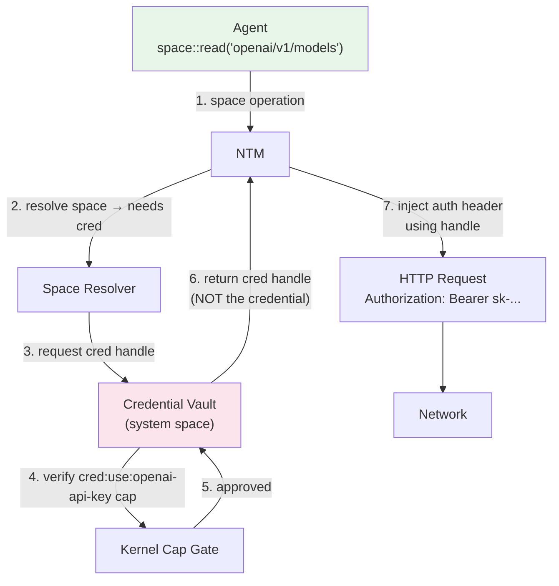

# AIOS Networking — Network Security

**Part of:** [networking.md](../networking.md) — Network Translation Module
**Related:** [anm.md](./anm.md) — ANM specification, [mesh.md](./mesh.md) — Mesh Layer, [bridge.md](./bridge.md) — Bridge Module, [components.md](./components.md) — Capability Gate summary (§3.5), [protocols.md](./protocols.md) — TLS architecture, [../../security/model.md](../../security/model.md) — Security model

-----

## 6. Network Security

AIOS networking security follows the AI Network Model (ANM), where security is **structural** rather than policy-based. Traditional network security layers defenses on top of an inherently insecure transport (TCP/IP). ANM builds security into the network model itself — encryption is mandatory, authorization determines reachability, and identity is cryptographic.

This document covers the five ANM security layers and how they map to AIOS networking implementation. For mesh-native traffic, security is a property of the protocol. For bridge traffic (legacy TCP/IP), additional defense-in-depth measures compensate for the weaker trust model.

-----

### 6.0 ANM Security Model

The AI Network Model defines five security layers, ordered from lowest (closest to the wire) to highest (closest to the application). Each layer provides a distinct guarantee, and the guarantees compose — a packet traverses all five layers on both send and receive.

```text
L5: Behavioral Monitor    — anomalous pattern detection (AIRS-dependent)
L4: Content Verification  — SHA-256 content hashes, Merkle DAG integrity
L3: Capability Gate        — kernel-enforced authorization (NEVER degrades)
L2: Mesh Encryption        — Noise IK, always-on, no plaintext mode
L1: Peer Authentication    — Ed25519 chain, DeviceId = sha256(pubkey), no CAs
```

#### Layer Descriptions

**L1 — Peer Authentication** authenticates every peer cryptographically. A device's identity is `DeviceId = sha256(Ed25519_public_key)` — derived from its key pair, not assigned by any authority. There are no certificate authorities in the mesh. Trust is established through direct pairing (SPAKE2+), not through CA hierarchies. Authentication never degrades to anonymous or unverified connections.

**L2 — Mesh Encryption** provides mandatory encryption via the Noise IK handshake pattern (see [mesh.md §M3](./mesh.md)). Every mesh packet is encrypted with forward-secret session keys derived from the Noise handshake. There is no plaintext mode, no configuration to disable encryption, and no "development mode" bypass. ChaCha20-Poly1305 is the default AEAD; AES-256-GCM is used on platforms with hardware AES acceleration.

**L3 — Capability Gate** is the kernel-enforced authorization boundary. Every network operation requires a valid `CapabilityToken` — signed, attenuatable, temporally bounded. No token means no packet: the operation is never constructed, never routed, never delivered. This layer **NEVER degrades** — there is no partial authorization, no fallback to a weaker check, no "allow if capability service is unavailable." Capability enforcement is the structural zero-trust boundary of ANM.

**L4 — Content Verification** ensures data integrity through content-addressed hashing. Objects are identified by `ContentHash` (SHA-256), and version history is maintained in a Merkle DAG. A receiver can verify that data has not been tampered with by checking the hash — no trust in the transport is required. For bridge-originated content, content verification is weaker because the hash is computed on arrival, not at the source.

**L5 — Behavioral Monitor** detects anomalous network patterns through statistical analysis and, when AIRS is available, through ML-based anomaly detection. This layer identifies unusual traffic volumes, unexpected destinations, timing anomalies, and behavioral drift from established baselines. It operates on the audit trail generated by L3 (Capability Gate). See [behavioral-monitor](../../intelligence/behavioral-monitor.md) for the full detection architecture.

#### ANM Security vs OSI Security

| Security Concern | OSI / Traditional | ANM / AIOS |
|---|---|---|
| **Identity verification** | CA hierarchy (~150 root CAs, any can vouch for any server) | Ed25519 key chain, self-certifying DeviceId, no CAs |
| **Authentication model** | Server proves identity to client; client auth optional | Mutual authentication always (Noise IK pattern) |
| **Firewalls** | External policy appliance filtering by IP/port | Unnecessary — L3 Capability Gate is the filter |
| **VPNs** | Encrypted tunnel to trusted network perimeter | Unnecessary — every connection is individually encrypted |
| **Transport encryption** | TLS bolted on at session layer (optional, negotiated) | Noise IK at mesh layer (mandatory, no negotiation) |
| **API keys / tokens** | Application manages credentials, often in environment variables | Credential Vault (Bridge only); mesh peers authenticate cryptographically |
| **Audit trail** | Per-application logging (if any) | Structural — every L3 operation audited to tamper-evident log |

-----

### 6.1 Kernel Capability Gate

The capability gate is the only mandatory kernel component in the networking subsystem. Every network operation passes through it before reaching the NTM. It is non-negotiable and non-bypassable.

> **ANM Context:** This is ANM Layer 3 (Capability Gate) — the structural zero-trust boundary. In the ANM security model, no capability token means no packet. This invariant holds for both mesh and bridge traffic paths.

#### 6.1.1 Gate Architecture

```rust
/// Kernel-level network capability enforcement.
/// A few hundred lines of kernel code — the minimum kernel surface.
fn network_gate(
    agent: AgentId,
    operation: NetOperation,
    destination: &ServiceTarget,
) -> Result<GateToken, SpaceError> {
    // 1. Look up agent's capability table
    let caps = capability_store.get(agent)?;

    // 2. Check if any capability permits this operation
    let matching_cap = caps.find_network_cap(operation, destination);

    // 3. Audit the decision (always, even for allowed operations)
    audit_log(AuditEntry {
        timestamp: now(),
        agent,
        operation,
        destination: destination.clone(),
        decision: if matching_cap.is_some() { "ALLOWED" } else { "DENIED" },
        capability: matching_cap.map(|c| c.id()),
    });

    // 4. Return gate token (proof of authorization) or error
    match matching_cap {
        Some(cap) => Ok(GateToken::new(cap, destination)),
        None => Err(SpaceError::PermissionDenied),
    }
}
```

The gate enforces WHO can talk to WHAT. It doesn't understand HTTP or manage TLS. It checks capabilities and logs everything.

#### 6.1.2 Capability Granularity

Network capabilities are fine-grained — not "can access the network" but "can read from this specific space":

```text
Capability: net:read:openai/v1/models
    Grants: Read objects from the "openai/v1/models" space
    Denies: Everything else

    Can:    GET https://api.openai.com/v1/models
    Cannot: GET https://api.openai.com/v1/completions  (different space)
    Cannot: POST https://api.openai.com/v1/models       (write, not read)
    Cannot: GET https://evil.com/exfiltrate              (different space)
    Cannot: TCP connect to 192.168.1.1:22                (no raw socket cap)
```

Capabilities support attenuation — a delegated capability can only be narrower than its parent. An agent with `net:read:openai/v1` can delegate `net:read:openai/v1/models` to a sub-agent, but cannot grant `net:write:openai/v1` (broader operation) or `net:read:anthropic/v1` (different space).

#### 6.1.3 Gate Token

The gate token is a proof-of-authorization that the NTM uses to proceed with the network operation. Tokens are:

- **Short-lived** — valid for a single operation or a bounded time window
- **Unforgeable** — generated by the kernel, verified by the NTM
- **Auditable** — every token issuance is logged

```rust
/// Proof that the kernel approved a network operation.
/// Passed from kernel gate to NTM, verified before I/O.
pub struct GateToken {
    /// The capability that authorized this operation
    cap_id: CapabilityTokenId,
    /// Target destination
    destination: ServiceTarget,
    /// Expiry (tokens are short-lived)
    expires: Timestamp,
    /// HMAC for integrity (kernel-only key)
    signature: [u8; 32],
}
```

-----

### 6.2 Packet Filtering

Packet filtering in ANM operates differently for mesh traffic and bridge traffic. The distinction is structural: mesh traffic is authorized by capability tokens at L3 before any packet is constructed, making IP-based filtering unnecessary. Bridge traffic requires traditional packet-level filtering because it interfaces with the IP-based internet.

#### 6.2.1 Mesh Traffic — Capability IS the Filter

For mesh-native traffic (Direct Link, Relay, Tunnel between AIOS peers), no IP-based packet filtering is needed. The Capability Gate (§6.1) prevents unauthorized operations from generating traffic in the first place. A packet without a valid capability token is never constructed — there is nothing to filter.

```text
Mesh path:
    Agent → Capability Gate (L3) → Noise encryption (L2) → Mesh routing → Wire

    No capability = no packet constructed = nothing to filter.
    Port scanning returns nothing — there are no ports.
    Network scanning returns nothing — unauthenticated peers cannot generate mesh traffic.
```

#### 6.2.2 Bridge Traffic — Capability-Derived Filter Rules

For bridge traffic (TCP/IP to legacy internet services), packet filter rules are derived from active capabilities. This provides defense in depth — even if the NTM has a bug, the packet filter prevents unauthorized traffic.

Instead of traditional firewall rules (static IP/port pairs), AIOS derives packet filter rules from active capabilities:

```text
Agent "research-assistant" has capabilities:
    net:read:openai/v1
    net:read:arxiv/papers

Derived filter rules (automatically generated):
    ALLOW TCP OUT → api.openai.com:443 (agent=research-assistant)
    ALLOW TCP OUT → export.arxiv.org:443 (agent=research-assistant)
    DENY  ALL OUT → * (agent=research-assistant, default deny)
```

Rules are updated dynamically when capabilities are granted or revoked. There is no static firewall configuration file.

#### 6.2.3 Filter Architecture

The packet filter operates at the smoltcp interface level, inspecting packets before they reach the wire:

```rust
/// Packet filter rule derived from active capabilities.
pub struct FilterRule {
    /// Agent this rule applies to
    agent: AgentId,
    /// Allowed direction
    direction: Direction,
    /// Allowed protocol
    protocol: IpProtocol,
    /// Allowed destination (IP or hostname resolved to IP)
    destination: FilterDestination,
    /// Allowed port range
    port_range: (u16, u16),
    /// Action
    action: FilterAction,
}

pub enum Direction {
    Egress,   // Agent → network
    Ingress,  // Network → agent
}

pub enum FilterAction {
    Allow,
    Deny,
    Log,      // Allow but log (for monitoring mode)
}
```

#### 6.2.4 Default Deny

The filter operates on a default-deny basis:

```text
Rule evaluation order:
    1. Check agent-specific ALLOW rules (from capabilities)
    2. Check system-wide ALLOW rules (DNS, DHCP, NTP)
    3. DEFAULT DENY — drop packet, log attempt

System-wide ALLOW rules (always permitted, Bridge traffic only):
    ALLOW UDP OUT → dhcp-server:67    (DHCP client)
    ALLOW UDP OUT → dns-server:53     (DNS resolution)
    ALLOW UDP OUT → ntp-server:123    (Time sync)
    ALLOW ICMP OUT → *                (Ping, path MTU)
```

#### 6.2.5 No eBPF — Capability-Native Filtering

Traditional OSes use eBPF for programmable packet filtering. AIOS doesn't need eBPF because capabilities already express the filtering policy at a higher level of abstraction:

```text
eBPF approach (Linux):
    Write BPF program → load into kernel → attach to interface
    Program inspects packet headers → returns allow/deny
    Complex, powerful, but also a large attack surface

AIOS approach:
    Agent declares space capabilities in manifest
    Kernel derives filter rules from capabilities
    Filter is declarative, not programmable
    No new code runs in the kernel — just capability matching

Trade-off: Less flexible (can't do deep packet inspection in the filter)
Benefit: No eBPF verifier needed, no BPF programs in kernel, smaller attack surface
```

For use cases requiring deep packet inspection (malware scanning, content filtering), the NTM's userspace services handle inspection above the packet filter layer.

-----

### 6.3 Per-Agent Network Isolation

Each agent's network traffic is isolated from other agents, preventing cross-agent packet snooping or traffic analysis. This isolation applies to both mesh and bridge traffic paths.

#### 6.3.1 Isolation Mechanisms

```text
Layer 1: Capability isolation (kernel)
    Each agent has its own capability table.
    Agent A's capabilities are invisible to Agent B.

Layer 2: Connection isolation (NTM)
    Each agent's connections are tracked separately.
    Agent A cannot see or access Agent B's connection pool.
    HTTP/2 streams are logically separated per agent.

Layer 3: Socket isolation (smoltcp)
    Each agent's sockets have separate buffers.
    No shared state between agents at the socket level.

Layer 4: Address space isolation (kernel)
    Agent address spaces are separated (TTBR0 per process).
    DMA buffers are mapped only into the owning agent's space.
```

> **Mesh isolation:** Mesh connections are also isolated per-agent. Each agent's Noise sessions are separate — Agent A's Noise session with a peer device cannot be accessed or observed by Agent B. The Noise session keys, handshake state, and transport cipher state are all per-agent. This means two agents on the same device communicating with the same remote peer establish independent Noise sessions.

#### 6.3.2 Traffic Separation

Even when multiple agents connect to the same remote host, their traffic is logically separated:

```text
Agent A: space::read("github/api/repos")   → HTTP/2 stream 1 on conn #1
Agent B: space::read("github/api/users")   → HTTP/2 stream 3 on conn #1
Agent C: space::read("github/api/issues")  → HTTP/2 stream 5 on conn #1

All share one TCP connection for efficiency,
but Agent A cannot read Agent B's response.
The NTM routes each response to the correct agent.
```

#### 6.3.3 POSIX Process Isolation

Legacy POSIX processes get the same isolation treatment:

```text
Process running curl:
    1. Process calls socket() → POSIX layer allocates space channel
    2. Process calls connect() → Capability gate checks net:raw:<host>:<port>
    3. If allowed: traffic routed through NTM
    4. If denied: connect() returns EACCES
    5. Process cannot see other processes' sockets or traffic
```

-----

### 6.4 Credential Vault

The Credential Vault is a **Bridge Module component**. Mesh peers authenticate cryptographically via Noise IK without stored credentials — the Ed25519 key pair IS the credential, and it never leaves the device's secure storage. The Credential Vault exists specifically for legacy internet services accessed through the Bridge, where API keys, OAuth tokens, and certificates must be injected into HTTP requests.

Agents use credentials without possessing them — the NTM injects credentials into outgoing requests.

#### 6.4.1 Credential Architecture



#### 6.4.2 Credential Storage

```rust
/// Credential stored in the system credential space.
/// Never accessible to agents — only usable via handles.
pub struct StoredCredential {
    /// Unique identifier
    id: CredentialId,
    /// Human-readable name (e.g., "openai-api-key")
    name: String,
    /// The secret value (encrypted at rest)
    value: EncryptedValue,
    /// How to inject this credential into requests
    injection: CredentialInjection,
    /// Which spaces this credential applies to
    scope: Vec<RemoteSpaceId>,
    /// Expiry (for tokens with limited lifetime)
    expires: Option<Timestamp>,
    /// Who created this credential
    source: CredentialSource,
}

pub enum CredentialInjection {
    /// HTTP Authorization header
    BearerToken,
    /// HTTP Basic auth
    BasicAuth { username: String },
    /// Custom HTTP header
    Header { name: String },
    /// URL query parameter (not recommended)
    QueryParam { name: String },
    /// mTLS client certificate
    ClientCert,
}

pub enum CredentialSource {
    UserManual,       // aios credential add ...
    AgentRequest,     // agent requested during install (user approved)
    OAuthFlow,        // OAuth2 authorization code flow
    SystemGenerated,  // device certificates, mTLS
}
```

#### 6.4.3 Credential Lifecycle

```text
Creation:
    aios credential add openai-api-key "sk-..."
    → Encrypted with device key
    → Stored in credential space
    → Space registry updated: openai/v1 → auth: Bearer(cred:openai-api-key)

Usage:
    Agent calls space::read("openai/v1/models")
    → NTM resolves space, finds credential reference
    → NTM requests credential handle from vault
    → Vault checks agent's cred:use:openai-api-key capability
    → Vault returns handle (not the credential itself)
    → NTM uses handle to inject Authorization header
    → Credential value never in agent's address space

Rotation:
    aios credential rotate openai-api-key "sk-new-..."
    → Old value replaced with new value
    → All active connections to openai/v1 are refreshed
    → No agent code changes needed

Revocation:
    aios credential remove openai-api-key
    → Credential deleted from vault
    → Active connections using this credential are terminated
    → Agents get SpaceError::PermissionDenied on next operation
```

#### 6.4.4 OAuth2 Integration

For services that use OAuth2, the credential vault manages the token lifecycle:

```text
OAuth2 flow:
    1. Agent requests access to "google/drive" space
    2. NTM detects OAuth2 auth requirement
    3. OS opens browser to Google OAuth consent page
    4. User authorizes access
    5. OAuth2 authorization code exchanged for tokens
    6. Access token stored in credential vault
    7. Refresh token stored in credential vault (separate, higher security)
    8. NTM uses access token for API calls
    9. When access token expires, NTM uses refresh token to get new one
    10. Agent never sees any token at any point
```

-----

### 6.5 Graduated Trust Model

The ANM replaces the traditional binary trust model (trusted network / untrusted network) with **graduated trust levels** that reflect the actual security properties of each communication path. Trust is not a configuration — it is a property of the cryptographic relationship between peers.

#### 6.5.1 ANM Trust Levels

```text
Full (own devices)
    Same user's devices sharing a primary identity key.
    Mutual Noise IK authentication + shared space sync + mutual backup.
    All spaces accessible. Unrestricted relay.
    Example: user's laptop ↔ user's phone.

Delegated (friends, family, colleagues)
    Explicitly paired peers via SPAKE2+ pairing protocol.
    Mutual Noise IK authentication + shared spaces as configured.
    Relay with consent. Capability-bounded access.
    Example: user's laptop ↔ friend's laptop (shared photo space).

Service (relay nodes, backup servers, bootstrap nodes)
    Infrastructure peers with role-specific capabilities only.
    mesh.relay, space.backup, mesh.discovery — nothing more.
    Cannot read data (Noise E2E encryption). Cannot escalate privileges.
    Replaceable — switch providers by updating a capability delegation.
    Example: public relay node forwarding encrypted mesh packets.

Bridge (legacy internet services)
    TCP/IP endpoints accessed through the Bridge Module.
    All content DATA-labeled at the kernel level.
    TLS best-effort (CA hierarchy, pinning where configured).
    Credentials managed by Vault — agents never see raw secrets.
    Trust limited to: "server responded, TLS verified, content screened."
    Example: api.openai.com, api.github.com.

Unknown (default deny)
    No pairing, no capability, no trust.
    Discovery and handshake only.
    No space operations, no relay, no data exchange.
    Example: unrecognized device broadcasting on local network.
```

#### 6.5.2 Trust Visibility

Trust levels are visible to the user through the Inspector ([inspector.md](../../applications/inspector.md)):

```text
Agent A: space::sync("photos/vacation")
  → Peer: user's phone (trust: Full)
  → Transport: Direct Link (Noise IK)
  → "Syncing with your own device. End-to-end encrypted."

Agent B: space::read("openai/v1/models")
  → Endpoint: api.openai.com (trust: Bridge)
  → Transport: Bridge (TLS 1.3, pinned certificate)
  → "Accessing external API. TLS-encrypted. Credentials managed by OS."
```

#### 6.5.3 Honest Limitations of Bridge Trust

Bridge-level trust is fundamentally weaker than mesh trust. The following limitations are inherent to communicating with legacy internet services and cannot be fully mitigated:

- **Malicious API servers returning wrong-but-valid data.** If a weather API returns fabricated temperatures that pass schema validation, the Bridge cannot detect the lie. The data is well-formed but false. Mitigation: multi-source verification at the agent level.
- **Server-side credential breaches.** If the API provider's database is compromised, Bridge security is irrelevant — the breach is upstream. Mitigation: credential rotation, scoping, monitoring.
- **Government CA compromise for unpinned spaces.** A state-level adversary with CA access can intercept TLS for services where AIOS does not control certificate pinning. Pinned spaces are immune. Mitigation: expand pinning coverage over time.
- **Metadata leakage.** DNS queries, IP addresses, and timing patterns reveal communication targets even when content is encrypted. Mitigation: DoH/DoT reduces DNS leakage; traffic padding is a future direction.

These limitations are specific to the Bridge path. Mesh-native traffic (Full, Delegated, Service trust levels) is not subject to these weaknesses.

#### 6.5.4 Browser Exception

The web browser is the one agent where OS-managed TLS and HTTP are **mandatory, not optional**. The browser runs arbitrary, untrusted code (JavaScript) from any website. The browser agent cannot opt out of OS network management because its execution environment is fundamentally untrusted.

```text
Browser agent trust constraints:
    tls: os-managed (MANDATORY — no self-managed TLS)
    http: os-managed (MANDATORY — no raw socket access)
    dns: os-managed (MANDATORY — no DNS bypass)
    credentials: os-managed (MANDATORY — no credential access)
    origin isolation: enforced (each origin is a separate space)
```

For the browser's network architecture, see [browser.md](../../applications/browser.md).

#### 6.5.5 Audit Integration

Every network operation is logged in the audit ring with sufficient detail for forensic analysis:

```text
Audit entry fields:
    timestamp       — when the operation occurred
    agent_id        — which agent initiated it
    operation       — read/write/subscribe/query
    space_id        — target remote space
    capability_id   — which capability authorized it
    decision        — ALLOWED or DENIED
    trust_level     — Full/Delegated/Service/Bridge/Unknown
    transport       — DirectLink/Relay/Tunnel/Bridge
    protocol        — Noise IK, HTTP/2, QUIC, etc.
    tls_managed     — os-managed or self-managed (Bridge only)
    destination     — DeviceId (mesh) or resolved IP:port (Bridge)
    bytes_sent      — request size
    bytes_received  — response size
    latency_ms      — operation duration
    error           — if operation failed, the SpaceError variant
```

The audit ring is accessible via the Inspector and via the kernel audit syscall (syscall 29). See [security/model/operations.md §7](../../security/model/operations.md) for audit architecture.
