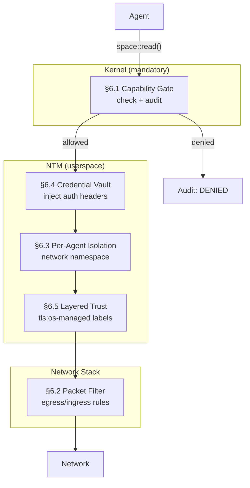
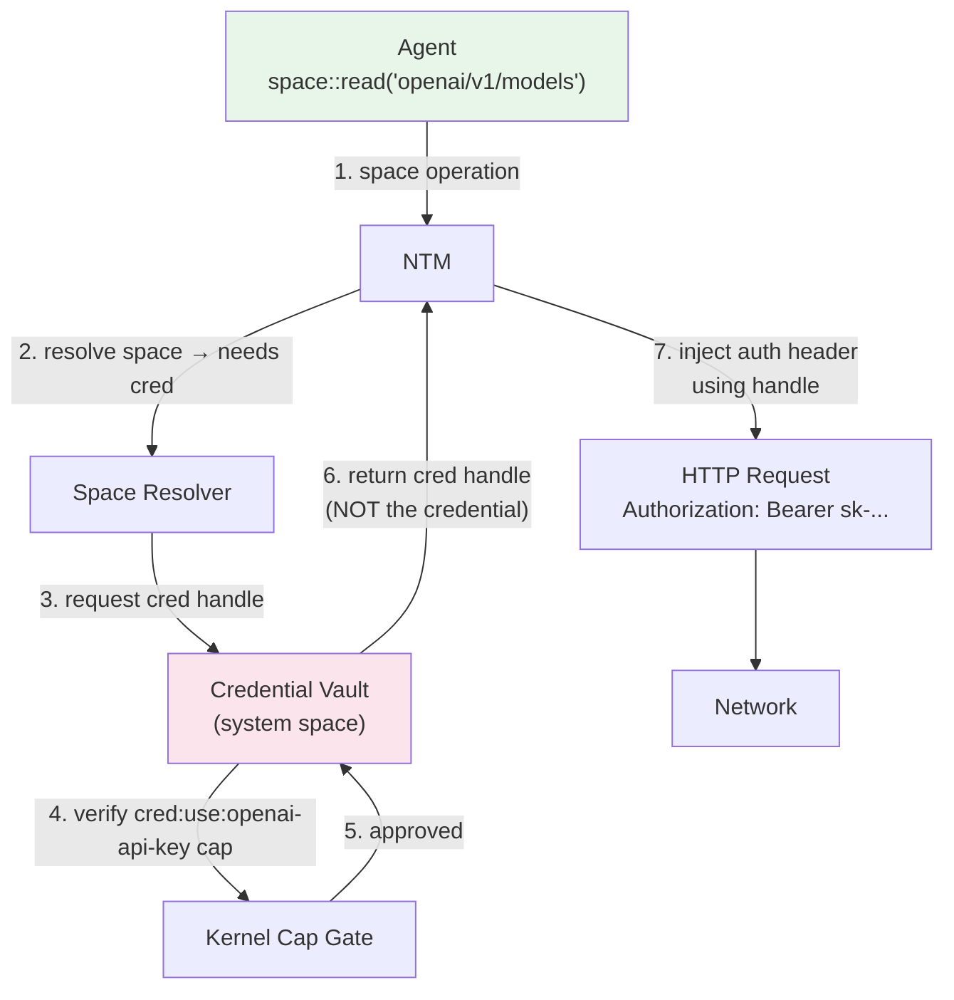

# AIOS Networking — Network Security

**Part of:** [networking.md](../networking.md) — Network Translation Module
**Related:** [components.md](./components.md) — Capability Gate summary (§3.5), [protocols.md](./protocols.md) — TLS architecture, [../../security/model.md](../../security/model.md) — Security model

-----

## 6. Network Security

AIOS networking security is built on three pillars: **capability enforcement** (who can talk to what), **packet filtering** (what traffic is allowed on the wire), and **credential isolation** (secrets never touch application code). Together they provide defense in depth — even if one layer is compromised, the others prevent data exfiltration.



-----

### 6.1 Kernel Capability Gate

The capability gate is the only mandatory kernel component in the networking subsystem. Every network operation passes through it before reaching the NTM. It is non-negotiable and non-bypassable.

#### 6.1.1 Gate Architecture

```rust
/// Kernel-level network capability enforcement.
/// A few hundred lines of kernel code — the minimum kernel surface.
fn network_gate(
    agent: AgentId,
    operation: NetOperation,
    destination: &ServiceTarget,
) -> Result<GateToken, SpaceError> {
    // 1. Look up agent's capability table
    let caps = capability_store.get(agent)?;

    // 2. Check if any capability permits this operation
    let matching_cap = caps.find_network_cap(operation, destination);

    // 3. Audit the decision (always, even for allowed operations)
    audit_log(AuditEntry {
        timestamp: now(),
        agent,
        operation,
        destination: destination.clone(),
        decision: if matching_cap.is_some() { "ALLOWED" } else { "DENIED" },
        capability: matching_cap.map(|c| c.id()),
    });

    // 4. Return gate token (proof of authorization) or error
    match matching_cap {
        Some(cap) => Ok(GateToken::new(cap, destination)),
        None => Err(SpaceError::PermissionDenied),
    }
}
```

The gate enforces WHO can talk to WHAT. It doesn't understand HTTP or manage TLS. It checks capabilities and logs everything.

#### 6.1.2 Capability Granularity

Network capabilities are fine-grained — not "can access the network" but "can read from this specific space":

```text
Capability: net:read:openai/v1/models
    Grants: Read objects from the "openai/v1/models" space
    Denies: Everything else

    Can:    GET https://api.openai.com/v1/models
    Cannot: GET https://api.openai.com/v1/completions  (different space)
    Cannot: POST https://api.openai.com/v1/models       (write, not read)
    Cannot: GET https://evil.com/exfiltrate              (different space)
    Cannot: TCP connect to 192.168.1.1:22                (no raw socket cap)
```

Capabilities support attenuation — a delegated capability can only be narrower than its parent. An agent with `net:read:openai/v1` can delegate `net:read:openai/v1/models` to a sub-agent, but cannot grant `net:write:openai/v1` (broader operation) or `net:read:anthropic/v1` (different space).

#### 6.1.3 Gate Token

The gate token is a proof-of-authorization that the NTM uses to proceed with the network operation. Tokens are:

- **Short-lived** — valid for a single operation or a bounded time window
- **Unforgeable** — generated by the kernel, verified by the NTM
- **Auditable** — every token issuance is logged

```rust
/// Proof that the kernel approved a network operation.
/// Passed from kernel gate to NTM, verified before I/O.
pub struct GateToken {
    /// The capability that authorized this operation
    cap_id: CapabilityTokenId,
    /// Target destination
    destination: ServiceTarget,
    /// Expiry (tokens are short-lived)
    expires: Timestamp,
    /// HMAC for integrity (kernel-only key)
    signature: [u8; 32],
}
```

-----

### 6.2 Packet Filtering

Below the NTM, the network stack enforces packet-level filtering rules derived from capabilities. This provides defense in depth — even if the NTM has a bug, the packet filter prevents unauthorized traffic.

#### 6.2.1 Capability-Derived Filter Rules

Instead of traditional firewall rules (static IP/port pairs), AIOS derives packet filter rules from active capabilities:

```text
Agent "research-assistant" has capabilities:
    net:read:openai/v1
    net:read:arxiv/papers

Derived filter rules (automatically generated):
    ALLOW TCP OUT → api.openai.com:443 (agent=research-assistant)
    ALLOW TCP OUT → export.arxiv.org:443 (agent=research-assistant)
    DENY  ALL OUT → * (agent=research-assistant, default deny)
```

Rules are updated dynamically when capabilities are granted or revoked. There is no static firewall configuration file.

#### 6.2.2 Filter Architecture

The packet filter operates at the smoltcp interface level, inspecting packets before they reach the wire:

```rust
/// Packet filter rule derived from active capabilities.
pub struct FilterRule {
    /// Agent this rule applies to
    agent: AgentId,
    /// Allowed direction
    direction: Direction,
    /// Allowed protocol
    protocol: IpProtocol,
    /// Allowed destination (IP or hostname resolved to IP)
    destination: FilterDestination,
    /// Allowed port range
    port_range: (u16, u16),
    /// Action
    action: FilterAction,
}

pub enum Direction {
    Egress,   // Agent → network
    Ingress,  // Network → agent
}

pub enum FilterAction {
    Allow,
    Deny,
    Log,      // Allow but log (for monitoring mode)
}
```

#### 6.2.3 Default Deny

The filter operates on a default-deny basis:

```text
Rule evaluation order:
    1. Check agent-specific ALLOW rules (from capabilities)
    2. Check system-wide ALLOW rules (DNS, DHCP, NTP)
    3. DEFAULT DENY — drop packet, log attempt

System-wide ALLOW rules (always permitted):
    ALLOW UDP OUT → dhcp-server:67    (DHCP client)
    ALLOW UDP OUT → dns-server:53     (DNS resolution)
    ALLOW UDP OUT → ntp-server:123    (Time sync)
    ALLOW ICMP OUT → *                (Ping, path MTU)
```

#### 6.2.4 No eBPF — Capability-Native Filtering

Traditional OSes use eBPF for programmable packet filtering. AIOS doesn't need eBPF because capabilities already express the filtering policy at a higher level of abstraction:

```text
eBPF approach (Linux):
    Write BPF program → load into kernel → attach to interface
    Program inspects packet headers → returns allow/deny
    Complex, powerful, but also a large attack surface

AIOS approach:
    Agent declares space capabilities in manifest
    Kernel derives filter rules from capabilities
    Filter is declarative, not programmable
    No new code runs in the kernel — just capability matching

Trade-off: Less flexible (can't do deep packet inspection in the filter)
Benefit: No eBPF verifier needed, no BPF programs in kernel, smaller attack surface
```

For use cases requiring deep packet inspection (malware scanning, content filtering), the NTM's userspace services handle inspection above the packet filter layer.

-----

### 6.3 Per-Agent Network Isolation

Each agent's network traffic is isolated from other agents, preventing cross-agent packet snooping or traffic analysis.

#### 6.3.1 Isolation Mechanisms

```text
Layer 1: Capability isolation (kernel)
    Each agent has its own capability table.
    Agent A's capabilities are invisible to Agent B.

Layer 2: Connection isolation (NTM)
    Each agent's connections are tracked separately.
    Agent A cannot see or access Agent B's connection pool.
    HTTP/2 streams are logically separated per agent.

Layer 3: Socket isolation (smoltcp)
    Each agent's sockets have separate buffers.
    No shared state between agents at the socket level.

Layer 4: Address space isolation (kernel)
    Agent address spaces are separated (TTBR0 per process).
    DMA buffers are mapped only into the owning agent's space.
```

#### 6.3.2 Traffic Separation

Even when multiple agents connect to the same remote host, their traffic is logically separated:

```text
Agent A: space::read("github/api/repos")   → HTTP/2 stream 1 on conn #1
Agent B: space::read("github/api/users")   → HTTP/2 stream 3 on conn #1
Agent C: space::read("github/api/issues")  → HTTP/2 stream 5 on conn #1

All share one TCP connection for efficiency,
but Agent A cannot read Agent B's response.
The NTM routes each response to the correct agent.
```

#### 6.3.3 POSIX Process Isolation

Legacy POSIX processes get the same isolation treatment:

```text
Process running curl:
    1. Process calls socket() → POSIX layer allocates space channel
    2. Process calls connect() → Capability gate checks net:raw:<host>:<port>
    3. If allowed: traffic routed through NTM
    4. If denied: connect() returns EACCES
    5. Process cannot see other processes' sockets or traffic
```

-----

### 6.4 Credential Vault

The credential vault stores API keys, tokens, certificates, and passwords. Agents use credentials without possessing them — the NTM injects credentials into outgoing requests.

#### 6.4.1 Credential Architecture



#### 6.4.2 Credential Storage

```rust
/// Credential stored in the system credential space.
/// Never accessible to agents — only usable via handles.
pub struct StoredCredential {
    /// Unique identifier
    id: CredentialId,
    /// Human-readable name (e.g., "openai-api-key")
    name: String,
    /// The secret value (encrypted at rest)
    value: EncryptedValue,
    /// How to inject this credential into requests
    injection: CredentialInjection,
    /// Which spaces this credential applies to
    scope: Vec<RemoteSpaceId>,
    /// Expiry (for tokens with limited lifetime)
    expires: Option<Timestamp>,
    /// Who created this credential
    source: CredentialSource,
}

pub enum CredentialInjection {
    /// HTTP Authorization header
    BearerToken,
    /// HTTP Basic auth
    BasicAuth { username: String },
    /// Custom HTTP header
    Header { name: String },
    /// URL query parameter (not recommended)
    QueryParam { name: String },
    /// mTLS client certificate
    ClientCert,
}

pub enum CredentialSource {
    UserManual,       // aios credential add ...
    AgentRequest,     // agent requested during install (user approved)
    OAuthFlow,        // OAuth2 authorization code flow
    SystemGenerated,  // device certificates, mTLS
}
```

#### 6.4.3 Credential Lifecycle

```text
Creation:
    aios credential add openai-api-key "sk-..."
    → Encrypted with device key
    → Stored in credential space
    → Space registry updated: openai/v1 → auth: Bearer(cred:openai-api-key)

Usage:
    Agent calls space::read("openai/v1/models")
    → NTM resolves space, finds credential reference
    → NTM requests credential handle from vault
    → Vault checks agent's cred:use:openai-api-key capability
    → Vault returns handle (not the credential itself)
    → NTM uses handle to inject Authorization header
    → Credential value never in agent's address space

Rotation:
    aios credential rotate openai-api-key "sk-new-..."
    → Old value replaced with new value
    → All active connections to openai/v1 are refreshed
    → No agent code changes needed

Revocation:
    aios credential remove openai-api-key
    → Credential deleted from vault
    → Active connections using this credential are terminated
    → Agents get SpaceError::PermissionDenied on next operation
```

#### 6.4.4 OAuth2 Integration

For services that use OAuth2, the credential vault manages the token lifecycle:

```text
OAuth2 flow:
    1. Agent requests access to "google/drive" space
    2. NTM detects OAuth2 auth requirement
    3. OS opens browser to Google OAuth consent page
    4. User authorizes access
    5. OAuth2 authorization code exchanged for tokens
    6. Access token stored in credential vault
    7. Refresh token stored in credential vault (separate, higher security)
    8. NTM uses access token for API calls
    9. When access token expires, NTM uses refresh token to get new one
    10. Agent never sees any token at any point
```

-----

### 6.5 Layered Trust Model

The networking subsystem follows the "mandatory kernel gate + optional userspace services" pattern from the [subsystem framework](../subsystem-framework.md). This creates a layered trust model visible to users.

#### 6.5.1 Mandatory vs Optional Services

```text
Mandatory (kernel):
    Capability gate — every network operation checked

Strongly recommended (userspace):
    OS TLS Service — connection pooling, session resumption,
        certificate pinning, unified trust store
    OS DNS Service — encrypted DNS (DoH/DoT), caching, audit

Optional (userspace):
    OS HTTP Service — connection pooling, response caching,
        compression, retry, rate limit management
```

Agents CAN bypass the optional services (e.g., do their own TLS). But this is visible to the user through trust labels.

#### 6.5.2 Trust Labels

The layered approach creates visible trust signals for the user:

```text
Agent A: net(api.weather.gov), tls(os-managed), http(os-managed), dns(os-managed)
  → "Fully auditable. Maximum trust."

Agent B: net(custom-server.io), tls(os-managed), http(self-managed), dns(os-managed)
  → "Custom protocol over OS-verified TLS."

Agent C: net(*.onion), tls(self-managed), dns(self-managed)
  → "Manages own encryption and DNS. OS verifies destination only."
```

The user sees meaningful information, not IP addresses and port numbers. Trust labels are displayed in the Inspector ([inspector.md](../../applications/inspector.md)).

#### 6.5.3 Browser Exception

The web browser is the one agent where OS-managed TLS and HTTP are **mandatory, not optional**. The browser runs arbitrary, untrusted code (JavaScript) from any website. The browser agent cannot opt out of OS network management because its execution environment is fundamentally untrusted.

```text
Browser agent trust constraints:
    tls: os-managed (MANDATORY — no self-managed TLS)
    http: os-managed (MANDATORY — no raw socket access)
    dns: os-managed (MANDATORY — no DNS bypass)
    credentials: os-managed (MANDATORY — no credential access)
    origin isolation: enforced (each origin is a separate space)
```

For the browser's network architecture, see [browser.md](../../applications/browser.md).

#### 6.5.4 Audit Integration

Every network operation is logged in the audit ring with sufficient detail for forensic analysis:

```text
Audit entry fields:
    timestamp       — when the operation occurred
    agent_id        — which agent initiated it
    operation       — read/write/subscribe/query
    space_id        — target remote space
    capability_id   — which capability authorized it
    decision        — ALLOWED or DENIED
    protocol        — HTTP/2, QUIC, AIOS Peer, etc.
    tls_managed     — os-managed or self-managed
    destination     — resolved IP:port (for forensic correlation)
    bytes_sent      — request size
    bytes_received  — response size
    latency_ms      — operation duration
    error           — if operation failed, the SpaceError variant
```

The audit ring is accessible via the Inspector and via the kernel audit syscall (syscall 29). See [security/model/operations.md §7](../../security/model/operations.md) for audit architecture.
