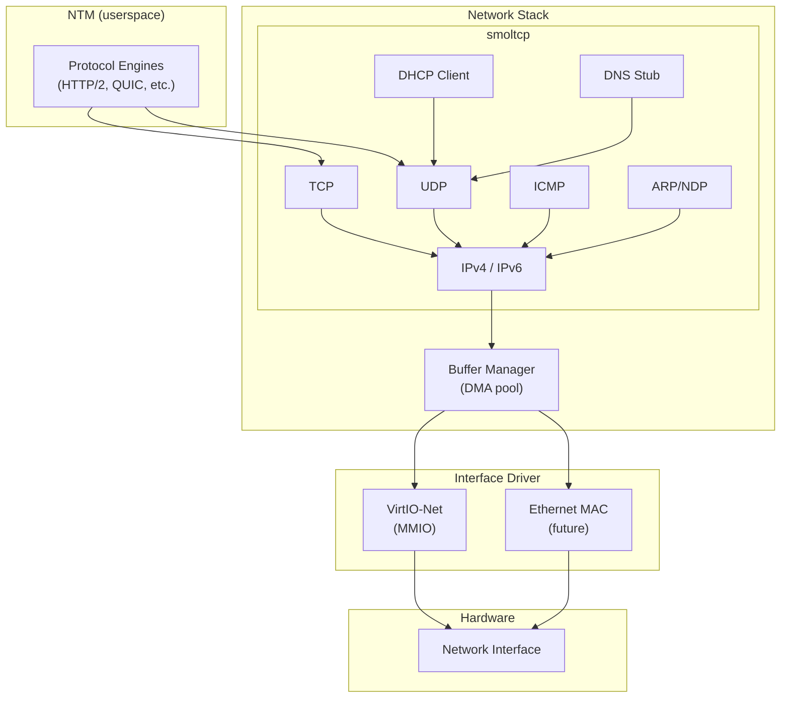
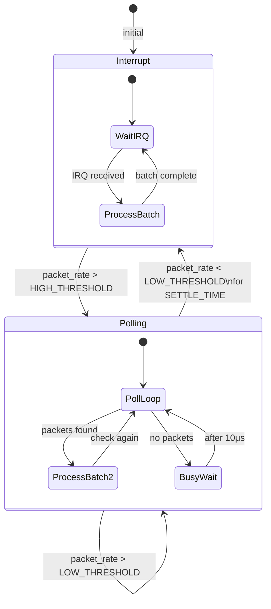

# AIOS Networking — Network Stack

**Part of:** [networking.md](../networking.md) — Network Translation Module
**Related:** [components.md](./components.md) — NTM components, [protocols.md](./protocols.md) — Protocol engines, [security.md](./security.md) — Network security

-----

## 4. Network Stack

The network stack sits between the protocol engines (§5) and the hardware drivers. It provides TCP/IP networking using smoltcp, a pure-Rust, no_std-compatible TCP/IP stack. This section covers the integration architecture, driver design, buffer management, and I/O paths.



-----

### 4.1 smoltcp Integration

[smoltcp](https://github.com/smoltcp-rs/smoltcp) is a standalone, event-driven TCP/IP stack designed for bare-metal and embedded systems. It provides TCP, UDP, ICMP, ARP, NDP, DHCP, and DNS — everything AIOS needs for Phase 7.

#### 4.1.1 Why smoltcp

| Requirement | smoltcp | Alternative |
|---|---|---|
| `no_std` compatible | Yes | lwIP requires C FFI |
| Pure Rust | Yes | Most stacks are C |
| Event-driven (no threads) | Yes | Many require async runtime |
| BSD-2-Clause | Yes | GPL stacks excluded |
| Production use | Hubris, Tock, embassy | Proven in real RTOS |

smoltcp's design aligns with AIOS's architecture: it doesn't own sockets or manage threads. It processes packets when polled, and the OS controls the polling schedule. This fits the subsystem framework's session model — the OS manages lifecycle, smoltcp handles protocol logic.

#### 4.1.2 Integration Architecture

AIOS integrates smoltcp through the `smoltcp::phy::Device` trait:

```rust
/// AIOS network device implementing smoltcp's Device trait.
/// Bridges between smoltcp's packet processing and VirtIO-Net I/O.
pub struct AiosNetDevice {
    /// VirtIO-Net driver instance
    driver: VirtioNetDriver,
    /// DMA buffer pool for packet I/O
    buffer_pool: PacketBufferPool,
    /// Receive buffer ring (filled by driver, consumed by smoltcp)
    rx_ring: RingBuffer<PacketBuffer>,
    /// Transmit buffer ring (filled by smoltcp, consumed by driver)
    tx_ring: RingBuffer<PacketBuffer>,
}

/// smoltcp Device trait implementation
impl smoltcp::phy::Device for AiosNetDevice {
    type RxToken<'a> = AiosRxToken<'a>;
    type TxToken<'a> = AiosTxToken<'a>;

    fn receive(&mut self, _timestamp: Instant)
        -> Option<(Self::RxToken<'_>, Self::TxToken<'_>)>
    {
        // Poll VirtIO-Net RX virtqueue for completed buffers
        // Return token pair if packet available
    }

    fn transmit(&mut self, _timestamp: Instant)
        -> Option<Self::TxToken<'_>>
    {
        // Return TX token if buffer space available in TX virtqueue
    }

    fn capabilities(&self) -> DeviceCapabilities {
        // Report MTU, checksum offload, etc.
    }
}
```

#### 4.1.3 Socket Management

smoltcp sockets are managed by the NTM, not by individual agents:

```rust
/// Network stack state — owned by the NTM service
pub struct NetworkStack {
    /// smoltcp interface (sockets + routing)
    iface: Interface,
    /// Socket set (all active sockets)
    sockets: SocketSet<'static>,
    /// Device instance
    device: AiosNetDevice,
    /// Socket-to-agent mapping (for capability enforcement)
    socket_owners: BTreeMap<SocketHandle, AgentId>,
    /// DHCP socket handle (always present)
    dhcp_handle: SocketHandle,
}

impl NetworkStack {
    /// Process all pending network events.
    /// Called from the network service loop or on interrupt.
    pub fn poll(&mut self, now: Instant) {
        self.iface.poll(now, &mut self.device, &mut self.sockets);
    }

    /// Create a TCP socket for an agent's space operation.
    /// Returns a handle that the NTM uses internally.
    pub fn tcp_connect(
        &mut self,
        agent: AgentId,
        endpoint: &SpaceEndpoint,
    ) -> Result<SocketHandle, SpaceError> {
        // 1. Verify capability (done by capability gate before we get here)
        // 2. Allocate socket from pool
        // 3. Bind to ephemeral port
        // 4. Initiate TCP handshake
        // 5. Track ownership for cleanup
    }
}
```

#### 4.1.4 Polling Strategy

smoltcp requires periodic polling to process packets. AIOS uses a hybrid approach:

```text
Interrupt-driven (Phase 7+):
    VirtIO-Net raises IRQ on packet arrival
    → GICv3 routes to handler
    → Handler signals network service thread
    → Service thread calls NetworkStack::poll()

Adaptive polling (Phase 16+):
    High traffic: switch to polling mode (check every 100μs)
    Low traffic: switch to interrupt mode (wake on packet)
    Threshold: >1000 packets/sec sustained → polling mode

Idle coalescing:
    If no packets for 10ms → deep sleep
    If no packets for 100ms → allow CPU frequency scaling
```

The polling strategy integrates with the power management framework ([power-management.md](../power-management.md)) to balance latency against power consumption.

-----

### 4.2 VirtIO-Net Driver

The VirtIO-Net driver follows the same MMIO transport pattern as the existing VirtIO-blk driver (`kernel/src/drivers/virtio_blk.rs`) but with network-specific virtqueues and interrupt-driven I/O.

#### 4.2.1 VirtIO-Net Device Layout

```text
VirtIO-Net MMIO registers (virtio spec §5.1):
    Offset  Register              Purpose
    0x000   MagicValue            Must be 0x74726976 ("virt")
    0x004   Version               Device version (legacy=1, modern=2)
    0x008   DeviceID              1 = net (vs 2 = blk)
    0x00C   VendorID              Subsystem vendor
    0x010   DeviceFeatures        Feature bits (see §4.2.2)
    0x014   DeviceFeaturesSel     Feature word selector
    0x020   DriverFeatures        Features accepted by driver
    0x024   DriverFeaturesSel     Feature word selector
    0x030   QueueSel              Select virtqueue
    0x034   QueueNumMax           Max queue size
    0x038   QueueNum              Current queue size
    0x044   QueueReady            Queue ready bit
    0x050   QueueNotify           Notify queue (write-only)
    0x060   InterruptStatus       Interrupt reason
    0x064   InterruptACK          Acknowledge interrupt
    0x070   Status                Device status
    0x100   Config                Device-specific config (MAC address, status, etc.)
```

#### 4.2.2 Feature Negotiation

```rust
/// VirtIO-Net feature bits relevant to AIOS
pub struct VirtioNetFeatures {
    /// MAC address available in config space
    mac: bool,              // VIRTIO_NET_F_MAC (bit 5)
    /// Device supports link status reporting
    status: bool,           // VIRTIO_NET_F_STATUS (bit 16)
    /// Mergeable receive buffers (larger packets without scatter-gather)
    mrg_rxbuf: bool,        // VIRTIO_NET_F_MRG_RXBUF (bit 15)
    /// Checksum offload
    csum: bool,             // VIRTIO_NET_F_CSUM (bit 0)
    /// Guest-side checksum offload
    guest_csum: bool,       // VIRTIO_NET_F_GUEST_CSUM (bit 1)
    /// Multi-queue support (one RX/TX pair per CPU)
    mq: bool,               // VIRTIO_NET_F_MQ (bit 22)
    /// Control virtqueue available
    ctrl_vq: bool,          // VIRTIO_NET_F_CTRL_VQ (bit 17)
}
```

#### 4.2.3 Virtqueue Layout

VirtIO-Net uses three virtqueues (vs VirtIO-blk's one):

```text
Queue 0: Receive (RX)
    Host → Guest packets
    Pre-filled with empty buffers
    Interrupt on completion

Queue 1: Transmit (TX)
    Guest → Host packets
    Filled with outgoing packets
    Polled for completion (reclaim buffers)

Queue 2: Control (optional)
    Configuration changes
    MAC filter, VLAN, multiqueue setup
    Not needed for basic operation
```

#### 4.2.4 Driver Architecture

```rust
/// VirtIO-Net MMIO driver
pub struct VirtioNetDriver {
    /// MMIO base address (mapped via MMIO_BASE)
    base: VirtAddr,
    /// Receive virtqueue
    rx_queue: Virtqueue,
    /// Transmit virtqueue
    tx_queue: Virtqueue,
    /// MAC address (from device config)
    mac: [u8; 6],
    /// Link status
    link_up: bool,
    /// Statistics
    stats: NetDriverStats,
}

/// Driver statistics
pub struct NetDriverStats {
    rx_packets: u64,
    tx_packets: u64,
    rx_bytes: u64,
    tx_bytes: u64,
    rx_dropped: u64,   // No buffer available
    tx_dropped: u64,    // Queue full
    rx_errors: u64,
    tx_errors: u64,
}

impl VirtioNetDriver {
    /// Probe for VirtIO-Net device at MMIO address.
    /// Same scan range as VirtIO-blk: 0x0A00_0000–0x0A00_3E00.
    pub fn probe(base: VirtAddr) -> Option<Self> {
        // Check magic, version, device_id == 1
    }

    /// Initialize the driver: negotiate features, set up virtqueues,
    /// pre-fill RX queue with buffers, enable interrupts.
    pub fn init(&mut self) -> Result<(), DriverError> {
        // 1. Reset device
        // 2. Acknowledge, set DRIVER status
        // 3. Read features, negotiate (accept MAC, MRG_RXBUF, CSUM)
        // 4. Set FEATURES_OK
        // 5. Configure RX/TX queues
        // 6. Pre-fill RX queue with packet buffers from DMA pool
        // 7. Set DRIVER_OK
        // 8. Register IRQ handler with GICv3
    }

    /// Receive a packet from the RX virtqueue.
    /// Returns None if no packets are pending.
    pub fn recv(&mut self) -> Option<PacketBuffer> {
        // Check used ring for completed RX descriptors
        // Extract packet data
        // Replenish RX queue with fresh buffer
    }

    /// Transmit a packet via the TX virtqueue.
    pub fn send(&mut self, packet: &PacketBuffer) -> Result<(), DriverError> {
        // Place packet in available ring
        // Notify device
        // Reclaim completed TX buffers
    }
}
```

#### 4.2.5 Interrupt Handling

```text
VirtIO-Net IRQ flow:

    1. Device completes RX (packet arrived) or TX (send complete)
    2. Device sets InterruptStatus register
    3. GICv3 delivers IRQ to target CPU (SPI, configured during init)
    4. irq_handler_el1 dispatches to virtio_net_irq_handler
    5. Handler:
       a. Read InterruptStatus (bit 0 = used buffer, bit 1 = config change)
       b. ACK interrupt (write to InterruptACK)
       c. If used buffer: signal network service thread (unblock from wait)
       d. If config change: check link status, update NetworkStack
    6. Network service thread wakes, calls NetworkStack::poll()
```

The IRQ is registered with GICv3 as a shared peripheral interrupt (SPI). On QEMU virt, VirtIO MMIO devices use SPI 48+ (IRQ 32 + device index). The exact INTID is discovered from the DTB.

-----

### 4.3 Buffer Management

Network I/O requires careful buffer management to minimize copying and avoid allocation in the hot path.

#### 4.3.1 Packet Buffer Pool

```rust
/// Pre-allocated pool of packet buffers for DMA I/O.
/// Allocated from the DMA page pool to ensure physical contiguity
/// for VirtIO descriptor rings.
pub struct PacketBufferPool {
    /// Free buffer list (lock-free stack for fast alloc/free)
    free_list: AtomicStack<PacketBuffer>,
    /// Total buffers in pool
    capacity: usize,
    /// Buffer size (MTU + headers, typically 2048 bytes)
    buffer_size: usize,
    /// Backing DMA pages
    dma_pages: &'static [PhysAddr],
}

/// A single packet buffer — thin wrapper around a DMA-safe region.
pub struct PacketBuffer {
    /// Virtual address of buffer start
    data: *mut u8,
    /// Physical address (for VirtIO descriptors)
    phys: PhysAddr,
    /// Current data length (valid bytes)
    len: usize,
    /// Buffer capacity
    capacity: usize,
    /// Offset to start of packet data (after virtio-net header)
    data_offset: usize,
}
```

The pool is pre-allocated at boot from the DMA page pool (`Pool::Dma`, 64 MB on QEMU). Initial pool size: 256 buffers × 2048 bytes = 512 KiB. The pool grows on demand up to a configurable maximum (default: 4096 buffers = 8 MiB).

#### 4.3.2 Buffer Lifecycle

```text
RX path:
    1. PacketBufferPool::alloc() → empty buffer
    2. Buffer placed in VirtIO RX available ring (phys addr)
    3. Device fills buffer with received packet
    4. Driver retrieves from used ring
    5. Buffer passed to smoltcp for protocol processing
    6. Data consumed by NTM/protocol engine
    7. PacketBufferPool::free() → buffer returned to pool

TX path:
    1. Protocol engine fills packet data
    2. smoltcp produces raw frame via AiosTxToken::consume()
    3. Buffer placed in VirtIO TX available ring
    4. Device transmits packet
    5. Driver reclaims from used ring
    6. PacketBufferPool::free() → buffer returned to pool
```

#### 4.3.3 DMA Safety

VirtIO requires physical addresses in descriptor rings. Buffer management must guarantee:

- **Physical contiguity** — each buffer is within a single page (2048B < 4096B page)
- **No deallocation while device owns buffer** — reference counting or ownership tracking
- **Cache coherence** — DMA buffers mapped with appropriate cache attributes (Attr0 = Device for MMIO, Attr3 = WB for data with explicit cache maintenance)
- **Alignment** — VirtIO descriptors require buffer addresses aligned to device requirements (typically 1 byte, but AIOS aligns to 64 bytes for cache line efficiency)

-----

### 4.4 Zero-Copy I/O Paths

The networking stack minimizes memory copies on the data path:

#### 4.4.1 Copy Counts by Path

```text
Receive path (NIC → application):
    Traditional OS:  NIC → kernel buffer → socket buffer → user buffer (3 copies)
    AIOS target:     NIC → DMA buffer → application mapping (1 copy)

    Phase 7:   NIC → DMA → smoltcp → NTM → agent (2 copies)
    Phase 16+: NIC → DMA → mapped to agent address space (1 copy)

Transmit path (application → NIC):
    Traditional OS:  user buffer → socket buffer → kernel buffer → NIC (3 copies)
    AIOS target:     application mapping → DMA buffer → NIC (1 copy)

    Phase 7:   agent → NTM → smoltcp → DMA → NIC (2 copies)
    Phase 16+: agent buffer → DMA mapping → NIC (1 copy)
```

#### 4.4.2 Phase 7 Data Path

In Phase 7, the data path involves two copies — acceptable for initial bringup:

```text
RX: DMA buffer → smoltcp processes TCP/IP headers → payload copied to NTM buffer → NTM delivers to agent
TX: Agent writes to NTM buffer → NTM passes to smoltcp → smoltcp builds frame in DMA buffer → VirtIO sends
```

#### 4.4.3 Phase 16+ Zero-Copy Path

In Phase 16, the NTM maps DMA buffers directly into agent address spaces using shared memory regions (see [memory/virtual.md §7](../../kernel/memory/virtual.md)):

```text
RX: DMA buffer → smoltcp processes headers → payload region mapped read-only into agent address space
TX: Agent writes to pre-mapped DMA region → NTM triggers smoltcp to add headers → VirtIO sends from same buffer
```

This eliminates the NTM-to-agent copy, achieving a true single-copy path. The mapping is read-only for RX (W^X enforced) and write-only for TX (agent cannot read other agents' pending transmissions).

-----

### 4.5 Interrupt Handling and Adaptive Polling

#### 4.5.1 Interrupt Coalescing

The VirtIO-Net device supports interrupt coalescing through the `VIRTIO_NET_F_NOTF_COAL` feature (virtio spec 1.2+). When available:

```text
Coalescing parameters:
    rx_max_packets: 32    — interrupt after 32 packets received
    rx_max_usecs: 100     — or after 100μs, whichever comes first
    tx_max_packets: 64    — reclaim TX after 64 completions
    tx_max_usecs: 200     — or after 200μs
```

When `VIRTIO_NET_F_NOTF_COAL` is not available (older QEMU versions), software coalescing is used: the IRQ handler processes all pending packets before returning, and re-enables the interrupt only after the queue is drained.

#### 4.5.2 Adaptive Polling (NAPI-like)

Inspired by Linux NAPI (New API for network drivers), AIOS implements adaptive polling:



```text
HIGH_THRESHOLD: 1000 packets/sec   → switch to polling
LOW_THRESHOLD:  100 packets/sec    → switch to interrupt
SETTLE_TIME:    50ms               → hysteresis to prevent oscillation
POLL_INTERVAL:  10μs               → busy-wait granularity in polling mode
BATCH_SIZE:     64 packets         → process up to 64 packets per poll
```

#### 4.5.3 Multi-Queue Support

When `VIRTIO_NET_F_MQ` is negotiated, the driver creates one RX/TX queue pair per CPU core:

```text
Core 0: RX queue 0, TX queue 0   → handles packets for CPU 0
Core 1: RX queue 1, TX queue 1   → handles packets for CPU 1
Core 2: RX queue 2, TX queue 2   → handles packets for CPU 2
Core 3: RX queue 3, TX queue 3   → handles packets for CPU 3
```

Each queue pair has its own interrupt, routed to its owning CPU via GICv3 SPI affinity. This eliminates cross-core contention and enables linear scaling with core count.

The receive steering (RSS/RFS) is configured via the control virtqueue to distribute incoming packets by connection (5-tuple hash: src IP, dst IP, src port, dst port, protocol).

-----

### 4.6 DHCP and DNS

#### 4.6.1 DHCP Client

AIOS uses smoltcp's built-in DHCP client for address acquisition on Ethernet/WiFi interfaces:

```text
DHCP process:
    1. Interface comes up (link detected)
    2. smoltcp DHCP socket sends DISCOVER
    3. Server responds with OFFER
    4. Client sends REQUEST
    5. Server responds with ACK
    6. NetworkStack updates interface IP/gateway/DNS
    7. Renewal timer set to lease/2

DHCP provides:
    - IP address + subnet mask
    - Default gateway
    - DNS server addresses
    - Lease duration
    - Domain search list
```

For QEMU virt, the built-in DHCP server provides addresses in the 10.0.2.0/24 range with gateway 10.0.2.2 and DNS 10.0.2.3.

#### 4.6.2 DNS Resolution

DNS resolution is provided at two levels:

```text
Level 1: smoltcp DNS stub (Phase 7)
    - Simple recursive DNS queries over UDP
    - Single upstream server (from DHCP or static config)
    - Response caching with TTL
    - Sufficient for POSIX compat (curl, ssh)

Level 2: hickory-dns client (Phase 16)
    - DNS-over-HTTPS (DoH) and DNS-over-TLS (DoT)
    - DNSSEC validation
    - Encrypted queries (privacy)
    - Integration with Space Resolver for semantic name resolution
    - Falls back to Level 1 if encrypted DNS unavailable
```

DNS results are cached in a dedicated DNS cache space, shared across all agents. The cache respects TTL values and supports negative caching (NXDOMAIN cached for 300 seconds by default).

-----

### 4.7 IPv4/IPv6 Dual Stack

AIOS supports both IPv4 and IPv6, with IPv6 preferred when available:

#### 4.7.1 Address Configuration

```text
IPv4:
    - DHCP (primary)
    - Static configuration (fallback)
    - Link-local (169.254.0.0/16) if DHCP unavailable

IPv6:
    - SLAAC (Stateless Address Autoconfiguration) via NDP
    - DHCPv6 (if available)
    - Link-local (fe80::/10) always present
    - Privacy extensions (RFC 4941) for temporary addresses
```

#### 4.7.2 Protocol Selection

The NTM's Space Resolver produces addresses for both IPv4 and IPv6 when both are available. The Connection Manager uses the Happy Eyeballs algorithm (RFC 8305) to select the fastest:

```text
Happy Eyeballs for space::remote("example.com"):
    1. DNS query returns: A = 93.184.216.34, AAAA = 2606:2800:220:1::248
    2. Start IPv6 connection attempt
    3. After 250ms, start IPv4 connection attempt in parallel
    4. Use whichever connects first
    5. Cache winning address family for future connections to this space
```

This ensures optimal connectivity without requiring agents to understand or choose IP versions.

#### 4.7.3 smoltcp IPv6 Support

smoltcp provides full IPv6 support including:

- Neighbor Discovery Protocol (NDP) — replaces ARP
- SLAAC — automatic address configuration from router advertisements
- ICMPv6 — ping, path MTU discovery, unreachable notifications
- IPv6 extension headers — hop-by-hop, routing, fragment

The stack processes IPv4 and IPv6 packets through the same socket interface, presenting a unified API to the NTM.
